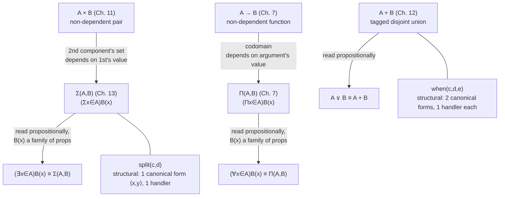

# Disjoint Unions and the Existential Quantifier

[[book-guidelines|↩ Back to guidelines]]

## What breaks without recording which side you proved

Chapter 9's conjunction gave you $A\ \&\ B \equiv A\times B$: to prove "$A$ and $B$," you must produce *both* a proof of $A$ and a proof of $B$, bundled as a pair. The dual question is: what does it take to prove "$A$ or $B$"?

Classically, the answer is almost nothing — $A\vee B$ is true the moment at least one of $A$, $B$ is true, and classical logic doesn't ask *which*. A classical proof of $A\vee B$ can be a pure existence argument: assume $\neg A\wedge\neg B$, derive a contradiction, conclude $A\vee B$, and walk away without ever knowing which disjunct actually holds. This is exactly what proof by contradiction buys you, and it's exactly what a constructive reading has to refuse.

Here's why refusing it is forced, not just philosophically fussy. In this book a proposition is a set, and a proof is a program that produces an element of that set — an object you can hand to a computer and *run*. If $A\vee B$ is going to have any computational content at all, a proof of it has to be a piece of data that a later piece of code can branch on: "if I'm looking at the $A$-case, do this; if I'm looking at the $B$-case, do that." A proof that only asserts "one of them holds, I won't say which" gives that later code nothing to branch on — there is no program you could write that consumes such a proof and behaves correctly in both cases, because it has no way to *tell* the cases apart. Concretely: a proof that "$n$ is even or $n$ is odd" is useless for actually computing $n/2$ unless [[The-Universe-of-Small-Sets#The proof|the proof]] itself tells you which case you're in and hands you the corresponding witness (the quotient, or the quotient-and-remainder). This is precisely the shape of the worked "even or odd" derivation the book carries out a few chapters later (§21.2).

So a constructive proof of $A\vee B$ must be a **tagged** value: a marker saying "left" or "right," together with a proof of whichever side the marker names. That's not extra ceremony bolted onto disjunction — it *is* disjunction, once you insist that proofs be programs. The set that has exactly this shape is the topic of this chapter: the **disjoint union** of two sets, $A+B$.

If you've written any Rust, you already have the right mental model sitting in the standard library, minus the name:

```rust
enum Either<A, B> {
    Inl(A),
    Inr(B),
}
```

A value of `Either<A, B>` is unavoidably tagged — you cannot construct one without committing to `Inl` or `Inr` — and consuming one forces a `match` that handles both tags. That "no anonymous inhabitant, no untagged consumption" discipline is exactly the discipline Martin-Löf's $A+B$ formalizes.

## Disjoint union of two sets: $A+B$

The book introduces $+$ as a new primitive constant of arity $0\otimes 0\to 0$ — it consumes two sets and yields a set — with the usual infix abbreviation:
$$A+B \equiv {+}(A,B).$$

$$
\textbf{$+$–formation}\quad\frac{A\ set\qquad B\ set}{A+B\ set}
$$

To *populate* $A+B$, the book introduces two new canonical constants, $inl$ and $inr$ (for "in-left" and "in-right"), each of arity $0\to 0$ — each wraps a single element:

$$
\textbf{$+$–introduction}\quad
\frac{a\in A\qquad B\ set}{inl(a)\in A+B}
\qquad\qquad
\frac{A\ set\qquad b\in B}{inr(b)\in A+B}
$$

Every canonical element of $A+B$ is *either* $inl(a)$ for some $a\in A$ *or* $inr(b)$ for some $b\in B$ — there is no third canonical form, and the tag ($inl$ versus $inr$) is baked directly into which constructor was used, not into some separate flag that could in principle be dropped. This is the formal counterpart of `Either::Inl(a)` versus `Either::Inr(b)`: two disjoint constructors, each carrying exactly the payload its side needs.

### The selector $when$

Having elements is only useful once you can consume them, and consuming a tagged value means branching on the tag. The book's non-canonical selector for $+$ is $when$, of arity $0\otimes(0\to0)\otimes(0\to0)\to0$ — it takes the tagged value plus one handler abstraction per side. Its computation rule is stated directly, the same way the book handles every genuinely structural eliminator:

1. Evaluate $c$ to canonical form.
2. If the value of $c$ is $inl(a)$, continue by evaluating $d(a)$.
3. If the value of $c$ is $inr(b)$, continue by evaluating $e(b)$.

This is *not* a $\beta$-reduction shortcut the way $apply$ was for $\Pi$ — it is the "cover every canonical form" schema in its purest instance: $A+B$ has exactly two canonical shapes, and $when$ has exactly one handler per shape. From this computation rule the book derives the elimination rule, letting the result's set genuinely depend on which element of $A+B$ you started with:

$$
\textbf{$+$–elimination}\quad
\frac{
c\in A+B\qquad
C(v)\ set\ [v\in A+B]\qquad
d(x)\in C(inl(x))\ [x\in A]\qquad
e(y)\in C(inr(y))\ [y\in B]
}{
when(c,d,e)\in C(c)
}
$$

and the two [[Propositions-as-Sets-(The-Curry-Howard-Correspondence)#Equality|equality]] rules, one per constructor, that pin down what $when$ actually computes to:

$$
\textbf{$+$–equality}\quad
\frac{a\in A\qquad C(v)\ set\ [v\in A+B]\qquad d(x)\in C(inl(x))\ [x\in A]\qquad e(y)\in C(inr(y))\ [y\in B]}
{when(inl(a),d,e)=d(a)\in C(inl(a))}
$$
$$
\frac{b\in B\qquad C(v)\ set\ [v\in A+B]\qquad d(x)\in C(inl(x))\ [x\in A]\qquad e(y)\in C(inr(y))\ [y\in B]}
{when(inr(b),d,e)=e(b)\in C(inr(b))}
$$

Notice the shape of $C$: it's a family indexed by *all* of $A+B$, not two separate families for the two cases — the elimination rule is producing a single, dependently-typed case analysis, and the two branches $d$ and $e$ are only required to agree on the *set* they land in after you plug in $inl(x)$ or $inr(y)$ respectively. This is precisely a `match` arm's "each arm must return the same type" discipline, generalized to let the return *type* itself vary with which arm fired:

```rust
fn when<A, B, C>(c: Either<A, B>, d: impl Fn(A) -> C, e: impl Fn(B) -> C) -> C {
    match c {
        Either::Inl(a) => d(a),
        Either::Inr(b) => e(b),
    }
}
```

The Rust signature above is the non-dependent shadow of $+$-elimination — `C` is a single fixed type, not a family $C(v)$ that can look at *which* case `v` is in. That's an honest gap, and it's the same gap the $\Pi$-article's grounding hit with `B` in `A -> B`: Rust's `match` cannot make the return *type* of one arm differ from another's. Lean's `Or.elim`/`Sum.rec`, on the other hand, are the literal formal counterpart, dependent motive included:

```lean
-- Sum is the data-carrying version (matches +, A+B, computationally):
def whenSum {A B C : Type} (c : Sum A B) (d : A → C) (e : B → C) : C :=
  Sum.rec d e c

-- Or is the Prop-valued, proof-irrelevant version (matches ∨ once truth values are erased):
example (A B C : Prop) (c : A ∨ B) (d : A → C) (e : B → C) : C :=
  Or.elim c d e
```

`Sum.rec` (and, more generally, `Sum.casesOn`) is exactly $when$: a motive that may depend on the scrutinee, one handler per constructor, unconditionally covering both. Lean draws a distinction the book's basic set theory does not — data-carrying `Sum` versus proof-irrelevant `Or` in `Prop` — and it's worth flagging now, because the same distinction resurfaces below for $\Sigma$ and $\exists$.

## Disjunction: $A\vee B \equiv A+B$

Once $+$ is in hand, disjunction is a bare definition, not a new primitive:
$$A\vee B\equiv A+B.$$
Erasing the computational payload from $+$'s rules — reading "$A$ set" as "$A$ prop" and "$a\in A$" as "$A$ true" — gives exactly natural deduction's familiar rules for $\vee$:

$$
\textbf{$\vee$–formation}\ \frac{A\ prop\quad B\ prop}{A\vee B\ prop}
\qquad
\textbf{$\vee$–introduction}\ \frac{A\ true}{A\vee B\ true}\quad\frac{B\ true}{A\vee B\ true}
$$
$$
\textbf{$\vee$–elimination}\ \frac{A\vee B\ true\quad C\ prop\quad C\ true\ [A\ true]\quad C\ true\ [B\ true]}{C\ true}
$$

This answers the book's own key question for the chapter directly: **why must a proof of $A\vee B$ record which disjunct was proved?** Because "$A\vee B\ true$" is not a bare judgement in this system — it is shorthand for "there exists an element of $A+B$," and every element of $A+B$ is, by construction, tagged. There is no untagged inhabitant to point to. Dropping the tag isn't a simplification; it's dropping the only thing that makes $when$ (and hence $\vee$-elimination) computable at all. This is also exactly why the law of excluded middle, $A\vee\neg A$, is *not* a theorem of this system for arbitrary propositions $A$: proving it would mean producing, for every $A$ whatsoever, a program that decides — for that specific $A$ — whether to hand back an $inl$ with a proof of $A$ or an $inr$ with a proof of $\neg A$. That's a *general decision procedure*, not a logical triviality, which is exactly why the book only recovers instances of it under the heading of `Decidable` predicates much later (§21.4), and only for sets like $Bool$ or $N$ where such a procedure genuinely exists.

## Generalizing to a family: why $+$ isn't enough for $\exists$

$+$ gives you "$A$ or $B$" for two *fixed* sets. But $(\exists x\in A)B(x)$ isn't a choice between two fixed propositions — it's a claim about *some* $a\in A$, where the proposition being claimed, $B(a)$, is different for every choice of $a$. This is the same move Chapter 7 made for $\to$ versus $\Pi$: a plain function type has one fixed codomain, but a specification like "sorting" needs a codomain that depends on the *value* of the argument. Existential claims have exactly the same shape on the *witness* side: a proof of $(\exists x\in A)B(x)$ has to bundle a specific witness $a\in A$ together with a proof that lands in $B(a)$ — the set that specific witness determines, not some set fixed in advance.

Chapter 9's $A\times B$ can't do this either, for the same reason $\to$ couldn't stand in for $\Pi$: in $A\times B$, the second component's set, $B$, is fixed no matter which first component $a$ you picked. What's needed is a pairing construct where the second component's set is a genuine family $B(x)$ indexed by the first — the disjoint-union-of-a-family that gives this chapter its second half.

## Disjoint union of a family: $\Sigma(A,B)$

The book introduces a new primitive constant $\Sigma$, of arity $0\otimes(0\to0)\to0$: it consumes a set $A$ and a family $B(x)\ set\ [x\in A]$, and yields a set.

$$
\textbf{$\Sigma$–formation}\quad\frac{A\ set\qquad B(x)\ set\ [x\in A]}{\Sigma(A,B)\ set}
$$

A canonical element of $\Sigma(A,B)$ is a pair $\langle a,b\rangle$ where $a\in A$ and — critically — $b\in B(a)$, the family evaluated *at that specific $a$*:

$$
\textbf{$\Sigma$–introduction}\quad\frac{a\in A\qquad B(x)\ set\ [x\in A]\qquad b\in B(a)}{\langle a,b\rangle\in\Sigma(A,B)}
$$

Two pairs $\langle a,b\rangle$ and $\langle a',b'\rangle$ are equal exactly when $a=a'\in A$ and $b=b'\in B(a)$ — equality on the second component only even makes sense once you already know the first components agree, because $B(a)$ and $B(a')$ might be genuinely different sets otherwise.

The ordinary, non-dependent product is recovered as the special case where the family happens to be constant:
$$A\times B\equiv\Sigma(A,(x)B).$$
This is the exact mirror of Chapter 7's $A\to B\equiv\Pi(A,(x)B)$: **$\Sigma$ generalizes $\times$ in precisely the way $\Pi$ generalizes $\to$** — in both cases, the dependent set former is primitive and the familiar non-dependent one falls out by feeding it a constant family.

### $split$, reused rather than reinvented

Here the book makes a design choice worth pausing on. $+$ needed a brand-new selector, $when$, because $A+B$ has two disjoint canonical shapes. $\Sigma(A,B)$ has exactly *one* canonical shape — every element is a pair $\langle a,b\rangle$ — and that shape is identical to $\times$'s. So the book reuses $\times$'s selector, $split$, unchanged, rather than introducing a new primitive:

$$
\textbf{$\Sigma$–elimination}\quad
\frac{c\in\Sigma(A,B)\qquad C(v)\ set\ [v\in\Sigma(A,B)]\qquad d(x,y)\in C(\langle x,y\rangle)\ [x\in A,\,y\in B(x)]}
{split(c,d)\in C(c)}
$$
$$
\textbf{$\Sigma$–equality}\quad
\frac{a\in A\qquad b\in B(a)\qquad C(v)\ set\ [v\in\Sigma(A,B)]\qquad d(x,y)\in C(\langle x,y\rangle)\ [x\in A,\,y\in B(x)]}
{split(\langle a,b\rangle,d)=d(a,b)\in C(\langle a,b\rangle)}
$$

The book's own justification for elimination is worth restating because it's a clean piece of the recurring "compute, then appeal to the premises" argument: assume $c\in\Sigma(A,B)$ and $d(x,y)\in C(\langle x,y\rangle)\ [x\in A,y\in B(x)]$. Computing $split(c,d)$ first computes $c$; by the first premise its value is some $\langle a,b\rangle$ with $a\in A$, $b\in B(a)$; the value of $split(c,d)$ is then the value of $d(a,b)$, which by the second premise and the extensionality of $C$ is a canonical element of $C(c)$.

Chapter 11 already put $split$ to work as the primitive selector behind $\times$, with the *projections* $fst$ and $snd$ defined as instances of it ($fst(p)\equiv split(p,(x,y)x)$, $snd(p)\equiv split(p,(x,y)y)$) rather than the other way around. This is the mirror image of the $\Pi$ chapter's story, where $apply$ was primitive and the structural $funsplit$ was added second — here the structural eliminator ($split$) is primary from the start, and the two direct-projection shortcuts are the derived conveniences. $\Sigma$ inherits that primacy directly: there is no dependent analog of "just call `.0`" the way there sometimes is for non-dependent pairs, because which set the second projection lands in depends on the first component's *value* — you cannot write it down without going through something $split$-shaped.

### From $\Sigma$ to $\exists$

Exactly as $(\Pi x\in A)B(x)$ was notation for $\Pi(A,B)$, the book writes
$$(\Sigma x\in A)B(x)\equiv\Sigma(A,B),$$
and then reads this propositionally to get the existential quantifier:
$$(\exists x\in A)B(x)\equiv(\Sigma x\in A)B(x).$$
Erasing computational detail from $\Sigma$'s rules — the book's own phrase is "omitting some of the constructions" — gives the natural-deduction rules for $\exists$:

$$
\textbf{$\exists$–introduction}\quad\frac{a\in A\qquad B(a)\ true}{(\exists x\in A)B(x)\ true}
\qquad\qquad
\textbf{$\exists$–elimination}\quad\frac{(\exists x\in A)B(x)\ true\quad C\ prop\quad C\ true\ [x\in A,\,B(x)\ true]}{C\ true}
$$

This is the formal payoff of the whole chapter, stated as directly as the book ever states anything: an inhabitant of $(\exists x\in A)B(x)$ is *literally* an inhabitant of $\Sigma(A,B)$ — a pair $\langle a,b\rangle$ with $a\in A$ and $b\in B(a)$. Under the propositions-as-sets identification, "there exists an $x$ such that $B(x)$" and "here is a specific witness together with a proof that it works" are not two different things connected by a theorem — they are the *same set*, read two ways. This is Kolmogorov's problem/task interpretation and Heyting's semantics converging on one construct, and it's the concrete cash-out of the remark from Chapter 2 that identifying $\exists$ with $\Sigma$ "turns an existence proof into a program that computes a witness."

### Worked example: every element of a $\Sigma$-set is a pair

The book closes the chapter with a small but genuinely instructive proof, showing $\Sigma$-elimination and $\exists$-introduction working together. The claim:
$$(\forall p\in\Sigma(A,B))(\exists a\in A)(\exists b\in B(a))\bigl(p=_{\Sigma(A,B)}\langle a,b\rangle\bigr).$$

Assume $p\in\Sigma(A,B)$; the goal is to prove $(\exists a\in A)(\exists b\in B(a))(p=_{\Sigma(A,B)}\langle a,b\rangle)$, and the tool for eliminating an assumption about a $\Sigma$-set element is $\Sigma$-elimination itself. So assume $x\in A$ and $y\in B(x)$, and try to prove the goal with $\langle x,y\rangle$ standing in for $p$: $(\exists a\in A)(\exists b\in B(a))(\langle x,y\rangle=_{\Sigma(A,B)}\langle a,b\rangle)$. This is now immediate — $\langle x,y\rangle =_{\Sigma(A,B)} \langle x,y\rangle$ is true by $Id$-introduction (reflexivity), and two applications of $\exists$-introduction (witnessing $a$ with $x$, then $b$ with $y$) close the goal. A final $\forall$-introduction discharges the assumption on $p$.

The point of this example isn't the fact itself — it's a triviality once you see it — but the *pattern*: $\Sigma$-elimination is what lets you go from "an arbitrary element of a dependent-pair set" back to "a concrete pair $\langle x,y\rangle$ with named components you can reason about directly." That pattern — destructure an opaque value of a compound type into its named constituent parts before proceeding — is exactly what dependent pattern matching does in a proof assistant, and it is the mechanism the closing section below returns to.

### The honest gap: $\Sigma(A,B)$ in Rust

Rust's tuple/struct types give you the *non-dependent* case, $A\times B$, without ceremony:

```rust
struct Pair<A, B> {
    fst: A,
    snd: B,
}
```

But there is no direct Rust rendering of $\Sigma(A,B)$ for a genuinely value-dependent family $B$, for exactly the reason the $\Pi$-article gave for $\Pi(A,B)$: Rust types are resolved before any value exists, so a struct field whose *type* depends on another field's *runtime value* is not expressible. `Pair<A, B>` can't be parameterized so that `snd`'s type is computed from `fst`'s value the way $B(a)$ is computed from $a$.

What Rust *can* offer is the same partial approximations the $\Pi$-article flagged, mirrored on the pairing side rather than the function side:

- **Const generics** give you value-dependence restricted to compile-time constants — an array `[T; N]` paired with a proof obligation about `N` is a real, if narrow, instance of $(\Sigma n\in\mathbb{N})P(n)$-shaped reasoning at the type level.
- **Smart constructors with a private field** are the practical workhorse for "witness plus proof" when the proof itself isn't going to be type-checked by Rust's own checker: a type like `SortedVec<T>` with no public constructor except one that runs a sort (or verifies sortedness before wrapping) *behaves* like an inhabitant of $(\Sigma l'\in List(T))Sorted(l')$ — the witness $l'$ is the `Vec` contents, and the "proof" $Sorted(l')$ is not carried as data at all, but is instead guaranteed by construction, enforced by the module boundary rather than the type checker.

That second pattern is worth naming explicitly because it's the shape a **specification-checking Rust verifier** actually needs: an existential specification like "there exists a sorted permutation of $l$" is exactly $(\exists l'\in List(A))(Perm(l',l)\ \&\ Sorted(l'))$, i.e. a $\Sigma$-type whose witness is the output list and whose proof component is a conjunction of two further propositions. Rust itself cannot check that proof component at compile time the way Lean's kernel can — but a verifier *sitting outside* Rust's type checker (the "custom automated theorem prover embedded in the toolchain" this vault's standing project is aimed at) can represent exactly this $\Sigma$-shaped obligation as data: a witness value plus a separately-checked certificate, checked by the prover rather than by `rustc`. Seeing $\Sigma(A,B)$ spelled out formally here is seeing the precise shape that certificate-carrying data needs to have.

### Lean: the literal formalization, and a genuine wrinkle

Lean's `Sigma` type is $\Sigma(A,B)$ with essentially no translation required:

```lean
-- A genuine dependent pair: the type of `snd` depends on the *value* of `fst`.
def sigmaIntro {A : Type} (B : A → Type) (a : A) (b : B a) : Sigma B :=
  ⟨a, b⟩

def sigmaElim {A : Type} {B : A → Type} {C : Sigma B → Type}
    (c : Sigma B) (d : (x : A) → (y : B x) → C ⟨x, y⟩) : C c :=
  Sigma.casesOn c d
```

`Sigma.casesOn` (equivalently `Sigma.rec`) is exactly $split$: a motive `C` depending on the whole pair, and a single handler `d` covering the one canonical shape `⟨x, y⟩`. The existential-specification example above translates directly:

```lean
def SortedPermOf (A : Type) [LinearOrder A] (l : List A) : Type :=
  Σ l' : List A, l'.Perm l ∧ List.Sorted (· ≤ ·) l'
```

Here is the wrinkle worth naming, because it's exactly the distinction flagged earlier for `Sum` versus `Or`: Lean also has `Exists`, living in `Prop` rather than `Type`, with its own introduction (`Exists.intro`) and elimination (`Exists.elim`). Unlike `Sigma`, a proof of `∃ x, P x` in `Prop` is, by Lean's own design, *proof-irrelevant* — you are in general not allowed to computationally extract the witness back out via pattern matching into `Type`-valued results, because `Prop` is deliberately erased at compile time. This is a real divergence from the book's own system: the book's basic set theory has no `Prop`/`Type` split at all, so its $(\exists x\in A)B(x)$ is unconditionally as computationally transparent as $(\Sigma x\in A)B(x)$ — the witness is *always* extractable, full stop, which is precisely the content of "identifying $\exists$ with $\Sigma$ turns an existence proof into a program." Lean's `Sigma` is the type that actually preserves that transparency; Lean's `Exists` is closer to what you'd get if you additionally insisted proofs carry no runtime information — a refinement this book doesn't make until its later subset theory (Chapter 18), which does introduce a genuine sets/propositions distinction.

## Structure at a glance



## Where this leads

The two halves of this chapter run parallel to the two halves of Chapter 7, mirrored across the pairing/branching axis instead of the applying/functioning axis: $\Sigma$ generalizes $\times$ exactly as $\Pi$ generalizes $\to$ — take a non-dependent binary set former, let its second argument become a genuine family indexed by the first, and both the informal quantifier reading and the formal elimination rule fall out uniformly. $+$ and $\vee$ don't get a further "dependent" generalization of their own in this book, because there's nothing to generalize *to* on the branching side — two disjoint alternatives are already as dependent as a binary choice can be; what needed generalizing was the witness-bearing side, and that's $\Sigma$'s job.

The deeper point, and the answer to this chapter's own key questions taken together, is that constructive $\vee$ and constructive $\exists$ are the same idea at two different arities: both demand that a proof carry enough data to be *run* — a tag telling you which of finitely many cases you're in, or a witness telling you which element of a possibly-infinite set you're in — rather than a bare assertion that some case exists. Classical logic can discard that data because it only cares about truth values; this book can't, because a proposition's proof *is* a program, and $when$ and $split$ are the two machines that consume exactly the data a constructive $\vee$-proof or $\exists$-proof is obligated to carry.

Downstream, both formers reappear constantly: Chapter 14 needs $+$ and $\Sigma$ among the eight operations the universe $U$ must code (alongside $N$, $List$, $Id$, $\Pi$, and $W$) precisely because any serious specification language needs disjunction and dependent existence as primitives, not derived luxuries. Chapter 21's worked examples (`half`, `even`) lean on $\Sigma$ rather than a subset precisely because subset-elimination is too weak to mirror $\exists$-elimination — the same strength this chapter derived $\Sigma$-elimination to have. And Chapter 23's [[Specification-of-Abstract-Data-Types|specification of abstract data types]] represents a module as literally a $\Sigma$-typed dependent tuple, reusing this chapter's machinery unchanged to say "a stack implementation is a witness (the carrier type and its operations) together with a proof that the operations satisfy the stack laws" — the exact witness-plus-proof shape flagged above for a Rust verifier's existential specifications.

That last connection is worth making explicit for both of this vault's standing projects. For the **verifier**: any specification of the form "there exists an $x$ satisfying $P(x)$" — a sorted output, a witness permutation, a satisfying assignment — is a $\Sigma$-type by construction, and representing it as (witness, separately-checked certificate) rather than trying to force Rust's own type checker to verify $P$ is the fix this chapter's honest Rust gap points toward. For the **elaborator**: $\Sigma$-elimination via $split$ is a *pattern match with a dependent motive* — given $c\in\Sigma(A,B)$, the elaborator has to infer or check a motive $C(v)$, destructure $c$ into named $x,y$, and verify the branch produces $C(\langle x,y\rangle)$. That's precisely the motive-inference problem every dependent pattern-matching compiler has to solve when it compiles `match` down to a primitive recursor — the same fork between "structural eliminator with an explicit motive" and "direct destructuring" that the $\Pi$ chapter's $apply$-versus-$funsplit$ story raised for functions, now showing up on the data side as a proof-search question: given a scrutinee's type is (or unifies with) some $\Sigma(A,B)$, what is the motive, and does every branch actually typecheck against it?

