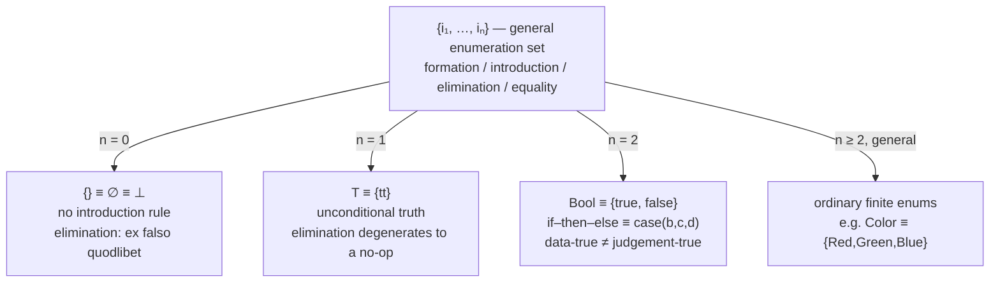

# Enumeration Sets, Truth and Falsity

[[book-guidelines|↩ Back to guidelines]]

## The problem this chapter solves

Chapter 5 gave you a template — formation, introduction, elimination, [[Propositions-as-Sets-(The-Curry-Howard-Correspondence)#Equality|equality]] — and a promise: every set former in the rest of the book is that template filled in once. A template you've only ever seen described abstractly is still an act of faith. This chapter is where the faith gets cashed in: it takes the *simplest possible* set former and runs the whole quartet through it, concretely, with nothing left implicit.

What is the simplest possible set? Not $N$ — the natural numbers need a constructor, $succ$, that takes an argument and can be applied to itself arbitrarily many times, so already you have infinitely many canonical elements built recursively. Not $\Pi$ or $\Sigma$ — those need a *second* set to depend on. The simplest set former just lists some names and declares them to be the elements, full stop. Given $n$ canonical constants $i_1, \ldots, i_n$, each of arity $0$ (meaning: each is a constant, not a function — you don't apply it to anything), the **enumeration set** $\{i_1,\ldots,i_n\}$ is the set whose canonical elements are exactly $i_1,\ldots,i_n$, with the convention that each identifier belongs to exactly one enumeration set (so the very first occurrence of an identifier fixes which enumeration set, and which position in it, it names).

This is the type-theoretic version of a C-style enum with no payloads: `enum Color { Red, Green, Blue }`. Nothing computes, nothing recurses — you're just naming a fixed, finite menu of possibilities. And that's exactly why it's the right chapter to instantiate the template in: with no recursion to obscure the shape of the elimination rule, you can see the formation/introduction/elimination/equality quartet in its purest form, and then watch three named special cases — $n=0$, $n=1$, $n=2$ — turn out to be, respectively, absurdity, unconditional truth, and the booleans.

## The general schema, instantiated: $\{i_1,\ldots,i_n\}$

**Formation.** For any $n \geq 0$ identifiers, forming the enumeration set costs nothing — there's no premise:

$$\{i_1,\ldots,i_n\}\textbf{ -- formation} \qquad \dfrac{\ }{\{i_1,\ldots,i_n\}\ set}$$

**Introduction.** The canonical elements are exactly the $n$ listed constants (rule 1), and two canonical elements are equal only when they're the *same* constant (rule 2) — an enumeration set has no accidental identifications:

$$\{i_1,\ldots,i_n\}\textbf{ -- introduction 1} \qquad \dfrac{\ }{i_1 \in \{i_1,\ldots,i_n\}} \quad \cdots \quad \dfrac{\ }{i_n \in \{i_1,\ldots,i_n\}}$$

$$\{i_1,\ldots,i_n\}\textbf{ -- introduction 2} \qquad \dfrac{\ }{i_1 = i_1 \in \{i_1,\ldots,i_n\}} \quad \cdots \quad \dfrac{\ }{i_n = i_n \in \{i_1,\ldots,i_n\}}$$

**The selector.** Every set former needs a noncanonical expression — the selector — that lets a program *consume* an arbitrary element rather than just produce one. For enumeration sets it is $case_{\{i_1,\ldots,i_n\}}(a, b_1, \ldots, b_n)$ (the subscript is usually dropped when clear from context), with the ML-style surface notation

$$\texttt{case } a \texttt{ of } i_1 \Rightarrow b_1 \mid \cdots \mid i_n \Rightarrow b_n$$

and a computation rule that is exactly what you'd expect from that surface syntax: first evaluate $a$; if its value is $i_k$, the value of the whole case-expression is the value of $b_k$. That's it — no other behavior is defined, which is the point: $case$ has meaning only insofar as $a$ eventually reduces to one of the $n$ named canonical forms.

**Elimination.** This is where the "structural induction" character the book promised in Chapter 5 becomes visible in the smallest possible instance:

$$\{i_1,\ldots,i_n\}\textbf{ -- elimination 1} \qquad \dfrac{\begin{array}{l} a \in \{i_1,\ldots,i_n\} \\ C(x)\ set\ [x \in \{i_1,\ldots,i_n\}] \\ b_1 \in C(i_1) \\ \quad\vdots \\ b_n \in C(i_n)\end{array}}{case(a,b_1,\ldots,b_n) \in C(a)}$$

Read this the way the book justifies it (p. 42): to show $case(a,b_1,\ldots,b_n) \in C(a)$, you have to show the *value* of that program is a canonical element of $C(a)$. Computing $a$ first gives some $i_j$ (the first premise guarantees this), so the value of the whole expression is the value of $b_j$ — and the $j$-th premise already tells you $b_j \in C(i_j)$. The only remaining gap is that $C(i_j)$ and $C(a)$ are, syntactically, different expressions; that gap is closed by the second premise, $C(x)\ set\ [x \in \{i_1,\ldots,i_n\}]$, whose meaning (per Chapter 4) is precisely that $C$ respects equality on its domain — so $C(a) = C(i_j)$ as sets, and Set equality (Chapter 5, §5.4) transports $b_j$'s membership in $C(i_j)$ across to $C(a)$. Nothing here is asserted; every step traces back to a semantic fact already established. There's a matching congruence rule, elimination 2, for when $a = a' \in \{i_1,\ldots,i_n\}$ rather than just $a \in \{i_1,\ldots,i_n\}$ — the book states it but, from this chapter on, mostly leaves such "equal-in equal-out" companion rules implicit, on the grounds that their shape is always the same (identical form, equal parts).

**Equality (computation).** Finally, [[Natural-Numbers-and-Lists#The rule|the rule]] that records what $case$ actually reduces to when it meets a canonical element head-on — one clause per identifier:

$$\{i_1,\ldots,i_n\}\textbf{ -- equality} \qquad \dfrac{C(x)\ set\ [x\in\{i_1,\ldots,i_n\}] \quad b_1\in C(i_1)\ \cdots\ b_n\in C(i_n)}{case(i_k,b_1,\ldots,b_n) = b_k \in C(i_k)}$$

This is the *definitional*-equality fact your evaluator relies on: $case$ applied to a literal $i_k$ just is $b_k$, judgementally, not just provably.

**What breaks without a genuine elimination rule here.** With only formation and introduction, you could write down $i_1, i_2, \ldots, i_n$ as data, but you could not write a *function* that consumes an arbitrary, statically-unknown element of $\{i_1,\ldots,i_n\}$ — you'd have no way to prove or compute anything of the shape "for all $a \in \{i_1,\ldots,i_n\}$, …". The elimination rule is precisely what licenses that: it says "if you can handle every one of the $n$ named cases, you can handle an arbitrary element," which is finite-domain structural induction with the induction step trivialized down to a lookup table.

### Where the elimination rule and your `match` are the same object

This is the point worth sitting with, because it is going to recur, unchanged in shape, for every richer set former the rest of the book introduces: **the selector's exhaustiveness requirement — one branch per canonical form — is definitionally the same fact as a compiler's match-exhaustiveness check.** They are not analogous; they are the same requirement, read once as a proof obligation and once as a compile error.

```rust
enum Color { Red, Green, Blue }

// case_{Red,Green,Blue}(a, b1, b2, b3), specialized to a concrete C:
fn describe(a: Color) -> &'static str {
    match a {
        Color::Red   => "warm",   // b1 ∈ C(Red)
        Color::Green => "calm",   // b2 ∈ C(Green)
        Color::Blue  => "cool",   // b3 ∈ C(Blue)
    }
}
```

Rust's borrow checker will refuse to compile `describe` if any arm is missing — that refusal *is* Rust's implementation of $\{i_1,\ldots,i_n\}$-elimination's premise list: "supply $b_k \in C(i_k)$ for every $k$, or the derivation (compilation) fails." The return type `&'static str` here plays the role of a *non-dependent* $C$ — every branch has the same type regardless of which $i_k$ was matched. The book's $C(x)\ set\ [x \in \{i_1,\ldots,i_n\}]$ is more general: it allows the *type* of the result to depend on which case fired, which is exactly what Rust's ordinary `enum`/`match` cannot express (no branch-dependent return type) but a verifier built around dependent elimination — the kind this project is aiming at — has to support natively. Keep that gap in mind; it resurfaces every time this book's $C(x)$ genuinely varies with $x$, starting as early as $\Pi$ in the next chapter.

**Lean grounding.** Lean's version of a bare enumeration set is an inductive type with only nullary constructors:

```lean
inductive Color where
  | red
  | green
  | blue

def describe : Color → String
  | .red => "warm"
  | .green => "calm"
  | .blue => "cool"
```

Exactly as with `Nat` in the previous chapter's article, Lean's kernel synthesizes `Color.rec` — the recursor — from this declaration, and `describe`'s pattern match desugars into a call to it. `Color.rec`'s type is literally the book's $\{i_1,\ldots,i_n\}$-elimination rule, generalized to a dependent motive $C$: `{C : Color → Sort u} → C .red → C .green → C .blue → (a : Color) → C a`. That dependent motive is precisely the piece Rust's `match` can't express and Lean's `rec` can.

**Python sketch (tertiary, illustrative only).** For the shape of the idea without any type-checking machinery:

```python
def case(a, branches):
    return branches[a]()

describe = lambda c: case(c, {"red": lambda: "warm", "green": lambda: "calm", "blue": lambda: "cool"})
```

This has none of Rust's or Lean's exhaustiveness guarantee — `branches` can silently omit a key — which is itself an illustration of what the elimination rule's premise list buys you: a *checked* guarantee, not a convention.

## 6.1 The empty set and absurdity

Set $n = 0$: no identifiers at all. You get $\{\}$ — a set with a formation rule and, notably, **no introduction rule**, because there is nothing to list. This is not a degenerate accident of the notation; it's the entire content of the empty set. Formation still costs nothing:

$$\{\}\textbf{ -- formation} \qquad \dfrac{\ }{\{\}\ set}$$

Elimination, though, still makes sense — and this is the detail worth pausing on, because it looks paradoxical at first glance. How can a set with *no* canonical elements have an elimination rule that talks about "an arbitrary element $a \in \{\}$"? The elimination-1 rule for $\{i_1,\ldots,i_n\}$ specializes to $n=0$ by simply dropping all the $b_k \in C(i_k)$ premises, since there are none:

$$\{\}\textbf{ -- elimination 1} \qquad \dfrac{a \in \{\} \qquad C(x)\ set\ [x \in \{\}]}{case(a) \in C(a)}$$

**What breaks without this rule, and why it doesn't break anything to have it.** The honest reading is: this rule is never *usable* in a derivation you could actually complete, because its first premise, $a \in \{\}$, can itself never be established from anything — there is no way to prove an arbitrary element inhabits a set with no canonical elements. But *if* some derivation elsewhere managed to produce a premise $a \in \{\}$ (which, semantically, is already a contradiction), this rule says you may conclude *anything* — $case(a) \in C(a)$ for a completely arbitrary $C$. This is not a loophole; it's the formal expression of "a false hypothesis proves anything," and the book is explicit that the justification is the same mechanical argument as the general case, just with the case-analysis over zero branches: to compute $case(a)$ you'd first compute $a$, but $a$'s value would have to be one of the (zero) canonical forms of $\{\}$ — which is impossible, so the premise $a \in \{\}$ was never satisfiable to begin with, and the rule is vacuously, permanently safe to state.

Two definitions follow immediately. First, purely as a set:

$$\emptyset \equiv \{\}$$

Then, reading sets as propositions (the identification from Chapter 2), the empty set is exactly the proposition with no proof — **absurdity**:

$$\bot \equiv \{\}$$

and specializing $\{\}$-elimination to its natural-deduction reading (dropping the now-irrelevant computational content, keeping just the judgement forms) gives the familiar rule:

$$\bot\textbf{ -- elimination} \qquad \dfrac{\bot\ true \qquad C\ prop}{C\ true}$$

— *ex falso quodlibet*, for an arbitrary proposition $C$. The book is careful to note this rule's correctness is not an axiom bolted on for logical convenience; it's a *direct consequence of the semantics*: if $\bot$ is true, there is (by definition of what "$\bot$ true" means) an element $a \in \bot$, and $\{\}$-elimination 1 turns that into $case(a) \in C$ for any $C$ you like.

**Rust grounding: the uninhabited type.** The standard idiom for "a type with zero values" in Rust is an enum with zero variants:

```rust
enum Void {}

fn absurd<C>(v: Void) -> C {
    match v {}   // zero arms — exhaustive precisely because there are zero
                 // canonical forms to cover. This IS {}-elimination 1.
}
```

`match v {}` typechecks with *no arms at all*, and the compiler accepts it as exhaustive for exactly the reason the book's elimination rule needs no $b_k$ premises when $n=0$: there is nothing left to cover. `absurd` is generic in its return type `C` for the same reason $C(x)$ in the book's rule is an arbitrary family — a function that can never actually be called can safely promise to produce *anything*. Rust's built-in never type, `!` — the type of `panic!()`, an infinite `loop {}`, or a diverging branch — is the closer cousin to $\bot$ read as "this program point is unreachable" rather than "this set has no elements," but the two readings coincide: a value of `!` (or of `Void`) is a proof, in hand, that the surrounding code path cannot be reached.

**Lean grounding.** Lean's `False` is declared with zero constructors, and its eliminator is exactly `absurd` above:

```lean
inductive False : Prop where

theorem ex_falso {C : Prop} (h : False) : C := False.elim h
-- equivalently: nomatch h
```

`False.elim` — and the `nomatch` term-mode syntax, which pattern-matches on a hypothesis with a provably empty type and needs no branches — are Lean's direct implementations of $\{\}$-elimination. This is also where Lean's `absurd : a → ¬a → b` tactic-level helper bottoms out: strip away the "given both a proof and its negation" packaging and what's left underneath is `False.elim`.

**Load-bearing point for a proof-search verifier.** This is the *base case* of case-elimination as proof search: a goal reducible to deriving something from a hypothesis of an uninhabited type closes immediately, with zero branches to explore. Any verifier built around case-elimination as its core search primitive needs $\{\}$ (or an enumeration set that turns out, after normalization, to have no live constructors) as a hard-stop leaf in its search tree — "zero premises to discharge" is the terminating case of the same loop that, for larger enumeration sets, iterates once per canonical form.

## 6.2 The one-element set and the true proposition

Set $n = 1$, with a fresh constant $tt$ of arity $0$:

$$T \equiv \{tt\}$$

Formation, introduction, elimination, and equality all fall straight out of specializing the general rules to $n=1$:

$$T\textbf{ -- formation}\ \dfrac{\ }{T\ set} \qquad T\textbf{ -- introduction}\ \dfrac{\ }{tt \in T}$$

$$T\textbf{ -- elimination} \qquad \dfrac{a \in T \qquad C(x)\ set\ [x \in T] \qquad b \in C(tt)}{case(a,b) \in C(a)}$$

$$T\textbf{ -- equality} \qquad \dfrac{C(x)\ set\ [x\in T] \qquad b \in C(tt)}{case(tt,b) = b \in C(tt)}$$

Under the propositions-as-sets reading, $T$ is a proposition that's provable unconditionally, with $tt$ as its canonical (only) proof. Its natural-deduction rules are almost embarrassingly simple:

$$T\textbf{ -- introduction} \qquad \dfrac{\ }{T\ true} \qquad\qquad T\textbf{ -- elimination} \qquad \dfrac{T\ true \qquad C\ true}{C\ true}$$

The book flags, dryly, that these two are "usually not formulated in systems of natural deduction" and that the elimination rule in particular "is for obvious reasons never used" (p. 44). Look closely at why: the elimination rule's conclusion, $C\ true$, is already sitting right there as its *second premise*. To use this rule you'd need to already have a proof of $C$ before you could "conclude" $C$ — it adds nothing a direct use of the second premise didn't already give you. This is a genuinely instructive degenerate case: it shows that an elimination rule earns its keep only when the set being eliminated carries *information* the conclusion depends on. $\{\}$ carries a contradiction (maximally informative — it lets you conclude anything). $T$ carries nothing at all (minimally informative — knowing $a \in T$ tells you only that $a$ reduces to $tt$, a fact with no further content), so its elimination rule degenerates to a no-op.

**Rust grounding.** $T$ is the enumeration-set special case of the unit type:

```rust
enum Unit { Tt }
// or, using the language's own built-in one-element type:
fn ret_unit() -> () { () }
```

Rust's `()` is precisely a type with one canonical value and no information beyond "you have one" — the same content-free inhabitant `tt` supplies. A function returning `()` (like most functions run purely for side effect) is the computational reading of "$T\ true$, unconditionally": there's nothing to compute *to*, just a token confirming you reached this point.

**Lean grounding.** `True` is declared with exactly one, argument-free constructor:

```lean
inductive True : Prop where
  | intro : True

example : True := True.intro   -- also: `trivial`
```

`True.intro` is `tt`; the `trivial` tactic is Lean's acknowledgment that closing a `True` goal needs no real work, mirroring the book's remark that $T$-elimination is never actually invoked.

## 6.3 The set Bool

Set $n = 2$, with two fresh constants $true$ and $false$, both of arity $0$:

$$Bool \equiv \{true, false\} \qquad\qquad \texttt{if } b \texttt{ then } c \texttt{ else } d \equiv case(b,c,d)$$

Once again every rule is the general enumeration-set schema specialized, this time with two branches, so the equality rule splits into two clauses — one per canonical value of the scrutinee:

$$Bool\textbf{ -- formation}\ \dfrac{\ }{Bool\ set} \qquad Bool\textbf{ -- introduction}\ \dfrac{\ }{true \in Bool} \quad \dfrac{\ }{false \in Bool}$$

$$Bool\textbf{ -- elimination} \qquad \dfrac{b \in Bool \quad C(v)\ set\ [v \in Bool] \quad c \in C(true) \quad d \in C(false)}{\texttt{if } b \texttt{ then } c \texttt{ else } d \in C(b)}$$

$$Bool\textbf{ -- equality} \qquad \dfrac{C(v)\ set\ [v\in Bool] \quad c\in C(true) \quad d\in C(false)}{\texttt{if true then } c \texttt{ else } d = c \in C(true)}$$

$$\dfrac{C(v)\ set\ [v\in Bool] \quad c\in C(true) \quad d\in C(false)}{\texttt{if false then } c \texttt{ else } d = d \in C(false)}$$

### The distinction the book insists on: $true \in Bool$ is not "true"

This is the subtlest point in the chapter, and the book states it explicitly (p. 45) because it's exactly the kind of confusion that a shared English word invites. There are two completely different things both spelled "true" here:

1. $true$, a **canonical element of the set $Bool$** — a piece of data, nothing more. Computing a program $c$ and getting the value $true$ means only that $c$ reduces to that particular one of two constants. "Many years of programming practice have shown that it is convenient to use the names $true$ and $false$" for a two-element set's elements, the book notes — you could just as well have called them `0` and `1`, or `Red` and `Blue`. There is "something arbitrary in this choice" of name.
2. $C\ true$, a **judgement** — read all the way back to Chapter 4's semantics, this abbreviates "$C$ is a nonempty set," and *asserting* it means you possess a proof: an actual element of $C$. This "true" carries epistemic weight; the other one is just a label.

So $c = true \in Bool$ ("the program $c$ evaluates to the canonical value $true$") and $C\ true$ ("the proposition $C$ has been proved") are not the same kind of fact, even when, confusingly, $C$ happens to be $Bool$ and the element in question happens to be spelled the same way. Losing this distinction is a real hazard: it's the difference between *data* that happens to be called `true` and a *judgement* that a goal has been discharged.

**Rust and Lean grounding, together, because this is exactly where they diverge instructively.** Rust's `bool` is a computational two-element type — logically just `enum bool { false, true }` — and `if`/`match` on it compile straight down to the selector:

```rust
fn if_then_else<C>(b: bool, c: C, d: C) -> C {
    match b {
        true  => c,   // Bool-equality clause 1
        false => d,   // Bool-equality clause 2
    }
}
```

This `if_then_else` *is* $case(b,c,d)$, and a Rust `bool` value is exactly sense (1) above — data, nothing more; asking "is `b == true`?" at runtime is an ordinary equality check with no proof-theoretic content.

Lean keeps *both* senses alive as genuinely separate types, which is precisely the machinery that resolves the book's distinction formally rather than just verbally:

```lean
inductive Bool where   -- sense (1): data, decidable equality, computes
  | false
  | true

inductive True : Prop where  -- sense (2)-adjacent: a proposition with a proof
  | intro

-- the bridge: turning a Bool computation into a Prop judgement
example (b : Bool) : Decidable (b = true) := inferInstance
example : (2 = 2 : Bool) = true := rfl        -- decide, computationally
example : (2 : Nat) = 2 := rfl                -- prove, propositionally
```

Lean's split between `Bool` (a plain two-constructor inductive type, used when you want to *compute* an answer) and `Prop` (used when you want to *state and prove* a claim) is the same fork in the road the book is pointing at with $b \in Bool$ versus $C\ true$. The `Decidable` typeclass and the `decide` tactic are the machinery that crosses from one side to the other: `Decidable P` packages a proof that either `P` holds or `¬P` holds *together with* a `Bool`-valued procedure for computing which — turning a `Bool` answer back into a `Prop` proof is exactly what closes the gap the book is warning you not to elide silently. This foreshadows Chapter 21's `Decidable(A,B) \equiv (\Pi x\in A)B(x)\vee\neg B(x)$ almost exactly.

The book closes the section by flagging that, once a universe is available (Chapter 14), $\neg(true =_{Bool} false)$ becomes provable — i.e., $Bool$'s two elements are genuinely, provably distinct, not just conventionally different names. That result needs machinery this chapter deliberately doesn't have yet (the equality-set former $=_A$ isn't introduced until Chapter 8), so it's stated here purely as a forward pointer.

## The specialization tree



## Where this leads

This chapter is the seed every later, richer set-former chapter is a variation on — not metaphorically, but in the literal sense that the elimination rule's shape here is the smallest instance of a pattern the book reuses through the universe $U$ in Chapter 14: give a finite (or, for $N$ and $List$, recursively-generated) list of canonical forms, then demand exactly one $C$-typed premise per form. $N$'s two constructors $0$ and $succ$ generalize $\{i_1,\ldots,i_n\}$'s $n$ nullary constructors to a mix of nullary and *argument-taking* ones (and $succ$'s premise in $N$-elimination gets an extra inductive-hypothesis slot that this chapter's flat enumeration never needed, since none of $i_1,\ldots,i_n$ refers back to the set itself). $List(A)$ does the same with $nil$/$cons$. $+$ is, from one angle, a two-branch enumeration whose "canonical constants" $inl(a)$ and $inr(b)$ each carry a whole element of another set rather than being bare nullary tags. Every one of these still produces a selector — $natrec$, $listrec$, $when$ — whose defining computation rule is the direct descendant of this chapter's $case$-equality rule: reduce the scrutinee to a canonical form, dispatch to the matching branch. Chapter 14's universe elimination rule ($urec$) goes further still and shows that *any* enumeration set, no matter how large, can be rebuilt compositionally from exactly the three special cases proved here — $\emptyset$, $T$, and $+$ — which is the strongest possible evidence that this chapter isn't just "an easy warm-up example" but the literal generating set for every finite set-former in the book.

For the standing engineering goals this study is aimed at, the connection is direct rather than metaphorical: **a proof-search verifier's case-elimination code is this chapter's elimination rule, executable.** Concretely —

- Rust's `match` exhaustiveness checker is already, today, checking a restricted (non-dependent, $C$ fixed rather than varying with $x$) instance of $\{i_1,\ldots,i_n\}$-elimination's premise-completeness requirement every time it compiles. A dependent-elimination verifier generalizes exactly this check to a branch-varying motive $C(x)$ — the gap flagged above between `describe : Color → &'static str` and Lean's `Color.rec {C : Color → Sort u} → …`.
- The empty-set case ($\S6.1$) is the terminating leaf of that search: a goal under an uninhabited hypothesis closes with zero obligations, exactly like Rust's `match v {}`. Any proof-search loop built around case-elimination needs this as its base case, not as a special exception to it.
- The $Bool$ section's data-vs-judgement distinction is the seed of the `Decidable`/`decide` machinery a checker needs wherever it wants to turn a computed boolean answer into an accepted proof obligation — precisely the move Chapter 21's `Decidable` predicates formalize, and precisely the move a Hoare-triple verifier needs whenever a guard condition has to license branching in the *logic*, not just in the *code*.
