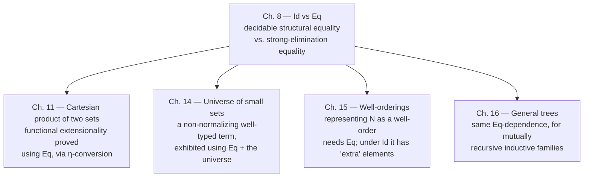

# [[Propositions-as-Sets-(The-Curry-Howard-Correspondence)#Equality|Equality]] Sets

[[book-guidelines|↩ Back to guidelines]]

## The problem: judgemental equality can't be a proposition

Every set former up to this point in the book — enumeration sets, $\Pi$ — has been building propositions out of other propositions: $A \times B$ for conjunction, $A \to B$ for [[The-Cartesian-Product-of-a-Family-and-the-Universal-Quantifier#Implication|implication]], $\Pi(A,B)$ for [[The-Cartesian-Product-of-a-Family-and-the-Universal-Quantifier#The universal quantifier|the universal quantifier]]. But there's a logical connective conspicuously missing from that list: equality. You can already *judge* that two elements are equal — $a = b \in A$ is one of [[Propositions-as-Sets-(The-Curry-Howard-Correspondence)#The four basic judgement forms|the four basic judgement forms]], alongside $A\ set$, $A=B$, and $a \in A$ — but a judgement is not a set. You cannot put a judgement inside a $\Sigma$, negate it, assume it as a hypothesis in a $\Pi$, or embed it as the antecedent of an implication, because all of those operations require their ingredients to *be* sets (propositions), and $a = b \in A$ is a fact the mathematician establishes about a derivation, not an object the type theory itself can hand you a proof-element of.

Concretely, this is a specification you cannot yet write: "find [[Natural-Numbers-and-Lists|a natural number]] whose square is $4$,"

$$(\Sigma x \in N)(x \times x =_N 4)\text{ — but }x\times x =_N 4\text{ isn't a set, so this }\Sigma\text{ doesn't typecheck.}$$

The fix has to be a genuinely new set former: take the *judgement* $a = b \in A$ and *reify* it — build a set whose inhabitants are exactly the proofs that $a$ and $b$ are equal elements of $A$. That's what this chapter does, and it does it twice, because there turn out to be two different, incompatible ways to keep faith with "a proof that $a=b$": the book calls them **intensional equality**, $Id(A,a,b)$, and **extensional equality**, $Eq(A,a,b)$. The tension between them — how much proof-theoretic power you buy by picking $Eq$, and how much you pay for it in decidability — is the spine of the whole chapter, and it is the same tension a working type-checker author or elaborator author has to resolve when designing `isDefEq`. Keep that correspondence in mind as a thread; it will be made explicit once both sides of the story are on the table.

## Intensional equality: $Id(A,a,b)$

### The rules

$Id$ is a primitive constant of arity $(0\otimes 0\otimes 0)\to 0$ — it takes a set and two elements and produces a set:

$$\textbf{Id–formation}\qquad \dfrac{A\ set \quad a\in A \quad b\in A}{Id(A,a,b)\ set}$$

There is exactly one *shape* of canonical element, produced by the constant $id$ (arity $0\to 0$): a proof that something is equal to *itself*.

$$\textbf{Id–introduction}\qquad \dfrac{a\in A}{id(a)\in Id(A,a,a)}$$

Notice what this buys immediately, via Substitution in sets (Chapter 5) applied to $a=b\in A$ and the family $Id(A,a,x)\ set\ [x\in A]$: $Id(A,a,a) = Id(A,a,b)$ as sets, so $id(a)$ can be reused as an element of $Id(A,a,b)$ whenever $a=b\in A$ judgementally. That gives the book's derived rule:

$$\textbf{Id–introduction}'\qquad \dfrac{a=b\in A}{id(a)\in Id(A,a,b)}$$

The primitive **non-canonical** constant — the selector — is $idpeel$, of arity $(0\otimes(0\to0))\to0$. Operationally: $idpeel(c,d)$ evaluates $c$; if $c$'s value is $id(a)$, the value of $idpeel(c,d)$ is the value of $d(a)$. That two-step computation rule is exactly what licenses a genuine structural-induction elimination rule — because the *only* canonical form an element of $Id(A,a,b)$ can ever have is $id(a)$ for some $a$, proving a family $C$ at that one canonical case suffices for every element of $Id(A,a,b)$:

$$\textbf{Id–elimination}\qquad \dfrac{\begin{array}{l} a\in A\\ b\in A\\ c\in Id(A,a,b)\\ C(x,y,z)\ set\ [x\in A,\ y\in A,\ z\in Id(A,x,y)]\\ d(x)\in C(x,x,id(x))\ [x\in A] \end{array}}{idpeel(c,d)\in C(a,b,c)}$$

with the matching computation rule:

$$\textbf{Id–equality}\qquad \dfrac{\begin{array}{l} a\in A\\ C(x,y,z)\ set\ [x\in A,\ y\in A,\ z\in Id(A,x,y)]\\ d(x)\in C(x,x,id(x))\ [x\in A] \end{array}}{idpeel(id(a),d) = d(a) \in C(a,a,id(a))}$$

The book is explicit that this is "more in that it is a substitution rule for elements which are equal in the sense of an equality set" than a computation device — $idpeel$ is what lets you carry a proof of $P(a)$ across a proof that $a = b$ and land in $P(b)$. From here on the book abbreviates $Id(A,a,b)$ as $a =_A b$.

### The rules the book derives immediately: $symm$, $trans$, $subst$

Three worked derivations in §8.1 show $Id$-elimination doing real work — each one is a single, small motive $C$ chosen so that Id-elimination's structural-induction shape collapses into the classical equality law. Given $d \in Id(A,a,b)$, picking $C \equiv (x,y,z)\, Id(A,y,x)$ gives

$$symm(d) \equiv idpeel(d,\,id) \in Id(A,b,a).$$

Given also $e \in Id(A,b,c)$, picking $C \equiv (x,y,z)\,\bigl(Id(A,y,c) \to Id(A,x,c)\bigr)$ gives an element of $Id(A,b,c)\to Id(A,a,c)$, applied to $e$:

$$trans(d,e) \equiv apply\bigl(idpeel(d,\,(x)\lambda y.y),\,e\bigr) \in Id(A,a,c).$$

And given $c \in Id(A,a,b)$, $P(x)\ set\ [x\in A]$, and $p \in P(a)$, picking $C \equiv (x,y,z)\,\bigl(P(x)\to P(y)\bigr)$ gives

$$subst(c,p) \equiv apply\bigl(idpeel(c,\,(x)\lambda x.x),\,p\bigr) \in P(b).$$

Every one of these is *just* Id-elimination with a cleverly chosen motive — no new machinery, no proof search, nothing beyond "supply the reflexivity case, let $idpeel$ do the rest." Suppressing proof objects, $subst$ becomes exactly the substitution rule of first-order predicate logic with equality:

$$\dfrac{P(x)\ set\ [x\in A]\quad a\in A\quad b\in A\quad Id(A,a,b)\ true\quad P(a)\ true}{P(b)\ true}$$

**Worked example from the book.** For any set $A$, $Id(A,\ \text{if}\ b\ \text{then}\ c\ \text{else}\ c,\ c)$ is inhabited for $b \in Bool$, $c \in A$ — by case analysis on $b$: each branch gives $\text{if}\ b\ \text{then}\ c\ \text{else}\ c = c \in A$ judgementally (a $Bool$-equality rule), so $id(c)$ inhabits $Id$ in each case, and $Bool$-elimination glues the two cases into $\text{if}\ b\ \text{then}\ id(c)\ \text{else}\ id(c) \in Id(A,\ \text{if}\ b\ \text{then}\ c\ \text{else}\ c,\ c)$. This is worth pausing on precisely because it's mundane: whenever judgemental equality already holds, $Id$ is trivially inhabited by $id$, and case analysis on a $Bool$/$N$/$List$ discriminee is exactly how you promote "true in each canonical branch" to "true for the arbitrary element."

### Lean: $Id$ is `Eq`, $idpeel$ is `Eq.rec`

This is the cleanest correspondence in the whole book. Lean's `Eq` type (despite the name clash with this chapter's $Eq$ — more on that collision below) is defined with exactly $Id$'s shape: one constructor, `rfl : a = a`, and an eliminator generated by the kernel that is structurally $idpeel$:

```lean
-- Lean's own definition, in spirit:
inductive Eq {α : Sort u} (a : α) : α → Prop where
  | refl : Eq a a

-- id(a)  ↦  rfl
example (a : Nat) : a = a := rfl

-- idpeel(c, d)  ↦  Eq.rec / the `▸` transport operator / `subst`
example (A : Type) (P : A → Prop) (a b : A) (c : a = b) (p : P a) : P b :=
  c ▸ p          -- this line *is* subst(c, p)

-- symm and trans, both derivable exactly as in the book, structurally
-- from the eliminator rather than as new primitives
example (A : Type) (a b : A) (d : a = b) : b = a := d ▸ rfl
example (A : Type) (a b c : A) (d : a = b) (e : b = c) : a = c := d ▸ e
```

`Eq.rec`'s type signature — motive `C`, a proof for the reflexivity case, and a proof of `a = b`, yielding `C b` from `C a` — is line-for-line the book's Id-elimination rule with the argument order rearranged; `c ▸ p` is literally `subst(c,p)` with the arity flipped for ergonomics. And crucially: this is *definitional-equality-decidable* machinery. Deciding whether two terms are equal by the kernel's `isDefEq` never needs to inspect an `Eq` proof at all except by reducing it to `rfl` (or leaving it un-reduced, opaque, if it's a variable) — checking equality of `Eq`-typed terms is just ordinary structural term comparison, because $idpeel$/`Eq.rec` only ever *computes* by pattern-matching its proof argument down to `id`/`rfl`. There is no step in this story that requires searching a context or consulting arbitrary hypotheses. That property — decidability by pure structural recursion — is what the next section shows $Eq(A,a,b)$ throws away.

## Extensional equality: $Eq(A,a,b)$ and the strong elimination rule

### The rules

The formation rule looks identical to $Id$'s:

$$\textbf{Eq–formation}\qquad \dfrac{A\ set\quad a\in A\quad b\in A}{Eq(A,a,b)\ set}$$

but the introduction rule is subtly and importantly different. Its premise is the *judgement* $a=b\in A$, not an *element* $a \in A$:

$$\textbf{Eq–introduction}\qquad \dfrac{a=b\in A}{eq\in Eq(A,a,b)}$$

and $eq$ is a constant of arity $0$ — it takes no arguments at all. Compare this with $id(a)$: $id$ is parameterized by *which* element you're reflecting, so [[The-Universe-of-Small-Sets#The proof|the proof]] term itself remembers something (it's applied to $a$). $eq$ remembers nothing; there is, by design, only one possible canonical proof shape in an $Eq$-set, and it carries no data. This is the first hint of what's coming: an $Eq$-proof is evidence that a fact holds, with the fact itself immediately thrown away.

The crucial rule — the one that gives the chapter its title tension — is the elimination rule, and it does not have the shape of any elimination rule seen so far in the book:

$$\textbf{Strong Eq–elimination}\qquad \dfrac{c\in Eq(A,a,b)}{a=b\in A}$$

Read that carefully: from merely *having some element* $c$ of $Eq(A,a,b)$ — never mind which one, never mind what its canonical form is — you may conclude the *judgement* $a=b\in A$. Contrast with Id-elimination, which requires a whole family $C$ and a proof of the reflexivity case $d(x)$ before it hands you anything, and only ever hands you an element of $C(a,b,c)$ — never a bare judgement. The book states outright: "unlike the elimination rules for the other sets, this elimination rule is not a structural induction principle." It doesn't case on $c$'s canonical form at all; it just asserts.

To make the theory usable, one more rule is needed — proof irrelevance for $Eq$, stating that every element of an $Eq$-set really is (judgementally!) the one canonical shape:

$$\textbf{Eq–elimination 2}\qquad \dfrac{c\in Eq(A,a,b)}{c = eq \in Eq(A,a,b)}$$

Together, these two let the book recover something that *looks* like Id-elimination — a genuine induction-style rule for $Eq$ — as a **derived** rule rather than a primitive one:

$$\dfrac{\begin{array}{l} a\in A\\ b\in A\\ c\in Eq(A,a,b)\\ C(x,y,z)\ set\ [x\in A,\ y\in A,\ z\in Eq(A,x,y)]\\ d(x)\in C(x,x,eq)\ [x\in A] \end{array}}{d(a)\in C(a,b,c)}$$

The derivation is short and worth walking through because it shows exactly how the two primitive $Eq$-rules cooperate: strong Eq-elimination on $c \in Eq(A,a,b)$ gives $a=b\in A$ judgementally; Substitution in elements applied to $a\in A$ and $d(x)\in C(x,x,eq)\ [x\in A]$ gives $d(a) \in C(a,a,eq)$; then Substitution using $a=b\in A$ and Eq-elimination 2 ($c = eq \in Eq(A,a,b)$) transports that along both equalities to land at $d(a) \in C(a,b,c)$. Nothing here is structural recursion on $c$ — it's judgemental substitution riding on a judgemental equality that strong elimination manufactured out of thin air.

### Why this breaks decidability

Here is the load-bearing consequence, and the book states it almost in passing but it is the entire point of introducing two equality sets instead of one. With $Id$ alone, the book notes a metatheorem provable "by induction on the length of the derivation": if $a = b \in A$ is derivable, $a$ *converts* to $b$ — i.e., judgemental equality coincides with the ordinary rewriting/convertibility relation generated by the computation rules ($\beta$, and the selector-equality rules like $natrec$, $listrec$, and $idpeel$'s own rule). Convertibility is checked by normalizing and comparing — a terminating, purely syntactic procedure. That is exactly why $Id$-only judgemental equality is decidable: checking $a=b\in A$ never requires anything but reduction and structural comparison, the same recipe as checking two arithmetic expressions denote the same normal form.

Add $Eq$-sets to the theory, and this collapses. Strong Eq-elimination lets you establish $a=b\in A$ *judgementally* by *proving* $Eq(A,a,b)$ **propositionally** — and propositional proof can use the full strength of the logic: induction on $N$, case splits, lemmas, whatever it takes. The book's own example: prove $a(x)=b(x)\in A\ [x\in N]$ not by finding a reduction sequence, but by first proving $Eq(A,a(x),b(x))\ [x\in N]$ using $N$-induction, then invoking strong Eq-elimination to *cash it in* as a judgemental fact. Once judgemental equality can be established by arbitrary theorem-proving rather than by bounded, syntax-directed reduction, deciding it stops being a normalization problem and becomes a provability problem — and provability in a system this expressive is not decidable in general. That is exactly why the book commits, right at the start of the chapter, to "we will therefore avoid this [Eq] equality when possible," reaching for it only where it's unavoidable — extensional equality of functions (Chapter 11), and representing inductively-defined sets faithfully as well-orderings (Chapters 15–16).

<svg viewBox="0 0 860 380" xmlns="http://www.w3.org/2000/svg" role="img" aria-label="Id-elimination as bounded structural recursion versus Eq strong-elimination as an unbounded escape hatch into judgemental equality">
  <defs>
    <marker id="arr" markerWidth="8" markerHeight="8" refX="4" refY="4" orient="auto">
      <path d="M0,0 L8,4 L0,8 Z" fill="#5b8dbe" />
    </marker>
  </defs>
  <text x="20" y="26" font-family="sans-serif" font-size="15" fill="#7d8590">Id-elimination — bounded, structural</text>
  <rect x="20" y="44" width="380" height="90" rx="6" fill="none" stroke="#7d8590" stroke-width="1.2" />
  <text x="35" y="66" font-family="ui-monospace, Menlo, monospace" font-size="13" fill="#7d8590">c : Id(A,a,b)</text>
  <text x="35" y="86" font-family="ui-monospace, Menlo, monospace" font-size="13" fill="#7d8590">idpeel(c,d) reduces only when</text>
  <text x="35" y="106" font-family="ui-monospace, Menlo, monospace" font-size="13" fill="#7d8590">c's value is id(a) — one canonical case</text>
  <line x1="210" y1="134" x2="210" y2="168" stroke="#5b8dbe" stroke-width="1.5" marker-end="url(#arr)" />
  <text x="20" y="188" font-family="sans-serif" font-size="12" fill="#5b8dbe">decidable: check reduces to normal form &amp; compare</text>

  <text x="460" y="26" font-family="sans-serif" font-size="15" fill="#7d8590">Eq strong-elimination — unbounded escape</text>
  <rect x="460" y="44" width="380" height="90" rx="6" fill="none" stroke="#c98a3e" stroke-width="1.2" />
  <text x="475" y="66" font-family="ui-monospace, Menlo, monospace" font-size="13" fill="#7d8590">c : Eq(A,a,b)  — any c, any proof</text>
  <text x="475" y="86" font-family="ui-monospace, Menlo, monospace" font-size="13" fill="#7d8590">strong Eq-elim asserts a = b &#8712; A</text>
  <text x="475" y="106" font-family="ui-monospace, Menlo, monospace" font-size="13" fill="#7d8590">directly — no case on c's canonical form</text>
  <line x1="650" y1="134" x2="650" y2="168" stroke="#c98a3e" stroke-width="1.5" marker-end="url(#arr)" />
  <text x="460" y="188" font-family="sans-serif" font-size="12" fill="#c98a3e">undecidable in general: needs the proof of Eq(A,a,b),</text>
  <text x="460" y="206" font-family="sans-serif" font-size="12" fill="#c98a3e">which may require arbitrary theorem-proving to construct</text>

  <line x1="210" y1="168" x2="210" y2="230" stroke="#7d8590" stroke-width="1" stroke-dasharray="3,3" />
  <line x1="650" y1="206" x2="650" y2="230" stroke="#c98a3e" stroke-width="1" stroke-dasharray="3,3" />
  <rect x="120" y="240" width="620" height="120" rx="6" fill="none" stroke="#5b8dbe" stroke-width="1" />
  <text x="140" y="266" font-family="sans-serif" font-size="13" fill="#5b8dbe" font-weight="bold">This is exactly the isDefEq design fork</text>
  <text x="140" y="290" font-family="sans-serif" font-size="12" fill="#7d8590">Kernel definitional equality (Lean, Coq, ...) is deliberately Id-shaped:</text>
  <text x="140" y="308" font-family="sans-serif" font-size="12" fill="#7d8590">structural reduction only, no proof search, always terminates.</text>
  <text x="140" y="330" font-family="sans-serif" font-size="12" fill="#7d8590">Lean's propositional `Eq` requires explicit `rewrite`/`subst`/`▸` —</text>
  <text x="140" y="348" font-family="sans-serif" font-size="12" fill="#7d8590">it is never silently folded back into the kernel's isDefEq.</text>
</svg>

### Lean's design choice, made explicit: this is `isDefEq` in miniature

This is where the chapter's tension stops being a historical curiosity about a 1990 book and becomes a live design decision every kernel author faces. Every dependently-typed proof assistant needs a function — call it `isDefEq(a, b)` — that decides whether two terms are *definitionally* equal, because it's called constantly during elaboration and type checking: unifying an expected type against an inferred one, checking a case is well-typed, deciding whether a metavariable's assigned solution matches its constraint. For this function to be usable at all, it has to *terminate*, ideally quickly. Lean's kernel — like every serious kernel — commits to exactly the book's $Id$ strategy: `isDefEq` is defined by structural reduction ($\beta$, $\iota$/recursor-computation, $\delta$/unfolding definitions, and, since Lean 4, $\eta$ for structures and functions — see below) and syntactic comparison of the results. It never inspects a term of type `a = b` and never consults the ambient context for "is there some hypothesis that happens to prove `a = b`." That restriction is not laziness; it is exactly what keeps `isDefEq` decidable, for exactly the reason $Id$-only judgemental equality is decidable in the book: the procedure is bounded by term structure, not by "what's provable."

Lean's own `Eq` type — same name, but genuinely $Eq$-shaped, not $Id$-shaped, in the sense that matters here — is where propositional reasoning lives instead. A term `h : a = b` in Lean never automatically makes `a` and `b` interchangeable to the kernel; you must explicitly transport with `h ▸`, `Eq.subst`, or the `rewrite`/`subst` tactics, each of which produces a *new, explicit* proof term. If Lean's kernel *did* adopt strong Eq-elimination — "any proof of `a = b` in scope makes `a` and `b` kernel-interchangeable, no cast required" — `isDefEq` would inherit exactly the book's problem: deciding whether two terms are kernel-equal could require deciding whether some proposition is provable from the ambient context, which is undecidable. This is precisely why Lean, Coq, and Agda all draw the line the book draws: keep judgemental/definitional equality decidable and structural (the $Id$ side), and make propositional equality (the $Eq$ side) something you *prove into existence* and *explicitly transport with*, never something the checker silently absorbs.

**The unification connection, made explicit.** Deciding $Id$-style judgemental equality by structural reduction-and-compare is not merely *analogous* to first-order syntactic unification — it *is* that algorithm, minus the "solve for a variable" step: normalize both sides, compare head symbols, recurse into matching argument positions, fail on a structural mismatch. This is precisely the fragment an elaborator's unifier falls back to once metavariables are out of the picture — the base case underneath even Miller pattern unification. Strong Eq-elimination is the move of trying to fold *arbitrary propositional provability* into that same decision procedure — i.e., asking your unifier to also decide theorem-hood. No real elaborator does this: Lean instead leaves such obligations as separate proof goals (a `Decidable` instance, a side condition discharged by `rfl`/`decide`/an explicit tactic, or a deferred metavariable with a propositional constraint attached) rather than trying to make `isDefEq` itself theorem-prove. The book's own resolution — "avoid $Eq$ when possible" — is the 1990 version of that same engineering call: keep the equality your checker relies on decidable by keeping it structural, and push anything that needs real proof search out into an explicit, separately-discharged proof obligation.

### Rust: what an equality-checker function can and cannot decide

A verifier's `is_def_eq` is the direct implementation target of this whole distinction. For $Id$, it only ever needs term structure:

```rust
/// Structural, terminating: exactly the recipe idpeel's computation rule
/// licenses. No context lookup, no proof search — mirrors Id-elimination's
/// restriction to the single canonical case id(a).
fn is_def_eq(a: &Term, b: &Term) -> bool {
    let (na, nb) = (whnf(a), whnf(b));
    match (&na, &nb) {
        (Term::App(f1, x1), Term::App(f2, x2)) => is_def_eq(f1, f2) && is_def_eq(x1, x2),
        (Term::Lambda(_, b1), Term::Lambda(_, b2)) => is_def_eq(b1, b2),
        (Term::Var(n1), Term::Var(n2)) => n1 == n2,
        (Term::Const(c1), Term::Const(c2)) => c1 == c2,
        _ => false,
    }
}
```

There is no version of this function that can honor strong Eq-elimination, because strong Eq-elimination's premise is "some proof of `Eq(A,a,b)` exists" — which is not a question about the *shape* of `a` and `b`, it's a question about what's *derivable in the whole theory*. The honest signature for an `Eq`-aware checker admits that up front:

```rust
enum EqCheck {
    Decided(bool),         // Id-style: settled by structural reduction
    RequiresProof(Term),   // Eq-style: settled only by producing/finding
                            // a term of type Eq(A, a, b) — proof search,
                            // not term comparison; not guaranteed to halt
}
```

A checker whose `is_def_eq` can return `RequiresProof` has quietly become a theorem prover. That's the concrete cost the book is naming when it says $Eq$'s elimination rule makes judgemental equality undecidable — and it's exactly why a Rust verifier built on this material should keep its `is_def_eq` restricted to the `Id` fragment, and represent any $Eq$-flavored fact as an explicit proof obligation the caller must discharge, never as something `is_def_eq` tries to resolve on its own.

## $\eta$-equality for functions: the concrete payoff of choosing $Eq$

Chapter 7 gave $\Pi$-sets a $\beta$-rule ($apply(\lambda(b),a) = b(a)$) but no judgemental $\eta$-rule — there is no primitive way to conclude

$$\lambda((x)\,apply(f,x)) = f \in \Pi(A,B)\ [f\in\Pi(A,B)]$$

directly. Section 8.3 shows this fact is nonetheless *provable propositionally*, using nothing but $Id$ and the alternative $\Pi$-selector $funsplit$ (Chapter 7's Π-elimination 3, justified by structural induction rather than $\beta$-reduction). By $\Pi$-equality, $\lambda((x)apply(\lambda(y),x)) = \lambda(y) \in \Pi(A,B)\ [y(x)\in B(x)\ [x\in A]]$ holds judgementally whenever the argument is already in the canonical, abstracted form $\lambda(y)$ — so $Id$-introduction gives

$$id(\lambda(y)) \in Id\bigl(\Pi(A,B),\ \lambda((x)apply(\lambda(y),x)),\ \lambda(y)\bigr)\ [y(x)\in B(x)\ [x\in A]].$$

That's the base case, established only for canonical $\lambda(y)$. $funsplit$ then lifts it to an *arbitrary* $f \in \Pi(A,B)$ — using the motive $D(\lambda(y)) \equiv Id(\Pi(A,B),\ \lambda((x)apply(\lambda(y),x)),\ \lambda(y))$ — yielding

$$Id\bigl(\Pi(A,B),\ \lambda((x)apply(f,x)),\ f\bigr)\ true\ [f\in\Pi(A,B)]\qquad\text{— true, but only propositionally.}$$

Then comes the payoff the whole chapter has been building toward. Run the identical construction with $Eq$ in place of $Id$, obtaining a term of $Eq\bigl(\Pi(A,B),\lambda((x)apply(f,x)),f\bigr)$ — and now invoke strong Eq-elimination on it. The conclusion is no longer a proposition you have to carry around and apply $idpeel$/$subst$ to use; it's the bare judgement:

$$\lambda((x)\,apply(f,x)) = f \in [f \in \Pi(A,B)]$$

"So in the theory with $Eq$-sets, we have $\eta$-conversion on the judgemental level," as the book puts it. This is the chapter's cleanest illustration that $Eq$'s extra power is not abstract — committing to $Eq$ concretely enlarges the judgemental-equality relation itself, buying you a rule ($\eta$) that $Id$ alone can only ever prove as a side proposition, at the price the previous section spelled out: judgemental equality generally stops being decidable once you let strong elimination make this move for *any* propositionally-provable fact, not just this one.

**Lean's actual, narrower bet.** Lean 4's kernel does include a judgemental $\eta$-rule — for structures, and, in effect, for functions (`fun x => f x` is definitionally equal to `f`) — as a *primitive* part of `isDefEq`, not as something derived from a general strong-elimination principle. That looks, at first glance, like Lean took the book's $Eq$-flavored bet. It didn't, and the difference is exactly the load-bearing point: Lean's $\eta$-rule is *syntax-directed and structural* — checking it costs one more comparison rule (does one side eta-expand to match the other), and it provably terminates alongside the rest of `isDefEq`'s reduction rules. It is nothing like strong Eq-elimination, which asks the checker to accept an *arbitrary, unbounded* proposition as judgemental on nothing but "some proof of it exists." Lean cherry-picked the one instance of "promote a propositional fact to judgemental status" that happens to be safe — because $\eta$-expansion is itself a terminating, structural rewrite — and left every other instance exactly where the book leaves general $Eq$: provable, but only with an explicit proof term, never silently absorbed into `isDefEq`. That's the difference between "add one more decidable reduction rule to the kernel" and "give the kernel an oracle for provability," and it's precisely the line this chapter draws between $Id$ and $Eq$.

## Where this leads



The book's own forward references in this chapter are not incidental — they're a promise the rest of the book keeps. Chapter 11 proves that extensionally equal functions are equal in the sense of $Eq$ (not $Id$), using exactly the $\eta$-construction worked out above. Chapter 14's universe chapter exhibits a well-typed term with no normal form, built using $Eq$ — a direct, concrete demonstration that admitting $Eq$ really does cost you the convertibility-based decidability argument that made $Id$ safe. Chapters 15 and 16 need $Eq$ for a structural reason this chapter sets up but doesn't develop: representing an inductively defined set like $N$ as a well-ordering produces, under intensional equality alone, "extra" elements that are well-typed but correspond to no actual natural number — distinguishing the genuine numbers from the junk requires exactly the kind of equality $Id$ cannot express and $Eq$ can.

The central point to carry forward, though, is the one this article has made explicit rather than left implicit: **the $Id$/$Eq$ split is this book's own version of the definitional-equality-versus-propositional-equality design question that any elaborator or kernel author has to answer.** $Id$ is what a decidable `isDefEq` can be built from — bounded structural reduction, the same base case a first-order unifier runs to ground out its recursion. $Eq$ is what happens when you let *provability itself* leak into that decision procedure, and the book's own conclusion — decidability breaks, so avoid $Eq$ "when possible" — is exactly the conclusion every production proof assistant reaches independently: keep the kernel's equality small, structural, and decidable; keep everything that needs real theorem-proving power on the propositional side, behind an explicit proof term. This chapter is where that lesson first appears in the book, in its most primitive form, well before universes, well-orderings, or the subset theory give it higher-stakes instances.
