# General Proof Rules

[[book-guidelines|↩ Back to guidelines]]

## The problem this chapter solves

Chapter 4 gave you a *semantics*: to know that $A$ is a set is to know how to build its canonical elements and when two of them count as equal. That's a meaning explanation, stated in prose, aimed at a person. It is not yet something a machine — or a disciplined human working symbolically — can check mechanically. The gap between "I understand what it means for $A$ to be a set" and "here is a checkable derivation that $A$ is a set" is exactly the gap this chapter closes.

The book is about to introduce over a dozen set formers: enumeration sets, $N$, $List$, $\Pi$, $\Sigma$, $+$, well-orderings, the universe $U$. Each one has its own semantic story — a story about how its canonical elements are built and when they're equal. If each set former also got its *own*, independently-invented style of formal rule, you'd have no way to trust that [[Equality-Sets#The rules|the rules]] were faithful to the semantics, and no uniform way to write a program that checks derivations across all of them. What Chapter 5 does is factor out the *shape* that every one of those semantic stories has in common, and turn that shape into a fixed template — four kinds of rule, always in the same relationship to each other — so that inventing a new set former later in the book is a matter of filling in a template, not inventing a new logic.

This is precisely the move a compiler engineer recognizes: instead of hand-writing a bespoke type-checking case for every construct, you notice they all share a skeleton (declare the type former, declare its constructors, declare how to eliminate/pattern-match on it, declare how elimination computes on constructors) and you build *one* piece of machinery — Lean's kernel does exactly this for every `inductive` declaration — that instantiates the skeleton per declaration instead of being rewritten per declaration.

Alongside that per-set-former template, this chapter also gives the *general* rules that don't belong to any one set former: how to introduce an assumption, how [[Propositions-as-Sets-(The-Curry-Howard-Correspondence)#Equality|equality]] of judgements behaves, and — the part with the most engineering weight — how to substitute a concrete value for an assumed variable. These are the rules every later chapter reuses verbatim.

## The four-part schema, and why elimination is a big deal

For every set-forming operation $S$, the book gives exactly four kinds of rule (p. 35):

- **Formation** rules say when $S$ qualifies as a set at all, and when two instances of $S$ are equal sets.
- **Introduction** rules define $S$ by prescribing its canonical elements — its *constructors* — and when two canonical elements are equal.
- **Elimination** rules show how to prove a property $C(p)$ of an *arbitrary* element $p \in S$. The book is explicit that these "are a kind of structural induction rule": to prove something about *any* element of $S$, it suffices to prove it for the canonical (constructor) forms. The **selector** — a primitive noncanonical constant tied to $S$ — is introduced here, and it's what does pattern-matching and primitive recursion over elements of $S$.
- **Equality** rules record the computation rules for the selector: what happens when the selector meets a canonical element head-on.

Read that elimination-rule description again, because it's the crux of the whole schema: an elimination rule is not "how do I compute an approximate answer" — it's a full induction principle, derived from nothing but the meaning of "$S$ is a set" as given in Chapter 4. That's a strong claim, and it's what justifies calling this a *proof* system and not just an evaluator.

**What breaks without a genuine elimination rule.** If a set former only got introduction rules, you could build canonical elements but never reason about an *arbitrary*, unknown element of the set — you couldn't prove `∀ n : N, P n`, only `P 0`, `P 1`, `P 2`, … one instance at a time. The elimination rule is what turns "I can build values" into "I can prove universally quantified statements about all values," which is exactly the leap from a value constructor to an induction principle.

### The direct correspondence to Lean's kernel

This is the single cleanest mapping in the whole book, so it's worth making explicit before going further. When you write an `inductive` declaration in Lean:

```lean
inductive Nat where
  | zero : Nat
  | succ : Nat → Nat
```

Lean's kernel generates, from this one declaration, exactly the book's quartet:

- **Formation** — the declaration itself: `Nat : Type` is a set (a type), full stop, no premises.
- **Introduction** — the constructors `Nat.zero` and `Nat.succ`, plus the fact (baked into the kernel's injectivity/disjointness checking) that two constructor applications are equal exactly when their arguments are.
- **Elimination** — the auto-generated recursor `Nat.rec`, whose type is literally a structural-induction principle: given a motive `C : Nat → Sort u`, a proof for `zero`, and a step from `n` to `succ n`, you get a proof for every `n`. This *is* the selector the book talks about — Lean's compiled pattern matches desugar into calls to it.
- **Equality (computation)** — the kernel's built-in ι-reduction rules, which say `Nat.rec z s Nat.zero` reduces to `z` and `Nat.rec z s (Nat.succ n)` reduces to `s n (Nat.rec z s n)`. These are exactly the book's equality rules for the selector, and the kernel enforces them as *definitional* equalities, not propositions you have to prove.

You can see the same quartet from the programmer's side of the desugaring:

```lean
def Nat.add : Nat → Nat → Nat
  | n, .zero => n
  | n, .succ m => .succ (Nat.add n m)
```

Each match arm here is a clause of the equality rule for the selector: `Nat.add n .zero` and `Nat.add n (.succ m)` are the two cases the book's "elimination 1"-style rule would demand you cover, and the equation compiler's proof obligation that the match is exhaustive is precisely the book's requirement that an elimination rule supply one premise per canonical form.

Keep this correspondence in your head for the rest of the book: every time a later chapter writes "$S$–formation," "$S$–introduction," "$S$–elimination," "$S$–equality," you can read it as "here is what Lean's kernel would generate for an `inductive S`." The book is doing, by hand and with full semantic justification, what Lean's kernel does mechanically and silently.

## Natural deduction style, and why the "short form" is a convenient lie

The book presents rules in the standard natural-deduction layout (p. 35):

$$\dfrac{P_1 \quad P_2 \quad \cdots \quad P_n}{C}$$

premises above a horizontal bar, conclusion below — and when premises don't fit on one line, stacked vertically instead. This notation is doing real work, not just typography: it says "if you already have derivations of $P_1$ through $P_n$, you may conclude $C$." A full derivation is a *tree* of these boxes, premises fanning upward from a root conclusion, bottoming out in either axioms (rules with no premises) or discharged assumptions.

Here's the part that matters for anyone who wants to *implement* this system rather than just read it. The book is candid that what it prints is a **short form** that elides information a real checker cannot elide. Take the formation rule for $\Pi(A,B)$ (the dependent-function, or Pi, set) as printed:

$$\dfrac{A\ set \quad B(x)\ set\ [x \in A]}{\Pi(A,B)\ set}$$

The *full* form, with explicit context lists $\Gamma$ and $\Delta$, is:

$$\dfrac{A\ set\ [\Gamma] \quad B(x)\ set\ [\Delta,\ x \in A]}{\Pi(A,B)\ set\ [\Gamma, \Delta]}$$

and the book spells out three side conditions this rule actually carries (p. 36):

- $\Gamma$ must not already contain an assumption for $x$ (no shadowing the variable [[Natural-Numbers-and-Lists#The rule|the rule]] is about to bind).
- If $\Gamma$ and $\Delta$ share an assumption for the same variable, the sets in those assumptions must be *identical* — meaning definitionally equal.
- If $\Delta$ assumes something about $x$, that assumption must be the last one in $\Delta$, and its set must be $A$.

The conclusion's context $[\Gamma, \Delta]$ is then $\Gamma$ followed by whichever assumptions of $\Delta$ don't already occur in $\Gamma$ — a genuine context-merge operation, not string concatenation.

<svg viewBox="0 0 820 400" xmlns="http://www.w3.org/2000/svg" role="img" aria-label="Short form versus full form of the Pi-formation rule, showing context merging">
  <defs>
    <marker id="arrowhead" markerWidth="8" markerHeight="8" refX="4" refY="4" orient="auto">
      <path d="M0,0 L8,4 L0,8 Z" fill="#5b8dbe" />
    </marker>
  </defs>
  <text x="20" y="28" font-family="sans-serif" font-size="15" fill="#7d8590">Short form (as usually printed in the book)</text>
  <text x="150" y="66" font-family="ui-monospace, Menlo, monospace" font-size="16" fill="#7d8590">A set</text>
  <text x="330" y="66" font-family="ui-monospace, Menlo, monospace" font-size="16" fill="#7d8590">B(x) set [x &#8712; A]</text>
  <line x1="110" y1="84" x2="620" y2="84" stroke="#7d8590" stroke-width="1.5" />
  <text x="300" y="108" font-family="ui-monospace, Menlo, monospace" font-size="16" fill="#7d8590">&#928;(A, B) set</text>

  <line x1="365" y1="126" x2="365" y2="164" stroke="#5b8dbe" stroke-width="1.5" marker-end="url(#arrowhead)" />
  <text x="380" y="150" font-family="sans-serif" font-size="12" fill="#5b8dbe">expose the discharged assumption lists</text>

  <text x="20" y="198" font-family="sans-serif" font-size="15" fill="#7d8590">Full form (what a checker actually threads through)</text>
  <text x="110" y="238" font-family="ui-monospace, Menlo, monospace" font-size="16" fill="#7d8590">A set [&#915;]</text>
  <text x="330" y="238" font-family="ui-monospace, Menlo, monospace" font-size="16" fill="#7d8590">B(x) set [&#916;, x &#8712; A]</text>
  <line x1="90" y1="256" x2="650" y2="256" stroke="#7d8590" stroke-width="1.5" />
  <text x="270" y="282" font-family="ui-monospace, Menlo, monospace" font-size="16" fill="#7d8590">&#928;(A, B) set [&#915;, &#916;]</text>

  <line x1="110" y1="296" x2="110" y2="326" stroke="#5b8dbe" stroke-width="1" stroke-dasharray="3,3" />
  <text x="20" y="342" font-family="sans-serif" font-size="12" fill="#5b8dbe">&#915; must not already bind x</text>

  <line x1="470" y1="296" x2="470" y2="326" stroke="#5b8dbe" stroke-width="1" stroke-dasharray="3,3" />
  <text x="330" y="342" font-family="sans-serif" font-size="12" fill="#5b8dbe">shared vars in &#915;, &#916; need identical (defeq) types</text>

  <line x1="270" y1="288" x2="270" y2="368" stroke="#5b8dbe" stroke-width="1" stroke-dasharray="3,3" />
  <text x="60" y="384" font-family="sans-serif" font-size="12" fill="#5b8dbe">[&#915;, &#916;] = &#915; followed by &#916;'s assumptions not already in &#915;</text>
</svg>

This is not academic pedantry. If you implement the "short form" literally and skip the well-formedness side conditions it silently assumes — skip checking that a premise of the form $a \in A$ carries an implicit obligation that $A\ set$ already holds, skip merging contexts correctly — you get a checker that *accepts ill-formed derivations*. The book itself flags this elision explicitly: "if a rule has a premise of the form $a \in A$, we will often exclude the premise $A\ set$… That these premises are required follows from the explanation of $a \in A$…" (p. 36). A Rust verifier that mirrors the printed short forms without reconstructing these implicit checks is not a faithful implementation of the system — it's a faithful implementation of the book's *typography*.

## The Assumption rule: how a hypothesis enters the system

Everything above presupposes you can have *hypothetical* judgements — judgements made under assumptions like $x \in A$. Where do those assumptions come from? From one rule, the simplest one in the chapter (p. 37):

$$\textbf{Assumption} \qquad \dfrac{A\ set}{x \in A\ [x \in A]}$$

In words: if $A$ is a set, you may introduce a fresh variable $x$ ranging over it, and the resulting judgement $x \in A$ holds *under the assumption* $x \in A$ — the context and the conclusion coincide, which is what makes it an assumption rather than a derived fact. Because sets and propositions are identified, this same rule is how you introduce a logical hypothesis: "assume $A$ is true" is shorthand for "introduce a fresh proof-object $x \in A$." The book calls $x$ "a name of an indeterminate proof-element of the proposition $A$" — precisely the right way to think about a hypothesis variable in a proof term.

Crucially, the book immediately tells you the assumption's fate: "One way to discharge the assumption $x \in A$ is to find an element $a$ in the set $A$ and substitute it for all free occurrences of $x$" (p. 37) — which is a forward pointer to §5.5, and the reason this article treats Assumption and Substitution as two halves of one mechanism rather than two unrelated rules.

**Rust grounding.** A verifier's context is exactly the book's assumption list, and the Assumption rule is exactly a context push:

```rust
#[derive(Clone, Debug, PartialEq)]
enum Term {
    Var(String),
    App(Box<Term>, Box<Term>),
    Lambda(String, Box<Term>),
}

/// A context is a list of discharged-assumption pairs:
/// x_1 ∈ A_1, x_2 ∈ A_2(x_1), ..., x_n ∈ A_n(x_1, ..., x_{n-1})
#[derive(Clone, Debug, Default)]
struct Context {
    assumptions: Vec<(String, Term)>,
}

impl Context {
    /// The Assumption rule: from `A set`, push `x ∈ A [x ∈ A]`.
    fn assume(&mut self, name: &str, set: Term) {
        self.assumptions.push((name.to_string(), set));
    }

    fn lookup(&self, name: &str) -> Option<&Term> {
        self.assumptions
            .iter()
            .rev()
            .find(|(n, _)| n == name)
            .map(|(_, ty)| ty)
    }
}
```

`lookup` searching from the *end* of the vector is not an accident of implementation convenience — it's the formalization of the book's own side condition that a later assumption for the same variable shadows an earlier one, and it's exactly what Lean's `LocalContext` does when resolving a free variable by its most recent declaration.

**Lean grounding.** The Assumption rule is so basic that it's invisible in ordinary Lean code — it's just a hypothesis in a signature:

```lean
example (A : Prop) (x : A) : A := x
```

The binder `(x : A)` *is* the Assumption rule firing: from "$A$ is a proposition" (which, by the propositions-as-sets identification, is "$A$ is a set"), Lean's elaborator pushes `x : A` onto the local context, and [[The-Universe-of-Small-Sets#The proof|the proof]] term `x` is the trivial "discharge by using the assumption directly" case.

## Equality of judgements and Set equality: the plumbing definitional equality runs on

Before the book can justify substitution, it needs equality itself to behave like equality. Three rules, given twice each — once for elements, once for sets (p. 37):

$$\textbf{Reflexivity} \qquad \dfrac{a \in A}{a = a \in A} \qquad \dfrac{A\ set}{A = A}$$

$$\textbf{Symmetry} \qquad \dfrac{a = b \in A}{b = a \in A} \qquad \dfrac{A = B}{B = A}$$

$$\textbf{Transitivity} \qquad \dfrac{a=b\in A \quad b=c\in A}{a=c\in A} \qquad \dfrac{A=B \quad B=C}{A=C}$$

These aren't asserted by fiat; each is justified straight from the Chapter 4 semantics. Symmetry of element equality, for instance: $a = b \in A$ means the *values* of $a$ and $b$ are equal canonical elements of $A$; since equality of canonical elements is symmetric by construction, $b = a \in A$ follows immediately. No induction, no case analysis — the semantics does the work, the rule just states the conclusion.

Then there's a rule that looks almost too obvious to need stating, but is doing something specific — **Set equality** (p. 38):

$$\dfrac{a \in A \quad A = B}{a \in B} \qquad \dfrac{a = b \in A \quad A=B}{a = b \in B}$$

This is the rule that lets you move an element across two sets you already know are equal. It is, precisely, a *cast*. In Lean, the analogous move is:

```lean
example (A B : Type) (h : A = B) (a : A) : B := h ▸ a
```

`h ▸ a` rewrites the type of `a` along the equality `h`, transporting it from `A` to `B` — which is Set equality made executable. The difference worth noticing: the book's $A = B$ is a *definitional*-equality judgement between sets (checked, not proved), so its Set equality rule is closer to what Lean's kernel does silently whenever it accepts a term of type `A` where a term of type `B` was expected and `A` and `B` are definitionally equal — no `▸`, no proof term, just `isDefEq` returning true. `h ▸ a` is the *propositional* analogue you reach for once equality has to be proved rather than checked (the book's own $Id$/$Eq$ story, deferred to Chapter 8).

## Substitution: the mechanism the rest of your project runs on

This is the section worth slowing down for, because it's not just chapter-local plumbing — it's the single piece of machinery that reappears, unchanged in spirit, under both a Hoare-logic soundness argument and an elaborator's handling of implicit arguments.

### Why single-variable substitution has four flavors, not one

The book derives four substitution rules, each one read directly off what a hypothetical judgement *means* (p. 38). Take the judgement $C(x)\ set\ [x \in A]$ — read semantically, this means: for every $a \in A$, $C(a)$ is a set, and $C$ respects equality on $A$. That semantic content, unpacked, *is* two rules:

$$\textbf{Substitution in sets} \qquad \dfrac{C(x)\ set\ [x\in A] \quad a \in A}{C(a)\ set} \qquad \dfrac{C(x)\ set\ [x\in A] \quad a = b \in A}{C(a) = C(b)}$$

The same pattern, read off $c(x) \in C(x)\ [x \in A]$, gives:

$$\textbf{Substitution in elements} \qquad \dfrac{c(x)\in C(x)\ [x\in A] \quad a\in A}{c(a) \in C(a)} \qquad \dfrac{c(x)\in C(x)\ [x\in A] \quad a=b\in A}{c(a)=c(b)\in C(a)}$$

And read off the equality-of-families and equality-of-elements judgements:

$$\textbf{Substitution in equal sets} \qquad \dfrac{B(x)=C(x)\ [x\in A] \quad a \in A}{B(a) = C(a)}$$

$$\textbf{Substitution in equal elements} \qquad \dfrac{b(x)=c(x)\in B(x)\ [x\in A] \quad a\in A}{b(a)=c(a)\in B(a)}$$

Four rules, not one, because there are four judgement forms and each has its own thing to say when you plug in a concrete $a$. This is worth internalizing as a design principle rather than memorizing as a list: *substitution is not one operation, it's "apply the meaning of the hypothetical judgement to a concrete witness," instantiated once per judgement form.*

### The discharge story, made precise

Recall the Assumption rule's loose end: "discharge $x \in A$ by finding $a \in A$ and substituting." Substitution in elements is that promise kept. If you have $c(x) \in C(x)\ [x \in A]$ — a *hypothetical* proof, parametric in an arbitrary element of $A$ — and you obtain a concrete $a \in A$ (by any means, including another application of Assumption further up the derivation), Substitution in elements lets you close the gap and conclude $c(a) \in C(a)$, with no residual dependency on $x$. Assumption opens a context frame; Substitution closes it. In a verifier, that pairing is literally a stack discipline:

```rust
impl Context {
    /// Discharge the most recently opened assumption `x ∈ A` by substituting
    /// a concrete `a : A` into a family that was proved under it — exactly
    /// the mechanism the book describes in §5.1 and formalizes in §5.5.
    fn discharge(&mut self, arg: &Term, family: &Term) -> Term {
        let (var, _ty) = self.assumptions.pop().expect("no assumption to discharge");
        substitute(family, &var, arg)
    }
}

/// Substitution in elements / in sets: replace free occurrences of `var`
/// with `replacement` inside `term`.
fn substitute(term: &Term, var: &str, replacement: &Term) -> Term {
    match term {
        Term::Var(n) if n == var => replacement.clone(),
        Term::Var(n) => Term::Var(n.clone()),
        Term::App(f, a) => Term::App(
            Box::new(substitute(f, var, replacement)),
            Box::new(substitute(a, var, replacement)),
        ),
        Term::Lambda(bound, body) if bound == var => {
            Term::Lambda(bound.clone(), body.clone()) // var is shadowed below here
        }
        Term::Lambda(bound, body) => {
            Term::Lambda(bound.clone(), Box::new(substitute(body, var, replacement)))
        }
    }
}
```

**What breaks without the capture check.** The book writes substitution with named variables throughout and never worries about one name accidentally colliding with another — it can afford not to, because it's reasoning informally about *fresh* variables chosen by a mathematician. `substitute` above has to worry about it explicitly: the `Lambda(bound, body) if bound == var` arm is there precisely to stop substitution from descending into a subterm where `var` is *re-bound* and no longer refers to the outer assumption. What it does *not* handle — and what a real verifier must — is the dual problem: if `replacement` itself has a free variable that happens to share a name with some *other* bound variable inside `term`, naive recursion captures it, silently changing the meaning of the term. This is exactly why production kernels (Lean's included) don't substitute over named variables at all; they use de Bruijn indices or a locally-nameless representation internally, so "does this bound name collide with a free name in the replacement" is a question that provably cannot arise. The book gets to skip this because it's doing mathematics on paper; your verifier doesn't get to skip it because it's doing substitution on untrusted input.

### Simultaneous substitution of $n$ variables

Single-variable substitution isn't enough once contexts have more than one entry. If you have $C(x,y)\ set\ [x \in A,\ y \in B(x)]$ and want to plug in both $a \in A$ and $b \in B(a)$ at once, the single-variable rules above can't express it directly — hence the book's dedicated $n$-variable rule (p. 39), stated here for equal sets:

$$\dfrac{\begin{array}{c} B(x_1,\ldots,x_n) = C(x_1,\ldots,x_n)\ [x_1\in A_1,\ldots,x_n\in A_n(x_1,\ldots,x_{n-1})] \\ a_1 \in A_1 \\ \vdots \\ a_n \in A_n(a_1,\ldots,a_{n-1}) \end{array}}{B(a_1,\ldots,a_n) = C(a_1,\ldots,a_n)}$$

The book also mentions the alternative it prefers in practice: substituting *in the middle of a context* — plug in $a$ for $x$ first, obtaining $C(a,y)\ set\ [y \in B(a)]$, then plug in $b \in B(a)$ for $y$ — and notes this is "convenient…when using type theory to do formal proofs" (p. 39). This is worth pausing on, because it resolves a question a careful reader should ask: is genuine $n$-ary simultaneous substitution actually necessary, or does folding single substitutions left-to-right suffice? The answer hinges on the *telescopic* shape of the context: because $A_i$ is only allowed to depend on $x_1, \ldots, x_{i-1}$ (never on later variables), substituting $x_1 \mapsto a_1$ first cannot invalidate the substitution you're about to do for $x_2$ — there's no circular dependency to break. That's exactly why "substitute in the middle of a context" works as a *derived* strategy rather than a separate primitive:

```rust
/// Because contexts are telescopic — A_i only depends on x_1..x_{i-1} — 
/// folding single substitutions left to right *is* simultaneous substitution
/// here. This would NOT hold if replacements could reference each other's
/// bound variables (the classic "simultaneous vs. sequential" trap).
fn substitute_many(term: &Term, subst: &[(String, Term)]) -> Term {
    subst
        .iter()
        .fold(term.clone(), |acc, (var, repl)| substitute(&acc, var, repl))
}
```

A five-line sketch of the "middle of the context" strategy, without Rust's ceremony, for readers who just want to see the shape of it:

```python
def substitute_in_middle(context, index, value):
    # context: [(x1, A1), (x2, A2), ...] where A_i may depend on x1..x_{i-1}.
    # Drop x_index, rewrite every later A_j by substituting `value` for it.
    var, _ = context[index]
    return context[:index] + [
        (x, subst(A, var, value)) for x, A in context[index + 1:]
    ]
```

### The direct hit on your two projects

This is exactly the mechanism named in the standing learning goals as "the recurring plumbing under both Hoare-logic soundness proofs and elaboration," and Chapter 5 is where it's stated in its most primitive form, so it's worth spelling the two correspondences out rather than gesturing at them.

**Hoare-triple soundness.** The assignment axiom of Hoare logic, $\{P[e/x]\}\ x := e\ \{P\}$, computes its precondition by substituting $e$ for $x$ in the postcondition $P$. That substitution is not a different operation from the book's Substitution in sets — read a postcondition $P(x)$ as a family of propositions-as-sets indexed by the program variable $x$, and $\{P[e/x]\}$ is literally $P(a)$ for $a \equiv e$, obtained by the same rule that turns $C(x)\ set\ [x \in A]$ plus $a \in A$ into $C(a)\ set$. Soundness of the assignment axiom, in a verifier that checks Hoare triples, will bottom out in exactly the capture-avoidance discipline discussed above — get that wrong and you can "prove" a program correct by accidentally substituting into a binder that shadows the assignment target.

**Elaboration.** When an elaborator checks an application of a dependent function — `f a` where `f : (x : A) → B x` — it has to compute the type of the result, which means instantiating the return-family `B` at the concrete argument `a`: exactly Substitution in sets again, now running inside type inference rather than inside a soundness proof. Lean exposes the propositional version of this as the `subst` tactic, which discharges a hypothesis `h : x = y` by substituting one side for the other throughout the goal:

```lean
example (A : Type) (x y : A) (h : x = y) (P : A → Prop) (px : P x) : P y := by
  subst h
  exact px
```

`subst` is doing, at the tactic level and for propositional equality, precisely what `discharge` does above at the term level for a raw assumption: pop an equation off the context, rewrite everything that mentioned the eliminated variable. The book's Chapter 5 substitution rules are the un-derived, judgemental-equality ancestor of this; Chapter 8's `Id`-based `subst` (mentioned there as a *derived* rule, p. 8 of the guidelines' Chapter 8 summary) is the propositional descendant.

## A worked derivation: building the identity function from nothing but Assumption

The book itself, while stating the full form of the $\to$-introduction rule, uses this exact schema as its running example (p. 36):

$$\dfrac{b(x) \in B\ [x \in A]}{\lambda(b) \in A \to B}$$

Take $B \equiv A$ and $b(x) \equiv x$. The premise $b(x) \in B\ [x \in A]$ becomes $x \in A\ [x \in A]$ — which is exactly the conclusion of the Assumption rule applied to $A\ set$. So the whole derivation is two rules deep:

$$\dfrac{\dfrac{A\ set}{x \in A\ [x \in A]}\ \text{(Assumption)}}{\lambda((x)x) \in A \to A}\ (\to\text{-introduction})$$

Read bottom-up, the way a top-down proof-search tactic would (a technique the book itself develops in Chapter 22): "to build an element of $A \to A$, introduce a fresh variable of type $A$ and produce that same variable as the body." Read top-down, the way a term-mode reader parses it: assuming a proof-element $x$ of $A$ costs nothing but hypothesizing it, and returning $x$ unchanged is a legitimate proof-element of $A \to A$ — the identity function is, quite literally, the cheapest possible use of the Assumption rule. This is the smallest nontrivial illustration of the fact the whole chapter is built around: proof construction and program construction are the same activity, and here the "proof" is nothing more than binding and returning a hypothesis.

## The template this chapter installs

```mermaid
flowchart LR
    subgraph G["General rules — Ch. 5, apply uniformly to every set former"]
        AS["Assumption rule<br/>A set &#8866; x &#8712; A, context x&#8712;A"]
        SU["Substitution rules<br/>x&#8712;A, a&#8712;A &#8866; discharge x &#8614; a"]
        EQ["Equality of judgements<br/>reflexivity &middot; symmetry &middot; transitivity"]
    end
    subgraph S["Per-set-former quartet — Ch. 6 onward, one instance per set S"]
        FO["Formation<br/>S set"] --> IN["Introduction<br/>constructors of S"]
        IN --> EL["Elimination<br/>selector / structural induction"]
        EL --> CO["Equality<br/>selector(constructor &hellip;) reduces"]
    end
    AS --> FO
    SU --> IN
    SU --> EL
    CO -. feeds definitional equality used by .-> FO
```



## Where this leads

Every remaining set-former chapter in the book — enumeration sets, $N$ and $List$, $\Pi$ and $\Sigma$, $+$, well-orderings, the universe $U$ — is this chapter's quartet filled in with a specific formation/introduction/elimination/equality story, and every one of those chapters silently relies on the Assumption, Equality, and Substitution rules given here rather than re-deriving them. When Chapter 7 writes the $\Pi$-elimination rule, or Chapter 9 writes $N$-elimination as mathematical induction, the *justification* pattern — semantics first, rule second — and the *plumbing* — contexts, discharge, substitution — are both already fully specified by this chapter. Chapter 19's more general assumptions (arity-bearing variables, needed for `funsplit` and well-order elimination) extend the Assumption rule given here rather than replacing it.

For the two engineering targets this study is aimed at: this chapter is where "context management" stops being an implementation detail and becomes a *semantic* requirement — the book derives Assumption and Substitution from the meaning of hypothetical judgements, not from convenience. A Rust verifier's `Context` type and its `assume`/`discharge` operations are not an engineering choice layered on top of the theory; they're a direct implementation of §5.1 and §5.5. And because the assignment axiom's precondition-substitution and a dependent application's return-type instantiation are both instances of the same Substitution-in-sets rule, getting capture-avoiding substitution right here is not optional groundwork you do once and forget — it is the load-bearing operation that both the Hoare-logic verifier and the elaborator will call, by different names, on every single check they perform.
