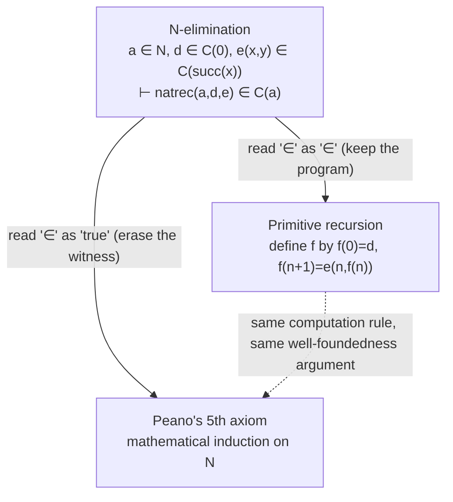
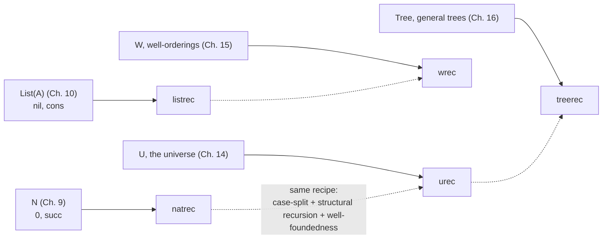

[[book-guidelines|↩ Back to guidelines]]

# Natural Numbers and Lists

## Why the book needs an infinite set now

Every set former up to this point — enumeration sets ($\{i_1,\ldots,i_n\}$, Chapter 6), the [[Equality-Sets|equality sets]] $Id$/$Eq$ (Chapter 8), even $\Pi(A,B)$ (Chapter 7) — has canonical elements you could, in principle, enumerate or case-split on with a *finite* selector. `case` on $\{i_1,\ldots,i_n\}$ has exactly $n$ branches. $funsplit$ on $\Pi(A,B)$ peels off exactly one $\lambda$. Nothing so far has required a selector whose own definition calls itself.

$N$, the set of natural numbers, is the first set in the book whose canonical elements are generated by an *unbounded* process: $0$ is canonical, and if $a$ is canonical so is $succ(a)$, and there is no bound on how many times $succ$ may be applied. A selector for $N$ therefore cannot be a finite case split — it has to be a recursive definition, and recursive definitions raise a question none of the earlier chapters had to answer: how do you know the recursion *terminates*, so that every well-typed program in the language still reduces to a canonical value in finitely many steps (the property the whole book's semantics, back in Chapter 4, depends on)?

The book's answer is $natrec$, and its justification is the chapter's real content: $natrec$ is total by construction, because its recursive calls are only ever made on the immediate predecessor of a value that is itself being consumed by pattern matching on its constructors. This is *structural recursion*, and it is worth naming up front because it is exactly the property a verifier's termination checker has to establish for arbitrary user code — here, in $N$ and $List(A)$, you get to watch the book build the first two instances of a pattern ($natrec$, $listrec$) that later chapters ($urec$ for the universe, $wrec$ for well-orderings, $treerec$ for general trees) will only generalize, never fundamentally change.

## The set $N$: formation and introduction

The formation rule is trivial — $N$ needs no premises:

$$
\dfrac{}{N\ set}\quad\text{N–formation}
$$

The two introduction rules are where the actual content lives. $0$ (arity $0$) and $succ$ (arity $0\to 0$) are declared *canonical* constants — the book's technical way of saying "these, and nothing else, are how you build a value of type $N$":

$$
\dfrac{}{0\in N}\quad\text{N–introduction 1}
\qquad\qquad
\dfrac{a\in N}{succ(a)\in N}\quad\text{N–introduction 2}
$$

Read literally, this says: $0$ is a canonical element, and if $a$ is *any* element of $N$ (not necessarily canonical — it must merely evaluate to one), $succ(a)$ is canonical. The book allows itself the shorthand of numerals $1, 2,\ldots$ for $succ(0), succ(succ(0)),\ldots$, but underneath, every natural number is a finite tower of $succ$'s over $0$.

**Grounding.** This pair of rules is, verbatim, the definition of an inductive enum with one nullary and one unary constructor:

```rust
enum Nat {
    Zero,
    Succ(Box<Nat>),
}
```

```lean
inductive Nat where
  | zero : Nat
  | succ : Nat → Nat
```

The `Box`/indirection in Rust is not incidental — it is the same thing the book's arity system (Chapter 3) is doing when it says $succ$ has arity $0\to 0$: a value of $N$ is either immediately $0$, or it *contains* another, strictly smaller value of $N$. Every structurally recursive function on `Nat` — in Rust, in Lean, or as $natrec$ — walks down that containment relation, and that relation being well-founded (it can't be followed forever; every chain bottoms out at `Zero`) is precisely what makes recursion on it *guaranteed* to terminate, rather than merely usually terminating.

## $natrec$: primitive recursion as a selector

### The problem it solves

Chapter 5 established that every set former needs a selector — a noncanonical constant that lets you *use* an arbitrary element of the set, not just build canonical ones. For $\Pi(A,B)$ that selector was $apply$ (or $funsplit$); [[Enumeration-Sets,-Truth-and-Falsity|for the enumeration sets]] it was $case$. For $N$, the book introduces $natrec$, of arity $0\otimes 0\otimes(0\otimes 0\to 0)\to 0$ — three arguments: a natural number to recurse on, a base value, and a step function that receives both the predecessor and the *already-computed* recursive result.

**[[The-Semantics-of-Judgement-Forms#What breaks without it|What breaks without it]].** Without a selector, $N$ would have introduction rules (so you could construct numerals) but no way to define a function *out of* $N$ except by an infinite family of separately-stated equations, one per numeral — you could never write $\oplus$ or $*$ as a single closed definition, only case-by-case as $0\oplus y$, $1\oplus y$, $2\oplus y,\ldots$ forever. $natrec$ is what turns "$N$ has these canonical forms" into "you may define a function on $N$ by saying what it does at $0$ and how to get the $succ(n)$ case from the $n$ case" — a single finite specification covering infinitely many inputs.

### The computation rule

$natrec(a,d,e)$ is defined operationally, by cases on the evaluated form of $a$ — this is the book's actual definition, word for word in substance:

1. Evaluate $a$ to canonical form.
2. If the result is $0$, the value of $natrec(a,d,e)$ is the value of $d$.
3. If the result is $succ(b)$, the value of $natrec(a,d,e)$ is the value of $e(b,\ natrec(b,d,e))$.

That third clause is the whole mechanism: to compute $natrec$ at $succ(b)$, you *first* recursively compute $natrec(b,d,e)$, then feed both $b$ and that result to $e$. So defining a function $f$ by the ordinary mathematical primitive recursion scheme

$$
f(0) = d \qquad\qquad f(n\oplus 1) = e(n, f(n))
$$

is, in type theory, exactly the definition $f \equiv (n)\,natrec(n,d,e)$.

The book immediately cashes this in for addition and multiplication:

$$
\oplus(x,y) \equiv natrec(x,\ y,\ (u,v)\,succ(v))
\qquad\qquad
*(x,y) \equiv natrec(x,\ 0,\ (u,v)\,\oplus(y,v))
$$

Unwind $\oplus(2,y)$ by hand and you get exactly what you'd expect: $natrec$ peels one $succ$ off $x$ at a time, wrapping the recursive result in one more $succ$, until $x$ bottoms out at $0$ and the recursion returns $y$ itself — i.e., $\oplus(x,y) = succ^x(y)$, "apply $succ$, $x$ times, to $y$." Multiplication is defined the same way, by recursing on $x$ and using the already-defined $\oplus$ in the step.

### Grounding: $natrec$ as a fold, and where a fold isn't enough

The Rust translation of the computation rule above is immediate once you notice its shape is exactly a `match` with one recursive branch — this *is* structural recursion, checked by Rust's own borrow/ownership discipline (you can only recurse on the boxed sub-value, which is syntactically smaller):

```rust
fn natrec<R: Clone>(n: &Nat, d: &R, e: &impl Fn(&Nat, R) -> R) -> R {
    match n {
        Nat::Zero => d.clone(),
        Nat::Succ(b) => e(b, natrec(b, d, e)),
    }
}

fn add(x: &Nat, y: &Nat) -> Nat {
    natrec(x, y, &|_u, v: Nat| Nat::Succ(Box::new(v)))
}
```

This is a completely faithful translation of $\oplus(x,y) \equiv natrec(x,y,(u,v)\,succ(v))$ — but notice what it *doesn't* capture. The signature `fn natrec<R: Clone>(...) -> R` fixes one output type `R` for every call, i.e. it only implements the case where the book's full elimination motive $C(v)$ is a *constant* set, not a genuine family varying with $v$. The book's actual $natrec$ — the one that also justifies $N$-elimination below — allows $d\in C(0)$ and $e(x,y)\in C(succ(x))$ where $C$ is a dependent family: the type of the base case and the type of each step can *depend on which natural number you're at*.

Rust's trait system dispatches on types, not values, so there is no direct way to write "the return type depends on the runtime value of `n`." The honest way to *fake* it is to lift `Nat` to the type level — build a second, type-level copy of the same inductive structure via zero-sized marker types, and index a `Motive` trait by that type-level copy instead of the runtime value:

```rust
use std::marker::PhantomData;

// A type-level mirror of Nat, used purely so the trait system has
// something to dispatch on — this is defunctionalization, not a real
// dependent type.
struct TZero;
struct TSucc<N>(PhantomData<N>);

// The motive C : N -> Set, faked as a trait indexed by the type-level Nat.
trait Motive<N> {
    type Output;
}

struct EvenOddMotive;
impl Motive<TZero> for EvenOddMotive { type Output = IsEven; }
impl<N> Motive<TSucc<N>> for EvenOddMotive
where
    EvenOddMotive: Motive<N>,
{
    // C(succ(n)) stated purely in terms of C(n)'s type-level shape —
    // this can flip Output between IsEven/IsOdd markers as N grows,
    // giving a genuinely value-dependent return *type*, not just value.
    type Output = <EvenOddMotive as Motive<N>>::Output; // (elided: real impl would flip)
}
```

This compiles and does what it claims, but it is a strained, second-class imitation: you had to duplicate `Nat` at the type level, every proof obligation about the motive now has to be discharged with trait bounds instead of ordinary values, and the "value" you actually compute with (`Nat::Succ(Box::new(...))`) is disconnected from the type-level witness that describes it — nothing forces them to stay in sync except discipline. That gap is exactly the thing dependent type theory closes by fiat: in $N$-elimination below, $C(v)$ is allowed to mention the value $v$ directly, because in this theory *values can appear inside types*. A Rust verifier that needs a genuinely dependent motive (say, checking that a recursive function's output type refines on the shape of its structurally-decreasing input) is choosing between this defunctionalization trick and dropping down to runtime tag-checking with `Box<dyn Any>` and a panic on mismatch — there is no idiomatic third option, because Rust's types don't depend on values.

Lean's `Nat.rec` is the book's $natrec$ with *no* faking required, because Lean's types are genuinely allowed to mention terms:

```lean
-- Nat.rec : {motive : Nat → Sort u} →
--   motive Nat.zero →
--   ((n : Nat) → motive n → motive n.succ) →
--   (t : Nat) → motive t
example (motive : Nat → Sort u) (d : motive 0)
    (e : (n : Nat) → motive n → motive n.succ) (t : Nat) : motive t :=
  Nat.rec d e t
```

`motive` here is the book's $C$, verbatim — a function from *values* of `Nat` to *types* (`Sort u`). There is no second, type-level `Nat` needed; `Nat.rec` simply takes `motive n`, a type that mentions the actual value `n`, as its return type. This is also why Lean's `induction t with | zero => ... | succ n ih => ...` tactic compiles to exactly `Nat.rec` — "do induction" and "apply the eliminator" are the same operation in the kernel, which is the book's own point (see the next section).

A quick Python sketch, useful precisely because it drops the type discussion entirely and shows only the control flow:

```python
def natrec(n, d, e):
    if n == 0:
        return d
    return e(n - 1, natrec(n - 1, d, e))

add = lambda x, y: natrec(x, y, lambda u, v: v + 1)
```

## $N$-elimination: induction *is* the eliminator

### The rule

The elimination rule generalizes $natrec$'s computation rule to a full proof rule, with the dependent motive $C$ made explicit:

$$
\dfrac{a\in N \qquad d\in C(0) \qquad C(v)\ set\ [v\in N] \qquad e(x,y)\in C(succ(x))\ [x\in N,\ y\in C(x)]}{natrec(a,d,e)\in C(a)}\quad\text{N–elimination}
$$

Read the four premises as: you have a number $a$; you know how to produce something of type $C(0)$ (the base case); $C$ is a well-defined family of sets over all of $N$; and, *assuming* $x\in N$ and *assuming you already have* an element $y\in C(x)$ (the induction hypothesis), you know how to produce an element of $C(succ(x))$. Conclusion: $natrec(a,d,e)$ is an actual element of $C(a)$ — the specific number you started with, not some generic bound.

### Why this rule is sound: the well-foundedness argument

The book justifies the rule by literally re-running $natrec$'s computation rule as an argument, not just asserting it:

1. If $a$ evaluates to $0$: the value of $natrec(a,d,e)$ is the value of $d$, which by the second premise is a canonical element of $C(0)$; by extensionality of $C$ (the requirement from Chapter 4 that equal inputs give equal — here, judgementally identical — sets), $C(a)=C(0)$, so this is a canonical element of $C(a)$.
2. If $a$ evaluates to $succ(b)$: the value is $e(b, natrec(b,d,e))$, which is a canonical element of $C(succ(b))=C(a)$ *provided* $natrec(b,d,e)\in C(b)$ — which is the very same claim, one level down, about $b$ instead of $a$.
3. This recursion on the argument itself terminates: $b$'s evaluated form is either $0$ (case 1 again) or $succ(c)$ for some $c$, and "this method will terminate since all natural numbers are obtained by applying the successor function to $0$ a finite number of times" — i.e., the argument bottoms out precisely because $N$'s *introduction rules* only ever build finite towers of $succ$.

This last line is worth sitting with: the soundness proof for $N$-elimination is *itself* an induction on $N$, done informally at the semantic level, to justify a formal induction principle at the syntactic level. The book is explicit that this is not circular sleight of hand — it's using mathematical induction as a genuine metatheoretic tool (accepted at the level of the informal semantics) to certify that the *formal* rule, once stated, is trustworthy. Structural recursion is well-founded because the constructors of $N$ only ever produce finitely deep towers — this is the semantic fact a real termination checker has to verify, syntactically, by confirming every recursive call's argument is a strict sub-term of the constructor being matched.

### Mathematical induction falls out by erasing the witness

Here is the chapter's sharpest observation. Strip the *construction* out of $N$-elimination — stop asking for the specific program $natrec(a,d,e)$ and just ask whether $C(a)$ is *true* — and you get exactly Peano's fifth axiom, mathematical induction, as a natural-deduction rule:

$$
\dfrac{a\in N \qquad C(v)\ prop\ [v\in N] \qquad C(0)\ true \qquad C(succ(x))\ true\ [C(x)\ true]}{C(a)\ true}
$$

This is not an analogy or a coincidence — it is the *same rule*, read through the "$A\ true$" judgement instead of the "$a\in A$" judgement (recall from Chapter 4: $A\ true$ just means "there exists some $a$ with $a\in A$, witness suppressed"). Doing induction to prove $C(a)$ and computing $natrec(a,d,e)$ to build a value of $C(a)$ are the *same act*; a mathematical proof by induction is not "justified by" or "analogous to" primitive recursion — under propositions-as-sets it *is* a primitive recursive program, you've just chosen not to write its value down.



### Grounding: this is exactly `Nat.rec`, and `induction` compiles to it

This is precisely why Lean's `induction n with | zero => ... | succ k ih => ...` tactic is not a separate mechanism from `Nat.rec` — it elaborates directly into an application of `Nat.rec` (or the closely related `Nat.casesOn`/custom recursors Lean derives for any `inductive`). "Doing induction" in the tactic language and "applying the eliminator" in the term language are, by construction, the same kernel term; the tactic is convenience syntax over exactly the rule above.

```lean
theorem add_zero_left (n : Nat) : 0 + n = n := by
  induction n with
  | zero => rfl
  | succ k ih =>
    -- ih : 0 + k = k
    -- goal : 0 + Nat.succ k = Nat.succ k
    simp [Nat.add_succ, ih]
```

For the standing verifier project, the load-bearing fact is: **a Rust structural-recursion / termination checker and a Rust induction-proof checker are the same checker**, because $N$-elimination doesn't distinguish "compute a value" from "prove a proposition" — it only distinguishes whether you keep or discard the witness. Building the machinery to accept `natrec`-shaped definitions as terminating is, with zero extra work, also the machinery for accepting induction proofs as valid.

## Peano's axioms, chapter by chapter

The book doesn't collect Peano's axioms into one list — they fall out piecemeal as consequences of [[Equality-Sets#The rules|the rules]] already given, which is itself worth noticing (axioms about $N$ aren't primitive stipulations here; they're theorems about the rules for $N$):

| Peano axiom | Status in this chapter |
|---|---|
| 1. $0$ is a natural number | $N$-introduction 1 |
| 2. Every natural number has a successor, also a natural number | $N$-introduction 2 |
| 3. Distinct naturals have distinct successors (injectivity of $succ$) | Derived rule, proved below using $pred$ |
| 4. $0$ is not the successor of any natural number | Stated, but proof **deferred** to Chapter 14 (needs the universe $U$) |
| 5. Mathematical induction | $N$-elimination with the witness erased, above |

### Worked example: Peano's third axiom via $pred$

The book proves injectivity of $succ$ as a *derived rule* — a new inference rule whose validity is established by giving an explicit derivation from the primitive rules, rather than adding a new primitive. First, define the predecessor by primitive recursion, discarding the recursive result and just returning the predecessor itself:

$$
pred \equiv (x)\,natrec(x,\ 0,\ (u,v)\,u)
$$

(At $0$, return $0$ arbitrarily; at $succ(u)$, return $u$ — ignore the recursively computed $v$ entirely.) Since $0\in N$ and $u\in N\ [u\in N]$, $N$-elimination immediately gives $pred(x)\in N\ [x\in N]$.

Now assume $m\in N$, $n\in N$, and $succ(m)=succ(n)\in N$ (judgemental [[Propositions-as-Sets-(The-Curry-Howard-Correspondence)#Equality|equality]]). Applying $pred$ to both sides via **Substitution in equal elements** (Chapter 5) gives

$$
pred(succ(m)) = pred(succ(n)) \in N
$$

and **N-equality 2** — the computation rule for $natrec$ applied at a $succ$, viewed as an equality — collapses each side:

$$
pred(succ(m)) = m \in N \qquad\qquad pred(succ(n)) = n \in N
$$

Symmetry and transitivity of judgemental equality on these three facts together give $m = n \in N$ directly — no case analysis, no induction, just one application of a recursively-defined function to strip off the shared $succ$. This is the derived rule

$$
\dfrac{m\in N \qquad n\in N \qquad succ(m)=succ(n)\in N}{m=n\in N}
$$

The book also flags a subtlety worth internalizing precisely because it recurs all through the rest of the book: this is a statement about *judgements* (an inference rule between things known to hold), not a *proposition*. You can restate it as a proposition using the equality set from Chapter 8 instead —

$$
(\forall x\in N)(\forall y\in N)\big(Id(N,succ(x),succ(y)) \supset Id(N,x,y)\big)
$$

— and prove that using $Id$'s rules in place of judgemental equality's rules, but the two formulations are "inherently different": one lives at the level of the calculus's own inference system, the other is an object *inside* the theory that you could go on to use as a lemma, pass as an argument, or negate. Keeping this distinction sharp is exactly what lets Chapter 8's $Id$/$Eq$ machinery do useful work later — a rule you can only invoke, versus a proposition you can also manipulate.

### Why the fourth axiom has to wait

$0\neq succ(n)$ needs negation, i.e. $Id(N,0,succ(n))\supset\bot$ — a function from a proof of $0=succ(n)$ to an element of the empty set. Building that function by recursion on $N$ would need a family $C:N\to Set$ with $C(0)$ inhabited and $C(succ(n))$ *empty*, so that transporting along a (hypothetical) proof $0=succ(n)$ carries an element of $C(0)$ into the empty set $C(succ(n))$ — a contradiction, hence no such proof exists. Constructing that family requires being able to talk about "the set $T$ or the set $\emptyset$, chosen by cases on whether the argument is $0$," as a single first-class *value* that $natrec$ can return — but $natrec$'s codomain in this chapter is a family of sets fixed at elaboration time, not a value the theory lets you compute with directly. Making "which set" itself into computable data needs the universe $U$ (Chapter 14), whose entire point is to reflect sets as *codes*, i.e. ordinary elements of a set, that can then be fed through $natrec$ (there specialized to $urec$) like any other value. That is exactly what the guidelines flag as the chapter's second key question, and the book is candid about postponing it rather than faking a workaround.

## Lists: the same recursor, one more field

### $List(A)$, $nil$, $cons$

$List(A)$ mirrors $N$'s structure almost exactly, with one difference: the successor-like constructor now carries an extra piece of data, an element of $A$, alongside the recursive sub-list. Three new constants: $List$ (arity $0\to 0$), $nil$ (arity $0$), and $cons$ (arity $0\otimes 0\to 0$), with the infix definition $a.l \equiv cons(a,l)$.

$$
\dfrac{A\ set}{List(A)\ set}\quad\text{List–formation}
\qquad\qquad
\dfrac{}{nil\in List(A)}
\qquad
\dfrac{a\in A \qquad l\in List(A)}{a.l\in List(A)}\quad\text{List–introduction}
$$

This is $N$ with $succ$ replaced by a two-argument constructor $cons$, and it is no accident that the Rust and Lean encodings are structurally identical to `Nat`'s, just with an extra field:

```rust
enum List<T> {
    Nil,
    Cons(T, Box<List<T>>),
}
```

```lean
inductive List (α : Type u) where
  | nil : List α
  | cons : α → List α → List α
```

### $listrec$: the selector, generalized by one argument

$listrec$, of arity $0\otimes 0\otimes(0\otimes 0\otimes 0\to 0)\to 0$, computes exactly like $natrec$ except the step function $e$ now receives three arguments instead of two — the head, the tail, *and* the already-computed recursive result on the tail:

1. Evaluate $l$.
2. If $l$ evaluates to $nil$: the value of $listrec(l,c,e)$ is the value of $c$.
3. If $l$ evaluates to $a.l_1$: the value of $listrec(l,c,e)$ is the value of $e(a,\ l_1,\ listrec(l_1,c,e))$.

The elimination and equality rules follow the exact same template as $N$'s, "justified in the same way" (the book's own words), just with the extra bound variable for the head element:

$$
\dfrac{l\in List(A) \qquad C(v)\ set\ [v\in List(A)] \qquad c\in C(nil) \qquad e(x,y,z)\in C(x.y)\ [x\in A,\ y\in List(A),\ z\in C(y)]}{listrec(l,c,e)\in C(l)}\quad\text{List–elimination}
$$

$$
listrec(nil,c,e) = c\in C(nil)\quad\text{List–equality 1}
\qquad\qquad
listrec(a.l,c,e) = e(a,l,listrec(l,c,e))\in C(a.l)\quad\text{List–equality 2}
$$

**Grounding.** If you've written `fold_right` (Rust/OCaml/Haskell terminology) or `List.rec` (Lean), this is that function, with the dependent-motive caveat from the $natrec$ section applying identically here — a non-dependent Rust `listrec` only covers the case where the accumulator type is fixed for every recursive call, and a genuinely dependent $C$ (output type varies with the *shape* of the remaining list, e.g. "a sorted list of length $n$") again needs the type-level defunctionalization trick, or Lean's native dependent `motive`.

```rust
fn listrec<T, R: Clone>(l: &List<T>, c: &R, e: &impl Fn(&T, &List<T>, R) -> R) -> R {
    match l {
        List::Nil => c.clone(),
        List::Cons(a, rest) => e(a, rest, listrec(rest, c, e)),
    }
}
```

```lean
-- List.rec : {motive : List α → Sort u} → motive [] →
--   ((a : α) → (l : List α) → motive l → motive (a :: l)) →
--   (t : List α) → motive t
```

The book defines $append$ directly as an instance:

$$
append(l_1,l_2) \equiv listrec(l_1,\ l_2,\ (x,y,z)\,x.z)
$$

with infix notation $l_1@l_2 \equiv append(l_1,l_2)$. List-equality immediately gives the two defining equations you'd expect from any ordinary recursive definition of append:

$$
nil@l_2 = l_2 \in List(A) \qquad\qquad a.l_1@l_2 = a.(l_1@l_2) \in List(A)
$$

```rust
fn append<T: Clone>(l1: &List<T>, l2: &List<T>) -> List<T> {
    listrec(l1, l2, &|a: &T, _rest: &List<T>, z: List<T>| {
        List::Cons(a.clone(), Box::new(z))
    })
}
```

## Worked example: associativity of append

This is the book's own extended example (Chapter 10, pp. 68–71), and it earns the space: it's the first place in the book where a proof by induction has to reach *past* judgemental equality into propositional equality partway through, and watching exactly where and why that happens is more instructive than any amount of abstract description.

### The statement, and the informal proof

**Claim.** For $p,q,r\in List(A)$ (write $L$ for $List(A)$):

$$
p@(q@r) =_L (p@q)@r
$$

**Informal proof, by induction on $p$.**

*Base case* ($p=nil$): both sides simplify by the definition of $@$ alone:

$$
nil@(q@r) = q@r \qquad\qquad (nil@q)@r = q@r
$$

so both sides equal $q@r$, judgementally, with no induction hypothesis needed.

*Induction step* ($p = x.y$, assuming $y@(q@r) =_L (y@q)@r$ as the hypothesis): the left side simplifies in one step,

$$
(x.y)@(q@r) = x.(y@(q@r))
$$

and the right side simplifies in two, then invokes the induction hypothesis on the tail:

$$
((x.y)@q)@r = (x.(y@q))@r = x.((y@q)@r) \overset{\text{IH}}{=} x.(y@(q@r))
$$

Both sides land on $x.(y@(q@r))$, so they're equal — but notice the very last step is *not* a computation rule; it's an appeal to something you're merely assuming holds, one recursion level down.

### The formal proof: where the switch to propositional equality happens

To turn this into a type-theoretic derivation, use $List$-elimination with motive

$$
C(v) \equiv \big[v@(q@r) =_L (v@q)@r\big]
$$

i.e. $C(v)$ is the *equality set* $Id(L,\ v@(q@r),\ (v@q)@r)$ — a proposition, not a plain set, which is exactly the propositions-as-sets move: "prove $C(p)$" and "find an element of $C(p)$" are the same task. $List$-elimination then demands exactly three things: $p\in L$ (already assumed); an element of $C(nil)$; and, under $x\in A,\ y\in L,\ z\in C(y)$, an element of $C(x.y)$.

**Base case.** Both simplifications above are *judgemental* — pure unfolding of $@$'s definition via List-equality (plus one use of substitution on the right side, since $(nil@q)@r$ needs $nil@q\equiv q$ substituted in before List-equality applies to the outer $@$). Because both sides reduce to the literal same term $q@r$, you get judgemental equality $nil@(q@r) \equiv (nil@q)@r$ for free, and $Id$-introduction converts that directly into a propositional witness:

$$
id\big(nil@(q@r)\big) \in \big[nil@(q@r) =_L (nil@q)@r\big]
$$

$id$ here is $Id$-introduction from Chapter 8 — literally "reflexivity," the constructor that turns *any* judgemental equality into a propositional one for free. This is worth pausing on: the entire base case costs nothing beyond unfolding definitions, because $q@r$ and $q@r$ are the same expression on the nose.

**Induction step — and this is the crux.** The left-hand simplification is again pure computation:

$$
id\big((x.y)@(q@r)\big) \in \big[(x.y)@(q@r) =_L x.(y@(q@r))\big] \tag{10.1}
$$

and so is the right-hand simplification, down to $x.((y@q)@r)$:

$$
id\big(x.((y@q)@r)\big) \in \big[x.((y@q)@r) =_L ((x.y)@q)@r\big] \tag{10.2}
$$

But the *last* move of the informal proof — replacing $(y@q)@r$ by $y@(q@r)$ inside the $x.(-)$ context, using the induction hypothesis — is **not** a judgemental identity. The induction hypothesis $z$ is only ever given as an element $z\in C(y)$, i.e. $z\in [y@(q@r)=_L (y@q)@r]$ — a *proof object*, opaque data, not a computation rule you can unfold. You cannot substitute it the way you substitute a definition; you have to invoke the derived $subst$ rule for propositional equality (built from $Id$-elimination back in Chapter 8) to transport along it, against the family $P(u) \equiv [x.(y@(q@r)) =_L x.u]$:

$$
subst\big(z,\ id(x.(y@(q@r)))\big) \in \big[x.(y@(q@r)) =_L x.((y@q)@r)\big] \tag{10.3}
$$

Now chain (10.1), (10.3), and (10.2) with two applications of $trans$ (also derived from $Id$-elimination in Chapter 8) to land on the goal:

$$
trans\Big(trans\big(id((x.y)@(q@r)),\ subst(z,id(x.(y@(q@r))))\big),\ id(x.((y@q)@r))\Big) \in \big[(x.y)@(q@r) =_L ((x.y)@q)@r\big]
$$

**Combining base and step via $List$-elimination** produces the single closed term that *is* the whole proof:

$$
listrec\Big(p,\ id(nil@(q@r)),\ (x,y,u)\,trans\big(trans(id((x.y)@(q@r)),\ subst(z,id(x.(y@(q@r))))),\ id(x.((y@q)@r))\big)\Big) \in \big[p@(q@r) =_L (p@q)@r\big]
$$

The book's own closing remark on this example is worth keeping: "this example shows the practical importance of using the judgement form $A\ true$" — the element above is not an interesting *program*, nobody wants to run it; its entire value is as a certificate that the proposition holds. This is the clean split between $listrec$ used for *computation* (defining $@$ itself) and $listrec$ used for *proof* (this term) — same selector, same rule, radically different reason for wanting the output.

<svg viewBox="0 0 920 300" xmlns="http://www.w3.org/2000/svg" font-family="sans-serif" font-size="13">
  <rect x="0" y="0" width="920" height="300" fill="none"/>
  <text x="230" y="24" text-anchor="middle" fill="#9a9a9a" font-size="13">simplify nil@(q@r)</text>
  <text x="690" y="24" text-anchor="middle" fill="#9a9a9a" font-size="13">simplify (nil@q)@r</text>

  <!-- left tree -->
  <text x="120" y="55" text-anchor="middle" fill="#c8c8c8">q ∈ L</text>
  <text x="220" y="55" text-anchor="middle" fill="#c8c8c8">r ∈ L</text>
  <text x="320" y="55" text-anchor="middle" fill="#c8c8c8">x ∈ A</text>
  <text x="400" y="55" text-anchor="middle" fill="#c8c8c8">z ∈ L</text>

  <line x1="90" y1="65" x2="250" y2="65" stroke="#8a8a8a" stroke-width="1.3"/>
  <text x="170" y="82" text-anchor="middle" fill="#c8c8c8">q@r ∈ L</text>

  <line x1="295" y1="65" x2="425" y2="65" stroke="#8a8a8a" stroke-width="1.3"/>
  <text x="360" y="82" text-anchor="middle" fill="#c8c8c8">x.z ∈ L</text>
  <text x="440" y="72" fill="#9a9a9a" font-size="11">List-intro</text>

  <line x1="90" y1="95" x2="425" y2="95" stroke="#8a8a8a" stroke-width="1.3"/>
  <text x="440" y="93" fill="#9a9a9a" font-size="11">List-equality</text>
  <text x="230" y="115" text-anchor="middle" fill="#c8c8c8" font-size="12">
    listrec(nil, q@r, (x,y,z)x.z) = q@r ∈ L
  </text>
  <text x="230" y="132" text-anchor="middle" fill="#9a9a9a" font-size="11">( = nil@(q@r) )</text>

  <!-- right tree -->
  <text x="590" y="55" text-anchor="middle" fill="#c8c8c8">x ∈ A</text>
  <text x="660" y="55" text-anchor="middle" fill="#c8c8c8">z ∈ L</text>
  <line x1="565" y1="65" x2="685" y2="65" stroke="#8a8a8a" stroke-width="1.3"/>
  <text x="700" y="63" fill="#9a9a9a" font-size="11">List-intro</text>

  <text x="540" y="82" text-anchor="middle" fill="#c8c8c8">nil ∈ L</text>
  <text x="625" y="82" text-anchor="middle" fill="#c8c8c8">x.z ∈ L</text>

  <line x1="510" y1="92" x2="655" y2="92" stroke="#8a8a8a" stroke-width="1.3"/>
  <text x="670" y="90" fill="#9a9a9a" font-size="11">List-equality</text>
  <text x="580" y="110" text-anchor="middle" fill="#c8c8c8" font-size="12">nil@q = q ∈ L</text>

  <text x="770" y="82" text-anchor="middle" fill="#c8c8c8">u ∈ L</text>
  <text x="840" y="82" text-anchor="middle" fill="#c8c8c8">r ∈ L</text>
  <line x1="745" y1="92" x2="865" y2="92" stroke="#8a8a8a" stroke-width="1.3"/>
  <text x="805" y="110" text-anchor="middle" fill="#c8c8c8" font-size="12">u@r ∈ L</text>

  <line x1="510" y1="125" x2="865" y2="125" stroke="#8a8a8a" stroke-width="1.3"/>
  <text x="880" y="123" fill="#9a9a9a" font-size="11">subst</text>
  <text x="690" y="145" text-anchor="middle" fill="#c8c8c8" font-size="12">
    (nil@q)@r = q@r ∈ L
  </text>

  <!-- combine -->
  <line x1="170" y1="160" x2="230" y2="200" stroke="#8a8a8a" stroke-width="1.1" stroke-dasharray="3,3"/>
  <line x1="690" y1="160" x2="500" y2="200" stroke="#8a8a8a" stroke-width="1.1" stroke-dasharray="3,3"/>
  <rect x="230" y="205" width="460" height="55" rx="6" fill="none" stroke="#8a8a8a" stroke-width="1.3"/>
  <text x="460" y="228" text-anchor="middle" fill="#c8c8c8" font-size="12">symm + trans (judgemental) on both halves,</text>
  <text x="460" y="246" text-anchor="middle" fill="#c8c8c8" font-size="12">then Id-introduction: id(nil@(q@r)) ∈ [nil@(q@r) =L (nil@q)@r]</text>

  <text x="460" y="285" text-anchor="middle" fill="#9a9a9a" font-size="11">base case of the associativity proof, Ch. 10 pp. 69–70 — the induction step needs subst/trans on the propositional Id-set instead</text>
</svg>

### Grounding: the same proof in Lean, and what `congrArg`/`Eq.trans` are doing

Lean's `List.append` is defined by recursion on its first argument exactly as the book defines $@$, so the base case of associativity really is `rfl` — definitional/judgemental equality, matching the book's base case costing nothing beyond unfolding. The induction step needs to push the hypothesis under a constructor, which is exactly the book's $subst$ move:

```lean
theorem append_assoc (p q r : List α) :
    (p ++ q) ++ r = p ++ (q ++ r) := by
  induction p with
  | nil =>
    rfl
    -- nil ++ (q ++ r) ≡ q ++ r ≡ (nil ++ q) ++ r, purely by unfolding —
    -- the book's base case, no subst/trans needed.
  | cons x y ih =>
    -- ih : (y ++ q) ++ r = y ++ (q ++ r)
    -- goal reduces (List-equality 2, twice) to:
    --   x :: ((y ++ q) ++ r) = x :: (y ++ (q ++ r))
    -- congrArg pushes `ih` under the `x ::` constructor — this is the
    -- book's `subst` on the family P(u) ≡ [x.(y@(q@r)) =L x.u].
    exact congrArg (x :: ·) ih
```

`congrArg (x :: ·) ih` *is* $subst(z, id(x.(y@(q@r))))$: both take a proof that two things are equal and produce a proof that a fixed context applied to each side is equal, which is precisely the congruence property Chapter 4 required of every extensional family (see [[The-Semantics-of-Judgement-Forms|The Semantics of Judgement Forms]]). `Eq.trans` (or the `▸`/`calc` machinery Lean provides for chaining) plays the role of the book's $trans$. Nothing here is a loose analogy — it is the same proof, the same three lemmas, wearing different concrete syntax.

## Where this leads

$natrec$ and $listrec$ are not two unrelated definitions — they're the first two instances of a single recipe the book reuses, unchanged in spirit, for every inductively-defined set that comes later: give the constructors, then give a selector that computes by structural recursion over those constructors and is justified by exactly the two-part argument used above (case-split on the evaluated form; recurse on strictly smaller data; appeal to well-foundedness of the constructors to know the recursion bottoms out).



Two threads carry forward explicitly from here. First, Peano's fourth axiom ($0\neq succ(n)$) stays open until Chapter 14 introduces the universe $U$ — precisely because proving it needs a recursively-computed *set*, not just a recursively-computed element, and $U$ is what makes "set" itself into ordinary computable data. Second, the propositional-equality machinery this chapter leaned on so heavily — $id$, $subst$, $trans$ from Chapter 8 — becomes the standing toolkit for every later induction that needs to invoke a hypothesis rather than merely unfold a definition; the associativity proof above is the template, not a one-off.

For the standing projects this vault is built around: **this chapter is where "structural recursion" and "well-founded induction" become the same checked property**, which is exactly the discipline a Rust verifier's termination checker has to enforce on any recursive definition it accepts — every recursive call must be on data that is a strict sub-term of the argument being matched, mirroring $N$ and $List(A)$'s constructor structure. And the associativity worked example is the smallest complete illustration of the pattern a Hoare-triple-soundness or contract-checking proof will need constantly: a base case dispatched by pure computation, and an induction step that must explicitly `subst` the hypothesis into a propositional-equality goal rather than expect it to unify away for free — the exact moment where "checking types" and "checking proofs" (already unified at the judgement level in [[The-Semantics-of-Judgement-Forms|The Semantics of Judgement Forms]]) diverge in *difficulty*, even though they never diverge in *kind*.
