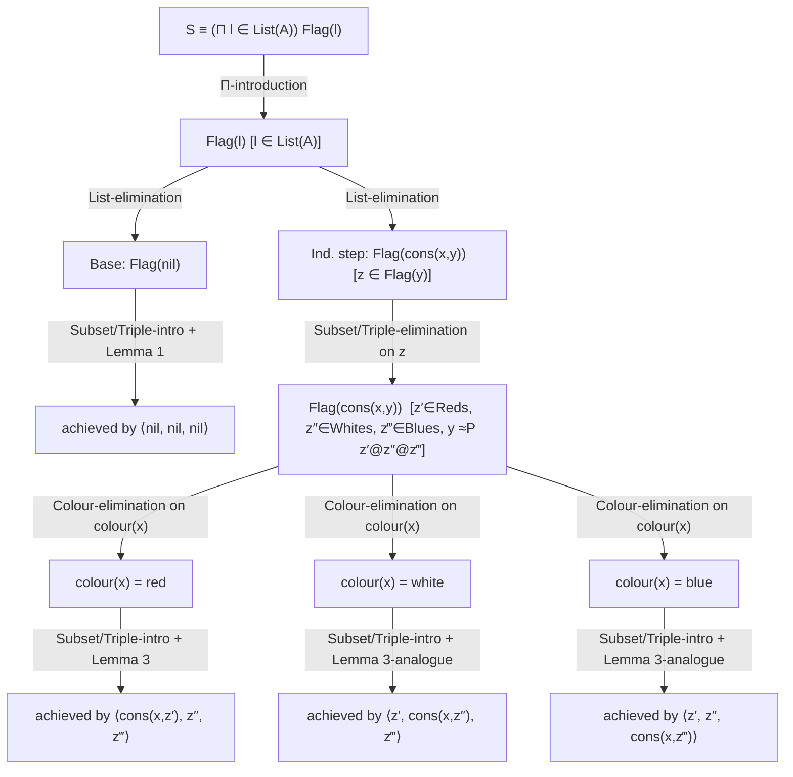

# Programming as Program Derivation

By this point in the book, you have an entire catalogue of set formers, each with its formation, introduction, elimination and [[Propositions-as-Sets-(The-Curry-Howard-Correspondence)#Equality|equality]] rules, all justified from the same computational semantics. Chapter 21 and Chapter 22 ask a practical question about that catalogue: now that you have all these rules, how do you actually *use* them to build a program? The answer the book gives is a genuine shift in stance — not a new piece of theory, but a new way of reading the theory you already have. That shift is the subject of this article.

## Verification versus derivation, revisited

Back in §1.1 the book drew a distinction that can feel almost cosmetic on a first pass: **program verification** starts with a program and proves it meets a specification; **program derivation** starts with a specification and *extracts* a program from a proof that the specification is satisfiable. Chapter 22 opens by cashing this distinction out operationally:

> "Programming in type theory corresponds to theorem proving in mathematics: the specification plays the rôle of the proposition to be proved and the program is obtained from [[The-Universe-of-Small-Sets#The proof|the proof]]."

If a specification is a set and an inhabitant of that set is a program that meets it, then finding a program is *nothing but* finding a proof that the set is inhabited. This isn't a metaphor — it's the same judgement, $a\in A$, read two ways. But it raises an immediate methodological question: how do you actually *search* for such a proof? A proof rule as stated —

$$\frac{a\in A\qquad b\in B}{\langle a,b\rangle\in A\times B}$$

— tells you that *if* you already have $a$ and $b$, you may conclude $\langle a,b\rangle\in A\times B$. Read forwards, it's useless for construction: you'd need to already have solved the two subproblems before [[Natural-Numbers-and-Lists#The rule|the rule]] does anything for you. What you actually want, sitting in front of a blank page with only a specification $A\times B$, is the opposite direction: *given* the goal $A\times B$, what are the pieces I need to go find? That's the whole idea of this chapter, and it's worth being precise about why it matters before formalizing it.

**What breaks without this reversal.** If you insist on building proofs bottom-up — start from axioms and assumptions, chain rules forward, eventually arrive at the goal — you are, as the book puts it, first constructing "the smaller parts of the program" with no target in view, and only later discovering whether they compose into anything the specification actually wants. For a toy example like `half` this is merely inefficient. For something the size of the Dutch national flag derivation worked out at the end of Chapter 22, it's unworkable: you'd be enumerating consequences of the axioms hoping to stumble on the seventeen or so pieces (three lemmas, a `Π`-introduction, a `List`-elimination, a `Subset`/`Triple`-elimination, a three-way case split, three uses of `Subset`/`Triple`-introduction...) that happen to assemble into a solution. Top-down, goal-directed search — inherited explicitly from the LCF system — turns this into a *disciplined decomposition*: split the goal into strictly smaller subgoals, solve each independently, and let the composition of solutions be handed to you automatically as a side effect of how the rule was stated.

## Tactics: reading a rule bottom-up

Here is the reversal, made precise. A judgement $a\in A$ has a corresponding **goal**: the goal $A$ is *achieved* by $a$ exactly when $a\in A$ is provable. Every judgement form has a goal in the same shape — the goal $a=b\in A$ is achieved by a proof of $a=b\in A$, and so on. The methods for splitting a goal into subgoals are called **tactics**, and the book manufactures the basic ones mechanically: take an introduction or elimination rule and read it upside down.

Take conjunction introduction, $\dfrac{A\ true\quad B\ true}{A\ \&\ B\ true}$. Read top-down as a tactic, it says:

> **Goal:** $A\ \&\ B\ true$ — by $\&$-introduction
> - **Subgoal:** $A\ true$
> - **Subgoal:** $B\ true$

Under propositions-as-sets this becomes a program-producing tactic, and now the rule also tells you *how to assemble* the pieces:

> **Goal:** $A\times B$ — by $\times$-introduction
> - **Subgoal:** $A$ ⟶ solved by some $a$
> - **Subgoal:** $B$ ⟶ solved by some $b$
> - **Achieved by:** $\langle a,b\rangle$

The elimination rule for $\times$ becomes a tactic the same way. From $\dfrac{p\in A\times B\qquad e(x,y)\in C(\langle x,y\rangle)\ [x\in A,\,y\in B]}{split(p,e)\in C(p)}$:

> **Goal:** $C(p)$ — by $\times$-elimination
> - **Subgoal:** $A\times B$ ⟶ solved by $p$
> - **Subgoal (under $x\in A,\ y\in B$):** $C(\langle x,y\rangle)$ ⟶ solved by $e(x,y)$
> - **Achieved by:** $split(p,e)$

Two more tactics from the book, both needed later for the Dutch flag derivation. $\Pi$-introduction, from $\dfrac{b(x)\in B(x)\ [x\in A]}{\lambda(b)\in(\Pi x\in A)B(x)}$:

> **Goal:** $(\Pi x\in A)\,B(x)$ — by $\Pi$-introduction
> - **Subgoal (under $x\in A$):** $B(x)$ ⟶ solved by $b(x)$
> - **Achieved by:** $\lambda(b)$

And list elimination, from $\dfrac{l\in List(A)\quad a\in C(nil)\quad b(x,y,z)\in C(cons(x,y))\ [x\in A,\,y\in List(A),\,z\in C(y)]}{listrec(l,a,b)\in C(l)}$:

> **Goal:** $C(l)$ — by $List$-elimination
> - **Subgoal:** $List(A)$ ⟶ solved by $l$
> - **Subgoal:** $C(nil)$ ⟶ solved by $a$
> - **Subgoal (under $x\in A,\ y\in List(A),\ z\in C(y)$):** $C(cons(x,y))$ ⟶ solved by $b(x,y,z)$
> - **Achieved by:** $listrec(l,a,b)$

Every rule in the book converts this way, without exception — this is exactly the strategy used in the Cornell (Nuprl) system the authors cite. The pattern is completely general: **an introduction rule read bottom-up decomposes a goal into the pieces needed to build a canonical element; an elimination rule read bottom-up decomposes a goal by case-analysis or recursion on some element already in hand.** Nothing new is being proved here — every tactic is provably sound *because* it's just the corresponding rule, and applying it correctly always yields a bona fide derivation. What's new is the direction of use.

**This is, almost verbatim, what Lean's tactic framework does.** When you write

```lean
theorem and_intro (ha : A) (hb : B) : A ∧ B := by
  constructor
  · exact ha
  · exact hb
```

`constructor` is doing exactly the book's $\&$-introduction tactic: it reads `And.intro : A → B → A ∧ B` — the introduction rule for `∧` — backwards, turning the goal `A ∧ B` into the two subgoals `A` and `B`, and reassembling `And.intro ha hb` once they close. `intro x` on a goal `∀ x, B x` is $\Pi$-introduction read bottom-up, letter for letter. `cases l with | nil => ... | cons x y => ...` on a goal `C l` for `l : List A` is `List`-elimination read bottom-up — Lean's elaborator is quite literally building a `List.rec` application by threading your two branches into the motive `C`. The book's tactic boxes and Lean's goal state (visible via `#print` or the info view) are the same object described at two different levels of formality.

### Derived tactics: a proved lemma is a one-step tactic

Once you've proved a hypothetical judgement, say $c(x,y)\in C(x,y)\ [x\in A,\,y\in B(x)]$, you don't have to re-derive it every time you need it — you can use it directly as a **derived tactic**:

> **Goal:** $C(x,y)$ — by [the lemma]
> - **Subgoal:** $A$ ⟶ solved by $x$
> - **Subgoal:** $B(x)$ ⟶ solved by $y$
> - **Achieved by:** $c(x,y)$

The book's own miniature example: from the derivation of $\times$-elimination applied to the assumption $p\in A\times B$ and the identity function on the first projection, you get the derived rule $fst(p)\in A\ [p\in A\times B]$ — call it $\times\text{-elim}_1$ — which from then on is usable as a single step rather than a nested $\times$-elimination. As the book notes, if you had a mechanical proof checker, a derived tactic's soundness only has to be checked once, at the point it's derived; every later use just re-applies a name. **This is exactly `apply lemma_name` or `exact lemma_name args` in Lean** — once `lemma_name` is proved, it becomes a single tactic step that discharges any goal of its conclusion's shape, and the kernel never re-checks the internals of `lemma_name`'s own proof when you invoke it elsewhere. It is also, not coincidentally, the mechanism a proof-search engine needs for a *lemma library*: without derived tactics, every proof search would be starting from the primitive rules of Chapters 5–20 every single time.

## Worked example: dividing by two

Chapter 21 works several examples the same way — first as an informal, forward (bottom-up-constructed) natural-deduction proof, then translated into an explicit type-theoretic term. The first is division by 2. We want, for every $x\in N$:

$$(\exists y\in N)(x=_N y*2)\ \vee\ (x=_N y*2\oplus 1)\qquad[x\in N]\tag{21.1}$$

Informally this is a straightforward induction on $x$: base case $0=_N 0*2$ directly; induction step splits on whether $x=_N y*2$ or $x=_N y*2\oplus 1$ held for the predecessor, and in each case exhibits a witness for $x\oplus 1$ by elementary arithmetic, closing with $\vee$-elimination and $\exists$-elimination.

Now translate this proof, term by term, into type theory. The specification (21.1) is a proposition, so under propositions-as-sets it corresponds to a set — but *which* set? There are two candidates for interpreting $\exists$: the $\Sigma$-set, or a subset $\{y\in N\mid \dots\}$. Since only the *computational content* — the quotient $y$ itself — is wanted, and not the disjunction's proof, a subset looks like the natural specification:

$$\{y\in N\mid (x=_N y*2)\vee(x=_N y*2\oplus 1)\}\qquad[x\in N]\tag{21.9}$$

**But this is where the derivation actually gets interesting, and it's the first Key Question of Chapter 21 for a reason.** The informal proof used $\exists$-elimination in its induction step — reusing the induction hypothesis's *witness* to build the successor case. Subset-elimination, inherited from the subset theory of Chapter 18, is deliberately the *weak* rule: it lets you extract that an element of $\{y\in A\mid B(y)\}$ is an element of $A$, but it does not hand back a proof of $B$ strong enough to reconstruct an arbitrary target by case-splitting on which disjunct held — that's exactly the gap Chapter 17 identified and Chapter 18 could only partially repair. So the subset specification (21.9), despite being the more natural-looking rendering of "the integer part of $n/2$," is unusable as the *derivation target*. The book instead derives an element of the $\Sigma$-set

$$(\Sigma y\in N)\big((x=_N y*2)+(x=_N y*2\oplus 1)\big)\qquad[x\in N]\tag{21.10}$$

by genuine $N$-elimination (mathematical induction, mechanically), and only afterwards projects down to the subset with `fst`. The base case, by $N$-equality and $Id$-introduction, is $id(0)\in(0=_N 0*2)$, giving $\langle 0,\ inl(id(0))\rangle\in(\Sigma y\in N)(\dots)$. The induction step assumes $z_1$ in the $\Sigma$-set for $x$, uses $\Sigma$-elimination to expose a witness $y$ and a proof $z_2$ of the disjunction, then $+$-elimination on $z_2$ to handle the two cases — in one branch $y$ is reused unchanged (with a `subst` along $Id(N,x\oplus1,y\oplus1\text{-ish})$), in the other $y\oplus1$ is the new witness, via an arithmetic construction $c(x,y,z_4)$ the book leaves unexpanded. Folding all of this through $N$-elimination gives the single closed term

$$natrec\big(x,\ \langle0,inl(id(0))\rangle,\ (x,z_1)\,split(z_1,(y,z_2)\,when(z_2,\dots))\big)\in(\Sigma y\in N)(\dots)\quad[x\in N]\tag{21.18}$$

and defining $\mathit{half\_proof}\equiv\lambda x.\,(21.18)$ and $\mathit{half}(x)\equiv fst(\mathit{half\_proof}\cdot x)$ finally lands exactly on the subset specification (21.9) — reached only *after* going through the stronger $\Sigma$-set, never directly.

Two details worth dwelling on. First, this single derivation is simultaneously the program `half` and an almost-formal proof that it meets its specification — there is no separate verification step. Second, the arithmetic proof term $c(x,y,z_4)$ that witnesses $x\oplus1=_N(y\oplus1)*2$ is never actually *used* in computing `half` — it only justifies that the type-checker accepts the term. This is proof irrelevance made concrete: a Rust analogue is a zero-sized `PhantomData<Proof>` field carried purely for the type checker, erased at codegen, contributing nothing to the runtime value. The book makes the same point about the resulting program's *shape*: because it was extracted from a proof rather than hand-written, `half` contains a `when`-split that traces back to $\vee$-elimination on "$x$ was even or odd" — where a programmer writing `half` directly would probably reach for `if...then...else` on `x mod 2`. Derivation gives you correctness by construction; it doesn't automatically give you the program a human would have written.

## Even/odd, and "only these constructors" inversion

Chapter 21 reuses `half_proof` to build `even(n)`. The key auxiliary lemma is a general distributivity fact,

$$\big((\exists x\in A)(P(x)\vee Q(x))\big)\supset\big((\exists x\in A)P(x)\vee(\exists x\in A)Q(x)\big)\tag{21.19}$$

translated as $\mathit{distr}\equiv split(z,(x,y)\,when(y,(u)\,inl(\langle x,u\rangle),(v)\,inr(\langle x,v\rangle)))$. Instantiating $P(y)\equiv(x=_N y*2)$, $Q(y)\equiv(x=_N y*2\oplus1)$, applying `distr` to `half_proof · x` gives an element of $\mathit{Even}(x)+\mathit{Odd}(x)$, and

$$\mathit{even}(n)\equiv when(\mathit{distr}\cdot(\mathit{half\_proof}\cdot x),\,(u)\,true,\,(v)\,false)\ \in\ Bool\quad[n\in N]$$

is a program whose value tracks exactly which disjunct held.

Chapter 21 also proves a family of **inversion principles** — propositions asserting that a set's elements really do come only from its stated constructors, e.g. for $Bool$:

$$(\exists b\in Bool)P(b)\ \supset\ P(true)\vee P(false)$$

by case-splitting on $w_1\in Bool$ (via `Bool`-elimination) *inside* a derivation of the [[The-Cartesian-Product-of-a-Family-and-the-Universal-Quantifier#Implication|implication]] $P(w_1)\to(P(true)+P(false))$, so the same closed term $\lambda w.\,split(w,(w_1,w_2)\,apply(\mathrm{if}\ w_1\ \mathrm{then}\ \lambda(inl)\ \mathrm{else}\ \lambda(inr),w_2))$ handles both. The book states the analogous inversion principles for $N$, $List(A)$, $A+B$ and $A\times B$ without re-deriving them — the pattern is identical each time: `Σ`-eliminate to expose the witness, then eliminate on the witness's own set to recover which constructor built it.

## Decidable predicates

A predicate $B(x)\ set\ [x\in A]$ is **decidable** if there's a mechanical procedure that, for any $a\in A$, decides whether $B(a)$ is true or false. Formally:

$$Decidable(A,B)\ \equiv\ (\Pi x\in A)\,B(x)\vee\neg B(x)$$

and a nonempty $Decidable(A,B)$ is *itself* the decision procedure: apply it to $a$, and the resulting element of $B(a)+\neg B(a)$ tells you which case you're in, along with a proof. As a worked example, the book derives an element of $Decidable(N,(n)Id(N,0,n))$ — deciding equality with zero — by induction on $n$: base case $inl(id(0))\in Id(N,0,0)\vee\neg Id(N,0,0)$; induction step uses Peano's fourth axiom, $peano4\in Id(N,0,succ(n))\to\{\}\ [n\in N]$ (proved earlier via the universe, per Chapter 14), together with $\{\}$-elimination, to build a proof of $\neg Id(N,0,succ(x))$ regardless of what the induction hypothesis was. Folding through $N$-elimination:

$$\lambda\big((n)\,natrec(n,\,inl(id(0)),\,(x,y)\,inr(\lambda((z)\,case(peano4\cdot z))))\big)\ \in\ Decidable(N,(n)Id(N,0,n))$$

**This is, almost by design, Lean's `Decidable` typeclass — worth spelling out precisely because the correspondence is exact rather than approximate.** Lean's own definition,

```lean
inductive Decidable (p : Prop) where
  | isFalse (h : ¬p) : Decidable p
  | isTrue  (h : p)  : Decidable p
```

is a two-constructor sum carrying evidence — precisely $B(x)\vee\neg B(x)$ under $\vee\equiv+$, just with the disjuncts swapped in presentation order. A predicate is decidable in Lean's sense exactly when you can produce a `Decidable` instance for every argument, i.e. an element of $(\Pi x\in A)(B(x)+\neg B(x))$ — literally $Decidable(A,B)$. And the analogue of the book's zero-test writes almost identically to the type-theoretic term above:

```lean
def decEqZero : (n : Nat) → Decidable (n = 0)
  | 0     => isTrue rfl
  | n + 1 => isFalse (Nat.succ_ne_zero n)
```

The base case is `id(0)` under a different name (`rfl`); the successor case is Peano's fourth axiom under a different name (`Nat.succ_ne_zero`). Lean's `decide` tactic and its `if h : p then ... else ...` syntax both work *only* because a `Decidable p` instance is available — they mechanically peel off the `isTrue`/`isFalse` constructor exactly the way `natrec` peels off `inl`/`inr` here. This is the cleanest possible illustration of how the book's set-theoretic machinery is doing, under the hood and by name, exactly what a modern proof assistant's decidability infrastructure does.

## Stronger elimination rules

The ordinary elimination rules have a gap that becomes annoying once you start doing serious derivations: when you eliminate $c\in\Sigma(A,B)$ via $split(c,d)$, the branch $d(x,y)$ is proved for an *abstract* pair $\langle x,y\rangle$ — you get no way, inside that branch, to refer back to the fact that $\langle x,y\rangle$ *is* $c$. Most of the time this doesn't matter. But sometimes the target family $C$ genuinely needs the equation $\langle x,y\rangle=_{\Sigma(A,B)}c$ as a hypothesis to close the branch. The **strong elimination rules** patch exactly this gap, by adding the missing equality as an extra premise:

**Strong $\Sigma$-elimination:**

$$\frac{c\in\Sigma(A,B)\qquad C(v)\ set\ [v\in\Sigma(A,B)]\qquad d(x,y)\in C(\langle x,y\rangle)\ [x\in A,\,y\in B(x),\,\langle x,y\rangle=_{\Sigma(A,B)}c\ true]}{split'(c,d)\in C(c)}$$

This isn't a new primitive — it's *derived* from ordinary $\Sigma$-elimination, and the derivation is a nice piece of type-theoretic engineering worth walking through, because the trick recurs constantly in dependently-typed proof engineering. Apply ordinary $\Sigma$-elimination not to $C$ directly, but to the family $C'(u)\equiv(u=_{\Sigma(A,B)}c)\to C(u)$. Assuming $x\in A,\,y\in B(x)$, you need $C'(\langle x,y\rangle)$, i.e. $(\langle x,y\rangle=_{\Sigma(A,B)}c)\to C(\langle x,y\rangle)$ — so assume further $z\in(\langle x,y\rangle=_{\Sigma(A,B)}c)$; now $d(x,y)\in C(\langle x,y\rangle)$ is exactly what's needed (it's available because $z$ witnesses the extra premise), and $\to$-introduction discharges $z$ to give $\lambda z.\,d(x,y)$. Ordinary $\Sigma$-elimination on $c$ then gives $split(c,(x,y)\lambda z.\,d(x,y))\in(c=_{\Sigma(A,B)}c)\to C(c)$, and since $id(c)\in(c=_{\Sigma(A,B)}c)$ is always available, $\to$-elimination closes it:

$$split'(c,d)\ \equiv\ apply\big(split(c,(x,y)\lambda z.\,d(x,y)),\,id(c)\big)$$

The trick is exactly: **turn the missing equation into an implication premise, discharge the implication trivially with the reflexivity proof you always have on hand ($id(c)$), and apply.** When the premises genuinely hold, $split'(c,d)$ computes to the same value as ordinary $split(c,d)$ — the book verifies this by a short chain of computation steps ($c\Rightarrow\langle a,b\rangle$, so $split(c,\dots)\Rightarrow\lambda z.\,d(a,b)$, and applying that to $id(c)$ reduces to $d(a,b)$). The same construction strengthens $\Pi$-, $+$- and $Bool$-elimination:

- **Strong $\Pi$-elimination:** $d(y)\in C(\lambda(y))\ [y(x)\in B(x)\ [x\in A],\ c=_{\Pi(A,B)}\lambda(y)\ true]$ gives $funsplit'(c,d)\in C(c)$.
- **Strong $+$-elimination:** two branches, one for each injection, each carrying the equation $c=_{A+B}inl(x)$ (resp. $inr(y)$) as an extra hypothesis, giving $when'(c,d,e)\in C(c)$.
- **Strong $Bool$-elimination:** $c\in C(true)\ [b=_{Bool}true\ true]$ and $d\in C(false)\ [b=_{Bool}false\ true]$ give $if'(b,c,d)\in C(b)$.

**This is precisely what Lean's `cases h : e` idiom (and Agda's `with`/`inspect` pattern) exists for.** Ordinary `cases e` on a scrutinee `e` loses the connection between `e` and the branch you land in; `cases h : e` — or, in a `match`, `match h : e with`  — additionally introduces `h : e = <constructor pattern>` into the context of each branch, letting later steps rewrite along it. That extra hypothesis is exactly the strong-elimination rule's extra premise, produced automatically rather than derived by hand each time. It's worth noting this is a genuinely recurring need, not a one-off convenience: any goal-directed proof search that eliminates on an intermediate term (rather than a bare variable) will eventually need this strengthening, because otherwise information about *which* case actually held gets thrown away the moment you generalize over the constructor's arguments.

## Case study: deriving the Dutch national flag partition

Chapter 22 closes with a single derivation big enough to justify everything above: a program for Dijkstra's Dutch national flag problem — given a list of objects each coloured red, white or blue, rearrange them into red-white-blue order. This is exactly the kind of goal-directed, top-down program derivation the chapter has been building toward, and its structure is worth walking through in full, because it is a genuine template for what an automated search procedure over these rules has to do.

**Setting up the specification.** Assume a set $A$, a colouring function $colour(x)\in Colour\equiv\{red,white,blue\}\ [x\in A]$, and a decidable equality $eqd(A,x,y)\in\{z\in Bool\mid z=_{Bool}true\Leftrightarrow x=_A y\}$. Define:

$$\begin{aligned}
\mathit{Colouredlist}(s) &\equiv List(\{x\in A\mid colour(x)=_{Colour}s\})\\
\mathit{Reds},\ \mathit{Whites},\ \mathit{Blues} &\equiv \mathit{Colouredlist}(red),\ \mathit{Colouredlist}(white),\ \mathit{Colouredlist}(blue)\\
l_1@l_2 &\equiv append(l_1,l_2)\equiv listrec(l_1,l_2,(x,y,z)\,cons(x,z))\\
occin(x,l) &\equiv listrec(l,0,(u,v,w)\ \mathrm{if}\ eqd(A,x,u)\ \mathrm{then}\ succ(w)\ \mathrm{else}\ w)\\
l_1\approx_P l_2 &\equiv(\forall x\in A)\,Id(N,occin(x,l_1),occin(x,l_2))
\end{aligned}$$

($\approx_P$ — "same multiset of elements" — needs decidable equality precisely to define $occin$, the occurrence count.) The specification is then

$$S\equiv(\Pi l\in List(A))\,Flag(l),\qquad Flag(l)\equiv\{\langle l',l'',l'''\rangle\in Reds\times Whites\times Blues\mid l\approx_P l'@l''@l'''\}$$

using the book's shorthand $\{\langle x,y,z\rangle\in A\times B\times C\mid P\}$ for a subset of the (right-nested) triple $A\times(B\times C)$.

**The intuitive idea.** Induction on $l$. Base case $l=nil$: the empty partition $\langle nil,nil,nil\rangle$ works. Induction step, $l=cons(x,y)$, given a partition $z$ of $y$ already: case on $colour(x)$ — if red, prepend $x$ to $z$'s red component; if white, to the white component; if blue, to the blue component.

**The formal derivation, top-down.** Apply $\Pi$-introduction to $S$, exposing the goal $Flag(l)\ [l\in List(A)]$. Apply $List$-elimination, splitting into a base goal $Flag(nil)$ and an induction-step goal $Flag(cons(x,y))\ [x\in A,\,y\in List(A),\,z\in Flag(y)]$.

*Base case.* $Flag(nil)\equiv\{\langle l',l'',l'''\rangle\mid nil\approx_P l'@l''@l'''\}$ is achieved by $\langle nil,nil,nil\rangle$, via the (unstated but straightforward) `Subset/Triple`-introduction tactic, reducing to the side-condition **Lemma 1:** $nil\approx_P nil@nil@nil$ — proved by $nil@nil@nil=nil$ (an identity law for `@`) together with reflexivity of $\approx_P$. Packaging base-case-achieved-by-$\langle nil,nil,nil\rangle$-via-Lemma-1 as **Lemma 2**, $\langle nil,nil,nil\rangle\in Flag(nil)$, closes the base case.

*Induction step.* Apply `Subset/Triple`-elimination to $z\in Flag(y)$, exposing $z'\in Reds,\,z''\in Whites,\,z'''\in Blues$ together with the assumption $y\approx_P z'@z''@z'''$. Now apply `Colour`-elimination to $colour(x)\in Colour$ (itself just `Colour`-elimination read as a tactic, since $Colour$ is a three-element enumeration set), splitting into three colour cases. In the red case, `Subset/Triple`-introduction reduces the goal to a single side-condition — **Lemma 3:** if $y\approx_P z'@z''@z'''$ then $cons(x,z')@z''@z'''\approx_P cons(x,y)$, proved by $cons(x,z')@z''@z'''=cons(x,z'@z''@z''')\approx_P cons(x,y)$ using the induction hypothesis and a congruence law for $\approx_P$ under `cons` — giving $\langle cons(x,z'),z'',z'''\rangle$. The white and blue cases are symmetric, giving $\langle z',cons(x,z''),z'''\rangle$ and $\langle z',z'',cons(x,z''')\rangle$ respectively. Recombining the three colour cases with $\mathit{caseColour}$, then the two `Subset/Triple`-elimination branches with $split_3$, then base and induction step with $listrec$, then discharging the outer assumption with $\lambda$, produces the single closed program:

$$\lambda\big((l)\,listrec(l,\ \langle nil,nil,nil\rangle,\ (x,y,z)\,split_3(z,(z',z'',z''')\,\mathit{caseColour}(colour(x),\dots)))\big)$$

Here is the goal tree that derivation traces out, tactic by tactic:



Notice the shape: the tree is built entirely out of the tactics catalogued earlier in the chapter ($\Pi$-introduction, $List$-elimination, $Colour$-elimination, `Subset/Triple`-introduction/elimination), and every leaf either closes immediately or reduces to a purely equational side-condition (Lemmas 1–3) proved once, off to the side, and then plugged in by name — exactly the "derived tactic" mechanism from §22.1.2. The book is explicit that this level of formality is not overkill for its own sake: "already in the solution of Dijkstra's problem... there are so many steps and so much book-keeping that it is appropriate to make the derivation in such a way that it could be checked by a computer." That sentence is doing a lot of work — it's the book itself pointing at the need for exactly the kind of automation the rest of this article now turns to.

## What this means for building a tactic engine

This chapter is close to a direct blueprint for the "automated theorem prover embedded in the toolchain" piece of a Rust program verifier, and it's worth being explicit about the correspondence rather than leaving it implicit in the Lean asides above.

**The core data structure is `Goal`/`Tactic`, and it falls out of the chapter almost verbatim.** A goal is a judgement-in-context; a tactic maps a goal either to failure or to a list of subgoals *plus* a way to reassemble a proof term for the parent goal once the subgoals are solved — this reassembly function is precisely the "achieved by" line in every one of the book's tactic boxes.

```rust
/// A judgement-in-context: the thing a tactic tries to close.
struct Goal {
    context: Vec<(Ident, Term)>,   // assumptions in scope, e.g. x ∈ A
    statement: Term,               // the set/proposition to inhabit
}

/// Applying a tactic either fails, or produces subgoals together with a
/// reconstruction function: given proof terms for the subgoals (in order),
/// build the proof term for the original goal.
struct TacticResult {
    subgoals: Vec<Goal>,
    reconstruct: Box<dyn Fn(&[Term]) -> Term>,
}

trait Tactic {
    fn apply(&self, goal: &Goal) -> Option<TacticResult>;
}
```

`ListElimTactic` is a direct transcription of the box on page 169:

```rust
struct ListElimTactic { list_term: Term }

impl Tactic for ListElimTactic {
    fn apply(&self, goal: &Goal) -> Option<TacticResult> {
        // goal.statement is C(l); l is self.list_term.
        let base_goal = /* C(nil), same context */ todo!();
        let step_goal = /* C(cons(x,y)), context extended with
                             x ∈ A, y ∈ List(A), z ∈ C(y)          */ todo!();
        Some(TacticResult {
            subgoals: vec![base_goal, step_goal],
            reconstruct: Box::new(move |proofs| {
                // proofs[0] = a, proofs[1] = b(x,y,z)
                Term::app("listrec", &[self.list_term.clone(), proofs[0].clone(), proofs[1].clone()])
            }),
        })
    }
}
```

A depth-first search driver over `Goal`/`Tactic` — try each registered tactic on the current goal, recurse on its subgoals, backtrack on failure — is a minimal proof-search loop; folding `reconstruct` closures back up the successful path is exactly how (21.18) and the Dutch-flag program above got assembled term-by-term from the leaves upward. **The Dutch flag derivation is the right complexity target to design against**, not `half`: it shows the search procedure needs, at minimum, (1) structural recursion tactics (`List`-elimination) that must be tried at the right point rather than eagerly, (2) case-split tactics on decidable data (`Colour`-elimination — itself dischargeable automatically once `Colour` is registered as a finite enumeration, tying directly back to `Decidable`), and (3) a **lemma registry** — Lemmas 1–3 are not rediscovered by the search, they're supplied and invoked as derived tactics (§22.1.2). Any real search procedure over dependent rules needs an escape hatch exactly like this: some side-conditions (here, permutation-equational facts) are cheap for a human to state and prove separately but expensive or impossible for blind proof search to find, so the engine has to support "apply this named, pre-proved fact" as a first-class tactic alongside the structural ones. Concretely, this looks like keeping a `HashMap<LemmaName, Box<dyn Tactic>>` that the search consults before falling back to structural decomposition — precisely mirroring how a human derivation reaches for Lemma 3 by name rather than re-deriving the permutation congruence inline.

A quick sketch of the driver, in Python for brevity (illustrative only — the real engine is the Rust design above):

```python
def search(goal, tactics, depth):
    if depth == 0:
        return None
    for tactic in tactics:
        result = tactic.apply(goal)
        if result is None:
            continue
        proofs = [search(sg, tactics, depth - 1) for sg in result.subgoals]
        if all(p is not None for p in proofs):
            return result.reconstruct(proofs)
    return None
```

This is naive — no unification-guided tactic selection, no memoization of repeated subgoals — but it is the same shape as the book's own top-down process, and it makes concrete what "goal-directed" buys you over bottom-up axiom-chasing: the search space at any point is *only* the tactics applicable to the current goal's syntactic shape, not the entire rule set.

## Where this leads

This chapter is the payoff of everything preceding it. Every set former's four-part rule schema (Chapter 5 onward), the strong elimination rules needed when ordinary elimination throws away too much (this chapter, building on the `Eq`/`Id` distinction of Chapter 8), decidability built from disjoint union (this chapter, building on Chapter 12) — none of that machinery was idle scaffolding. It was being built, rule by rule, into exactly the vocabulary a goal-directed derivation needs to draw on. Chapter 23's abstract-data-type specifications (stacks, [[Specification-of-Abstract-Data-Types#Parameterized modules|parameterized modules]]) are stated as sets in exactly this style and would be derived by exactly these tactics, just with `Σ`-introduction/elimination doing more of the work than `List`-elimination.

For the embedded-theorem-prover project specifically: this chapter is close to a literal specification document. The `Goal`/`Tactic` split with proof-term reconstruction *is* the core interface your search engine needs; the basic tactics catalogued in §22.1.1 are the primitive moves it needs one implementation per rule for; the derived-tactic mechanism of §22.1.2 is the lemma-reuse infrastructure without which no proof search scales past toy examples; and the Dutch flag derivation is a genuinely useful complexity benchmark — if your search procedure (with the right lemmas registered) can reconstruct that derivation tree, it can likely handle real Hoare-triple-shaped verification goals of similar shape. Separately, `Decidable(A,B)` and Lean's `Decidable` typeclass are close enough to be treated as the same mechanism under two names — worth building your own `Decidable`-style trait early, since it is what lets `if`-like case-splits on propositions compile down to actual branches rather than staying stuck as unresolved obligations.

---
[[book-guidelines|↩ Back to guidelines]]
