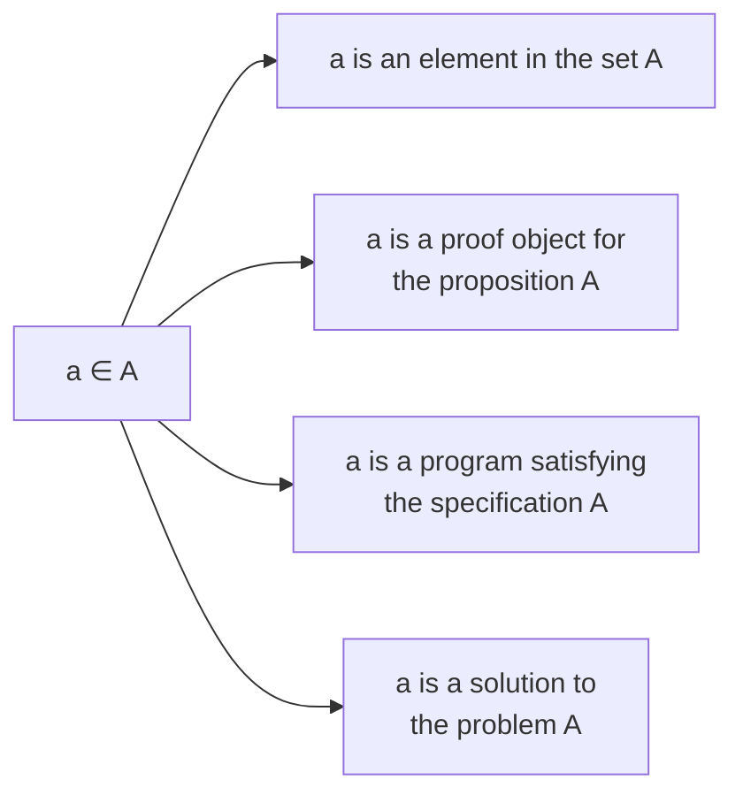
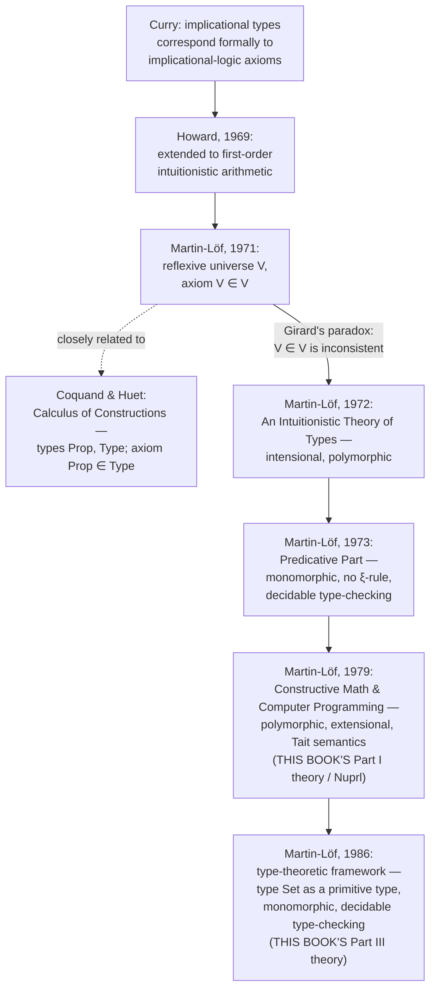

# Propositions as Sets (The Curry–Howard Correspondence)

[[book-guidelines|↩ Back to guidelines]]

## The problem this chapter is solving

Every ordinary programming language keeps two things apart: the code, and whatever you use to argue the code is right — a comment, a test, a separate paper proof, a Hoare-logic annotation bolted on afterward. Nordström, Petersson and Smith open their book by refusing that split. Type theory, as they present it, is simultaneously a programming language, a specification language, and a programming logic (p. 1) — one formalism in which you can write down *what a program must do* and *the program that does it* using the same syntax, the same rules, the same notion of "well-formed."

That refusal is not a stylistic choice; it is forced by the book's central identification, introduced in Chapter 1 and spelled out formally in Chapter 2: a proposition simply *is* a set — the set of its proofs. A specification is a set. A problem is a set. All four readings of the single judgement $a \in A$ are, in Martin-Löf's type theory, the same judgement:



This is the Curry–Howard correspondence, and this chapter of the book is where it gets earned rather than asserted: not "propositions correspond to types, trust us," but a chapter-length argument, connective by connective, for *why* a proof of $A \supset B$ has no choice but to be a function, why a proof of $A \& B$ has no choice but to be a pair, and so on. Everything else in the book — every set former introduced in Chapters 6 through 16, the entire subset theory of Part II, the theory of types in Part III — is a working-out of the consequences of this one identification. Get this chapter, and the shape of the rest of the book stops being a list of set formers to memorize and becomes a syllabus for expressing logic.

## The four basic judgement forms

Chapter 1 states, without yet justifying, that type theory is built from rules for exactly four judgement forms (p. 2):

$$
\begin{aligned}
&A \text{ is a set} \\
&A_1 \text{ and } A_2 \text{ are equal sets} \\
&a \text{ is an element in the set } A \\
&a_1 \text{ and } a_2 \text{ are equal elements in the set } A
\end{aligned}
$$

The book is explicit that these cannot be explained the way a programming-language manual explains its own semantics — "in terms of mathematical objects like sets and functions" borrowed from some other theory (p. 2). Type theory is meant to be foundational, so its notion of set has to be explained from first principles, in terms of *computation*: first you fix what a canonical (fully-formed, "value"-shaped) expression looks like, and only then can you say what it means for something to be a set, an element, or two elements to be equal. That full semantic account — canonical expressions, categorical judgements, hypothetical judgements under assumptions — is the job of Chapter 4 ("[[The-Semantics-of-Judgement-Forms|The Semantics of Judgement Forms]]"), not this one; here in Chapter 1 the four forms are simply put on the table as the scaffolding everything downstream will hang from, together with the promise that Chapter 5's [[General-Proof-Rules|general proof rules]] (formation / introduction / elimination / equality) will instantiate this scaffolding uniformly for every set former in the book.

It's worth naming, even at this early stage, what these four forms are the ancestor of. If you've built or studied a bidirectional type checker, you already know two of these judgements by other names:

| Book's judgement form | What a type checker calls it | What a proof checker calls it |
|---|---|---|
| $A$ is a set | kind-checking / well-formedness of a type | well-formedness of a proposition |
| $a \in A$ | `infer`/`check` — does term $a$ have type $A$? | is $a$ a valid proof of $A$? |
| $A_1$ and $A_2$ are equal sets | type equality (used by unification) | proposition identity |
| $a_1 = a_2 \in A$ | definitional/judgemental equality (`isDefEq`) | proof irrelevance / term equality |

This is not a stretch reading — it is the entire point of the chapter, made explicit two chapters later: a type checker's "does $e$ have type $T$?" and a proof checker's "is $\pi$ a proof of $P$?" are, in Martin-Löf's theory, *literally the same question*, because "type" and "proposition" are literally the same notion. This is exactly the shared ancestor that a Rust-style verifier (checking a program against a specification) and a Lean-style elaborator (checking a term against an expected type) both descend from — the four judgement forms above are the minimal interface either one has to implement.

## Heyting's constructive interpretation of the logical constants

Chapter 2 is where the identification stops being a slogan and becomes connective-by-connective machinery. The book's method (following Heyting) is to state, for each logical constant, *what counts as a proof of a proposition built with that constant* — and then to notice that the set of such proofs is already a familiar set-forming operation.

**What breaks without this move.** Classical logic explains truth model-theoretically: $A$ is true or false independently of anyone knowing which, so $A \vee \neg A$ holds unconditionally. Constructively, that explanation is unavailable, because there is no proof of an arbitrary $A$ or of an arbitrary $\neg A$ to appeal to — "we have no method of proving or disproving an arbitrary proposition $A$" (p. 9), so the law of excluded middle simply isn't intuitionistically valid. What replaces the model-theoretic account is Heyting's move: define truth as *inhabitation by a proof object*, and define each connective by saying what shape a proof object of that connective must have.

### Implication and conjunction

> A proof of $A \supset B$ is a function (method, program) which to each proof of $A$ gives a proof of $B$.

That's it — and once you accept it, the identification writes itself: $A \supset B$ **is identified with** $A \to B$, the set of functions from $A$ to $B$ (p. 10). The canonical proof of $A \supset A$ is a function that returns its input, i.e. $\lambda x.x$ — which is simultaneously the trivial proof of an [[The-Cartesian-Product-of-a-Family-and-the-Universal-Quantifier#Implication|implication]] and the identity function. There is no separate "proof language" here; [[The-Universe-of-Small-Sets#The proof|the proof]] *is* the program.

> A proof of $A \, \& \, B$ is a pair whose first component is a proof of $A$ and whose second component is a proof of $B$.

So $A \, \& \, B$ **is identified with** $A \times B$. The book works a small derivation to show the identification is more than notational sleight of hand: if $fst(\langle a,b\rangle) = a$, then $\lambda x.\mathit{fst}(x)$ is a proof of $(A \, \& \, B) \supset A$, because feeding it any proof $x$ of $A \, \& \, B$ (necessarily a pair) yields $\mathit{fst}(x)$, a proof of $A$ (p. 10). This is literally the informal statement and proof of the *&-elimination* rule that Chapter 5 will later formalize — Chapter 2 is doing the semantic justification before the syntax exists.

**Rust grounding.** Implication as a function and conjunction as a pair are exactly what Rust already has, once you read a generic function's signature as a proof term:

```rust
// A proof of A ⊃ A: the trivial method taking any proof of A to a proof of A.
fn identity<A>(x: A) -> A {
    x
}

// A proof of (A & B) ⊃ A, exactly the book's λx.fst(x).
fn fst_proof<A, B>(pair: (A, B)) -> A {
    pair.0
}
```

The catch, and it's instructive: Rust's `fn identity<A>(x: A) -> A` type-checks *because* Rust's generics are parametric — the compiler cannot inspect `A`, so the only function of that signature it could possibly be is the identity. That's Rust's type system accidentally enforcing a Curry–Howard fact (there's exactly one proof of $A \supset A$, up to behavior) as a side effect of parametricity, not because Rust knows anything about logic.

**Lean grounding.** Because this chapter's subject matter *is* propositions-as-types, Lean is the closer translation, not just a secondary illustration. Lean's core library defines `And` and the implication case is simply function space:

```lean
inductive And (a b : Prop) : Prop where
  | intro : a → b → And a b

theorem and_left {a b : Prop} (p : a ∧ b) : a :=
  p.1        -- exactly λx.fst(x)

theorem implies_self (a : Prop) : a → a :=
  fun x => x  -- exactly the book's λx.x
```

Lean's `.1` projection on an `And` proof and the book's $fst$ selector are the same operation named twice, sixty years apart.

### Disjunction and negation

> [A proof of $A \vee B$] is either a proof of $A$ or a proof of $B$ together with the information of which of $A$ or $B$ we have a proof.

The "together with the information of which" clause is doing real work — it's precisely what excludes classical disjunction elimination. $A \vee B$ **is identified with** $A + B$, the disjoint union, whose elements are $inl(a)$ or $inr(b)$ (p. 10–11): the tag *is* the "which" information Heyting's clause demanded. Negation is then not a primitive at all but a *definition*: $\neg A \equiv A \supset \bot$, where $\bot$ is a proposition with no proof — identified with $A \to \emptyset$, the function space into the empty set (p. 11).

**Rust grounding.** `Or` and `⊥` map onto Rust constructs the book itself already gestures at (§1.1 explicitly compares `when` to an ML `case`, and the modern equivalent is `match`):

```rust
enum Or<A, B> {
    Inl(A),
    Inr(B),
}

enum Void {}                    // an uninhabited type: the empty set / absurdity
type Not<A> = fn(A) -> Void;    // ¬A ≡ A ⊃ ⊥, quite literally

fn absurd<A>(void: Void) -> A {
    match void {}                // ex falso quodlibet: no arms needed — Void has none
}
```

`match void {}` compiling with zero arms is Rust's exhaustiveness checker independently rediscovering ⊥-elimination: since `Void` has no constructors, a match on it is vacuously exhaustive, and the function can return *any* `A` because it's never actually called.

### The quantifiers

Propositional logic alone only needs the set formers already present in most typed languages. The quantifiers are where type theory needs something genuinely absent from ordinary type systems: **families of sets**, i.e. a set $B(x)$ that depends on which element $x \in A$ you're looking at.

> A proof of $(\exists x \in A) B(x)$ consists of a construction of an element $a$ in the set $A$ together with a proof of $B(a)$.

$(\exists x \in A)B(x)$ **is identified with** $(\Sigma x \in A) B(x)$, [[Disjoint-Unions-and-the-Existential-Quantifier|the disjoint union of the]] family $B$ — pairs $\langle a, b \rangle$ with $a \in A$, $b \in B(a)$ (p. 11). This is the identification the book's own key question flags as pivotal: it turns an *existence proof* into a program that *computes a witness*, because the proof literally contains the witness as its first component. There is no separate "extraction" step, the way there is in classical logic with the axiom of choice — extraction is just $fst$.

> A proof of $(\forall x \in A) B(x)$ is a function (method, program) which to each element $a$ in the set $A$ gives a proof of $B(a)$.

$(\forall x \in A) B(x)$ **is identified with** $(\Pi x \in A) B(x)$, the *dependent* function set (p. 11): $\lambda x. b(x)$ where $b(x) \in B(x)$ for each $x \in A$.

**What breaks without dependency — and where Rust actually breaks.** A non-dependent function `fn f<A, B>(x: A) -> B` cannot express $(\Pi x\in A)B(x)$ in general, because $B$ is fixed once and for all, independent of which `x` you pass. Rust generics quantify uniformly over *types*, not over *values* — you cannot write a Rust function whose return *type* varies with the runtime value of an argument. This is exactly the gap that separates "a typed functional language like ML" from type theory that the book itself draws in §1.1: type theory's set language is "similar to the type system in programming languages except that the language is much more expressive," precisely because of families like $B(x)$ (p. 4). Existentials have the mirror-image gap: Rust's `impl Trait` / `dyn Trait` are sometimes described as "existential types," but they hide a *type* at compile time — they are not a value-level pair of a witness and a dependent proof. A $\Sigma$-type needs both components to be genuine runtime data, one depending on the other; Rust's existential sugar gives you neither the dependency nor, usually, the runtime witness.

**Lean grounding.** This is exactly where Lean stops being an analogy and starts being the literal target theory. Lean's `∀ x : A, B x` **is** notation for the dependent function type `(x : A) → B x` — no translation needed, because Lean's Pi-type is the book's $\Pi(A,B)$:

```lean
-- ∀ x ∈ A, B x  is literally  (x : A) → B x, i.e. Lean's Pi-type.
theorem forall_example (A : Type) (B : A → Prop) (pf : ∀ x : A, B x) (a : A) : B a :=
  pf a          -- exactly the book's apply(a, x)

-- ∃ x ∈ A, B x  as an erased proposition:
inductive Exists {α : Sort u} (p : α → Prop) : Prop where
  | intro (w : α) (h : p w) : Exists p

-- The computationally relevant twin: the dependent PAIR, in Type rather than Prop.
structure Sigma {α : Type u} (β : α → Type v) where
  fst : α
  snd : β fst
```

Notice that Lean has to give you *two* versions of $\Sigma$ — `Exists`, living in `Prop`, whose witness is erased at compile time and unavailable for computation, and `Sigma`, living in `Type`, whose witness is real, inspectable runtime data. That split is not a Lean quirk; it is Lean's solution to a problem this very book flags in §1.2: a constructive proof "contains a lot of computationally irrelevant information" (p. 6), and getting rid of it is explicitly named as "the main objective of the subset theory introduced in Part II of this book." Lean's `Prop`/`Type` distinction and the book's Part II subset theory are two different eras' answers to the identical problem.

### Equality

The book closes §2.1 by noting that everything so far handles the *connectives* of predicate logic, but not atomic propositions — for that it introduces the equality set $a =_A b$, postulating that when $a$ and $b$ are equal elements of $A$, the constant $id(a)$ inhabits $a =_A b$ (p. 11). This is deliberately left thin here — the book flags it as "similar to recursive realizability interpretations... where one usually lets the natural number 0 realize a true atomic formula" and defers the real machinery (intensional $Id$ vs. extensional $Eq$, and their very different elimination rules) to Chapter 8. Worth flagging now anyway: this is the equality that will later become `rfl` and `isDefEq` on the Lean side of the analogy.

### Summary table

| Logical constant | Heyting's reading of a proof | Set former | Book's identification |
|---|---|---|---|
| $A \supset B$ | a function from each proof of $A$ to a proof of $B$ | $A \to B$ | §2.1, p. 10 |
| $A \mathbin{\&} B$ | a pair of a proof of $A$ and a proof of $B$ | $A \times B$ | §2.1, p. 10 |
| $A \vee B$ | a tagged proof: either $inl$(proof of $A$) or $inr$(proof of $B$) | $A + B$ | §2.1, p. 10–11 |
| $\neg A$ | (defined) $A \supset \bot$ | $A \to \emptyset$ | §2.1, p. 11 |
| $(\exists x \in A)B(x)$ | a witness $a \in A$ paired with a proof of $B(a)$ | $(\Sigma x \in A)B(x)$ | §2.1, p. 11 |
| $(\forall x \in A)B(x)$ | a function from each $a \in A$ to a proof of $B(a)$ | $(\Pi x \in A)B(x)$ | §2.1, p. 11 |
| $a =_A b$ | the constant $id(a)$, when $a$, $b$ are equal in $A$ | equality set | §2.1, p. 11–12 |

## Propositions as tasks and specifications of programs

Heyting's reading explains *what a proof of a logical formula is*; Kolmogorov's — introduced independently in 1932, and covered in §2.2 as a second, equally valid lens on the same identification — explains *what solving a problem means*, and the book shows the two readings agree completely (p. 12):

> If $A$ and $B$ are tasks then $A \, \& \, B$ is the task of solving the tasks $A$ and $B$; $A \vee B$ is the task of solving at least one of $A$ and $B$; $A \supset B$ is the task of solving $B$ under the assumption that we have a solution of $A$.

This isn't a rephrasing for flavor — it's what licenses reading a proposition as a *specification*. $A \, \& \, B$ becomes: programs which, run, yield a pair $\langle a, b \rangle$, with $a$ solving $A$ and $b$ solving $B$; $A \vee B$ becomes: programs which yield $inl(a)$ or $inr(b)$; $A \supset B$ becomes: programs which yield $\lambda x.b(x)$, a function converting any solution of $A$ into a solution of $B$; and correspondingly for the quantifiers (p. 12). The connectives don't change at all going from "logic" to "programming" — the identification with $\to, \times, +, \Sigma, \Pi$ is the same identification, just narrated with a different vocabulary.

Chapter 1's motivating example makes the stakes concrete: you can write a specification without knowing whether it's satisfiable at all —

$$(\exists a \in \mathbb{N}^+)(\exists b \in \mathbb{N}^+)(\exists c \in \mathbb{N}^+)(\exists n \in \mathbb{N}^+)\bigl(n > 2 \mathbin{\&} a^n + b^n = c^n\bigr)$$

— a legitimate type-theoretic set even though (per Fermat's Last Theorem) it has no element (p. 4). And a specification can be satisfied by *many* different programs of interest — sorting (many correct orderings of ties, or many algorithms), compilers (different code sequences computing the same input-output relation), finding a shortest path — the specification-as-set doesn't pin down a unique implementation, only a correctness criterion (p. 4). This is why the book insists type theory should be compared to programming *logics* like LCF, not to programming languages: a set can be inhabited by infinitely many distinct programs, exactly as a specification can have many correct implementations.

The chapter also draws the constructors/selectors vocabulary that recurs for the rest of the book: constructors ($0$, $succ$, $\langle\_,\_\rangle$, $inl$, $inr$, $\lambda$) build canonical values; selectors are generalized pattern matching. ML's `case p of (x,y) => d` becomes `split(p, (x,y)d)`; ML's `case p of inl(x) => d | inr(y) => e` becomes `when(p, (x)d, (y)e)` (p. 5). Recursion is deliberately *not* general — it's restricted to the primitive-recursion shape licensed by each inductive set's selector, e.g. `natrec` solves $f(0) = d$, $f(n{+}1) = h(n, f(n))$ via $f(n) \equiv \mathit{natrec}(n, d, (x,y)h(x,y))$ (p. 5) — a restriction the book will lean on constantly, because a selector that only recurses structurally is exactly what makes every well-typed program in this theory terminate.

**Rust grounding — selectors as `match`.**

```rust
// Book's when(p, (x)d, (y)e) on A+B, applied to Rust's Result<A, B>
fn when<A, B, C>(p: Result<A, B>, d: impl Fn(A) -> C, e: impl Fn(B) -> C) -> C {
    match p {
        Ok(x)  => d(x),
        Err(y) => e(y),
    }
}

// Book's natrec(n, d, (x,y)h(x,y)) solving f(0)=d, f(n+1)=h(n,f(n))
fn natrec<T>(n: u64, d: T, h: impl Fn(u64, T) -> T) -> T {
    let mut acc = d;
    for x in 0..n {
        acc = h(x, acc);
    }
    acc
}
```

**Python grounding — task interpretation as a runtime check.** Kolmogorov's "task" reading maps almost too directly onto ordinary code with an assertion — which is exactly why it's a useful *contrast*, not just an illustration, for what a typed proof adds:

```python
def half_task(n):
    """Kolmogorov task: given even n, produce q with n == 2 * q."""
    q, r = divmod(n, 2)
    assert r == 0, "n was not a solution's precondition: not even"
    return q
```

This *is* a solution to the informal task in Kolmogorov's sense. What it is not is a type-theoretic proof: the `assert` is checked once, at run time, against one input, and says nothing about every possible input. The type-theoretic version of `half` (worked out fully in Chapter 21, §21.1) instead proves $(\forall n \in N)(\exists q \in N)(n = 2q \vee n = 2q+1)$ as a $\Pi$-Σ term — a single object that is simultaneously a program *and* a proof that it behaves correctly on every natural number, not just the ones you happened to test.

## Historical formulations of Martin-Löf's type theory

Chapter 1's §1.3 traces the correspondence from a formal curiosity to the book's own theory, and the lineage matters because each step is a response to a concrete failure of the previous one:



A few of these turns are worth dwelling on because the book is explicit about the trade-off each one buys:

- **Curry → Howard** (pre-1971): the correspondence starts as an observation about the *types of combinators* matching axioms of implicational logic (Curry), extended by Howard in 1969 to cover full first-order intuitionistic arithmetic (p. 6). At this stage it is a formal analogy between two existing systems, not yet a foundation to build a programming language on.
- **1971 — the crisis**: Martin-Löf's first formulation used a *reflexive* universe $V$, admitting $V \in V$, so that first-order arithmetic, Gödel's $T$, second-order logic, and simple type theory could all be interpreted inside it (p. 6). Girard showed $V \in V$ makes the theory inconsistent — the same paradox, in different clothing, that sinks naive set theory's unrestricted comprehension. This forced a genuine fork: Martin-Löf's own repair, and the independently-developed Coquand–Huet Calculus of Constructions, which replaces the single reflexive $V$ with two separate types `Prop` and `Type`, related by the *non*-reflexive axiom $Prop \in Type$ (p. 7) — carefully avoiding $Type \in Type$, since adding that would reproduce Girard's paradox exactly (p. 7).
- **1972**: *An Intuitionistic Theory of Types* — intensional, polymorphic. This is close kin to Part I of this very book, differing mainly in how equality is set up: here judgemental equality $a = b \in A$ is tied to a specific set $A$, whereas in the 1972 original, equality was defined for arbitrary untyped terms via convertibility in the style of combinatory logic — which then obliges you to separately prove the Church–Rosser property (p. 7).
- **1973 — Predicative Part**: strongly monomorphic (a fresh constant per rule application), and — notably — $\xi$-conversion (congruence under $\lambda$) is *dropped*. The payoff: type-checking becomes decidable (p. 7).
- **1979**: polymorphic again, but now *extensional*, with a direct computational semantics via Tait's computability method rather than metamathematical normalization proofs — this is the formulation the book actually presents in Part I, obtained precisely when the [[Equality-Sets|equality sets]] of Chapter 8 are read via the strong elimination rule for $Eq$ rather than $Id$. It's also the theory behind the Nuprl system (p. 7–8).
- **1986**: a framework built from the more primitive notion of *type* rather than *set*, with one of the primitive types being the type of sets itself — monomorphic, and type-checking decidable again. This is Part III of the book (p. 8).

## Type theory versus the Calculus of Constructions

The book draws this comparison compactly, but it's a real fork with consequences that ripple through everything downstream, because it's a decision about how far you're willing to let the theory quantify over itself.

| | This book's type theory (Part I) | Calculus of Constructions |
|---|---|---|
| Reflection mechanism | universe $U$ (successor to $V$; developed fully in Ch. 14) | two types `Prop`, `Type`, axiom $Prop \in Type$ |
| Predicativity | **predicative** | **impredicative** |
| Consequence | second-order logic and simple type theory *cannot* be interpreted | second-order logic and simple type theory *can* be interpreted |
| The paradox both must avoid | $V \in V$ (1971 formulation) was inconsistent — Girard | $Type \in Type$ would be inconsistent by the same argument |

"Predicative" here means: you're not allowed to form a set by quantifying over a collection that includes the set you're defining. The book's universe $U$ (built in Chapter 14 specifically so Peano's fourth axiom and data-type specifications become expressible) is carefully staged so this never happens. The Calculus of Constructions buys more expressive power — impredicative quantification, letting you interpret second-order logic directly — at the cost of a strictly more delicate consistency argument, and by walking right up to the edge Girard's paradox marks without stepping over it.

**Lean grounding.** This fork is not historical trivia for a Lean-oriented reader — Lean's kernel is a descendant of exactly this branch. Lean's type theory is the Calculus of *Inductive* Constructions (CIC): Coquand–Huet's `Prop`/`Type` distinction, extended with the inductive families used above for `And`, `Or`, `Exists`. In Lean, `Prop` genuinely is impredicative and proof-irrelevant — you can quantify a `Prop` over *all* propositions, including itself, `(A : Prop) → P A` is again allowed to live in `Prop` — which is precisely the power this book's predicative theory declines to take on. That single design decision is why Lean can encode second-order logic directly as ordinary `∀`-statements over `Prop`, while this book instead has to build up a *stratified* universe hierarchy ($U$, and eventually a tower of universes above it) to get comparable expressiveness without impredicativity's consistency risk.

## Where this leads

Every set former the book introduces from Chapter 6 onward is, structurally, a re-run of this chapter: state a set former, then read it as a logical connective via exactly the identification established here. Enumeration sets give you $\bot$ and $T$ (Ch. 6); $\Pi$ gives you $\forall$/$\supset$ (Ch. 7); equality sets give you propositional equality, with the intensional/extensional fork foreshadowed above (Ch. 8); $\Sigma$ gives you $\exists$ (Ch. 13); the universe $U$ (Ch. 14) exists because some propositions — Peano's fourth axiom among them — can't even be *stated* without a reflective device, echoing this chapter's Girard's-paradox discussion but now built safely, predicatively. Part II's entire subset theory exists to answer a problem this chapter names but doesn't solve: constructive proofs carry "computationally irrelevant information" (§1.2) that a genuine program shouldn't have to drag around. Part III's theory of types is a re-derivation of the very four judgement forms opened here, from a still more primitive starting point. Part IV — program derivation, abstract data types — is this chapter's promise ("specification is a set, program is an element") finally cashed out on real examples.

**For the Rust verifier and the Lean-style elaborator, this chapter is about as load-bearing as it gets.** Propositions-as-types is not one technique among several available to either project — it *is* the mechanism:

- A Rust verifier that checks a program against a Hoare-triple-style specification is, under this identification, doing nothing but $\Pi$/$\Sigma$-type checking: a precondition/postcondition pair is a dependent proposition, and "the program satisfies the spec" collapses to "the program is a well-typed element of the set the spec denotes." There is no separate proof-obligation layer to design — it's the same type checker, one more time, on richer types.
- A Lean-style elaborator's `check`/`infer` duality *is* the book's two judgement forms $a \in A$ (checking) and its inference mode, and its unifier's job of deciding $A_1 = A_2$ *is* the book's set-equality judgement. The four judgement forms table above is close to a literal spec sheet for what such an elaborator's kernel has to implement.
- The `Exists`-in-`Prop` vs. `Sigma`-in-`Type` split shown above is not a footnote — it's the same tension the book spends all of Part II resolving, and any elaborator that wants to support both "logical" existentials (erased) and "data" existentials (retained) will have to make the identical choice Lean's kernel makes.
- Definitional equality, only gestured at here via $id(a)$, becomes exactly `isDefEq` the moment Chapter 8's $Id$ is implemented — worth flagging now because it's the piece of this correspondence an elaborator spends the most wall-clock time actually computing.
