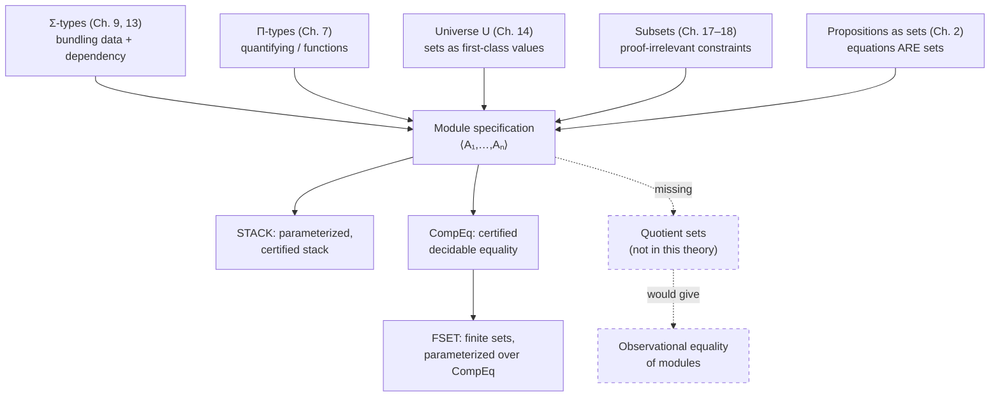

# Specification of Abstract Data Types

[[book-guidelines|↩ Back to guidelines]]

This is the book's final chapter, and it earns that position: it doesn't introduce a new set former, it *spends* the ones you already have. Everything built up over twenty-two chapters — dependent sums ($\Sigma$), dependent products ($\Pi$), [[The-Universe-of-Small-Sets|the universe of small sets]] ($U$), subsets — gets pointed at a single, very ordinary-sounding engineering problem: how do you write down, precisely, what it means to be *a stack*?

## The problem: a stack is not just an interface

Suppose you write down a signature for a stack of natural numbers in some ordinary typed language:

```rust
trait StackSig {
    type Stack;
    fn empty() -> Self::Stack;
    fn push(n: u64, s: Self::Stack) -> Self::Stack;
    fn pop(s: Self::Stack) -> Self::Stack;
    fn top(s: Self::Stack) -> u64;
}
```

This tells you the *shapes* of the operations. It tells you nothing about their *behavior*. A type checker will happily accept an implementation where `pop` always returns `empty()` regardless of input, or where `top` always returns `0`. Such an implementation type-checks and is completely useless — worse, it is silently wrong in a way the type system cannot see.

What's missing is the defining equations of a stack: popping right after pushing gets you back where you started, `top` of an empty stack is `0` (this book's convention — no `Option`, just a sentinel), and so on. In an ordinary language these equations live in a comment, a docstring, or a separate specification document, disconnected from the code and unenforced by the compiler. The type checker cannot see them, so nothing stops an implementation from silently violating them.

Martin-Löf type theory's central move — propositions as sets (see [[Propositions-as-Sets|propositions as sets]] if you've read that chapter) — means this gap doesn't have to exist. A proposition *is* a set, and a proof of it *is* an element of that set. So "the equations a stack must satisfy" is not a side condition written in prose; it is itself a set, and demanding an implementation satisfy it is demanding a genuine element of that set — a proof, sitting right there in the data, checked by the very same type-checking machinery that checks everything else. This chapter shows exactly how to assemble that set, using $\Sigma$, $\Pi$, $U$, and subsets together for the first time in one construction.

This is precisely the design problem behind a Hoare-triple-style module specification: instead of a bare signature plus an informal correctness claim, you get one dependent type whose inhabitants *are* correct-by-construction implementations. Keep this in mind throughout — it is the load-bearing idea for anyone designing a verifier's notion of "a certified data structure."

## Modules as dependent tuples

The book generalizes "abstract data type" to **module**: a tuple

$$\langle A_1, A_2, \ldots, A_n\rangle$$

where some $A_i$ are sets and others are functions or constants defined on the earlier ones. Crucially it is a *dependent* tuple: the set that $A_i$ belongs to can depend on the values of $A_1, \ldots, A_{i-1}$. A group is the book's other example: $\langle G, {*}, \mathit{inv}, u\rangle$ where $G$ is a set, ${*} \in G \times G \to G$, $\mathit{inv} \in G \to G$, $u \in G$, and certain equations hold between them.

To specify a module inside type theory you need dependent tuples whose *type* is itself a set — that's exactly what iterated $\Sigma$ gives you, provided the first component can range over an arbitrary set. But arbitrary sets can't be quantified over directly in the basic theory; you need the *universe* $U$ (Chapter 14) to have a set of set-codes to quantify over. So a module specification is:

$$(\Sigma A_1 \in U)(\Sigma A_2 \in \mathit{Set}(A_1)) \cdots$$

— a nested $\Sigma$ whose first coordinate ranges over the universe and whose later coordinates are decoded (via $\mathit{Set}$) types depending on the earlier ones. The book allows itself an abuse of notation here that is worth flagging explicitly because it will otherwise read as sloppy: it writes $A$ instead of $\hat A$ for a code and its decoding $\mathit{Set}(\hat A)$, trusting context to disambiguate "the set" from "the universe element that codes it." Keep the distinction in your head even where the notation elides it.

This gives a **fifth reading** of the two fundamental judgements, layered on top of the four you already know (set/proposition, element/proof, and so on):

- $A\ \mathit{set}$ can now also mean **"$A$ is a module specification."**
- $a \in A$ can now also mean **"$a$ is an implementation of the module specification $A$."**

This reading is not a new primitive judgement form — it's the *same* judgement forms you've had since Chapter 4, applied to a $\Sigma$-set that happens to bundle types, functions, and proofs together. That reuse is the entire point of the chapter: no new machinery, just a new way of looking at old machinery.

### Rust: a trait is a signature, not a specification

The Rust `trait` above is the *signature* half of a module — it names the components and their types but carries no equations. A closer analogue of the book's dependent tuple is a struct that bundles an implementation together with a certificate that the equations hold:

```rust
struct StackModule<S> {
    empty: S,
    push: fn(u64, S) -> S,
    pop: fn(S) -> S,
    top: fn(S) -> u64,
    // `proof` is a value that only type-checks if the equations
    // below actually hold for `empty`, `push`, `pop`, `top`.
    proof: StackLaws<S>,
}
```

Rust's type system can't literally express "a value that only exists if these equations hold" — that needs dependent types, which is exactly the gap type theory closes. This struct is the shape of the target; the content of `StackLaws` is what the rest of the chapter builds precisely.

### Lean: the direct dependent-record counterpart

Lean's `structure` mechanism *is* dependent-tuple formation in the book's sense — a Lean structure is literally iterated $\Sigma$ under the hood, and proof-carrying fields are the standard idiom:

```lean
structure Stack (Elem : Type) (S : Type) where
  empty : S
  push  : Elem → S → S
  pop   : S → S
  top   : S → Elem
```

Here `Stack Elem S` plays the role of the book's dependent tuple of *signature* components (an analogue of the $\Sigma$-nest up through `top`), parameterized rather than existentially quantified over `S`. The next section shows how to add the equations as further fields, matching the book's own two-stage presentation.

## Specifying a stack using dependent sums and the universe

Here is the book's own specification, verbatim in structure, of a stack of natural numbers:

$$
\begin{aligned}
&(\Sigma\, \mathit{StackN} \in U)\\
&\quad(\Sigma\, \mathit{empty} \in \mathit{StackN})\\
&\quad\quad(\Sigma\, \mathit{push} \in N \times \mathit{StackN} \to \mathit{StackN})\\
&\quad\quad\quad(\Sigma\, \mathit{pop} \in \mathit{StackN} \to \mathit{StackN})\\
&\quad\quad\quad\quad(\Sigma\, \mathit{top} \in \mathit{StackN} \to N)\\
&\quad\quad\quad\quad\quad(\Pi t \in \mathit{StackN})(\Pi n \in N)\\
&\quad\quad\quad\quad\quad\quad([\mathit{pop}\cdot\mathit{empty} =_{\mathit{StackN}} \mathit{empty}]\ \times\\
&\quad\quad\quad\quad\quad\quad\ [\mathit{pop}\cdot(\mathit{push}\cdot\langle n,t\rangle) =_{\mathit{StackN}} t]\ \times\\
&\quad\quad\quad\quad\quad\quad\ [\mathit{top}\cdot\mathit{empty} =_N 0]\ \times\\
&\quad\quad\quad\quad\quad\quad\ [\mathit{top}\cdot(\mathit{push}\cdot\langle n,t\rangle) =_N n])
\end{aligned}
$$

Read this from the outside in, exactly as the "what breaks without this" framing above demands. The outermost $\Sigma$ says: an implementation begins by choosing a *specific* set (a code $\mathit{StackN} \in U$) to serve as the carrier — this is why the universe is indispensable here: without $U$ there is nothing to existentially quantify a set *over*. Once that choice is made, the rest of the tuple is a value of type $N \times \mathit{StackN} \to \mathit{StackN}$, and so on for `pop` and `top`. The final component is a $\Pi$-set: a *function* from every stack $t$ and every natural number $n$ to a proof of the four-way conjunction — because the equations must hold for *every* $t$ and $n$, not just some witness pair.

Using the logical reading of the same constructors ($\exists$ for $\Sigma$, $\forall$ for $\Pi$, $\&$ for $\times$) the identical specification reads as a conventional-looking algebraic law:

$$
\begin{aligned}
(\exists \mathit{StackN} \in U)\ (\exists \mathit{empty} \in \mathit{StackN})\ (\exists \mathit{push} \in N\times \mathit{StackN}\to \mathit{StackN})\ (\exists \mathit{pop}\in\mathit{StackN}\to\mathit{StackN})\ (\exists \mathit{top}\in\mathit{StackN}\to N)\\
(\forall t\in \mathit{StackN})(\forall n\in N)\ \big([\mathit{pop}\cdot\mathit{empty}=_{\mathit{StackN}}\mathit{empty}]\ \&\ [\mathit{pop}\cdot(\mathit{push}\cdot\langle n,t\rangle)=_{\mathit{StackN}}t]\ \&\ [\mathit{top}\cdot\mathit{empty}=_N 0]\ \&\ [\mathit{top}\cdot(\mathit{push}\cdot\langle n,t\rangle)=_N n]\big)
\end{aligned}
$$

The book stresses that these are *two notations for one set*, not two different specifications — this is the same point made throughout the book (Chapter 2 onward) that logical connectives and set formers coincide, now paying off at scale on a realistic example rather than a toy proposition.

### What a canonical element of this set actually is

The book works through the semantics carefully, and it's worth reproducing because it's the crux of "specifications as sets": a canonical element of $(\Sigma \mathit{StackN}\in U)B_1$ is a pair $\langle \mathit{st}, b_1\rangle$ with $\mathit{st}\in U$ and $b_1 \in B_1[\mathit{StackN}:=\mathit{st}]$. Since $B_1$ is itself a $\Sigma$-set, $b_1$ must again be a pair, and so on down the chain. Flattening the nest (using the book's own tupling convention $\langle a,\ldots,b,c\rangle \equiv \langle a,\langle\ldots,\langle b,c\rangle\rangle\rangle$), every element of the whole specification is equal to a 6-tuple

$$\langle \mathit{st}, \mathit{es}, \mathit{pu}, \mathit{po}, \mathit{to}, p\rangle$$

where

$$
\begin{aligned}
\mathit{st} &\in U\\
\mathit{es} &\in \mathit{Set}(\mathit{st})\\
\mathit{pu} &\in N\times \mathit{Set}(\mathit{st}) \to \mathit{Set}(\mathit{st})\\
\mathit{po} &\in \mathit{Set}(\mathit{st}) \to \mathit{Set}(\mathit{st})\\
\mathit{to} &\in \mathit{Set}(\mathit{st}) \to N\\
p &\in (\forall t\in \mathit{Set}(\mathit{st}))(\forall n\in N)\ [\mathit{po}\cdot\mathit{es}=_{\mathit{Set}(\mathit{st})}\mathit{es}]\times[\ldots]\times[\ldots]\times[\ldots]
\end{aligned}
$$

This is the semantics of the specification: to *know* the meaning of the set is to know exactly what counts as a canonical implementation of it, which is precisely a stack carrier, its four operations, and a proof term $p$ certifying the equations. There is no separate "verification" step external to type checking — checking that $p$ has the right type *is* verifying correctness. If the equations cannot in fact be jointly satisfied, the specification set is inhabited by nothing (possibly provably equivalent to $\emptyset$), and the theory does not break; it simply has no implementation to offer, which is the correct and safe outcome.

The book also flags a real limitation candidly: the carrier $\mathit{StackN}$ ranges only over $U$, the universe of *small* sets, not over arbitrary sets — quantifying over "any set whatsoever" would need a $\Sigma$-forming operation one level up, on the level of types, which this theory doesn't provide. Note this as an open edge rather than something silently glossed over.

### The subset refinement: separating data from proof

The 6-tuple above bundles a genuinely *computationally irrelevant* piece of data — [[The-Universe-of-Small-Sets#The proof|the proof]] $p$ — together with the operations you actually run. $p$ is never called; it exists only to certify the other four components. The book's improvement is to move the equations out of the tuple and into a **subset** constraint on `top` alone:

$$
\begin{aligned}
&(\Sigma\, \mathit{StackN} \in U)\\
&\quad(\Sigma\, \mathit{empty} \in \mathit{StackN})\\
&\quad\quad(\Sigma\, \mathit{push} \in N \times \mathit{StackN} \to \mathit{StackN})\\
&\quad\quad\quad(\Sigma\, \mathit{pop} \in \mathit{StackN} \to \mathit{StackN})\\
&\quad\quad\quad\quad\{\mathit{top} \in \mathit{StackN} \to N \mid\\
&\quad\quad\quad\quad\quad(\Pi t \in \mathit{StackN})(\Pi n \in N)\\
&\quad\quad\quad\quad\quad\quad([\mathit{pop}\cdot\mathit{empty} =_{\mathit{StackN}} \mathit{empty}]\ \&\\
&\quad\quad\quad\quad\quad\quad\ [\mathit{pop}\cdot(\mathit{push}\cdot\langle n,t\rangle) =_{\mathit{StackN}} t]\ \&\\
&\quad\quad\quad\quad\quad\quad\ [\mathit{top}\cdot\mathit{empty} =_N 0]\ \&\\
&\quad\quad\quad\quad\quad\quad\ [\mathit{top}\cdot(\mathit{push}\cdot\langle n,t\rangle) =_N n])\}
\end{aligned}
$$

An implementation of this set is now equal to a **5-tuple** $\langle \mathit{st}, \mathit{es}, \mathit{pu}, \mathit{po}, \mathit{to}\rangle$ — no separate proof component in the data, because a subset $\{x\in A\mid B(x)\}$ (recall the subset theory of Chapters 17–18) records only that a proof of $B(x)$ *exists*, not the proof term itself, as an extra piece of runtime-relevant payload. This is exactly the distinction between a Hoare triple's precondition/postcondition obligation (checked once, at the boundary) and something you carry around and pattern-match on at runtime. This is worth pausing on for the verifier-design connection below: it is the type-theoretic articulation of "proof-irrelevance," done with tools you already have (subsets) rather than a new primitive.

The tradeoff the book names explicitly and doesn't shy away from: the [[Propositions-as-Sets-(The-Curry-Howard-Correspondence)#Equality|equality]] this specification gives you between two stacks is equality *of implementation* — two stacks built differently (say, with an extra unreachable internal field, or a different but behaviorally identical push/pop encoding) are simply different elements of the set, full stop, even though no client program could ever tell them apart by using only `empty`, `push`, `pop`, `top`. What you'd actually want, to identify stacks up to indistinguishability by their public operations, is *observational* equality — and the book is candid that this needs something the theory as presented doesn't have: a **quotient-set former**, which would redefine the equality relation on a set rather than merely construct new elements. The chapter closes by naming this as a genuine, unresolved gap ("this would be a major change in the set theory and we will not explore it further here") rather than pretending a workaround exists.

### Rust: `push`/`pop` laws as a proof-carrying certificate

Filling in the sketch from the introduction, with the equations promoted to their own trait so the "signature vs. certificate" split mirrors the book's $\Sigma$-vs-subset move:

```rust
trait StackOps {
    type S;
    fn empty() -> Self::S;
    fn push(n: u64, s: Self::S) -> Self::S;
    fn pop(s: Self::S) -> Self::S;
    fn top(s: Self::S) -> u64;
}

// A `Certified<T>` is meant to be constructible only by producing a
// genuine proof of the laws — in real Rust this is enforced by
// discipline or a sealed constructor, not by the type system itself,
// which is precisely the expressive power type theory adds and Rust lacks.
trait StackLaws: StackOps {
    fn law_pop_empty()
        -> Proof<{ /* Self::pop(Self::empty()) == Self::empty() */ }>;
    fn law_pop_push(n: u64, t: Self::S)
        -> Proof<{ /* Self::pop(Self::push(n, t)) == t */ }>;
    fn law_top_empty()
        -> Proof<{ /* Self::top(Self::empty()) == 0 */ }>;
    fn law_top_push(n: u64, t: Self::S)
        -> Proof<{ /* Self::top(Self::push(n, t)) == n */ }>;
}
```

`Proof<{...}>` here is a stand-in — Rust's const generics and its type system fall short of dependent types, so there is no way to make the compiler *check* that the returned proof actually witnesses the stated equation. That gap is the whole reason type theory is interesting to a verifier-builder: the book's $\Pi$-and-subset construction is exactly the mechanism that would need to sit *underneath* a Rust-like surface syntax for a genuine dependently-typed certified-module system, checked rather than merely asserted by a trait signature.

### Lean: the literal dependent record with proof fields

Lean can express the book's construction almost verbatim, because `structure` with proof-typed fields *is* iterated $\Sigma$ with propositions as types:

```lean
structure Stack (S : Type) where
  empty : S
  push  : Nat → S → S
  pop   : S → S
  top   : S → Nat
  pop_empty  : pop empty = empty
  pop_push   : ∀ n t, pop (push n t) = t
  top_empty  : top empty = 0
  top_push   : ∀ n t, top (push n t) = n
```

A term of type `Stack S`, for some chosen carrier `S`, is precisely the book's canonical 6-tuple: the four operations plus the four proof obligations (Lean bundles them as separate named fields rather than one conjoined $\Pi$, but they compile down to the same nested-$\Sigma$/product shape the book derives by hand). The `pop_empty`, `pop_push`, `top_empty`, `top_push` fields are the direct image of the book's $\Pi t\ \Pi n\ [\ldots]\times[\ldots]\times[\ldots]\times[\ldots]$ component — Lean's elaborator checks each proof term against its stated type exactly the way the book's semantic explanation says a canonical element must be checked against $B_1[\mathit{StackN}:=\mathit{st}]$ and so on down the $\Sigma$-chain.

To get the book's subset-refined version (drop the proof from the data, existentially quantify it instead), Lean's idiom is a `Subtype` / existence-only field, or simply proving the laws as separate lemmas about a plain `StackOps`-style structure and never bundling the proof term at all — matching the book's point that the proof component is computationally inert.

### Python: illustrating, not certifying

Python has no type-level machinery for any of this, so the honest illustration is a runtime *property-based test*, which checks the equations at instances rather than proving them universally — the difference between the book's $\Pi$-quantified proof (holds for all $t, n$) and a test suite (holds for the sampled cases) is exactly the difference between a proof and evidence:

```python
def check_stack_laws(empty, push, pop, top, n, t):
    assert pop(empty) == empty
    assert pop(push(n, t)) == t
    assert top(empty) == 0
    assert top(push(n, t)) == n
```

This is useful for orientation only — don't mistake it for a specification in the book's sense. It is the un-quantified shadow of the $\Pi$-component above.

## Parameterized modules

A stack of natural numbers is a special case; real code wants a stack of *whatever*. Section 23.1 handles this with the $\Pi$-former, quantifying over the universe:

$$
\begin{aligned}
\mathit{STACK} \equiv\ &(\Pi A \in U)\\
&\quad(\Sigma\, \mathit{Stack} \in U)\\
&\quad\quad(\Sigma\, \mathit{empty} \in \mathit{Stack})\\
&\quad\quad\quad(\Sigma\, \mathit{push} \in \mathit{Set}(A) \times \mathit{Stack} \to \mathit{Stack})\\
&\quad\quad\quad\quad(\Sigma\, \mathit{pop} \in \mathit{Stack} \to \mathit{Stack})\\
&\quad\quad\quad\quad\quad \vdots
\end{aligned}
$$

The elegance here is that *nothing new* is required — parameterization is just an outer $\Pi$ wrapping the same construction from the previous section, with the earlier chapter's already-established semantics of $\Pi$'s canonical elements (functions $\lambda x.s$) doing all the work automatically. A canonical element of $(\Pi A\in U)B$ is a function that, applied to any code $C\in U$, yields an element of $B[A:=C]$. So an implementation `st` of `STACK` is a function: apply it to $\widehat N$ (the code for $N$) and you get a full stack-of-naturals module; apply it to $\widehat{N\times N}$ and you get a stack-of-pairs module, decomposable exactly as before into its own carrier, `empty`, `push`, `pop`, `top`. Parametric polymorphism, in other words, is not a separate feature bolted onto the type theory — it is $\Pi$ quantifying over $U$, the same mechanism used everywhere else in the book for "for all sets."

### Rust: generics as the shallow, unverified analogue

```rust
trait Stack<A> {
    type S;
    fn empty() -> Self::S;
    fn push(a: A, s: Self::S) -> Self::S;
    fn pop(s: Self::S) -> Self::S;
    fn top(s: Self::S) -> Option<A>;
}
```

A generic type parameter `A` in Rust is the shallow shadow of $(\Pi A \in U)$: it lets the *signature* vary over element types, but — as before — carries no equations, and the "for all $A$" is checked once at monomorphization/compile time on the *shape* only, not on any semantic law. The book's $\Pi A \in U$, by contrast, quantifies over a genuine term-level value (a universe code), and the body it produces includes the proof obligations, so "parametric" here means something logically stronger than Rust's `<A>`.

### Lean: universe-polymorphic structures

```lean
structure Stack (A : Type) (S : Type) where
  empty : S
  push  : A → S → S
  pop   : S → S
  top   : Option A → S      -- or a sentinel scheme matching the book
  pop_empty : pop empty = empty
  pop_push  : ∀ a t, pop (push a t) = t
```

Here `A : Type` genuinely plays the role of the book's $\Pi A\in U$ — Lean's `Type` (or `Type u` for a specific universe level) *is* Lean's universe of small types, so `Stack A S` for a variable `A` is close to a direct transcription of $\mathit{STACK}$, laws and all, modulo Lean not needing the book's separate coding/decoding ($\hat A$ vs. $\mathit{Set}(\hat A)$) machinery because Lean's kernel treats `Type` as directly containing types rather than codes for them.

## Computable equality on a set

Section 23.2's closing example is worth the space the book gives it because it demonstrates *modules built from modules* — a specification (`FSET`, finite sets) parameterized not just over a bare set but over another whole module specification (`CompEq`).

Motivation first: finite-set membership testing (`mem`) needs to compare elements for equality. But "equality" in type theory, recall, is a set $\mathit{Eq}(A, x, y)$ or $\mathit{Id}(A,x,y)$ (Chapter 8) — a *proposition*, generally undecidable, definitely not something you can branch on with an `if`. To implement `mem` you need something stronger and more concrete: a genuine boolean-valued function that an algorithm can actually call and test, together with a proof that it agrees with the real equality relation. That bundle — "a set plus a decision procedure for its equality, certified correct" — is exactly a module, and the book specifies it as one:

$$
\mathit{CompEq} \equiv (\Sigma X \in U)\ \{e \in X\times X \to \mathit{Bool} \mid (\forall y,z \in X)\big([e\cdot\langle y,z\rangle =_{\mathit{Bool}} \mathit{true}] \Leftrightarrow [y =_X z]\big)\}
$$

Notice precisely what's constrained here: *not just any* boolean function $e$ will do — the subset condition demands $e$ agree exactly with the propositional equality $=_X$ on $X$, in both directions. This is a genuinely nontrivial correctness contract on `e`, again phrased as an ordinary set (a $\Pi$ of biconditionals) and again kept out of the runtime-relevant data via the subset construction — you get the pair $\langle X, e\rangle$ back, not $\langle X, e, \text{proof}\rangle$.

`FSET` then parameterizes over `CompEq` itself, not over a bare set:

$$
\begin{aligned}
\mathit{FSET} \equiv\ &(\Pi A \in \mathit{CompEq})\\
&\quad(\Sigma\, \mathit{FSet} \in U)\\
&\quad\quad(\Sigma\, \mathit{eset} \in \mathit{FSet})\\
&\quad\quad\quad(\Sigma\, \mathit{add} \in A_1\times \mathit{FSet}\to \mathit{FSet})\\
&\quad\quad\quad\quad\{\mathit{mem}\in A_1\times \mathit{FSet}\to \mathit{Bool} \mid\\
&\quad\quad\quad\quad\quad (\forall t\in \mathit{FSet})(\forall a\in A_1)(\forall b\in A_1)\\
&\quad\quad\quad\quad\quad\quad\big([\mathit{mem}\cdot\langle a,\mathit{eset}\rangle =_{\mathit{Bool}} \mathit{false}]\ \&\\
&\quad\quad\quad\quad\quad\quad\ [\mathit{mem}\cdot\langle a, \mathit{add}\cdot\langle b,t\rangle\rangle =_{\mathit{Bool}}\\
&\quad\quad\quad\quad\quad\quad\quad\ \mathbf{if}\ A_2\cdot\langle a,b\rangle\ \mathbf{then}\ \mathit{true}\ \mathbf{else}\ \mathit{mem}\cdot\langle a,t\rangle]\big)\}
\end{aligned}
$$

Here $A$ ranges over `CompEq`, so $A_1$ is the element-set component ($X$, the carrier) and $A_2$ is the equality-decision function ($e$) of whichever `CompEq` module was supplied — the book is using its own projection convention (first/second component of a pair, following the $\times$/$\Sigma$ selectors from Chapters 9 and 13) to reach *into* the parameter module and pull out the pieces `mem`'s own definition needs. This is the payoff of treating `CompEq` as a first-class module rather than an ad hoc pair of arguments: `FSET`'s definition of `mem` genuinely *uses* $A_2$ (the caller-supplied equality decider) in its own body, via the conditional `if $A_2\cdot\langle a,b\rangle$ then true else …`. An implementation of `FSET` is a function that, given any $\langle X, e\rangle \in \mathit{CompEq}$, produces a finite-set module over $X$ whose membership test is built correctly out of $e$.

### Rust: a trait bound standing in for the `CompEq` parameter

```rust
trait CompEq {
    fn eq(&self, other: &Self) -> bool;
    // correctness contract, unenforced by the trait system:
    // self.eq(other) == true  iff  self == other  (propositionally)
}

trait FSet<A: CompEq> {
    type S;
    fn eset() -> Self::S;
    fn add(a: A, s: Self::S) -> Self::S;
    fn mem(a: &A, s: &Self::S) -> bool;
}
```

`A: CompEq` is Rust's ordinary trait-bound idiom for "parameterize over a set with an equality operation" — structurally this is close kin to $(\Pi A\in \mathit{CompEq})$, and it's a case where Rust's ergonomics genuinely mirror the book's design intent: you cannot write an `FSet` implementation without first supplying some notion of equality on its element type, exactly as the book's $\Pi A \in \mathit{CompEq}$ forces. What Rust's `Eq`/`PartialEq` traits famously do *not* enforce is the correctness contract in the comment — nothing stops a broken `eq` implementation from type-checking. That's the gap the book's subset condition on $e$ closes and Rust's trait system structurally cannot.

### Lean: `DecidableEq` as the book's `CompEq`, made precise

Lean's own standard library has essentially rediscovered `CompEq` under the name `DecidableEq`, and it's worth citing directly because it is the closest real-world artifact to this section's construction:

```lean
class DecidableEq (α : Type) where
  decEq : (a b : α) → Decidable (a = b)
```

`Decidable (a = b)` is a proposition-*with*-evidence type: an inhabitant is either `isTrue (h : a = b)` or `isFalse (h : ¬ a = b)` — so a term of `DecidableEq α` is, at heart, exactly the book's pair $\langle X, e\rangle$: a boolean-like decision procedure *paired with a proof it agrees with propositional equality*, which is precisely what the book's subset condition demands of $e$ without Lean's convenience of folding the boolean and the proof into one `Decidable` value. Lean's `Finset α` (finite sets), in fact, is literally parameterized by a `DecidableEq α` instance in exactly the shape `FSET`'s $\Pi A\in\mathit{CompEq}$ predicts — this is a case where the book's 1990 construction and a real, actively-used 2020s proof assistant's standard library converge on the same design.

## Where this leads: the book's synthesis, and the open question for a verifier

This chapter is deliberately the last one because it is where the book's three major investments pay off *simultaneously*, in one construction, for the first time:



Trace the dependencies: $\Sigma$ (Chapters 9 and 13) gives you the tuple structure and the dependency of later components on earlier ones; $\Pi$ (Chapter 7) gives you both the universally-quantified proof obligations *and* parameterization over arbitrary carrier types; the universe $U$ (Chapter 14) is what makes "quantify over a set" a legitimate term-level operation in the first place, rather than a meta-level schema; subsets (Chapters 17–18) let you strip the computationally-irrelevant proof term back out once you no longer need to carry it; and underlying all of it, propositions-as-sets (Chapter 2) is what makes "the defining equations of a stack" a *set* you can quantify and bundle in the first place, rather than an external side-condition. Nothing in this chapter is new machinery — it is the whole book's toolkit, applied at once, to an engineering problem a working programmer actually recognizes.

**Connection to the Rust verifier project.** This chapter is close to a direct blueprint for how a Rust program-verifier should represent "a certified data structure." The book's answer to "how do you specify an ADT inside type theory" is: don't specify the operations and the correctness conditions in two disconnected places (a trait signature here, a doc comment or separate proof obligation there); make the correctness conditions *part of the type* the implementation must inhabit, using a dependent sum whose last components are (subset-refined, proof-irrelevant) propositions about the earlier ones. A verifier embedding Hoare-triple-style contracts on a module's interface is doing exactly this: the "module type" is a $\Sigma$ of the operations plus a $\Pi$-quantified conjunction of the pre/postconditions, and a "verified module" is a term inhabiting it — checking the contract is not a separate analysis pass bolted onto type checking, it *is* type checking, which is the property worth designing toward. The `CompEq`/`FSET` example additionally shows how to parameterize one certified module over *another* certified module (not just over a bare type) — directly relevant if the verifier needs, say, a certified sorting routine parameterized over a certified ordering, or a certified hash-map parameterized over a certified hash function, mirroring `FSET`'s parameterization over `CompEq`.

**The open question worth carrying forward.** The book ends by naming, not solving, a real gap: the equality this construction gives two modules is equality of their *implementation*, not of their *observable behavior*. Two stacks that behave identically under every sequence of `push`/`pop`/`top` calls but differ in some internal detail are, formally, different elements of the specification set — full stop, with no route in this theory to identify them. Fixing this needs a quotient-set former: a way to build a set whose equality relation you get to redefine to whatever equivalence you actually care about (here, observational indistinguishability), rather than inheriting it structurally from how elements are built. The book calls this "a major change in the set theory" and stops there. For a verifier design, this is exactly the right place to stop and ask the same question deliberately: if two implementations of a verified module are behaviorally indistinguishable, does your system's notion of module equality say so, or does it — like this 1990 theory — only ever compare implementations? Modern systems close this gap with setoids (a set plus an explicit chosen equivalence relation, carried alongside rather than baked in) or with genuine quotient types (as in Lean's `Quotient`/`Quot`, or Cubical/HoTT's higher inductive types) — worth having in mind as the concrete design options this chapter's own unresolved question points toward.

That's the last chapter of the book: not a new theorem, but a demonstration that everything built before it was enough.

---

[[book-guidelines|↩ Back to guidelines]]
