# Subsets and the Subset Theory

[[book-guidelines|↩ Back to guidelines]]

## The problem these two chapters share

Every set former up to this point has had an honest introduction rule: to build a canonical element, you supply exactly the data the formation rule asked for, and that data stays attached to the element forever — a pair $\langle a,b\rangle$ genuinely contains $a$ and $b$; a $\lambda(b)$ genuinely is the function body $b$. Subsets break this pattern the moment you try to state what one even is. "The even natural numbers," $\{x\in N\mid Even(x)\}$, is obviously a set you want: it's how you'd specify "return an even number" as a task. But an element of this set is, physically, just [[Natural-Numbers-and-Lists|a natural number]] — nothing distinguishes $4$-as-a-member-of-$N$ from $4$-as-a-member-of-$\{x\in N\mid Even(x)\}$. The *proof* that $4$ is even doesn't live inside the value $4$; it lived, briefly, at the moment someone checked it, and then vanished.

That vanishing act is exactly what makes subsets hard, and it's why this topic is really about two competing answers to one question: **once you've checked that a value satisfies a predicate, how much of that checking can you get back later?** Chapter 17 tries the obvious thing — bolt comprehension onto the existing machinery the same way every other set former was built — and the answer turns out to be *almost none of it*. Chapter 18 throws out that architecture and tries something structurally different: instead of patching the elimination rule, it redefines what the judgement "$A\ set$" *means*, for every set in the theory, not just subsets. That redefinition is the chapter's real content, and it is also, as this article will make explicit throughout, the same design decision a refinement-type checker or a Prop/Type-separated kernel has to make.

## Part I — Chapter 17: subsets by comprehension in the basic set theory

### Formation and the shape of a canonical element

Let $A\ set$ and $B(x)\ set\ [x\in A]$ — $B$ a propositional function (a family of sets) on $A$. The subset $\{x\in A\mid B(x)\}$ (the book's official notation is the constant $\{\!\mid\!\}(A,B)$, abbreviated to the familiar comprehension notation) is defined, like every set, by saying what its canonical elements are:

> $a$ is a canonical element of $\{x\in A\mid B(x)\}$ if $a$ is a canonical element of $A$ and $B(a)$ is true — i.e. there exists some $b\in B(a)$.

This gives the formation rule immediately:

$$\textbf{Subset–formation}\qquad \dfrac{A\ set \quad B(x)\ set\ [x\in A]}{\{x\in A\mid B(x)\}\ set}$$

Now notice something the book flags explicitly and that turns out to be the seed of the whole chapter's trouble: **the canonical and noncanonical forms of an element of $\{x\in A\mid B(x)\}$ are exactly the canonical and noncanonical forms of an element of $A$.** Nothing about the syntax of $a$ changes when you move it from "element of $A$" to "element of the subset." From an element expression alone, it is *impossible* to determine which set it belongs to — the book's own reassurance is that this is fine because "an element is always given together with its set," but that reassurance is precisely the crack Chapter 17 can't paper over: since membership carries no syntactic trace, an elimination rule can never recover it by inspecting the element's shape, the way $N$-elimination recovers "is it $0$ or $succ(n)$" by inspecting a natural number's canonical form.

### Introduction: existence without residue

Because "$a$ is canonical in $A$" can't be phrased as a rule premise (there's no formation-style hypothesis for "already canonical"), the introduction rule has to work at the level of evaluation instead — if $a$ evaluates to a canonical element of $A$ and $B(a)$ is true, $a$ (whatever its current, possibly noncanonical, form) is an element of the subset:

$$\textbf{Subset–introduction 1}\qquad \dfrac{a\in A \quad b\in B(a)}{a\in\{x\in A\mid B(x)\}}$$

$$\textbf{Subset–introduction 2}\qquad \dfrac{a_1=a_2\in A \quad b\in B(a_1)}{a_1=a_2\in\{x\in A\mid B(x)\}}$$

Read the first rule carefully: it takes a proof $b\in B(a)$ as a *premise*, but the conclusion $a\in\{x\in A\mid B(x)\}$ mentions only $a$. The witness $b$ did its job — checking $B(a)$ — and then was discarded. [[Natural-Numbers-and-Lists#The rule|The rule]] is a genuine *existential* introduction: it demands that a proof exist, but the resulting judgement records nothing about which proof it was, or even that one was demanded at all.

### Why no satisfactory elimination rule exists

An elimination rule needs to reconstruct, from a bare element $c\in\{x\in A\mid B(x)\}$, everything a case-based proof needs to know. For every earlier set former this worked because canonical elements were self-describing — a $\Sigma$-pair carries its two components; a $succ(n)$ carries $n$. A subset element carries *nothing* beyond what it already had as an element of $A$; the witness that introduction rule 1 demanded is gone. The best rule the book can honestly write down is:

$$\textbf{Subset–elimination 1}\qquad \dfrac{c\in\{x\in A\mid B(x)\} \quad d(x)\in C(x)\ [x\in A,\ y\in B(x)]}{d(c)\in C(c)}$$

$$\text{— subject to: }y\text{ must not occur free in }d\text{ nor in }C.$$

That side condition is the whole rule's weakness compressed into one syntactic restriction. $d$ is allowed to assume $y\in B(x)$ — allowed to know a witness *exists* — but is forbidden from actually *using* $y$ anywhere in its output or its target set $C$. You get to case-split on "$B(x)$ holds," but you may not build anything, propositional or computational, out of *what* that proof was. The rule can only transport facts that were already true independently of $B$ holding.

The book (citing Smith [90]) states the resulting impossibility bluntly: the proposition

$$(\forall x\in\{z\in A\mid P(z)\})P(x) \tag{$*$}$$

**cannot in general be proved** with this elimination rule, in the intensional theory. This is not a subtle edge case — the book adds that in the intensional formulation, not even $(\forall x\in\{z\in T\mid \bot\})\bot$ is derivable, despite $\{z\in T\mid\bot\}$ being (semantically) an empty set for which the claim is vacuously obvious. The elimination rule is simply too weak to see it. Why does $(*)$ matter so much that its failure is worth an entire chapter's verdict? Because it's exactly what modular, lemma-based program derivation needs: if a lemma hands you $a\in\{x\in A\mid P(x)\}$, you want to conclude $P(a)\ true$ *without re-deriving the lemma's proof* — that's the entire point of using a lemma rather than inlining it. Chapter 17's subsets can't deliver that. (The chapter does note one narrower rescue: switching to *extensional* [[Propositions-as-Sets-(The-Curry-Howard-Correspondence)#Equality|equality]] $Eq$ together with the universe lets $(*)$ be proved for **stable predicates** — those satisfying $\neg\neg P(x)\to P(x)$ — a thread this article picks back up below, once the subset theory's own comprehension is on the table.)

### Rust: the newtype that can't hand back its own proof

This is precisely the failure mode of a Rust *smart constructor* that validates on the way in and then throws the validation away:

```rust
/// "Subset" of u32 satisfying is_even — but Even's runtime
/// representation is identical to u32's. Nothing about the value
/// records that the check ever happened.
struct Even(u32);

fn make_even(n: u32) -> Option<Even> {
    if n % 2 == 0 { Some(Even(n)) } else { None }
}

// Given an `Even`, a caller can use the u32 — but cannot recover,
// as data, "a proof that this is even." There is no field to project
// it out of. This is Subset-elimination 1's restriction made concrete:
// the function below is only allowed to depend on the *value*, never
// on *why* it passed the check that produced it.
fn double(e: Even) -> u32 {
    e.0 * 2   // fine: doesn't need the proof
}

// This is exactly what the elimination rule forbids: there is no
// legal way to write a function that inspects "the reason e is Even"
// because make_even never stored one.
```

Compare this with the introduction rule's premise `b ∈ B(a)`: `make_even`'s `if n % 2 == 0` check plays that role, but its result — the fact of divisibility — is not a value the type `Even` carries forward. That is *exactly* Chapter 17's `y` restriction: the witness variable `y ∈ B(x)` is available while proving the elimination's premise, but forbidden from leaking into the conclusion, because nothing in the runtime representation of a subset element could carry it. A `Vec<Even>` full of even numbers is, byte-for-byte, indistinguishable from a `Vec<u32>` — precisely the book's remark that a subset element's canonical form depends "only on the parameter set $A$."

The natural next question — "then just add a proof field" — is exactly Chapter 18's move, not a small patch to Chapter 17's rule. It requires redefining what "being a set" means in the first place, because the fix has to apply uniformly to *every* set, not just the ones spelled with comprehension syntax.

## Part II — Chapter 18: the subset theory as a translated second theory

### The architectural move: $A$ as a pair $(A^0, A^{00})$

Chapter 18 does not patch Subset-elimination 1. It builds an entirely new theory — called *the subset theory*, as opposed to the *basic set theory* of everything so far — with a different meaning for all four judgement forms, defined **by translation** back into the basic theory. This is the central move, and it is worth stating exactly as the book does:

> To know the judgement $A\ set$ in the subset theory is to have a **pair** $(A^0, A^{00})$ where $A^0$ is a set in the basic set theory and $A^{00}$ is a propositional function on $A^0$ in the basic set theory.

Every set, not just ones built with comprehension, is henceforth a base set $A^0$ plus a predicate $A^{00}$ riding along on top of it. The other three judgement forms translate accordingly:

| Subset-theory judgement | Meaning, via translation into the basic set theory |
|---|---|
| $A\ set$ | $A^0\ set$ and $A^{00}(x)\ prop\ [x\in A^0]$ |
| $a\in A$ | $a\in A^0$ **and** $A^{00}(a)\ true$ |
| $a=b\in A$ | $a=b\in A^0$ *(only the base sets need to agree)* |
| $A=B$ | $A^0=B^0$ and $A^{00}(x)\Leftrightarrow B^{00}(x)\ true\ [x\in A^0]$ |

Two things about this table are load-bearing for everything that follows. First, "$a\in A$" now unpacks to *two* obligations, a value-typing fact ($a\in A^0$) and a truth fact ($A^{00}(a)\ true$) — membership genuinely is a value plus a discharged proof obligation, kept as two separate things throughout the semantics, not fused into one opaque canonical element the way Chapter 17 tried. Second — and this is easy to read past — **element equality collapses to base-set equality only.** $a=b\in A$ never asks whether the two elements' $A^{00}$-witnesses agree; it can't, because $a$ and $b$ individually don't carry $A^{00}$-witnesses as data at all — $A^{00}(a)\ true$ is a *judgement about $a$*, established once, not a *field of $a$*. This is the theory's proof-irrelevance move, made at the level of the equality judgement rather than as a separate axiom: whichever proof of $A^{00}(a)$ happens to exist is irrelevant to when two elements of $A$ count as equal.

> **This is the single most load-bearing correspondence in this topic.** The $(A^0, A^{00})$ split is a direct architectural precedent for a **refinement type** in a verifier: a runtime-representable value ($A^0$) paired with a separate, checkable-but-erasable proof obligation ($A^{00}$) that the type system discharges once and never has to carry around as data afterward. This is not a loose analogy — it is the same shape a Rust verifier's `Refined<T, P>` design, or a ghost/phantom proof field checked by a separate verification pass, would need to adopt for exactly the same reason: to let equality and pattern-matching operate on the underlying value while treating [[The-Universe-of-Small-Sets#The proof|the proof]] as something the type system tracks but the compiled program never touches.

```rust
/// The (A^0, A^00) split, made concrete. `value` is the base-set
/// representation; `_proof` is a zero-sized, erasable witness that
/// a verifier discharges at check time and the compiled binary never
/// stores or inspects. Two Refined<T, P> are "equal in the subset
/// theory's sense" exactly when their `value`s are equal — the ghost
/// field plays no role in that comparison, mirroring a=b∈A ≡ a=b∈A^0.
struct Refined<T, P> {
    value: T,
    _proof: core::marker::PhantomData<P>, // erased at runtime
}

// P here would be a type-level encoding of the predicate — e.g. a
// zero-sized marker type `IsEven`, checked once by a verifier pass
// (analogous to establishing A^00(a) true) and never re-checked or
// carried as runtime data afterward.
```

### Lean: `Subtype` is this exact pairing, `.val`/`.property` is the projection Chapter 17 couldn't give you

Lean's `Subtype` (the type behind `{x : α // p x}`) is defined, in the kernel, as an honest structure:

```lean
structure Subtype {α : Sort u} (p : α → Prop) where
  val      : α
  property : p val

-- {x : A // p x} is notation for Subtype (fun x => p x)
-- Subtype.val    : {x : A // p x} → A          -- recovers the value
-- Subtype.property : (s : {x // p x}) → p s.val -- recovers the proof
```

This is precisely what a Chapter-17-style subset could never offer: `Subtype.property` *does* let you project the witness back out, because — exactly as in the $(A^0,A^{00})$ split — Lean stores the proof as a genuine field rather than trying to make "being in the subset" a fact about the value's shape alone. And Lean's own proof irrelevance (any two proofs of the same `Prop` are treated as definitionally equal) means `Subtype.ext` — "two subtype elements are equal iff their `.val`s are equal" — is exactly the subset theory's $a=b\in A \equiv a=b\in A^0$ row of the table above, stated as a theorem instead of baked into the meaning of the judgement. Lean's `Prop`/`Type` universe split, more generally, is the same decision the subset theory makes when it stops treating propositions as sets: data lives in `Type`, and content you only ever need the *existence* of, never the identity of, lives in the proof-irrelevant `Prop`.

### Propositions get their own judgement forms

Because propositions are no longer sets in the subset theory, the theory needs primitive judgement forms it never needed before: $P\ prop$ and $P\ true$. Their meanings are, again, by translation:

> To know a proposition $P$ is to know a proposition (i.e. a set) $P^{\mathord{?}}$ in the basic theory. To know that $P$ is true is to know that $P^{\mathord{?}}$ is true in the basic theory — i.e. to have an element of $P^{\mathord{?}}$.

New general rules follow, all justified by unfolding these two definitions and falling back on the basic theory's already-established rules:

$$\textbf{Assumption}\qquad \dfrac{P\ prop}{P\ true\ [P\ true]}$$

$$\textbf{Cut rule for true propositions}\qquad \dfrac{Q\ true\ [P\ true]\quad P\ true}{Q\ true}$$

and parallel cut rules for propositions, equal sets, elements, and equal elements — each one justified the same way: unpack the subset-theory judgement into its basic-theory translation, apply the corresponding basic-theory rule, repack. This is worth pausing on as a methodology, not just a list of rules: **every single rule of the subset theory, from here to the end of the chapter, is proved sound by the same recipe** — translate the premises via the $(A^0,A^{00})$/$(P\ prop, P\ true)$ definitions, do the real work in the basic set theory (where all the machinery from Chapters 1–16 already exists and is already trusted), then repackage the conclusion. The subset theory adds no new primitive semantics of its own; it is, cover to cover, a *compiler* into the basic theory.

### Logical connectives and quantifiers, translated

The sentential connectives translate directly onto the same set-forming operations that gave propositions-as-sets its meaning in Chapter 2 — but now applied one level removed, to the *translation target* $P^{\mathord{?}}$:

$$(P\mathbin{\&}Q)^{\mathord{?}} \equiv P^{\mathord{?}}\times Q^{\mathord{?}} \qquad (P\vee Q)^{\mathord{?}}\equiv P^{\mathord{?}}+Q^{\mathord{?}} \qquad (P\supset Q)^{\mathord{?}}\equiv P^{\mathord{?}}\to Q^{\mathord{?}} \qquad \top^{\mathord{?}}\equiv T \qquad \bot^{\mathord{?}}\equiv\emptyset$$

[[Propositions-as-Sets-(The-Curry-Howard-Correspondence)#The quantifiers|The quantifiers]] are where the $A^0/A^{00}$ split has to do real work, threading the base-predicate obligation through explicitly:

$$\bigl((\forall x\in A)P(x)\bigr)^{\mathord{?}} \;\equiv\; (\Pi x\in A^0)\bigl(A^{00}(x)\to P^{\mathord{?}}(x)\bigr) \qquad\qquad \bigl((\exists x\in A)P(x)\bigr)^{\mathord{?}} \;\equiv\; (\Sigma x\in A^0)\bigl(A^{00}(x)\times P^{\mathord{?}}(x)\bigr)$$

Read [[The-Cartesian-Product-of-a-Family-and-the-Universal-Quantifier#The universal quantifier|the universal quantifier]]'s translation slowly: a proof of $(\forall x\in A)P(x)$ becomes, underneath, a function on the *base* set $A^0$ that additionally *takes the membership obligation as an argument* — $A^{00}(x)\to P^{\mathord{?}}(x)$, not just $P^{\mathord{?}}(x)$. Quantifying "over $A$" in the subset theory really means quantifying over $A^0$ while explicitly discharging the predicate you'd otherwise have had to leave implicit. $\forall$-introduction makes this concrete: given $b(x)\in P^{\mathord{?}}(x)\ [x\in A^0, y\in A^{00}(x)]$, $\lambda$-abstracting twice — once over $x$, once over the witness $y$ — produces $\lambda x.\lambda y.b(x)$, an honest element of $(\Pi x\in A^0)(A^{00}(x)\to P^{\mathord{?}}(x))$. The existential quantifier is the mirror image, pairing a witness with its predicate proof via $\Sigma$/$\times$ exactly as Chapter 2 first did for propositions-as-sets.

Propositional equality gets a definition too, and it reuses **intensional** equality, not extensional:

$$(a=_A b)^{\mathord{?}} \equiv Id(A^0,a,b)$$

— a deliberate choice: the subset theory's own architecture is what buys back the strength Chapter 17 was missing, so it doesn't need to reach for $Eq$'s undecidable strong elimination just to define equality between elements of a subset.

### Subsets formed by comprehension — the actual fix

Here is the payoff the whole architecture was built for. Comprehension in the subset theory is *not* a new primitive canonical-element story the way it was in Chapter 17 — it is defined, like everything else, by translation:

$$\{x\in A\mid P(x)\}^0 \equiv A^0 \qquad\qquad \{x\in A\mid P(x)\}^{00} \equiv (z)\bigl(A^{00}(z)\times P^{\mathord{?}}(z)\bigr)$$

The predicate $P$ doesn't need a bespoke elimination mechanism because it's just been folded into the propositional-function slot every set already has, via an ordinary $\times$. This single definitional move is what makes the rest trivial to justify:

$$\textbf{Subset–formation}\qquad \dfrac{A\ set \quad P(x)\ prop\ [x\in A]}{\{x\in A\mid P(x)\}\ set}$$

$$\textbf{Subset–introduction}\qquad \dfrac{a\in A \quad P(a)\ true}{a\in\{x\in A\mid P(x)\}}$$

$$\textbf{Subset–elimination for sets}\qquad \dfrac{a\in\{x\in A\mid P(x)\} \quad c(x)\in C(x)\ [x\in A,\ P(x)\ true]}{c(a)\in C(a)}$$

$$\textbf{Subset–elimination for propositions}\qquad \dfrac{a\in\{x\in A\mid P(x)\} \quad Q(x)\ true\ [x\in A,\ P(x)\ true]}{Q(a)\ true}$$

Now compare the elimination for propositions against Subset-elimination 1 from Chapter 17: there is no side condition banning a witness variable from occurring in $Q$. And the book delivers the punchline directly — put $Q(x)\equiv P(x)$ in Subset-elimination for propositions, and you get exactly $(*)$:

$$a\in\{x\in A\mid P(x)\} \;\vdash\; P(a)\ true$$

"which in general is not possible in the basic theory." The surface-syntax rule looks almost identical to Chapter 17's — same name, same shape of conclusion — but it is justified by a completely different semantics, and that different semantics is precisely what removes the restriction that crippled the earlier attempt. Nothing about the *object-language rule* had to get cleverer; the *meaning of "$A\ set$"* did.

<svg viewBox="0 0 900 400" xmlns="http://www.w3.org/2000/svg" role="img" aria-label="Chapter 17's object-language patch versus Chapter 18's translation-based redefinition of what a set is">
  <defs>
    <marker id="arrS" markerWidth="8" markerHeight="8" refX="4" refY="4" orient="auto">
      <path d="M0,0 L8,4 L0,8 Z" fill="#c98a3e" />
    </marker>
    <marker id="arrF" markerWidth="8" markerHeight="8" refX="4" refY="4" orient="auto">
      <path d="M0,0 L8,4 L0,8 Z" fill="#5b8dbe" />
    </marker>
  </defs>

  <text x="20" y="26" font-family="sans-serif" font-size="15" fill="#c98a3e" font-weight="bold">Ch. 17 — comprehension as one more primitive set former</text>
  <rect x="20" y="42" width="410" height="130" rx="6" fill="none" stroke="#c98a3e" stroke-width="1.2" />
  <text x="35" y="64" font-family="ui-monospace, Menlo, monospace" font-size="12.5" fill="#7d8590">canonical a in {x∈A|B(x)} ⟺</text>
  <text x="35" y="82" font-family="ui-monospace, Menlo, monospace" font-size="12.5" fill="#7d8590">canonical a in A, B(a) true (witness b</text>
  <text x="35" y="100" font-family="ui-monospace, Menlo, monospace" font-size="12.5" fill="#7d8590">used once, then discarded)</text>
  <text x="35" y="126" font-family="ui-monospace, Menlo, monospace" font-size="12.5" fill="#7d8590">elimination: d(x)∈C(x) [x∈A, y∈B(x)]</text>
  <text x="35" y="144" font-family="ui-monospace, Menlo, monospace" font-size="12.5" fill="#7d8590">   y must NOT occur free in d or C</text>
  <text x="35" y="162" font-family="sans-serif" font-size="12.5" fill="#c98a3e">→ (∀x∈{z∈A|P(z)})P(x) not provable</text>

  <text x="470" y="26" font-family="sans-serif" font-size="15" fill="#5b8dbe" font-weight="bold">Ch. 18 — redefine what "A set" means, then translate</text>
  <rect x="470" y="42" width="410" height="130" rx="6" fill="none" stroke="#5b8dbe" stroke-width="1.2" />
  <text x="485" y="64" font-family="ui-monospace, Menlo, monospace" font-size="12.5" fill="#7d8590">A set  ≡  pair (A^0, A^00)</text>
  <text x="485" y="82" font-family="ui-monospace, Menlo, monospace" font-size="12.5" fill="#7d8590">a ∈ A  ≡  a∈A^0  and  A^00(a) true</text>
  <text x="485" y="100" font-family="ui-monospace, Menlo, monospace" font-size="12.5" fill="#7d8590">{x∈A|P(x)}^00 ≡ (z)(A^00(z)×P?(z))</text>
  <text x="485" y="126" font-family="ui-monospace, Menlo, monospace" font-size="12.5" fill="#7d8590">elimination: c(x)∈C(x) [x∈A, P(x) true]</text>
  <text x="485" y="144" font-family="ui-monospace, Menlo, monospace" font-size="12.5" fill="#7d8590">   — no restriction on the witness</text>
  <text x="485" y="162" font-family="sans-serif" font-size="12.5" fill="#5b8dbe">→ a∈{x∈A|P(x)} ⊢ P(a) true, directly</text>

  <line x1="225" y1="172" x2="225" y2="230" stroke="#c98a3e" stroke-width="1" stroke-dasharray="3,3" marker-end="url(#arrS)" />
  <line x1="675" y1="172" x2="675" y2="230" stroke="#5b8dbe" stroke-width="1" stroke-dasharray="3,3" marker-end="url(#arrF)" />

  <rect x="140" y="240" width="620" height="130" rx="6" fill="none" stroke="#7d8590" stroke-width="1" />
  <text x="160" y="266" font-family="sans-serif" font-size="13" fill="#7d8590" font-weight="bold">Same question, two architectures</text>
  <text x="160" y="290" font-family="sans-serif" font-size="12" fill="#7d8590">Ch. 17: keep proof-carrying values as ordinary values plus a weak,</text>
  <text x="160" y="308" font-family="sans-serif" font-size="12" fill="#7d8590">syntax-restricted eliminator  —  a smart constructor / newtype with</text>
  <text x="160" y="326" font-family="sans-serif" font-size="12" fill="#7d8590">no recoverable witness (Rust: Even(u32), no proof field).</text>
  <text x="160" y="348" font-family="sans-serif" font-size="12" fill="#7d8590">Ch. 18: split every type's representation from its proof obligation —</text>
  <text x="160" y="366" font-family="sans-serif" font-size="12" fill="#7d8590">a refinement type (Rust: Refined&lt;T,P&gt;; Lean: Subtype / {x // p x}).</text>
</svg>

### The individual set formers, reinterpreted

Once the $(A^0,A^{00})$ translation exists, re-deriving every earlier set former in the subset theory is largely mechanical — this stretch of Chapter 18 (§18.6) is the most repetitive part of the book's longest chapter, and it is honest to say so rather than pretend each case brings new ideas. The pattern is always: define $A^0$ to be the obvious basic-theory analogue, define $A^{00}$ by structural recursion mirroring the constructors, then add one new *elimination-for-propositions* rule justified by structural induction in the basic theory. A representative sample:

- **Enumeration sets:** $\{i_1,\ldots,i_n\}^{00}\equiv (z)T$ — trivially true for every element — so an elimination-for-propositions rule reduces to ordinary case analysis.
- **Natural numbers:** $N^{00}\equiv(z)T$; the new rule is genuine $N$-induction *for propositions* rather than sets, justified by feeding the basic theory's $natrec$ a family of propositions instead of a family of sets.
- **$\Pi$, $+$, $\Sigma$:** each gets both an elimination-for-propositions rule and a *subset-equality* law relating the two ways of combining subsets and set-formers — e.g.

$$(\Sigma x\in\{u\in A\mid P(u)\})\{v\in B(x)\mid Q(x,v)\} \;=\; \{z\in(\Sigma x\in A)B(x)\mid P(fst(z))\times Q(fst(z),snd(z))\}$$

which is exactly the statement that "a subset of a $\Sigma$-of-subsets" and "a $\Sigma$ of a subset" agree — a coherence fact you'd want any respectable refinement-type system to satisfy (and one worth checking your own verifier's subtyping rules against, if you ever implement dependent-pair refinements).

- **Lists and well-orderings** are the one place this section is genuinely thinner, and the book says so itself: $List(A)^{00}$ has to be defined by a *set-valued* recursion (it must equal $T$ at $nil$ and combine $A^{00}$ with the tail's $List(A)^{00}$ at $cons$), and the only tool available for a set-valued recursion at this point in the book is the universe $U$ from Chapter 14:

$$List(A)^{00} \equiv (z)\Bigl(Set\bigl(listrec(z,\ \widehat T,\ (x,y,u)\,\widehat{A^{00}(x)\times u}\bigr)\Bigr)$$

The book flags this as unsatisfactory in its own right — it doesn't extend cleanly once a universe *of subsets* is added (§18.7, next) — and sketches an alternative: a new primitive recursor `Listrec` that lets you define sets directly by recursion on a list, without routing through $U$ at all:

$$\textbf{Listrec–formation}\qquad \dfrac{l\in List(A)\quad C\ set\quad E(x,y,Z)\ set\ [x\in A, y\in List(A), Z\ set]}{Listrec(l,C,E)\ set}$$

with computation rules $Listrec(nil,C,E)=C$ and $Listrec(a.l,C,E)=E(a,l,Listrec(l,C,E))$. With `Listrec` in hand, $List(A)^{00}\equiv(z)\bigl(Listrec(z,\ T,\ (x,y,Z)(A^{00}(x)\times Z))\bigr)$ — the same idea as above, but staying inside set-level recursion instead of detouring through coded, decoded universe elements. This loose end matters for the next section, because it's a symptom of a deeper tension between "recursion that produces sets" and "a universe that reflects sets as data," which resurfaces as soon as the subset theory tries to reflect *itself* into a universe.

## Stable predicates and comprehension under extensional equality

Chapter 17 planted a seed that only pays off once extensional equality is in the picture: a predicate $P(x)\ set\ [x\in A]$ is **stable** if

$$\neg\neg P(x)\to P(x)\ [x\in A]$$

Using strong $Eq$-elimination together with the universe, it is proved (again citing [90]) that $(*)$ holds for all stable predicates in the *extensional* set theory:

$$(\forall x\in A)(\neg\neg P(x)\to P(x)) \;\to\; (\forall x\in\{z\in A\mid P(z)\})P(x)$$

Read against [[Equality-Sets|the earlier chapter on $Id$ versus $Eq$]]: strong $Eq$-elimination's entire power is that from *any* element of $Eq(A,a,b)$ — never mind which one — you may conclude $a=b\in A$ judgementally. A stable predicate is exactly the predicate that can tolerate that same kind of amnesia: $\neg\neg P(x)$ says "some derivation refutes the refutation of $P(x)$," without recording which one, and stability says that's already enough to conclude $P(x)$ outright. The extensional theory's comprehension can lean on strong elimination precisely because stability makes the predicate indifferent to *which* proof of it exists — the same indifference that makes strong $Eq$-elimination sound in the first place. It is worth being precise about what this buys and what it costs: it recovers $(*)$ for a restricted (but broad, classically-behaved) class of predicates, at exactly the price [[Equality-Sets|the $Id$/$Eq$ chapter]] already charged — judgemental equality generally stops being decidable once $Eq$'s strong elimination is in the theory at all.

The chapter also records a sharper impossibility result, not just a limitation of this one elimination rule: putting $P(x)\equiv(\exists y\in N)T(x,x,y)\vee\neg(\exists y\in N)T(x,x,y)$ (Kleene's $T$-predicate) and $A\equiv N$, $(*)$ **cannot** be derived in *any* extension of Martin-Löf's set theory with rules for subsets, "irrespectively of how we formulate the remaining rules," as long as the axiom of choice is provable and typable terms are Turing-computable. This is not a complaint about a specific elimination rule's phrasing — it's a ceiling on what any subset mechanism built this way can ever deliver for genuinely undecidable predicates, and it's a useful check on how far to trust the "stable predicates rescue everything" reading: they rescue a broad, classically well-behaved fragment, not the whole logic.

## Universes and propositions in the subset theory

Chapter 18's final section (§18.7) asks the natural closing question: if $U$ reflects the *sets* built so far as data (Chapter 14), shouldn't the subset theory have its own universe reflecting the *subsets* it builds — and, since propositions are no longer sets, shouldn't there be a **separate** universe of propositions too? The answer is yes to both, and the two universes are kept genuinely distinct: a subset universe $U$ (reusing the name, now scoped to the subset theory) and a proposition universe $P$, each with its own decoding function ($Set$ and $Prop$, respectively).

This is the most direct incarnation of the **Prop/Type correspondence** this topic is built around. $P$ is, structurally, a second universe exactly like $U$ — new syntax for coded logical connectives ($\widehat{\&}$, $\widehat{\vee}$, $\widehat{\supset}$, $\widehat{\bot}$, $\widehat{\forall}$, $\widehat{\exists}$, $\widehat{ID}$) paired with $P$-introduction rules (a code belongs to $P$) and matching $Prop$-introduction rules (decoding the code is logically equivalent, $\Leftrightarrow$, to the real connective applied to the decoded parts):

$$\textbf{P–introduction 1}\qquad \dfrac{P\in\mathbb P\quad Q\in\mathbb P}{P\mathbin{\widehat\&}Q\in\mathbb P} \qquad\qquad \textbf{Prop–introduction 1}\qquad \dfrac{P\in\mathbb P\quad Q\in\mathbb P}{Prop(P\mathbin{\widehat\&}Q)\Leftrightarrow(Prop(P)\ \&\ Prop(Q))}$$

$$\textbf{P–introduction 5}\qquad \dfrac{A\in U\quad P(x)\in\mathbb P\ [x\in Set(A)]}{\widehat\forall(A,P)\in\mathbb P} \qquad\qquad \textbf{Prop–introduction 5}\qquad \dfrac{A\in U\quad P(x)\in\mathbb P\ [x\in Set(A)]}{Prop(\widehat\forall(A,P))\Leftrightarrow(\forall x\in Set(A))Prop(P(x))}$$

and comprehension itself gets reflected too, closing the loop between the two universes:

$$\textbf{U–introduction 9}\qquad \dfrac{A\in U\quad P(x)\in\mathbb P\ [x\in Set(A)]}{\widehat{\{\!\mid\!\}}(A,P)\in U} \qquad\qquad \textbf{Set–introduction 9}\qquad \dfrac{A\in U\quad P(x)\in\mathbb P\ [x\in Set(A)]}{Set(\widehat{\{\!\mid\!\}}(A,P)) = \{x\in Set(A)\mid Prop(P(x))\}}$$

This code/decode shape — a universe of codes, paired with a family that decodes a code into the real thing it denotes — is *identical in structure* to $U$/$Set$ from Chapter 14. The book deliberately does not fold $P$ into $U$: propositions get their own universe rather than being one more kind of coded set. That is exactly the design choice a dependently-typed kernel makes when it puts `Prop` at the bottom of its universe hierarchy, syntactically apart from `Type 0, Type 1, ...`, even though the *coding mechanism* (an inductive universe plus a decoder) is the same trick either way.

The interpretation of this extended theory back into the basic theory makes the correspondence sharper still. A subset-theory universe code is itself, at the base-set level, a pair:

$$U^0 \equiv (\Sigma x^0\in U)(Set(x^0)\to U)$$

— a code for a set-in-the-subset-theory becomes a basic-theory universe code $x^0$ together with a *family* of further universe codes indexed by $Set(x^0)$. That's the $A^0/A^{00}$ pattern recurring one level up, now at the level of codes rather than values: a code-of-a-base-set paired with a code-of-a-predicate-family. But the proposition universe collapses to something much flatter:

$$P^0 \equiv U \qquad\qquad P^{00}(z) \equiv T$$

Read this precisely, because it is the sharpest, least hand-wavy statement of the erasure idea this whole topic has been circling. $P^{00}(z)\equiv T$ says: **being a coded proposition carries no further proof obligation of its own** — any element of $U$ can serve as a proposition code, no extra checking required, because $P^{00}$ is trivially, unconditionally true. What *does* still require a genuine proof is a separate judgement entirely — $Prop(a)\ true$, i.e. actually inhabiting the decoded proposition. The theory is precise about separating two questions that are easy to conflate: "is this a valid *code for* a proposition" (free — $P^{00}(z)\equiv T$) versus "is the proposition it codes actually *true*" (not free — requires an element of $Prop(a)$). That distinction is the formal, load-bearing version of what "erasing proof terms while keeping type information" means for an elaborator: recognizing *that* something is proof-shaped costs nothing, but discharging *what it proves* is where the real work — and the real, non-erasable content — lives.

```lean
-- The P^00(z) ≡ T triviality, read in Lean's terms: recognizing that a
-- term lives in `Prop` costs nothing extra (it's a syntactic fact about
-- the term's type), but *producing* an inhabitant of that Prop is where
-- all the proof-theoretic work happens. Lean's kernel erases the proof
-- term itself from compiled code (Prop is proof-irrelevant and carries
-- no runtime representation) while keeping the *fact that a proof was
-- required* fully enforced at type-checking time.
example (n : Nat) (h : n = n) : True := trivial   -- h itself: erased
                                                    -- at compile time,
                                                    -- but its *existence*
                                                    -- was still required
                                                    -- for this to type-check.
```

```python
# Python tertiary sketch: a "poor man's" version of the U/P asymmetry.
# Recognizing something as a *candidate* proposition is free (it's just
# a callable predicate); actually knowing it's *true* costs a witness.
def is_proposition_code(p):     # P^00(z) ≡ T: no check needed
    return callable(p)

def prove(p, witness):          # Prop(a) true: genuinely requires work
    assert p(witness)
    return witness
```

## Where this leads

```mermaid
flowchart TB
    C17["Ch. 17 — subsets in the basic theory<br/>comprehension as a primitive set former<br/>weak elimination, (*) unprovable"]
    C18["Ch. 18 — the subset theory<br/>A set ≡ (A^0, A^00)<br/>comprehension by translation, (*) provable"]
    C21["Ch. 21 — small examples<br/>half derived via Σ + &#43;, not a subset:<br/>subsets give propositional truth, not a witness"]
    C22["Ch. 22 — program derivation<br/>Dutch-flag spec: Flag(l) as a subset<br/>of Reds×Whites×Blues"]
    C23["Ch. 23 — abstract data types<br/>stack's proof component as a subset,<br/>stripping computationally irrelevant data"]
    C17 -->|"same question,<br/>different architecture"| C18
    C18 --> C21
    C18 --> C22
    C18 --> C23
```



The two chapters are best read as a single argument with a false start and a real conclusion, and it's worth stating the contrast in its sharpest form. Chapter 17 tried to keep comprehension inside the *object theory*, as one more primitive set former justified the way every other set former had been — by prescribing canonical elements and reading off an elimination rule from that prescription. That approach fails structurally, not accidentally: a subset element's canonical form is *parasitic* on $A$'s, carrying no independent trace of the predicate that licensed it, so the best achievable elimination rule has to forbid its motive from depending on the very witness that introduction demanded. Chapter 18 doesn't try to write a cleverer elimination rule. It changes what "$A\ set$" *means* — uniformly, for every set former in the theory, not a special case for comprehension — and re-derives the entire theory by translation into the basic theory, where all the trusted machinery from the first sixteen chapters already exists. Comprehension, under that semantics, stops needing a bespoke story at all: it's just an ordinary $\times$ folded into the propositional-function slot every set already carries, which is exactly why the elimination rule that falls out of it is finally strong enough to prove $(*)$.

These are two genuinely different design points for the same underlying question — how do you attach a checkable proof obligation to a value without losing the ability to reason about it later — and both have real, current analogues. Chapter 17's approach is a smart constructor or a bare newtype: check once, discard the evidence, live with a weak eliminator. Chapter 18's approach is a refinement type: split the representation from the obligation permanently, and design *everything* — equality, quantifiers, the individual set formers — around that split from the start.

For the two engineering targets this vault keeps returning to: the $(A^0,A^{00})$ split is close to a direct blueprint for a Rust verifier's refinement types — a value your compiled program actually runs on, paired with a ghost obligation your verifier discharges once and erases afterward, with equality defined (as the subset theory's own $a=b\in A\equiv a=b\in A^0$ insists) purely on the runtime-relevant part. And the theory's insistence on keeping $P$ separate from $U$, with $P^{00}(z)\equiv T$ marking "being a proposition" as free while $Prop(a)\ true$ marks "being proved" as the only part that costs anything, is this book's own Prop/Type-style irrelevance distinction — the same distinction an elaborator needs when deciding which proof terms are safe to erase once type-checking has finished with them, and which facts (unlike the terms that established them) still have to survive into the checked program's obligations.

The book's own later chapters confirm that this fix, real as it is, doesn't solve everything: Chapter 21 derives `half` using $\Sigma$ and $+$ rather than a subset — because even Chapter 18's strong comprehension only ever hands back *propositional truth* ($P(a)\ true$), never a *witness as data*, and dividing by two needs to compute an actual quotient, not just certify one exists. Chapters 22 and 23 use subsets exactly where that limitation is a feature rather than a bug — the Dutch-flag specification's `Flag(l)` and a stack module's final component are both subsets precisely *because* their proof content is meant to be discarded after verification, never inspected at runtime. That's the other half of this chapter's lesson: knowing when you want a $\Sigma$ (a witness you'll compute with) versus a subset (a certificate you'll only ever check) is itself a design decision this topic hands you the vocabulary for.
