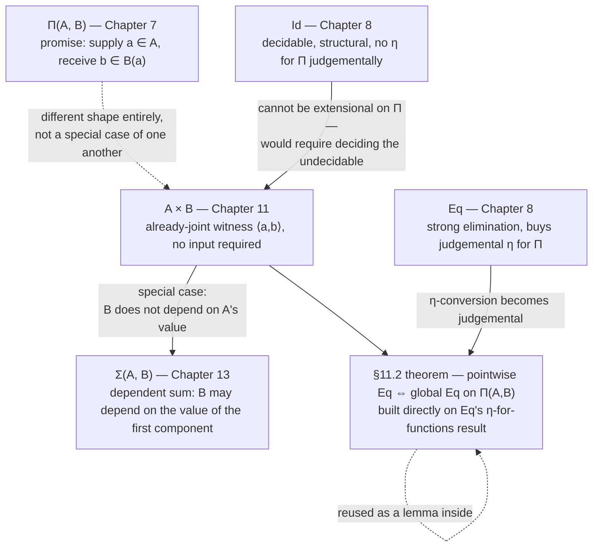

# The Cartesian Product of Two Sets and Conjunction

[[book-guidelines|↩ Back to guidelines]]

## What breaks without a dedicated pair set

Chapter 7 already gave you $\Pi(A,B)$, and $\Pi$ is an extremely general tool — dependent functions, [[The-Cartesian-Product-of-a-Family-and-the-Universal-Quantifier#The universal quantifier|the universal quantifier]], ordinary function spaces, and [[The-Cartesian-Product-of-a-Family-and-the-Universal-Quantifier#Implication|implication]] all fell out of it as special cases. So it's worth asking directly: why does the book need a *separate* primitive set former for pairs, rather than encoding "$A$ and $B$ together" somehow inside $\Pi$?

The honest answer is about the *shape* of what you're modeling. $\Pi(A,B)$'s elements are, at bottom, promise machines: give me an $a \in A$, and I'll compute you a $b \in B(a)$. That's exactly right for implication — "if $A$ then $B$" genuinely is "supply evidence for $A$, receive evidence for $B$." But conjunction, $A\ \&\ B$, is not a promise. Heyting's constructive reading of "$A$ and $B$" is: *I already have both, right now, simultaneously* — a proof of $A$ **and** a proof of $B$, packaged together, neither one waiting on the other. There's no "supply an argument, get a result" structure to it at all. You could, with effort, Church-encode a pair inside $\Pi$ — something like $\lambda f.\,f(a,b)$ typed at $(\Pi C\in Set)((A\to B\to C)\to C)$ — but that detour buys you nothing and costs you the thing you actually want: a *direct* elimination principle that case-analyzes the one canonical shape a pair can have, exactly mirroring conjunction-elimination in natural deduction ("from $A\ \&\ B$, extract a proof of $A$; from $A\ \&\ B$, extract a proof of $B$").

So Chapter 11 introduces $A\times B$ as its own primitive set former, with its own canonical elements, its own selector, and its own structural-induction elimination rule — built from scratch, the same way every other set former in the book has been. The chapter closes with a promissory note worth holding onto from the start: "we will later see that the cartesian product $A\times B$ is a special case of the disjoint union $(\Sigma x\in A)B$" — Chapter 13's fully dependent $\Sigma$-type. $\times$ is the special case where the second component's type doesn't depend on the first component's *value*. That's the synthesis this article closes with; for now, treat $\times$ as primitive, exactly as the book does.

## Pairing and the selector $split$

### The formal rules

Forming $A\times B$ needs a new primitive constant $\times$ of arity $0\otimes 0\to 0$, written infix:

$$\textbf{$\times$–formation}\qquad \dfrac{A\ set \qquad B\ set}{A\times B\ set}$$

To say what a *canonical element* of $A\times B$ is, the book introduces a second new constant, $\langle\,\rangle$, of arity $0\otimes 0\to 0$, written $\langle a,b\rangle$ instead of $\langle\rangle(a,b)$:

$$\textbf{$\times$–introduction}\qquad \dfrac{a\in A \qquad b\in B}{\langle a,b\rangle \in A\times B}$$

So the canonical elements of $A\times B$ are exactly the pairs $\langle a,b\rangle$ — there is, just as with $\Pi(A,B)$'s single canonical shape $\lambda(b)$, exactly one canonical shape here too, which is what makes a clean structural-induction eliminator possible.

The primitive **non-canonical** selector is $split$, of arity $0\otimes((0\otimes0)\to0)\to0$. Given $p\in A\times B$ and a two-argument program $e(x,y)\in C(\langle x,y\rangle)$ under the assumptions $x\in A,\ y\in B$, the term $split(p,e)$ is evaluated as follows:

1. Evaluate $p$.
2. If $p$'s value is $\langle a,b\rangle$, the value of $split(p,e)$ is the value of $e(a,b)$.

The book itself points out the right mental model: this is exactly an ML-style `let`/pattern-match,
$$\texttt{case } p \texttt{ of } (x,y) \Rightarrow e(x,y).$$
That's not a loose analogy — it *is* the same operation, in the same computational sense that $apply$ was literally $\beta$-reduction. $split$ pattern-matches its first argument down to its one possible canonical shape and hands both components to $e$.

From this computation rule, the book justifies the full elimination rule — the structural-induction schema, now instantiated for $\times$'s one canonical case:

$$\textbf{$\times$–elimination}\qquad \dfrac{p\in A\times B \qquad C(v)\ set\ [v\in A\times B] \qquad e(x,y)\in C(\langle x,y\rangle)\ [x\in A,\ y\in B]}{split(p,e)\in C(p)}$$

The justification runs exactly the way every other eliminator in the book is justified: $p\in A\times B$ forces $p$'s value to be some $\langle a,b\rangle$ with $a\in A,\ b\in B$; [[Natural-Numbers-and-Lists#The computation rule|the computation rule]] reduces $split(p,e)$ to $e(a,b)$; the third premise instantiated at $a,b$ gives $e(a,b)\in C(\langle a,b\rangle)$; and since $\langle a,b\rangle = p \in A\times B$, extensionality of the family $C$ gives $C(\langle a,b\rangle)=C(p)$, so $split(p,e)\in C(p)$. The matching computation rule:

$$\textbf{$\times$–equality}\qquad \dfrac{a\in A \qquad b\in B \qquad e(x,y)\in C(\langle x,y\rangle)\ [x\in A,\ y\in B]}{split(\langle a,b\rangle,e)=e(a,b)\in C(\langle a,b\rangle)}$$

Conjunction and logical equivalence then fall out as pure definitions, erasing proof terms:

$$\&\ \equiv\ \times \qquad\qquad A\Leftrightarrow B\ \equiv\ (A\supset B)\ \&\ (B\supset A)$$

$$\textbf{\&–formation}\ \dfrac{A\ prop\quad B\ prop}{A\ \&\ B\ prop}\qquad \textbf{\&–introduction}\ \dfrac{A\ true\quad B\ true}{A\ \&\ B\ true}\qquad \textbf{\&–elimination}\ \dfrac{A\ \&\ B\ true\quad C\ prop\quad C\ true\ [A\ true,\ B\ true]}{C\ true}$$

Exactly the natural-deduction rules for conjunction, with `&`-elimination reading precisely as "from a proof of $A\ \&\ B$ you may assume proofs of both $A$ and $B$ simultaneously to derive $C$" — which is just $\times$-elimination with [[The-Universe-of-Small-Sets#The proof|the proof]] terms suppressed.

### Rust: this is a tuple, and $split$ is a pattern match

$A \times B$ maps onto a Rust tuple (or an equivalent two-field `struct`) about as directly as any construct in this book maps onto anything:

```rust
fn make_pair<A, B>(a: A, b: B) -> (A, B) {
    (a, b)
}

// split(p, e): evaluate p, then feed both components to e
fn split<A, B, C>(p: (A, B), e: impl FnOnce(A, B) -> C) -> C {
    let (a, b) = p; // exactly the ML/book pattern-match step
    e(a, b)
}
```

Rust's `let (a, b) = p;` *is* `split`'s computation rule, verbatim: it forces `p` to its one possible shape (a tuple always has that shape, since Rust's type checker rules out anything else being a `(A, B)`), then binds both components for use. Rust doesn't need a "canonical form" story the way the book does — a tuple value simply always is one — but the operational content is identical.

### Lean: $A \times B$ is `Prod`

Lean's `Prod A B` (notation `A × B`) is, again, not an analogy but the same object under a different concrete syntax:

```lean
-- ⟨a, b⟩ is Prod.mk a b, exactly the book's × – introduction
example (A B : Type) (a : A) (b : B) : A × B := ⟨a, b⟩

-- split, as a structural pattern match — the ×–elimination shape
def splitP {A B C : Type} (p : A × B) (e : A → B → C) : C :=
  match p with
  | ⟨a, b⟩ => e a b
```

### Python: a five-line sketch

```python
def split(p, e):
    a, b = p
    return e(a, b)
```

Nothing more to say here — Python's tuple unpacking is the same operation with the type discipline erased, useful only as a reminder that the *mechanism* $split$ names is a completely ordinary one; what the book adds on top is a formal justification for treating it as a legitimate elimination principle.

## Projections $fst$ and $snd$

The book defines the ordinary projections as instances of $split$ rather than as new primitives:

$$fst(x) \equiv split(x,\,(y,z)y) \qquad\qquad snd(x) \equiv split(x,\,(y,z)z)$$

Operationally: $fst(\langle a,b\rangle)$ evaluates $\langle a,b\rangle$ to itself, then evaluates $(y,z)y$ applied to $(a,b)$, which is $a$. Nothing new is added to the theory — $fst$ and $snd$ are exactly the two ways of choosing *which* component the two-argument function $e$ in $split$ hands back.

**Rust/Lean grounding is immediate:** `.0`/`.1` on a tuple, or `.fst`/`.snd` on Lean's `Prod`, name exactly these two derived selectors.

```rust
fn fst<A, B>(p: (A, B)) -> A { p.0 }
fn snd<A, B>(p: (A, B)) -> B { p.1 }
```

```lean
example (A B : Type) (p : A × B) : A := p.1  -- Prod.fst
example (A B : Type) (p : A × B) : B := p.2  -- Prod.snd
```

### What breaks without projection-as-inverse-of-pairing — the book's worked proof

Here is where the chapter does something genuinely interesting rather than just restating machinery, and it's the worked example the source explicitly calls out: **"Projection is the inverse of pairing."** You would like it to be true that pairing a pair's own components back together gives you the pair back:

$$\langle fst(z),snd(z)\rangle =_{A\times B} z$$

The book states plainly why this cannot be a *judgemental* fact, appealing to the untyped $\lambda$-calculus for intuition: "In the lambda-calculus it is not possible to define pairing and projection so that $\langle fst(z),snd(z)\rangle$ converts to $z$." The reason is structural, and it's the same reason $\eta$-[[Propositions-as-Sets-(The-Curry-Howard-Correspondence)#Equality|equality]] for $\Pi$ wasn't judgemental in Chapter 8 either: $fst$ and $snd$ only *compute* once their argument has already reduced to the canonical shape $\langle a,b\rangle$. If $z$ is an arbitrary term — a free variable, or some other selector application that hasn't yet reduced — $fst(z)$ and $snd(z)$ are simply *stuck*; there is no reduction step available to turn $\langle fst(z),snd(z)\rangle$ back into the literal syntactic object $z$. Judgemental (definitional) equality in this theory, as the [[Equality-Sets|Equality Sets chapter]] establishes, tracks exactly the convertibility relation generated by the computation rules — and no sequence of computation rules connects $\langle fst(z),snd(z)\rangle$ to $z$ when $z$ isn't already a literal pair.

But it *is* provable **propositionally**, and the book's derivation is short enough to walk through in full — it's a clean, self-contained illustration of "prove the canonical case judgementally, then use the eliminator to lift the proof to an arbitrary element," the same pattern that will reappear for $\eta$ on functions below.

**Step 1 — the canonical case, judgementally.** By $\times$-equality (instantiating $e$ as $(y,z)y$ and $(y,z)z$ respectively):

$$fst(\langle x,y\rangle) = x \in A\ [x\in A,\ y\in B] \qquad\qquad snd(\langle x,y\rangle) = y \in B\ [x\in A,\ y\in B]$$

**Step 2 — pair them back up.** Applying the congruence form of $\times$-introduction (the book calls it $\times$-introduction 2: pairing preserves equal components) to these two judgemental equalities:

$$\langle fst(\langle x,y\rangle),\,snd(\langle x,y\rangle)\rangle = \langle x,y\rangle \in A\times B\ [x\in A,\ y\in B]$$

**Step 3 — turn the judgemental equality into an $Id$-proof.** This is the exact derived rule $Id$-introduction$'$ from Chapter 8 doing real work: apply symmetry to flip the direction, then $Id$-introduction$'$ ("$a=b\in A \Rightarrow id(a)\in Id(A,a,b)$") to get

$$id(\langle x,y\rangle) \in \bigl(\langle x,y\rangle =_{A\times B} \langle fst(\langle x,y\rangle),\,snd(\langle x,y\rangle)\rangle\bigr)\ [x\in A,\ y\in B]$$

This is only established for the *canonical* pair $\langle x,y\rangle$ — exactly the base case a structural induction needs.

**Step 4 — lift to an arbitrary $z\in A\times B$ via $split$.** Take the motive $C(v)\equiv Id(A\times B,\,v,\,\langle fst(v),snd(v)\rangle)\ [v\in A\times B]$ and the program $e(x,y)\equiv id(\langle x,y\rangle) \in C(\langle x,y\rangle)$ — exactly what Step 3 handed you. $\times$-elimination then gives:

$$split(z,\,(x,y)\,id(\langle x,y\rangle)) \in \bigl(z =_{A\times B} \langle fst(z),snd(z)\rangle\bigr)\ [z\in A\times B]$$

That's the theorem, proved — but proved *propositionally*, via an explicit induction over $\times$'s one canonical shape, not by any reduction step the term $\langle fst(z),snd(z)\rangle$ itself undergoes. The proof term $split(z,(x,y)\,id(\langle x,y\rangle))$ is real, computable evidence, but it is a genuinely different object from $z$ — they are merely provably, not syntactically, interchangeable.

### Lean's structure eta: the crisp formal counterpart

This is precisely the place where 1990-vintage type theory and a modern kernel diverge in an instructive way. Lean 4's kernel special-cases exactly this fact — pairing-after-projection reproduces the original structure — as a **primitive, decidable reduction rule** baked into `isDefEq` itself, for every `structure` (and `Prod` is a structure):

```lean
structure Pair (A B : Type) where
  mk :: (fst : A) (snd : B)

-- what the book needs four proof steps and a use of split to establish
-- propositionally, Lean's kernel accepts as a definitional fact:
example (A B : Type) (p : Pair A B) : Pair.mk p.fst p.snd = p := rfl
```

That `rfl` is not cheating — it works because Lean's kernel implements **structure eta**: when checking whether two terms of a structure type are definitionally equal, it eta-expands both sides to their constructor-applied-to-projections form and compares *that*, as one more terminating, syntax-directed reduction rule alongside $\beta$, $\iota$, and $\delta$-reduction. It costs the kernel nothing extra in decidability, for the same reason function-eta didn't (as the [[Equality-Sets|Equality Sets]] article on Chapter 8 covers): eta-expansion is a *bounded, structural* rewrite, not an appeal to arbitrary provability. Lean simply chose to make *this one* propositionally-true-but-not-obviously-computational fact a first-class part of `isDefEq`, exactly where the 1990 book, working with a smaller and more conservative kernel, had to reach for $Id$-elimination and an explicit induction instead. Nothing about the *mathematical content* changed between the two — $\langle fst(z),snd(z)\rangle = z$ is true either way — only whether the checker is willing to see it as `rfl` or requires you to hand it an explicit proof term. That's the same design axis Chapter 8 introduced with $Id$ versus $Eq$, showing up again here in miniature, at a scale small enough that a real kernel can afford to just build it in.

## Extensional equality of functions in a $\Pi$-set

### Why this section exists here, and not earlier

Recall the load-bearing tension from [[Equality-Sets|Chapter 8]]: $Id$-based judgemental equality is decidable precisely *because* it never does more than reduce and compare — it tracks convertibility, full stop. $Eq$ buys you more proving power (strong Eq-elimination lets a *propositional* proof cash itself in as a *judgemental* fact) at the cost of decidability, since propositional provability is not, in general, decidable. Chapter 8 promised a concrete payoff for that trade — judgemental $\eta$-equality for functions, provable using $Eq$ but not $Id$ alone — and flagged that Chapter 11 would put it to real use. Section 11.2 is that payoff, applied to a genuinely important theorem: **when are two functions equal?**

### Why $Id$ cannot be the answer

Two functions $f,g\in\Pi(A,B)$ are called *extensionally* equal when they agree pointwise:
$$(\forall x\in A)\,Id(B(x),\,apply(f,x),\,apply(g,x))$$
The tempting question is whether this pointwise statement is logically equivalent to the "global" statement $Id(\Pi(A,B),f,g)$. The book answers, flatly: you cannot expect it to be, and gives a genuinely illuminating reason, not just an assertion. $Id(\Pi(A,B),f,g)$ doesn't depend on any assumptions, so — by the convertibility result from §8.2 — it is nonempty exactly when $f$ and $g$ are convertible, and convertibility is decidable (finitely many reduction steps, then compare normal forms). But the pointwise statement, specialized to $A\equiv N$,
$$(\forall x\in N)\,Id(N,\,apply(f,x),\,apply(g,x))$$
cannot in general be decidable — deciding "do these two functions on $N$ agree at every natural number" is exactly the shape of question that outruns any bounded, syntax-directed procedure (it is, in spirit, a halting-adjacent question: you cannot check infinitely many instances by reduction alone). A decidable statement cannot be equivalent to an undecidable one, so $Id$'s pointwise and global readings of function equality must genuinely come apart. This is not a defect to be patched — it is $Id$'s decidability doing exactly its job, refusing to let an infinite, potentially-unbounded verification collapse into a single reduction check.

### The theorem, proved with $Eq$

$$\textbf{Theorem}\qquad (\forall x\in A)\,Eq(B(x),\,apply(f,x),\,apply(g,x))\ \Leftrightarrow\ Eq(\Pi(A,B),\,f,\,g)\qquad [f\in\Pi(A,B),\ g\in\Pi(A,B)]$$

**($\Leftarrow$), global to pointwise.** Assume $Eq(\Pi(A,B),f,g)$. Strong Eq-elimination immediately gives the *judgemental* fact $f=g\in\Pi(A,B)$; ordinary equality rules then give $apply(f,x)=apply(g,x)\in B(x)\ [x\in A]$ judgementally too. $Eq$-introduction packages this as $eq\in Eq(B(x),apply(f,x),apply(g,x))$, and $\Pi$-introduction closes it off as
$$\lambda((x)\,eq) \in (\forall x\in A)\,Eq(B(x),apply(f,x),apply(g,x)).$$

**($\Rightarrow$), pointwise to global — the interesting direction.** Assume $(\forall x\in A)\,Eq(B(x),apply(f,x),apply(g,x))$. $\Pi$-elimination plus strong Eq-elimination gives $apply(f,x)=apply(g,x)\in B(x)\ [x\in A]$ judgementally, hence (by ordinary equality rules, abstracting both sides)
$$\lambda((x)\,apply(f,x)) = \lambda((x)\,apply(g,x)) \in \Pi(A,B).$$
Now comes the step that only works because this is the $Eq$-theory: by **$\eta$-conversion** — which, per §8.3, is a genuine *judgemental* rule once $Eq$ is in the theory, itself derived by exactly the strong-Eq-elimination-on-a-$funsplit$-lifted-$Id$-proof construction covered in the [[Equality-Sets|Equality Sets article]] — both sides collapse to their eta-expanded originals, giving $f=g\in\Pi(A,B)$ judgementally. $Eq$-introduction closes the loop: $eq\in Eq(\Pi(A,B),f,g)$.

Notice the shape: this proof does not reprove $\eta$ from scratch. It *reuses* Chapter 8's $\eta$-for-$Eq$ theorem as a lemma, exactly the way a real proof development reuses earlier results. Functional extensionality here is not a new primitive commitment bolted onto the theory — it falls straight out of two things already established: strong Eq-elimination, and judgemental $\eta$ under $Eq$.

### Rust and Lean: where this lands in real systems

Rust has no principled notion of function equality at all, and the reason is exactly this theorem's negative half: comparing two `Fn` values (or trait objects) for equality is not merely unimplemented, it's not decidable in the general sense the book just ruled out, so Rust simply declines to give closures or `dyn Fn` a `PartialEq` implementation. There's nothing to "ground" beyond that refusal — it's the concrete, load-bearing consequence of the same undecidability argument the book gives for why $Id$ can't be extensional on $\Pi(A,B)$.

Lean's situation is the direct, named descendant of this theorem. Function extensionality in Lean is the lemma `funext : (∀ x, f x = g x) → f = g` — and it is deliberately **not** part of `isDefEq`. Two functions that agree pointwise are not `rfl`-equal in Lean; you must invoke `funext` explicitly to produce a new proof term, exactly as the book's theorem produces an explicit $Eq(\Pi(A,B),f,g)$-inhabitant rather than a judgemental fact for free. Lean is able to *derive* `funext` as a genuine theorem (built on top of its quotient-type machinery, `Quot.sound`), rather than needing to assume it as a bare axiom the way systems without a comparable primitive (older presentations of Coq, for instance) have historically had to; but derivable-as-a-theorem or asserted-as-an-axiom, the point that matters here is the same one the book is making: **no mainstream kernel folds functional extensionality into its decidable definitional-equality core.** It stays on the propositional side, behind an explicit proof term you must produce and apply — the `funext`/`Eq`-shaped side of the $Id$/$Eq$ fork, never the `rfl`/$Id$-shaped side. This is the exact reason: making it definitional would mean `isDefEq` inherits the undecidability the book's own convertibility argument identifies.

```lean
-- what the theorem gives you a proof term for, is exactly what funext gives you here:
example (A : Type) (B : A → Type) (f g : (x : A) → B x)
    (h : ∀ x, f x = g x) : f = g :=
  funext h  -- an explicit proof term, never `rfl`
```

## Structure at a glance



## Where this leads

Two threads converge in this one chapter, and both point forward.

**Structurally,** $A\times B$ is the non-dependent shadow of $\Sigma(A,B)$, Chapter 13's dependent sum — the same relationship $\to$ (Chapter 7) bears to $\Pi$. Everything built here — $\langle\,\rangle$, $split$, $fst$, $snd$, the propositional-not-judgemental pairing-inverse theorem — will reappear, generalized, once the second component is allowed to depend on the value of the first. Recognizing $\times$ as $\Sigma$'s degenerate case is also what lets the existential quantifier (Chapter 13, $(\exists x\in A)B(x)\equiv\Sigma(A,B)$) and conjunction (this chapter, $A\ \&\ B\equiv A\times B$) sit inside a single uniform family, exactly the way $\forall$ and implication both sat inside $\Pi$.

**For the standing $Id$/$Eq$ thread,** §11.2's functional-extensionality theorem is the concrete case study this vault keeps returning to for *why* a kernel author draws the definitional/propositional line where they do. This chapter shows, with a full worked proof, that $Id$ cannot be extensional on $\Pi(A,B)$ without inheriting an undecidable pointwise-agreement question — and that $Eq$ *can*, at the cost of exactly the decidability Chapter 8 already flagged as the price of strong elimination. Every mainstream proof assistant reaches the same equilibrium point this book reaches in 1990: keep `isDefEq`/judgemental equality small and structural (the $Id$ side — and, as Lean's structure eta shows, you can even afford to grow that side a little, so long as what you add stays a bounded, terminating rewrite rather than an appeal to provability); keep functional extensionality, and anything else that would require deciding arbitrary propositions, on the explicit, proof-term-carrying side (`funext`, the $Eq$ side) — provable, sometimes even derivable from more primitive machinery like quotients, but never something the checker absorbs for free. That is precisely the design fork a Rust verifier's `is_def_eq` has to resolve the same way: treat pointwise function agreement as a proof obligation the caller discharges explicitly, never as something the equality checker tries to settle on its own.
