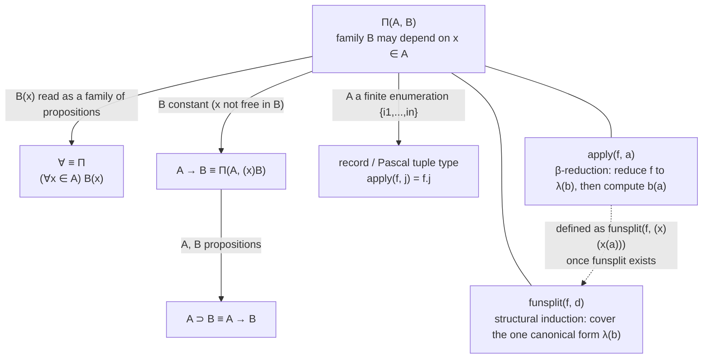

# The Cartesian Product of a Family and the Universal Quantifier

[[book-guidelines|↩ Back to guidelines]]

## What breaks without a dependent function set

Every ordinary typed function you've ever written has a signature of the shape `f : A -> B`: one input type, one output type, fixed in advance, no matter which particular `a : A` you hand it. That's enough for `succ : N -> N` or `not : Bool -> Bool`. It is not enough the moment you want to *specify* a program rather than just implement one.

Take sorting. A sensible specification of a sorting function is not "takes a list of integers, returns a list of integers" — that's true of `reverse` too, and of the constant-`nil` function, neither of which sorts anything. A specification that actually pins down sorting has to say: given a list $a$, the result lies in $Op(a)$, *the set of ordered permutations of $a$ specifically*. The set the output lives in is different for every input — $Op([3,1,2])$ and $Op([7])$ are literally different sets, because being "an ordered permutation of $[3,1,2]$" and being "an ordered permutation of $[7]$" are different properties. A function type that only lets you write one fixed codomain $B$ cannot express this. You need a function type where **the codomain is itself a function of the argument's value**, not just its type.

This is the problem Chapter 7 solves. Nordström, Petersson and Smith introduce the **cartesian product of a family of sets**, written $\Pi(A,B)$, whose elements are functions $f$ such that if $a \in A$ then $f$ applied to $a$ lands in $B(a)$ — a set that is allowed to genuinely depend on *which* $a$ you picked, not merely on the fact that it has type $A$. The book is explicit that this generality "is needed in the definition of the universal quantifier" and "is also needed when we use sets to specify programs" — those are literally the two motivations, and they turn out to be the same motivation, because in this book propositions *are* sets.

### The Rust fragment, and exactly where it stops

The ordinary, non-dependent case of $\Pi(A,B)$ — where $B$ doesn't actually mention $x$ — is just the Rust function type you already know:

```rust
fn apply<A, B>(f: impl Fn(A) -> B, a: A) -> B {
    f(a)
}
```

Nothing here lets `B` change based on the *value* of `a` at runtime. Rust's type system is checked before any value exists, so a signature like `fn sort(l: List<i32>) -> OrderedPermutationsOf(l)` is not expressible — `OrderedPermutationsOf(l)` would have to be a type computed from a runtime value, and Rust types are erased before runtime. This is not a superficial gap; it is the exact gap Chapter 7 is about. Rust does have one narrow escape hatch worth naming honestly: **const generics**, where a type can depend on a *compile-time* value:

```rust
fn zeros<const N: usize>() -> [u8; N] {
    [0; N]
}
```

Here `[u8; N]` really is a type indexed by a value `N`. It's a genuine, if tightly restricted, instance of value-dependency in Rust's type system — restricted to `const`-evaluable naturals, not arbitrary runtime data like a list's contents. It's the right shape of example, and it's also precisely where Rust's approximation to $\Pi$ runs out; a length-indexed array is dependency on a number, not dependency on an arbitrary proposition-valued family like "is an ordered permutation of."

The book itself, incidentally, offers its own version of a *finite*, non-arithmetic instance of this pattern: a Pascal **record type** is exactly $(\Pi x \in \{i_1,\ldots,i_n\})B(x)$, where the "index set" is the finite set of field names and $B(j)$ is the type of field $j$. A Rust `struct` is the same idea:

```rust
struct Point {
    x: i32,
    y: bool,
}
```

Reading `p.x` versus `p.y` really does select values of *different* types depending on which name you pick — a small, finite-domain dependent product hiding in plain sight in a language with no dependent types. This is the closest Rust gets, and it's exactly the case the book calls out in §7 as example (3) of "constants defined in terms of Π."

For the *genuinely* dependent case — codomain depending on an arbitrary value, not just a compile-time numeral or a fixed finite label — Rust has nothing more to offer, and forcing an analogy would be misleading. That's what Lean's Pi type is for.

## Functions as canonical elements of a $\Pi$-set

### The formal apparatus

To form $\Pi(A,B)$ you need a set $A$ and a *family* of sets $B$ over $A$ — formally,
$$A\ set \qquad\text{and}\qquad B(x)\ set\ [x \in A].$$
The book introduces $\Pi$ as a primitive constant and defines the familiar quantifier-flavored notation as an abbreviation:
$$(\Pi x \in A)B(x) \equiv \Pi(A,B).$$

Before saying what the *elements* of $\Pi(A,B)$ are, the book draws a distinction that is easy to blur and that it insists on keeping sharp: there are two different notions of "function" in play.

1. **Abstraction** — the purely syntactic notion from Chapter 3: an expression with a hole in it, written $(x)e$. This is the more basic notion; it's what you're already using when you write down $B$ itself, or $\Pi(A,B)$, or $A \to B$ — in all of these, $B$ (and $\to$, and $\Pi$) are themselves abstractions taking set-valued arguments.
2. **Function element** — an actual element of a $\Pi$-set. This is the notion Chapter 7 is introducing.

The book reserves the word "function" for the second sense once there's a risk of confusion, and calls the first sense "abstraction." It's a useful habit to keep: a bare abstraction $(x)e$ is not yet a citizen of any set; it becomes one only when wrapped as a *canonical element* of a specific $\Pi(A,B)$.

That wrapping is done by a new primitive constant, $\lambda$. Given an abstraction $b$ such that $b(x) \in B(x)$ under the assumption $x \in A$, the expression $\lambda(b)$ is a canonical element of $\Pi(A,B)$:
$$\lambda(b) \text{ is a canonical element in } \Pi(A,B) \text{ if } b(x) \in B(x)\ [x \in A].$$
Two canonical elements $\lambda(b_1)$ and $\lambda(b_2)$ are equal exactly when $b_1(x) = b_2(x) \in B(x)\ [x \in A]$ — [[Propositions-as-Sets-(The-Curry-Howard-Correspondence)#Equality|equality]] on the function set is inherited pointwise from equality on the family.

In the more familiar dot-notation the book also uses, these are written $\lambda x.\, b(x)$. Worked examples from the text:
$$\lambda x.x \in (\Pi x \in Bool)Bool \qquad \lambda x.\,succ(x) \in (\Pi x \in N)N \qquad \lambda x.\lambda y.\, x \oplus y \in (\Pi x \in N)(\Pi y \in N)N.$$
The last one is worth pausing on: it's a two-argument function realized, in properly curried style, as a $\Pi$-set whose codomain is *itself* another $\Pi$-set — exactly the shape you'd expect if you take "everything is a function of one argument, curried" seriously as a foundational commitment, the way the untyped $\lambda$-calculus does, but now with every intermediate stage carrying a genuine dependent type.

This gives you the two rules that establish $\Pi(A,B)$ as a legitimate set:

$$
\textbf{$\Pi$–formation}\quad
\frac{A\ set \qquad B(x)\ set\ [x\in A]}{\Pi(A,B)\ set}
\qquad\qquad
\textbf{$\Pi$–introduction}\quad
\frac{b(x) \in B(x)\ [x \in A]}{\lambda(b) \in \Pi(A,B)}
$$

(Extensionality of $\Pi(A,B)$'s equality is inherited for free: the free variables of $\lambda(b_1)$ and $\lambda(b_2)$ are exactly the free variables of $b_1(x)$ and $b_2(x)$, and the family $B$ is already required to be extensional.)

### The Lean counterpart: this is not an analogy, it's the same rule

Where Rust's function type stalls, Lean's does not — because Lean's Pi type, `(x : A) → B x`, *is* the formal object $\Pi(A,B)$, notation aside. This is the one place in the chapter where "grounding" and "formalization" are the same activity:

```lean
-- A is a Type, B is a genuine family of types indexed by A's values
def PiIntro {A : Type} (B : A → Type) (b : (x : A) → B x) : (x : A) → B x :=
  b

-- The sorting specification the chapter motivates the whole chapter with:
def sorted (A : Type) [LinearOrder A] : List A → Prop :=
  fun l => List.Sorted (· ≤ ·) l

-- and a Π-typed specification of "produce a sorted permutation of l":
def SortSpec (A : Type) [LinearOrder A] : Type :=
  (l : List A) → { l' : List A // l'.Perm l ∧ sorted A l' }
```

`SortSpec` is exactly $(\Pi l \in List(A))\, Op(l)$ written in Lean's syntax: a function type whose result type, `{ l' : List A // l'.Perm l ∧ sorted A l' }`, mentions the *argument* `l`. This is precisely the generality Rust's `fn` cannot express and Lean's dependent Pi type can.

## The selector $apply$ and the alternative selector $funsplit$

Having elements of $\Pi(A,B)$ is only useful if you can *use* one — apply it to an argument and land back in the right set. The book gives the primitive non-canonical constant $apply$, of arity $0 \otimes 0 \to 0$, together with an infix shorthand:
$$x \cdot y \equiv apply(x,y).$$

Its computation rule is stated directly in terms of evaluation, not as an instance of some general schema:

1. $apply(f,a)$ is evaluated by first evaluating $f$.
2. If $f$ has value $\lambda(b)$, then the value of $apply(f,a)$ is the value of $b(a)$.

This is $\beta$-reduction, verbatim, dressed up as a computation rule. And from it the book derives the two rules governing $apply$:

$$
\textbf{$\Pi$–elimination 1}\quad
\frac{f \in \Pi(A,B) \qquad a \in A}{apply(f,a) \in B(a)}
\qquad\qquad
\textbf{$\Pi$–equality 1}\quad
\frac{b(x) \in B(x)\ [x\in A] \qquad a \in A}{apply(\lambda(b),a) = b(a) \in B(a)}
$$

The justification (worked out explicitly in §7.1) is short precisely *because* it leans on $\beta$-reduction: $f \in \Pi(A,B)$ means $f$ has a value of the canonical form $\lambda(b)$ with $b(x) \in B(x)\ [x \in A]$; computing $apply(f,a)$ means computing $b(a)$; and since $a \in A$, the family assumption gives $b(a) \in B(a)$ directly.

### Why the book adds a second, structural selector

Section 7.2 opens with a remark that's easy to read past too quickly: *for most sets, the non-canonical selector and its computation rule are based on the principle of structural induction* — to prove a property of an arbitrary element, you handle each canonical form of that set in turn (this is exactly the shape of $case$ for enumeration sets, $natrec$ for $N$, $when$ for disjoint unions, $idpeel$ for [[Equality-Sets|equality sets]]: one clause per constructor). *[[Natural-Numbers-and-Lists#The computation rule|The computation rule]] for $apply$ does not follow this principle.* It was chosen because it happens to be $\beta$-reduction — well-known, convenient, but not derived from the general elimination schema the rest of the book's set formers obey.

So the book introduces an alternative, $funsplit$, of arity $(0 \otimes ((0 \to 0) \to 0)) \to 0$, built the way the other eliminators are built. Given $f \in \Pi(A,B)$ and a program $d(y)$ producing an element of $C(\lambda(y))$ for *any* abstraction $y$ satisfying $y(x) \in B(x)\ [x \in A]$ — note this is a **higher-order assumption**: an assumption made about a function variable, not an element variable — $funsplit$ is computed by:

1. Compute $f$.
2. If the value of $f$ is $\lambda(b)$, the value of $funsplit(f,d)$ is the value of $d(b)$.

This gives the alternative elimination rule, which now *does* have the shape "cover every canonical form" (there is exactly one canonical form of $\Pi(A,B)$, namely $\lambda(b)$, and [[Natural-Numbers-and-Lists#The rule|the rule]] covers it):

$$
\textbf{$\Pi$–elimination 2}\quad
\frac{
f \in \Pi(A,B) \qquad
C(v)\ set\ [v \in \Pi(A,B)] \qquad
d(y) \in C(\lambda(y))\ [y(x) \in B(x)\ [x \in A]]
}{
funsplit(f,d) \in C(f)
}
$$

$$
\textbf{$\Pi$–equality 2}\quad
\frac{
b(x) \in B(x)\ [x \in A] \quad
C(v)\ set\ [v \in \Pi(A,B)] \quad
d(y) \in C(\lambda(y))\ [y(w)\in B(w)\ [w\in A]]
}{
funsplit(\lambda(b),d) = d(b) \in C(\lambda(b))
}
$$

The book's justification of elimination 2 is the general-purpose argument every structural-induction eliminator gets: $f \in \Pi(A,B)$ forces $f$ to have a canonical value $\lambda(b)$ with $b(x) \in B(x)\ [x\in A]$; the higher-order premise instantiated at $b$ gives $d(b) \in C(\lambda(b))$; the computation rule says $funsplit(f,d)$ computes to $d(b)$; and since $f = \lambda(b) \in \Pi(A,B)$, extensionality of the family $C$ gives $C(f) = C(\lambda(b))$, so $funsplit(f,d) \in C(f)$.

### $apply$ demoted to a definition

Here is the payoff the book stages carefully: once $funsplit$ is in hand, $apply$ doesn't need to be primitive anymore. It can be *defined*:
$$apply(f,a) \equiv funsplit(f,(x)(x(a))).$$
Unwinding this: $apply(f,a)$ reduces to $funsplit(f,(x)(x(a)))$, which computes $f$ to $\lambda(b)$ and then evaluates $((x)(x(a)))(b)$ — which is definitionally equal to $b(a)$. Same answer, but now $apply$ is a *derived* shortcut for an instance of the genuinely structural principle, rather than the structural principle's replacement. The book even re-proves the elimination-1 theorem from this definition, as a corollary of elimination 2, closing the loop: $apply$'s good behavior is no longer an assumption, it's a theorem about $funsplit$.

## Structural induction versus $\beta$-reduction as elimination principles

This is worth naming as its own idea, because it is the philosophically load-bearing move of the chapter, not just a technical aside. Two selectors, $apply$ and $funsplit$, both correctly compute an element of $\Pi(A,B)$ applied to an argument. They differ in *why* they're justified:

- $apply$'s justification is *computational familiarity*: its rule is $\beta$-reduction, borrowed wholesale from the untyped $\lambda$-calculus, and it is correct because you can trace through what evaluating $\lambda(b)$ applied to $a$ actually does.
- $funsplit$'s justification is *structural*: it is an instance of the same "handle every canonical form" schema that justifies $case$, $natrec$, $when$, $idpeel$, and every other eliminator in the book. It generalizes uniformly; $apply$ does not (it's specific to $\Pi$ having exactly the shape it has).

Once you notice that $\lambda(b)$ is the *only* canonical form of $\Pi(A,B)$, the two collapse into provably the same behavior — which is exactly what the re-derivation of $apply$ from $funsplit$ demonstrates. But they are not the same *principle*, and the book is deliberately showing you both because most set formers only ever get the structural-induction treatment; $\Pi$ is unusual in also admitting a directly computational, $\beta$-reduction-flavored shortcut, precisely because functions are the one place where "compute" already has an independent, pre-theoretic meaning from the $\lambda$-calculus.

### Where this distinction actually shows up when you build a checker

This is not a purely historical curiosity — it's the exact fork in the road every dependently typed kernel and elaborator has to choose at. Real systems (Lean, Coq, Agda) do **not** give Pi types a `funsplit`-style recursor. Pi is a *primitive* judgment former, not an inductive type with constructors, so there is no schema of "cover every canonical form" to instantiate — there's exactly one shape of canonical Pi-element, and the kernel just reduces to it. In other words: real elaborators universally take the $apply$ side of this fork, not the $funsplit$ side, and for the same reason the book gives for introducing $apply$ first — it's simpler and it's what you already know how to compute.

Where this becomes concretely load-bearing for a bidirectionally-typed elaborator: type-checking an application `f a` is the textbook case of **elimination in checking-adjacent, apply-driven mode**. You *infer* the type of the head `f` (synthesis), which — if `f` type-checks at all — must whnf-reduce to a Pi type $\Pi(A,B)$; you *check* the argument `a` against `A`; and the type of the whole application is *computed*, not guessed, as $B(a)$ — literally $\Pi$-elimination 1's conclusion, `apply(f, a) ∈ B(a)`. This is the soundness argument your elaborator's application-typing rule has to reproduce, and it's identical in shape to the book's own justification of $\Pi$-elimination-1: "$f$ must reduce to $\lambda(b)$; $a \in A$; therefore $b(a) \in B(a)$." Meanwhile, $funsplit$'s structural-induction schema is the *general pattern* that shows up wherever your kernel does need a genuine recursor — `Nat.rec`, `List.rec`, and any inductive type you add later all get exactly the `funsplit`-shaped elimination principle (cover every constructor, with a motive `C` and one case per canonical form), even though `Pi`/`Fn` itself never does. Seeing both selectors side by side in this one chapter is, in effect, seeing the fork between "primitive judgment former, eliminated by direct reduction" and "inductively presented set, eliminated by a recursor" laid out explicitly and *proved equivalent in this one case* — which is exactly the kind of soundness fact a Rust verifier needs before it's allowed to treat function application as a safe, substitution-preserving step.

## The restricted function set and implication

Section 7.3 harvests three important special cases of $\Pi(A,B)$ by fixing shape, purely through explicit definitions layered on top of the machinery already built — no new primitive judgment forms are needed.

### The universal quantifier

$$\forall \equiv \Pi, \qquad \text{written } (\forall x \in A)B(x) \text{ instead of } \forall(A,B).$$

Reading $B(x)$ as a family of *propositions* rather than sets recovers exactly the Heyting interpretation stated earlier in the chapter: $(\forall x \in A)B(x)$ is true precisely when you can construct a function that, applied to any $a \in A$, yields a proof of $B(a)$ — and the elements of $\Pi(A,B)$ are, by construction, exactly such functions. [[Equality-Sets#The rules|The rules]] fall out directly from $\Pi$'s:

$$
\textbf{$\forall$–formation}\ \frac{A\ prop \quad B(x)\ prop\ [x\in A]}{(\forall x\in A)B(x)\ prop}
\qquad
\textbf{$\forall$–introduction}\ \frac{B(x)\ true\ [x\in A]}{(\forall x\in A)B(x)\ true}
$$
$$
\textbf{$\forall$–elimination 1}\ \frac{(\forall x\in A)B(x)\ true \quad a\in A}{B(a)\ true}
\qquad
\textbf{$\forall$–elimination 2}\ \frac{(\forall x\in A)B(x)\ true \quad C\ prop \quad C\ true\ [B(x)\ true\ [x\in A]]}{C\ true}
$$

(elimination 1 and elimination 2 here are exactly $apply$ and $funsplit$ again, with proof terms erased.)

### The non-dependent function set $A \to B$

$$\to(A,B) \equiv \Pi(A,(x)B), \qquad \text{written } A \to B, \qquad x \text{ not free in } B.$$

This is the fragment that *does* correspond exactly to Rust's `fn` — a $\Pi$-set where the family happens to be constant. Its four rules are $\Pi$'s rules specialized, with the side condition that $B$ doesn't mention the bound variable:

$$
\textbf{$\to$–formation}\ \frac{A\ set \quad B\ set\ [x\in A]}{A\to B\ set}
\qquad
\textbf{$\to$–introduction}\ \frac{b(x)\in B\ [x\in A]}{\lambda(b)\in A\to B}
$$
$$
\textbf{$\to$–elimination}\ \frac{f\in A\to B \quad a\in A}{apply(f,a)\in B}
\qquad
\textbf{$\to$–equality}\ \frac{b(x)\in B\ [x\in A] \quad a\in A}{apply(\lambda(b),a)=b(a)\in B}
$$

### Implication

Following the same Heyting interpretation the chapter opens with — "$A \supset B$ is true if we can construct a function which, applied to a proof of $A$, yields a proof of $B$" — implication is defined by identifying it with $\to$:
$$\supset\ \equiv\ \to.$$
Erasing proof terms from $\to$'s rules gives exactly natural deduction's rules for implication:

$$
\textbf{$\supset$–formation}\ \frac{A\ prop \quad B\ prop\ [A\ true]}{A\supset B\ prop}
\qquad
\textbf{$\supset$–introduction}\ \frac{B\ true\ [A\ true]}{A\supset B\ true}
\qquad
\textbf{$\supset$–elimination}\ \frac{A\supset B\ true \quad A\ true}{B\ true}
$$

One genuinely subtle point the book flags explicitly: the formation rule's second premise is *weaker* than the traditional "$B$ is a proposition, full stop" — it only requires $B$ to be a proposition **under the assumption that $A$ is true**. This is Schröder-Heister's weakened formation rule; it matters because it lets $B$'s well-formedness depend on evidence for $A$ (a pattern that shows up constantly once you're specifying real programs — e.g. "if the list is nonempty, its head is defined").

### The worked example: swapping quantifiers, with proof terms attached

The chapter closes §7.3 with a compact example that's worth internalizing precisely because it shows the fully-elaborated term corresponding to an entirely ordinary natural-deduction proof. From
$$w \in (\Pi x \in N)(\Pi y \in Bool)\,Q(x,y)$$
two applications of $\Pi$-elimination (writing $apply_2(x,y,z) \equiv apply(apply(x,y),z)$) give $apply_2(w,x,y) \in Q(x,y)\ [x\in N, y\in Bool]$; two applications of $\Pi$-introduction (in the swapped order) give $\lambda y.\lambda x.\,apply_2(w,x,y) \in (\Pi y \in Bool)(\Pi x \in N)\,Q(x,y)$; and one $\to$-introduction closes the whole thing off as
$$\lambda w.\lambda y.\lambda x.\,apply_2(w,x,y) \in (\Pi x\in N)(\Pi y\in Bool)Q(x,y) \to (\Pi y\in Bool)(\Pi x\in N)Q(x,y).$$
Every step of an entirely mundane logical manipulation — swap the order of two universal quantifiers — has left behind an explicit, runnable program. That correspondence is the whole point of the book.

## Structure at a glance



## Where this leads

$\Pi(A,B)$ is the generalization that everything downstream quietly assumes. The universal quantifier and the ordinary function space aren't separate ideas needing separate treatment — they're the same set former read two ways, which is exactly the propositions-as-sets thesis doing its work. Every later selector in the book — $natrec$, $listrec$, $when$, $idpeel$, $wrec$ — is itself typed as an element of some $\Pi$-set (a selector *is* a function, after all), so this chapter's formation/introduction/elimination/equality schema is the template every subsequent set former in the book will be judged against, not just an isolated four rules about one construct. Chapter 8's discussion of $\eta$-equality for $\Pi$ and Chapter 11's proof that extensionally equal functions coincide under $Eq$ both build directly on the $\lambda$/$apply$ machinery fixed here; Chapter 21's "[[Programming-as-Program-Derivation#Stronger elimination rules|stronger elimination rules]]" revisits $\Pi$-elimination once more, adding an equality hypothesis in the same spirit as the elimination-2/structural-induction reading developed in §7.2.

For the standing projects this vault is built around: this chapter is close to maximally load-bearing. The soundness argument behind $\Pi$-elimination-1 ("$f$ reduces to $\lambda(b)$; $b(x)\in B(x)$; therefore $apply(f,a) \in B(a)$") is exactly the substitution-soundness lemma a Rust verifier needs before it can treat function application as type-preserving. And the $apply$-versus-$funsplit$ fork is a clean, textbook-scale instance of the exact design choice a bidirectionally-typed elaborator has to make and has already made in every real system: Pi types get eliminated by direct reduction under an inferred-then-checked application rule (the $apply$ side), while genuinely inductive types get eliminated by a structural recursor with one case per constructor (the $funsplit$ side) — two principles this chapter proves, in one worked case, are equivalent.
