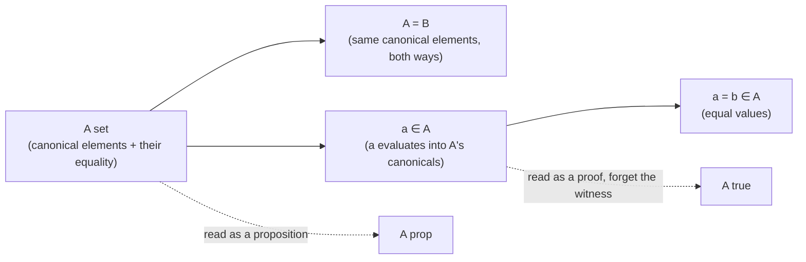
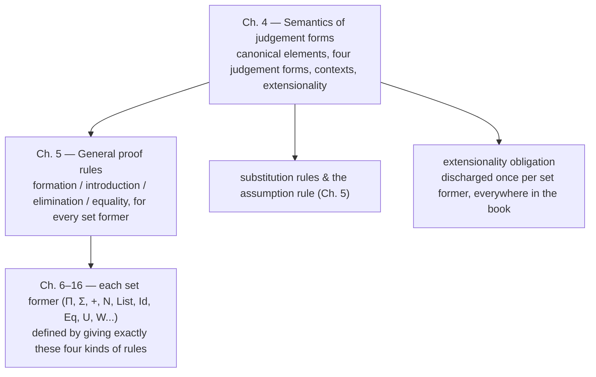

[[book-guidelines|↩ Back to guidelines]]

# The Semantics of Judgement Forms

## Why meaning comes before rules

Chapter 3 gave you a purely syntactic apparatus — application, abstraction, combination, selection, arities — for writing expressions down and mechanically deciding whether two of them are the same expression (definitional [[Propositions-as-Sets-(The-Curry-Howard-Correspondence)#Equality|equality]], $\equiv$). None of that machinery says anything about *sets*, *types*, or *truth*. That's deliberate. The authors want the entire proof-theoretic superstructure of the book — every formation, introduction, elimination and equality rule from Chapter 5 onward — to rest on a semantics that is stated exactly once, here, and never quietly presupposed anywhere else.

The stakes are higher than the page count suggests. It would be easy to write "$A\ set$" and lean on the reader's background notion of set from ZFC, or on "type" from whatever language they last used. ==The book explicitly refuses that move — it is one of the chapter's own key questions==: 

> *what does it mean, at the semantic level, to know that $A$ is a set — and why does this explanation not presuppose any other mathematical theory?*

The answer is built from something more primitive than sets: **computation**. Every judgement form in this chapter is explained directly in terms of the mechanical process of evaluating a closed expression to a value. That's the whole trick, and it's why this short chapter is the bedrock the rest of the book stands on — including the "[[General-Proof-Rules|General Proof Rules]]" of Chapter 5, which the book explicitly justifies *by appeal back to this semantics*, not by fiat.

This is also, not coincidentally, the chapter that matters most for anyone building a type checker or a proof checker: judgement forms are the shared ancestor of both. A type checker answers "$a\in A$?"; a proof checker answers "is this proof of $A$ valid?" — and in a Curry–Howard system these are *the same question*, asked in the same judgement form. Everything below is written with that correspondence kept explicit, not left as a footnote.

## Canonical and noncanonical expressions

### The problem a "value" has to solve

Before you can say "to know $A$ is a set is to know how to form its elements," you need a prior, theory-independent notion of *element as value* — otherwise the definition is circular (sets in terms of elements, elements in terms of... sets). The book supplies this with **canonical expressions**: closed, saturated expressions that represent *values*, in the same sense that `3`, `true`, `cons(1, cons(2, nil))`, and `λx.x` are values in an ordinary programming language, while `3+5`, `if 3=4 then fst(⟨3,4⟩) else snd(⟨3,4⟩)`, and `(λx.x+1)(12+13)` are not — they still have work to do.

Because every primitive constant in the language has an arity of the shape $\alpha_1\otimes\cdots\otimes\alpha_n\to 0$ (Chapter 3's arity discipline is doing real work here), the normal form of any closed saturated expression is always headed by a constant: $c(e_1,\ldots,e_n)$. ==That head constant alone tells you whether the expression is canonical or noncanonical== — the book therefore classifies the *constants themselves* into canonical and noncanonical ones, and attaches a computation rule to every noncanonical constant.

### Evaluated versus fully evaluated

The evaluation strategy is normal order — "evaluate from without," i.e. lazy: keep reducing the head until it becomes a canonical constant, and stop there, regardless of whether the arguments $e_1,\ldots,e_n$ are themselves reduced. An expression in that state is **evaluated**. `succ(2+3)` is evaluated (head `succ` is canonical) even though `2+3` sitting inside it is not; only when every saturated subpart is *also* evaluated, all the way down, is the expression **fully evaluated**. `succ(2+3)` is evaluated but not fully evaluated; `succ(0)` is both.

This distinction is not pedantry — it's forced by the presence of variable-binding constructs. Consider $\lambda((x)b)$: the subexpression $(x)b$ is *unsaturated* (it still expects an argument for $x$), so it cannot be evaluated any further without one. Trying to reduce inside it "would be like taking a program which expects input and trying to execute it without any input data." Laziness here isn't a performance optimization; it's the only coherent option once abstraction is in the language.

**What breaks without this.** If "value" were defined as "fully normalized expression" instead of "evaluated-at-the-head expression," you'd be unable to even *state* what a canonical element of a function set looks like, because the body under a $\lambda$ is precisely a place evaluation cannot go without an argument. The evaluated/fully-evaluated split is what lets the semantics stay well-defined in the presence of binders.

### Grounding: this is exactly WHNF

This is close to a one-to-one match with weak head normal form (WHNF) reduction in a lazy functional language or a proof-assistant kernel. Lean's kernel reduces terms to WHNF to inspect their head constructor (e.g. when deciding which branch of a `match` or which typeclass instance applies) without gratuitously normalizing arguments it doesn't need — the same "evaluate from without" discipline, for the same reason: some subterms (bodies under binders, in particular) can't be reduced further without more information.

```lean
-- A minimal expression language, just enough to see canonical vs. noncanonical
-- forms and the "evaluate from without" (normal-order) strategy of §4.
inductive Expr where
  | zero
  | succ (n : Expr)
  | add  (a b : Expr)
  | var  (x : String)
  | lam  (x : String) (body : Expr)
  | app  (f a : Expr)

-- Canonical constants: the ones a *value* is allowed to start with.
-- Everything else carries a computation rule instead.
def isCanonical : Expr → Bool
  | .zero   => true
  | .succ _ => true
  | .lam .. => true
  | _       => false

def subst (x : String) (v : Expr) : Expr → Expr
  | .var y      => if y = x then v else .var y
  | .succ n     => .succ (subst x v n)
  | .add a b    => .add (subst x v a) (subst x v b)
  | .lam y body => if y = x then .lam y body else .lam y (subst x v body)
  | .app f a    => .app (subst x v f) (subst x v a)
  | .zero       => .zero

-- Reduce only the head, exactly the normal-order strategy of §4. Note that
-- `whnf (.succ e)` returns immediately without touching `e`: this is
-- "evaluated" but not "fully evaluated" in the book's terminology, matching
-- the book's own succ(2+3) example.
partial def whnf : Expr → Expr
  | .add a b =>
      match whnf a with
      | .zero    => whnf b
      | .succ a' => .succ (.add a' b)
      | a'       => .add a' b          -- neutral: stuck, still noncanonical
  | .app f a =>
      match whnf f with
      | .lam x body => whnf (subst x a body)
      | f'          => .app f' a
  | e => e
```

```rust
// The Rust side of the same split: a *verifier* keeps unevaluated syntax
// (`Term`) and evaluated values (`Value`) as genuinely different types, so
// the type system itself enforces "you may only inspect canonical form."
enum Term {
    Zero,
    Succ(Box<Term>),
    Add(Box<Term>, Box<Term>),
    Var(String),
    Lam(String, Box<Term>),
    App(Box<Term>, Box<Term>),
}

enum Value {
    VZero,
    VSucc(Box<Value>),          // canonical: safe to pattern-match on
    VLam(String, Box<Term>),    // canonical: a closure, body left unevaluated
}
```

```python
# A five-line sketch of the same "reduce the head, stop at a constructor" idea
# — useful where Rust's type-level Term/Value split would be more ceremony
# than the point warrants.
def whnf(e):
    while isinstance(e, tuple) and e[0] in ("add", "app"):
        e = step(e)          # apply e's computation rule once
    return e                 # head is now a canonical constant, or stuck
```

## Categorical judgements about sets and elements

### The four forms, and two readings of them

With "canonical element" pinned down, the book gives its central semantic explanations — judgements made with *no* assumptions (categorical judgements):

> **$A\ set$**: to know that $A$ is a set is to know how to form the canonical elements in the set and under what conditions two canonical elements are equal.

That's it — no appeal to membership in some prior universe of sets. Defining a set is *entirely* the act of specifying (a) a grammar of canonical forms and (b) an equivalence relation on them that respects structure (same shape, and equal parts, forces equal elements).

> **$A=B$**: to know that two sets $A$ and $B$ are equal is to know that a canonical element of $A$ is also a canonical element of $B$ and vice versa, and that this correspondence respects the equality relations on both sides.

> **$a\in A$**: given that $A$ is a set, to know $a\in A$ is to know that $a$, *when evaluated*, yields a canonical element of $A$.

> **$a=b\in A$**: to know that $a$ and $b$ are equal elements of $A$ is to know that they evaluate to equal canonical elements of $A$.

Two more forms fall out for free once you read sets as propositions (the identification from Chapter 2):

> **$A\ prop$** just *is* $A\ set$. **$A\ true$** just *is*: there exists an $a$ with $a\in A$ — except that when asserting truth, you don't write the witness down.



Note the asymmetry that's easy to miss on a first read: $a=b\in A$ is defined *after*, and *in terms of*, $A\ set$ — you need to already know what counts as a canonical element of $A$ before "equal canonical elements of $A$" means anything. The four judgement forms are not four independent primitives; they form a strict dependency chain, and that chain is exactly what a type checker's function signatures end up encoding (you cannot ask "is `a == b` at type `A`" before you can elaborate `A` itself).

**What breaks without this.** If $a\in A$ were defined as "$a$ *is* a canonical element" rather than "$a$ *evaluates to* a canonical element," the judgement would be undecidable-by-construction for anything but literal values — you could never type-check an unevaluated expression like `2+3`, which is precisely the case a real checker faces constantly. Building evaluation into the definition of $\in$ is what makes it apply to *programs*, not just to values.

### Grounding: this is what a checker's `infer`/`check`/`isDefEq` actually compute

| Book's judgement | Checker operation | Lean correspondence |
|---|---|---|
| $A\ set$ | well-formedness / kind check of a type expression | elaborating `A` against `Sort u` |
| $A=B$ | type-level equality check | `isDefEq A B` |
| $a\in A$ | type checking / inference | `check e A` / `infer e` then compare |
| $a=b\in A$ | term-level definitional equality | `isDefEq a b` (at type `A`) |

The correspondence is not superficial. Lean's kernel, when it checks `a : A`, does not merely inspect `a`'s surface syntax — it reduces `a` (and `A`) to WHNF as needed to compare head constructors, exactly the "evaluate, then compare canonical forms" behavior $a\in A$ and $a=b\in A$ specify. `isDefEq` *is* an implementation of "yield equal canonical elements."

```rust
/// The four judgement forms of §4.1, now as the operations a verifier exposes.
/// Every one of them is stated *relative to a context* (§4.2–4.3 below) —
/// the hypothetical generalisation of what's shown here as categorical.
enum Judgement {
    IsSet(Term),               // Γ ⊢ A set
    SetEq(Term, Term),         // Γ ⊢ A = B
    HasType(Term, Term),       // Γ ⊢ a ∈ A
    TermEq(Term, Term, Term),  // Γ ⊢ a = b ∈ A
}

fn check(ctx: &Context, j: &Judgement) -> Result<(), TypeError> {
    match j {
        Judgement::IsSet(a) => check_formation(ctx, a),
        Judgement::SetEq(a, b) => check_set_eq(ctx, a, b),
        // a ∈ A: evaluate a to WHNF, then check its shape against A's
        // canonical-form grammar — literally §4.1.3's definition.
        Judgement::HasType(a, big_a) => {
            let value = whnf(ctx, a)?;
            check_canonical(ctx, &value, big_a)
        }
        Judgement::TermEq(a, b, big_a) => {
            let (va, vb) = (whnf(ctx, a)?, whnf(ctx, b)?);
            check_canonical_eq(ctx, &va, &vb, big_a)
        }
    }
}
```

This is the learning-goals connection worth stating outright: **the four judgement forms are the shared ancestor of "type checker" and "proof checker."** Under propositions-as-sets, `HasType(a, big_a)` *is* "verify that `a` is a proof of proposition `A`" — there's no second code path for proof-checking, because the book never introduced one. A Rust verifier built to check `a ∈ A` for a specification-shaped `A` is, without any extra machinery, already a proof checker for whatever logical statement `A` encodes.

## Hypothetical judgements and contexts

### Why "categorical" isn't enough

Nearly everything you'd actually want to say is stated *under assumptions*: "let $x$ range over $N$," "assume $A$ is true and call the witness $x$," "for $a,b\in A$, the equality set $a=_Ab$ is a set." The book folds both readings of an assumption into one judgement form, because propositions and sets are already identified: $x\in A$ reads simultaneously as a **variable declaration** (the set $x$ ranges over) and as a **logical assumption** (assume $A$ true, with $x$ as the construction witnessing it).

Assumptions chain, and later ones may depend on earlier ones' *values*, not just their types:

$$
x_1\in A_1,\ x_2\in A_2(x_1),\ \ldots,\ x_n\in A_n(x_1,\ldots,x_{n-1})
$$

Such a list is a **context**. This is a telescope in the fully dependent sense — $A_2$ is a *family* indexed by whatever $x_1$ turns out to be, not a fixed set chosen in advance.

![[judgement_telescope.svg]]

### Meaning by induction on context length

The book explains the meaning of a hypothetical judgement by induction on the length of its context. The base case is the categorical judgements of §4.1 (context length $0$, already done). The one-assumption case sets the pattern:

> To know $A(x)\ set\ [x\in C]$ is to know that for an arbitrary $c\in C$, $A(c)\ set$.

"Arbitrary $c\in C$" is doing exactly the job a fresh, opaque variable does in a type checker's implementation of a $\Pi$ or $\lambda$ rule: you don't case on *which* $c$, you check the body once, generically, and that check is required to be valid for every possible instantiation. The $n$-assumption case (§4.3) is the induction step: knowing a judgement under $x_1\in C_1,\ldots,x_n\in C_n(x_1,\ldots,x_{n-1})$ reduces to knowing it, for an arbitrary $c\in C_1$, under the *shorter* context $x_2\in C_2(c),\ldots,x_n\in C_n(c,x_2,\ldots,x_{n-1})$ — peel off the head assumption, substitute, recurse on a context one shorter.

**What breaks without this.** Without an explicit inductive definition over context length, "hypothetical judgement" would have to be taken as a new primitive notion at every context size, disconnected from the categorical case — you'd effectively need a separate semantic explanation for "one assumption," "two assumptions," and so on, with no guarantee they cohere. Defining it by induction instead means a context of length $n$ is understood entirely in terms of contexts of length $n-1$ down to $0$, so the *whole* semantics is generated from the four base clauses of §4.1 plus one uniform induction step.

### Grounding: contexts are the plumbing under substitution and Hoare-triple soundness

```rust
/// A context is a telescope: x1: A1, x2: A2(x1), ... — later types may
/// mention earlier bound variables, exactly x1 ∈ C1, ..., xn ∈ Cn(x1,...,xn-1).
#[derive(Clone, Debug, Default)]
struct Context {
    entries: Vec<(String, Term)>,
}

impl Context {
    /// The "arbitrary c ∈ C" move of §4.2: extend the context with a fresh
    /// variable and its (possibly dependent) type.
    fn extend(&self, name: &str, ty: Term) -> Context {
        let mut ctx = self.clone();
        ctx.entries.push((name.to_string(), ty));
        ctx
    }

    fn lookup(&self, name: &str) -> Option<&Term> {
        self.entries.iter().rev().find(|(n, _)| n == name).map(|(_, t)| t)
    }
}
```

The induction-on-length structure of §4.3 is *literally* how you implement checking a term against a context: recurse down the context, and whenever you cross a binder ($\lambda$, $\Pi$, a `let`), you call `extend` and recurse into the smaller problem. This is precisely the mechanism this project's learning goals flag as load-bearing in two places:

- **Substitution soundness.** "Peel off $x_1\in C_1$, substitute a concrete $c$ for it, recurse" is the semantic justification for every substitution rule the book gives in Chapter 5 (and for `subst` in the Lean snippet above). A checker's substitution lemma — "if $\Gamma, x:A \vdash e:B$ and $\Gamma \vdash a:A$ then $\Gamma \vdash e[x:=a]:B[x:=a]$" — is not an extra fact bolted onto the type system; it's a direct readout of this induction clause.
- **Hoare-triple soundness.** A hypothetical judgement $a(x)\in A(x)\ [x\in C]$ has exactly the shape of a Hoare triple: $C$ is the precondition (what you're allowed to assume about $x$), $A(x)$ is the postcondition/goal, and the judgement's meaning — "holds for *every* instantiation $c\in C$" — is universal quantification over states, the same universal quantification a Hoare-logic soundness proof needs. Building a verifier that checks specifications against contracts is building a machine that checks exactly this judgement form, with $C$ playing the role of the precondition context.

```lean
-- Lean's LocalContext plays the same role: a snoc-list of (name, type) pairs
-- where later types are terms that may mention earlier free variables.
-- A trimmed-down version of the idea, enough to see the correspondence:
structure Entry where
  name : String
  type : Expr

abbrev LContext := List Entry

def extend (Γ : LContext) (name : String) (ty : Expr) : LContext :=
  Γ ++ [{ name := name, type := ty }]
```

Lean's actual elaborator resolves the "type may depend on earlier variables" requirement via de Bruijn indices / free-variable substitution rather than named lookup, but the semantic content — a telescope, checked left to right, each entry's well-formedness assuming only what came before — is exactly §4.2–4.3.

## Extensionality of propositional functions

### The requirement the book insists on, almost in passing

Buried inside the one-assumption clause is a second condition, easy to skim past:

> We must also know that $A(x)$ is **extensional** in the sense that if $b=c\in C$ then $A(b)=A(c)$.

And, symmetrically, for elements: $a(x)\in A(x)\ [x\in C]$ additionally requires that $a(x)$ *itself* be extensional — if $b=c\in C$ then $a(b)=a(c)\in A(c)$. In the $n$-assumption case this generalizes to full congruence: if $a_1=b_1\in C_1,\ a_2=b_2\in C_2(a_1),\ldots$ then $A(a_1,\ldots,a_n)=A(b_1,\ldots,b_n)$, and likewise $a(a_1,\ldots,a_n)=a(b_1,\ldots,b_n)\in A(a_1,\ldots,a_n)$.

### What breaks without it

Suppose $A(x)$ were allowed to be a "propositional function" that told $b$ and $c$ apart *syntactically* even when $b=c\in C$ holds *semantically* — say, $A$ pattern-matches on the literal variable name rather than the value. Then knowing $b=c\in C$ would tell you nothing about the relationship between $A(b)$ and $A(c)$: a term you built at type $A(b)$ would simply not be usable where $A(c)$ was expected, even though $b$ and $c$ are — by the very equality judgement you're allowed to assume — the same element. Substitution would stop being sound: the substitution rules of Chapter 5 (justified directly from this chapter) say that equal inputs may always be swapped for one another under a family; extensionality is exactly the hypothesis that makes that swap meaning-preserving rather than merely syntax-preserving. Without it, "family of sets indexed by $C$" would be too permissive a notion to support the one operation every dependent type theory needs constantly: substituting an equal-but-syntactically-different term into a dependent type and expecting the result to still typecheck.

```rust
// A family that violates extensionality: it distinguishes arguments by their
// *syntactic* identity rather than their *semantic* value. Two variables that
// are provably equal in C can still route to unrelated sets.
fn bad_family(x: &Term) -> Term {
    match x {
        Term::Var(name) if name == "n" => Term::mk_set("EvenPath"),
        Term::Var(name) if name == "m" => Term::mk_set("OddPath"),  // wrong: even if n = m ∈ C
        _ => Term::mk_set("GenericPath"),
    }
}
```

A real verifier can't check extensionality in general — it's a semantic property, and checking it for arbitrary families is exactly as hard as checking arbitrary program equivalence. What the book does instead (and what every later chapter's set-formers do) is *build* extensionality into each set former by construction: every family the book actually introduces ($\Pi(A,B)$, $\Sigma(A,B)$, $Id(A,a,b)$, and so on) is defined by structural recursion over $A$'s canonical elements in a way that automatically respects equality, so [[The-Universe-of-Small-Sets#The proof|the proof]] obligation is discharged once, at the level of the semantics, rather than re-checked at every use site.

### Grounding: this is congruence closure, and it foreshadows Chapter 8

This is the same property Lean's kernel needs from `isDefEq`: definitional equality has to be a *congruence* — respected by every constructor and every function application — or substitution inside the elaborator becomes unsound. It's also the seed of a distinction the book doesn't resolve until Chapter 8: *intensional* equality ($Id$), whose induction principle is comparatively weak, versus *extensional* equality ($Eq$), whose strong elimination rule can prove full functional extensionality but costs decidability of judgemental equality. The extensionality *requirement on families*, demanded here as part of the very meaning of a hypothetical judgement, is a strictly weaker, always-assumed condition — it has to hold for the semantics to make sense at all, well before the book has to choose between $Id$ and $Eq$ for equality *as a set former* in its own right.

For the unification thread specifically: this is where "checking definitional equality" and "respecting congruence under substitution" turn out to be the same obligation. A pattern-unification algorithm that solves $?m\,x_1\ldots x_n \doteq t$ by substitution is only sound because the type family being unified against is assumed extensional in exactly this sense — plug in equal metavariable solutions, get equal (not just similar) results.

## Where this leads



Every rule in the rest of the book — formation, introduction, elimination, equality, for every set former from enumeration sets to well-orderings — is stated as syntax, but its *justification*, chapter after chapter, is a direct appeal back to the meaning explanations of this chapter: "this rule is sound because it respects the canonical-element semantics of §4.1." Chapter 5's general rules (assumption, substitution, the equality rules) are nothing more than this chapter's semantics made mechanically checkable.

For the two standing projects this vault is built around: this chapter *is* the point where "build a type checker" and "build a proof checker" stop being two different projects and become one project read two ways, because the four judgement forms don't distinguish between them — $a\in A$ is simultaneously "does this term have this type" and "is this the proof of this proposition." And the context machinery of §4.2–4.3 is not incidental bookkeeping — it is, quite literally, the substitution lemma and the Hoare-triple-shaped universal quantification that both the Rust verifier and the Lean-style elaborator will need to get right before anything built on top of them (unification, tactics, program derivation) can be trusted.
