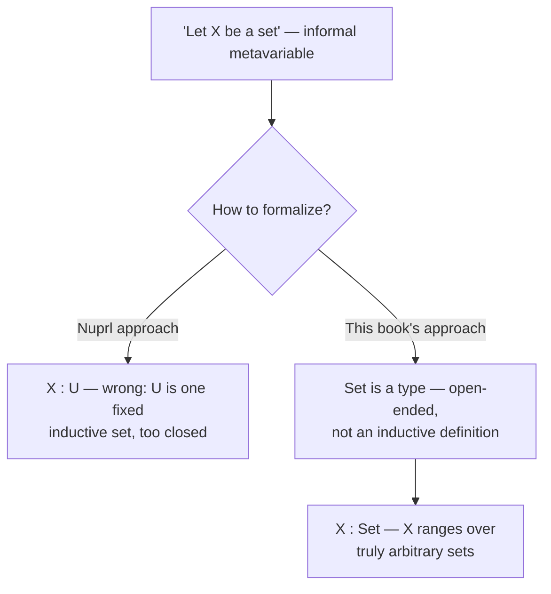

[[book-guidelines|↩ Back to guidelines]]

## The problem: you can't formalize "let $A$ be a set"

Every derivation so far in this book has quietly relied on English sentences like "let $A$ be a set and $B(x)$ a family of sets over $A$." That sentence is doing real work — it's introducing a *metavariable*, a placeholder standing for an arbitrary, not-yet-chosen set — but it is not itself a formal judgment in the system built up through chapter 18. If you tried to implement this book's type theory as a checker, you'd hit this exact wall: your checker needs *some* judgment that means "$A$ ranges over sets," and nothing built so far gives you one.

The obvious fix is the one Nuprl took: translate "let $X$ be a set" into $X : U$, using [[The-Universe-of-Small-Sets|the universe of small sets]] from chapter 14. But this is wrong, and it's wrong in a way that matters. $U$ is not "the collection of all sets" — it's a *specific inductively defined set*, closed under a fixed list of constructors ($\Pi$, $\Sigma$, $+$, $Id$, finite sets, $N$, $List$, and $U$ itself via `urec`). An assumption $X : U$ secretly asserts that $X$ will turn out to be one of *these* things. But the whole point of an assumption is that $X$ is arbitrary — it might later be instantiated with a set nobody has invented yet, or with a set built using $U$ that therefore cannot itself be a *small* set (a large set living outside $U$, on pain of a Russell-style paradox). $U$ is too small and too closed to stand for "an arbitrary set."

What's needed is a notion one level more primitive than "set": the notion of **type**. A type doesn't have to specify its own constructors — it only has to specify what it means to *be* an object of the type and what it means for two objects to be *the same*. That's an open-ended commitment, not a closed inductive definition, and it's exactly permissive enough to let $X : \mathit{Set}$ mean what it should mean.

## Types and objects: extending the judgment forms

A type, informally, is *a collection of objects together with an equivalence relation on those objects* — and knowing a type means knowing (a) what counts as an object of it and (b) when two objects of it count as the same. That second requirement — decidable identity — isn't optional flavor text; it's inherited from the general requirement that every judgment in this book's system be *decidable*, i.e. self-certifying. A judgment "carries its own proof" in the sense that once you're handed a derivation of it, nothing further needs to be checked externally — which is precisely the property a mechanical type checker needs from every judgment it accepts.

The theory of types adds four judgment forms, syntactically parallel to the ones you already know for sets, but one level up:

$$A \; \mathit{type} \qquad a : A \qquad a = b : A \qquad A = B$$

read as "$A$ is a type," "$a$ is an object of type $A$," "$a$ and $b$ are the same object of type $A$," and "$A$ and $B$ are the same type." Two types are identical exactly when an object of one is an object of the other and identical objects of one are identical objects of the other — extensional [[Propositions-as-Sets-(The-Curry-Howard-Correspondence)#Equality|equality]] of types, defined via their objects, exactly mirroring how the book already treats equality of sets.

**What breaks without this.** Without a genuine *type* judgment, "arbitrary set" has nowhere to live except as an informal metavariable outside the calculus — fine for a textbook, fatal for an implementation. A checker built directly from chapters 1–18 has judgment forms for sets, elements, propositions, and truth, but nothing that lets it accept a context entry like `X : Set` and then treat `X` opaquely for the rest of a derivation. `A type` / `a : A` closes that gap.

**Rust.** Think of the type/set distinction as the difference between a `trait` (open — anyone can `impl` it later) and an `enum` (closed — you enumerate every variant up front). $U$ is the `enum`: a fixed, finite list of constructors (`Pi`, `Sigma`, `Sum`, `Id`, ...). $\mathit{Set}$ is the `trait`: "anything satisfying the semantic contract of being a set," with no commitment to which concrete implementations exist. A generic function `fn f<A: IsSet>(x: A)` is the Rust shape of an assumption `X : Set` — `A` ranges over *any* type satisfying the trait, known or not-yet-written.

**Lean.** This is the more load-bearing correspondence for an elaborator, because Lean's own kernel *is* a theory of types in exactly this sense. `A type` is Lean's `A : Sort u` (or `A : Type`); `a : A` is Lean's own typing judgment, unchanged; `A = B` is *definitional* type equality — the same relation `isDefEq` checks when unifying two type expressions during elaboration. The book's extensional "same objects, same identities" criterion for `A = B` is precisely the semantic content that `isDefEq`'s syntactic algorithm (unfolding, reduction, eta) is trying to soundly approximate.

## `Set` and `El`: types of sets, types of elements

The theory of types earns its keep by defining `Set` as a *type* rather than a set:

$$\textbf{Set formation} \qquad \dfrac{}{\mathit{Set}\; \mathit{type}}$$

To know a set $A$ is to know how its canonical elements are formed and when two canonical elements are identical — but critically, this explanation is left **totally open**: nothing enumerates in advance every way a set can be formed, in sharp contrast to $U$, whose canonical elements are codes drawn from one fixed list of operations. `Set` is a type precisely because "collection of sets" cannot be pinned down as an inductive structure without becoming $U$ again.

Given a set $A$ (i.e. $A : \mathit{Set}$), $\mathit{El}(A)$ is the *type whose objects are the elements of $A$*:

$$\textbf{El-formation} \qquad \dfrac{A : \mathit{Set} \qquad A = B : \mathit{Set}}{\mathit{El}(A)\; \mathit{type} \qquad \mathit{El}(A) = \mathit{El}(B)}$$

and the book immediately folds this back into familiar notation via two abbreviations that will be used everywhere from here on:

$$A\;\mathit{set} \;\equiv\; A : \mathit{Set} \qquad\qquad a \in A \;\equiv\; a : \mathit{El}(A)$$

So "$A$ is a set" was, all along, sugar for "$A$ is an object of the type $\mathit{Set}$," and "$a$ is an element of $A$" was sugar for "$a$ is an object of the type $\mathit{El}(A)$." Nothing about chapters 1–18 changes semantically — this is a *re-grounding*, not a redefinition.

**Rust.** `El` is a decoding function from data to types, which Rust's own type system cannot express directly (you can't index into `Type` at the value level in stable Rust) — the closest honest analogy is a `trait Set { type Elem; }` associated-type projection: given a set-as-trait-object `A`, `El(A)` is `A::Elem`. The gap between "Rust can't really do this" and "the book does it as a first-class operation" is worth sitting with: it's exactly the gap that makes dependently-typed kernels categorically more expressive than Rust's trait system.

**Lean.** This is the closer and more useful match. `Set : Type` paired with `El : Set → Type` is *literally* Lean's own two-level (or n-level) universe structure: a term of type `Type` that gets *decoded* into an actual `Type` via something like a `CoeSort` instance or an inductive-family decoding function. If you've seen `Type u` layered over `Sort u`, or a "universe à la Tarski" encoding (`code : Type` with `decode : code → Type`) in a dependently-typed kernel design, `Set`/`El` is the textbook two-line version of that pattern — and it's the version you'd actually implement first in a from-scratch kernel, because it separates "which codes exist" (governed by `Set`-formation, wide open) from "what a code denotes" (governed by `El`, one function).

## Families of types, contexts, and extensionality

Just as chapter 5 generalized sets to *families of sets* indexed by a context, this theory generalizes types to **families of types** over a context:

$$x_1 : A_1,\, x_2 : A_2,\, \ldots,\, x_n : A_n$$

— a sequence where $A_1$ is a type, $A_2[x_1 := a_1]$ is a type for arbitrary $a_1 : A_1$, and so on, each entry a type only relative to instantiations of the earlier ones. $A\;\mathit{type}\,[x_1 : A_1, \ldots, x_n : A_n]$ then means $A$ instantiates to an actual type under *every* choice of arguments from the preceding types. Crucially, the family must be **extensional in the context**: if $a_i = b_i : A_i[\ldots]$ pointwise for every position, then the substituted types must themselves be equal, $A[x_1{:=}a_1,\ldots] = A[x_1{:=}b_1,\ldots]$. Without this, "same inputs give the same output" — the single property that makes substitution sound at all — would fail, and every downstream substitution rule would be unjustified.

The two rules for `El`-formation shown above are literally an instance of this pattern: they say that $\mathit{El}(X)$ is a family of types over `Set`.

**General rules.** Because identity on a type must be an equivalence relation, and type identity must respect objects, the theory needs — and gets — the same closure properties you'd expect: reflexivity, symmetry, transitivity for both objects and types, plus a *type identity* rule letting you transport membership across equal types ($a : A$, $A = B \Rightarrow a : B$), and substitution rules for types, objects, and identical types/objects under a context. These are not new ideas; they're the chapter-5 [[General-Proof-Rules|general proof rules]], re-stated one level up for `type`/`:` instead of `set`/`∈`.

**What breaks without extensionality.** Drop the extensionality requirement on families and you can no longer prove that two well-typed instantiations of a parameterized type actually agree — which is exactly the property a real type checker needs when it decides whether two applications of the same generic type constructor, instantiated with definitionally-equal arguments, produce the same type. Substitution rules for types are the metatheoretic ancestor of what a checker's environment/substitution machinery does on every single beta-reduction it performs.

## Assumptions: formalizing "let $X$ be a set" for real

This is the payoff. The whole apparatus above exists to license one new inference rule:

$$\textbf{Assumption} \qquad \dfrac{C\;\mathit{type}}{x : C \;\; [x : C]}$$

read: given that $C$ is a type, you may assume an arbitrary object $x$ of type $C$, adding $x : C$ to the context. Instantiate $C := \mathit{Set}$ (justified since $\mathit{Set}\;\mathit{type}$ is an axiom) and you get exactly the formal derivation the introduction was missing:

$$\dfrac{\mathit{Set}\; \mathit{type}}{X : \mathit{Set}\;\; [X : \mathit{Set}]} \qquad\text{i.e.}\qquad X\;\mathit{set}\;\;[X\;\mathit{set}]$$

"Let $X$ be an arbitrary set" is now a genuine one-step derivation, not a sentence outside the calculus. And ordinary set-level assumptions $x \in A$ fall out as a *derived* special case — first derive $\mathit{El}(A)\;\mathit{type}$ from $A\;\mathit{set}$, then apply Assumption to get $x : \mathit{El}(A)\,[x : \mathit{El}(A)]$, which by the `El` abbreviation reads exactly as $x \in A\,[x \in A]$. Chapters 1–18's style of assumption is thus recovered as a theorem about the more general theory, not lost.

**Why this matters for judgment forms as a shared ancestor.** This `Assumption` rule is the metatheoretic core of what *every* type checker's variable-lookup does: extend the context with a fresh binding of known type, and let later judgments cite it. It's also exactly what a proof checker does when it opens a hypothetical/natural-deduction subproof. The book's own text names this explicitly — types let you "use variables ranging over sets and higher order objects" — and that's the same mechanism whether you're reading it as "type-checking a function parameter" or "discharging a hypothesis." If you're building a Rust verifier around Hoare-triple or dependent-subtyping contracts, this rule *is* your context-extension step; get its substitution properties right here and the corresponding step in your verifier inherits soundness for free.

## Function types: the last piece needed for real signatures

"Let $A$ be a set and $B(x)$ a family of sets over $A$" still isn't fully formal without one more type: the **function type**. If $A$ is a type and $B$ is a family of types for $x : A$, then $(x:A)B$ is the type of functions from $A$ to $B(x)$:

$$\textbf{Fun formation} \qquad \dfrac{A\;\mathit{type} \qquad B\;\mathit{type}\,[x:A]}{(x:A)B\;\mathit{type}}$$

with application and abstraction rules that should look immediately familiar if you've written a typed lambda calculus:

$$\textbf{Application}\quad \dfrac{c : (x:A)B \qquad a : A}{c(a) : B[x:=a]} \qquad\qquad \textbf{Abstraction}\quad \dfrac{b : B\,[x:A]}{(x)b : (x:A)B}$$

and the standard equational theory — $\beta$ (an abstraction applied to an argument reduces by substitution), $\xi$ (congruence under abstraction), $\alpha$ (bound-variable renaming), and $\eta$ (an object of function type equals its own abstracted application) — stated exactly as you'd expect from any typed lambda calculus:

$$\beta:\; ((x)b)(a) = b[x:=a] : B[x:=a] \qquad\qquad \eta:\; (x)(c(x)) = c : (x:A)B$$

With function types in hand, "let $A$ be a set and $B(x)$ a family of sets over $A$" becomes a four-line formal derivation: assume $X : \mathit{Set}$, derive $\mathit{El}(X)\;\mathit{type}$, form the function type $(x:\mathit{El}(X))\mathit{Set}$, and assume $Y : (x:\mathit{El}(X))\mathit{Set}$ — at which point $Y(x)\;\mathit{set}\,[X\;\mathit{set},\, Y(x)\;\mathit{set}\,[x \in X],\, x \in X]$ reads exactly like the English sentence you started with, except now it's a judgment a checker can accept.

**Rust.** `(x:A)B` when `B` doesn't depend on `x` is just a Rust function type `A -> B` (the book gives this the same shorthand: $(A)B \equiv (x:A)B$). When `B` *does* depend on `x`, Rust has no direct equivalent — this is a genuinely dependent function type, closer to a GAT (generic associated type) return-type-depends-on-input pattern than to anything `fn` can express natively, which is a real and instructive limitation to notice, not paper over.

**Lean.** `(x : A) → B x` is Lean's dependent function type verbatim, and $\beta$/$\eta$ here are exactly Lean's own reduction rules — `((x)b)(a) = b[x:=a]` is definitional beta-reduction as performed inside `whnf`/`isDefEq`, and the $\eta$ rule is the same eta-expansion check Lean's kernel performs when comparing a function against its own eta-expanded form. If you're modeling an elaborator's bidirectional algorithm, `Fun formation` is the *checking*-mode rule for `Π`-types, `Application` is *inference* mode (given a function's type and an argument, infer the result type), and `Abstraction` requires switching back to *checking* mode against an expected `(x:A)B` — this three-rule cluster is precisely where bidirectional typing's mode-switching shows up first in this book's development.

## Chapter 20: cashing types out as a *monomorphic* set theory

Chapters 1–18 gave a **polymorphic** presentation: `apply` takes two arguments — a function and an argument — because the ambient set-formation machinery already tracks which sets are involved. Chapter 20 uses the theory of types to give an alternative, **monomorphic** presentation, where every constant is declared with a fully explicit type built from `Set`, `El`, and function types, and therefore has to *carry its own set arguments*. `apply` becomes a four-argument, curried, prefix constant:

$$\mathit{apply} : (X : \mathit{Set},\, Y : (\mathit{El}(X))\mathit{Set},\, \mathit{El}(\Pi(X,Y)),\, x : \mathit{El}(X))\; \mathit{El}(Y(x))$$

alongside constants for every set former the book has built so far — $\Pi/\lambda/\mathit{apply}$, $\Sigma/\mathit{pair}/\mathit{split}$, $+/\mathit{inl}/\mathit{inr}/\mathit{when}$, $\mathit{Id}/\mathit{id}/\mathit{idpeel}$, finite sets, $N/0/\mathit{succ}/\mathit{natrec}$, $\mathit{List}/\mathit{nil}/\mathit{cons}/\mathit{listrec}$ — each with its equality asserted as an equation between explicitly-typed terms, e.g.

$$\mathit{apply}(A,B,\lambda(A,B,b),a) = b(a) : \mathit{El}(B(a))$$

**The tradeoff, stated precisely.** Monomorphic judgments are *self-certifying* in a stronger sense than polymorphic ones: given a monomorphic judgment, you can reconstruct its entire derivation, because every constant already carries the sets it operates over. The book is explicit that this is the payoff. The cost is that terms now carry a lot of information that is computationally irrelevant — `apply(A, B, f, a)` recomputes and re-transports `A` and `B` at every call site even though they don't affect *what number comes out*.

There is a formal bridge between the two theories: a **stripping function** that erases the explicit set arguments from a monomorphic derivation, turning it into a polymorphic one — by induction on derivation length, this always produces a *valid* polymorphic derivation, because each monomorphic rule strips down to a polymorphic rule. But the map is not a correspondence in the other direction: Salvesen's result (cited but not reproduced in the text) shows there exist derivable polymorphic judgments that arise from *no* monomorphic derivation via stripping. Monomorphic type theory is strictly more informative, not merely a relabeling.

One casualty is worth flagging by name: the book notes that if you tried to add the *extensional* equality set $\mathit{Eq}$ from chapter 8 as a monomorphic constant the same way, you would lose the ability to derive the strong $\mathit{Eq}$-elimination rule — extensional equality's strength depends on machinery that doesn't survive being pinned down as an explicitly-typed constant. Not every construction in the polymorphic theory has a monomorphic shadow.

**Rust / Lean, together.** The polymorphic-vs-monomorphic split is a direct analogue of *implicit vs. explicit* arguments in a real system. Lean's own `apply`-equivalent — function application in the kernel — is fully monomorphic in exactly this book's sense: every application carries its complete, explicit, elaborated type information; there is no ambiguity left once elaboration finishes. What Lean's *surface* language gives you is the reverse of stripping: implicit-argument *elaboration* is the process of reconstructing the erased monomorphic arguments (the `A`, `B`, `X`, `Y`'s above) from a polymorphic-looking user-facing term, via unification against expected types — precisely the "meta-programming elaborator that resolves implicit arguments via metavariable unification" problem this book's monomorphic/polymorphic distinction is silently modeling one layer down. If you build that elaborator, its metavariable-solving pass is, in this chapter's vocabulary, running stripping *in reverse*: taking a polymorphic-shaped term and reconstructing enough monomorphic detail (which the kernel needs) to type-check it, subject to Salvesen's warning that this reconstruction is not guaranteed to always be possible from the polymorphic shape alone.

## Where this leads

This chapter's stated payoff for the rest of the book is more elegant elimination rules for $\Pi$-sets and well-orderings, phrased using function types and quantification over the type of all propositions/functions rather than the more ad hoc formulations chapters 7 and 15 had to use. `Set`/`El` also becomes the vocabulary chapter 18's subset theory reaches for when it needs a *universe of subsets* (`U` and `P` as monomorphic-style types reflecting the propositional and set-forming vocabulary), and the type-theoretic framing here is what later lets the book treat "type theory as a logical framework" for formalizing other logics.

For the standing project: the `Assumption` rule and the extensionality requirement on families of types are the direct ancestor of context management and variable binding in any type checker or proof checker you build — this is the chapter to come back to when soundness of substitution under a growing context needs re-justifying from first principles. The `Set`/`El` decoding pattern is the minimal working example of a universe-à-la-Tarski design, worth keeping as the reference shape before reaching for Lean's actual (much larger) universe hierarchy. And the polymorphic/monomorphic split in chapter 20 is, as far as this book goes, the clearest statement of exactly what an elaborator's implicit-argument reconstruction is *for*: recovering monomorphic, checker-ready terms from polymorphic, human-ready ones — with Salvesen's theorem as an early warning that this recovery is not always achievable by mechanical means alone.
