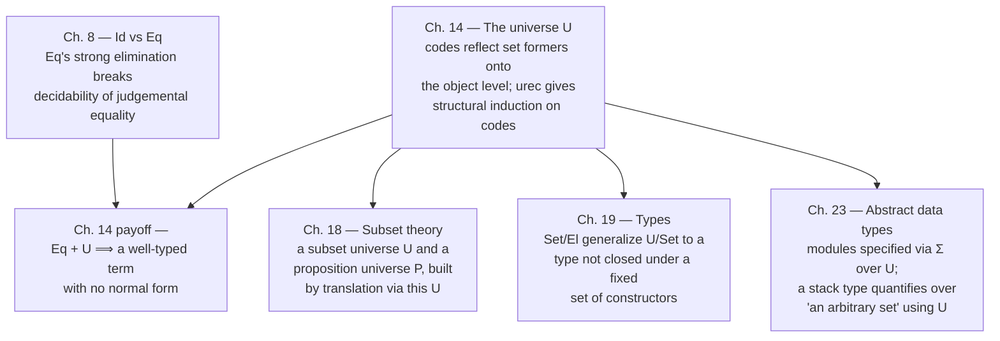

# The Universe of Small Sets

[[book-guidelines|↩ Back to guidelines]]

## The problem: sets have no name

Every set former up to this point — $\Pi$, $\Sigma$, $+$, $Id$, $N$, $List$ — lives at exactly one level: it takes sets and elements as arguments and produces a *new set*. That's a closed, well-behaved story as long as you only ever build sets out of other sets you already have lying around syntactically. But three ordinary things you'd want to do break that story immediately.

**First:** you sometimes want to *compute* which set you're building. Take the SASL tautology-checker (the book's own example, worked below): a function `taut` that checks whether an $n$-argument boolean expression is a tautology needs, for each $n$, an input of a *different type* — $Bool\to Bool$ when $n=1$, $Bool\to Bool\to Bool\to Bool$ when $n=3$, and so on, with $n$ itself a run-time natural number the function receives as an argument. The type of the second argument depends on the *value* of the first. There is no primitive way, with the set formers seen so far, to write "the set you get by recursing $n$ times on $Bool\to(-)$" — recursion produces elements of sets, not sets themselves, because nothing in the theory *is* a set-valued recursive function.

**Second:** you want to prove $0 \neq_N succ(n)$ — Peano's fourth axiom — for an arbitrary $n$. This looks like it should be trivial (zero and successor are different constructors of $N$!), but it turns out, remarkably, that no proof of this fact exists anywhere in the theory built so far. The proof genuinely requires new machinery, and this chapter shows exactly why, with an impossibility argument worth taking seriously rather than on faith.

**Third**, and this one only becomes fully explicit three chapters later (Chapter 19): once you want to formalize a schematic assumption like "let $X$ be an arbitrary set," you need $X$ to range over *something* — some object-level name for "the sets." Chapter 14's universe is not yet the full answer to that (it turns out to need strengthening — see the closing synthesis), but it's the first time the book gives "the collection of sets" a name you can compute with at all, and that impulse — *sets need to be objects too, not just an ambient background category the theory silently assumes* — starts here.

The fix, in one sentence: build a set $U$ whose elements are *codes* — one code for each way of building a set out of the formers you already have — together with a decoding function $Set$ that turns a code back into the actual set it names. This is called **reflecting the set structure onto the object level**, and it is precisely what a "universe" means in type theory from this point on.

## Coding sets as elements of the universe

### The idea, before the symbols

Think of $U$ as a *closed data type of type descriptors*. Every set former you've learned — $\{i_1,\ldots,i_n\}$, $N$, $List$, $Id$, $+$, $\Pi$, $\Sigma$ (and $W$, introduced in the next chapter) — gets a corresponding *constructor* of $U$ that packages up exactly the data needed to describe an instance of that former: which sub-codes it's built from, and (for the dependent formers) a family of sub-codes indexed by elements of an already-decoded set. An element of $U$ doesn't *contain* a set — it's a piece of syntax, a tag plus its arguments — that names one. The matching decoding family $Set(x)\ set\ [x\in U]$ is what turns the tag back into the real thing: $Set(\hat N)$ isn't a description of $N$, it *is* $N$, judgementally.

The book is explicit that $U$ and $Set$ are defined *simultaneously*: you can't finish describing $U$'s canonical elements without already knowing what $Set$ does to the sub-codes they contain (a code for $\Pi(A,B)$ needs a *family of codes* $B(x)\ [x\in Set(A)]$ — indexed by elements of the set $A$ *decodes to*, not by elements of $U$ itself), and you can't define $Set$ without $U$'s constructors already fixed. This mutual, interleaved definition — a data type and a function *into types* defined together, each depending on the other — is a real and named phenomenon called **induction-recursion**, and it is worth flagging immediately because it resurfaces below when grounding this in Lean.

Following the book's own convention, a code is written with a hat over the former it names — $\hat N$, $\widehat{List}(A)$, $\widehat{Id}(A,a,b)$, $A\,\widehat+\,B$, $\widehat\Pi(A,B)$, $\widehat\Sigma(A,B)$ — to keep "the code for $N$" typographically distinct from "$N$ itself," even though $Set$ will immediately identify them.

### The eight U-introduction / Set-introduction pairs

$U$ itself is a primitive constant of arity $\mathbf 0$, and each set former gets a primitive constant *code-builder* of the arity you'd expect for taking codes-and-decoded-elements instead of sets-and-elements. Every rule below comes in a pair: **U-introduction** says the code is a well-formed element of $U$; **Set-introduction** says what it decodes to.

$$\textbf{U–formation}\qquad \dfrac{}{U\ set}$$

**1. Enumeration sets.**
$$\textbf{U–intro 1}\quad \dfrac{}{\widehat{\{i_1,\ldots,i_n\}}\in U} \qquad\qquad \textbf{Set–intro 1}\quad Set(\widehat{\{i_1,\ldots,i_n\}}) = \{i_1,\ldots,i_n\}$$

**2. Natural numbers.**
$$\textbf{U–intro 2}\quad \dfrac{}{\hat N\in U} \qquad\qquad \textbf{Set–intro 2}\quad Set(\hat N) = N$$

**3. Lists.**
$$\textbf{U–intro 3}\quad \dfrac{A\in U}{\widehat{List}(A)\in U} \qquad\qquad \textbf{Set–intro 3}\quad \dfrac{A\in U}{Set(\widehat{List}(A)) = List(Set(A))}$$

**4. [[Propositions-as-Sets-(The-Curry-Howard-Correspondence)#Equality|Equality]] sets.** ($a$ and $b$ here are already-decoded *elements*, not codes — this is the first constructor whose argument types mention $Set$.)
$$\textbf{U–intro 4}\quad \dfrac{A\in U\quad a\in Set(A)\quad b\in Set(A)}{\widehat{Id}(A,a,b)\in U} \qquad \textbf{Set–intro 4}\quad \dfrac{A\in U\ \ a\in Set(A)\ \ b\in Set(A)}{Set(\widehat{Id}(A,a,b)) = Id(Set(A),a,b)}$$

**5. Disjoint union.**
$$\textbf{U–intro 5}\quad \dfrac{A\in U\quad B\in U}{A\,\widehat+\,B\in U} \qquad\qquad \textbf{Set–intro 5}\quad \dfrac{A\in U\quad B\in U}{Set(A\,\widehat+\,B) = Set(A)+Set(B)}$$

**6. Cartesian product of a family ($\Pi$).** Here is the genuinely dependent case: $B$ is a *family of codes*, indexed by elements of the set $A$ decodes to.
$$\textbf{U–intro 6}\quad \dfrac{A\in U\quad B(x)\in U\ [x\in Set(A)]}{\widehat\Pi(A,B)\in U} \qquad \textbf{Set–intro 6}\quad Set(\widehat\Pi(A,B)) = \Pi(Set(A),(x)Set(B(x)))$$

**7. [[Disjoint-Unions-and-the-Existential-Quantifier#Disjoint union of a family: $\Sigma(A,B)$|Disjoint union of a family]] ($\Sigma$).** Same shape as 6.
$$\textbf{U–intro 7}\quad \dfrac{A\in U\quad B(x)\in U\ [x\in Set(A)]}{\widehat\Sigma(A,B)\in U} \qquad \textbf{Set–intro 7}\quad Set(\widehat\Sigma(A,B)) = \Sigma(Set(A),(x)Set(B(x)))$$

**8. Well-orderings ($W$, previewed here, developed fully in the next chapter).**
$$\textbf{U–intro 8}\quad \dfrac{A\in U\quad B(x)\in U\ [x\in Set(A)]}{\widehat W(A,B)\in U} \qquad \textbf{Set–intro 8}\quad Set(\widehat W(A,B)) = W(Set(A),(x)Set(B(x)))$$

And the formation rules for $Set$ itself, justified directly by how the canonical elements of $U$ and their equality were defined:
$$\textbf{Set–formation 1}\quad \dfrac{A\in U}{Set(A)\ set} \qquad\qquad \textbf{Set–formation 2}\quad \dfrac{A=B\in U}{Set(A)=Set(B)}$$

The book immediately notes a notational economy it will now lean on: since $Set$ faithfully identifies a code with the set it names, from here on the book (and this article) will often write, say, $N$ where strictly $\hat N$ is meant, or $natrec(n,Bool,(x,Y)Bool\to Y)$ where strictly a hatted, coded version is meant — context always disambiguates.

### The direct correspondence: this is Dybjer's $U$/$El$, discovered here first

If you've seen a "universe of codes" before, it was probably in Agda, credited to Peter Dybjer's formal schema for **induction-recursion**. That schema's canonical motivating example is *exactly this construction* — a closed inductive family of codes ($U$) defined simultaneously with a decoding function into actual types ($El$, this book's $Set$). Martin-Löf's 1980s presentation of this chapter's universe is the historical ancestor of the schema; the correspondence isn't an analogy bolted on after the fact, it's the same idea, independently arrived at as a *foundational* device here and later formalized as a *general* one.

The literal host for this pattern is Agda, which has primitive support for genuine induction-recursion:

```agda
mutual
  data U : Set where
    empty  : U
    unit   : U
    nat    : U
    list   : U → U
    id     : (A : U) → El A → El A → U
    plus   : U → U → U
    pi     : (A : U) → (El A → U) → U
    sigma  : (A : U) → (El A → U) → U

  El : U → Set
  El empty      = ⊥
  El unit       = ⊤
  El nat        = ℕ
  El (list A)   = List (El A)
  El (id A a b) = a ≡ b
  El (plus A B) = El A ⊎ El B
  El (pi A B)   = (x : El A) → El (B x)
  El (sigma A B)= Σ (El A) (λ x → El (B x))
```

`U` is this chapter's $U$; `El` is $Set$; `id`, `pi`, and `sigma`'s argument types (`El A → U`, or `El A` itself) are exactly the reason this can't be split into two sequential definitions — `El` has to already exist, in some sense, while `U` is still being built.

**The honest gap: Lean can't write this as one declaration.** Lean's kernel — like Coq's — does not support arbitrary induction-recursion; that's a deliberate Agda-only feature. The *non-dependent* fragment of $U$ (codes 1, 2, 3, 5 — no code's own argument types mention `El`/`Set`) is unproblematic and translates directly as two ordinary, sequential Lean declarations:

```lean
inductive Code : Type
  | empty : Code
  | unit  : Code
  | nat   : Code
  | list  : Code → Code
  | sum   : Code → Code → Code

def decode : Code → Type
  | .empty   => Empty
  | .unit    => Unit
  | .nat     => Nat
  | .list A  => List (decode A)
  | .sum A B => decode A ⊕ decode B
```

But the moment you add $\widehat{Id}$, $\widehat\Pi$, or $\widehat\Sigma$, Lean's `inductive` command rejects the definition outright: `id : (A : Code) → decode A → decode A → Code` needs `decode` to exist while `Code` is still being declared, and `decode` can't exist yet, because it pattern-matches on `Code`. This is not a syntax quibble — it is the precise moment where this chapter's construction stops being expressible as plain data in Lean.

**What Lean does instead: the cumulative `Type u` hierarchy.** Rather than reify "the sets" as a closed piece of data you pattern-match over, Lean makes `Type` itself, at every universe *level*, play the role $Set(x)$ plays here — and a universe *variable* `u`, resolved by the elaborator's unifier, plays the role this chapter's single, fixed $U$ plays:

```lean
universe u v

-- a genuinely universe-polymorphic "code" — works at every level u at once,
-- with no urec, no pattern-match on a closed set of constructors:
def IdU {A : Type u} (a b : A) : Type u := a = b

#check (Type u : Type (u + 1))            -- each level is classified one level up
#check ((A : Type u) → (B : A → Type v) → Type (max u v))   -- Π, at arbitrary levels
```

This is exactly the difference the task of building an elaborator has to reckon with, and it's worth stating precisely because it is a genuine, structural difference, not just cosmetic:

- **This book's $U$ is a single, bounded, closed universe.** There is no rule making $\hat U \in U$ — deliberately: Chapter 1 already flagged that Martin-Löf's original 1971 formulation *did* allow a set to contain a code for itself ($V \in V$), and Girard's paradox showed that inconsistent. So the book's sets live in exactly two strata: ordinary sets, and $U$, one level above, closed off from itself. Every code you can write is walked by a single, fixed recursor (`urec`, below) — there are exactly nine cases, forever.
- **Lean's `Type u` hierarchy is unbounded and cumulative**: `Type 0 : Type 1 : Type 2 : …`, and, critically, it is *polymorphic* — a single definition like `IdU` above is checked once and instantiated at every level `u` the elaborator needs, rather than needing its own `urec`-style case split for "which level am I at." **This is precisely the concern flagged as load-bearing for the elaborator project**: resolving `u` in a call like `List.map (α := Nat) (β := ?m)` is universe *checking*/*unification*, the direct structural descendant of what `urec`'s branch-selection is doing over this chapter's closed, nine-constructor $U$ — except open-ended rather than closed. A toy elaborator that only ever needs "one level up" can get away with something $U$-shaped; anything that has to support generic, reusable library code (a `List` that works for `Type 0` *and* `Type 1` *and* …) needs the cumulative, polymorphic version, and that jump — from a closed enumerable universe to an open polymorphic hierarchy — is exactly the jump from this chapter to a real dependently-typed elaborator's universe solver.

### Rust: reified tags without a home for `El`

A "closed universe of codes" is a completely natural thing to *represent* in Rust — it's just a tagged tree:

```rust
enum Code {
    Empty,
    Unit,
    Nat,
    List(Box<Code>),
    Sum(Box<Code>, Box<Code>),
    // Id, Pi, and Sigma are the honest problem — see below
}
```

The gap shows up exactly where it showed up in Lean, but sharper, because Rust has no `El`/`Set`-shaped escape hatch at all: Rust's type checker runs at compile time, over syntax, before any `Code` value exists at runtime, so there is no way to write a function `fn decode(c: Code) -> Type` — Rust has no notion of "a type computed from a runtime value" as a first-class thing a downstream `fn` signature could depend on. The best a Rust program can do is pick one *concrete, fixed* runtime representation for "a decoded value of any code" and interpret codes against it dynamically:

```rust
enum Value {
    Unit,
    Nat(u64),
    List(Vec<Value>),
    Sum(Box<Either<Value, Value>>),
    // no `Value` case corresponds to `Empty` — there is no value of it
}

fn well_typed(code: &Code, v: &Value) -> bool {
    match (code, v) {
        (Code::Unit, Value::Unit) => true,
        (Code::Nat, Value::Nat(_)) => true,
        (Code::List(a), Value::List(vs)) => vs.iter().all(|x| well_typed(a, x)),
        (Code::Sum(a, b), Value::Sum(e)) => match e.as_ref() {
            Either::Left(x) => well_typed(a, x),
            Either::Right(y) => well_typed(b, y),
        },
        _ => false,
    }
}
```

`well_typed` is a runtime *checker*, not a compile-time guarantee — `rustc` will happily let you construct a `Value::Nat(3)` next to a `Code::List(..)` and call `well_typed` on the mismatched pair; nothing stops you from building the ill-typed pair in the first place, because Rust's own type system never sees `Code` values as types. This is not a shortcoming to route around — it is the honest shape of the actual problem: **a Rust verifier that wants to check dependently-typed programs cannot lean on `rustc`'s type system to do it, because `rustc`'s type system is exactly as closed and non-reflective as the theory *before* this chapter.** The verifier has to build its own `Code`/`Value`/`well_typed` machinery — its own miniature $U$/$Set$ — and that machinery, not Rust's own `enum`s and generics, is where the real dependent type checking has to live. This chapter is, read as an engineering document, the specification for that machinery's base case.

### Python: the one place dynamic typing genuinely wins

Python's lack of a static type checker means it can, uniquely among the three languages, write `decode` as a literal, direct, first-class function returning an actual runtime type object — no representation trick needed:

```python
def decode(code):
    tag, *args = code
    if tag == "empty": return type(None)          # (no inhabitants, informally)
    if tag == "unit":  return type(True)
    if tag == "nat":   return int
    if tag == "list":  return list                 # element-checking done separately
    if tag == "sum":   return (decode(args[0]), decode(args[1]))
```

This is worth pausing on rather than dismissing: Python can do this *because* it defers all type checking to runtime anyway, so "a function from data to a type" is no stranger than any other function. The price is that Python gives you none of the guarantees the whole chapter exists to build toward — nothing here is checked before the program runs, so this is a sketch of the *shape* of decoding, not a load-bearing artifact.

## Worked example: the tautology function

This is the book's own first payoff, and it's a genuinely good one because the type it needs is impossible to state honestly without a universe — not merely inconvenient, *impossible*. The SASL tautology-checker for $n$-variable boolean expressions (curried as $n$-argument functions) is:

$$\begin{aligned} taut\ 0\ f &= f \\ taut\ n\ f &= taut(n-1)\,(f\ true) \mathbin{\text{and}} taut(n-1)\,(f\ false) \end{aligned}$$

Informally its type is $(\Pi n\in N)((Bool\to^n Bool)\to Bool)$ where $Bool\to^n Bool$ means "$n$ nested arrows": $taut\ 0 \in Bool\to Bool$, but $taut\ 3 \in (Bool\to Bool\to Bool\to Bool)\to Bool$ — *the type of the second argument depends on the value of the first*. An untyped language like SASL doesn't notice; a typed language whose type formers can't be computed by a program does — this is precisely the situation the book flags as "perfectly reasonable [code that] cannot be assigned a type" in ordinary type systems.

With $U$, the dependency is expressible directly, because $F$ below is a genuine set-*valued* recursive function, something no earlier chapter's machinery could produce:

$$F(n) \equiv natrec(n,\ Bool,\ (x,Y)Bool\to Y) \qquad\Longrightarrow\qquad F(0)=Bool,\quad F(succ(x))=Bool\to F(x)\ [x\in N]$$

$$\begin{aligned} and(x,y) &\equiv \text{if } x \text{ then } y \text{ else } false \\ taut(n) &\equiv natrec\bigl(n,\ \lambda((f)f),\ (x,y)\lambda((f)and(y\cdot(f\cdot true),\,y\cdot(f\cdot false)))\bigr) \end{aligned}$$

(using the infix $x\cdot y \equiv apply(x,y)$). The proof that $\lambda((n)taut(n)) \in (\Pi n\in N)(F(n)\to Bool)$ is a clean induction on $n$: the base case $\lambda((f)f)\in F(0)\to Bool$ falls straight out of $F(0)=Bool$; the step assumes $y\in F(x)\to Bool$, uses $F(succ(x))=Bool\to F(x)$ to see an assumed $f\in F(succ(x))$ as $f\in Bool\to F(x)$, applies $f$ to both booleans to land back in $F(x)$, and feeds both results to the induction hypothesis $y$. $N$-elimination glues the cases; $\Pi$-introduction closes the proof. Every step is ordinary — the only thing $U$ contributed was making $F$, a *set-valued* function, a legal object to recurse on in the first place.

The Rust parallel is exact and instructive: `fn taut<const N: usize>(f: NestedFn<N>) -> bool` cannot be written for a runtime-determined `n` — Rust's const-generics require the arity to be known at compile time, for exactly the reason `taut`'s naive type is unwritable in a universe-less type theory: the *shape of the type itself* is a function of a *value*, and neither Rust's generics nor pre-universe type theory can compute types from values.

## Worked example: Peano's fourth axiom

### The proof

Now the second motivating example, and the reason a universe is not merely convenient but *necessary*. The goal is an element of
$$Id(N,0,succ(n)) \to \{\}\qquad\text{i.e.}\qquad \neg Id(N,0,succ(n)),$$
for an arbitrary $n\in N$ — a proof, by reductio, that assuming $0=_N succ(n)$ lets you construct an element of the empty set.

Assume $n\in N$ and $x\in Id(N,0,succ(n))$. By $N$-elimination, build a *code*-valued function by primitive recursion on $m$ — the base case codes for the one-element set, the successor case (ignoring the predecessor entirely) codes for the empty set:
$$natrec(m,\ \hat T,\ (y,z)\widehat{\{\}})\in U\ [m\in N]$$
Decode it and name the result:
$$Is\_zero(m) \equiv Set\bigl(natrec(m,\hat T,(y,z)\widehat{\{\}})\bigr)$$
$N$-equality plus Set-formation give the *judgemental* set equalities
$$Is\_zero(0) = Set(\hat T) = T \qquad\qquad Is\_zero(succ(n)) = Set(\widehat{\{\}}) = \{\}$$
Now use $subst$ (the derived substitution rule built purely from $Id$-elimination, [[Equality-Sets|see the Equality Sets article]]) on the assumed $x\in Id(N,0,succ(n))$ together with $tt\in Is\_zero(0)=T$:
$$subst(x,tt)\in Is\_zero(succ(n))$$
which, since $Is\_zero(succ(n))=\{\}$ *as sets*, is by Set-equality just
$$subst(x,tt)\in\{\}.$$
That's the contradiction — an element of the empty set, constructed from the assumption $x$. Discharge it by $\to$-introduction:
$$\lambda((x)\,subst(x,tt)) \in Id(N,0,succ(n))\to\{\}\ [n\in N]$$
and put $peano4 \equiv \lambda((x)subst(x,tt))$. That is a complete, closed proof of Peano's fourth axiom — and notice exactly one thing about it that wasn't available before this chapter: $Is\_zero$, a genuine *set-valued* recursive function, playing the role of a predicate that a classical proof would state as "the property of being $T$ when $m=0$ and $\bot$ otherwise." Nothing else in the derivation is new machinery — it's ordinary $N$-elimination and ordinary $Id$-substitution, applied to a predicate the theory could not previously *write down*.

### Why you can't skip this: the impossibility proof

The book doesn't just assert that a universe is needed — it proves it, citing an argument (Smith, [101]) worth walking through because it's a genuinely elegant piece of metatheory. Define a truth-valued interpretation $\varphi$ on set *expressions*, by recursion on the length of their formation derivation, collapsing every set to whether it's "inhabited-shaped" ($\top$) or "empty-shaped" ($\bot$):

$$\begin{aligned} \varphi(\{\}) &= \bot & \varphi(\{i_1,\ldots,i_n\}) &= \top & \varphi(N) &= \top \\ \varphi(Id(A,a,b)) &= \varphi(A) & \varphi(A+B) &= \varphi(A)\lor\varphi(B) & \varphi\bigl((\Pi x\in A)B(x)\bigr) &= \varphi(A)\to\varphi(B(x)) \\ \varphi\bigl((\Sigma x\in A)B(x)\bigr) &= \varphi(A)\land\varphi(B(x)) & \varphi\bigl((Wx\in A)B(x)\bigr) &= \varphi(A)\land\lnot\varphi(B(x)) & \varphi(\{x\in A\mid B(x)\}) &= \varphi(A)\land\varphi(B(x)) \end{aligned}$$

**Theorem** (soundness of $\varphi$): if $a(x_1,\ldots,x_n)\in A(x_1,\ldots,x_n)$ is derivable in set theory *without* a universe, under hypotheses whose types all interpret to $\top$, then $\varphi(A(x_1,\ldots,x_n))=\top$.

The punchline follows in two short steps. First: for *no* set $A$ and elements $a,b$ can a closed term $t\in\lnot Id(A,a,b)$ be derivable without a universe. Why: deriving $t$ presupposes $Id(A,a,b)\ set$, hence $a\in A$, hence (by the theorem) $\varphi(A)=\top$; but then $\varphi(\lnot Id(A,a,b)) = \varphi(A)\to\varphi(\{\}) = \top\to\bot = \bot$ — contradicting what the theorem requires for $t$ to exist. So $\varphi$ soundly rules out *every* instance of $\neg Id$ being provable at all, universe-free.

Second: suppose, for contradiction, Peano's fourth axiom *were* derivable without a universe, via some closed $s\in(\Pi x\in N)\lnot Id(N,0,succ(x))$. Instantiating at $x=0$ by $\Pi$-elimination gives $apply(s,0)\in\lnot Id(N,0,succ(0))$ — exactly an instance of the form just shown impossible. Contradiction. **Peano's fourth axiom cannot be proved in type theory without a universe, full stop** — this isn't a limitation of the specific proof strategy above, it's a theorem about every possible proof strategy in the universe-free theory.

This is the sharpest, most concrete answer to "why does this chapter exist" the book gives anywhere: without $U$, there is a *specific, named, true statement* — one you'd expect any competent formal system to prove trivially — that is provably out of reach.

## Redesigning $U$ for structural induction

### The problem: unbounded arity

Having $U$ is not yet enough to *compute with* elements of $U$ — you need an elimination rule, a structural induction principle, to write functions by recursion over codes (which is exactly what a real "decode and process" pipeline needs). But look back at U-introduction 1: $\widehat{\{i_1,\ldots,i_n\}}\in U$ is really *infinitely many* different rules, one per $n$, each introducing a code with $n$ distinguishable canonical shapes. A structural induction principle needs to enumerate, once and for all, every way a canonical element of $U$ can arise, and hand you one premise per case. There is no way to write "one premise per case" when the number of cases for *just the enumeration-set constructor* is unbounded. **This is precisely why the enumeration-set formulation of $U$ cannot support an induction principle** — not a technical inconvenience, a structural impossibility, the same shape of problem as trying to write a `match` arm for "every possible finite tuple length."

### The fix: two constructors instead of infinitely many

The remedy is to stop treating $\{i_1,\ldots,i_n\}$ as primitive and build every finite enumeration out of exactly two basic ones — the empty set and the one-element set — combined via disjoint union, which the theory can already eliminate structurally. U-introduction 1 is replaced by two fixed rules:

$$\textbf{U–intro 1a}\quad \dfrac{}{\hat\emptyset\in U},\ \ Set(\hat\emptyset)=\emptyset \qquad\qquad \textbf{U–intro 1b}\quad \dfrac{}{\hat T\in U},\ \ Set(\hat T)=T$$

An enumeration set with $n$ elements is then just $n$ repeated applications of $T+(-)$. Concretely, defining
$$S'(x)\equiv \hat T\,\widehat+\,x \qquad\qquad N'(x) \equiv natrec(x,\ \hat\emptyset,\ (u,v)S'(v))$$
gives a code-valued function where $N'(n)$ decodes to an $n$-element enumeration set: $Set(N'(0))=\emptyset$, $Set(N'(1))=T+\emptyset$ (element $inl(tt)$), $Set(N'(2))=T+(T+\emptyset)$ (elements $inl(tt)$ and $inr(inl(tt))$), and so on — matching, element for element, the enumeration sets $N_k$ used elsewhere in the literature, with the count of `inr`-applications playing the role of the index.

Martin-Löf's cleaner move is to make this pattern itself primitive, as a general binary-tree-shaped successor set former $S$:

$$\textbf{S–formation}\ \dfrac{A\ set}{S(A)\ set} \qquad \textbf{S–introduction}\ \ o\in S(A) \qquad \dfrac{a\in A}{s(a)\in S(A)}$$

$$\textbf{S–elimination}\quad \dfrac{a\in S(A)\quad b\in C(o)\quad c(x)\in C(s(x))\ [x\in A]}{scase(a,b,c)\in C(a)}$$

$$\textbf{S–equality}\quad scase(o,b,c)=b\in C(o) \qquad\qquad scase(s(a),b,c)=c(a)\in C(s(a))$$

$S(A)$ is "$A$, plus one more element" — exactly enough structure to build $T\equiv S(\{\})$ and, by iterating, every finite enumeration, while having only *two* canonical shapes ($o$ and $s(a)$) to case-split on, no matter how large the resulting enumeration is. This is the standard move for taming "arbitrary finite choice" into something a recursor can enumerate — the same idea underlying `Fin n` built as iterated `Option`/`Either` in a typed functional language, or `Peano` naturals themselves. The infinite-arity problem is gone because the *combinator* ($S$, applied repeatedly) has bounded arity, even though the sets it builds don't.

## Structural induction on the universe: `urec`

With enumeration sets reduced to $\hat\emptyset$, $\hat T$, and disjoint union, $U$ now has exactly **nine** canonical shapes — one per set former, no unbounded case — and a genuine structural recursor, `urec`, can be justified. `urec` takes a code and nine handler arguments, one per constructor, and computes by matching the code against each in turn ($a\Rightarrow b$ reads "$a$ evaluates to $b$"):

$$\dfrac{a\Rightarrow\hat\emptyset \quad a_1\Rightarrow b}{urec(a,a_1,\ldots,a_9)\Rightarrow b} \qquad \dfrac{a\Rightarrow\hat T \quad a_2\Rightarrow b}{urec(a,a_1,\ldots,a_9)\Rightarrow b} \qquad \dfrac{a\Rightarrow\hat N \quad a_3\Rightarrow b}{urec(a,a_1,\ldots,a_9)\Rightarrow b}$$

$$\dfrac{a\Rightarrow\widehat{List}(A) \quad a_4(A,\,urec(A,a_1,\ldots,a_9))\Rightarrow b}{urec(a,a_1,\ldots,a_9)\Rightarrow b}$$

$$\dfrac{a\Rightarrow\widehat{Id}(A,c,d) \quad a_5(A,c,d,\,urec(A,a_1,\ldots,a_9))\Rightarrow b}{urec(a,a_1,\ldots,a_9)\Rightarrow b}$$

$$\dfrac{a\Rightarrow A\,\widehat+\,B \quad a_6(A,B,\,urec(A,\ldots),\,urec(B,\ldots))\Rightarrow b}{urec(a,a_1,\ldots,a_9)\Rightarrow b}$$

$$\dfrac{a\Rightarrow\widehat\Pi(A,B) \quad a_7(A,B,\,urec(A,\ldots),\,(w)urec(B(w),\ldots))\Rightarrow b}{urec(a,a_1,\ldots,a_9)\Rightarrow b}$$

and symmetrically for $\widehat\Sigma$ (with $a_8$) and $\widehat W$ (with $a_9$). The shape to notice: for the *non-dependent* recursive cases ($List$, $Id$, $+$), the recursive call is just `urec` applied to the sub-code(s). For the three dependent formers ($\Pi$, $\Sigma$, $W$), the recursive call on the family argument $B$ has to happen *under a binder*, $(w)urec(B(w),\ldots)$ — you're recursing on a code-valued *function*, one call per point $w$ in the (already-decoded) domain, which is exactly why the book adds the side-condition that $w$ must not occur free in $B$ or any $a_i$: it's a genuinely fresh bound variable, not a value you get to inspect.

This computation rule licenses the elimination rule directly — nine premises, one per constructor, each supplying a proof of the motive $C$ at that constructor's shape, using the *previous* recursive results (the $u$'s below) wherever the constructor is itself recursive:

$$\begin{aligned}
&a\in U,\qquad C(v)\ set\ [v\in U],\\
&a_1\in C(\hat\emptyset),\quad a_2\in C(\hat T),\quad a_3\in C(\hat N),\\
&a_4(x,y)\in C(\widehat{List}(x))\ [x\in U,\ y\in C(x)],\\
&a_5(x,y,z,u)\in C(\widehat{Id}(x,y,z))\ [x\in U,\ y\in Set(x),\ z\in Set(x),\ u\in C(x)],\\
&a_6(x,y,z,u)\in C(x\,\widehat+\,y)\ [x\in U,\ y\in U,\ z\in C(x),\ u\in C(y)],\\
&a_7(x,y,z,u)\in C(\widehat\Pi(x,y))\ [x\in U,\ y(v)\in U\,[v\in Set(x)],\ z\in C(x),\ u(v)\in C(y(v))\,[v\in Set(x)]],\\
&a_8(x,y,z,u)\in C(\widehat\Sigma(x,y))\ [\text{analogous to }a_7],\\
&a_9(x,y,z,u)\in C(\widehat W(x,y))\ [\text{analogous to }a_7]\\
\hline
&urec(a,a_1,\ldots,a_9)\in C(a)
\end{aligned}$$

with nine matching U-equality rules (one shown; the rest follow the same pattern from the corresponding branch of [[Natural-Numbers-and-Lists#The computation rule|the computation rule]] above):

$$\textbf{U–equality 1}\qquad urec(\hat\emptyset,a_1,\ldots,a_9) = a_1 \in C(\hat\emptyset)$$
$$\textbf{U–equality 4}\qquad urec(\widehat{List}(A),a_1,\ldots,a_9) = a_4\bigl(A,\,urec(A,a_1,\ldots,a_9)\bigr) \in C(\widehat{List}(A))$$

`urec` is, in exactly the sense of Chapter 5's general schema, this chapter's elimination selector for $U$ — the same kind of thing `natrec` is for $N$ or `listrec` is for $List$, just with nine cases instead of two and, in three of them, a recursive call under a binder instead of a flat one.

**The Lean connection, made explicit again.** In a Lean development where `Code`/`decode` genuinely exist (the non-dependent fragment shown earlier), `urec` is nothing but the automatically-generated recursor/`match` over `Code`'s five constructors — `Code.rec`. What's genuinely new to notice here is the *scale* of the pattern: a real elaborator's universe-level solver has to do something structurally identical to `urec`'s branch-selection every time it resolves `max u v` against a concrete level or unifies two universe-polymorphic instantiations — walk a small, closed grammar of level *expressions* (`u`, `u+1`, `max u v`, `imax u v`) and combine sub-results recursively. `urec`'s nine-way case split over a closed universe of *set* codes is the direct, small-scale ancestor of the closed grammar an elaborator's level-solver walks over *universe* codes.

## Worked example: a well-typed term without a normal form

This is the chapter's most striking result, and the reason it's placed here rather than in Chapter 8: it needs *both* the universe and extensional equality ($Eq$) at once, and only once both are in hand does the danger become visible. Recall from [[Equality-Sets|the Equality Sets article]] that $Eq(A,a,b)$'s **strong elimination rule** lets you conclude the bare judgement $a=b\in A$ from the mere *existence* of some element of $Eq(A,a,b)$ — no case analysis on that element's shape required. Combine that with $U$, and the universe itself becomes a lever for forcing set equalities that have no business being judgemental.

**Step 1 — any two codes are judgementally equal, from the empty set.** Assume $x\in\{\}$. Since $Eq(U,A,B)$ is a set (for arbitrary $A,B\in U$), $\{\}$-elimination hands you a (trivial, vacuous) element:
$$case_0(x) \in Eq(U,A,B)\ [A\in U,\ B\in U,\ x\in\{\}]$$
Strong Eq-elimination immediately upgrades that mere *existence* to the judgement
$$A = B \in U\ [A\in U,\ B\in U,\ x\in\{\}]$$
and Set-formation 2 carries it across the decoding function:
$$Set(A) = Set(B)\ [A\in U,\ B\in U,\ x\in\{\}] \tag{$\ast$}$$

**Step 2 — pick $A$ and $B$ to be genuinely different sets.** Assume $x\in\{\}$ again, and instantiate $(\ast)$ at $A\equiv\hat N$, $B\equiv \hat N\to\hat N$ (i.e. $\widehat\Pi(\hat N,(\_)\hat N)$):
$$N = N\to N \tag{14.4}$$
*judgementally* — the set of natural numbers and the set of functions on naturals, identified, as sets, under the single hypothesis that you have an element of the empty set. That hypothesis is absurd, of course — but you don't need to discharge it before using the equality it produces; you only need to discharge it before you're done, and the whole point of the construction is what you can build *underneath* that assumption before discharging it.

**Step 3 — exploit the identification to build self-application.** Assume $y\in N$. By (14.4) (an ordinary set-equality substitution), $y\in N\to N$ too — so $y$ can be applied to itself:
$$apply(y,y)\in N \tag{14.7}$$
$\to$-introduction discharges $y$: $\lambda y.apply(y,y)\in N\to N$ — and by (14.4) again, this very function is *also* an element of plain $N$:
$$\lambda y.apply(y,y)\in N \tag{14.9}$$
Now apply (14.8)/(14.9) to *itself*, exactly as (14.4) licenses (an element of $N\to N$ applied to an element of $N$):
$$apply\bigl(\lambda y.apply(y,y),\ \lambda y.apply(y,y)\bigr)\in N$$
and $\to$-introduction over the original assumption $x\in\{\}$ finally gives the whole construction as one closed function:
$$\lambda x.\,apply\bigl(\lambda y.apply(y,y),\ \lambda y.apply(y,y)\bigr) \ \in\ \{\}\to N$$

**The payoff.** The inner expression $apply(\lambda y.apply(y,y),\ \lambda y.apply(y,y))$ is the textbook combinatory-logic self-applying term — $\Omega$, or $(\lambda y.yy)(\lambda y.yy)$ — which reduces to *itself* under $\beta$-reduction, forever. It is a well-typed element of $N$ (the book's own type theory says so, via the derivation above!) whose evaluation, regarded as a reduction sequence, **never terminates and never reaches a canonical form**. This is a genuinely new phenomenon: nothing built from $Id$, $\Pi$, $\Sigma$, $N$, $List$, $+$ alone can ever fail to normalize (that's a real metatheorem about the fragment without $Eq$), but the moment $Eq$'s strong elimination is combined with a universe rich enough to state "$N = N\to N$," normalization is gone.

### What this costs: normalization, decidability, and the Rust verifier

This is exactly the load-bearing consequence the [[Equality-Sets|Equality Sets article]] set up and this chapter cashes in concretely. There, $Id$-only judgemental equality was shown decidable precisely *because* it coincides with ordinary syntactic convertibility — reduce both sides, compare. Admitting $Eq$ broke that by letting arbitrary *propositional provability* leak into judgemental equality. This chapter shows the sharpest possible instance of the damage: not just "equality checking might not terminate," but **the terms themselves stop normalizing**, because the type system now judgementally equates types ($N$ and $N\to N$) that have genuinely different computational content, and that equation is strong enough to reconstruct the untyped $\lambda$-calculus's own non-terminating self-application *inside* a supposedly total, everything-terminates type theory.

For a Rust verifier, this is not a curiosity — it's the concrete failure mode that motivates keeping `is_def_eq` restricted to the `Id`-shaped, structural fragment discussed in the Equality Sets article, stated even more starkly than it was there: it isn't merely that an `Eq`-admitting checker's equality becomes undecidable in the abstract-provability sense; it's that **the very reduction machinery a checker relies on to normalize terms during type checking can be handed a term that runs forever**, produced by nothing more exotic than a hypothesis that happens to be false but hasn't been discharged yet. A checker whose normalizer isn't guaranteed to halt on well-typed input is not a checker — it's a program you have to trust to terminate, on every input, by hope. This is why every production dependently-typed kernel (Lean's, Coq's, Agda's) enforces strong normalization as an invariant of its *definitional*-equality fragment specifically, and pushes anything $Eq$-shaped (in Lean: `Eq`, used only via explicit `rfl`/`▸`/tactics, never silently folded into `isDefEq`) out to the propositional side, exactly as the book's own closing recommendation for this chapter is: use $Eq$ "when possible," never let it leak into the machinery that has to terminate.

## Where this leads



The universe's dependents run in two directions from here. Downward into danger: combined with $Eq$, it produces the non-normalizing term above — the concrete, worked demonstration that admitting extensional equality really does cost you the safety a total type theory promises. Upward into the rest of the book's structure: Chapter 18 builds the subset theory's own universe $U$ and a *separate* universe of propositions $P$ by translating through this chapter's $U$; Chapter 19 recognizes that $U$, being closed and finite-branching, still can't formalize "let $X$ be an arbitrary set" cleanly (an assumption $X:U$ only lets $X$ range over *coded* sets, and nothing prevents wanting to quantify over the type $Set$ itself, or over *types* more general than anything $U$ can code) — motivating the more primitive notion of *type*, with its own decoding family $El$, as $U/Set$'s generalization; and Chapter 23's abstract data type specifications lean directly on $U$ to let a module specification like `STACK` quantify, via $\Pi A\in U$, over an arbitrary element type its stack will hold — the "let $X$ be a set" impulse from this article's opening, finally given a genuinely reusable, parametric home.

For the two standing projects this vault tracks: this chapter *is* the place universe polymorphism and universe checking first become visible as concerns, not later — the elaborator's universe-level unifier is the open, polymorphic descendant of `urec`'s closed, nine-way case split, and any toy elaborator built along the lines of Lean's needs to decide, deliberately, whether it wants this chapter's simplicity (one fixed universe, closed recursor, easy metatheory) or Lean's generality (unbounded cumulative hierarchy, universe variables, a genuine unification problem) — that's a real design fork, not a detail. And for the Rust verifier: the non-normalizing term is the sharpest concrete argument in the whole book for why `is_def_eq` must stay in the decidable, structural, $Id$-shaped fragment — this chapter is where "extensional equality can break termination" stops being a theoretical worry and becomes an explicit, constructed counterexample.
