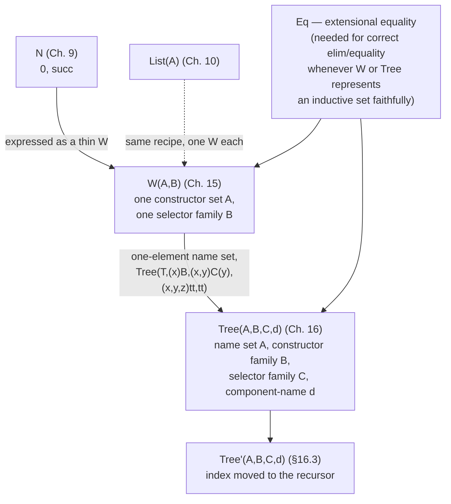

# Well-Orderings and General Trees

[[book-guidelines|↩ Back to guidelines]]

## Why one generic tree-former, instead of one set-former per data type

Every set former the book has introduced so far solves one specific problem. $N$ (Chapter 9) gives you exactly the natural numbers, with $0$ and $succ$ as its only constructors. $List(A)$ (Chapter 10) gives you exactly lists, with $nil$ and $cons$. Each came with its own bespoke formation, introduction, elimination and [[Propositions-as-Sets-(The-Curry-Howard-Correspondence)#Equality|equality]] rules, hard-wired into the calculus. That is fine for a book that only ever needs $N$ and $List(A)$ — but it does not scale. A real programmer using this theory wants to declare *their own* inductively defined types, the way an ML programmer writes

```
datatype BinTree = leaf | node of BinTree * BinTree
```

and gets a new type, for free, with its own constructors and its own structural recursion principle. If every such declaration required the type theory itself to grow a new primitive constant with its own hand-justified elimination rule, the calculus would never be finished — it would need to be re-opened and re-extended every time a user wanted a new shape of tree. That is not a foundation for a programming language; it is an ever-growing pile of special cases, and worse, each new special case would need its own soundness argument before you could trust it.

What Chapter 15 does instead is notice that the *justification* for $N$-elimination and $List$-elimination never actually depended on the specific identities of $0$/$succ$ or $nil$/$cons$. Both arguments had exactly the same shape: canonical elements are built by a constructor applied to some collection of already-built sub-elements; a selector computes by case-splitting on the constructor and recursing on the sub-elements; the whole thing terminates because the constructors can only ever build finite towers, never a value containing itself. That argument pattern is completely generic. It only needs two pieces of information to instantiate it for any specific tree shape:

- **the different ways a tree can be formed** — for $N$ this was "$\{0, succ\}$"; for `BinTree` it is "$\{leaf, node\}$";
- **for each way of forming a tree, which parts it has** — for $N$, $succ$ has one part (the predecessor) and $0$ has none; for `BinTree`, $node$ has two parts (the two subtrees) and $leaf$ has none.

Chapter 15's contribution is a single set constructor, the **well-order** (or *well-founded tree*) constructor $W$, that takes exactly these two pieces of information — as sets, not as syntax — and produces the type of trees they describe. Once $W$ exists as one primitive in the calculus, every finitely-branching inductively defined set the user could want, including $N$ and $List(A)$ themselves, becomes a *derived* definition on top of $W$, with its elimination principle inherited for free rather than re-justified from scratch.

## The well-order set constructor $W(A,B)$

### What the two arguments mean

$W$ takes a **constructor set** $A$ and a **selector family** $B$ over $A$. The elements of $A$ name the different ways to form a tree; for $a \in A$, $B(a)$ names the parts a tree formed in that way has — concretely, $B(a)$ is the index set for that constructor's arguments, and a genuine sub-tree is required for every index in $B(a)$. The formation rule:

$$\textbf{W–formation}\qquad \dfrac{A\ set \qquad B(x)\ set\ [x\in A]}{W(A,B)\ set}$$

The book also writes $W(A,B)$ as $(Wx\in A)B(x)$ — deliberately parallel to $(\Sigma x\in A)B(x)$ and $(\Pi x\in A)B(x)$, because $W$ really is a third member of that same family of "dependent" set formers, one where the dependency runs through a recursive occurrence of the set being defined rather than through an ordinary value.

### Forming a tree: $sup(a,b)$

To build a canonical element you pick $a \in A$ — which constructor — and a function $b$ from $B(a)$ into $W(A,B)$ itself — one sub-tree for every part that constructor needs. The pair is written $sup(a,b)$ ("superior node"):

$$\textbf{W–introduction}\qquad \dfrac{a\in A \qquad b(x)\in W(A,B)\ [x\in B(a)]}{sup(a,b)\in W(A,B)}$$

This rule is the entire definition of a well-founded tree, stated with no reference to any particular shape: *a constructor, plus a family of already-built subtrees indexed by that constructor's parts.* Note there is no separate introduction rule for leaves. The book gets leaf-like constructors for free by an elegant degenerate case: if $B(a)$ is chosen to be the empty set $\{\}$ for some $a$, then a function from $B(a)$ to $W(A,B)$ is a function out of the empty set — and the book already has one of those, via $\{\}$-elimination: $(x)\,case_{\{\}}(x)$, which is vacuously a function into *any* set, $W(A,B)$ included. So $sup(a, case_{\{\}})$ is a perfectly good well-typed leaf, built from the ordinary introduction rule, with no bespoke "leaf" rule needed anywhere in the calculus.

**What breaks without this move.** If $W$ had to special-case $B(a) = \{\}$, the formation and introduction rules would need to branch on whether a constructor is "leaf-like" or "node-like," which is exactly the kind of per-shape special-casing the whole point of $W$ was to eliminate. Reusing $\{\}$-elimination is what keeps [[Natural-Numbers-and-Lists#The rule|the rule]] uniform.

### Using a tree: $wrec$ and the elimination rule

The non-canonical selector for $W(A,B)$ is $wrec$ ("well-order recursion"). Operationally:

1. Evaluate $a$ to canonical form.
2. If the value is $sup(d,e)$, the value of $wrec(a,b)$ is the value of $b(d,\,e,\,(x)\,wrec(e(x),b))$.

Read that middle argument carefully: $b$ receives not just the constructor name $d$ and the sub-tree function $e$, but *also* a function $(x)\,wrec(e(x),b)$ — the already-computed recursive results for every sub-tree, indexed the same way $e$ is. This is precisely $natrec$'s "give me the predecessor and the already-computed result on the predecessor" pattern, generalized from one predecessor to an entire family of them, indexed by $B(a)$. [[Natural-Numbers-and-Lists#The computation rule|The computation rule]] licenses a full structural-induction elimination principle, exactly as it did for $N$ and $List(A)$:

$$\textbf{W–elimination}\qquad \dfrac{\begin{array}{l} a \in W(A,B)\\ C(v)\ set\ [v \in W(A,B)]\\ b(y,z,u) \in C(sup(y,z))\ \big[\,y\in A,\ z(x)\in W(A,B)\ [x\in B(y)],\ u(x)\in C(z(x))\ [x\in B(y)]\,\big] \end{array}}{wrec(a,b) \in C(a)}$$

$$\textbf{W–equality}\qquad wrec(sup(d,e),b) = b(d,e,(x)\,wrec(e(x),b)) \in C(sup(d,e))$$

Compare this to $N$-elimination: there, the induction hypothesis $y \in C(x)$ was a single value, because $succ$ has exactly one part. Here the induction hypothesis $u$ is a whole *function* $B(y) \to \bigcup_x C(z(x))$, because a constructor can have arbitrarily (even infinitely) many parts. $W$-elimination is $N$-elimination and $List$-elimination generalized from "recurse on at most one sub-value" to "recurse on an entire indexed family of sub-values" — which is exactly what letting $B(a)$ be an arbitrary set, rather than $\{\}$ or a fixed finite set, buys you.

## Worked example: `BinTree` as a well-order

Take the ML declaration from the opening section again:

```
datatype BinTree = leaf | node of BinTree * BinTree
```

There are two ways to form a tree, so the constructor set is the enumeration set $A \equiv \{leaf, node\}$. A `leaf` has no parts, so $B(leaf) \equiv \{\}$. A `node` has exactly two parts, so $B(node) \equiv \{left, right\}$. Packaging this as a single family over $A$ (the book must reach for the universe $U$ here, since $B$ has to case-split on which element of $A$ it was given and produce a *set* as its result — "we must use the universe set to construct the family $B$"):

$$BinTree \equiv W\big(\{leaf,node\},\ (x)\,Set(case_{\{leaf,node\}}(x,\ \{\},\ \{left,right\}))\big)$$

Every element of this well-order has one of exactly two shapes:

$$sup(leaf,\ case_{\{\}}) \qquad\qquad sup(node,\ (x)\,case_{\{left,right\}}(x,\ t',\ t''))$$

for some $t', t'' \in W(A,B)$. The book introduces defined constants — using primes, its usual notation for sugar built on top of a $W$-encoding — to make these look exactly like the ML constructors:

$$leaf' \equiv sup(leaf,\ case) \qquad\qquad node'(t',t'') \equiv sup(node,\ (x)\,case(x,t',t''))$$

so that `node(leaf, node(leaf, leaf))` is written, inside the theory, as $node'(leaf',\, node'(leaf',leaf'))$ — syntactically almost identical to the ML value it represents, even though underneath it is a single instance of the one primitive $W$.

**Grounding.** The constructor set $A$ and selector family $B$ are the type theory's way of stating exactly what a Rust `enum` declaration states:

```rust
enum BinTree {
    Leaf,
    Node(Box<BinTree>, Box<BinTree>),
}
```

$A = \{leaf, node\}$ is the set of variant names; $B(leaf) = \{\}$ says `Leaf` carries no recursive fields; $B(node) = \{left, right\}$ says `Node` carries exactly two, indexed by position. The `Box` is doing the same job $sup$'s functional component $b : B(a) \to W(A,B)$ does: it is where the "already built, strictly smaller" subtrees live, and Rust's own well-foundedness check (a `Box<BinTree>` cannot contain itself unboxed) is the same finiteness guarantee that makes $wrec$ total.

Here is a concrete instance of the tree $node'(node'(leaf', leaf'),\, leaf')$ (i.e. `node(node(leaf, leaf), leaf)`), drawn as the nested $sup$-applications it actually is:

<svg viewBox="0 0 620 300" xmlns="http://www.w3.org/2000/svg" role="img" aria-label="A concrete BinTree element built from nested sup applications">
  <defs>
    <marker id="wtreearr" markerWidth="8" markerHeight="8" refX="4" refY="4" orient="auto">
      <path d="M0,0 L8,4 L0,8 Z" fill="#7d8590" />
    </marker>
  </defs>

  <!-- root -->
  <rect x="230" y="10" width="160" height="40" rx="6" fill="none" stroke="#5b8dbe" stroke-width="1.4"/>
  <text x="310" y="35" text-anchor="middle" font-family="ui-monospace, Menlo, monospace" font-size="12" fill="#5b8dbe">sup(node, b)</text>

  <line x1="270" y1="50" x2="150" y2="110" stroke="#7d8590" stroke-width="1.3" marker-end="url(#wtreearr)"/>
  <text x="180" y="80" font-family="sans-serif" font-size="11" fill="#7d8590">b(left)</text>

  <line x1="350" y1="50" x2="480" y2="110" stroke="#7d8590" stroke-width="1.3" marker-end="url(#wtreearr)"/>
  <text x="430" y="80" font-family="sans-serif" font-size="11" fill="#7d8590">b(right)</text>

  <!-- left child: another node -->
  <rect x="70" y="112" width="160" height="40" rx="6" fill="none" stroke="#5b8dbe" stroke-width="1.4"/>
  <text x="150" y="137" text-anchor="middle" font-family="ui-monospace, Menlo, monospace" font-size="12" fill="#5b8dbe">sup(node, b')</text>

  <!-- right child: a leaf -->
  <rect x="420" y="112" width="180" height="40" rx="6" fill="none" stroke="#c98a3e" stroke-width="1.4"/>
  <text x="510" y="137" text-anchor="middle" font-family="ui-monospace, Menlo, monospace" font-size="12" fill="#c98a3e">sup(leaf, case{})</text>

  <line x1="115" y1="152" x2="60" y2="210" stroke="#7d8590" stroke-width="1.3" marker-end="url(#wtreearr)"/>
  <text x="20" y="185" font-family="sans-serif" font-size="11" fill="#7d8590">b'(left)</text>

  <line x1="185" y1="152" x2="240" y2="210" stroke="#7d8590" stroke-width="1.3" marker-end="url(#wtreearr)"/>
  <text x="230" y="185" font-family="sans-serif" font-size="11" fill="#7d8590">b'(right)</text>

  <!-- leaves -->
  <rect x="0" y="212" width="180" height="40" rx="6" fill="none" stroke="#c98a3e" stroke-width="1.4"/>
  <text x="90" y="237" text-anchor="middle" font-family="ui-monospace, Menlo, monospace" font-size="12" fill="#c98a3e">sup(leaf, case{})</text>

  <rect x="180" y="212" width="180" height="40" rx="6" fill="none" stroke="#c98a3e" stroke-width="1.4"/>
  <text x="270" y="237" text-anchor="middle" font-family="ui-monospace, Menlo, monospace" font-size="12" fill="#c98a3e">sup(leaf, case{})</text>

  <text x="310" y="280" text-anchor="middle" font-family="sans-serif" font-size="12" fill="#7d8590">node(node(leaf, leaf), leaf) — every node is one sup application; B(leaf)={} closes the recursion</text>
</svg>

Counting nodes, the book's own $wrec$ example, mirrors an ML definition line for line:

```
fun nrofnodes(leaf)          = 1
|   nrofnodes(node(t',t''))  = nrofnodes(t') + nrofnodes(t'')
```

$$nrofnodes(x) \equiv wrec\big(x,\ (y,z,u)\,case(y,\ 1,\ u(left) \oplus u(right))\big)$$

and its Rust translation is a direct fold over the enum, with `u` above corresponding exactly to the pair of already-computed recursive calls:

```rust
fn nrofnodes(t: &BinTree) -> u32 {
    match t {
        BinTree::Leaf => 1,
        BinTree::Node(l, r) => nrofnodes(l) + nrofnodes(r),
    }
}
```

The book also packages this pattern into a reusable, non-dependent recursion operator on top of $wrec$ (again using a prime, since it is sugar rather than a new primitive):

$$trec'(t,a,b) \equiv wrec\big(t,\ (x,y,z)\,case(x,\ a,\ b(y(left),y(right),z(left),z(right)))\big)$$

with the expected computation rule $trec'(leaf',a,b) = a$ and $trec'(node'(t',t''),a,b) = b(t',t'',trec'(t',a,b),trec'(t'',a,b))$ — exactly the shape of a hand-written `fold` for `BinTree` in any functional language, now derived, not primitive.

## Representing $N$ as a well-order — and why it needs extensional equality

Having built one custom tree type, the book turns the trick around: it re-derives the natural numbers *inside* $W$, showing $N$ was never a genuinely separate primitive concept, just a particularly thin family of trees.

$$N \equiv (Wx\in\{zero,succ\})\,Set(case(x,\{\},T))\qquad 0 \equiv sup(zero,case)\qquad succ(a)\equiv sup(succ,(x)a)$$

$$natrec(a,b,c) \equiv wrec\big(a,\ (y,z,u)\,case(y,\ b,\ c(z(tt),u(tt)))\big)$$

The idea, as the book puts it, is that "the $n$-th natural number [is] represented by a thin tree of height $n$": $zero$ has no parts ($B(zero)=\{\}$, exactly like `leaf`), and $succ$ has exactly *one* part, indexed by the one-element set $T$ ($B(succ)=T$, so its sole subtree lives at $tt$). $N$-formation and both $N$-introduction rules follow immediately from $W$-formation and $W$-introduction, with no new argument needed.

But then the book stops and flags a genuine problem: **$N$-elimination and $N$-equality cannot be proved this way using intensional equality alone.** The reason is subtle and important. An element $sup(a,b)$ carries a *function* $b$ as its second component, and under intensional (judgemental) equality, two functions are equal only if they *convert* to each other — reduce to syntactically identical normal forms. Consider the two functions

$$(x)\,0 \qquad\text{and}\qquad (x)\,1$$

both mapping the empty set into $N$. Both are perfectly good inhabitants of $B(zero) \to W(A,B)$ (vacuously — there are no elements of $\{\}$ to check), and both give $sup(zero,(x)0)$ and $sup(zero,(x)1)$ as elements of the well-order representing $N$. But these two expressions are *not* judgementally equal — they don't reduce to the same normal form — even though they behave identically on every input (there being no inputs). The well-order therefore contains strictly more elements than there are natural numbers: it has "junk," extra $sup$-terms that were never built by $0$ or $succ$ as the book intends them, distinguishable only by an equality that intensional equality is too fine-grained to see past.

This is exactly the $Id$-versus-$Eq$ tension worked out in [[Equality-Sets|Equality Sets]]: $Id(A,a,b)$ only certifies that two elements convert to each other, while $Eq(A,a,b)$'s strong elimination rule lets you establish judgemental equality from mere *propositional* provability — including provability of function equality from pointwise behavior, which is exactly functional extensionality. "With an extensional equality this problem never occurs," the book states flatly: under $Eq$, $(x)0$ and $(x)1$ *are* judgementally interchangeable as functions out of the empty set (vacuously, both satisfy any extensional equality criterion on an empty domain), so the "junk" elements collapse away and the well-order representing $N$ has exactly the elements $N$-introduction says it should. This is not a one-off wrinkle specific to $N$: **any time a well-order (or, as the next section shows, a general tree) is used to represent an inductively defined set faithfully, the correct elimination and equality rules depend on extensional equality holding for the functional components of $sup$/$tree$.** Intensional equality alone is simply too strict to recognize when two encodings denote "the same" tree.

## Representing sets with data: `BinTree` carrying natural numbers

Section 15.1 works one more example to show $W$ scaling to constructors that carry ordinary data alongside recursive structure:

```
datatype BinTree = leaf of N | node of N * BinTree * BinTree
```

Now the *number of ways to form a tree is itself infinite* — every natural number gives a distinct `leaf` and a distinct `node`. The constructor set has to encode "leaf-tagged-with-$n$" and "node-tagged-with-$n$" for every $n \in N$, which is precisely what a disjoint union $N + N$ is for: $inl(n)$ for the leaf case, $inr(n)$ for the node case. The selector family reads the tag off before deciding shape, using $when$:

$$W\Big(N+N,\ (x)\,Set\big(when(x,\ (n)\,\{\},\ (n)\,\{left,right\})\big)\Big)$$

with elements $sup(inl(n), case_{\{\}})$ and $sup(inr(n), (x)\,case(x,t',t''))$, sugared exactly as before:

$$leaf''(n) \equiv sup(inl(n),case) \qquad node''(n,t',t'') \equiv sup(inr(n),(x)\,case(x,t',t''))$$

$$trec''(t,a,b) \equiv wrec\big(t,\ (y,z,u)\,when(y,a,(n)\,b(n,z(left),z(right),u(left),u(right)))\big)$$

and a function summing all the numbers stored in a tree falls straight out as an instance of $trec''$:

$$addnum(x) \equiv trec''(x,\ (n)\,n,\ (n,y,z,u,v)\,n\oplus u\oplus v)$$

The point to take from this example is structural, not just illustrative: the constructor set $A$ never has to be a small finite enumeration. It can be *any* set — here $N+N$ — as long as you can supply a matching selector family. That flexibility is exactly what makes $W$ general enough to represent "most programming languages['] some construction for defining types by inductive definitions," in the book's words — but, as the previous section showed, only correctly once extensional equality is available.

## From binary trees to mutually recursive types: why $W$ isn't enough

`BinTree` is a single inductively defined set. Many real datatype declarations are not: they define *several* sets simultaneously, each one allowed to refer to the others. The book's running example is a classic parity encoding of the naturals:

```
datatype Odd  = sO of Even
and      Even = zeroE | sE of Odd
```

with the corresponding grammar $\langle odd\rangle ::= sO(\langle even\rangle)$, $\langle even\rangle ::= 0_E \mid sE(\langle odd\rangle)$. Try to encode this directly as one well-order $W(A,B)$, the way `BinTree` was encoded, and you immediately hit a mismatch: $W(A,B)$ produces exactly *one* set. But `Odd` and `Even` are two distinct sets, each defined in terms of the other. You could try to cram both into a single well-order — tag every element with which of the two sets it "really" belongs to and case-split throughout — and the book is candid that "it is possible but quite complicated to do this by using well-orders." The difficulty is not superficial: $W$'s selector family $B$ maps a constructor to a set of *parts*, but it has no way to say "and this part, specifically, belongs to the *other* mutually defined set" as opposed to belonging to $W(A,B)$ itself, which is the only set $W$ knows how to talk about. Everything a $sup$-element points at has to be *another element of that same well-order* — there is no room in the formalism for "this branch's subtree lives in the sibling type."

**What's needed instead is a genuine family of sets, indexed by which of the mutually defined types you mean**, with each set's constructors allowed to name *any* member of the family — including itself — as the type of a given part. That is precisely what a "name set" does: instead of one constructor set $A$ describing one set, let $A$ be a set of *names* (here $\{Odd, Even\}$), and let every piece of the specification — which constructors a name has, what parts each constructor needs, and which named set each part draws its value from — be indexed by, and allowed to range freely over, that whole name set. Chapter 16 builds exactly this generalization, and calls it $Tree$.

## $Tree(A,B,C,d)$: the general tree set constructor

### The four pieces, and what each one means

Where $W(A,B)$ needed a constructor set and one selector family, $Tree$ needs four ingredients:

- $A$, the **name set** — one name for each of the mutually defined sets.
- $B(x)$, the **constructor set** for the name $x$ — the different ways to build an element of the set named $x$ (this is now indexed by $x \in A$, since different named sets can have different constructors).
- $C(x,y)$, the **selector family** — for name $x$ and constructor $y \in B(x)$, the index set of parts that constructor's elements have.
- $d(x,y,z)$, the **component set name** — for a part $z \in C(x,y)$ of constructor $y$ of name $x$, *which named set that part's value must belong to*. This is the ingredient $W$ was missing entirely: every part of every constructor now names, explicitly, which member of the mutually-defined family it recurses into.

$$\textbf{Tree–formation}\qquad \dfrac{\begin{array}{l} A\ set\\ B(x)\ set\ [x\in A]\\ C(x,y)\ set\ [x\in A,\ y\in B(x)]\\ d(x,y,z)\in A\ [x\in A,\ y\in B(x),\ z\in C(x,y)]\\ a\in A \end{array}}{Tree(A,B,C,d)(a)\ set}$$

Notice the formation rule produces $Tree(A,B,C,d)(a)$ — a *specific member* of the family, chosen by $a$ — not a single set the way $W(A,B)$ did. $A$, $B$, $C$, $d$ together specify the whole mutually-recursive bundle once; $a$ then selects which of the mutually defined sets you actually want. The book abbreviates $Tree(A,B,C,d)(a)$ as $T(a)$ once $A,B,C,d$ are fixed.

The book gives a second, equally useful reading of the same four pieces, as a context-free grammar: $A$ is the set of non-terminals, $B(x)$ the alternatives (productions) for non-terminal $x$, $C(x,y)$ the positions in the right-hand side of alternative $y$, and $d(x,y,z)$ the non-terminal that position $z$ expands into. A `Tree(A,B,C,d)(a)` for a chosen start symbol $a$ is then literally the set of parse trees for that grammar — which is exactly what a mutually recursive datatype declaration is, read as a grammar with one non-terminal per type.

### Building and consuming a tree

$$\textbf{Tree–introduction}\qquad \dfrac{a\in A \qquad b\in B(a) \qquad c(z)\in T(d(a,b,z))\ [z\in C(a,b)]}{tree(a,b,c)\in T(a)}$$

Read in words: $a$ names which set you're building an element of; $b$ picks a constructor of that named set; $c$ is a function supplying, for every part $z$ that constructor needs, a value from *the correctly named set* $T(d(a,b,z))$ — which may or may not be $T(a)$ itself. This last clause is exactly the extra freedom $W$ lacked: a part can point at any member of the family, not just back at the same set being defined.

The selector $treerec$ computes exactly as $wrec$ does, generalized to carry the name $a$ through the recursion so that $f$ can case-split on which named set it is currently consuming:

1. Evaluate $d$ to canonical form.
2. If the value is $tree(a,b,c)$, the value of $treerec(d,f)$ is the value of $f(a,\,b,\,c,\,(x)\,treerec(c(x),f))$.

$$\textbf{Tree–elimination}\qquad \dfrac{\begin{array}{l} D(x,t)\ set\ [x\in A,\ t\in T(x)]\\ a\in A\\ t\in T(a)\\ f(x,y,z,u)\in D(x,tree(x,y,z))\ \big[x\in A,\ y\in B(x),\ z(v)\in T(d(x,y,v))\ [v\in C(x,y)],\ u(v)\in D(d(x,y,v),z(v))\ [v\in C(x,y)]\big] \end{array}}{treerec(t,f)\in D(a,t)}$$

$$\textbf{Tree–equality}\qquad treerec(tree(a,b,c),f) = f(a,b,c,(x)\,treerec(c(x),f)) \in D(a,tree(a,b,c))$$

The motive $D$ is now indexed by *both* the name $x$ and the tree $t$ — because the property you're proving (or the value you're computing) may legitimately differ across the different mutually defined sets, exactly as `tonat` below needs a different case for `Odd` than for `Even`.

### The fixed-point reading, and how it generalizes $W$

The book gives $Tree$ a second, equational characterization that makes the generalization from $W$ precise. $Tree(A,B,C,d)$ can be read as a solution — for a whole *family* of sets $T$ over $A$ at once — to the equation

$$T \cong (x)\,(\Sigma y\in B(x))(\Pi z\in C(x,y))\,T(d(x,y,z))$$

Unwound for a fixed $a\in A$, this says $T(a) \cong (\Sigma y \in B(a))(\Pi z\in C(a,y))\, T(d(a,y,z))$: an element of $T(a)$ *is* a choice of constructor $y$ together with a dependent function assigning, to every part $z$, an element of whichever named set $d(a,y,z)$ says that part belongs to — which is exactly Tree-introduction, restated as a $\Sigma$-of-$\Pi$. As the book puts it, this can be interpreted as "a possibly infinite collection of ordinary set equations, one for each $a\in A$" — one equation per mutually-defined set, all satisfied simultaneously. Phrased as a least fixed point of a set-valued operator (writing $FIX$ for that fixed point):

$$Tree(A,B,C,d) \cong FIX\big((T)(x)\,(\Sigma y\in B(x))(\Pi z\in C(x,y))\,T(d(x,y,z))\big)$$

Compare this directly against the analogous equation for $W$:

$$W(B,C) \cong FIX\big((X)(\Sigma y\in B)\,C(y)\to X\big)$$

The generalization is exactly one arrow turning into a $\Pi$: $W$'s non-dependent function set $C(y)\to X$ becomes $Tree$'s dependent function set $(\Pi z\in C(x,y))\,T(d(x,y,z))$. That single change is doing two jobs at once — it lets the codomain vary per index $z$ (rather than being the fixed set $X$), and, critically, it lets the codomain be *any member of the family* $T(d(x,y,z))$ rather than only $X$ itself. $W$ is the special case where there is only one set in the family, so every part necessarily points back at that same set and the dependent $\Pi$ collapses into an ordinary $\to$. Section 16.2 makes this precise as a formal theorem, not just an analogy — see below.

## Worked example: `Odd` and `Even` as mutually recursive trees

Instantiate $Tree$ for the running example. Name set, constructor sets, selector family, and component-set-name function:

$$A = \{Odd, Even\} \qquad a = Odd\ \text{(start symbol)}$$

$$B(Odd) = \{sO\} \qquad B(Even) = \{zeroE, sE\}$$

$$C(Odd,sO) = \{predO\} \qquad C(Even,zeroE) = \{\} \qquad C(Even,sE) = \{predE\}$$

$$d(Odd,sO,predO) = Even \qquad d(Even,sE,predE) = Odd$$

$OddNrs \equiv Tree(A,B,C,d)(Odd)$ is the set of odd numbers under this encoding, and $EvenNrs \equiv Tree(A,B,C,d)(Even)$ — obtained by nothing more than choosing a different name for the last argument — is the set of even numbers, built from the *same* $A,B,C,d$. This is worth pausing on: unlike $W$, where changing "which set you want" meant defining an entirely different well-order, here it is a single application of the same four-argument bundle to a different name. That is the direct payoff of making the family, rather than a single set, the primitive notion.

Concretely, the odd number $3$ (i.e. $sO(sE(sO(0_E)))$) and the even number $2$ (i.e. $sE(sO(0_E))$) are represented by:

$$2_E = tree\big(Even,\,sE,\,(x)\,tree(Odd,\,sO,\,(x)\,tree(Even,\,zeroE,\,(x)\,case_{\{\}}(x)))\big) \qquad 3_O = tree(Odd,\,sO,\,(x)\,2_E)$$

and the map from either parity back to ordinary $N$ is a single $treerec$, case-splitting first on the name $x$ (`Odd` vs. `Even`) and then on the constructor $y$:

$$tonat(w) = treerec\Big(w,\ (x,y,z,u)\,case_{\{Odd,Even\}}\big(x,\ succ(u(predO)),\ case_{\{zeroE,sE\}}(y,\ 0,\ succ(u(predE)))\big)\Big)$$

with the elimination rule immediately giving $tonat(w)\in N\ [v\in\{Odd,Even\},\ w\in Tree(A,B,C,d)(v)]$ — one proof obligation, discharged once, that covers *both* mutually defined sets simultaneously, because the motive $D$ was allowed to range over the whole name set.

**Grounding.** This is the book's Odd/Even ML declaration, and the direct Rust translation is a pair of mutually recursive enums — Rust permits this natively, since `enum` definitions in the same crate may refer to each other regardless of declaration order:

```rust
enum Odd {
    S(Box<Even>),
}

enum Even {
    Zero,
    S(Box<Odd>),
}
```

$B(Odd)=\{sO\}$ is "`Odd` has exactly one variant"; $B(Even)=\{zeroE, sE\}$ is "`Even` has two"; $d(Odd,sO,predO)=Even$ is exactly the field type `Box<Even>` inside `Odd::S` — the constructor's field is annotated with *which* of the two mutually recursive types it recurses into, which is precisely what a Rust field's declared type already records for you, and what $d$ has to record explicitly once you're outside a language with a native type system to lean on. `tonat` is a pair of mutually recursive functions, one per named set, matching `treerec`'s case-split on $x$ before case-splitting on $y$:

```rust
fn odd_to_nat(o: &Odd) -> u32 {
    match o {
        Odd::S(e) => 1 + even_to_nat(e),
    }
}

fn even_to_nat(e: &Even) -> u32 {
    match e {
        Even::Zero => 0,
        Even::S(o) => 1 + odd_to_nat(o),
    }
}
```

Lean's `mutual` block is the more literal counterpart, since Lean — like the book — generates a *single* combined recursor across the whole mutual block, exactly mirroring $treerec$ taking the name as an explicit argument rather than generating two unrelated recursors:

```lean
mutual
  inductive Odd where
    | s : Even → Odd
  inductive Even where
    | zero : Even
    | s : Odd → Even
end
```

Lean's elaborator, when it processes this block, builds internally something isomorphic to the book's $A, B, C, d$: a name set (`Odd`, `Even`), a constructor table per name, and a table recording which named type each constructor argument belongs to — then derives a single mutual recursor (`Odd.rec`/`Even.rec`, generated together) whose type is, argument for argument, the Tree-elimination rule above with $D$ ranging over both names. This is not a loose analogy; it is the same construction, because there is no other sound way to justify a recursor for a genuinely mutual family — you need the whole indexed motive $D(x,t)$, not two separately-justified ones, for exactly the reason `tonat` needed one $case_{\{Odd,Even\}}$ split rather than two disconnected function definitions.

## Relation to the well-order set constructor

Section 16.2 makes the "$W$ is a special case of $Tree$" claim from the fixed-point comparison into an actual theorem: pick the name set to be the one-element set $T=\{tt\}$ — a family with only one member, i.e. no genuine mutual recursion at all — and define

$$W(B,C) = Tree\big(T,\ (x)B,\ (x,y)C(y),\ (x,y,z)tt\big) \qquad sup(b,c) = tree(tt,b,c) \qquad wrec(t,f) = treerec\big(t,\ (x,y,z,u)f(y,z,u)\big)$$

With only one name available, $d(x,y,z)$ is forced to always return $tt$ — every part necessarily belongs to the *same* single set, which is exactly $W$'s restriction that every subtree lives in $W(A,B)$ itself. The book then derives $W$-formation, $W$-introduction (shown explicitly), and (by the same method) $W$-elimination and $W$-equality directly from the corresponding $Tree$ rules instantiated at $T$ — confirming formally that nothing was lost by generalizing: every well-order is recovered, verbatim, as the single-name case of a tree family.

**Grounding.** This is the precise formal statement of something that should already feel intuitive: an ordinary, non-mutually-recursive `enum` is just the degenerate case of "a family of mutually recursive enums" where the family happens to have exactly one member. `BinTree` alone was already a `Tree(A,B,C,d)` instance all along — it just never needed the fourth argument $d$ to point anywhere but back at itself, so $W$'s simpler two-argument interface sufficed. A verifier's internal representation should therefore not special-case single-type declarations separately from mutual blocks; both are the *same* data structure, differing only in whether the name set has one element or several.

## $Tree'$: moving the index from the element to the recursor

Section 16.3 introduces a variant, $Tree'$, with element constructor $tree'$ and selector $treerec'$. The formation rule is unchanged; what changes is *where the name $a$ lives*.

$$\textbf{Tree$'$–introduction}\qquad \dfrac{a\in A \qquad b\in B(a) \qquad c(z)\in Tree'(A,B,C,d,d(a,b,z))\ [z\in C(a,b)]}{tree'(b,c)\in Tree'(A,B,C,d,a)}$$

$$\textbf{Tree$'$–elimination}\qquad \dfrac{\begin{array}{l} D(x,t)\ set\ [x\in A,\ t\in Tree'(A,B,C,d,x)]\\ a\in A\\ t\in Tree'(A,B,C,d,a)\\ f(x,y,z,u)\in D(x,tree'(y,z))\ \big[x\in A,\ y\in B(x),\ z(v)\in Tree'(A,B,C,d,d(x,y,v))\ [v\in C(x,y)],\ u(v)\in D(d(x,y,v),z(v))\ [v\in C(x,y)]\big] \end{array}}{treerec'(d,a,t,f)\in D(a,t)}$$

Notice: $tree(a,b,c)$ carried $a$ inside the term itself, so a single constructor $tree$ served the whole family, but that same term could, in principle, misreport which named set it belonged to were it not for the typing discipline. $tree'(b,c)$ drops $a$ from the term entirely — the name is now purely part of *which type* the value inhabits, $Tree'(A,B,C,d,a)$, never something the value carries around at runtime. The price is that there is now no longer one recursor for the whole family; $treerec'$ needs $a$ (or, more precisely, the whole $d$ and $a$) supplied explicitly as an *argument*, since it can no longer read the name off the value being consumed. The book summarizes the trade-off precisely: in the first version, $tree$ is "a family of constructors, one for each $a\in A$" bundled into a single syntactic form; in this variant, there is one constructor for the whole family, but a *family of recursion operators*, one per name.

**Grounding.** This distinction is a familiar one under different names. $Tree$'s style — the value itself carries a runtime tag saying which case it is — is exactly what a Rust `enum` discriminant does, or what a sum-of-products encoding of a GADT looks like before indices are erased. $Tree'$'s style — the *type* already pins down which member of the family you have, so no runtime tag is needed inside the value — is the discipline behind an indexed family in Lean, where `Vector α n` for a specific `n` carries no runtime record of `n` inside its constructors; `n` lives entirely in the type index, checked once at elaboration time, exactly the way $a$ moved from being data inside $tree(a,b,c)$ to being purely the index of the type $Tree'(A,B,C,d,a)$.

## Worked example: the infinite family $Array(A,n)$

Section 16.4.2 makes a point that has no counterpart in ordinary ML: a name set need not be finite. ML's `and`-chained mutual datatype declarations can only ever introduce finitely many types in one block, but the name set $A$ in $Tree(A,B,C,d)$ is an arbitrary set — nothing stops it from being infinite, giving a family with infinitely many members defined all at once by a single finite specification. The book's example is length-indexed arrays. Generalizing ML's datatype syntax to a dependent setting, the intended definition is

$$Array(E,0) \equiv empty \qquad\qquad Array(E,s(n)) \equiv add\ of\ E\times Array(E,n)$$

i.e. a name set indexed by $N$ itself, with one clause selecting an empty-array constructor at $n=0$ and a different clause selecting a cons-like constructor at every successor. Encoded with $Tree'$ (chosen specifically because the length $n$ should live in the type index, not be re-derived from the value):

$$Array(E,n) \equiv Tree'(N,B,C,d)(n)$$

$$B(n) \equiv natrec(n,\ \{nil\},\ (x,y)\,E) \qquad C(n,x) \equiv natrec(n,\ \{\},\ (x,y)\,\{tail\}) \qquad d(n,x,y) \equiv natrec(n,\ case_{\{\}}(y),\ (z,u)\,z)$$

Read $B$ first: at $n=0$, the only available constructor name is $nil$ — an empty array has exactly one shape, no data. At $n=s(m)$, the constructor set becomes $E$ itself: every *element* of $E$ names a distinct way to build a length-$(m{+}1)$ array — "prepend this particular value." $C(n,x)$ says how many parts that constructor has: none at $n=0$ (matching $nil$'s emptiness), and exactly one part, named $tail$, at any successor. $d(n,x,y)$ says that part's type: recursing $n$ down by one each time, it settles on "the array one shorter" — i.e. the `tail` part of an `Array(E, n+1)` is always an `Array(E, n)`. Elements are built with:

$$empty \equiv tree'(nil,\ case_{\{\}}) \qquad\qquad add(e,l) \equiv tree'(e,\ l)$$

**Grounding.** This is exactly Lean's native length-indexed vector type, `Vector α n` (or the classic inductive-family formulation `Vector.cons : α → Vector α n → Vector α (n+1)`), which is precisely a $Tree'$ instance with name set $N$: `Vector.nil : Vector α 0` corresponds to $B(0)=\{nil\}$, and `Vector.cons` at length $s(n)$ corresponds to $B(s(n)) = E$. Rust has no direct equivalent for a family indexed by a *runtime-computed* natural number the way $Array(E,n)$ is — `[T; N]` with a `const N: usize` generic parameter captures only the case where $n$ is known at compile time, which is a real but strictly weaker fragment of what $Tree'$ expresses; a genuinely dependent `Array(E, n)`, where `n` can be an arbitrary runtime value threaded through the type, needs the same machinery Lean's `motive : (n : Nat) → Sort u` provides and Rust's type system, lacking types that depend on values, cannot express natively (the same gap the type-level-defunctionalization workaround in [[Natural-Numbers-and-Lists|Natural Numbers and Lists]] was built to approximate for $natrec$'s dependent motive). This example is the chapter's clearest preview of a genuinely *dependent, indexed* inductive family — one further step beyond the finite, non-indexed mutual families like Odd/Even, foreshadowing exactly the kind of family a dependently-typed verifier's own datatype declarations will eventually need to support.

## Where this leads



$W$ and $Tree$ are not one more set former alongside $N$ and $List(A)$ — they are the *general mechanism those two were always secretly instances of*. $N \equiv (Wx\in\{zero,succ\})\,Set(case(x,\{\},T))$ makes that literal for the natural numbers; $List(A)$ admits the same treatment (constructor set $\{nil,cons\}$, with $cons$'s selector family carrying both a "head" part valued in $A$ and a "tail" part valued in $List(A)$ itself — a single-name $Tree$, i.e. a $W$, exactly as `BinTree` was). Once $Tree(A,B,C,d)$ exists, every finitely-branching inductive definition a language could offer — single or mutually recursive, over a finite or infinite name set — reduces to choosing four pieces of set-theoretic data, with formation, introduction, elimination and equality supplied once and for all, never re-derived per data type.

That is exactly why this pair of chapters is central, not peripheral, to the standing goal of this vault: **a Rust verifier's internal representation of every user-defined inductive datatype — `enum`, mutually recursive `enum` blocks, or an eventual dependently-indexed family — should be, quite literally, an instance of $Tree(A,B,C,d)$.** The name set $A$ is the set of type names in the program; $B(x)$ is the set of constructor names declared for type $x$; $C(x,y)$ is the set of field positions in constructor $y$; and $d(x,y,z)$ is the declared type of field $z$ — which, for a mutually recursive block, may legitimately be any other type name in $A$, including $x$ itself. This is not a metaphor for how a compiler's type-declaration table happens to look; it is the same object, because $Tree$'s four components were derived, in this chapter, from asking exactly the question a datatype-checking compiler pass has to answer: which sets are being defined together, how many ways is each one built, what are the parts, and which of the mutually defined sets does each part belong to. $treerec$'s termination argument — case-split on the constructor, recurse only on strictly smaller parts named by $d$, and appeal to the well-foundedness of the whole family — is the exact generalization, to arbitrarily many mutually recursive types, of the single-type structural-recursion argument built for $natrec$ and $listrec$ in [[Natural-Numbers-and-Lists|Natural Numbers and Lists]]; a termination checker built to accept the general $Tree$ pattern accepts $N$, $List(A)$, and any mutual `enum` block a user declares, with no separate case analysis needed per shape.

Finally, keep the extensionality thread live going forward: both chapters state, without qualification, that representing an inductively defined set faithfully by a well-order or a general tree requires extensional equality on the functional/dependent-functional components of $sup$/$tree$ — the same $Id$-versus-$Eq$ fork worked out in [[Equality-Sets|Equality Sets]]. Every subsequent use of $W$ or $Tree$ to model a real datatype inherits this requirement; it is not a one-time cost paid only for $N$.
