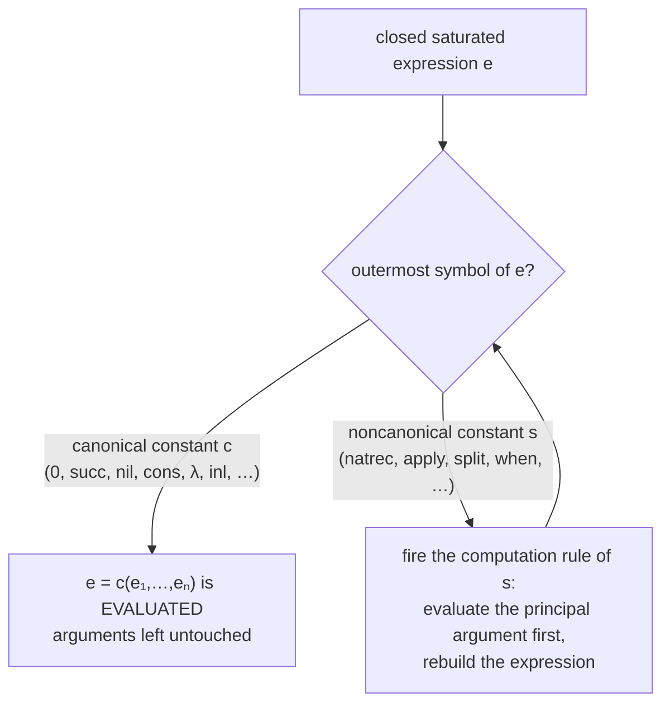
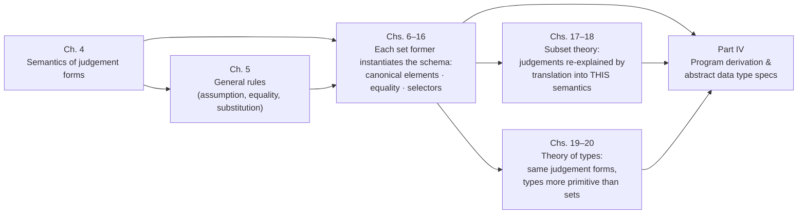

# The Semantics of Judgement Forms

[[book-guidelines|↩ Back to guidelines]]

Chapter 4 is the load-bearing wall of the whole book. Everything before it (the theory of expressions, Chapter 3) was syntax; everything after it (every set former, every proof rule, the subset theory, the theory of types) is justified *from* what this chapter establishes: a direct explanation of what the four judgement forms of type theory **mean**, given without borrowing meaning from any other mathematical theory.

## Why this chapter has to exist, and why it looks the way it does

The book's four judgement forms are:

- $A\ set$ — "$A$ is a set"
- $A = B$ — "$A$ and $B$ are equal sets"
- $a \in A$ — "$a$ is an element of the set $A$" (read: $a$ *in* $A$)
- $a = b \in A$ — "$a$ and $b$ are equal elements of the set $A$"

When reading a set as a proposition, the same forms double as "$A$ is a proposition" ($A\ prop$) and "$A$ is true" ($A\ true$). That doubling is not a new semantics — the book is explicit that "$A\ prop$" means exactly "$A\ set$", and "$A\ true$" means we have some element in $A$ without naming it.

Now the methodological problem. When you define a programming language, you normally explain its notions in terms of pre-existing mathematical objects — sets, functions, domains. Martin-Löf's type theory is intended to be the *fundamental conceptual framework* for constructive mathematics. It is the thing other theories would be interpreted in. So there is no prior mathematical theory available to explain it with; reaching for one would be circular.

The book's solution: **explain the judgements in terms of computation.** The primitive notion is not "set" or "function" but *evaluation* — "the purely mechanical procedure of finding the value of a closed saturated expression." Sets are then explained in terms of the canonical values programs can produce, and elements in terms of what programs evaluate to. This is why the chapter reads like operational semantics rather than model theory: that is precisely what it is.

**What breaks without this.** If the semantics were model-theoretic (sets-as-collections living in some meta-universe), you would lose two things at once. First, the computational reading that makes proofs into programs — an element of a set would no longer *be* a terminating computation. Second, the justification of the proof rules: the book's rules are defended by arguing "this rule preserves the meaning just explained," and that argument only goes through when the meaning is stated in terms of evaluation and canonical forms. A denotational semantics would justify different rules, or the same rules for different reasons that don't transfer to implementation.

One more framing point the chapter makes, easy to miss: this semantics **does not depend on any particular primitive constants**. It is a schema — a template that says what you must supply for each new set former (its canonical elements, their equality, its selector's computation rule) and what you get back (meaning for all four judgements involving it). Chapters 6–16 are nothing but instantiations of this schema.

## The primitive: computation, canonical forms, and laziness

Everything rests on the distinction between **canonical** and **noncanonical** expressions.

> The canonical expressions are the values of programs and for each set we will give conditions for how to form a canonical expression of that set.

Canonical expressions represent values, so they must be **closed** (no free variables) and **saturated** (fully applied — no arguments missing). Because every primitive constant in the theory has an arity of the form $\alpha_1 \otimes \cdots \otimes \alpha_n \to 0$ (where $\otimes$ reads "combined arity of the arguments" and $\to$ reads "takes arguments of arity … and yields arity …"), the normal form of any closed saturated expression is always

$$c(e_1, e_2, \ldots, e_n) \qquad (n \geq 0)$$

for some primitive constant $c$. And here is the decisive design choice: **the canonical/noncanonical distinction is made syntactically, from the head constant $c$ alone.** Constants split into canonical ones ($0$, $succ$, $nil$, $cons$, $\lambda$, $inl$, $inr$, $\langle\,\rangle$, $id$, $sup$, …) and noncanonical ones ($natrec$, $listrec$, $apply$, $split$, $when$, $idpeel$, $wrec$, …), and every noncanonical constant ships with a **computation rule**.

The evaluation strategy is **normal order (lazy)**: compute from the outside in, and *stop the moment the head is a canonical constant*:

> an expression is considered evaluated when it is of the form $c(e_1, e_2, \ldots, e_n)$ where $c$ is a canonical constant, regardless of whether the expressions $e_1, \ldots, e_n$ are evaluated or not.

So $succ(2+3)$ and $cons(3, append(cons(1, nil), nil))$ are, officially, *evaluated*. The book anticipates that this feels wrong, and distinguishes: a closed saturated expression is **fully evaluated** when it is evaluated *and* all its saturated parts are fully evaluated. $succ(0)$ and $\lambda((x)(x+1))$ are fully evaluated; $succ(2+3)$ is not.



Why accept the weaker "evaluated" notion at all? The book's example is the killer: consider $\lambda((x)b)$, a function value. Its body $(x)b$ — the abstraction, the syntactic function-with-a-hole — *cannot* be evaluated, "since it is an unsaturated expression. To compute it would be like taking a program which expects input and trying to execute it without any input data." Laziness is not an optimization here; it is the only policy under which function values exist at all.

The canonical/noncanonical examples, as the book gives them (in ordinary programming-language dress):

| Canonical (values) | Noncanonical (must compute) |
|---|---|
| $3$, $true$, $cons(1, cons(2, nil))$, $\lambda x.x$ | $3+5$, $\text{if }3=4\text{ then }fst(\langle 3,4\rangle)\text{ else }snd(\langle 3,4\rangle)$, $(\lambda x.x+1)(12+13)$ |

And evaluated-but-not-fully: $succ(2+3)$, $cons(3, append(cons(1,nil), nil))$.

A five-line Python sketch captures the whole policy:

```python
# "Evaluated" is weaker than "fully evaluated": a term counts as evaluated
# the moment its head is a constructor — its arguments may still be raw.
CANONICAL = {"0", "succ", "nil", "cons", "lambda", "inl", "inr", "pair", "id", "sup"}

def is_evaluated(term):
    return term.head in CANONICAL      # succ(2 + 3) is a value here!

def is_fully_evaluated(term):
    return is_evaluated(term) and all(
        (not arg.is_saturated) or is_fully_evaluated(arg)
        for arg in term.args
    )
```

**What breaks without this.** Without the canonical/noncanonical split, the element judgement "$a \in A$" has no content — there is nothing for $a$ to evaluate *to*, no notion of "being a value in $A$." Without laziness specifically, evaluation of a $\lambda$-body under a binder is either impossible (no input to run it on) or unsound (you'd be executing against inputs that never arrive). Every later claim in the book — "all programs terminate," "a proof normalizes to a program" — is a claim about *this* evaluation relation, so getting the stopping condition right in Chapter 4 is what makes those claims definite at all.

## The four categorical judgement forms

Here is the ladder the whole chapter climbs — each judgement form is explained using only the notions below it:

<svg viewBox="0 0 820 660" width="820" xmlns="http://www.w3.org/2000/svg" role="img">
  <title>The semantic dependency ladder of Chapter 4</title>
  <defs>
    <marker id="arrow" viewBox="0 0 10 10" refX="9" refY="5" markerWidth="7" markerHeight="7" orient="auto-start-reverse">
      <path d="M 0 0 L 10 5 L 0 10 z" fill="#8a8a8a"/>
    </marker>
  </defs>
  <!-- Hypothetical judgements (top) -->
  <rect x="150" y="20" width="520" height="74" rx="10" fill="#8a6d3b"/>
  <text x="410" y="46" text-anchor="middle" font-family="ui-sans-serif, -apple-system, 'Segoe UI', sans-serif" font-size="15" font-weight="700" fill="#f7f4ec">Hypothetical judgements</text>
  <text x="410" y="67" text-anchor="middle" font-family="ui-sans-serif, -apple-system, 'Segoe UI', sans-serif" font-size="12" fill="#f7f4ec">the same four forms, explained by induction on context length</text>
  <text x="410" y="84" text-anchor="middle" font-family="ui-sans-serif, -apple-system, 'Segoe UI', sans-serif" font-size="12" fill="#f7f4ec">families and elements must be extensional in their assumptions</text>
  <!-- Three dependent judgements -->
  <rect x="30" y="170" width="240" height="86" rx="10" fill="#7a5c48"/>
  <text x="150" y="196" text-anchor="middle" font-family="ui-sans-serif, -apple-system, 'Segoe UI', sans-serif" font-size="14" font-weight="700" fill="#f7f4ec">Judgement 2:  A = B</text>
  <text x="150" y="216" text-anchor="middle" font-family="ui-sans-serif, -apple-system, 'Segoe UI', sans-serif" font-size="11.5" fill="#f7f4ec">canonical elements and their equality</text>
  <text x="150" y="232" text-anchor="middle" font-family="ui-sans-serif, -apple-system, 'Segoe UI', sans-serif" font-size="11.5" fill="#f7f4ec">preserved in both directions</text>
  <rect x="290" y="170" width="240" height="86" rx="10" fill="#486d7a"/>
  <text x="410" y="196" text-anchor="middle" font-family="ui-sans-serif, -apple-system, 'Segoe UI', sans-serif" font-size="14" font-weight="700" fill="#f7f4ec">Judgement 3:  a ∈ A</text>
  <text x="410" y="216" text-anchor="middle" font-family="ui-sans-serif, -apple-system, 'Segoe UI', sans-serif" font-size="11.5" fill="#f7f4ec">a, when evaluated, yields</text>
  <text x="410" y="232" text-anchor="middle" font-family="ui-sans-serif, -apple-system, 'Segoe UI', sans-serif" font-size="11.5" fill="#f7f4ec">a canonical element of A</text>
  <rect x="550" y="170" width="240" height="86" rx="10" fill="#6e4a6e"/>
  <text x="670" y="196" text-anchor="middle" font-family="ui-sans-serif, -apple-system, 'Segoe UI', sans-serif" font-size="14" font-weight="700" fill="#f7f4ec">Judgement 4:  a = b ∈ A</text>
  <text x="670" y="216" text-anchor="middle" font-family="ui-sans-serif, -apple-system, 'Segoe UI', sans-serif" font-size="11.5" fill="#f7f4ec">a and b yield equal canonical</text>
  <text x="670" y="232" text-anchor="middle" font-family="ui-sans-serif, -apple-system, 'Segoe UI', sans-serif" font-size="11.5" fill="#f7f4ec">elements of A as values</text>
  <!-- A set -->
  <rect x="150" y="320" width="520" height="80" rx="10" fill="#5b5a86"/>
  <text x="410" y="347" text-anchor="middle" font-family="ui-sans-serif, -apple-system, 'Segoe UI', sans-serif" font-size="15" font-weight="700" fill="#f7f4ec">Judgement 1:  A set</text>
  <text x="410" y="368" text-anchor="middle" font-family="ui-sans-serif, -apple-system, 'Segoe UI', sans-serif" font-size="12" fill="#f7f4ec">to know it = (i) how to form the canonical elements of A</text>
  <text x="410" y="386" text-anchor="middle" font-family="ui-sans-serif, -apple-system, 'Segoe UI', sans-serif" font-size="12" fill="#f7f4ec">(ii) when two canonical elements are equal (an equivalence relation)</text>
  <!-- Canonical expressions -->
  <rect x="150" y="450" width="520" height="66" rx="10" fill="#4f6b58"/>
  <text x="410" y="476" text-anchor="middle" font-family="ui-sans-serif, -apple-system, 'Segoe UI', sans-serif" font-size="15" font-weight="700" fill="#f7f4ec">Canonical expressions — the values of programs</text>
  <text x="410" y="497" text-anchor="middle" font-family="ui-sans-serif, -apple-system, 'Segoe UI', sans-serif" font-size="12" fill="#f7f4ec">closed · saturated · headed by a canonical constant:  c(e₁,…,eₙ)</text>
  <!-- Computation -->
  <rect x="150" y="560" width="520" height="66" rx="10" fill="#55606e"/>
  <text x="410" y="586" text-anchor="middle" font-family="ui-sans-serif, -apple-system, 'Segoe UI', sans-serif" font-size="15" font-weight="700" fill="#f7f4ec">Computation (evaluation) — the primitive notion</text>
  <text x="410" y="607" text-anchor="middle" font-family="ui-sans-serif, -apple-system, 'Segoe UI', sans-serif" font-size="12" fill="#f7f4ec">the mechanical procedure of finding the value of a closed saturated expression</text>
  <!-- Arrows (upward: builds on) -->
  <line x1="410" y1="560" x2="410" y2="520" stroke="#8a8a8a" stroke-width="1.5" marker-end="url(#arrow)"/>
  <line x1="410" y1="450" x2="410" y2="404" stroke="#8a8a8a" stroke-width="1.5" marker-end="url(#arrow)"/>
  <line x1="300" y1="320" x2="170" y2="260" stroke="#8a8a8a" stroke-width="1.5" marker-end="url(#arrow)"/>
  <line x1="410" y1="320" x2="410" y2="260" stroke="#8a8a8a" stroke-width="1.5" marker-end="url(#arrow)"/>
  <line x1="520" y1="320" x2="650" y2="260" stroke="#8a8a8a" stroke-width="1.5" marker-end="url(#arrow)"/>
  <line x1="150" y1="170" x2="290" y2="98" stroke="#8a8a8a" stroke-width="1.5" marker-end="url(#arrow)"/>
  <line x1="410" y1="170" x2="410" y2="98" stroke="#8a8a8a" stroke-width="1.5" marker-end="url(#arrow)"/>
  <line x1="670" y1="170" x2="530" y2="98" stroke="#8a8a8a" stroke-width="1.5" marker-end="url(#arrow)"/>
  <text x="410" y="648" text-anchor="middle" font-family="ui-sans-serif, -apple-system, 'Segoe UI', sans-serif" font-size="11.5" font-style="italic" fill="#8a8a8a">Each level is explained in terms of the one below — no other mathematical theory is presupposed.</text>
</svg>

### Judgement 1 — $A\ set$: a set is a prescription, not a collection

The book's exact explanation:

> To know that $A$ is a set is to know how to form the canonical elements in the set and under what conditions two canonical elements are equal.

Two obligations, nothing more:

1. **A prescription for constructing canonical elements** — the syntax of the canonical expressions of $A$, plus the premises under which they may be formed.
2. **A prescription for recognizing equal canonical elements** — with two constraints baked in: the relation must be an **equivalence relation** (reflexive, symmetric, transitive), and it must respect structure: "two canonical elements are equal if they have the same form and their parts are equal."

Notice what a set is *not*, on this reading: it is not a completed collection you quantify over from outside. It is a pair of instructions — a generator and a comparator. This is why later chapters can keep *adding* set formers: each new former simply supplies new instructions, and the semantics of Chapter 4 absorbs it unchanged.

**Rust grounding.** If you were implementing this, a set is exactly what you define when you write an `enum` with constructors plus the equality you consider meaningful on it — except the book demands the equality be declared *at the same time* as the constructors, and demands it be an equivalence relation by construction:

```rust
/// Defining a set, per Chapter 4: you must simultaneously provide
/// (i) how canonical elements are formed, and
/// (ii) when two canonical elements are equal.
///
/// For N: canonical elements are 0 and succ(a); equalities follow
/// "same form, equal parts".
enum Nat {                       // (i) the canonical elements
    Zero,
    Succ(Box<Nat>),
}
// (ii) structural equality — same form, equal parts — is an
// equivalence relation automatically because it's inductive on form.
```

**Lean grounding.** This is literally the shape of a Lean `inductive` declaration: the constructors *are* the canonical-element prescription, and the kernel's definitional equality supplies the "same form, equal parts" comparison:

```lean
-- An `inductive` declaration IS the book's "prescription for forming
-- canonical elements" (obligation 1). The kernel's definitional equality
-- on constructor-headed terms supplies obligation 2.
inductive MyNat where
  | zero : MyNat
  | succ : MyNat → MyNat
```

**What breaks without this.** If the equality on canonical elements were not required to be an equivalence relation, the fourth judgement form would be incoherent: you could have $a = b \in A$ without $b = a \in A$, and every later proof step that flips or chains equalities (and they are everywhere — Chapter 10's associativity proof is *mostly* symmetry-and-transitivity bookkeeping) would be unsound. If equality were not required to respect "same form, equal parts," you could not check equality of canonical elements mechanically, and the whole computational reading collapses into an oracle.

### Judgement 2 — $A = B$: equal sets trade everything

> To know that two sets, $A$ and $B$, are equal is to know that a canonical element in the set $A$ is also a canonical element in the set $B$ and, moreover, equal canonical elements of the set $A$ are also equal canonical elements in the set $B$, and vice versa.

Set equality is **mutual preservation of canonical elements and their equality**, in both directions. It follows immediately (the book points this out) that set equality is itself an equivalence relation.

This is an intensional, instruction-level notion: $A = B$ means the two *prescriptions* interoperate perfectly — anything one prescription generates, the other accepts as canonical, and they agree on when two generated things are equal. It is emphatically not "same elements in some external universe"; there is no external universe.

**What breaks without this.** This judgement exists to license the *Set equality* rules of Chapter 5 — from $a \in A$ and $A = B$, conclude $a \in B$. If set equality were defined more loosely than mutual preservation of canonical elements *and* their equalities, that substitution step would fail in one direction or the other, and you could not replace a set by an equal one anywhere in a derivation. Dependent reasoning — where the *set itself* is computed from data — would be impossible.

### Judgement 3 — $a \in A$: evaluation is part of the meaning

> If $A$ is a set then to know that $a \in A$ is to know that $a$, when evaluated, yields a canonical element in $A$ as value.

This is the clause that fuses type theory with computation. "$a \in A$" is not a static membership fact; it is the claim that a certain program, run under the lazy policy above, terminates in a value that the prescription for $A$ accepts. Two things to check, in order: first that $A\ set$ (the judgement presupposes it), then that the value of $a$ passes the canonical-element test for $A$.

**Rust grounding.** The semantic clause reads directly as a checking function:

```rust
/// Semantic clause for the element judgement:
///   `a ∈ A`  iff  evaluating `a` yields a canonical element of `A`.
fn check_elem(ctx: &Context, term: &Expr, set: &Expr) -> Result<(), TypeError> {
    check_set(ctx, set)?;             // presupposition: A set
    let value = eval(ctx, term)?;     // lazy, normal-order evaluation
    check_canonical(ctx, &value, set) // constructor-headed, premises checked
}

/// Canonical elements are checked by introduction rules: dispatch on the
/// outermost canonical constant, then recursively check the premises.
fn check_canonical(ctx: &Context, value: &Expr, set: &Expr) -> Result<(), TypeError> {
    match (value.head(), set.head()) {
        (Const::Zero, Const::N) => Ok(()),
        (Const::Succ(v), Const::N) => check_elem(ctx, v, &nat()),
        (Const::Pair(a, b), Const::Times(set_a, set_b)) => {
            check_elem(ctx, a, set_a)?;
            check_elem(ctx, b, set_b)
        }
        // … one arm per introduction rule of every set former …
        _ => Err(TypeError::NotCanonical),
    }
}

/// Normal-order evaluation, straight from the chapter's clauses:
/// reduce from the outside; STOP the moment the head is canonical.
fn eval(ctx: &Context, e: &Expr) -> Result<Expr, EvalError> {
    let mut cur = e.clone();
    loop {
        match cur.head() {
            Head::Canonical(_) => return Ok(cur), // a value, even with raw args
            Head::Selector(_) => cur = cur.fire_computation_rule(ctx)?,
        }
    }
}
```

Read the structure of `check_elem` carefully: it is the book's judgement explained as an algorithm. This is the ancestor of every dependent type checker you will ever build — including the kernel of your Rust verifier.

**Lean grounding.** When the Lean kernel accepts `one : MyNat`, it is executing exactly this clause — reduce the term (to weak-head normal form, constructor-headed), then check the result against the type's constructors:

```lean
def one : MyNat := MyNat.succ .zero
-- The kernel verifies that `one` evaluates to a canonical element of
-- `MyNat` — exactly the book's explanation of `a ∈ A`.
-- Constructor-headed normal forms ARE the canonical elements.
```

**What breaks without this.** If membership did not involve evaluation — if $a \in A$ meant only "$a$ is syntactically shaped like an element of $A$" — then programs and their results would have different types, and the identity $(\lambda x.b)(a) \in B$ would fail whenever $b[a] \in B$ held. The entire Curry-Howard mechanism (proofs normalize to programs) needs evaluation to live *inside* the meaning of $\in$, not beside it.

### Judgement 4 — $a = b \in A$: equal values, not equal syntax

> To know that $a$ and $b$ are equal elements in the set $A$, is to know that they yield equal canonical elements in the set $A$ as values.

Two terms are equal elements when their *executions* land on canonical elements that the prescription for $A$ identifies. Since $A\ set$ is presupposed, "equal canonical elements in $A$" is already defined — this judgement just lifts that relation through evaluation.

**Lean grounding.** This judgement is definitional equality, and `rfl` is its introduction:

```lean
example : one = MyNat.succ MyNat.zero := rfl
-- `rfl` succeeds precisely when both sides evaluate to the same
-- canonical element — "yield equal canonical elements as values".
-- The kernel's conversion check is judgement 4 implemented.
```

Note the asymmetry worth keeping in mind: the *judgemental* equality of this chapter (and of Chapter 3's definitional equality $\equiv$) is decidable by construction — that decidability is what arities were invented to protect. The *propositional* equality sets $Id$ and $Eq$ of Chapter 8 are a different story, and the tension between them is one of the book's recurring themes.

**What breaks without this.** A proof system whose equality judgement compared syntax rather than values could not even identify $2+2$ with $4$. More structurally: the elimination/equality rules of every later chapter ($natrec(0, d, e) = d$, $apply(\lambda(b), a) = b(a)$, …) are computation laws stated as instances of this fourth judgement. Without evaluation-in-the-meaning, none of them would be expressible as equalities.

### The propositional readings

These cost nothing extra, and the chapter says so in two lines:

- **$A\ prop$** ("$A$ is a proposition") means exactly that $A$ is a set.
- **$A\ true$** ("$A$ is true") means we have *some* element in $A$ — an unnamed witness.

Combined with Chapter 2's identifications (proofs of $A \supset B$ are functions, proofs of conjunctions are pairs, and so on), this is the Curry-Howard correspondence stated semantically rather than syntactically: truth *is* inhabitedness, and the meaning of "inhabited" was just given in terms of evaluation.

## Hypothetical judgements: meaning by induction on the context

Real reasoning happens under assumptions. The simplest assumption is $x \in A$ — $x$ a variable of arity $0$, $A$ a set — and the chapter notes it carries **two readings** that type theory deliberately does not distinguish:

1. A **variable declaration**: $x$ ranges over $A$ (e.g., $x \in N$, $y \in Bool$).
2. A **logical assumption**: we assume proposition $A$ is true and $x$ is a construction (proof-element) for it.

The assumptions the chapter admits form **contexts**: lists

$$x_1 \in A_1,\quad x_2 \in A_2(x_1),\quad \ldots,\quad x_n \in A_n(x_1, \ldots, x_{n-1})$$

where each $A_i(x_1, \ldots, x_{i-1})$ *is a set under the preceding assumptions*. Contexts are thus self-certifying: you cannot even write down $y \in succ(x)$, because $succ(x)$ is not a set under any assumption about $x$.

The meaning of hypothetical judgements is then defined **by induction on the length of the context**. The empty case is the categorical semantics above. For one assumption $x \in C$:

- **$A(x)\ set\ [x \in C]$** — to know this is to know that for an *arbitrary* element $c$ of $C$, $A(c)$ is a set. Plus an extensionality obligation: if $b = c \in C$, then $A(b) = A(c)$.
- **$A(x) = B(x)\ [x \in C]$** — to know $A(c) = B(c)$ for arbitrary $c \in C$.
- **$a(x) \in A(x)\ [x \in C]$** — to know $a(c) \in A(c)$ for arbitrary $c \in C$, again with extensionality: if $b = c \in C$ then $a(b) = a(c) \in A(c)$.
- **$a(x) = b(x) \in A(x)\ [x \in C]$** — to know $a(c) = b(c) \in A(c)$ for arbitrary $c \in C$.
- Propositional readings lift exactly as before.

The step to $n$ assumptions iterates the same move: $A(x_1,\ldots,x_n)\ set\ [x_1 \in C_1, \ldots, x_n \in C_n(\ldots)]$ means that $A(c, x_2, \ldots, x_n)$ is a set under the remaining assumptions, provided $c \in C_1$ — and the general **extensionality of propositional functions** (families of sets) is stated once and for all: from

$$a_1 = b_1 \in C_1,\quad a_2 = b_2 \in C_2(a_1),\quad \ldots,\quad a_n = b_n \in C_n(a_1, \ldots, a_{n-1})$$

together with $A(x_1,\ldots,x_n)\ set\ [\ldots]$ it follows that

$$A(a_1, \ldots, a_n) = A(b_1, \ldots, b_n).$$

There is a matching clause for element expressions: a hypothetical element $a(\vec x) \in A(\vec x)$ applied to equal arguments yields equal results in the (equal) target sets.

**Why extensionality is part of the meaning, not a lemma.** This is one of the guidelines' key questions, and the answer is: *substitution must be sound*. Suppose $A(x)$ failed extensionality — some $b = c \in C$ with $A(b) \neq A(c)$. Then from a judgement $a \in A(b)$ you could not conclude $a \in A(c)$, because the sets are different; every Chapter 5 substitution rule ("substitute equal elements into a family of sets") would be unsound, and with them the mechanism for **discharging assumptions** (substituting an actual proof-element for the indeterminate one $x$). The book builds extensionality into the meaning of "family" precisely so that those rules can later be *read off* the semantics.

**Rust grounding.** A context is a typed, dependency-aware environment — and its well-formedness check is exactly "each type is a set under the preceding bindings":

```rust
/// x1 ∈ C1, x2 ∈ C2(x1), …, xn ∈ Cn(x1,…,xn−1)
pub struct Context {
    pub bindings: Vec<(Var, Expr)>, // (variable, its set)
}

impl Context {
    /// A context extension is legal only if the new set is itself a set
    /// under the assumptions already present — the book's recursive
    /// well-formedness condition on contexts.
    pub fn extend(&self, x: Var, set: &Expr, checker: &Checker) -> Result<Context, TypeError> {
        checker.check_set(self, set)?;          // A(x1..xk) set under prior bindings
        let mut ctx = self.clone();
        ctx.bindings.push((x, set.clone()));
        Ok(ctx)
    }
}
```

And the extensionality obligation, operationally, is a congruence property your checker must maintain: if two terms evaluate to the same value in a given set, then any family applied to them yields sets your checker treats as equal. Implementations earn this by never comparing types syntactically — always up to evaluation.

**Lean grounding.** The hypothetical judgement $B(x)\ set\ [x \in A]$ is exactly a declaration checked with $x$ in the local context, and the extensionality clause is what Lean's kernel gets for free from congruence of definitional equality:

```lean
-- `B(x) set [x ∈ A]` is a family over A, elaborated with x in scope:
def Family (n : MyNat) : Type := MyNat  -- stand-in body

-- Extensionality obligation: if b and c are defeq in A, then Family b
-- and Family c are defeq. Lean's conversion check (isDefEq) enforces
-- this by reducing both sides — the Chapter 4 clause, mechanized.
```

One limitation stated in the chapter, worth registering: the contexts here admit only variables of **arity 0** (element variables). Higher-order assumptions — function variables $y(x) \in B(x)\ [x \in A]$, which the $\Pi$-selector `funsplit` needs in Chapter 7 — are outside this semantics, and the fully general treatment waits for the theory of types in Chapter 19.

**What breaks without this.** Without context well-formedness, assumptions like "$y$ is an element of $succ(x)$" become statable and the theory admits garbage judgements. Without the induction-on-context-length definition, dependent families have no meaning at all — and dependent families are where the whole book's expressiveness lives (specifications like "for every input list, produce a sorted permutation of it" are meaningless without them). Without extensionality of families, assumption discharge is unsound, as argued above.

## From semantics to rules: the bridge

The chapter ends where Part I's pattern begins. The meanings just explained *justify* — the book's word, repeatedly — the general rules of Chapter 5: the Assumption rule, the reflexivity/symmetry/transitivity rules (they hold for canonical elements, hence for elements), the Set equality rules, and the four substitution rules (each one is literally a re-statement of what a hypothetical judgement means). And for every individual set former that follows, four rule shapes recur, each tied to this chapter's semantics:

- **Formation rules** ↔ when the prescriptions for a set exist (judgement 1).
- **Introduction rules** ↔ the canonical-element prescription itself (judgement 1, obligation (i) and (ii)).
- **Elimination rules** ↔ selectors and their computation rules, justified by "evaluate the scrutinee; it must be canonical; dispatch" (judgement 3).
- **Equality rules** ↔ the computation rules, stated as instances of judgement 4.

If you remember nothing else from this chapter, remember that mapping: every rule you will meet in Chapters 6–16 is one of these four semantic obligations wearing natural-deduction clothes.

## Synthesis: where this sits, and why it matters for your two targets



Within the book: Chapter 5's rules are read off this semantics; Chapters 6–16 instantiate the schema for each set former; the subset theory (Chapter 18) gives its judgements meaning by *translating them into* the basic semantics of this chapter; and the theory of types (Chapter 19) re-founds the same four judgement forms on a still more primitive notion. Everything downstream either instantiates, translates into, or re-grounds Chapter 4.

For your projects, this chapter is about as load-bearing as it gets — it is the explicit "judgment forms as shared ancestor" thread:

- **The four judgement forms are the AST of your Rust verifier's checker.** The `enum Judgement` sketched above, plus `check_elem`/`check_canonical`, is not an analogy — it is the minimal architecture of any checker whose soundness statement is "every derivable judgement is true in the sense of Chapter 4." When you later formalize Hoare-triple or dependent-subtyping contracts, the triple itself will be a judgement *shape* added to exactly this machinery, and its soundness will be argued the same way the book argues it: state the meaning first, then show each rule preserves it.
- **Judgement 4 is `isDefEq`.** "Yield equal canonical elements as values" is, operationally, reduce-both-sides-and-compare — the conversion check at the core of Lean's kernel unifier and the one your elaborator's metavariable solver will call thousands of times. When you implement Miller-pattern unification, every comparison of a candidate solution against an expected type bottoms out in this chapter's fourth judgement.
- **Context well-formedness and extensionality are the plumbing under both targets.** Substitution-into-a-family being sound *because families are extensional by meaning* is the fact you will re-prove (as a lemma about your implementation) for Hoare-triple substitution under program-state assumptions, and the fact your elaborator's congruence closure silently depends on whenever it solves a metavariable under a local context. The book flags the exact obligations — equivalence relation on canonical elements, same-form-equal-parts, extensionality under equal arguments — that an implementation must preserve to keep those arguments valid.

**Where this leads.** Directly onward: Chapter 5 (the general rules justified here), then every set former of Chapters 6–16, each of which you can now read as "canonical elements + equality + selector + computation rule, justified from this semantics."

[[book-guidelines|↩ Back to guidelines]]