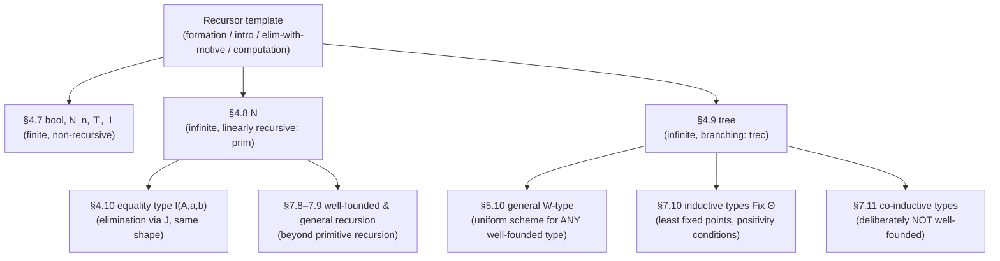

[[book-guidelines|↩ Back to guidelines]]

## Why base types at all?

Everything in Chapter 4 up to this point — $\wedge$, $\Rightarrow$, $\vee$, $\bot$, $\forall$, $\exists$ — is a *logical* connective first, with a programming reading bolted on via Curry–Howard. Booleans, natural numbers, and trees run the correspondence the other way round: they are programming types first (you cannot write a real program without a way to branch on a condition, count things, or build a tree), and Thompson's point in §4.7 is that they *also* have a perfectly good logical reading once you look for it. As he puts it, these types have "origins... in programming," unlike $\wedge$ or $\forall$, whose origins are in logic.

This matters because it's the first place the book has to justify a type constructor by an appeal to "you need this to compute anything," rather than "you need this to state a proposition." Without a boolean type, you have no case-split. Without naturals, you have counting only up to whatever finite types you've hard-coded. Without recursively-defined structures like trees, you're stuck enumerating every shape a data structure could take instead of building it inductively. Each of the three sections below (§4.7 base types, §4.8 naturals, §4.9 trees) adds one more layer of "what breaks without this," and by the end you have the general *shape* of an elimination rule — formation, introduction, elimination, computation — that every later inductive type in the book (subset types, quotient types, $W$-types, inductively-defined `Fix Θ` types) will reuse.

## Booleans as the smallest interesting finite type

### The problem: you need to branch

You want `if b then e else f`. That requires a type with exactly two distinguishable values and a rule for eliminating (consuming) an element of that type by casing on which one it is. Thompson calls this type `bool`, with values $True$ and $False$ — deliberately typeset differently from the propositions $\top$ ("true") and $\bot$ ("false") that already exist in the system. This is a distinction worth sitting with: `bool` is a *data type* with two computational values; $\top$ and $\bot$ are *propositions*, each a type of *proofs*. Confusing them is the classic mistake of conflating a language's `bool` type with the metalanguage's notion of truth — Thompson explicitly calls out Pascal programmers as the audience likely to make this slip.

### The rules, verbatim

Formation just says the type exists unconditionally:
$$\dfrac{}{bool \text{ is a type}}\ (boolF)$$

Introduction gives the two constructors:
$$\dfrac{}{True : bool}\ (boolI_1) \qquad \dfrac{}{False : bool}\ (boolI_2)$$

Elimination is the case-switch, and here Thompson gives the *strong* (dependently-typed) form up front rather than easing into it:
$$\dfrac{tr : bool \quad c : C[True/x] \quad d : C[False/x]}{\text{if } tr \text{ then } c \text{ else } d : C[tr/x]}\ (boolE)$$

The type of the result, $C[tr/x]$, is allowed to *depend on the value of the scrutinee*. This is stronger than an ordinary two-way branch in a language like Rust or Python, where both arms of an `if` must produce the same static type. Here the two proof obligations $c : C[True/x]$ and $d : C[False/x]$ can each inhabit a genuinely different type, so long as they specialize correctly once you know which branch you're in. (Thompson notes you can always fall back to the simplified, non-dependent form $c : C,\ d : C \vdash \text{if } tr \text{ then } c \text{ else } d : C$ when you don't need this.)

Computation says which branch actually reduces:
$$if\ True\ then\ c\ else\ d \to c \qquad if\ False\ then\ c\ else\ d \to d$$

**What breaks without dependent elimination:** if the elimination rule only produced a fixed, boolean-independent type $C$, you could implement ordinary conditionals but never a function whose *return type itself* is chosen by a runtime boolean — e.g. a function that returns `Vec<u8>` in one branch and `Vec<u16>` in the other based on a flag, verified statically. That capability — motive depends on the scrutinee — is exactly what generalizes later to the dependent function/sum types (§4.6) and is the seed of everything "dependent" in the rest of the book.

### Grounding: bool as the simplest recursor

In **Rust**, `bool` is a genuine two-constructor enum under the hood, and pattern matching realizes the *non-dependent* elimination rule directly:

```rust
enum MyBool { True, False }

fn cond<C>(tr: MyBool, c: C, d: C) -> C {
    match tr {
        MyBool::True => c,
        MyBool::False => d,
    }
}
```

Rust's `match` arms are required to unify to one type `C` — there is no way to let the *return type* itself vary by arm the way $(boolE)$ allows, because Rust's type system is not dependent. The closest Rust gets is enum-level polymorphism (`Result<A, B>` carrying two different payload types, then case-splitting), which simulates the effect at the value level but never lets the *type-checker* see "the result type here is $C[True/x]$."

In **Lean**, this gap disappears, because `bool`'s elimination rule *is* `Bool.rec` (equivalently, a dependent `match`), and Lean's kernel genuinely lets the motive `C : Bool → Sort u` depend on the scrutinee:

```lean
def cond' {C : Bool → Sort u} (tr : Bool) (c : C true) (d : C false) : C tr :=
  match tr with
  | true  => c
  | false => d
```

This is a direct, notation-for-notation translation of $(boolE)$: `C` is Thompson's $C[x]$, `c` and `d` are his premises, and Lean's kernel reduction of `match true with | true => c | false => d ↦ c` is exactly the computation rule $if\ True\ then\ c\ else\ d \to c$. When you later build a checker or elaborator, this is the pattern you'll auto-generate an eliminator from for *every* inductive type you declare — `bool` is simply the first, smallest instance.

## Finite types $N_n$, and $\top$/$\bot$ as degenerate cases

Booleans generalize immediately: for any natural number $n$, the type $N_n$ has $n$ elements $1_n, 2_n, \ldots, n_n$ (the subscript recording which type the element belongs to, since these are genuinely different types for different $n$ — $1_2$ is not $1_3$). `bool` is just $N_2$ with $1_2 \equiv True$, $2_2 \equiv False$.

Formation, introduction, elimination, and computation all scale up mechanically — elimination becomes an $n$-way switch:
$$\dfrac{e : N_n \quad c_1 : C[c_1/x] \quad \cdots \quad c_n : C[c_n/x]}{cases_n\ e\ c_1 \ldots c_n : C[e/x]}\ (N_nE)$$
$$cases_n\ 1_n\ c_1 \ldots c_n \to c_1, \qquad \ldots, \qquad cases_n\ n_n\ c_1 \ldots c_n \to c_n$$

Thompson then does something elegant: he lets $n$ range down to the edges. Taking $n = 1$ and renaming $N_1 \to \top$, $1_1 \to Triv$, $cases_1 \to case$ recovers exactly the *unit type*:
$$\dfrac{}{\top \text{ is a type}} \qquad \dfrac{}{Triv : \top} \qquad \dfrac{x : \top \quad c : C(Triv)}{case\ x\ c : C(x)} \qquad case\ x\ c \to c$$

And taking $n = 0$ — a case switch with *zero* branches to supply — recovers the *empty type* $\bot$: there is no introduction rule at all (you cannot construct an inhabitant), and the elimination rule lets you produce a value of *any* type $C$ from an assumed (impossible) element of $\bot$, since vacuously there are zero premises to discharge. This is exactly `ex falso quodlibet` from Chapter 1, now falling out of the finite-type scheme for free rather than being stipulated as a separate logical axiom.

**What breaks without a genuine empty type:** you'd have no internal way to represent "this branch is unreachable" or "this proof is impossible" as a first-class *type* (as opposed to a runtime panic or an unchecked assumption) — which matters the moment you want the type-checker itself to certify unreachability, e.g. exhaustiveness of a match, or `False → C` used to discharge a case in a Hoare-triple proof.

**Grounding.** Rust's `()` is the unit type ($\top$/$Triv$, one value, elimination is trivial — pattern matching on `()` always succeeds). Rust's `!` (the "never type", still unstable as a first-class type in stable Rust but present as the return type of `panic!`, and directly expressible via `enum Never {}`) is $\bot$: zero constructors, and any function `fn absurd(x: Never) -> C` type-checks vacuously because there's no way to construct an argument to call it with. In **Lean**, these are literally named `PUnit`/`True` and `Empty`/`False`, and `Empty.elim : Empty → C` is `case`/$\bot E$ verbatim. The $N_n$ family in general doesn't have a standard Rust or Lean idiom beyond `enum` with $n$ unit variants — it's a pedagogical stepping stone the book uses to motivate the general pattern, not a construct either language reifies as its own primitive.

## Natural numbers: the recursor that is also induction

### The problem: counting needs an infinite type, built finitely

$N_n$ types are finite and closed — you write out all $n$ constructors up front. Naturals need an *open-ended* type generated by two rules applied arbitrarily often:
$$\dfrac{}{N \text{ is a type}}\ (NF) \qquad \dfrac{}{0 : N}\ (NI_1) \qquad \dfrac{n : N}{(succ\ n) : N}\ (NI_2)$$

The interesting move is the elimination rule — definition by primitive recursion. Thompson first gives what he calls the **special case**, which should look immediately familiar as a fold/catamorphism:
$$\dfrac{n : N \quad c : C \quad f : (N \Rightarrow C \Rightarrow C)}{prim\ n\ c\ f : C}\ (NE,\ \text{special case})$$

Here $c$ is the base case, $f$ takes the *predecessor* and the *already-computed result on the predecessor* and produces the next result — this is precisely `fold` over a Peano-encoded number.

But Thompson immediately generalizes it to the **general case**, where the motive $C$ is allowed to depend on which natural number you're at — turning the very same recursor into the induction principle for mathematical induction:
$$\dfrac{n : N \quad c : C[0/x] \quad f : (\forall n:N).(C[n/x] \Rightarrow C[succ\ n/x])}{prim\ n\ c\ f : C[n/x]}\ (NE,\ \text{general case})$$

This is the chapter's central point about recursion vs. induction: *they are not two separate principles that happen to look similar — they are literally the same elimination rule*, read once with a constant motive (recursion, produces a value) and once with a motive that varies with $n$ (induction, produces a proof — but under Curry–Howard a proof *is* a value, so the distinction was never real to begin with). Computation is identical in both readings:
$$prim\ 0\ c\ f \to c \qquad prim\ (succ\ n)\ c\ f \to f\ n\ (prim\ n\ c\ f)$$

### Worked example: `addone`, traced through reduction

Thompson works a deliberately inefficient `addone`, defined by recursion equations
$$addone\ 0 = 1 \qquad addone\ (n+1) = (addone\ n) + 1$$
formalized as $addone \equiv_{df} \lambda x^N.(prim\ x\ (succ\ 0)\ f)$ where $f \equiv_{df} \lambda n^N.\lambda y^N.(succ\ y)$, and then traces $addone(succ(succ\ 0))$ step by step via $\to$ down to $succ(succ(succ\ 0))$ — a fully explicit unfolding of the two computation rules above, four or five reduction steps deep. (He returns to this exact example in §4.10 as the running case study for *propositional but not definitional* equality — $addone(n)$ and $succ(n)$ compute to the same normal form for every concrete $n$, but are not judgementally identical as open terms.)

From there, `add` and `mult` fall out as instances of the same recursor:
$$add \equiv_{df} \lambda m.\lambda n.\ prim\ m\ (\lambda p.\lambda q.(succ\ q))\ n \qquad mult \equiv_{df} \lambda m.\lambda n.\ prim\ 0\ (\lambda p.\lambda q.(add\ m\ q))\ n$$

### The Ackermann function: primitive recursion, but higher-order

Thompson uses Ackermann's function to show that this system's `prim` is *more powerful* than first-order primitive recursion in the classical sense (where Ackermann is famously **not** representable), because `prim`'s step function $f$ is allowed to be higher-order — here, $f$ itself returns a function $N \Rightarrow N$:
$$ack\ 0 = succ \qquad ack\ (m+1) = iter\ (ack\ m)$$
where $iter : (N \Rightarrow N) \Rightarrow (N \Rightarrow N)$ is itself defined by `prim`:
$$iter\ f\ 0 = 1 \qquad iter\ f\ (n+1) = f\ (iter\ f\ n)$$
Formally, $iter \equiv \lambda f^{(N\Rightarrow N)}.\lambda n^N.\ prim\ n\ 1\ (\lambda p.\lambda q.(f\ q))$, and Ackermann itself is $\lambda n^N.(prim\ n\ succ\ \lambda p.\lambda g.(iter\ g))$ — a `prim` whose motive $C$ is the function type $N \Rightarrow N$. This is still total (every function definable by `prim`, at any order, terminates), which is exactly why it *doesn't* let you define a universal interpreter for `prim`-definable functions — you're still strictly inside the primitive recursive functions in the generalized, higher-order sense, not at full Turing-completeness. (The book returns to this expressibility question formally in Chapter 5, §5.11, Theorem 5.45.)

**What breaks without the general (dependent) elimination rule:** you'd get a total, terminating fold over naturals — genuinely useful — but you'd have no way to state or prove `(∀n : N). P(n)` internally, because the motive of your recursor could never depend on `n`. Mathematical induction over $N$ would have to live outside the type theory as a meta-level principle, exactly the "external logical language" situation Thompson flags for Pascal's `bool` in §4.7.1 — except now for the whole of arithmetic, which defeats the entire Curry–Howard project of Chapter 4.

### Grounding

**Rust** naturals-as-data are the textbook Peano encoding, and `prim` becomes ordinary structural recursion — Rust's compiler enforces termination only via the borrow/size checker for recursive *types* (`Box` breaking the infinite-size cycle), not via a totality checker for recursive *functions*, so nothing stops you writing a non-terminating `fn`:

```rust
enum Nat { Zero, Succ(Box<Nat>) }

fn prim<C>(n: &Nat, c: C, f: &dyn Fn(&Nat, C) -> C) -> C {
    match n {
        Nat::Zero => c,
        Nat::Succ(m) => prim(m, f(m, /* need C: Clone or restructure */ todo!()), f),
    }
}
```
(The `todo!()` marks a real ergonomic wall: Rust's ownership model makes the literal two-argument `f n (prim n c f)` shape awkward without `Clone`, because you need `c` both to recurse with and to hand to `f` — worth noticing precisely *because* it's a place where a total, substructural type theory and an affine, non-total systems language diverge in practice, not just in principle.)

**Lean**'s `Nat.rec` is `prim`'s general case verbatim, motive and all — `Nat` is declared as an ordinary inductive type and the kernel derives `Nat.rec {motive : Nat → Sort u} (zero : motive 0) (succ : (n : Nat) → motive n → motive n.succ) (t : Nat) : motive t` automatically, which is *exactly* $(NE,\text{general case})$ with $C$ renamed `motive`. Ordinary structural recursion (`def add : Nat → Nat → Nat`) elaborates to a call to `Nat.rec` under the hood, and Lean's termination checker is precisely what certifies that your recursive calls are on structurally smaller arguments — the mechanized version of "primitive recursion is manifestly total" that Thompson is arguing for informally here.

**Python**, for a quick untyped sketch of the Ackermann definition itself (illustrative only, no totality guarantee):
```python
def ack(m, n):
    if m == 0: return n + 1
    if n == 0: return ack(m - 1, 1)
    return ack(m - 1, ack(m, n - 1))
```

## Well-founded types: trees as the template for algebraic data types

### The problem: real data isn't flat

$N_n$ is finite and flat; $N$ is infinite but linear (each element has exactly one predecessor). Real data structures branch. Thompson introduces trees as "an example of an algebraic type," explicitly modeled on Miranda's algebraic type syntax:
$$bool ::= True \mid False \qquad nat ::= Zero \mid Succ\ nat \qquad tree ::= Null \mid Bnode\ nat\ tree\ tree$$

The word **well-founded** is doing real work here, and it's worth being precise about it: a type is well-founded if there is no infinite descending chain of "immediate predecessors" — you can always eventually bottom out at a base constructor ($Null$, or $0$). This is exactly what licenses both structural induction (Definition 4.2) and primitive recursion (Definition 4.3) over the type, and it's exactly what fails for types built to allow infinite unfolding (which the book revisits as *co-inductive* types — streams — in §7.11, deliberately outside well-foundedness).

**Definition 4.2 (structural induction).** To prove $P(t)$ for every tree $t$, it suffices to prove $P(Null)$ outright, and to prove $P(Bnode\ n\ u\ v)$ *assuming* $P(u)$ and $P(v)$ — the induction hypotheses on the immediate subtrees.

**Definition 4.3 (primitive recursion over trees).** To define a total function $f : tree \to P$, supply a base value $a : P$ for $f\ Null$, and a function
$$F : nat \to tree \to tree \to P \to P \to P$$
so that $f\ (Bnode\ n\ u\ v) = F\ n\ u\ v\ (f\ u)\ (f\ v)$ — $F$ receives the node's own data, the two subtrees, *and the results already computed on those subtrees*.

Formally, since the type of $F$'s result now depends on the shape of the tree being consumed, Thompson has to reach for the dependent function type introduced in §4.6 — this is the first non-trivial payoff of having built $\forall$ before base types:
$$F : (\forall n:N)(\forall u:tree)(\forall v:tree)(P(u) \Rightarrow P(v) \Rightarrow P(Bnode\ n\ u\ v))$$

The four official rules:
$$\dfrac{}{tree \text{ is a type}}\ (treeF) \qquad \dfrac{}{Null : tree}\ (treeI_1) \qquad \dfrac{n:N \quad u:tree \quad v:tree}{(Bnode\ n\ u\ v):tree}\ (treeI_2)$$
$$\dfrac{t:tree \quad c:C[Null/x] \quad f:(\forall n{:}N)(\forall u{:}tree)(\forall v{:}tree)(C[u/x]\Rightarrow C[v/x]\Rightarrow C[(Bnode\ n\ u\ v)/x])}{trec\ t\ c\ f : C[t/x]}\ (treeE)$$
$$trec\ Null\ c\ f \to c \qquad trec\ (Bnode\ n\ u\ v)\ c\ f \to f\ n\ u\ v\ (trec\ u\ c\ f)\ (trec\ v\ c\ f)$$

Notice the shape: exactly one elimination rule again, with a motive $C$ that can depend on the tree, and a computation rule that recurses on *both* subtrees, handing their already-computed results to $f$ alongside the raw subtrees themselves. Compare this rule side by side with $(NE)$ — same skeleton, one more recursive position because $Bnode$ has two recursive arguments where $succ$ has one.

**Worked example.** Summing a tree's contents:
$$sumt\ Null = 0 \qquad sumt\ (Bnode\ n\ u\ v) = n + (sumt\ u) + (sumt\ v)$$
formalized as $\lambda t^{tree}.(trec\ t\ 0\ f)$ where $f \equiv_{df} \lambda n.\lambda t_1.\lambda t_2.\lambda s_1.\lambda s_2.(n + s_1 + s_2)$ — note $f$ ignores the raw subtrees $t_1, t_2$ and uses only the already-summed results $s_1, s_2$, which is allowed precisely because $F$'s signature in Definition 4.3 hands you both and lets you choose.

Thompson flags, but defers, the natural next question: is there a *single* uniform scheme that generates formation/introduction/elimination/computation rules for *any* well-founded algebraic type automatically, instead of writing out $(treeF)$–$(treeE)$ by hand for every new shape? He names this as Martin-Löf's program and postpones it to Chapter 5 (the general $W$-type, §5.10, once the identity type is available to state it cleanly) — a direct pointer forward that this section's `tree` is a worked instance of a machine that gets built in general later.

**What breaks without well-foundedness as a hard requirement:** if you allowed $trec$/structural induction over a type that permitted infinite descent (e.g. a hypothetical "co-tree" with no `Null` case forced eventually), the recursor could be asked to unfold forever — you'd lose totality, and with it the soundness of reading the elimination rule as an induction principle (Definition 4.2's "sufficiency" argument silently assumes the descent terminates). This is exactly why co-inductive types in §7.11 need a *different* discipline (guarded corecursion, always producing a defined head) rather than reusing `trec` as-is.

### Grounding

**Rust**, this is close to verbatim — an `enum` with a recursive, boxed variant, and `trec` is a plain recursive function:

```rust
enum Tree { Null, Bnode(u32, Box<Tree>, Box<Tree>) }

fn trec<C>(t: &Tree, c: &C, f: &dyn Fn(u32, &Tree, &Tree, &C, &C) -> C) -> C
where C: Clone {
    match t {
        Tree::Null => c.clone(),
        Tree::Bnode(n, u, v) => {
            let su = trec(u, c, f);
            let sv = trec(v, c, f);
            f(*n, u, v, &su, &sv)
        }
    }
}

fn sumt(t: &Tree) -> u32 {
    trec(t, &0, &|n, _u, _v, s1, s2| n + s1 + s2)
}
```
The `Box` here is not incidental — it's Rust's runtime, machine-level way of guaranteeing exactly the finiteness that "well-founded" guarantees mathematically: a `Tree` containing a `Tree` directly (no indirection) would be infinite-sized and rejected at compile time, which is a size-level echo of the no-infinite-descent requirement, even though Rust never checks totality of `trec` itself.

**Lean**, `inductive Tree` again auto-derives `Tree.rec` with exactly this shape, motive included, and — critically for the elaborator project — Lean's *positivity checker* is doing at the type-formation level exactly what "well-founded" is doing informally here: it rejects inductive declarations where the type being defined occurs in a "negative" (function-argument) position, because such declarations would let you smuggle in an infinite object and break totality, the same failure mode Thompson gestures at.
```lean
inductive Tree where
  | null : Tree
  | bnode : Nat → Tree → Tree → Tree

def sumt : Tree → Nat
  | .null => 0
  | .bnode n u v => n + sumt u + sumt v
```
`sumt`'s definition here elaborates to a call on `Tree.rec`, and Lean's structural-termination checker verifies it the same way it verified `Nat`'s recursor — by confirming each recursive call is on a strictly smaller structural argument (`u`, `v` inside `bnode n u v`).

## Where this leads

The recursor pattern established across §4.7–4.9 — formation unconditional (or nearly so), introduction giving the constructors, elimination as a case analysis whose motive $C$ may depend on the scrutinee, computation reducing each constructor to its corresponding branch — is not a one-off convenience. It is the *template* the rest of the book reuses explicitly:



Two things follow directly for the compiler/elaborator project this vault is tracking. First, the elimination rule's dependent motive $C$ is precisely the mechanism a real proof/type-checker has to implement once, generically, for every inductive type it accepts — this section is the minimal, concrete case (`bool`, `N`, `tree`) to build and test that mechanism against before generalizing to the $W$-type in Chapter 5 or the `Fix Θ` scheme in Chapter 7. Second, the identification of primitive recursion with mathematical induction — the same rule, read with a constant vs. a varying motive — is the cleanest possible illustration, before the book's harder material on equality and unification, of why "type checking" and "proof checking" are the same problem: `prim`/`trec` typed correctly against a dependent motive *is* the induction principle, with no separate machinery required. Keep this section's four-part rule shape in mind when §4.10's identity type introduces its own elimination operator $J$ — it is built to the same template, and is where the book's treatment of definitional vs. propositional equality (directly relevant to an elaborator's `isDefEq`) begins.
