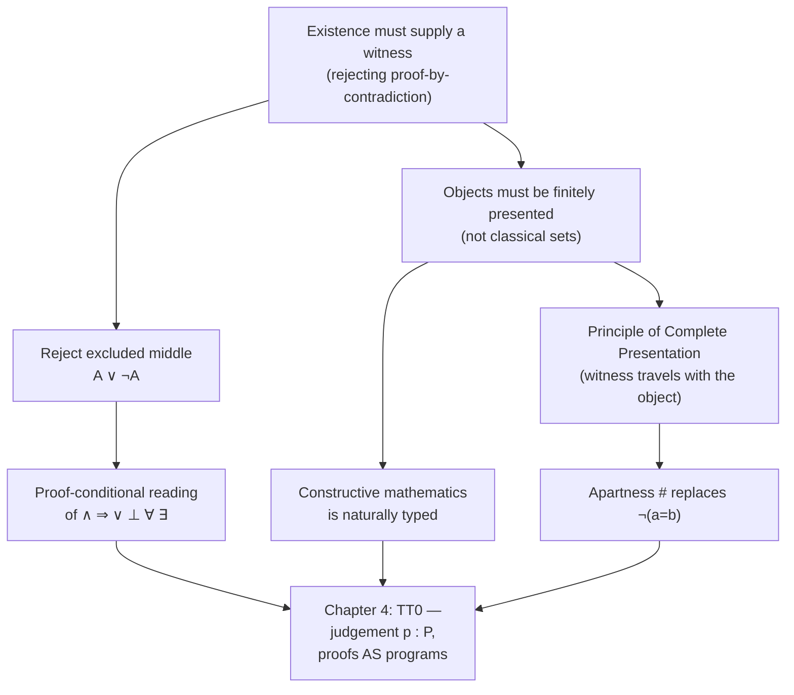

[[book-guidelines|↩ Back to guidelines]]

# Constructive Mathematics

Thompson calls this chapter "an hors d'oeuvre" — eight pages standing in front of a whole tradition of philosophical argument (Bishop, Beeson, Dummett) that he explicitly defers to. But it is a *load-bearing* hors d'oeuvre: everything Chapter 4 builds — the judgement $p:P$, the identification of proofs with programs — is the formal payoff of a philosophical position this chapter stakes out first. If you skip straight to the rules of $TT_0$, you'll learn the syntax without ever knowing *why* it has to work this way. This chapter is that "why."

## The problem: what does it mean to prove something exists?

Here's the motivating tension. Every working mathematician learns, typically in their first year, a proof technique for existence claims: to prove $\exists x. P(x)$, it suffices to show that $\forall x. \neg P(x)$ leads to a contradiction. This is proof by contradiction applied to an existential.

Notice what that proof actually hands you. It shows that *assuming no such $x$ exists* is untenable. It does not exhibit an $x$. It does not tell you how to compute one, search for one, or even bound where one might live. You walk away from a completely rigorous, classically valid proof holding nothing but the knowledge that denial is impossible.

The constructivist's objection isn't "that proof is wrong" — classically it's perfectly sound. The objection is: **that proof isn't what an existence claim should mean.** If you want $\exists x. P(x)$ to carry information you could act on — feed into an algorithm, use to actually locate the root of a polynomial, actually bisect an interval — then a proof of it has to *supply* an $x$ together with a proof that $P(x)$ holds of that specific $x$. Thompson puts it plainly: "the proof of existence must supply a $t$ and show that $P(t)$ is provable."

This is the seed of everything that follows. Trace it forward and it forces you to reject a classical logical law, redefine what every connective means, redefine what a mathematical object *is*, and redefine equality itself. That's the chapter, in miniature.

## Why classical logic is incompatible with this view

The license for proof-by-contradiction-of-existentials is the **law of the excluded middle**:

$$A \vee \neg A$$

Instantiate it at $\exists x. P(x)$:

$$\exists x. P(x) \vee \neg\exists x. P(x)$$

If you've shown $\forall x. \neg P(x)$ (equivalently $\neg \exists x. P(x)$) is contradictory, excluded middle lets you discharge to the left disjunct: $\exists x. P(x)$ must hold. So excluded middle is precisely the classical machinery that lets you assert existence without ever producing a witness.

The constructivist therefore has to reject excluded middle as a general law — not as a matter of taste, but as a direct consequence of taking existence claims seriously as demands for evidence. This is the single hinge the whole chapter turns on: **rejecting classical existence proofs forces you to reject the classical semantics of truth itself** — "every statement is seen as true or false, independently of any evidence either way," as Thompson puts it. Constructive logic replaces that idealist truth-semantics with a **proof-conditional** semantics: a statement is asserted only when you hold a proof of it, and what counts as "a proof" is spelled out connective by connective, not read off a two-valued truth table.

### Bishop's example: excluded middle smuggled into ordinary analysis

The chapter doesn't leave this abstract. Thompson works through Bishop's own example showing that a completely standard classical theorem — *every bounded non-empty set of reals has a least upper bound* — is not just non-constructive in some vague sense, it actually **entails instances of excluded middle**, and is therefore exactly as suspect as excluded middle itself.

Fix an arbitrary predicate $P$ on the naturals (say, "the Goldbach conjecture holds up to $n$," or anything else undecided). Define the sequence

$$r_n \;\equiv_{df}\; \begin{cases} 1 & \text{if } P(n) \\ 0 & \text{otherwise} \end{cases}$$

Now ask: what is the least upper bound of $\{r_n \mid n \in \mathbb{N}\}$? It is $1$ exactly when *some* $n$ makes $P(n)$ true, i.e. iff $\exists x. P(x)$; otherwise it's $0$. If the least-upper-bound property held constructively, you could *decide* which case you're in — and that decision is precisely a proof of

$$\exists x. P(x) \vee \neg \exists x. P(x)$$

for an *arbitrary* $P$. But that's [[Foundations-and-Related-Systems#The general schema|the general schema]] for excluded middle applied to existentials — and if you could always decide it, you'd have a general algorithm answering things like the Goldbach conjecture or the halting problem. Thompson names this specific instance the **limited principle of omniscience**, and treats its unprovability as strong evidence that no constructive proof of the classical least-upper-bound property can exist. One classical theorem, unpacked, turns out to be a Trojan horse for full excluded middle.

**What breaks without rejecting excluded middle:** you lose the ability to distinguish "I proved this exists" from "I proved it's impossible for this not to exist." Those look identical classically but the first gives you a program and the second gives you nothing executable. A type theory whose whole point is programs-from-proofs cannot afford to conflate them.

## The constructive reading of the connectives

Once excluded middle is off the table, every logical connective needs a *proof-conditional* reading — not "when is this true" but "what would count as evidence for this." This is the "informal view" that Chapter 4 will later formalize as introduction/elimination rules, so it's worth internalizing now, before the notation shows up.

- **$A \wedge B$**: a proof is a pair $(p, q)$ with $p : A$ and $q : B$. (Thompson notes this one is uncontroversial even classically.)
- **$A \vee B$**: a proof is *either* a proof of $A$ *or* a proof of $B$, tagged with which one it is. This is the sharpest departure from classical logic: classically you can assert $A \vee \neg A$ without knowing which disjunct holds. Constructively that's not a proof of anything — a disjunction proof must let you "read off a proof of one of $A, B$... and moreover know which it proves."
- **$A \Rightarrow B$**: a proof is a *method* — a function — transforming any proof of $A$ into a proof of $B$. Given $a : A$ and $f : A \Rightarrow B$, applying $f$ to $a$ produces a proof of $B$.
- **$\bot$**: has no proof, by definition.
- **$\neg A$**, defined (not primitive): $\neg A \equiv_{df} A \Rightarrow \bot$ — a function turning any proof of $A$ into a proof of the absurd. Because a proof of $\neg A$ is a function into an *uninhabited* type, it carries no positive computational content — which is exactly why $\neg\neg A \Rightarrow A$ fails constructively: double negation gives you a proof that a proof of $A$ would be absurd, not a proof of $A$.
- **$\forall x. P(x)$**: a proof is a transformation taking an *arbitrary* $a$ to a proof of $P(a)$.
- **$\exists x. P(x)$**: a proof is a **pair**: a witness $a$, and a proof of $P(a)$. This is the formal shape of the demand the chapter opened with.

Given these readings, a slate of classical tautologies simply stop being provable: $\neg\neg A \Rightarrow A$, $\neg(\neg A \wedge \neg B) \Rightarrow (A \vee B)$, $\neg\forall x.\neg P(x) \Rightarrow \exists x. P(x)$. Each one is, structurally, another route to smuggling in a witness-free existence claim.

**Worked derivations.** Thompson gives two small proof terms to make the "proof is a program" idea concrete before Chapter 4 formalizes it. A proof of $(A \wedge B) \Rightarrow (B \wedge A)$: given $p : A \wedge B$, split it as $p_1 : A$, $p_2 : B$ via projections $\mathit{fst}$/$\mathit{snd}$, and rebuild in the swapped order:

$$\lambda p.\,(\mathit{snd}\ p,\ \mathit{fst}\ p)$$

And a proof of $((A \vee B) \Rightarrow C) \wedge A \Rightarrow C$: split the pair into $q : (A \vee B) \Rightarrow C$ and $r : A$; inject $r$ into the disjunction as $\mathit{inl}\ r : A \vee B$; apply $q$:

$$\lambda(q, r).\,q(\mathit{inl}\ r)$$

Already, in Chapter 3, before a single formal typing rule has been introduced, proofs *look like* programs — $\lambda$-terms, pairing, projection, tagged injection. That's not a coincidence Thompson is building toward; it's the punchline he's previewing.

### Grounding: proof objects as data

This proof-conditional reading is exactly what an `enum`/pattern-match discipline already gives you for free — which is *why* Curry–Howard feels natural to a programmer and alien to a classically-trained mathematician.

```rust
// A proof of A ∨ B: constructively you MUST know which side you have.
enum Or<A, B> {
    Left(A),
    Right(B),
}

// A proof of ∃x:A. P(x): a witness paired with evidence about it.
struct Exists<A, P> {
    witness: A,
    evidence: P, // in a dependently-typed setting, P's type would depend on `witness`
}

// A proof of A ⇒ B: literally a function from proofs to proofs.
fn implies<A, B>(f: impl Fn(A) -> B, a: A) -> B {
    f(a)
}

// ¬A ≡ A ⇒ ⊥: a function into an uninhabited type.
enum Absurd {} // no constructors — nothing can produce this
fn not_a<A>(f: impl Fn(A) -> Absurd) {}
```

Rust's type system doesn't let you write `let x: Or<A,B> = ...;` and *not* know whether you have a `Left` or a `Right` — pattern matching forces the case split. That is the constructive reading of $\vee$, verbatim: excluded middle would be an *opaque* `Or<A,B>` value you're allowed to hold without knowing which arm produced it, and Rust's `enum` simply doesn't permit that.

In **Lean**, this correspondence is not an analogy but a literal implementation choice. Lean's core `Or` is an inductive type with constructors `Or.inl` and `Or.inr` — precisely the tagged-proof reading above — and classical excluded middle (`Classical.em`) has to be pulled in from a separate `Classical` axiom module, *because it is not derivable from the constructive core*. That axiom boundary in Lean's standard library is the exact fault line this chapter is describing: everything on the constructive side of it computes; `Classical.em` does not reduce to a canonical `inl`/`inr` value, it just asserts one exists. If you ever wonder why Lean bothers to quarantine classical reasoning behind `open Classical` or `Classical.byContradiction`, this chapter is the philosophical justification — those tactics prove a proposition is *true* without necessarily giving you anything that evaluates.

A quick **Python** sketch of the same $(A\wedge B)\Rightarrow(B\wedge A)$ proof-as-program, for intuition rather than rigor:

```python
def swap(p):        # p : A ∧ B, represented as a tuple
    a, b = p
    return (b, a)    # : B ∧ A
```

That `swap` function *is* the proof term $\lambda p.(\mathit{snd}\ p, \mathit{fst}\ p)$ — running it is simultaneously "executing the program" and "checking the proof."

## Mathematical objects: the rejection of set-theoretic encoding

The chapter's second move attacks a different classical habit: reducing every mathematical object to a set. Classically, a pair $(a,b)$ *is* the set $\{\{a\},\{a,b\}\}$; the number $4$ *is* the set $\{\emptyset, \{\emptyset\}, \{\emptyset,\{\emptyset\}\}, \{\emptyset,\{\emptyset\},\{\emptyset,\{\emptyset\}\}\}\}$; a function is the (possibly infinite) set of its input–output pairs. Thompson gives the successor function's set-encoding: $\{(0,1),(1,2),(2,3),\ldots\}$, unfolded further into nested singleton-and-pair sets — genuinely unreadable, and that unreadability is the point.

Two objections, both consequences of the same underlying commitment:

**1. Infinitary objects have no computational content.** An arbitrary function's graph-as-a-set is, in general, an infinite object with no finite description — you cannot hand it to an algorithm. Thompson states the constructive alternative as a governing tenet:

> Every object in constructive mathematics is either finite, like natural or rational numbers, or has a finitary description, such as the rule $\lambda x.\, x+1$, which describes the successor function over the natural numbers.

A real number, similarly, is presented not as an infinite set but as a *finitary rule* — an algorithm computing $n \mapsto a_n$ for an approximating sequence $(a_n)_n$.

**2. Set encoding erases type distinctions that mathematical practice actually respects.** Since everything is a set, nothing stops you from forming $(3,4) \cup 0 \cup \mathit{succ}$ — a "pair union number union successor-function," which is well-formed set theory and semantically meaningless mathematics. Ordinary practice never conflates numbers, functions, and pairs; the set-theoretic foundation is *more permissive* than the mathematics built on top of it. Thompson's conclusion: "the objects of mathematics are quite naturally thought of as having types rather than all having the trivial type 'set'." He states this as a slogan:

> Constructive mathematics is naturally typed.

One immediate corollary: quantification in a constructive setting is always *typed* quantification — $\forall x{:}A.\, P(x)$, never a bare, untyped $\forall x.\, P(x)$ ranging over "everything." This is the philosophical seed of the dependent function/sum types Chapter 4 formalizes.

**What breaks without types-as-primitive:** you lose the ability to say, syntactically, that an expression is *malformed*. $(3,4) \cup 0 \cup \mathit{succ}$ typechecks in set theory. A type discipline is precisely a mechanism for ruling such expressions out before you even ask whether they're true.

### Grounding: this is the argument for algebraic data types

This is exactly the design argument for `enum`/sum types over an untyped "everything is a dict/list/set" representation.

```rust
// Untyped-set style (don't do this): everything crammed into one
// universal representation, distinctions enforced only by convention.
enum UniversalObject {
    AnySet(std::collections::BTreeSet<UniversalObject>),
}
// Nothing stops you from building the equivalent of (3,4) ∪ 0 ∪ succ.

// Constructively-typed style: the type itself rules out nonsense.
enum MathObject {
    Nat(u64),
    Pair(Box<MathObject>, Box<MathObject>),
    Fn(/* some representation of a finitary rule */),
}
// A pair unioned with a function is not a MathObject at all —
// it's not a type error caught at proof-time, it's not expressible.
```

**Lean** makes the "finitary rule, not infinite graph" point unusually vivid: a Lean function `f : Nat → Nat` is compiled/interpreted code — an actual finite rule you can evaluate — never internally represented as its (infinite) graph. Definitional equality checking (`isDefEq`, what Lean's kernel does when it needs to know two terms reduce to the same normal form) is only decidable *because* every object is given by a finite rule that terminates in finitely many reduction steps. If Lean terms were literally infinite sets, as in the classical encoding, there would be nothing for the kernel's equality check to terminate on. This is a direct, load-bearing instance of Thompson's tenet: computational content requires finite presentation, and Lean's entire kernel design assumes it.

## The Principle of Complete Presentation

Granting that objects must be typed and finitely presented, Thompson tightens the requirement one notch further with a named principle. Take the reals again: presenting a real number as a Cauchy sequence $(a_n)_n$ satisfying

$$\forall n.\, \exists m.\, \forall i \geq m.\, \forall j \geq m.\; |a_i - a_j| < 1/n$$

is *not enough* just to hand over the sequence. You additionally need the **witness** — a modulus-of-convergence function $\mu$ together with a proof that $\forall n. \forall i \geq \mu(n). \forall j \geq \mu(n).\, |a_i - a_j| < 1/n$. Without $\mu$, you have a sequence that merely *happens* to converge (a classical, existence-only claim); with $\mu$, you have an object that *carries the evidence of its own convergence*, so that any later user of this real number can extract, algorithmically, how many terms they need for any desired precision.

This generalizes to the chapter's central slogan:

> **Principle of Complete Presentation.** Objects in constructive mathematics are completely presented, in the sense that if an object $a$ is supposed to have type $A$ then $a$ should contain sufficient witnessing information so that the assertion can be verified.

Thompson is candid that this is an ideal, not always honored in practice: he notes that even Bishop, who endorses the principle, adopts "a policy of systematic suppression of the evidence, invoking it only when it is necessary" — and flags that this "schizophrenic attitude" (evidence formally required, but elided whenever convenient) will pervade the formal systems the book goes on to build. That tension — carry the proof term everywhere versus suppress it as computationally irrelevant — resurfaces explicitly later as the book's treatment of *computational irrelevance* (§7.1.2) and the subset type (Chapter 14). This chapter is where the tension is first named, not where it's resolved.

**Why does this matter for equality?** Once objects are complete presentations, equality of infinite objects (like reals) can't be checked syntactically the way equality of naturals can. Two reals $(a_n)_n, (b_n)_n$ are equal exactly when they converge to the same limit:

$$\forall n.\, \exists m.\, \forall i \geq m.\, \forall j \geq m.\; |a_i - b_j| < 1/n$$

— itself an infinitary, unbounded-quantifier statement, not something you can decide by inspection. This is precisely why arbitrary reals are *not* decidably equal or unequal in constructive mathematics — deciding $a = b \vee a \neq b$ for arbitrary reals would again be an instance of the limited principle of omniscience.

### Grounding: complete presentation as "pack the proof with the data"

This is the *dependent pair* / *proof-carrying data* pattern, and it's directly load-bearing for a checker/verifier project: any time you're tempted to have a function return `bool` for "is this valid," complete presentation says: return the *evidence*, not just the verdict.

```rust
// Incomplete presentation: "trust me, this sequence converges."
struct Real1 {
    terms: Box<dyn Fn(u64) -> Rational>,
}

// Complete presentation: the witness (modulus of convergence) and
// the obligation to eventually justify it travel with the object.
struct Real2 {
    terms: Box<dyn Fn(u64) -> Rational>,
    modulus: Box<dyn Fn(u64) -> u64>, // µ(n): index beyond which terms are within 1/n
    // in a fully dependently-typed setting, a genuine proof term would
    // sit here too, typed against `terms` and `modulus`; Rust can't
    // express that dependency, so this is where the analogy has to stop.
}
```

**Lean**'s `Subtype`/`{x // p x}` is the most literal rendering: a value of `{x : α // p x}` is, by construction, a pair of the underlying value and a proof `p x` — you cannot construct one without discharging the proof obligation at construction time. This is complete presentation as a first-class kernel-level type, not a convention you have to remember to follow.

## Apartness in place of inequality

The chapter's last technical move follows from a general precept Thompson states directly:

> Negative assertions should be replaced by positive assertions whenever possible.

The classical relation "$a \neq b$" is negative: it's defined as $\neg(a = b)$, i.e. a function showing that a proof of $a=b$ would be absurd — which, as established above, carries no *constructive* information about *how* $a$ and $b$ differ. For reals in particular, deciding $a = b \vee a \neq b$ in general is (again) the limited principle of omniscience.

The constructive replacement is **apartness**, written $a \# b$, defined *positively*: two reals $(a_n)_n$, $(b_n)_n$ are apart if

$$\exists n.\, \exists m.\, \forall i \geq m.\, \forall j \geq m.\; |a_i - b_j| > 1/n$$

This says something an algorithm can actually *use*: there exist an $n$ and a bound $m$ beyond which the two sequences stay separated by at least $1/n$ — a quantitative, checkable certificate of distinctness, not merely the denial of coincidence. Apartness is "a strong enough notion to replace the classically equivalent inequality," in Thompson's words, precisely because it is constructively provable in cases where bare negated-equality is not.

### Grounding: apartness as "give me the certificate, not the negation"

The apartness pattern shows up anywhere you replace a boolean negative check with a positive, inspectable witness of difference — this is exactly the shape of the diagnostics a good type-checker or unifier needs to emit.

```rust
// Negative style: tells you THAT they differ, gives you nothing to act on.
fn not_equal(a: &Real, b: &Real) -> bool { !equal(a, b) }

// Apartness style: a positive certificate — an index n, a bound m,
// and (implicitly) the guarantee that beyond m the sequences are
// provably > 1/n apart. This is something a unifier can actually
// use to report *where* and *by how much* two terms fail to unify,
// rather than just "unification failed."
struct Apartness {
    n: u64,
    m: u64,
    // certificate: proof that ∀i,j ≥ m, |a_i − b_j| > 1/n
}
fn apart(a: &Real, b: &Real) -> Option<Apartness> { /* ... */ None }
```

If you're building a unifier — this is directly relevant to metavariable/pattern-unification work — "unification failed" as a bare boolean is the $\neg(a=b)$ style; a good elaborator's occurs-check or rigid-rigid mismatch diagnostic is closer to apartness: it doesn't just deny equality, it *points at* the specific subterms and reason the match cannot succeed. Thompson's apartness relation is the mathematical ancestor of that engineering instinct.

## The worked example: two Intermediate Value Theorems

The chapter closes by cashing out all of the above on a single, concrete theorem — deliberately choosing one central to real analysis, to show the cost of constructivizing is real and not merely philosophical.

**Classical IVT (Theorem 3.1).** Suppose $f$ is continuous on $[0,1]$ with $f(0) < 0$ and $f(1) > 0$. Then there is an $r \in [0,1]$ with $f(r) = 0$.

This theorem is *not* constructively provable in this exact form — proving it classically routes through the least-upper-bound property, which (via Bishop's $r_n$ example above) smuggles in excluded middle. There is, in general, no algorithm that locates an *exact* zero of an arbitrary continuous $f$ satisfying only these hypotheses — continuity alone doesn't give you a modulus telling you how fast to narrow your search, and an exact real root might not even have a finite presentation reachable from the data you were given.

**Constructive IVT (Theorem 3.2).** Suppose $f$ is continuous on $[0,1]$ with $f(0) < 0$ and $f(1) > 0$. Then for all $\varepsilon > 0$ there is an $r \in [0,1]$ with $|f(r)| < \varepsilon$.

This weaker statement *is* constructively provable — you can bisect the interval, using the sign of $f$ at the midpoint to decide which half to recurse into, and after finitely many steps land within $\varepsilon$ of an actual zero. Thompson's gloss: "the constructive version states that we can get arbitrarily close to the root, and of course, that is all we could expect to do, from a computational point of view."

This is the chapter's single clearest illustration of a pattern flagged in the guidelines and worth internalizing on its own: **constructivizing a classical result routinely splits one theorem into several constructively inequivalent ones**, of which typically only the weaker survives without qualification. The exact-existence theorem and the approximate-existence theorem are classically equivalent (given LEM, $\exists r. f(r)=0$ follows from "we can get arbitrarily close" plus completeness) but constructively distinct — and only the second one hands you a *program*: a bisection algorithm you can actually run.

### Grounding: this is why "returns a bool" verifiers under-deliver

A Rust sketch of the constructive IVT as a literal terminating algorithm — the theorem, quite directly, *is* this function:

```rust
/// Constructive IVT: returns r with |f(r)| < eps, by bisection.
/// This function's existence IS the constructive proof —
/// there is no separate "proof term" apart from this algorithm
/// plus a termination argument (the interval halves each step).
fn constructive_ivt(f: impl Fn(f64) -> f64, mut lo: f64, mut hi: f64, eps: f64) -> f64 {
    // precondition: f(lo) < 0, f(hi) > 0
    loop {
        let mid = (lo + hi) / 2.0;
        let fm = f(mid);
        if fm.abs() < eps {
            return mid;
        } else if fm < 0.0 {
            lo = mid;
        } else {
            hi = mid;
        }
    }
}
```

There is no algorithm with this same signature computing an *exact* zero for arbitrary continuous $f$ — that's the classical theorem, and it has no constructive witness-producing counterpart in general. In **Lean**, this distinction is visible at the type level: a classical existence proof `∃ r, f r = 0` obtained via `Classical.choice`/completeness-of-the-reals arguments is *opaque* — you cannot `#eval` it to extract a numeral. A constructive proof phrased as `∀ ε > 0, ∃ r, |f r| < ε` together with a genuinely computable witness function *can* be evaluated, exactly mirroring the Rust bisection above. The gap between "Lean proved this exists" and "Lean can compute this for you" is precisely the gap this worked example is illustrating.

## Where this leads



Every thread in this chapter reappears, formalized, almost immediately: the proof-conditional readings of $\wedge, \Rightarrow, \vee, \bot, \forall, \exists$ become Chapter 4's formation/introduction/elimination/computation rules for each connective — this chapter is doing informally, in prose, exactly what Chapter 4 will do with derivation trees. "Constructive mathematics is naturally typed" is the direct motivation for judgements of the form $p:P$ replacing bare provability. The Principle of Complete Presentation resurfaces explicitly as *computational irrelevance* (§7.1.2) and drives the entire, difficult later discussion of the subset type (Chapter 14) — the recurring question of when it's safe to *suppress* a witness Bishop-style versus when the Principle demands you keep carrying it. And the real-number apartness relation returns almost unchanged as the worked case study of quotient types in §7.6 (the constructive reals as a quotient of regular Cauchy sequences).

For the standing project: this chapter is the philosophical justification for treating "type-checking" and "proof-checking" as the same activity — not a coincidence discovered later, but the founding motivation. A verifier that checks logic-clause specifications is, in Thompson's framing, doing nothing more exotic than checking that a claimed proof object is a *complete presentation* of its type; and the apartness-over-negation move is worth keeping in mind whenever a future unifier needs to report *why* two terms fail to match rather than just that they do.
