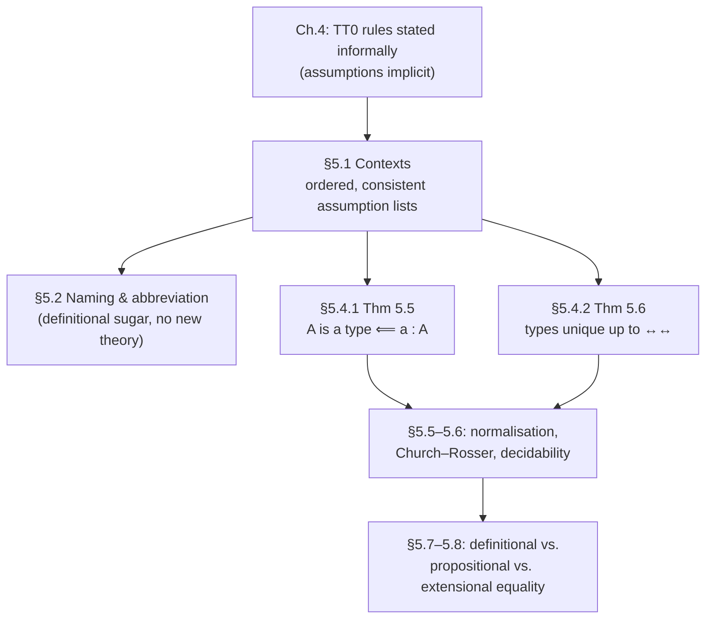

# Contexts, Derivability and Type Uniqueness

[[book-guidelines|↩ Back to guidelines]]

## Why this chapter exists

Chapter 4 handed you the rules of $TT_0$ and let you *use* them — build proofs, build programs, watch the Curry–Howard correspondence line up formula-for-formula with type. Chapter 5 stops using the system and starts interrogating it. Thompson opens by admitting the informal presentation glossed over real structural questions: what exactly is an "assumption," in what order can you introduce and discharge them, and — a question that sounds almost too basic to need a theorem — if you know `a : A`, do you actually know that `A` is a legitimate type? In a language with a type checker built into your head (Rust, Python, anything you've internalized), this last question feels absurd: of course if something typechecks, its type is well-formed, otherwise the checker would never have accepted it. But $TT_0$ as presented in Chapter 4 doesn't *automatically* guarantee this — Thompson has to go back and reinforce several rules before the guarantee holds. That's the payoff of §5.4: two theorems (5.5 and 5.6) that turn "well-formedness of types" and "uniqueness of typing" from tacit assumptions into proved properties.

This matters for anyone building a real type checker: it's exactly the moment where "the rules I wrote down" and "the invariants my checker needs to hold" come apart, and you have to check the gap explicitly, by induction over derivations. If you're writing a Rust verifier or a Lean-style elaborator, this chapter is a worked example of precisely the kind of soundness argument your own system will eventually need — proved by hand here, so you can see the *shape* of that argument before you have to write it as code.

## Assumptions and contexts: the plumbing under every proof

### The problem: assumptions aren't independent

A derivation in $TT_0$ can involve several open assumptions at once, and Thompson's first observation is that these don't just form an unordered set — there's a **dependency ordering** among them, because the *type* of one assumption can mention a *variable* introduced by an earlier one.

Concretely: to introduce the identity type $I(A,a,b)$ as a type, you first need $A$ to be a type, then $a:A$, $b:A$ as assumptions, and only *then* can you assume a variable of that dependent type:

$$
\underbrace{\vphantom{x}}_{\Gamma \vdash A \text{ is a type}}
\quad
\underbrace{a:A}_{\text{(AS)}}
\quad
\underbrace{b:A}_{\text{(AS)}}
\;\Longrightarrow\;
I(A,a,b) \text{ is a type}
\;\Longrightarrow\;
x : I(A,a,b) \quad \text{(AS)}
$$

So the assumption $x:I(A,a,b)$ sits *below* the assumptions on $a$ and $b$ in the derivation tree — it structurally depends on them. This is the book's worked example, the symmetry-of-equality proof: from $x : I(A,a,b)$ and the reflexivity proof $r(a) : I(A,a,a)$, $I$-elimination gives $J(x,r(a)) : I(A,b,a)$, and the goal is to discharge $a$, $b$, and $x$ to get a closed proof of $(\forall a{:}A).(\forall b{:}A).(I(A,a,b)\Rightarrow I(A,b,a))$.

### Discharge order is not free

Here's the failure mode if you discharge carelessly. Suppose you discharge $a:A$ *first*, forming $\lambda a . J(x,r(a))$. This expression still has $x$ free in it — and the type of that free $x$ is $I(A,a,b)$, which mentions $a$. But $a$ is now *bound* inside the $\lambda$-abstraction you just built. So the free occurrence of $x$ outside the abstraction has a type that refers to a variable now out of scope — exactly the "use of a variable outside its scope" error a compiler would flag. Thompson states the rule plainly:

> We may only discharge an assumption $a:A$ if the variable $a$ does not appear free in any other [undischarged] assumption.

So the correct order in the example is: discharge $x$ first (via $\Rightarrow$-introduction), *then* $b$ (via $\forall$-introduction), *then* $a$ last. Each discharge event is labeled with a bracket and a matching rule instance — $[x:I(A,a,b)]^1$ paired with the $(\Rightarrow I)^1$ that consumes it — exactly like natural-deduction assumption tracking from Chapter 1, now applied to a system where assumption *types* can themselves depend on other assumptions.

**Grounding — this is scope-checking, not proof theory.** If you've written a compiler pass that rejects a closure capturing a variable that's later shadowed or gone out of scope, you've implemented this rule already. In Rust terms:

```rust
enum Assumption {
    Var { name: String, ty: TypeExpr },
}

/// Can we discharge `target` from this context right now?
fn can_discharge(target: &str, ctx: &[Assumption]) -> bool {
    // No other (still-open) assumption's type may mention `target` free.
    ctx.iter()
        .filter(|a| a.name != target)
        .all(|a| !free_vars(&a.ty).contains(target))
}
```

The dependent-type twist is that this isn't just a name-scoping discipline for *terms* — it's a scoping discipline for *types*, because in $TT_0$ types can contain terms (e.g. $I(A,a,b)$ contains the term variables $a,b$). This is precisely the plumbing your Rust verifier will need for any dependent or refinement-typed construct: a Hoare-triple precondition mentioning a program variable is exactly this same dependency, and "can I discharge/generalize this variable" is exactly this same check.

### Multiple assumptions and consistency

The same variable can appear as an assumption more than once in a derivation tree (e.g. $a:A$ used in two separate branches feeding into $\wedge$-introduction). Thompson's requirement: whenever this happens, **all assumptions about the same variable must agree on its type**, up to renaming of bound variables. This is checked at every rule application with more than one hypothesis. Discharging $a$ then discharges *every* occurrence in the tree simultaneously — but critically, it discharges only assumptions *named* $a$, not every variable that happens to have type $A$.

### The formal packaging: contexts

Definition 5.1 crystallizes all of this into an explicit object, the **context**: a list

$$x_1 : A_1, \ldots, x_n : A_n$$

subject to three conditions:

1. $x_i$ may occur free only in $A_j$ for $j > i$ (later types may depend on earlier variables, never the reverse — this is why it's a *list*, not a set);
2. each $A_{j+1}$ being a type must itself be a consequence of the assumptions before it, $x_1{:}A_1,\ldots,x_j{:}A_j$;
3. the variable names $x_j$ are pairwise distinct.

Writing $\Gamma \vdash J$ for "judgement $J$ derivable from context $\Gamma$," **Definition 5.2** then defines context consistency (two contexts agree on the type of every shared variable) and derivation consistency: any two-hypothesis rule application $\dfrac{\Gamma \vdash J \quad \Gamma' \vdash J'}{\Gamma'' \vdash J''}$ requires $\Gamma,\Gamma'$ consistent and their merge $\Gamma''$ to itself be a valid context; discharge of $x_j:A_j$ from $\Gamma$ is only legal if $x_j$ is free in no later assumption.

**What breaks without this:** without condition 1 (the ordering), you could write a context where a type mentions a variable declared *after* it — a forward reference to something that doesn't exist yet at that point in the list. Without condition 3 (distinctness) you'd have shadowing ambiguity in exactly the way an unscoped symbol table breaks. This is the direct ancestor of a typing context / environment `Γ: Vec<(Ident, Type)>` in any type checker you'd write — and the ordering + dependency condition is precisely why a dependently-typed context can't just be a `HashMap<Ident, Type>`: order matters, and validity of a later entry's type is *checked against* the earlier entries, not assumed. This is your `Γ ⊢ Γ ok` well-formedness judgment, wearing a different notation.

**Lean correspondence.** This is exactly Lean's `LocalContext` — an ordered sequence of local declarations where each declaration's type may only reference `fvarId`s introduced earlier. Lean's kernel rejects (or rather, cannot even construct) a context violating this ordering, for the same scope reason Thompson gives informally.

## Naming and abbreviation: definitional sugar, not new theory

§5.2 is a shorter, more practical section: it's about making $TT_0$ *usable* without changing what's derivable. Thompson introduces:

- **Plain naming**: `name ≡ df expression` — pure shorthand, definitionally identical to the right-hand side. No recursive naming allowed (no using `name` in its own definition, and no forward references) — this rules out indirect mutual recursion by fiat, keeping the naming layer purely a matter of readability, not a new expressive mechanism.
- **Labeled injections**: renaming `inl`/`inr` for a sum type, e.g. `numOrBool ≡df num N + boo bool`, so objects look like `num n` or `boo b`.
- **Curried-definition shorthand**: writing `f x ≡df e` instead of the fully explicit `f ≡df λx^A . e`.
- **Pattern-style equational definitions**, mirroring Miranda's case-based syntax. Given `g n ≡df e` and `h b ≡df f`, instead of writing out `cases` explicitly you write
$$
c\;(\mathtt{num}\ n) \equiv_{df} e \qquad c\;(\mathtt{boo}\ b) \equiv_{df} f
$$
  which expands to `c ≡df λp . cases p (λn.e) (λb.f)`. The book's worked example is `toNum`, converting a boolean-or-number value to a number.
- **Constrained recursive definitions** over an inductive type, restricted to *exactly* the shape the recursor allows — e.g.
$$
fac\ 0 \equiv_{df} 1 \qquad fac\ (succ\ n) \equiv_{df} mult\ (succ\ n)\ (fac\ n)
$$
  where the recursive clause may only call `fac n` and `n` themselves — nothing more general. This is definitional sugar for the fully explicit primitive-recursor application `fac ≡df λn.(prim n 1 (λp,q.(mult (succ p) q)))`. The constraint matters: it's precisely what keeps the sugar inside the recursor's guarantee of termination — you're not allowed to write a `fac` clause that recurses on some arbitrary subterm, only on the recursor's designated predecessor.

**Grounding.** This whole section is the informal specification of what a *desugaring* pass in a compiler does. In Rust-pipeline terms, this is exactly the boundary between your surface syntax (pattern-matching `match` arms, `let` bindings) and your typed IR (fully elaborated `case`/recursor applications) — `≡df` is definitional equality in the strongest sense: after full unfolding, the two sides are *syntactically identical* up to bound-variable renaming, not merely provably equal. That distinction — definitional vs. propositional equality — is exactly what your elaborator's `isDefEq` needs to decide (definitional, decidably, by unfolding and normalizing) versus what gets left to the identity type / proof obligations (propositional, requires a proof term). This section is showing you the "cheap" side of that boundary: naming never introduces anything that needs a proof, it only ever needs unfolding.

## Derivability: "A is a type" from "a : A" (Theorem 5.5)

### Why this isn't already obvious

You'd hope this holds automatically: if $a:A$ is derivable, surely $A$ was checked to be a type somewhere along the way, so "$A$ is a type" ought to fall out for free. But Thompson shows the *rules as stated in Chapter 4* don't quite carry this information through every case — some rules produce a new type expression in the conclusion without an explicit premise guaranteeing that expression is a type. The fix is to **augment the rules** with exactly the missing typehood premises, then prove the property by induction over derivations.

Two examples of where the original rules are insufficient:

**$\vee$-introduction.** The Chapter 4 rule
$$
\dfrac{q:A}{\mathtt{inl}\ q:(A\vee B)}\ (\vee I_1)
\qquad
\dfrac{r:B}{\mathtt{inr}\ r:(A\vee B)}\ (\vee I_2)
$$
introduces $B$ (resp. $A$) into the conclusion type out of nowhere — nothing above the line ever asserted $B$ is a type. The repaired rule adds that premise explicitly:
$$
\dfrac{q:A \quad B \text{ is a type}}{\mathtt{inl}\ q:(A\vee B)}\ (\vee I_1')
$$
(In practice this extra premise is usually suppressed once it's clear from context — but it must be *derivable*, not merely assumed.)

**$\exists$-introduction.** Similarly,
$$
\dfrac{a:A \quad p:P[a/x]}{(a,p):(\exists x{:}A).P}\ (\exists I)
$$
needs a third premise that the family $P$ is a type (under the assumption $x:A$), since nothing above the line certifies that $P[a/x]$'s ambient family is well-formed as a family, only that this one instance is.

**Substitution rules.** For a rule like $(S_2)$, $\dfrac{c\leftrightarrow a \quad p(c):B(c)}{p(a):B(a)}$, the induction hypothesis on the premise gives you a derivation of "$B(c)$ is a type"; applying the *corresponding* substitution rule $(S_1)$ to that derivation, $\dfrac{c \leftrightarrow a \quad B(c) \text{ is a type}}{B(a) \text{ is a type}}$, closes the case.

### The theorem and proof shape

> **Theorem 5.5.** Using the modified system of rules, given a derivation of $a:A$ we can construct a derivation of $A$ is a type.

The proof is by structural induction on the derivation of $a:A$: base case is a bare assumption $x:A$ via the (AS) rule, which by definition of a valid context already carries a derivation of "$A$ is a type" (recall condition 2 of Definition 5.1 — this is exactly why contexts required that condition). Inductive cases walk each rule ($\wedge I$, the revised $\vee I$, the revised $\exists I$, substitution rules, etc.), and in each case the augmented premises hand you directly what you need to *build* — not merely assert — a derivation of the type's well-formedness, using the corresponding formation rule.

**Why this is constructive, and why that matters for you:** the proof isn't an existence argument — it's an algorithm. Given a well-typed term, walk its derivation and *produce* the type-well-formedness derivation alongside it. That's precisely the shape of a real type checker's invariant: "if `typecheck(a) == Ok(A)`, then `A` is itself a well-formed type in scope" isn't something you get automatically from Rust's own type system checking your checker — it's a metatheoretic property of your checker's *logic*, and Theorem 5.5 is the proof technique (induction over the typing derivation, case-by-case, each case constructive) you'd use to establish it for your own system. Thompson's aside is worth flagging too: in a "practical system," you wouldn't re-derive typehood every time — once `A is a type` is established you'd cache/reuse it rather than re-running this induction at every use of `a`. That's exactly the difference between a soundness *proof* (do it once, over the whole rule system) and a runtime *implementation* (never repeat the proof's work at runtime — trust the theorem and just look up cached typing judgments).

## Uniqueness of types (Theorem 5.6)

### The obstacle: $TT_0$ as stated does *not* have unique types

Unlike Pascal or Miranda, where every well-typed expression has one type, syntactically identical, Thompson notes $TT_0$ as built so far genuinely fails uniqueness — for structural reasons, not proof-theoretic accidents:

- $\Rightarrow$ and $\wedge$ are officially *shorthand* for the dependent quantifiers $\forall$ and $\exists$ (the non-dependent function/product types are special cases) — so an expression can be typed as $A\Rightarrow B$ and, equally correctly, as $(\forall x{:}A).B$ — the "same" type written two ways.
- The injections `inl`/`inr` don't pin down their codomain: `inl 0` is a valid proof of $(N \vee A)$ for *any* type $A$ whatsoever, since nothing about the term itself constrains $A$.

The fix for the second problem — labeling the injections with their full target type, $\mathtt{inl}_{(N\vee A)}\ 0 : (N\vee A)$ — is the same move as making a Rust enum variant fully qualified rather than inferring it from context; it's the difference between `Result::Ok(x)` needing an ambient expected type to resolve its `E` parameter versus carrying that information syntactically.

Once these fixes are in place, uniqueness holds — but only **up to convertibility** ($\leftrightarrow\!\leftrightarrow$), not up to syntactic identity. That's an important weakening: $A$ and $B$ can be *different expressions* and still count as "the same type" for this theorem, as long as they reduce to a common form.

### The theorem and proof shape

> **Theorem 5.6.** In the theory $TT_0$, if from a consistent collection of assumptions we can derive both $a:A$ and $a:B$, then $A \leftrightarrow\!\leftrightarrow B$.

Proof, again by induction over the derivation of $a:A$:

- **Base case, variable $x:A$.** Either $x:A$ came from a bare assumption — and by *context consistency* (Definition 5.2, the very property contexts were built to guarantee) there's only one type on record for $x$ — or it came via a substitution rule like $(S_4)$: $\dfrac{C\leftrightarrow\!\leftrightarrow A \quad x:C}{x:A}$. Here the induction hypothesis gives uniqueness (up to convertibility) for $x:C$, and the final step is itself a convertibility step, so it composes.
- **Inductive step, case analysis on the last rule.** Thompson works the disjunction case explicitly: if $\mathtt{inl}_{(A\vee B)}\ q$ has type $(A\vee B)$, any *second* type it might have would have to arise from another instance of $(\vee I_1')$, giving some $(A'\vee B)$ — but then $q$ itself would have two types $A, A'$, contradicting the induction hypothesis (uniqueness for $q$, a strictly smaller derivation). Symmetric reasoning handles $\vee$-elimination: `cases p f g` can only have two types if `f` or `g` individually admit two types, again contradicting the inductive hypothesis.

The proof technique is a clean instance of **induction on typing derivations with an "inversion" flavor**: look at what rule could possibly have produced this judgement, and show any second derivation is forced into the same shape by uniqueness at strictly smaller subderivations.

**Why this is exactly your elaborator's problem.** Type uniqueness up to convertibility is the metatheoretic fact that makes bidirectional type checking coherent: when your checker infers a type for a subterm and then needs to compare it against an expected type, it's implicitly relying on the fact that "the type of this term" is well-defined enough to compare — not syntactically unique, but unique up to the same notion of definitional equality your `isDefEq` implements. If types weren't unique even up to conversion, "infer, then check convertible to expected" would be unsound — you could infer the *wrong* one of several valid types and wrongly reject (or wrongly accept) a program. Lean's kernel and elaborator lean on precisely this property: `inferType` returns *a* type, and soundness of the whole bidirectional discipline (switching between inference mode and checking mode) depends on any two types the kernel could infer for the same term being defeq. Theorem 5.6 is the from-scratch proof of the fact your elaborator's architecture takes for granted.

## Synthesis: where this sits in the book's structure



Contexts (§5.1) are the load-bearing structure the rest of the chapter depends on: Theorem 5.5's base case cites context well-formedness directly, and Theorem 5.6's base case cites context *consistency* directly. Both theorems, in turn, are prerequisites the book leans on tacitly from here on — once you know types are unique (up to conversion) and that every well-typed term inhabits a well-formed type, later sections can talk about "the type of an expression" as a meaningful, singular notion, which is exactly what's needed once the book turns to decidability of derivability (§5.6) and to comparing definitional, propositional, and extensional equality (§5.7–5.8). Naming (§5.2) is orthogonal to all of this — pure surface convenience — but it's what makes every worked example from Chapter 6 onward readable rather than an unbroken wall of $\lambda$s and `prim` applications.

**For the standing projects:** this is core, load-bearing material for both. Context well-formedness (§5.1) is precisely the discharge/scoping discipline a Hoare-triple verifier needs to get right before it can even state soundness — a precondition mentioning a variable that's gone out of scope is exactly the malformed-context case Thompson rules out by construction. Type uniqueness up to convertibility (Theorem 5.6) is the metatheoretic guarantee that makes bidirectional inference/checking a coherent architecture at all, rather than an ad hoc heuristic — worth citing by name when you write the soundness argument for your own elaborator's `infer`/`check` split.
