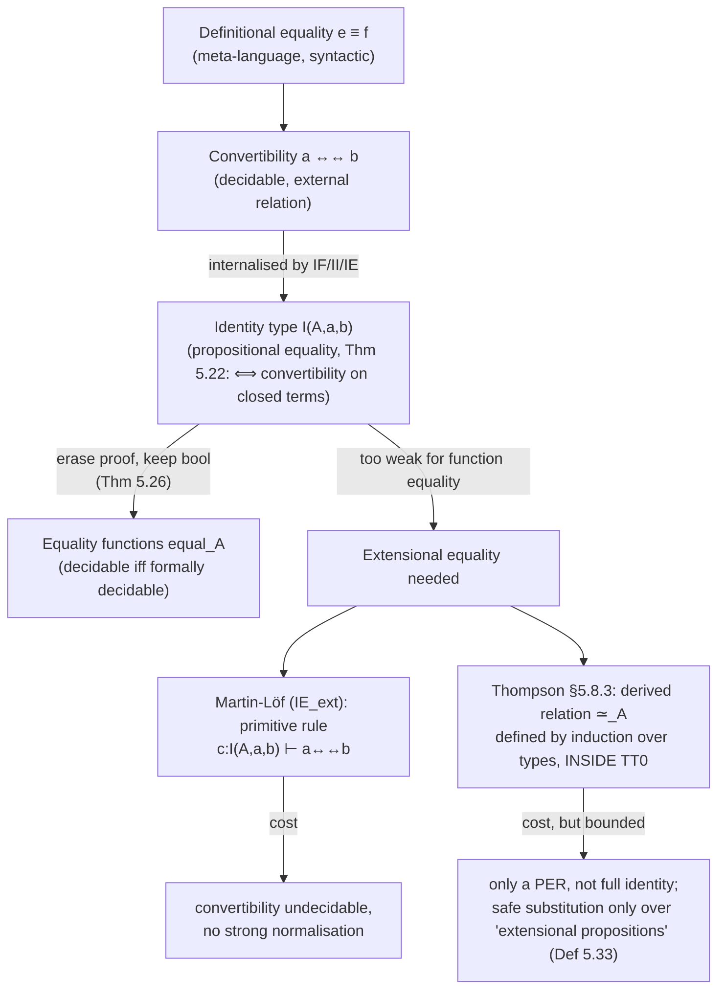

[[book-guidelines|↩ Back to guidelines]]

## Why "equality" isn't one thing

If you've only worked with `==` in a mainstream language, "equality" feels like a solved problem: you write an `Eq` instance (or `__eq__`, or `PartialEq`), it returns a boolean, done. Type theory forces you to notice that this single word is quietly doing at least four different jobs, and that conflating them either breaks the system's good metatheoretic properties (decidability, normalisation) or makes it too weak to prove the things you actually want to prove (like "these two implementations of `add_one` compute the same function").

The earlier article on [[The-Formal-System-of-Type-Theory-(TT0)|the formal system]] introduced the identity type $I(A,a,b)$ — formation, introduction via $r(a)$, elimination via $J$ — as *a* notion of equality. This article is about the fact that it's only *one* of several, why the book needs all of them, and what happens when you try to make equality do more than the intensional system was built to let it do. Thompson opens §5.7 by naming this directly: "In the discussion thus far can be found four different notions of equality or identity."

## The four notions, and why each one exists

### 1. Definitional equality $e \equiv f$ — a meta-language identity, not a proposition

This is the coarsest and most primitive relation, and it lives *outside* the object system entirely — in the language you and Thompson use to talk *about* the system. Two terms are definitionally equal, written $e \equiv f$, "if they are identical up to change of bound variable after all the defined terms, introduced by means of the definitional equality '$\equiv_{df}$', have been expanded out." There's no proof object for this — it's not a judgement you derive, it's a syntactic fact you check (the book flags, almost as an aside, that a real implementation still has to do work to decide this reliably, e.g. hygienic renaming of bound variables).

**What breaks without it.** Without some notion of "these two pieces of notation just are the same object," you couldn't even state the other rules — every rule that says "the type $B[a/x]$" implicitly assumes a stable notion of literal syntactic identity to talk about substitution results at all. It's the floor everything else stands on, not a relation you reason *within* the theory about.

**Grounding.** This is exactly what a compiler's parser + macro-expander does before type checking ever starts: `let x = 2 + 2` and a literal `4` are not definitionally equal as *source text*, but two alpha-renamed copies of the same AST after desugaring are — this is closer to comparing normalized ASTs than to any runtime notion of equality. In Lean terms, this is the layer *below* `isDefEq` — it's closer to syntactic term equality after macro/notation expansion, before any reduction is even attempted.

### 2. Convertibility $a \leftrightarrow\!\!\leftrightarrow b$ — decidable, but not itself a proposition

Convertibility is the closure of the computation relation $\to$ (from §4.11) under reflexivity, symmetry, transitivity, and substitutivity:

$$\textbf{Computation: } a \to b \Rightarrow a \leftrightarrow\!\!\leftrightarrow b \qquad \textbf{Reflexivity: } a \leftrightarrow\!\!\leftrightarrow a$$
$$\textbf{Symmetry: } a \leftrightarrow\!\!\leftrightarrow b \Rightarrow b \leftrightarrow\!\!\leftrightarrow a \qquad \textbf{Transitivity: } a \leftrightarrow\!\!\leftrightarrow b,\, b \leftrightarrow\!\!\leftrightarrow c \Rightarrow a \leftrightarrow\!\!\leftrightarrow c$$
$$\textbf{Substitutivity: } a \leftrightarrow\!\!\leftrightarrow b,\, c \leftrightarrow\!\!\leftrightarrow d \Rightarrow a[c/x] \leftrightarrow\!\!\leftrightarrow b[d/x]$$

Thompson is explicit about the status of this relation: "The definition of convertibility is external to the system — $a \leftrightarrow\!\!\leftrightarrow b$ is intended to embody the fact that the two expressions $a$ and $b$ denote the same object." Given the normalisation results from §5.5–5.6 ([[Normalisation-and-Computational-Properties|normalisation and decidability]], if you have that article — otherwise: Chapter 5's normalisation theorem), two terms are convertible iff they share a normal form, so — crucially — **convertibility is decidable**. But it isn't a *proposition of the system*: you can't write $\forall x. (fx \leftrightarrow\!\!\leftrightarrow gx) \Rightarrow \ldots$ and expect it to typecheck as a formula you can build further logic on top of, because "$a \leftrightarrow\!\!\leftrightarrow b$" isn't a judgement with a proof object. That gap is exactly what motivates the third notion.

**Grounding.** This is precisely what Lean's kernel `isDefEq` (definitional/judgmental equality check) computes: whnf-reduce both sides and compare, with the guarantee that the check terminates. It is a *decision procedure*, not a term you can hand around and combine with other proofs — you cannot pattern-match on "the proof that `isDefEq` succeeded," because there isn't one, only a boolean outcome. This is the load-bearing distinction for an elaborator: unification during elaboration repeatedly asks "are these two (possibly metavariable-containing) terms convertible?" and gets back a yes/no, not a certificate.

### 3. The identity type $I(A,a,b)$ — the internalisation of convertibility

This is the one already introduced formally: $I(A,a,b)$ is a type (also written $a =_A b$) whenever $A$ is a type and $a,b : A$, and it's inhabited by $r(a)$ exactly when $a \leftrightarrow\!\!\leftrightarrow a$ — more precisely, by **Theorem 5.22**:

> For closed $a$ and $b$, the judgement $I(A,a,b)$ is derivable if and only if $a \leftrightarrow\!\!\leftrightarrow b$.

The proof direction that matters is "only if": if $p : I(A,a,b)$ is derivable, take normal forms (via the normalisation theorem, §5.6) to get $p' : I(A',a',b')$; for *this* to be derivable at all, the underlying construction forces $a' \equiv b'$ (definitional equality again, at the bottom!), hence $a \leftrightarrow\!\!\leftrightarrow b$.

So the payoff of $I(A,a,b)$ is exactly what convertibility couldn't give you: it's a genuine proposition — you can quantify over it, negate it, build $(\forall x,y{:}A).(x =_A y \Rightarrow fx =_B gy)$ — while still being *provably* equivalent (Theorem 5.22) to the external, decidable relation of convertibility on closed terms. This is the sense in which the identity type is a faithful internalisation, not an independent, possibly-divergent notion.

### 4. Equality functions — the boolean, computational notion programmers actually run

The first three notions are all about *proof* — a type-checker's-eye view. But programmers also want a runtime, boolean-valued test they can branch on: `if a == b then ... else ...`. Thompson's **Definition 5.23**:

> An **equality function** (or equality operation) over the type $A$ is a term $equal_A$ of type $equal_A : A \Rightarrow A \Rightarrow bool$ such that:
> $$(\forall a,b{:}A).(a =_A b \Rightarrow equal_A\, a\, b =_{bool} True)$$
> $$(\forall a,b{:}A).(a \neq_A b \Rightarrow equal_A\, a\, b =_{bool} False)$$

Note carefully what this buys you and what it doesn't: for closed $a,b$ with $a \leftrightarrow\!\!\leftrightarrow b$, you do get $equal_A\, a\, b \leftrightarrow\!\!\leftrightarrow True$. But **non**-derivability of $a \leftrightarrow\!\!\leftrightarrow b$ does *not* give you $equal_A\, a\, b \leftrightarrow\!\!\leftrightarrow False$ — the definition is one-directional on the "no" case, which already smells like a decidability question in waiting.

**What breaks without the machinery below.** Not every type has an `equal` function, and it's worth being precise about which ones do — this is where the four notions of equality stop being a taxonomy exercise and start bearing directly on decidability, i.e. on what a checker can actually compute.

## Formal decidability, representability, and Theorem 5.26

Thompson makes "does this type have an equality function" precise via two definitions that should feel very close to how you'd describe a decision procedure in a verifier:

> **Definition 5.24.** A predicate $P(x_1,\ldots,x_k)$ is **formally decidable** iff $(\forall x_1{:}A_1)\ldots(\forall x_k{:}A_k).(P(x_1,\ldots,x_k) \lor \lnot P(x_1,\ldots,x_k))$ is derivable.
>
> **Definition 5.25.** $P$ is **representable** iff there's a term $r$ such that both $(\forall \vec{x}).(r\,\vec{x} =_{bool} True \Rightarrow P(\vec{x}))$ and $(\forall \vec{x}).(r\,\vec{x} =_{bool} False \Rightarrow \lnot P(\vec{x}))$ are derivable.

**Theorem 5.26 (the article's centerpiece result).** *A predicate is representable if and only if it is formally decidable.*

The proof is worth walking through because both directions are constructive and short, and each direction is a small pattern you'll reuse constantly when building a checker: **representable $\Rightarrow$ decidable** goes via boolean elimination — every $b{:}bool$ is provably $=_{bool} True$ or $=_{bool} False$ (proved back in §4.10.1), so a representing function $r$ plus that case split directly assembles a proof of $P \lor \lnot P$. **Decidable $\Rightarrow$ representable** goes the other way: given $d : \forall \vec{x}.(P(\vec{x}) \lor \lnot P(\vec{x}))$, compose $d$ with the term $\lambda x.(cases\ x\ (\lambda x.True)\ (\lambda x.False))$ — literally "run the case split, throw away the proof content, keep the boolean tag." This composition is *exactly* the proofs-to-programs erasure step that underlies extraction — a decision-*proof* mechanically becomes a decision-*procedure* by discarding the evidence and keeping only which branch it took.

From here, equality functions fall out as a special case: **Corollary 5.27** — a type $A$ carries an equality function iff equality over $A$ is formally decidable (since the equality function *is* a representation of the equality predicate). And then the concrete payoff, **Theorem 5.28**: *a ground type carries an equality function*, proved by induction over the construction of ground types (booleans, naturals, finite types, and their closures under products/sums — the types with no function spaces buried inside).

**The wall you hit next.** Will equality be decidable over *every* type? Thompson answers immediately: essentially no, and gives the reason precisely: "Two closed terms of type $N \Rightarrow N$ can be proved equal if and only if they have the same normal form, but there is no way, internally to type theory, to compare normal forms" of two arbitrary functions in general (this isn't merely convertibility's decidability failing — it's that the *extensional* equality of two functions is not reducible to any internal decision procedure at all). And pushing further, an extensional decidability predicate over a function type would let you prove
$$\big((\forall x{:}N).\, fx =_N 0\big) \lor \lnot\big((\forall x{:}N).\, fx =_N 0\big),$$
which the book flags as "not in general acceptable to the constructivist" — it breaks the requirement that properties be finitary (you can't inspect infinitely many values of $f$ to decide this). This is a form of the halting problem showing up as a foundational, not just practical, obstruction — and it's the hinge the rest of the topic turns on.

**Grounding — this is unification's tractable fragment, named explicitly.** Theorem 5.26 and its corollaries are, structurally, exactly the boundary a metavariable unifier lives at. First-order/syntactic unification (compare two normal forms structurally) is decidable — it's the $I(A,a,b)$-via-convertibility layer. Full higher-order unification (are these two arbitrary functions "the same" over all inputs) is undecidable in general — the wall just described. **Miller's pattern unification** is tractable precisely because it restricts to a syntactic fragment where the check reduces back to something structural/decidable, i.e. it's a disciplined way of staying on the "formally decidable" side of exactly this line rather than falling into the function-equality wall. Recognizing that Thompson's Theorem 5.26 boundary *is* the same boundary pattern unification is designed to respect is one of the more load-bearing connections in this chapter for an elaborator's design.

## The elimination-rule characterisation of equality (§5.7.5)

Before turning to extensionality, Thompson notes a complementary way equality shows up: each type's *elimination rule* yields a characterisation of what its elements must look like up to equality — e.g. from bool-elimination, $(\forall b{:}bool).(b =_{bool} True \lor b =_{bool} False)$; from $N$-elimination, $(\forall x{:}N).(x =_N 0 \lor (\exists y{:}N).\,x =_N succ\,y)$; and analogously for products ($x = (fst\,x, snd\,x)$-style), sums, and finite types ($\forall x{:}N_n.\, x = 1_n \lor \cdots \lor x = n_n$). These aren't a separate fifth notion of equality — they're theorems *about* $I(A,a,b)$, proved uniformly by applying each type's own elimination rule, and they're the toolkit you reach for whenever you need to case-split on "what could this element of type $A$ possibly be, up to equality."

## Where propositional equality is too weak: extensional equality

Here's the concrete failure that motivates §5.8. Take two functions computing "add one to a natural number" — say a version built from the primitive recursor directly (`succ`) versus one going through an auxiliary definition (`addone`, from §4.11.2). They agree on every input — $(\forall n{:}N).\,succ\,n =_N addone\,n$ is provable, by induction — but they are **not** convertible: $succ \not\leftrightarrow\!\!\leftrightarrow addone$ as raw terms, because convertibility only unfolds computation rules, and no finite sequence of computation steps identifies two functions built by structurally different recursion patterns. Extensional equality — "same output on every input" — is strictly weaker to prove-false and stronger to want than propositional/convertible equality, and $I(A,a,b)$ as given only captures the latter.

### The failed fix: can $\eta$-conversion give you extensionality for free?

A tempting first move: add $\eta$-conversion, $\lambda x.(fx) \to f$ (if $x$ not free in $f$), to the computation rules. If $fx \leftrightarrow\!\!\leftrightarrow gx$ then two $\eta$-expansions give $f \leftrightarrow\!\!\leftrightarrow \lambda x.(fx) \leftrightarrow\!\!\leftrightarrow \lambda x.(gx) \leftrightarrow\!\!\leftrightarrow g$ — looks like extensional convertibility for free. Thompson shows this is illusory: the premise $fx \leftrightarrow\!\!\leftrightarrow gx$ (Equation 5.4) is a *weak* one — convertibility between two expressions applied to an *arbitrary variable* $x$ — whereas the `succ`/`addone` proof used $(\forall x{:}N).\,fx =_N gx$, obtained *by induction*, a genuinely proof-theoretic case analysis, not a syntactic rewrite. $\eta$-conversion cannot manufacture that; "we cannot capture a fully extensional equality as a conversion relation."

### Martin-Löf's fix: the extensional identity rule, and its price

Martin-Löf's 1979 system adds exactly the missing bridge as a primitive rule:

$$\dfrac{c : I(A,a,b)}{a \leftrightarrow\!\!\leftrightarrow b} \ (IE_{ext})$$

This collapses the gap directly: *any* proof of propositional equality now forces convertibility, which is precisely the extensional behaviour you want. But Thompson is blunt about the cost: "This addition has unfortunate consequences for the general properties of the system: convertibility is undecidable, the system fails to be strongly normalising and so on" — which is exactly why Thompson's own $TT_0$, built up across Chapters 4–5, deliberately does *not* include $(IE_{ext})$. The reason the damage is so severe is structural, not incidental: $(IE_{ext})$ makes convertibility — previously a purely syntactic, terminating, decidable rewriting relation — depend on arbitrary *proof-theoretic* derivability (whether some $c : I(A,a,b)$ exists at all), and derivability in a rich logic is exactly the kind of question that isn't decidable in general. You bought extensionality by handing convertibility a dependency on an undecidable oracle.

**This is the single highest-value tradeoff in the whole topic for a verifier/elaborator builder.** A type-checker's `isDefEq`/unification loop needs to *terminate* — that's non-negotiable for a usable tool. $(IE_{ext})$ is the textbook illustration of what you lose the moment "definitional equality" is allowed to consult arbitrary propositional proofs rather than staying confined to a fixed, structurally-decreasing set of computation rules. Real proof assistants (Coq, Lean, Agda) all sit firmly on the intensional side of this line for exactly Thompson's reason — extensionality-as-a-primitive-conversion-rule is a well-known way to lose decidable type checking, which is why languages that want some extensional behaviour (Agda's `--with-K`-adjacent options, observational type theory, cubical type theory) go to considerable lengths to recover *controlled* fragments of it rather than adding $(IE_{ext})$ wholesale.

Thompson also notes Turner's alternative (unpublished, [Tur89]): enlarge the *canonical elements* of $I(A,a,b)$ itself — inject a proof $p : (\forall n{:}N).\,fn =_N gn$ as a new canonical inhabitant `ext p : I(N{\Rightarrow}N, f, g)`, alongside $r$. This needs new elimination/computation rules so no type's canonical-element class is spuriously enlarged elsewhere, and points toward a "structured equality objects" theory (pairs proved equal component-wise, functions proved equal pointwise) — sketched, not completed, in the book. A tempting variant rule
$$\dfrac{p : (\forall x{:}A).(fx =_B gx)}{r : I(A{\Rightarrow}B,f,g)}\ (II')$$
is rejected for a cleaner reason: it silently discards $p$, and unlike the ordinary introduction rule's parallel discard (which only loses *convertibility* information — recoverable by the decision procedure), this loses genuine proof content, violating the *principle of complete presentation* (from Chapter 3 — every constructive object must carry the information that witnesses it).

## Thompson's own resolution: an extensional relation defined *inside* the intensional theory (§5.8.3)

Rather than modify $TT_0$'s primitive rules at all, Thompson defines a new relation $\simeq_A$ **by induction over the structure of the type $A$** — a derived notion, living entirely inside the unmodified intensional system, so decidability of $\leftrightarrow\!\!\leftrightarrow$ is never touched.

**Definition 5.29.**
$$\dfrac{A\ is\ a\ type \quad a:A \quad b:A}{(a \simeq_A b)\ is\ a\ type}\ (EEF)$$
- For base types $N, N_n, bool, I(T,n,m)$, etc.: $\quad a \simeq_A b \equiv_{df} I(A,a,b)$ — at ground types, extensional equality just *is* propositional equality; there's nothing more to ask for.
- For function types: $\quad f \simeq g \equiv_{df} (\forall x,y{:}A).\big((x \simeq y) \Rightarrow (fx \simeq gy)\big)$ — the textbook definition of extensional function equality, but built entirely from $\forall$ and $I$, no new primitives.
- For products: $\quad u \simeq v \equiv_{df} (fst\,u \simeq fst\,v) \land (snd\,u \simeq snd\,v)$, and similarly for sums.

One subtlety worth flagging precisely: for dependent function types $(\forall x{:}A).B$, the definition of $f \simeq g$ is only *well-formed* when the family $B$ is itself **extensional**, i.e. $x \simeq x' \Rightarrow B \leftrightarrow\!\!\leftrightarrow B[x'/x]$ — a family whose *type* changes in a way not tracked by $\simeq$ can't be quantified over safely. This is a real well-formedness side-condition, not a footnote.

**Lemma 5.30** establishes $\simeq_A$ is a *partial equivalence relation* — symmetric, transitive, and *semi*-reflexive (only $f \simeq g \Rightarrow f \simeq f$; not every term relates to itself). The proof is by induction over the type structure, with the function-type case doing the real work (chase $x \simeq y \Rightarrow g y \simeq f x$ via symmetry-at-$C$, etc.) — mechanically the same shape as showing a custom `PartialEq` respects an equivalence-relation-like law by structural induction on the type former.

**Extensional terms (Definition 5.32):** a closed term $a{:}A$ is *extensional* if $a \simeq_A a$ — i.e. it clears the semi-reflexivity bar. **Not every term is** — Thompson's counterexample is instructive: $h \equiv_{df} \lambda x.(x, r(x)) : (A \Rightarrow (\exists x{:}A).\,I(A,x,x))$. Instantiate $A = N \Rightarrow N$ with $f \simeq g$ but $f \not\leftrightarrow\!\!\leftrightarrow g$ (the `succ`/`addone` pair again). Then $hf \to (f, r(f))$ and $hg \to (g, r(g))$ are *not* extensionally equal, because the dependent family $I(A,x,x)$ inside $h$'s codomain is **not extensional** in the side-condition sense above — the witnessing components $r(f)$ and $r(g)$ live at genuinely different (non-interchangeable) types. It's a sharp, minimal example of exactly the well-formedness condition biting.

### The payoff: safe substitution over a restricted, but usable, class of propositions

$\simeq_A$ being merely a partial equivalence relation (not full identity) means you *cannot* substitute $\simeq$-equal terms for each other everywhere the way you can with $I(A,a,b)$'s elimination rule — that would re-collapse everything back to needing something like $(IE_{ext})$. Thompson instead characterises exactly where it *is* safe:

> **Definition 5.33.** A proposition $P$ is **extensional** if every sub-term of $P$ of the form $I(A,a,b)$ has $A$ a *ground* type, with $a,b$ both extensional.
>
> **Theorem 5.34.** If $P$ is extensional, $f \simeq g$, and $p : P[f/x]$ is derivable, then some $p'$ with $p' : P[g/x]$ is derivable (proved by induction on the derivation $p$).
>
> **Theorem 5.35.** The class of extensional terms is closed under pairing, projection, injection, case analysis, primitive recursion (over $N$ and trees), abstraction, application, and composition.

Theorem 5.35 is the result that makes this actually usable rather than a curiosity: it says *ordinary functional programs*, built from the standard combinators, stay inside the extensional class automatically — you don't have to hand-verify extensionality term by term for realistic code. Thompson's own summary captures the achievement precisely: "within an intensional system of type theory (with pleasant metamathematical properties) we can build an identity relation which is extensional… This approach seems to combine the advantages of both the extensional and intensional theories, without anything being sacrificed."

**Grounding.** $\simeq_A$-defined-by-induction-over-types is structurally the same move as building a *derived*, congruence-respecting equality on top of a language whose primitive equality check must stay decidable — e.g. defining `PartialEq` for a compound Rust type by recursively delegating to field-wise `PartialEq`, while the compiler's actual type-equality check (used for borrow-checking, trait resolution) stays a separate, always-terminating structural comparison untouched by whatever `PartialEq` impls a user writes. In elaborator terms: this is the "definitional equality stays small and decidable; propositional/extensional equality reasoning happens as ordinary proof terms *on top*" discipline that every practical dependently-typed kernel (Lean's included) follows — Lean's kernel `isDefEq` never consults arbitrary `Prop`-level equality proofs (no `(IE_{ext})`-style rule exists in its trusted core); function extensionality (`funext`) in Lean is instead an *axiom* / library lemma you apply explicitly as a proof step, not something the kernel's convertibility check ever invokes automatically — precisely mirroring Thompson's "outside, derived, restricted-substitution" strategy rather than Martin-Löf's "inside, primitive, unrestricted" one.

## Synthesis

Every load-bearing property proved in §5.5–5.6 — Church–Rosser, normalisation, decidable convertibility, decidable derivability — was earned *for the intensional theory*. §5.7–5.8 is the chapter's demonstration that you don't have to spend those properties to get useful extensional reasoning: you can have Definition 5.29's $\simeq_A$ living entirely as ordinary propositions and proof terms of $TT_0$, paying only the local cost of a restricted substitution principle (Theorem 5.34), rather than the global cost Martin-Löf's $(IE_{ext})$ imposes.

**Where this leads.** This tension — a small, decidable, trusted kernel notion of equality versus a rich, undecidable-in-general, proof-carrying notion built on top — is the same fork every subsequent augmentation of $TT_0$ in Chapter 7 has to navigate (quotient types explicitly need a *given* equivalence relation and pay for it with weak elimination; the subset type's difficulties in Chapter 7 are a close cousin of the "how much do you get to discard without losing complete presentation" question raised here by the rejected $(II')$ rule). For the standing goals of this workbench: Theorem 5.26's decidable/representable equivalence is the direct ancestor of what a Hoare-triple verifier's equality-checking core has to be; and the intensional-kernel/extensional-library-layer split that Thompson lands on in §5.8.3 is exactly the architecture Lean's own kernel-vs-`funext`-as-axiom split follows — recognizing that correspondence is worth more here than any of the individual lemmas.
