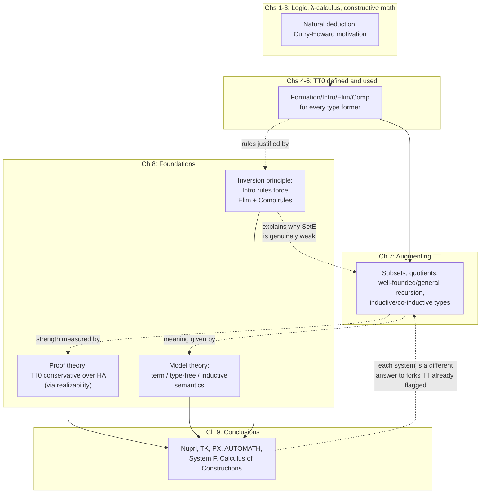

# Foundations and Related Systems

[[book-guidelines|↩ Back to guidelines]]

## Why the book ends here

Every earlier chapter *used* $TT_0$ — as a logic, as a programming language, as a specification language, as something you augment with subsets and quotients and well-founded recursion. This last pair of chapters does something different: it stops treating type theory as a tool and starts treating it as an object. Thompson's own framing is explicit — this is "a return to looking at the system as a whole, rather than at particular examples of terms and proofs derivable in it, or at possible extensions." Three questions drive it:

1. **How strong is $TT_0$, really?** Not "what can I prove in it" from the inside, but "how does its proving power compare to systems whose strength we already understand" — measured from outside, proof-theoretically.
2. **What does $TT_0$ *mean*?** A system given only by inference rules is, formally, just a symbol-shuffling game until something external explains what the symbols denote. That's the job of [[Model-Theory|model theory]].
3. **Is the shape of the rules themselves justified, or arbitrary?** Every type former got four kinds of rule (formation, introduction, elimination, computation) throughout the book, apparently by convention. [[The-Inversion-Principle|The inversion principle]] asks whether the last two are actually *forced* by the first.

Chapter 9 then zooms out one level further: having placed $TT_0$/$TT$ against abstract yardsticks (Heyting Arithmetic, realizability, term models), it places the *system as a design* against sibling systems built by other researchers who made different trade-offs at the same choice points the book has been flagging since Chapter 7. This is the book's synthesis chapter — read it as "here is the space of possible systems, and here is where ours sits in it."

If you are building your own checker or elaborator, this pair of chapters is where you learn to ask the two questions every language designer eventually has to answer about their own logic: *is it consistent, and relative to what?* and *is the rule set I invented actually minimal, or did I add derivable junk?*

---

## Part 1 — Proof theory: how strong is $TT_0$?

### The comparison systems: $HA$ and $HA^\omega$

To measure a system's strength you need a ruler. Thompson's ruler is **Heyting Arithmetic**, $HA$ — first-order intuitionistic arithmetic: Peano's axioms (zero isn't a successor, successor is injective), the induction scheme
$$\varphi(0) \wedge \forall n.(\varphi(n) \Rightarrow \varphi(n+1)) \Rightarrow \forall n.\varphi(n)$$
for every formula $\varphi$, and a function symbol for every primitive recursive function, all under *constructive* (not classical) predicate calculus — the rules of deduction here are exactly the proof-object rules of Chapter 1, stripped of the proof objects themselves, choosing the weak elimination rules $(\vee E)$ and $(\exists E')$ for disjunction and the existential.

$HA^\omega$ (Definition 8.2, following Troelstra's $N\text{-}HA^\omega$) is the finite-type extension: objects can live at any type built from $\mathbb{N}$ by the function-space constructor, primitive recursion is available at every type, and quantifiers range over a specific type rather than the whole domain. This is already recognizably type-theory-shaped — it's arithmetic wearing a simply-typed skeleton.

**Grounding.** Think of $HA$ as "Peano arithmetic implemented as a term rewriting system with an induction tactic," and $HA^\omega$ as what you get if you let that system's function symbols range over a simply-typed lambda-calculus's types instead of just $\mathbb{N} \to \mathbb{N} \to \dots \to \mathbb{N}$. If you've built a toy verifier, $HA^\omega$ is roughly "my logic, but I forgot dependent types and just have simple function types stacked on nat."

### Embedding, conservativity, and Theorem 8.8

Definition 8.3 is the load-bearing piece of vocabulary for this whole section:

> A function $f$ from formulas of $S_1$ to formulas of $S_2$ is an **embedding** if $S_1 \vdash \varphi$ implies $S_2 \vdash (f\varphi)$ for all $\varphi$. If the implication is actually an *equivalence*, $S_2$ is a **conservative extension** of $S_1$, and $f$ is called an **interpretation**.

In words: $S_2$ conservatively extends $S_1$ if the two systems agree exactly on what's provable in $S_1$'s own language — $S_2$ might prove *more* things overall (in its richer language), but nothing *new* about $S_1$'s statements slips through. This is the standard tool for showing a bigger, scarier-looking system doesn't secretly smuggle in extra arithmetical power.

The chain of results:

- **Theorem 8.4**: if $HA^\omega \vdash \varphi$, then $TT_0$ derives some $t : \varphi$ — proved by literally coding $HA^\omega$ proofs as $TT_0$ terms (Beeson).
- $TT_0$ also validates the axiom of choice at finite types, $AC_{FT}$: $\forall x.\exists y.A(x,y) \Rightarrow \exists f.\forall x.A(x,fx)$ — and Martin-Löf's derivation of it (a rare worked example in his own papers) does *not* use extensionality, so the *intensional* $TT_0$ still gets choice for free. Adopting the extensional identity rule gets you the stronger picture $HA^\omega + \mathit{Ext} + AC_{FT}$.
- **Theorem 8.8 (the headline result)**: $TT_0$ **is a conservative extension of $HA$**, where "$TT_0$ makes $A$ valid" means $\exists t.\, t:A$ is derivable. Despite $TT_0$'s richer type structure, dependent quantifiers, and built-in choice, it proves *no new arithmetical theorems* beyond what plain first-order $HA$ already proves. The proof method is realizability (next section) — this is *why* Thompson introduces realizability at all; it isn't a detour, it's the engine behind 8.8.

This is a genuinely reassuring result if you're designing a checker: it says the type machinery — dependent products, dependent sums, the identity type — buys you *expressiveness* (you can state and program with richer specifications) without secretly buying you *unsound extra arithmetic*. All that extra structure is proof-theoretically inert as far as $\mathbb{N}$-statements go.

### A negative result travels the other direction too

Conservativity results are two-way useful: sometimes you push a *positive* fact from the weaker system up (as above), and sometimes you push a *negative* fact from the stronger system down. Thompson's example:

**Continuity** (Definition 8.5): $F : (\mathbb{N}\Rightarrow\mathbb{N})\Rightarrow\mathbb{N}$ is continuous if for every $f$ there's a finite $n$ (a *modulus*) such that $F$'s value at $f$ only depends on $f$'s first $n$ values. Intuitively, every function you could actually *compute* in $TT_0$ ought to have this property — you can only ever inspect finitely much of an infinite input before returning an answer.

You'd hope to *prove* $(\forall F:(\mathbb{N}\Rightarrow\mathbb{N})\Rightarrow\mathbb{N}).\mathit{Cont}(F)$ inside $TT_0$ as a theorem about the system's own functions. You can't — and the reason is a beautiful piece of proof-theoretic leverage:

- **Theorem 8.6**: $HA^\omega + AC_{FT} + \mathit{Ext} + \forall F.\mathit{Cont}(F)$ is **inconsistent**. (Sketch: choice lets you build a function $\mu$ computing the modulus itself; extensionality forces $\mu$ to depend only on values, not representations; from this you can build a decision procedure for the limited principle of omniscience, which is classically true but constructively false — contradiction.)
- **Corollary 8.7**: therefore $TT_0$ does **not** prove full continuity. If it did, the *extensional* version of $TT_0$ would prove it too (it's a superset), and since the extensional theory already has $AC_{FT}$, it would land you in the inconsistent theory of 8.6 — but we independently know $TT_0$ is consistent (it has a term model, §8.2.1). Contradiction, so the assumption fails.

This is a template worth internalizing: *you use a proof of consistency as ammunition against an unwanted theorem*, not just as a hygiene check. "If my system proved $X$, it would collapse into a theory I already know is inconsistent — therefore it can't prove $X$" is a genuinely reusable proof pattern when you're stress-testing your own logic's rule set.

### Realizability: the mechanism behind Theorem 8.8

Kleene introduced **realizability** in 1945 to build recursive (i.e. computable) models of intuitionistic theories. The intuition: a constructive proof of an implication or a universal statement is fundamentally *about a transformation* — "given evidence for $A$, produce evidence for $B$." Kleene's move was to represent that transformation by an actual recursive function, coded as a natural number $e$, and define a relation

$$e \Vdash \varphi$$

read "$e$ realizes $\varphi$." Definition 8.9 gives it by cases (writing $\{e\}(q){\downarrow}$ for "the function coded by $e$ terminates on $q$"):

$$
\begin{aligned}
e \Vdash (A \Rightarrow B) &\iff \forall q.\,(q \Vdash A \Rightarrow \{e\}(q){\downarrow} \wedge \{e\}(q) \Vdash B) \\
e \Vdash \forall x.A &\iff \forall x.\,(\{e\}(x){\downarrow} \wedge \{e\}(x) \Vdash A) \\
e \Vdash \exists x.A &\iff \mathrm{first}\ e \Vdash A(\mathrm{second}\ e) \\
e \Vdash A \wedge B &\iff \mathrm{first}\ e \Vdash A \wedge \mathrm{second}\ e \Vdash B \\
e \Vdash A \vee B &\iff (\mathrm{first}\ e = 0 \Rightarrow \mathrm{second}\ e \Vdash A) \wedge (\mathrm{first}\ e \neq 0 \Rightarrow \mathrm{second}\ e \Vdash B)
\end{aligned}
$$

and any number realizes a true atomic formula. This should look extremely familiar if you've internalized the book's own introduction and elimination rules for the connectives (Chapter 4) — realizability *is* Curry–Howard, just implemented with raw natural-number-coded recursive functions standing in for the proof terms of $TT_0$. $\Vdash$ for $\Rightarrow$ mirrors $\lambda$-abstraction; $\Vdash$ for $\exists$ mirrors dependent pairs and their projections `Fst`/`Snd`; $\Vdash$ for $\vee$ mirrors `inl`/`inr`/`cases`.

**Theorem 8.10 (Soundness):** if $HA \vdash \varphi$, then some concrete $e \Vdash \varphi$ — every theorem has a computational witness, provable by induction on the size of the $HA$ proof. Worked out on $\forall x.\exists y.P(x,y)$, unwinding the clauses gives you a recursive function $g$ with $\forall x.P(x, gx)$ — realizability *extracts a program from a proof*, purely mechanically, the same job $TT_0$'s own proof terms already do, but for a different (untyped, arithmetic-only) host language.

Why 8.10 proves 8.8: the realizability clauses are *themselves* statements of arithmetic (about numbers $e$, $q$, first/second, and termination of coded functions), so realizing $\varphi$ never leaves $HA$'s own language. This gives a way to interpret $TT_0$'s proofs of arithmetical statements back inside $HA$ without inflating what gets proved — which is exactly what conservativity requires.

Thompson flags one sharp remark: formulas that are *equivalent to the bare statement of their own realizability*, $\varphi \leftrightarrow \exists e.(e\Vdash\varphi)$, are precisely the ones with **no existential import** — no real computational content. This is the germ of the "computational irrelevance" distinction from §7.1.2 (lazy evaluation already discards proof information that isn't computationally load-bearing) — realizability gives it a crisp formal handle: a formula's realizability adds nothing new exactly when the formula was already "just data," not "a promise of a witness."

He also notes the generality: swap in a different notion of realizing function (or a different target logic — higher-order arithmetic, say) and the whole apparatus still goes through, provided you re-prove soundness. This decoupling of *logic* from *extraction mechanism* is precisely what the sibling system $TK$ (§9.1.2, below) is built around.

**Grounding — this is unification's cousin, not its opposite.** If you're building an elaborator, don't read realizability as "an alternative to type checking." Read the soundness theorem as the same move your kernel's `isDefEq`/normalizer makes when it reduces a proof term to check it type-checks — except realizability does the reduction at the level of *provability* rather than *typability*, over an untyped host. The $\Vdash$ clauses are a specification an interpreter for proof terms would satisfy; if you ever write a "proof-term evaluator" that turns a derivation into a running program, you are implementing realizability, whether you call it that or not.

### Existential elimination, once more, now with a name attached

The book has flagged the weak-vs-strong split for $\exists$-elimination repeatedly (§5.3.3, §7.7, the flag/module discussion in Chapter 6). §8.1.3 closes the loop with a citation:

- **Theorem 8.11** (Swaen's thesis): the strong rule $(\exists E)$ is **equivalent** to the weak rule $(\exists E')$ **plus the axiom of choice**. This is the crisp statement of something the book has been circling since the very first mention of Skolemising a specification $\forall x.\exists y.A(x,y)$ into $\exists f.\forall x.A(x,fx)$ — that move *is* the axiom of choice, and the strong elimination rule is what lets you perform it internally rather than as a meta-level step.
- **Theorem 8.12**: $TT_0^w$ (i.e. $TT_0$ with only the weak $\exists$-elimination rule) is conservative over $HA^\omega$ — the weaker rule set corresponds to a correspondingly weaker (though still faithfully arithmetic-preserving) system.

If you're deciding, for your own verifier, whether to give existential elimination the strong or weak form: this pins down exactly what you're buying with the strong form — it's choice, no more and no less, and choice is precisely what you need for the "specify with $\forall\exists$, implement as an extractable function" pattern that ran through Chapter 6 and 7 (flag problem, module abstraction, real numbers).

---

## Part 2 — Model theory: what does $TT_0$ mean?

### Why bother with semantics at all

Thompson lists four reasons a semantics matters, worth internalizing as a checklist for any formal system you design yourself:

1. An uninterpreted system is symbols on paper — informal meaning is always attached anyway; make it precise.
2. **Consistency, relative to something you already trust.** Some intuitively plausible systems turn out inconsistent — Martin-Löf's own earliest 1971 type theory (with a type of all types) is the canonical cautionary tale, and $HA^\omega + AC_{FT} + \mathit{Ext} + \mathit{Cont}$ from Theorem 8.6 is another one manufactured earlier in this very chapter. A semantics gives you assurance this *won't* happen, contingent on the metatheory it's built in being itself consistent.
3. **Delimiting proof-theoretic strength** — what a semantics rules *in* and *out*.
4. **Licensing extensions** — a semantics can suggest which further additions to the system remain safe, by seeing what the underlying model supports.

Thompson surveys four styles, attributed to Martin-Löf, Smith, Beeson, and Allen.

### 8.2.1 Term models

The most direct construction (Martin-Löf's own, [ML75b]): interpret a closed $a:A$ as its **canonical form** $a_0$ in the canonical form of the type $A$ — for $TT_0$/$TT$, "canonical form" just means "normal form" (the notion nailed down back in §5.6). A dependent term $b(x):B(x)$ is canonical when, for every canonical $a$, $b(a)$ reduces to a canonical term of $B(a)$.

This is the model already implicitly at work throughout Chapter 5: "the collection of closed normal terms forms a model of the theory," and everything downstream — Church–Rosser, decidability of judgements — rode on it. Its virtue is directness (it's the most literal reading of what the syntax already gives you); its cost is that it's *tied* to the syntax so tightly that it's awkward to reuse for conservation results or for justifying genuinely new extensions — a new term model has to be freshly constructed from a wider syntax every time the system grows.

**This is precisely the "term model" your own normalizer already builds, implicitly, every time you define "two terms are definitionally equal iff they share a normal form."** If your Rust verifier's `is_defeq` reduces both sides to normal form and compares, you have a term model — Thompson is naming what you'd otherwise take for granted.

### 8.2.2 Type-free interpretations

An alternative worry: maybe $TT_0$'s complexity is partly an artifact of its *typed* presentation, the way the untyped $\lambda$-calculus is simpler than the simply typed one. Smith ([Smi84]) and Aczel's **Frege structures** ([Acz80]) build models of type theory out of an underlying *type-free* theory of computation and logic — closely related to realizability (Smith uses type-free $\lambda$-terms as the realizing functions, where Beeson's model $M$ used raw numbers). Smith's own description: it's "a metamathematical version of the semantical explanation [of Martin-Löf], formalized in the logical theory." It's this model $M$ that Beeson actually used to prove Theorem 8.8.

The generalizing punchline: every model of the type-free $\lambda$-calculus can be extended to a Frege structure, which in turn models type theory — so type-freeness isn't a competing philosophy, it's a *substrate* type theory can always be built on top of.

### 8.2.3 Allen's inductive-definition semantics

Allen ([All87a], [All87b]) takes yet another route: define the types **inductively**, as equivalence classes of untyped expressions, writing $t = t' \in T$ for "$t$ and $t'$ denote equivalent objects of type $T$" (with $t \in T$ short for $t = t \in T$). The defining clause for the dependent function type is representative:

$$t \in (\forall x:A).B \iff \exists u,b.\; t \to \lambda u.b \;\wedge\; \forall a,a'.(a=a'\in A \Rightarrow b[a/u] = b[a'/u] \in B) \tag{8.1}$$

Here's the subtlety Thompson flags explicitly: a naive inductive definition only guarantees a least fixed point when its defining formula is **monotone**, and a standard sufficient condition for that is *positivity* — the relation being defined must not occur in a hypothesis position of an implication in its own defining clause. Clause (8.1) fails this: `$=\ \in\ $` occurs on the *left* of an implication (in the hypothesis $a=a'\in A$). So this can't be read off as an ordinary inductive definition.

Allen's fix is to go up a level: define a monotone *operator* $\mathcal{M}$ on **type theories**, where a type theory is a two-place relation $T$ such that $T\, A \sim_A$ holds exactly when $A$ is a type carrying equality relation $\sim_A$. Monotonicity of $\mathcal{M}$ itself (as an operator on such relations, not on the equality relation directly) is what recovers a least fixed point, and *that* fixed point is the semantics.

Two payoffs Thompson highlights: (a) this style extends readily to augmented systems — [CS87] extends it to the partial types of §7.12 — and (b) Allen argues it's the most faithful match to Martin-Löf's own *lazy*-evaluation informal semantics, and that it justifies some of **Nuprl's** "direct computation rules" (reduction under fewer hypotheses than $TT$ normally permits) — a direct thread into §9.1.1 below.

### 8.3 A general framework: logics as typed meta-theories

A brief but structurally important section: Thompson observes that every operation of $TT$ — $\Rightarrow$, `inl`, $\lambda$, `app` — has a definite **meta-theoretic type**. E.g. $\Rightarrow$ has meta-type $\mathit{Type} \to \mathit{Type} \to \mathit{Type}$; `inl` has meta-type
$$(\Pi t:\mathit{Type}).(\Pi s:\mathit{Type}).(\mathit{El}(s) \to \mathit{El}(s\vee t))$$
where $\mathit{El}$ maps a type expression to the collection of elements it denotes. The binder $\lambda$ itself becomes an ordinary *constant* of the meta-theory:
$$\lambda :: (\Pi t{:}\mathit{Type}).(\Pi s{:}\mathit{Type}).\big((\mathit{El}(t)\to \mathit{El}(s)) \to \mathit{El}(t\Rightarrow s)\big)$$
and substitution in the object language $TT$ becomes literally **$\beta$-reduction in the meta-language**, since the argument to `app` is a genuine meta-level function. This is the Edinburgh Logical Framework (LF) style — the idea behind [HHP87] — treating a *whole object logic* as a signature of typed constants inside a single fixed dependently-typed meta-calculus with $\beta/\eta$-conversion.

**This is the single most directly useful idea in this chapter if you are building an elaborator.** It is exactly the design of Lean's own kernel, and of every LF-descended proof assistant (Twelf, Isabelle's Pure, Beluga): don't hard-code your object logic's binders into your implementation language as special cases; represent each binder as a constant with a higher-order meta-type, and get substitution "for free" from your meta-calculus's own $\beta$-reduction. If your elaborator has a bespoke substitution function for each binder-form in your object language, this section is telling you there's a more uniform architecture available — one universal HOAS-style substitution, done once, in the meta-theory.

---

## Part 3 — The inversion principle

### The idea, stated informally first

Every type former in the book got exactly four kinds of rule: formation, introduction, elimination, computation. Thompson's question: is this uniform shape a *design choice*, or is it *forced*? Schroeder-Heister and Dybjer's answer, building on Gentzen and Prawitz: **once you fix the introduction rules for a connective, the elimination and computation rules are essentially determined** — they can be generated *by inversion*.

The intuition, stated in Thompson's own words: "if we are given the introduction rules for a type then we seem to know all the forms that elements can take, and this really characterises the type." If the *only* ways to prove $A\vee B$ are `inl` and `inr`, then knowing $C$ follows from $A$ and knowing $C$ follows from $B$ is already enough to conclude $C$ follows from $A \vee B$ — because any proof of $A \vee B$ *must have taken one of those two forms*. That's precisely $(\vee E')$:
$$
\dfrac{(A\vee B) \quad \dfrac{[A]}{\vdots} \quad \dfrac{[B]}{\vdots}}{\dfrac{C \qquad\qquad C}{C}}(\vee E')
$$

### Worked in full for $\vee$, with proof objects

Lifting the logical rule to type theory, with explicit proof objects and named/bound variables:
$$
\dfrac{p:(A\vee B) \quad \dfrac{[x:A]}{u:C}\ \dfrac{[y:B]}{v:C}}{\mathrm{vcases}'_{x,y}\, p\, u\, v : C}(\vee E')
$$
The new term $\mathrm{vcases}'_{x,y}\,p\,u\,v$ binds $x$ in $u$ and $y$ in $v$, matching the assumption-discharge in the logical rule. It simplifies: since a proof of $A\vee B$ must be `inl a` or `inr b`, substitution gives the familiar **computation rules**:
$$
\mathrm{vcases}'_{x,y}(\mathrm{inl}\,a)\,u\,v \to u[a/x] \qquad \mathrm{vcases}'_{x,y}(\mathrm{inr}\,b)\,u\,v \to v[b/y]
$$
This is the punchline of the whole principle in miniature: **the elimination rule and the computation rule both fall out mechanically once you commit to the introduction rules and the requirement that any proof-object exhausts those forms.** You didn't invent `cases`/`vcases` as an extra design decision — it's forced.

### The general schema

If a connective $\theta$ has $n$ introduction rules of shape
$$\dfrac{H_{i,1}\ \dots\ H_{i,m_i}}{\theta\,A_1\dots A_k}(\theta I_i), \quad i=1,\dots,n$$
then (writing $\varphi \equiv \theta A_1 \dots A_k$) there are exactly $n$ ways to have introduced $\varphi$. If $C$ is derivable from *each* hypothesis set $H_{i,1},\dots,H_{i,m_i}$, that already exhausts every way $\varphi$ could have arisen, so $C$ follows from $\varphi$ — the generated elimination rule. Lifted to type theory with each introduction rule attaching a constructor $K_i$,
$$
\dfrac{y_{i,1}:H_{i,1}\ \dots\ y_{i,m_i}:H_{i,m_i}}{K_i\,y_{i,1}\dots y_{i,m_i} : \varphi}(\theta I_i)
$$
the generated elimination form $\theta\text{-}\mathrm{elim}$ binds the $y_{i,j}$ in each hypothetical proof $p_i$, and the generated computation rule is again forced by substitution:
$$
\theta\text{-}\mathrm{elim}\,(K_i\,a_1\dots a_{m_i})\,p_1\dots p_n \to p_i[a_1/y_{i,1},\dots,a_{m_i}/y_{i,m_i}]
$$

### Worked for $\wedge$, and recovering `fst`/`snd`

$\wedge$ has one introduction rule, $(a,b):A\wedge B$ from $a:A,b:B$. The schema generates
$$
\dfrac{p:A\wedge B \quad \dfrac{[x:A,y:B]}{c:C}}{\wedge\text{-}\mathrm{elim}_{x,y}\,p\,c:C}(\wedge E') \qquad \wedge\text{-}\mathrm{elim}_{x,y}(a,b)\,c \to c[a/x,b/y]
$$
Take $c:C$ to literally *be* $x:A$: then $\wedge\text{-}\mathrm{elim}_{x,y}(a,b)\,x \to a$, so `fst` is *recovered* as $\lambda p.(\wedge\text{-}\mathrm{elim}_{x,y}\,p\,x)$, and `snd` symmetrically. Conversely, Thompson shows $(\wedge E')$ is no *stronger* than the usual pair-projection rules — given $c:C$ depending on $x,y$ and $p:A\wedge B$, the term $c[\mathrm{fst}\,p/x,\mathrm{snd}\,p/y]$ behaves identically to $\wedge\text{-}\mathrm{elim}_{x,y}\,p\,c$ when $p$ actually is a pair. This is a nice sanity check that inversion doesn't secretly hand you something new — it regenerates exactly the rules the book already had.

The principle also applies cleanly to $\exists$, to the finite types $N_n$, to the natural numbers, and to well-founded types generally (lists, trees).

### Where it breaks: hypothesis-discharging connectives, and subset types

Two genuine obstacles surface.

**1. Discharging introduction rules ($\Rightarrow$, $\forall$) need a richer notion of hypothesis.** $\Rightarrow$'s introduction rule discharges an assumption:
$$\dfrac{[A]}{\dfrac{B}{A\Rightarrow B}}(\Rightarrow I)$$
Naively inverting this the same way you'd invert `inl`/`inr` doesn't work, because the "hypothesis" here isn't a bare formula, it's an *entire derivation of $B$ from $A$*. The fix, following [SH83a] and (independently) [Bac86], is **[[The-Inversion-Principle#Hypothetical hypotheses|hypothetical hypotheses]]**: a new judgement form $\{\Gamma \triangleright J\}$ meaning "$J$ is derivable in context $\Gamma$," introduced by literally giving such a derivation, and eliminated by instantiating both $\Gamma$ and $J$ with a substitution $[t_1/x_1,\dots,t_n/x_n]$. With this machinery, inversion of $\Rightarrow$ does go through, producing (after some care about variable binding, using an explicit meta-level binder $\Lambda$ to keep object-level $\lambda$ a plain constant) a `modus ponens`-shaped elimination rule `expand` with computation rule $\mathrm{expand}\,(\lambda g)\,c \to c\cdot g$.

**2. It fails outright for the naive subset-elimination rule $(SetE)$** from §7.2. This is not a gap to be patched — it's a *diagnosis*. The whole reason $(SetE)$ was shown "very weak" back in Chapter 7 (unable to recover a witness for the predicate) is exactly that the subset type's introduction rule doesn't cleanly determine its elimination behavior the way every well-behaved type former's does. Dybjer's later, more general treatment ([Dyb89]) makes this precise: every type in $TT$ *except the universes* can be seen as arising from a system of positive inductive definitions in the logical framework of §8.3, and *when a type former admits such a positive presentation, its elimination and computation rules follow automatically* — this licenses additions like Dyckhoff's category-theoretic rules (§7.13) but explicitly **not** the subset or quotient constructions. The inversion principle, in other words, gives you a formal test for "is this type former well-behaved" — and subset elimination fails that test for a structural reason, not an incidental one.

**Grounding.** If you've ever hand-written a `match`/`cases` eliminator for an inductive type and felt like you were "just doing the obvious thing," the inversion principle is naming exactly what you were doing: deriving the eliminator's shape mechanically from the constructors. This is precisely what Coq's/Lean's automatic recursor generation (`RecName.rec`/`.rec_on`/`.cases_on`) does for every positively-defined inductive — it's inversion, automated. And the subset-elimination failure is the same reason a naive `Σ`-type-as-refinement encoding in a dependently typed language can't just hand you back the erased proof: the "type former" (subset comprehension over an equivalence relation not built from constructors) isn't a positive inductive definition, so there's no eliminator to derive.

---

## Part 4 — Related systems (Chapter 9, §9.1)

Thompson closes the book by placing $TT_0$/$TT$ against five contemporaries. Read each as *a different answer to a design fork the book already flagged*.

### Nuprl (§9.1.1)

Cornell (Constable, Bates), extending the **extensional** version of Martin-Löf's theory. Where this book treats type theory principally as a *functional programming system* (proofs incidentally yield programs), Nuprl's orientation is *logical first*: it's built around **top-down, tactic-driven derivation** (LCF-style tactics and tacticals, literally embedded in ML, exactly like LCF itself) of propositions in a natural deduction system, where proof terms are called "extract terms" — extracted *post hoc*, implicitly, from a derivation, rather than written directly as in $TT$'s proof-objects-as-primary style.

Nuprl also adopts the **strong elimination rules** (§7.7.2) and "**direct computation rules**" — reduction of terms under fewer well-formedness obligations than $TT$ normally requires (justified, per §8.2.3, by Allen's inductive-definition semantics). It's augmented with subsets, quotients, and partial function types — largely to strip computationally irrelevant information out of extract terms, since implicit tactic-driven proof search tends to accumulate more of that irrelevant baggage than explicit term-first construction does.

### TK (§9.1.2)

Henson and Turner's **theory of types and kinds**: a constructive set theory built with program development as the primary goal, and its central design move is to *reject* $TT$'s core identification of types with propositions. TK keeps a simpler collection of sets (formed by separation, $\{x\mid\Phi(x)\}$, and induction) strictly *separate* from a richer logical-assertion language, plus a hierarchy of universes/kinds (hence the name). A second departure: terms in TK can be **partial** — since types and logic are no longer conflated, partiality doesn't threaten the logic's consistency the way it would in $TT$ (recall §7.12's careful, hedged treatment of exactly this issue). Program extraction runs via realizability (§8.1.2's machinery, reused directly), which gives TK flexibility $TT$ lacks — realizers for a construct can be chosen independently of its logical definition — at the cost of a less obviously unified single-language story than $TT$'s "write the program, get the proof (or vice versa) in the same syntax."

### PX (§9.1.3)

Hayashi's **type-free** computational logic, built over Feferman's $T_0$, extracting **LISP** programs via *px-realizability*. Motivated by the claim that requiring totality (as $TT$ does throughout) is too restrictive for practical development; PX instead has two sorts of variable — one ranging over terminating objects, one over all objects — plus an explicit definedness predicate $E$. Its central mechanism, **CIG** (Conditional Inductive Generation), plays the role $TT$'s well-founded recursion (§7.9) and inductive types (§7.10) play — defining subclasses of the domain, driving recursion, and proving termination. A sharp idea worth remembering on its own: **Rank 0 formulas** — those built without $\vee$ or $\exists$ — need no realizing term at all, because they carry no computational content (e.g. $A\subseteq B$, an assertion of totality/termination); such formulas can even be proved *classically* without threatening consistency or the computational interpretation elsewhere. This is the same "computational irrelevance" thread as §7.1.2 and the realizability remark above, now given a syntactic criterion.

### AUTOMATH (§9.1.4)

De Bruijn's project (Eindhoven, from 1966) — historically the pioneer, predating Martin-Löf's own type theory as a vehicle for formalized mathematics; its landmark achievement was a complete formalization of Landau's *Grundlagen*. Two ideas of lasting technical influence:

- A **type/prop distinction** in the classical setting, motivated by proof irrelevance — anticipating, by years, the exact type/proposition separation debate that runs through §7.3 of this book.
- **De Bruijn indices**: replacing a bound variable occurrence with the count of $\lambda$'s between the occurrence and its binder, so $\lambda a.\lambda b.\lambda c.(ac)(bc)$ becomes $\lambda.\lambda.\lambda.(2\,0)(1\,0)$. This sidesteps $\alpha$-conversion entirely — two terms differing only in bound-variable names become *syntactically identical*, not just convertible. If you've ever implemented a substitution function and gotten bitten by variable capture, this is the standard, still-current industrial fix: locally-nameless or full de Bruijn representations are what virtually every real type checker (including Lean's kernel) uses internally, precisely to make $\alpha$-equivalence free and substitution simple to get right.

### System F / the second-order $\lambda$-calculus (§9.1.5, part 1)

Independently invented by Reynolds and Girard (Girard's name: **System F**). It extends the simply typed $\lambda$-calculus with type variables $\alpha,\beta,\dots$ and *explicit* quantification over them: $K \equiv_{df} \lambda x.\lambda y.x$ gets the *implicitly* polymorphic type $\alpha\Rightarrow\beta\Rightarrow\alpha$ in ML/Miranda-style languages, but System F makes the quantifier explicit with a type-abstraction operator $\Lambda$ and dependent-looking type former $\Pi$:
$$K \equiv_{df} \Lambda\alpha.\Lambda\beta.\lambda x^\alpha.\lambda y^\beta.x \;:\; \Pi\alpha.\Pi\beta.(\alpha\Rightarrow\beta\Rightarrow\alpha)$$
with type application $(\Lambda\alpha.e)\,\xi : t[\xi/\alpha]$. This is strictly more expressive than the Milner (Hindley–Milner) type system because types can themselves contain quantifiers, e.g. $(\Pi\alpha.(\alpha\Rightarrow\alpha)) \Rightarrow (\Pi\alpha.(\alpha\Rightarrow\alpha))$ — a type that *quantifies over a domain including itself*.

Thompson flags the apparent circularity and contrasts it directly with $TT$'s universe-stratified equivalent $((\forall\alpha:U_0).(\alpha\Rightarrow\alpha)) \Rightarrow ((\forall\alpha:U_0).(\alpha\Rightarrow\alpha))$ — in $TT$ this is **not** circular, because the whole implication itself lives in $U_1$, strictly *outside* the range of its own $(\forall\alpha:U_0)$ quantifier (this is exactly the universe-hierarchy discipline of §5.9, invoked here as the resolution). System F's circularity is instead controlled proof-theoretically — it's consistent and strongly normalizing (Girard), with the proof-theoretic strength of second-order arithmetic, strictly *more* than $TT_0$.

Curry–Howard extends smoothly: quantifying over types corresponds to quantifying over *all propositions*, which lets you **define** propositional connectives purely from $\Pi$. E.g. from $\vee$-elimination's shape $(A\vee B),(A\Rightarrow C),(B\Rightarrow C) \vdash C$, you read off that $A\vee B$ *behaves like* $\Pi C.((A\Rightarrow C)\Rightarrow(B\Rightarrow C)\Rightarrow C)$ — an element $a:A$ gives $\Lambda C.\lambda f.\lambda g.(f\,a)$ of that type. (Whether *every* element of this Church-encoded type actually arises this way is a subtler semantic question System F alone doesn't settle.) What System F's own calculus *cannot* do is define the **type-level transformation** $A,B \mapsto \Pi C.((A\Rightarrow C)\Rightarrow(B\Rightarrow C)\Rightarrow C)$ as an internal operation — that requires letting types themselves be computed by functions, which is the next system's whole point.

**Grounding.** System F is, almost verbatim, what's underneath Rust's generics and Haskell's `forall` — `fn identity<T>(x: T) -> T` is a `Λα.λx^α.x` in different clothes, and Rust's monomorphization is essentially always instantiating the $\Pi$ at compile time. Where Rust's generics stop short of full System F is exactly this Church-encoding trick: you can't easily write a Rust generic function whose *return type* is itself computed from its type parameters the way $A,B\mapsto \Pi C.\dots$ requires — that reappears, tamed, as associated types and GATs, but it's not native System F-style type computation.

### The Calculus of Constructions (§9.1.5, part 2)

Coquand and Huet's system directly answers System F's gap: it provides the missing type-level computation by letting *types themselves* be ordinary terms manipulated by the calculus's own machinery, giving you a language rich enough to define the connective-encoding type operators (like the $A,B\mapsto \Pi C.\dots$ transformation above) internally. One tempting-but-fatal shortcut is explicitly ruled out: adding a type `Prop` of *all* propositions collapses into **Girard's paradox** — the same inconsistency that killed Martin-Löf's original 1971 "type of all types" and motivated the universe hierarchy of §5.9 in the first place. Avoiding that trap while still getting the expressive power is precisely CoC's engineering achievement, and Thompson notes it lets "a large portion of mathematics" be developed from a genuinely small foundational core.

One notable *limitation* flagged explicitly: CoC apparently cannot define a **strong** existential type — the equivalence
$$(\forall x:A).(C(x)\Rightarrow B) \;\Leftrightarrow\; ((\exists x:A).C(x)) \Rightarrow B \quad (x\text{ not free in }B)$$
only comes out as a *weak* equality in CoC, because the strong existential's elimination rule mingles proof objects and types in a way the calculus's own encoding can't cleanly represent. This is the exact same weak/strong $\exists$-elimination fork that has run through this book since §5.3.3 — CoC, System F, $TT_0$, and Nuprl are all, in the end, making different choices at that one fork.

**Grounding — the closest match to your elaborator target.** The Calculus of Constructions (via its descendant, the Calculus of Inductive Constructions) is essentially the direct ancestor of Coq's and Lean's kernels. If your standing goal is a Lean-style elaborator, CoC is not "one more sibling system to skim" — it's the actual lineage: `Sort`/`Type`/universe polymorphism in Lean is the disciplined, paradox-avoiding descendant of exactly the `Prop`-of-all-propositions trap this section warns about.

---

## Synthesis: the shape of the whole book, seen from the end

Chapter 8 answers, for $TT_0$ itself, the three questions every design in Chapter 7 implicitly raised but couldn't answer from the inside: *is it consistent* (model theory), *how strong is it, relative to a trusted baseline* (proof theory / realizability), and *are its rules the minimal, forced ones, or arbitrary additions* (inversion). The subset type's failure under inversion (§8.4) is the formal version of the informal verdict Chapter 7 already reached about it ("very weak," non-derivability results) — the two chapters are triangulating on the same fact from syntax and from principle respectively.

Chapter 9 then re-plays every major fork the book has flagged — weak vs. strong $\exists$-elimination, intensional vs. extensional equality, types-as-propositions vs. types-and-propositions-separate, totality vs. partiality, tactic-driven vs. term-first proof construction — and shows each fork chosen *differently* by a real, implemented system. Nuprl takes strong elimination and extensionality; TK takes partiality and separates types from propositions; PX takes partiality even further and adds proof-irrelevant Rank 0 formulas; System F and CoC push the *type* side of the isomorphism as far as it will go. $TT_0$/$TT$, as presented in this book, is one specific, principled point in that space — intensional, total, types-as-propositions, weak-then-optionally-strengthened elimination — and Thompson's closing remark makes the trade-off explicit: every augmentation in Chapter 7 "extracts a price" in complexity or lost metatheoretic property, so the discipline of *this* book has been to only add what's justified.

### Where this leads

Nothing in the book depends *forward* on this material — it's the terminus. But it retroactively re-frames everything before it: Chapter 7's ad hoc-feeling extensions were really explorations of a well-defined design space, whose axes (weak/strong elimination, intensional/extensional equality, types-as-props or not, totality) this chapter finally names. For the standing project: the inversion principle (§8.4) is the theoretical justification for why your recursor/eliminator generation should be automatic and derived rather than hand-specified per inductive type; the LF framework (§8.3) is the architectural blueprint for representing your object logic's binders uniformly inside a meta-calculus, with substitution handled once, generically, by the meta-theory's own $\beta$-reduction — exactly the discipline a Miller-pattern-unification-based elaborator needs if it's going to treat metavariable instantiation and ordinary substitution through one uniform mechanism; and the Calculus of Constructions (§9.1.5) is, concretely, the ancestor system whose disciplined universe hierarchy is what makes Lean's own kernel consistent.
