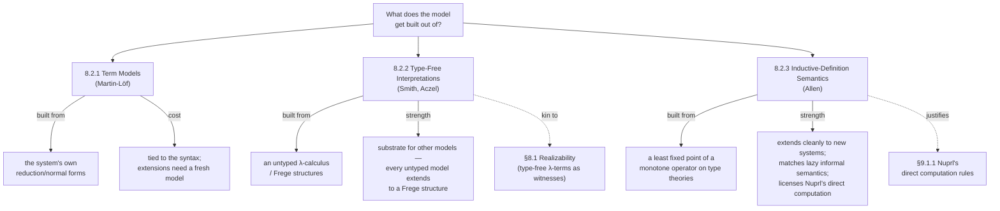

[[book-guidelines|↩ Back to guidelines]] · [[Foundations-and-Related-Systems|See also: Foundations and Related Systems]]

## Why bother giving $TT_0$ a semantics at all?

A formal system is a machine for pushing symbols around according to rules. Nothing in the rules themselves tells you the symbols *mean* anything — a proof that $\bot$ is not derivable, for instance, is a claim about the syntax, not automatically a claim about some outside fact. Model theory is the discipline of connecting that syntax to something external, and Thompson gives four concrete payoffs for doing it to $TT_0$/$TT$:

- **Interpretation.** A completely uninterpreted calculus is a curiosity, not a tool — every working system carries an informal semantics in the user's head, and a model makes that semantics precise.
- **Consistency.** A model built inside a trusted, already-consistent theory transfers that trust: if $TT_0$ has a model, $TT_0$ cannot prove $\bot$ (assuming the host theory can't either). This isn't idle caution — Thompson points out that Martin-Löf's *own* earliest version of type theory turned out inconsistent, as did the theory $HA^\omega + AC_{FT} + Ext + \text{full continuity}$ from §8.1 (Theorem 8.6). Plausible-looking systems break.
- **Delimiting strength.** A semantics can show precisely what a system *can't* prove — this is exactly the role realizability played in §8.1 to establish that $TT_0$ is a conservative extension of Heyting Arithmetic (Theorem 8.8): no arithmetical statement is provable in $TT_0$ that wasn't already provable in plain first-order arithmetic.
- **Licensing extensions.** A model doesn't just certify the current system — it can suggest which *enlargements* of the system stay consistent, by showing the enlargement corresponds to some legitimate operation inside the semantics.

Thompson surveys four styles of model for $TT_0$/$TT$, due to Martin-Löf, Smith, Beeson, and Allen. The book's own organizing question is really: *what do you build the model out of?* Each of the three approaches below answers that differently, and the differences are not cosmetic — they determine what each model is *for*.

If you're building a type checker or proof checker, this section is worth reading slowly: whichever notion of definitional equality your kernel implements, you have implicitly already committed to one of these models, whether you named it or not.

## 8.2.1 Term models

The most direct answer, due to Martin-Löf himself ([ML75b], with a gloss in [ML85] and [NPS90]), is to build the model **out of the syntax's own reduction behavior** — no external mathematics required.

**What breaks without this:** without *some* notion of "this expression is the real value," a typing judgement $a : A$ tells you nothing checkable. Two syntactically different expressions like $2 + 2$ and $4$ both inhabit $N$, but a term model is what lets you say they denote the *same* element of $N$ — namely, whatever they both reduce to.

The construction: every closed expression $a : A$ is interpreted as its **canonical form** $a_0$ (for $TT_0$ and $TT$, "canonical form" specializes to "normal form" — Thompson points back to §5.6, where it's proved that the collection of closed normal terms forms a model of the theory). Function types get a slightly more careful clause: $b(x) : B(x)$ is canonical when, for every canonical $a$, $b(a)$ *reduces to* something canonical in $B(a)$ — the model is built by chasing reduction all the way down, not by inspecting syntax shape alone.

This is the model that has been doing work silently throughout the book already: it's what underwrites the Church–Rosser property and the decidability of judgements from Chapter 5. Its strength is directness — it's the most literal possible reading of "what the syntax already gives you," nothing borrowed from outside. Its weakness is exactly that directness: because the model is built *out of* the syntax, it's awkward to reuse for results like conservative extension, or to justify a genuinely new extension to the theory — you'd need to build a fresh term model over the enlarged syntax each time, from scratch.

### Grounding: this is your kernel's `isDefEq`

If you've ever implemented (or used) a type checker's definitional-equality check, you have already built a term model, whether or not you called it that.

**Lean**, whose kernel is close to a literal implementation of this section, makes the correspondence explicit. `isDefEq a b` decides equality by driving both `a` and `b` to weak-head normal form and comparing — precisely "interpret each closed expression as its canonical form, and call two expressions equal when their canonical forms coincide":

```lean
-- Schematically, what Lean's kernel does (not the literal source):
-- isDefEq compares two terms up to reduction to (weak-head) normal form.
def isDefEq (a b : Expr) : MetaM Bool := do
  let a' ← whnf a
  let b' ← whnf b
  -- structurally compare a' and b', recursing into subterms
  -- with further whnf calls as needed
  structuralEq a' b'
```

Every time `isDefEq` returns `true` for two syntactically distinct terms, it is *implementing* the term model: it has decided they denote the same canonical element.

**Rust**, for a from-scratch checker, would express the same commitment as an explicit normalizer plus a structural comparison — this is the load-bearing piece for the compiler/verifier project, since it's exactly the trust boundary a kernel has to get right:

```rust
enum Term {
    Var(usize),
    App(Box<Term>, Box<Term>),
    Lam(Box<Term>),
    // ...
}

fn normalize(t: &Term) -> Term {
    // reduce t to normal form (beta/iota/etc.)
    todo!()
}

fn def_eq(a: &Term, b: &Term) -> bool {
    // "def_eq" IS the term model: two terms are equal
    // exactly when they share a normal form.
    normalize(a) == normalize(b)
}
```

**Python**, as a five-line sketch of the same idea without any of the ceremony:

```python
def def_eq(a, b, normalize):
    return normalize(a) == normalize(b)  # the term model, bare
```

Notice what the term model *doesn't* give you: a semantic account of open terms, or of what a type "is" independent of any particular syntax for it. That's the gap the next two approaches are trying to close.

## 8.2.2 Type-free interpretations

A different worry: maybe part of what makes $TT_0$'s metatheory hard is the *typed* presentation itself — the way the untyped $\lambda$-calculus is a simpler object than the simply-typed one, precisely because it has fewer moving parts to keep in sync. Smith ([Smi84]) and Aczel's **Frege structures** ([Acz80]) pursue this: build a model of type theory out of an *untyped* theory of computation and logic, with types re-emerging as a derived notion inside that untyped world rather than a primitive.

**What breaks without this:** a purely syntactic (term-model) account ties every metatheoretic result to the specific grammar of $TT_0$. If you want a result that survives changing the type system's surface syntax — or want to compare $TT_0$'s strength against a system with a *different* type discipline — you need semantic ground that doesn't presuppose typing as primitive.

Smith characterizes his own interpretation as "a metamathematical version of the semantical explanation [of Martin-Löf], formalized in the logical theory" — i.e., it's not a rival philosophy to Martin-Löf's informal semantics, it's that same semantics made rigorous inside an untyped host. The construction is close kin to realizability from §8.1: Smith uses **type-free $\lambda$-terms** as the realizing/witnessing objects, where Beeson's earlier model $M$ ([Bee85], §XI.20) used raw natural numbers for the same role. It's this model $M$, in fact, that Beeson used to prove Theorem 8.8 ($TT_0$ conservative over $HA$) — so type-free interpretations aren't just a philosophical curiosity, they're load-bearing for a result already used earlier in the chapter.

The generalizing punchline Thompson draws out: every model of the untyped $\lambda$-calculus can be extended to a Frege structure, and every Frege structure gives a model of type theory. So type-freeness isn't a competing foundation to build type theory instead of — it's a *substrate*, one layer down, that type theory can always be erected on top of.

### Grounding: the untyped core under a typed surface

This is a familiar shape from language implementation: a typed surface language elaborating down to an untyped (or minimally-typed) core that actually gets evaluated.

**Rust**, sketching the idea that "typing" is a derived predicate over an untyped evaluator rather than baked into the term representation:

```rust
// The untyped substrate: no Term variant carries a type.
enum UntypedTerm {
    Var(usize),
    App(Box<UntypedTerm>, Box<UntypedTerm>),
    Lam(Box<UntypedTerm>),
}

// "Being a type-A term" becomes a *relation* layered on top,
// not a property intrinsic to the term's shape —
// exactly the Frege-structure move.
fn realizes(t: &UntypedTerm, a: &Type, ctx: &Context) -> bool {
    todo!() // defined by cases on the *shape* of `a`, recursively
}
```

**Lean** makes essentially the same move at the meta-level: `Expr` itself has no static type tag baked into its constructors the way a typed AST in a naively-designed checker might; typing is a *judgement* — `infer_type` — computed over untyped syntax, not read off a field. That separation (syntax without built-in typing vs. a typing relation defined over it) is precisely what a type-free interpretation is doing one level further down, at the semantic rather than the syntactic layer.

## 8.2.3 Allen's inductive-definition semantics

A third route, due to Allen ([All87a], [All87b], summarized in [CS87, §2.2]), tries to define the types directly as **equivalence classes of untyped expressions**, built up by an inductive definition. Write $t = t' \in T$ for "$t$ and $t'$ denote equal objects of type $T$" (with $t \in T$ short for $t = t \in T$). The defining clause for dependent function types is representative of the whole style:

$$t \in (\forall x : A).B \iff \exists u, b.\ t \to \lambda u.b \ \land\ \forall a, a'.\big(a = a' \in A \Rightarrow b[a/u] = b[a'/u] \in B\big)$$

**What breaks without care here:** the naive hope is that a clause like this is just an ordinary inductive definition — define the relation $=\in$ by the smallest relation closed under clauses like the one above, done. But Thompson flags the actual obstruction: a sufficient condition for an inductive definition to have a *least* fixed point (guaranteed to exist, per the general theory in [Mos74]) is that the defining formula be **positive** in the relation being defined — every occurrence of $\dots = \dots \in \dots$ on the right-hand side must sit outside the scope of an implication's antecedent. The clause above fails this: the relation $a = a' \in A$ occurs as the *hypothesis* of an implication, a negative position. So this is not, as written, a well-formed inductive definition at all — the naive reading simply doesn't have a guaranteed solution.

Allen's fix is to move up a level of abstraction rather than patch the clause. Instead of defining $=\in$ directly, he defines a monotone **operator** $\mathcal{M}$ on *type theories* — where a type theory is itself a two-place relation $T$ such that $T\, A \sim_A$ holds exactly when $A$ is a type carrying equality relation $\sim_A$. Monotonicity of $\mathcal{M}$ as an operator on *this* larger space (relations-on-relations, not the equality relation directly) is what recovers a guaranteed least fixed point — and that fixed point *is* the semantics.

Two payoffs Thompson highlights for this style specifically:

- It extends readily to augmented systems — [CS87] applies it to the partial types discussed in §7.12 of this book, without needing to redo the whole construction from scratch (contrast the term model's weakness above, where every extension forces a fresh construction).
- Allen argues it is the *most* faithful match to Martin-Löf's own informal semantics, because it tracks the **lazy** evaluation Martin-Löf describes informally rather than insisting on eager normalization — and that faithfulness is what licenses some of **Nuprl**'s "direct computation rules" (§9.1.1 in the next chapter): reduction of terms under strictly fewer well-formedness hypotheses than $TT$ itself would normally require.

### Grounding: fixed points as a semantics-of-typing technique

The "define an operator, take its least fixed point" pattern is exactly how you'd define mutually-recursive or self-referential typing relations in an implementation, and the positivity obstruction Allen hits is a real bug class, not an academic nicety.

**Lean**, where this shows up directly in how inductive families and their eliminators are only well-formed when the recursive occurrences of the type being defined appear in **strictly positive** position — this is the *same* positivity condition Thompson invokes, enforced by Lean's kernel as a hard syntactic check before it will even accept the declaration:

```lean
-- Accepted: T occurs only positively (never to the left of an arrow).
inductive Good where
  | base : Good
  | step : Good → Good

-- Rejected by the positivity checker: T occurs negatively
-- (to the left of an arrow), for the same reason Allen's naive
-- clause above fails to be a legitimate inductive definition.
-- inductive Bad where
--   | mk : (Bad → Bad) → Bad
```

**Rust**, sketching Allen's actual fix — go up a level and define the operator on *type theories* rather than on the equality relation directly, then take its fixed point by iteration:

```rust
// A "type theory": which pairs (type, equality-relation) it recognizes.
type TypeTheory = HashMap<TypeExpr, EqualityRelation>;

// M is monotone: more input relations only ever produce more output
// relations, never fewer — which is what guarantees a least fixed point.
fn m(theory: &TypeTheory) -> TypeTheory {
    todo!() // one step of closing `theory` under the typing clauses
}

fn least_fixed_point(mut theory: TypeTheory) -> TypeTheory {
    loop {
        let next = m(&theory);
        if next == theory { return theory; }
        theory = next;
    }
}
```

## How the three styles relate



The three are not competitors so much as answers tuned to different jobs. Term models are the cheapest and most concrete — reach for one when you just need "these two things compute to the same thing" and nothing more, which is most of a working kernel's day-to-day job. Type-free interpretations buy you a semantics that doesn't presuppose the typed surface syntax, useful when you need results (like conservation over $HA$) that should survive changes to that surface. Inductive-definition semantics buys extensibility and lazy-evaluation fidelity at the cost of a genuinely more delicate construction — Allen has to leave the space of equality relations and go up to the space of *type theories themselves* to get a monotone operator at all.

## Where this leads

Term models are what §5.6 was silently relying on the whole time this book has been talking about "the" canonical form of an expression — this section is that implicit machinery made explicit and named. The Nuprl comparison in §8.2.3 is picked back up properly in §9.1.1, where Nuprl's direct computation rules get their full treatment; Allen's semantics is the reason those rules are defensible rather than an ad hoc relaxation. And if you're building a checker: your `isDefEq`/`def_eq` function **is** a term model already, by construction — recognizing that is what lets you reason about its limits (why it can't, on its own, justify a genuinely new extension to the type system) using the vocabulary this section gives you, rather than re-deriving the problem from scratch.
