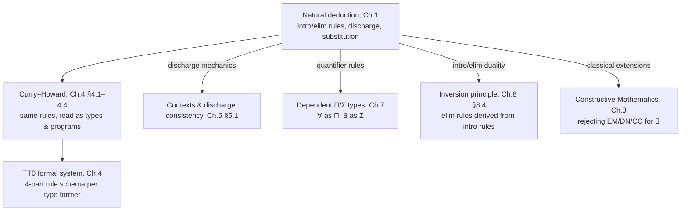

# Natural Deduction and Predicate Logic

[[book-guidelines|↩ Back to guidelines]]

## Why formalize proof at all?

Before any of this book's type theory can get off the ground, it needs a precise answer to a deceptively basic question: what, exactly, counts as a valid argument? You already have an informal sense of this — you can read a mathematical proof and (usually) tell whether a step is justified. But "usually" is the problem. Thompson opens the chapter by pointing at *Principia Mathematica*, one of the most scrutinized documents in the history of logic, and noting that it still contains incorrect proofs that escaped careful human readers. If informal rigor isn't reliable even under expert review, it certainly isn't something a machine can check.

This matters for this book specifically because of where it's going: Chapter 4 identifies formulas with types and proofs with programs (the Curry–Howard correspondence), and once that identification is in place, "checking a proof" and "type-checking a program" become the same mechanical act. But you can't build a mechanical checker for something you haven't nailed down syntactically. **Natural deduction is that nailing-down.** It replaces "this step looks justified" with a fixed, finite list of rule shapes — you can check whether a proof is valid by checking, mechanically, whether each step matches one of the rules. Nothing about the *content* of the formulas involved needs to be understood for that check; only their *form*.

The word "natural" in "natural deduction" is doing real work, too. Unlike Hilbert-style systems (a handful of axioms plus one inference rule, modus ponens), natural deduction gives each logical connective its own pair of rules — one that tells you how to *build* a proof of a formula with that connective at the top (an **introduction** rule), and one that tells you what you're entitled to *conclude* once you have such a proof (an **elimination** rule). This mirrors how people actually reason, and — not coincidentally — it mirrors how a programming language's constructors and destructors work. That parallel is exactly what Chapter 4 will exploit.

## The shape of a derivation

A **derivation** in natural deduction is a tree. Its leaves are **assumptions**; its root is the **conclusion**; and each internal node is one application of a rule, combining the derivations above it into a new one. The simplest possible derivation is licensed by the

**Assumption Rule.** The one-line tree consisting of the formula $A$ by itself is a proof of $A$, from the assumption $A$.

$$A$$

Every other rule either *combines* proofs (introduction rules typically do this) or *takes apart* a proof of a compound formula to extract what it justifies (elimination rules). The set of assumptions a derivation depends on is tracked explicitly, and — this is the subtlety that gives the whole system its power — some rules are allowed to **discharge** (remove) assumptions from that dependency set as they fire. We'll come back to that at length, because it's the single most important mechanical idea in the chapter.

**Grounding.** Think of a derivation tree exactly as you'd think of an abstract syntax tree for a well-typed expression, where "the formula being proved" plays the role of "the type," and the assumptions in scope play the role of a typing context. In Rust you might sketch the AST as:

```rust
enum Formula {
    Var(String),
    And(Box<Formula>, Box<Formula>),
    Implies(Box<Formula>, Box<Formula>),
    Or(Box<Formula>, Box<Formula>),
    Bottom,
}

enum Proof {
    Assumption(Formula),
    AndIntro(Box<Proof>, Box<Proof>),
    AndElimLeft(Box<Proof>),
    AndElimRight(Box<Proof>),
    ImpIntro(Formula /* discharged assumption */, Box<Proof>),
    ImpElim(Box<Proof>, Box<Proof>),
    // ...
}
```

A `Proof` here is a first-class data structure you can walk, and a rule application (`ImpIntro`, `AndElim*`, …) is just a tree constructor — the derivation *is* a value of an inductive type. In Lean, this correspondence is not an analogy but the literal design: Lean's kernel `Expr` type is exactly such a proof/program tree, and its typechecker walks it the same way a natural-deduction rule-checker would walk Thompson's trees. Keep this picture in mind — it is precisely what Chapter 4 formalizes as $TT_0$.

## Propositional logic

### Syntax

Thompson's Definition 1.1 gives the grammar for **formulas**: either a propositional variable $X_0, X_1, X_2, \ldots$, or a compound formula built with the connectives

$$(A \wedge B) \qquad (A \Rightarrow B) \qquad (A \vee B) \qquad \bot \qquad (A \Leftrightarrow B) \qquad (\neg A)$$

where $A$ and $B$ are themselves formulas — an ordinary inductive definition, exactly the shape of the `Formula` enum above. The convention throughout is that capital italic letters $A, B, C, \ldots$ stand for *arbitrary* formulas — they're variables in the metalanguage discussing the system, not variables of the system itself. Keep that distinction sharp; it will matter again when we get to substitution.

### Conjunction: $\wedge$

$$\dfrac{A \qquad B}{A \wedge B}\;(\wedge I) \qquad\qquad \dfrac{A \wedge B}{A}\;(\wedge E_1) \qquad\qquad \dfrac{A \wedge B}{B}\;(\wedge E_2)$$

$\wedge$-introduction combines proofs of $A$ and $B$ into a proof of $A \wedge B$, depending on the *union* of both sets of assumptions. The two elimination rules go the other way: from a proof of $A \wedge B$, extract a proof of either half. Thompson makes an observation worth internalizing early, because it recurs for every connective: the elimination rules aren't arbitrary — they are, *essentially*, the only things you're entitled to conclude from $A \wedge B$, precisely because the introduction rule is the only way to have built it. (This introduction/elimination duality is later formalized as the **inversion principle**, Chapter 8 §8.4 — elimination rules can in principle be *derived mechanically* from introduction rules.)

A first worked derivation, showing three uses of $(\wedge I)$ chained together, from assumptions $A, B, C$ (with $A$ used twice):

$$\dfrac{\dfrac{A\quad B}{(A\wedge B)}\;(\wedge I) \qquad \dfrac{A\quad C}{(A\wedge C)}\;(\wedge I)}{((A\wedge B)\wedge(A\wedge C))}\;(\wedge I)$$

**Grounding.** $\wedge$ under Curry–Howard is just a product/tuple type, so $(\wedge I)$ is pair construction and $(\wedge E_1)/(\wedge E_2)$ are `.0`/`.1` projections:

```rust
fn and_intro<A, B>(a: A, b: B) -> (A, B) { (a, b) }
fn and_elim1<A, B>(p: (A, B)) -> A { p.0 }
fn and_elim2<A, B>(p: (A, B)) -> B { p.1 }
```

In Lean, this is the literal `And` type: `And.intro : A → B → A ∧ B`, and `.left`/`.right` (or pattern matching `⟨ha, hb⟩`) are the elimination rules — Lean does not need separate "logic" and "type theory" vocabularies here because, as Chapter 4 will make explicit, there isn't a real distinction to draw.

### Implication and the discharge of assumptions

This is the rule that makes natural deduction more than propositional bookkeeping, so it's worth slowing down for the "what breaks without it" question directly.

Informally, "$A$ implies $B$" should be provable exactly when you can derive $B$ *under the extra, temporary supposition that $A$ holds*. The word "temporary" is doing all the work: once you've shown $A \Rightarrow B$, that proof no longer needs $A$ as a standing assumption — the dependency on $A$ has been absorbed *into the formula itself*. If natural deduction had no mechanism to retract an assumption once it's been used this way, every derivation of an implication would leak its hypothesis into the ambient context forever, and you could never prove anything of the form $A \Rightarrow B$ as a free-standing fact — only "$B$, given that $A$ also happens to be lying around." That's not what implication means.

$$\dfrac{\begin{array}{c}[A]^1\\ \vdots\\ B\end{array}}{A \Rightarrow B}\;(\Rightarrow I)^1 \qquad\qquad \dfrac{A \qquad A\Rightarrow B}{B}\;(\Rightarrow E)$$

The square brackets around $[A]$ mean: every occurrence of the assumption $A$ used in deriving $B$ is **discharged** — struck from the set of assumptions the new proof of $A \Rightarrow B$ depends on. Crucially, the rule doesn't require $A$ to actually be *used* in the proof of $B$; you can discharge zero occurrences. When a derivation has more than one place where an assumption is introduced and later discharged, Thompson attaches matching **labels** — $[A]^1 \ldots (\Rightarrow I)^1$ — purely so a reader (or a checker) can see which discharge closes which assumption; the label itself carries no logical content.

The book's worked example — deriving $((A \wedge B) \Rightarrow C) \Rightarrow (A \Rightarrow (B \Rightarrow C))$ — is worth walking through because it discharges three different assumptions in sequence, each at its own point in the tree:

$$
\dfrac{
\dfrac{
\dfrac{[A]^2 \quad [B]^1}{A\wedge B}\;(\wedge I)
\qquad
[(A\wedge B)\Rightarrow C]^3
}{C}\;(\Rightarrow E)
}{B\Rightarrow C}\;(\Rightarrow I)^1
\Big/\;A\Rightarrow(B\Rightarrow C)\;(\Rightarrow I)^2
\Big/\;((A\wedge B)\Rightarrow C)\Rightarrow(A\Rightarrow(B\Rightarrow C))\;(\Rightarrow I)^3
$$

Read bottom-up (the way Thompson builds it and the way §6.5's "top-down proof" technique reads *all* rules): assume $(A\wedge B)\Rightarrow C$; under that, assume $A$; under that, assume $B$; combine $A,B$ into $A \wedge B$; apply the standing implication to get $C$; then discharge $B$ (giving $B \Rightarrow C$), discharge $A$ (giving $A \Rightarrow (B \Rightarrow C)$), and finally discharge $(A\wedge B) \Rightarrow C$ itself, arriving at a formula proved from *no* assumptions at all — a **theorem**.

A second example is worth flagging because the "may not be used" clause is easy to misread as an edge case rather than the norm: proving $B \Rightarrow (A \Rightarrow B)$, Thompson introduces the assumption $B$, discharges $A$ *trivially* (there's no occurrence of $A$ anywhere — it just wasn't needed), and then discharges $B$:

$$\dfrac{[B]^2}{A \Rightarrow B}\;(\Rightarrow I)^1 \Big/\; B \Rightarrow (A \Rightarrow B)\;(\Rightarrow I)^2$$

Note there is no label "$1$" attached to any bracket — the "discharge" of $A$ is real (it's part of the rule firing) even though there was nothing to strike out.

**Grounding.** This is exactly *scope management*. A context of live assumptions is a stack (or a persistent list); $(\Rightarrow I)$ pushes a hypothesis, proves the goal, then pops it — the hypothesis cannot leak past the point where the rule fires:

```rust
struct Context(Vec<Formula>);

fn imp_intro(ctx: &mut Context, hyp: Formula, prove_conclusion: impl FnOnce(&mut Context) -> Proof) -> Proof {
    ctx.0.push(hyp.clone());
    let body = prove_conclusion(ctx);
    ctx.0.pop();                       // discharge: hyp no longer in scope
    Proof::ImpIntro(hyp, Box::new(body))
}
```

This is *not* a loose analogy — it is precisely what Lean's `intro` tactic does to the local context, and precisely why a `let`-bound or `fun`-bound variable in Rust or Lean cannot escape its enclosing block. Every lexically scoped binder you've ever used is, structurally, an instance of $(\Rightarrow I)$'s discharge mechanic. (Thompson himself flags in §5.1 that this book's *named*-assumption style of discharge — as opposed to anonymous, de Bruijn-style discharge — is one place where the neat Curry–Howard correspondence with real programming languages shows some strain; more on that in the synthesis below.)

### Disjunction: $\vee$

$$\dfrac{A}{A \vee B}\;(\vee I_1) \qquad\qquad \dfrac{B}{A \vee B}\;(\vee I_2) \qquad\qquad \dfrac{\begin{array}{c}[A]\\\vdots\\C\end{array}\qquad\begin{array}{c}[B]\\\vdots\\C\end{array}}{\,A\vee B \qquad\qquad\;\; C\,}\;(\vee E)$$

(Read the elimination rule's premises as: a proof of $A \vee B$, a proof of $C$ from $A$, and a proof of $C$ from $B$ — the two $A$/$B$ assumptions are each discharged by the one application.) The intuition: if $C$ follows from $A$ alone, and $C$ also follows from $B$ alone, then $C$ follows from *either* — this is case analysis. Thompson's worked example derives $((A \Rightarrow C)\wedge(B\Rightarrow C)) \Rightarrow ((A \vee B) \Rightarrow C)$ by combining $(\wedge E)$, $(\Rightarrow E)$, $(\vee E)$, and two nested $(\Rightarrow I)$ discharges — a good exercise in seeing multiple discharge points stack inside one tree.

**Grounding.** $\vee$ is a sum type (Rust `enum`, Lean's `Or`/`Sum`), and $(\vee E)$ is exhaustive pattern matching, where each arm is required to produce the *same* result type $C$ regardless of which variant it received — which is exactly the side condition that both branches of the elimination rule conclude the identical formula $C$:

```rust
fn or_elim<A, B, C>(disj: Either<A, B>, from_a: impl FnOnce(A) -> C, from_b: impl FnOnce(B) -> C) -> C {
    match disj {
        Either::Left(a) => from_a(a),
        Either::Right(b) => from_b(b),
    }
}
```

### Absurdity, negation, and the classical extensions

$\bot$ ("falsity") has no introduction rule — there is, definitionally, no way to prove absurdity honestly — but it has an elimination rule, *ex falso quodlibet* ("from a falsehood, anything"):

$$\dfrac{\bot}{A}\;(\bot E)$$

Negation is then *defined*, not primitive: $\neg A \equiv_{df} (A \Rightarrow \bot)$. Thompson shows the familiar rules

$$\dfrac{\begin{array}{c}[A]\\\vdots\\B\end{array}\qquad\begin{array}{c}[A]\\\vdots\\\neg B\end{array}}{\neg A}\;(\neg I) \qquad\qquad \dfrac{A \qquad \neg A}{B}\;(\neg E)$$

fall out of this definition combined with the rules already given — an early illustration that a good primitive vocabulary lets you *derive* familiar rules rather than posit them separately, and a preview of how sparingly Chapter 4's type theory will introduce genuinely new primitives.

Everything up to here is **intuitionistic**: it demands a positive proof, never lets you infer existence or truth from the mere absence of a refutation. Thompson closes §1.1 by naming the three standard ways to strengthen the system to **classical** logic, each addable as an extra rule with no premises or with a distinctive shape:

$$\dfrac{}{A \vee \neg A}\;(EM) \qquad\qquad \dfrac{\neg\neg A}{A}\;(DN) \qquad\qquad \dfrac{\begin{array}{c}[\neg A]\\\vdots\\B\end{array}\qquad\begin{array}{c}[\neg A]\\\vdots\\\neg B\end{array}}{A}\;(CC)$$

— excluded middle, double negation elimination, and (classical) proof by contradiction, respectively — and an exercise (1.7) asks the reader to show all three are interderivable given the intuitionistic core. This is not idle chapter-filler: it's the fault line the whole book will build on. Chapter 3 argues at length that a constructivist *rejects* exactly these three rules for existential reasoning, because $(EM)$, $(DN)$, and $(CC)$ all let you assert that something exists (or that a disjunct holds) without ever exhibiting *which* one — and Chapter 4's type theory is built to make that distinction show up as a difference in what you're allowed to write down, not just as a philosophical preference. (In Lean terms: this is exactly the difference between the core, constructive kernel and the `Classical` axioms — `Classical.em`, `Classical.byContradiction` — that Mathlib opts into. Turning on `open Classical` in a Lean file is, formally, adding these three rules to your proof system.)

## Predicate logic

### Terms, atomic formulas, and the quantifiers

Propositional logic treats propositions as unanalyzed atoms. Predicate logic opens them up: formulas are now built from claims about *objects* having *properties* or being *equal*. Definition 1.2 introduces **terms** — individual variables $v_0, v_1, \ldots$ (written $x, y, z, \ldots$), individual constants $c_0, c_1, \ldots$, and composite terms $f_{n,m}(t_1,\ldots,t_n)$ built by applying an $n$-ary function symbol to $n$ argument terms (constants are just the $n=0$ case). Definition 1.3 then gives **formulas**: atomic formulas $P_{n,m}(t_1,\ldots,t_n)$ (an $n$-ary predicate applied to terms) and equalities $t_1 = t_2$, closed under the propositional connectives, plus the new **quantified formulas**

$$\forall x.A \qquad\qquad \exists x.B$$

Thompson immediately grounds the intuition with an example over the naturals: "$m$ is the maximum of the range of $f$" is $\exists i.(f(i)=m) \wedge \forall j.(f(j) \le m)$ — existence for the witness, universality for the bound. He then makes a point that will resurface as the chapter's climactic worked example: **quantifier order matters**. $\forall x.\exists y.(x<y)$ ("every $x$ has *some* larger $y$", true — take $y = x+1$) is a fundamentally different, and much weaker, claim than $\exists y.\forall x.(x<y)$ ("*some* $y$ is larger than every $x$, including itself", false). In the first, the witness $y$ is allowed to depend on $x$; in the second, one witness must work uniformly for all $x$ simultaneously.

**Grounding.** A term/formula AST here just adds a `Term` sort and quantifier constructors to the earlier `Formula` enum. The `∀x.∃y.` vs. `∃y.∀x.` distinction is precisely the difference between a function `f : X → Y` (witness depends on the input) and a single fixed value `y : Y` used for every `x` — the same shape of distinction that separates a per-call dependency from a global constant in any codebase.

### Variables, binding, and substitution — the plumbing everything else depends on

This subsection (§1.2.1) earns its own heading because it is, in a very literal sense, infrastructure the rest of the book — and both of the engineering targets behind these notes — depend on. Thompson is explicit that even respected logicians have gotten this wrong.

**Bound vs. free (Definition 1.4).** An occurrence of $x$ inside $\forall x.A$ or $\exists x.A$ is **bound**; every other occurrence is **free**. A variable is bound by the syntactically *innermost* enclosing quantifier over it — "just as in any block-structured programming language," Thompson notes, which is exactly right: this is lexical scoping. The same variable name can be bound in one part of a formula and free in another, e.g. in $\forall y.(x>y \wedge \forall x.(P(x)\Rightarrow P(y)) \wedge Q(y,x))$ the second occurrence of $x$ is bound (by the inner $\forall x$) while the first and third are free.

**Why this matters for substitution.** Where the book needs to instantiate a quantified formula — plugging a term $t$ in for $x$ — it can't just do textual replacement. If $A$ has no quantifiers, naive substitution is fine; but once $A$ contains a *bound* occurrence of some variable that also happens to appear in $t$, naive substitution silently changes the formula's meaning. This is **variable capture**, and Thompson's example makes the failure concrete: take $\exists y.(y > x)$ ("there's a $y$ bigger than $x$") and substitute the term $y+1$ for $x$. Textually, that gives $\exists y.(y > y+1)$ — a different, false claim, because the $y$ inside the substituted term $y+1$ has been silently captured by the $\exists y$ it was substituted under. The fix is to first rename the bound variable to something fresh — $\exists z.(z>x)$ — *then* substitute, yielding the correct $\exists z.(z > y+1)$.

Definitions 1.5–1.6 make this precise with the notation $A[t/x]$ ("$A$ with $t$ substituted for $x$"), defined structurally: substitution commutes with the propositional connectives and with function application on terms, but the clause for a quantifier $\forall y.B$ (with $y \not\equiv x$) branches on exactly this capture risk:

- if $y$ does **not** occur in $t$: $(\forall y.B)[t/x] \equiv_{df} \forall y.(B[t/x])$ — safe, recurse straight through.
- if $y$ **does** occur in $t$: $(\forall y.B)[t/x] \equiv_{df} \forall z.(B[z/y][t/x])$, where $z$ is chosen fresh (not occurring in $t$ or $B$) — rename the binder first, *then* substitute.

(And if $A \equiv \forall x.B$ itself — i.e., $x$ is the variable *being bound* right where you'd substitute — the substitution does nothing: $A[t/x] \equiv_{df} A$, since every occurrence of $x$ inside is bound, not free.)

**This is the exact mechanism behind capture-avoiding substitution** — the single most load-bearing piece of plumbing under both engineering targets this vault is building toward. A Hoare-logic soundness proof needs substitution into predicates to behave correctly under quantifiers for the assignment axiom to be sound at all; an elaborator resolving implicit arguments via metavariable unification needs exactly this discipline whenever it instantiates a metavariable whose solution mentions a variable that a surrounding binder also uses. Real implementations dodge the "choose a fresh $z$" step entirely by switching representation: **de Bruijn indices** replace named bound variables with numbers counting binder-nesting-depth, so that "renaming to avoid capture" becomes unnecessary — substitution just has to shift indices correctly across binder crossings. This is exactly what Lean's kernel `Expr` representation does internally, and it's the reason Lean's own elaborator never has to invent fresh names the way Thompson's $z$ does on paper.

```rust
// A direct (named-variable) transcription of Definition 1.6's quantifier case.
// `fresh` must pick a variable occurring in neither `body` nor `t`.
fn subst_forall(bound: &str, body: &Formula, t: &Term, x: &str, fresh: impl Fn() -> String) -> Formula {
    if !occurs_in(bound, t) {
        Formula::Forall(bound.into(), Box::new(subst(body, t, x)))
    } else {
        let z = fresh();
        let renamed = subst(body, &Term::Var(bound.into()), &z); // B[z/y]
        Formula::Forall(z, Box::new(subst(&renamed, t, x)))      // then [t/x]
    }
}
```

In Lean, you never write this by hand for object-level formulas — `Expr.instantiate`/`Expr.abstract` implement exactly this de Bruijn-index version, and it is precisely what fires every time you apply a lemma of the form `∀ x, P x` to a specific term inside a proof term.

### Quantifier rules (§1.2.2)

Two readings of a free variable motivate the rules. First: when stating a theorem, a free variable can stand for an **arbitrary** object — "$\sin^2 x + \cos^2 x = 1$" is implicitly $\forall x.(\ldots)$ because $x$ was never constrained. This licenses:

$$\dfrac{A}{\forall x.A}\;(\forall I) \quad\text{provided $x$ is not free in any undischarged assumption of the proof of $A$}$$

That proviso is the rule's **side condition**, and it's the second reading of free variables, by contrast, that shows why the side condition is necessary: if you *assume* something about $x$ — say $x > 0$ — and manage to prove $\forall z.(z \le x \vee z \ge 0)$ under that assumption, you plainly cannot generalize to "for all $x$" (take $x=-1$: false). The variable $x$ here is not arbitrary — it's constrained by a live assumption. So "$x$ is arbitrary" is defined operationally: $x$ is arbitrary in a proof exactly when $x$ doesn't occur free in any assumption that proof still depends on. This is precisely the **eigenvariable condition** you'll meet again the moment you study any sequent calculus or resolution prover — the same guard, differently phrased.

$$\dfrac{\forall x.A}{A[t/x]}\;(\forall E) \qquad\qquad \dfrac{A[t/x]}{\exists x.A}\;(\exists I)$$

$\forall$-elimination instantiates a universal at any term $t$ — a universally true fact holds of every particular object, so substitute freely (using exactly the $A[t/x]$ machinery from the previous subsection). $\exists$-introduction is its dual on the introduction side: if you can prove some particular instance $A[t/x]$, you've thereby shown *something* satisfies $A$, no side condition needed.

The elimination rule for $\exists$ is the subtle one, and it has a side condition mirroring $(\forall I)$'s:

$$\dfrac{\exists x.A \qquad \begin{array}{c}[A]\\\vdots\\B\end{array}}{B}\;(\exists E) \quad\text{provided $x$ is not free in $B$ or in any other assumption the proof of $B$ depends on}$$

Read operationally: an assumption $\exists x.A$ licenses introducing a *temporary, local name* $x$ for "the" witnessing object, proving some $x$-independent conclusion $B$ from $A(x)$, and then discharging — the name $x$ was scratch scaffolding and must not leak into the conclusion or into any surviving assumption, exactly the way a locally-bound variable in a `match`/`let` block must not escape its scope. Thompson calls out this programming-language reading explicitly.

There's a genuinely illuminating second intuition here too: $\forall$ and $\exists$ behave like *infinite* conjunction and disjunction over the domain's objects $a, b, \ldots$:

$$\forall x.A(x) \equiv A(a) \wedge A(b) \wedge \cdots \qquad\qquad \exists x.A(x) \equiv A(a) \vee A(b) \vee \cdots$$

Under this reading, $(\forall E)$ is just "project out one conjunct," $(\exists I)$ is just "inject one disjunct," and $(\exists E)$ is just "case-split over every disjunct, using the same conclusion for all of them" — the quantifier rules are the propositional connective rules, generalized from a fixed finite list of cases to an unbounded domain. (This is also the earliest hint of Chapter 4's dependent function and dependent sum types: $\forall x{:}A.B(x)$ as a function producing a $B(x)$ for *each* $x{:}A$, and $\exists x{:}A.B(x)$ as a pair of a witness *and* a proof about it — see Chapter 7.)

**Grounding.** $(\forall I)$'s eigenvariable condition is the same discipline that keeps a Rust generic function `fn f<T>(x: T) -> ...` from silently depending on any *particular* `T` — the type parameter must be treated fully abstractly, exactly like an arbitrary $x$ that mustn't occur free in the ambient environment. In Lean, `∀ x, A x` *is* the dependent function type `(x : α) → A x`, so $(\forall I)$ is literally the `fun x => ...` lambda-introduction rule, and its side condition is enforced automatically by the kernel's scoping — you cannot construct a term of type `∀ x, A x` that secretly depends on some other fixed `x` from the surrounding context, because the bound `x` genuinely is fresh in the term. $(\exists I)/(\exists E)$ correspond to constructing and destructuring a dependent pair (`Sigma`/`⟨witness, proof⟩` in Lean, or a `struct { witness: T, proof: P(witness) }` in Rust) — Chapter 7 develops exactly this correspondence in full.

### Examples (§1.2.3)

Three worked derivations close the chapter, and each teaches something specific.

**Modus-ponens-under-a-quantifier.** From $\theta \equiv \forall x.(P(x)\Rightarrow Q(x))$ and $\exists x.P(x)$, derive $\exists x.Q(x)$. The technique — "to use an existential assumption $\exists x.P(x)$, strip it to the instance $P(x)$, work with that, and discharge via $(\exists E)$ at the end" — is the standard idiom for existential elimination, and it's worth noting explicitly that $(\exists I)$'s *lack* of a side condition means you can freely reintroduce $\exists x.Q(x)$ even while $x$ is still (locally) free, since the resulting formula no longer mentions the local $x$ by the time you exit the $(\exists E)$ scope.

**Universal case-split (the "everything is tasty" argument).** From $\forall x.(A(x)\vee B(x))$, $\forall x.(A(x)\Rightarrow T(x))$, $\forall x.(B(x)\Rightarrow T(x))$, derive $\forall x.T(x)$: instantiate all three universals at a fresh $y$, case-split on $A(y)\vee B(y)$ via $(\vee E)$ to get $T(y)$ either way, then re-generalize with $(\forall I)$ — legal precisely because $y$ was never constrained by any assumption still standing at that point.

**The quantifier-reordering theorem.** The chapter's capstone example proves

$$\exists y.\forall x.A(x,y) \Rightarrow \forall x.\exists y.A(x,y)$$

— "if one $y$ works for every $x$, then every $x$ has *some* $y$ that works" (trivially true; strip the assumed $\exists y.\forall x.A(x,y)$ down to $\forall x.A(x,y)$ via $(\exists E)$, instantiate at arbitrary $x$ to get $A(x,y)$, reintroduce via $(\exists I)$ to $\exists y.A(x,y)$, generalize via $(\forall I)$ since $x$ is still arbitrary, then discharge the whole thing via $(\Rightarrow I)$):

$$
\dfrac{
\dfrac{
\dfrac{[\forall x.A(x,y)]^1}{A(x,y)}\;(\forall E)
}{\exists y.A(x,y)}\;(\exists I)
}{\forall x.\exists y.A(x,y)}\;(\forall I)
$$
$$
\dfrac{[\exists y.\forall x.A(x,y)]^2 \qquad \Big(\text{above, using }(\exists E)^1\Big)}{\forall x.\exists y.A(x,y)}\;(\exists E)^1
\Big/\;\exists y.\forall x.A(x,y)\Rightarrow\forall x.\exists y.A(x,y)\;(\Rightarrow I)^2
$$

This is the punchline of the earlier apple/orange-of-witnesses discussion (§1.2, page 18): the *converse* — $\forall x.\exists y.A(x,y) \Rightarrow \exists y.\forall x.A(x,y)$ — is **not** derivable, and the reason is exactly the side conditions. Trying to mimic the same proof strategy: from $\forall x.\exists y.A(x,y)$, instantiating at an arbitrary $x$ gives $\exists y.A(x,y)$; stripping that via $(\exists E)$ gives a *local* witness $y$ that is allowed to depend on $x$ — and $(\exists E)$'s side condition explicitly forbids the bound variable from surviving into the conclusion. To finish the proof you'd need to pull that per-$x$ witness $y$ *out* to build a single $\exists y.\forall x.A(x,y)$, but doing so would mean $y$ escapes the scope in which it was legitimately introduced — precisely the leak the side condition exists to prevent. (Exercise 1.13 asks you to make this failure precise; this is also, not coincidentally, exactly the failure mode that later shows up as the difference between the weak and strong existential-elimination rules in Chapter 7, and as the reason Skolemizing a $\forall\exists$ specification into a single choice function $\exists f.\forall x.\ldots$ is a real strengthening, not bookkeeping — see §7.1.1.)

## Where this leads



Everything in this chapter reappears, barely disguised, once the book turns to type theory proper: Chapter 4 rereads the very same introduction/elimination/discharge machinery with "formula" relabeled "type" and "proof" relabeled "program" — that's the whole content of the Curry–Howard isomorphism. The discharge-of-assumptions mechanism becomes context management for typing judgments in Chapter 5 (§5.1's insistence that discharge must remove *every* occurrence of a named assumption, and its later observation in §5.12 that this book's *named*-assumption discipline — as opposed to purely positional, de Bruijn-style discharge — is one place the correspondence with real functional languages shows genuine friction). The quantifier rules become the dependent function type ($\forall$, i.e. $\Pi$) and dependent sum type ($\exists$, i.e. $\Sigma$) in Chapter 7, with the weak/strong distinction in $\exists$-elimination tracing directly back to the side condition you just saw break the quantifier-reordering converse. And the classical extensions (EM, DN, CC) set up the fault line Chapter 3 elaborates philosophically: [[Constructive-Mathematics|constructive mathematics]] is, formally, exactly this system *without* those three rules.

For the standing projects this vault is built around: the substitution machinery in §1.2.1 — bound/free variables, capture, and the fresh-renaming discipline — is not background color. It is the direct ancestor of capture-avoiding substitution as implemented via de Bruijn indices in a real kernel (Lean's `Expr.instantiate`), and it is exactly the plumbing a Hoare-triple soundness proof needs under its assignment axiom. The $(\forall I)$/$(\exists E)$ eigenvariable side conditions are the first appearance of a scoping discipline you will need to re-derive, in code, the day you write a substitution or unification routine for a Rust-based verifier: get the freshness condition wrong, and soundness silently breaks in exactly the way the failed quantifier-reordering converse shows.
