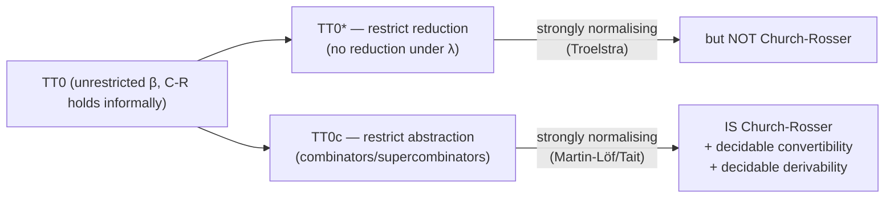

[[book-guidelines|↩ Back to guidelines]]

# Normalisation and Computational Properties

## The problem: your reduction rules are too strong for your own good

Chapter 4 gave $TT_0$ a reduction relation $\to$ — the standard $\beta$-like computation rules, unrestricted, allowed to fire anywhere inside a term, including under a $\lambda$. That's the natural thing to write down, and it's exactly what you'd want if your only goal were "define what a term evaluates to." But Chapter 5 turns around and studies $TT_0$ as a mathematical object, and immediately asks the same three questions Thompson asked of the untyped and simply-typed $\lambda$-calculus back in §2.3, §2.4, §2.11:

1. **Does every reduction sequence terminate?** (Strong normalisation.)
2. **Do any two reduction sequences from the same term reconcile — is there always a common expression they can both reach?** (The Church–Rosser property.)
3. **Is convertibility ($\leftrightarrow\!\!\leftrightarrow$, the symmetric-transitive-reflexive closure of $\to$) decidable?** And is *derivability itself* — "is $a:A$ provable at all?" — decidable?

These aren't idle curiosities. Decidability of convertibility is what licenses a type-checker to actually run: type-checking in a dependently typed system routinely needs to ask "are these two types the same?", and that question only has a good answer if convertibility-checking terminates and gives one true answer. If you've ever wondered what Lean's `isDefEq` or Rust's trait-solver equality checks are *doing* under the hood, this section is the metatheoretic justification that such a procedure can exist and be complete: reduce both sides to normal form, compare.

The twist is that Thompson can't just prove all three properties for the naive $TT_0$ with unrestricted reduction. He needs *two* auxiliary systems to get there, and the reason why is the load-bearing idea of this whole section.

## Part 1: printable values, and why reduction under a $\lambda$ is worth restricting

Before touching reduction, Thompson asks what it even means to *evaluate* something to a result you can print. A function $N \Rightarrow N$ can't be printed extensionally — you'd need to list its value on every input, an infinite task. So the only sensible notion of "printed result" is a normal-form *representation* — some closed syntactic object, not the infinite graph of an extensional function. This motivates a definition: a type is **ground** if it involves no embedded function type or universally quantified type; printable values are the closed normal forms of ground type. (This is the same distinction — computation rule vs. equivalence rule, ground vs. non-ground type — that Chapter 2 set up for the ordinary $\lambda$-calculus; Chapter 5 is where it gets load-bearing.)

Given that, here's the key observation about *how* well-typed terms actually get evaluated in practice. Consider

$$(\lambda x.\,(II)x)\,2$$

You can reduce this by first simplifying $(II)$ inside the body (a reduction *under* the $\lambda$), or you can apply the outer redex first and let substitution carry $2$ in for $x$:

$$(\lambda x.\,(II)x)\,2 \;\to\; (II)2 \;\to\; I\,2 \;\to\; 2$$

Thompson's point: on a **leftmost-outermost** reduction strategy, you never actually need to reduce inside a $\lambda$ that hasn't yet been applied — if the leftmost-outermost redex is ever inside a $\lambda$, that $\lambda$ is never going to get applied to anything (nothing outside it depends on its internal structure), so reducing inside it was wasted work relative to producing a *printable* answer. This is exactly the operational intuition behind lazy evaluation / call-by-name in a real interpreter: don't descend into an unapplied closure's body.

That observation is what motivates defining a genuinely restricted reduction system.

### $TT_0^*$: reduction that stops at binders

**Definition 5.7.** In $TT_0^*$, $e$ reduces to $f$ in one step exactly when $e \equiv g[e_0/z]$ for some context $g$ where the hole $z$ occurs **outside every binding construct** of $g$, $e_0 \to f_0$ by an ordinary computation rule, and $f \equiv g[f_0/z]$.

In plain words: you may only fire a computation rule at a position that is *not* underneath a $\lambda$ (or any other binder). This is a weak-head-normal-form–flavored notion of reduction, but arrived at by changing $\to$ itself rather than changing what counts as a normal form.

**Theorem 5.8 (Troelstra).** $TT_0^*$ is strongly normalising.

The proof strategy is worth internalizing even without the full details: it's a *reduction-preserving translation* into a simpler target system, Gödel's system of finite-type arithmetic $N\text{-}HA^\omega$ (which has just products and function spaces over $N$, no dependent types). The translation $(-)^*$ collapses all the dependency: identity types, booleans, and the finite types all map to the fixed type $N$; $\forall$ and $\exists$ collapse to the non-dependent $\Rightarrow$ and $\times$; disjunction is coded as a tagged product $N \times A^* \times B^*$. The crucial property is that reduction is preserved — $a \to b$ in $TT_0^*$ implies $a^* \to b^*$ in $N\text{-}HA^\omega$ — so an infinite reduction sequence in $TT_0^*$ would translate to an infinite one in $N\text{-}HA^\omega$, contradicting *that* system's known strong normalisation (itself proved by the same reducibility/Tait method from §2.7). This is a classic metatheory move: don't prove strong normalisation directly on the complicated system, erase the complication (dependency) into something you've already handled, and let preservation of the reduction relation do the transporting.

**But $TT_0^*$ is not Church–Rosser.** Here's the counterexample, and it's worth sitting with because it's the crux of the whole section:

$$(\lambda x.(\lambda y.x))\,(II) \;\to\; (\lambda x.(\lambda y.x))\,I \;\to\; \lambda y.I$$

versus reducing the outer redex first:

$$(\lambda x.(\lambda y.x))\,(II) \;\to\; \lambda y.(II)$$

Both $\lambda y.I$ and $\lambda y.(II)$ are **normal forms in $TT_0^*$** — by construction, no reduction is allowed inside a $\lambda$, so neither term can be reduced further even though $(II)$ is sitting right there, visibly a redex, in the second one. And the two terms are *not* the same normal form. There is no common reduct to complete the Church–Rosser diamond. The restriction that bought you strong normalisation is exactly what breaks confluence: by disallowing reduction under binders, you can trap a live redex permanently inside a normal form, and which redex gets trapped depends on the order you chose to reduce in.

**Why this matters beyond a technicality.** Without Church–Rosser, you lose uniqueness of normal forms, and *that* is what you needed for a decision procedure for convertibility (reduce both sides, compare). $TT_0^*$'s failure isn't a minor blemish — it takes away the very property the whole enterprise was chasing. Something structurally different is needed.

## Part 2: fix it by restricting how abstraction itself is formed

The insight that repairs this: the problem was never really "reduction under $\lambda$" per se — it was that $\lambda$-abstraction *hides* redexes inside an opaque binder, with no way to expose them without violating the no-reduction-under-binders discipline. So instead of relaxing the reduction rule, Thompson (following Martin-Löf 1975) changes how functions get **introduced** in the first place: replace $\lambda$-abstraction with **named function constants**, each carrying its own top-level computation (rewrite) rule. This is precisely the technique of $\lambda$-lifting / supercombinators from real compiled functional-language implementations (Peyton Jones, Hughes) — if you've ever compiled Haskell or looked at how GHC's STG machine represents closures, this section is exactly that transformation, derived from first principles as metatheory rather than as an implementation trick.

### Combinator abstraction

The basic move (**Definition 5.9**): if $e:B$ is derived from assumptions $x_1:A_1,\ldots,x_k:A_k,\,x:A$, instead of forming $\lambda x.e$ you introduce a **fresh constant** $f$ together with the rewrite rule

$$f\,x_1\ldots x_k\,x \to e$$

and the abstraction $\lambda x.e$ (relative to the outer context) is now represented by the *partial application* $f\,x_1\ldots x_k$, of type $(\forall x:A).B$. The variables $x_1,\ldots,x_k$ — everything free in $e$ besides the bound $x$ — are called the **parameters**; they have to be threaded through explicitly because $f$'s rewrite rule can't refer to anything not in its own argument list (this is the standard closure-conversion problem: a top-level function can't close over free variables, so you turn them into explicit extra parameters).

Concretely: to represent $\lambda x.\lambda y.x$, abstract over $y$ first. The body $x$ has free variable $x$, so define $f\,x\,y \to x$, giving $f\,x : B\Rightarrow A$. Then abstract over $x$: define $g\,x \to f\,x$, giving $g : A \Rightarrow (B \Rightarrow A)$.

Rerun the earlier Church–Rosser counterexample in this system. $(\lambda x.\lambda y.x)$ becomes $g$ as above, so $(\lambda x.(\lambda y.x))(II)$ becomes $g\,(II)$, which reduces:

$$g\,(II) \to f\,(II) \to f\,I$$

Crucially, $f\,(II)$ is **not itself a redex** — $f$'s rewrite rule needs two arguments ($x$ and $y$) and $f\,(II)$ only supplies one — so there's no ambiguity about whether to reduce inside the constant's still-unsaturated argument. The dangerous case (trapping a live redex inside an under-applied binder) simply doesn't arise for this *particular* abstraction, because the redex $(II)$ sits in argument position, plainly visible, rather than buried inside a $\lambda$-body.

But watch the catch, which Thompson deliberately surfaces: **the same object-level $\lambda$-term can be represented by different constant abstractions**, and which one you pick determines which redexes are visible. Take $\lambda x.(II)$ — literally "ignore $x$, return $(II)$." The naive combinator abstraction gives $c\,x \to (II)$, so the term $c$ hides the redex $(II)$ inside its own rewrite rule, unreachable — exactly the same trap as before. But if you instead see $\lambda x.(II)$ as an instance of the more general $\lambda x.y$ (with $y$ standing for an arbitrary parameter of the right type, here instantiated to $(II)$), abstraction gives $c'\,y\,x \to y$, and the specific term is $c'\,(II)$ — now $(II)$ is an argument, visibly a redex, reducible to $c'\,I$. Same $\lambda$-term, two different combinator representations, one hides a redex and one doesn't. This tells you combinator abstraction alone isn't a free lunch — you need a *systematic* way to choose parameters that always exposes every potential redex.

### Supercombinator abstraction: the systematic fix

**Definition 5.10 (maximal free expression, mfe).** A proper subexpression $f$ of $e$ is *free with respect to* $x$ if $x$ doesn't occur free in $f$. It's a **maximal free expression** if it's free w.r.t. $x$ and is not itself a proper subexpression of some larger free-w.r.t.-$x$ expression.

**Definition 5.11 (supercombinator abstraction).** To abstract $e$ over $x$: find *all* the mfes $f_1,\ldots,f_l$ of $e$ with respect to $x$, introduce a fresh constant $g$ with rewrite rule

$$g\,k_1\ldots k_l\,x \to e[k_1/f_1,\ldots,k_l/f_l]$$

and represent the abstraction as $g\,f_1\ldots f_l$.

The point of taking *maximal* free expressions, rather than some arbitrary subset, is that it's the largest chunk of the term you can safely factor out as a parameter — and by construction, every subterm not underneath $x$'s scope ends up as an actual argument to $g$, sitting outside the opaque rewrite-rule body, hence visible and reducible. Worked example: abstracting $\lambda x.\lambda y.((II)x)$. First abstract over $y$: the single mfe of $((II)x)$ w.r.t. $y$ is the whole thing, giving $c\,k_1\,y \to k_1$ and representation $c\,((II)x)$. Then abstract over $x$: the mfe of $((II)x)$ w.r.t. $x$ is just $(II)$, giving $d\,k_1\,x \to c(k_1\,x)$ and final representation $d\,(II)$ — with $(II)$ sitting as a visible top-level argument, exactly as needed.

**Lemma 5.13.** Using supercombinator abstraction throughout, *every* redex that could be reduced in unrestricted $TT_0$ (i.e., every free redex) remains reachable in $TT_0^c$. This gives an embedding of $TT_0$ into $TT_0^c$ that preserves reduction and computation — so $TT_0^c$'s metatheory transfers back to statements about $TT_0$.

**Definition 5.12** packages this into a full system, $TT_0^c$: every type-forming and function-forming rule is restated so that abstraction is done via (super)combinators rather than raw binders, with parameters chosen to expose the relevant redexes. Notation-wise, Thompson keeps writing $\lambda x.e$ and $(\forall x:A).B$ as shorthand — but it's understood to secretly desugar to the constant-and-rewrite-rule machinery above.

> **What breaks without this.** Without supercombinator abstraction — i.e., staying with plain $\lambda$-binders and unrestricted-but-undisciplined reduction — you're stuck choosing between $TT_0$ (Church–Rosser holds, informally, but you have no strong-normalisation proof cheap enough to hand) and $TT_0^*$ (strongly normalising, but confluence provably fails, so "the" normal form of a term isn't even well-defined). $TT_0^c$ is what lets you have both properties on the *same* reduction relation, by changing where the redexes can hide rather than where you're allowed to look for them.

**Rust/compiler grounding.** This is a precise formal analogue of closure conversion / lambda lifting in a real compiler pipeline: given a closure that captures free variables, hoist it to a top-level function taking the captured environment as explicit extra parameters. The "maximal free expression" criterion is essentially asking a compiler pass: what's the largest subexpression I can float out of this closure body as a pre-computed argument rather than re-deriving it inside the closure? A Rust closure `move |x| some_captured_value + x` is a `struct` capturing `some_captured_value` plus a call operator — that's combinator abstraction, concretely, and the "which representation exposes which redex" subtlety is the same question as whether your compiler evaluates `some_captured_value` eagerly at closure-creation time or defers it into the closure body.

## Part 3: the normalisation theorem for $TT_0^c$, by induction over stability

With $TT_0^c$ in hand, Thompson proves the theorem the whole section has been building toward. The proof method echoes §2.7's Tait/reducibility argument for the simply-typed $\lambda$-calculus, but has to be adapted because in type theory *types and terms are defined by a simultaneous induction* — you can't first fix "the types" and induct over term structure the way you could in the simply-typed setting. Instead Thompson inducts over **derivations of closed judgements** $a:A$ (closed = no free assumptions), simultaneously defining three things by that induction:

- $A^0$ — a closed normal form of the type $A$,
- $a^0$ — a closed normal form of the term $a$ (so $a \twoheadrightarrow a^0$), which is additionally required to be a member of
- $\|A\|$ — the set of **stable** terms of type $A$: terms guaranteed to reduce well-behavedly under elimination (e.g. for function type, $f^0$ is stable iff $f^0\,a^0$ reduces to a closed normal form for every closed normal $a^0:A^0$).

For *open* judgements (dependent on a context $x_1:A_1,\ldots,x_n:A_n$), $a^0$ and $A^0$ become **meta-level functions** of normal-form parameters $x_1^0,\ldots,x_n^0$ — not terms of the system itself, but operations assigning normal forms to normal-form inputs. Two conditions are imposed on these functions, called together **parametricity**:

1. Substituting closed normal forms in for the $x_i^0$ and then reducing agrees with applying $a^0$ to those same normal forms directly: $a[a_1^0/x_1^0,\ldots] \twoheadrightarrow a^0[a_1^0/x_1^0,\ldots]$.
2. The assignment **commutes with substitution**: $(a(a_1,\ldots,a_n))^0 \equiv a^0(a_1^0,\ldots,a_n^0)$.

**Theorem 5.14 (Normalisation for $TT_0^c$).** Every closed term $b$ has a normal form $b^0$, and moreover if $b \leftrightarrow\!\!\leftrightarrow c$ then $b^0 \equiv c^0$.

The proof is a case analysis over every type/term-forming construct of $TT_0^c$ ($\forall$, $\exists$, $\vee$, $\bot$, the finite types $N_n$, $N$, the identity type $I$, and by extension tree/well-founded types), checking in each case that (a) the assignment $(-)^0$ is well-defined and lands in the stable set, (b) it's parametric, and (c) both sides of every computation rule get assigned *identical* normal forms — e.g. for the rule $\mathrm{fst}(a,b)\to a$, one shows $(\mathrm{fst}(a,b))^0 \equiv (\mathrm{fst}(a^0,b^0))^0 \equiv a^0$ directly from the definitions, never needing to actually run the reduction. The $\forall$-introduction case is the one that most directly uses supercombinator abstraction: for $f\,f_1\ldots f_l$ (with $f$'s rewrite rule $f\,k_1\ldots k_l\,x \to e[k_1/f_1,\ldots]$), stability of $f^0$ is verified by showing $f^0\,a^0 \to e[a^0/x] \twoheadrightarrow e^0[a^0/x] \equiv (e[a/x])^0$ for any closed normal $a^0$ — leaning on parametricity of $e^0$, assumed by the induction hypothesis.

That the induction goes through cleanly, construct by construct, is *itself* the payoff of having restricted abstraction to combinator/supercombinator form: each case only has to reason about a top-level rewrite rule applied to already-normalised arguments, never about reduction reaching in under an opaque binder.

## Part 4: the corollaries — this is where the payoff actually lands

Everything downstream falls out of Theorem 5.14 almost for free, and this cascade is the real substance of "why go to all this trouble":

- **Corollary 5.15 (a model exists).** Interpret each type $A$ by the set $\|A\|$ of stable terms, and each closed term $a$ by its normal form $a^0 \in \|A\|$. Having *any* model is itself non-trivial — it's evidence the system is consistent.

- **Corollary 5.16 (interconvertible closed normal terms are identical).** If $a, b$ are already normal and $a \leftrightarrow\!\!\leftrightarrow b$, then since normal terms are their own normal forms ($a \equiv a^0$, $b \equiv b^0$) and the theorem gives $a^0 \equiv b^0$ whenever $a\leftrightarrow\!\!\leftrightarrow b$, transitivity of $\equiv$ gives $a \equiv b$ directly.

- **Corollary 5.17 (uniqueness of normal forms).** If $a$ has two normal forms $b, c$, they're interconvertible (both reachable from $a$ by $\leftrightarrow\!\!\leftrightarrow$-related reductions), hence identical by 5.16. *This is exactly the property $TT_0^*$ was missing.*

- **Theorem 5.18 (Church–Rosser, finally).** $a \leftrightarrow\!\!\leftrightarrow b$ iff $a, b$ have a common reduct. The "only if" direction: reduce both to their (unique, by 5.17) normal forms; the theorem guarantees these are identical, giving a common reduct.

- **Theorem 5.19 (shape of normal forms).** A clean table pinning down exactly what closed normal forms look like at each type — pairs at $\wedge/\exists$, the constant $f^0$ at $\Rightarrow/\forall$, injections at $\vee$, $r(a^0)$ at the identity type, numerals at $N_n$/$N$, constructors at `tree`. This is precisely the "canonical forms" lemma a type-checker or evaluator needs to pattern-match on results safely.

- **Theorem 5.20 (convertibility is decidable).** Reduce $a$ and $b$ to normal form; they're convertible iff the normal forms are identical. This is the theorem that makes a type-checker's equality check a *terminating, complete* algorithm rather than a best-effort heuristic — precisely the procedure underlying `isDefEq`-style definitional-equality checking in a real dependently-typed kernel.

- **Theorem 5.21 (derivability is decidable).** Given candidate $A$ and $a$: normalise $A$, check it's a valid normal form of a type; then normalise $a$, check $a^0$ is a normal form of type $A^0$. Thompson flags this as genuinely surprising — the rule system only obviously gives you *semi*-decidability (search for a derivation; if one exists you'll eventually find it, but a non-existent derivation gives no signal to stop searching). That derivability collapses all the way to *decidable* is a nontrivial consequence of normalisation, not something visible from the shape of the rules themselves.

### §5.6.1 — a caution: this only works because $TT_0^c$ is monomorphic

Thompson closes with an important caveat, attributed to Salvesen. $TT_0^c$ as built is **monomorphic**: every occurrence of, say, "the identity function" is really shorthand for a *distinct* function constant of a specific type $A \Rightarrow A$, one per instantiation of $A$ — there's no single polymorphic $\lambda x.x$ floating free of type information underneath the notation. You might hope this monomorphic presentation is just a harmless bookkeeping shorthand for an implicitly polymorphic system (à la a Hindley–Milner-style principal-types view, where you erase types and regenerate them later). Salvesen shows this hope is **false** — the two derivations

$$\dfrac{0:N}{\lambda y^{N\Rightarrow N}.\,0 : (N\Rightarrow N)\Rightarrow N}\;\;\dfrac{[x:N]}{\lambda x^N.\,x : N \Rightarrow N}\Big/\;\; (\lambda y^{N\Rightarrow N}.0)(\lambda x^N.x):N$$

$$\dfrac{0:N}{\lambda y^{B\Rightarrow B}.\,0 : (B\Rightarrow B)\Rightarrow N}\;\;\dfrac{[x:B]}{\lambda x^B.\,x : B \Rightarrow B}\Big/\;\; (\lambda y^{B\Rightarrow B}.0)(\lambda x^B.x):N$$

give **identical** untyped conclusions $(\lambda y.0)(\lambda x.x):N$ once you erase the type annotations — yet there is *no single monomorphic type* you can consistently assign to $x$ and $y$ that recovers both derivations at once. So the erasure map from (typed) monomorphic derivations to untyped terms is not invertible in any uniform way, and a Milner-style principal-type reconstruction is provably impossible in general for this system. Thompson notes this doesn't preclude *explicit* polymorphism — you can still quantify over a universe $U_n$ to get genuinely polymorphic definitions — it just rules out treating implicit, ambient polymorphism as free.

> **Why this caveat matters for elaboration/unification work specifically:** this is a sharp, named counterexample to "can I always reconstruct principal types after erasing them," which is exactly the question a bidirectional elaborator's inference mode has to answer well. It's a cautionary data point that "infer the missing type annotations" isn't always well-posed even in a system with decidable type-checking — decidability of *checking* ($a:A$?) and decidability/existence of *principal-type inference* are genuinely different properties, and $TT_0^c$ has the first without the second.

## Synthesis: where this sits in the book, and what it feeds

Structurally, this section is the metatheoretic backbone the rest of Chapter 5 (and much of Chapter 6) leans on without re-deriving:

- §5.7–5.8's whole discussion of "different equalities" (definitional equality, convertibility via the $I$-type, equality functions, and eventually an *extensional* equality defined safely inside the intensional theory) presupposes that convertibility is a well-behaved, decidable relation with unique normal forms — that's Theorems 5.18/5.20 being used, not re-proved.
- Chapter 6's programming examples all implicitly rely on Theorem 5.20/5.21: every time the book type-checks a Miranda-style function definition or asks whether two type expressions used in a specification coincide, it's invoking exactly this decision procedure.
- The later discussion of extensional equality (§5.8.2–5.8.3) is framed explicitly against the *cost* of Martin-Löf's extensional identity rule: adding it back destroys strong normalisation and hence this entire decidability cascade — so this section is also what makes the coming trade-off legible: you can have full extensionality, or you can have everything proved here, but historically not both at once.

**For the compiler/elaborator project this reader is building:** Theorem 5.20's proof *is* the specification for a definitional-equality checker — normalise both sides (via whatever WHNF/NF strategy you pick, informed by the $TT_0^*$ vs. $TT_0^c$ distinction about where reduction is and isn't allowed to happen), compare. The combinator/supercombinator abstraction machinery in §5.5.3 is directly the closure-conversion pass a Rust-hosted evaluator needs if it represents bound terms as closures rather than doing substitution-based interpretation — and the maximal-free-expression criterion is a genuinely useful design constraint to borrow even outside type theory. Salvesen's counterexample in §5.6.1 is worth keeping in your back pocket for the elaborator: it's a concrete reminder that decidable type-*checking* does not hand you decidable type-*inference* for free, which is precisely the gap bidirectional typing (checking mode vs. inference mode) is designed to manage rather than dissolve.
