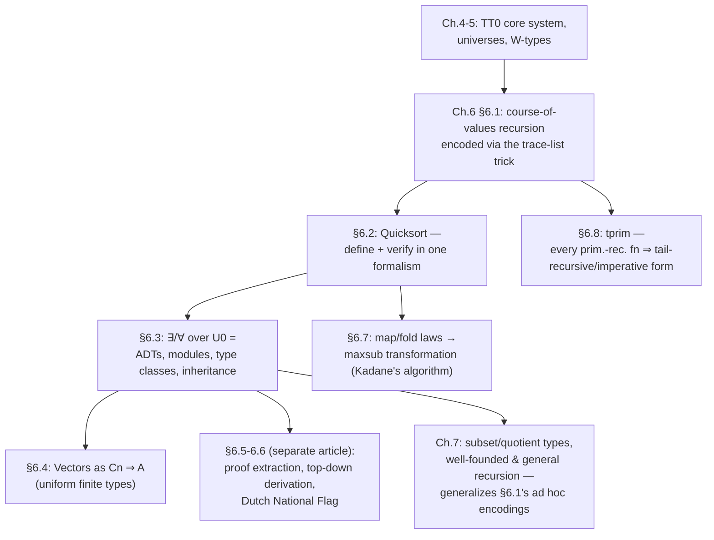

# Programming in Type Theory

[[book-guidelines|↩ Back to guidelines]]

## The problem this chapter solves

Every earlier chapter built the machine: $TT_0$'s formation, introduction, elimination and computation rules, the identity type, universes. Chapter 6 turns the crank and asks what it feels like to actually *write software* in that machine. Two structural facts about $TT$ immediately bite:

1. **Only primitive recursion is legal.** $TT_0$, $TT$ and $TT^+$ are all strongly normalising — every computation terminates. That's not a stylistic preference, it's load-bearing for the whole Curry–Howard correspondence (a "proof" that doesn't terminate isn't a proof of anything). But it means the naive recursive definitions you'd write in Rust or Haskell, where a function recurses on an arbitrary smaller argument, aren't directly expressible. A function like
   $$f\,0 \equiv_{df} 0 \qquad f(n+1) \equiv_{df} f(n+2) + 1$$
   would type-check under unrestricted recursion and simply never terminate. $TT$ forbids this by construction: the only recursion operator you get for free is the *primitive* recursor over each inductively defined type (`prim` for $N$, `lrec` for lists), which consumes exactly one constructor at a time.

2. **Every function must be total on its stated domain**, and the type system is expressive enough to *say* what that domain is — including domains carved out by proof obligations, not just by a syntactic type tag. This is the payoff: where Rust's `head : &[T] -> T` simply doesn't exist (you're stuck with `Option<T>` or a panic), $TT$ lets you write `head : nelist A ⇒ A`, a function whose domain *is* "provably non-empty lists," and the type checker will not let you call it without a proof.

The chapter's throughline is: recursion patterns beyond primitive recursion (course-of-values recursion) have to be *encoded*, not assumed; specification and correctness proofs are written in the same language as the program; and once you have that, dependent quantification over types (∀, ∃, and quantification over a universe $U_0$) gives you, for free, most of what you'd reach for module systems, ADTs, or type classes for in a mainstream language. The chapter closes by showing the discipline scales down to imperative-style tail recursion too.

If you're building a Rust verifier that checks Hoare-style contracts, this chapter is close to a blueprint: it's the fully worked-out story of "how do you make totality and domain restrictions *type-level* facts, carried through recursive calls, rather than runtime checks."

---

## 1. Course-of-values recursion: getting past "recurse on the immediate predecessor"

### What breaks without it

Primitive recursion over $N$ only lets $f(n+1)$ call $f(n)$ — the *immediate* predecessor. But plenty of natural functions need a smaller-but-not-adjacent argument. Thompson's example is the `power` function:

$$
\text{power}\ k\ 0 \equiv_{df} 1 \qquad
\text{power}\ k\ n \equiv_{df} (\text{power}\ k\ (n\ \mathrm{div}\ 2))^2 * k^{(n \bmod 2)}
$$

`power k n` calls `power k (n div 2)`, which is smaller than `n` for `n > 0`, but not its predecessor. Squaring the algorithm's output is what gives fast exponentiation its $O(\log n)$ complexity — you cannot get this by any restatement in terms of `n - 1`. Yet `prim`, as given, has no way to reach into "the value at some earlier point I compute on the fly."

### The book's encoding: reify the whole history as a list

The trick (§6.1.1) is a change of perspective: instead of defining `f` directly, define

$$g\ n \equiv_{df} [f\ 0, f\ 1, \ldots, f\ n]$$

— a function returning the *list of all prior values up to $n$*. Computing $g(n+1)$ from $g\ n$ is now genuinely primitive recursive: you already have $[f\ 0,\ldots,f\ n]$ sitting in hand as the recursive value, and you use ordinary list indexing (not recursion into the past) to pull out whichever earlier value $f$ needs, then append the new value $f(n+1)$ onto the end. $f\ n$ itself is recovered as the last element of $g\ n$.

This is exactly the standard "memoize the trace, recurse on the trace" trick from any functional-programming toolbox — the type-theoretic wrinkle is that indexing into the trace list is not free. Look at the type the book gives for list indexing (§6.1.4):

$$\texttt{index} : (\forall l : [A]).(\forall n : N).((n < \#l) \Rightarrow A)$$

`index` doesn't return `Option<A>` or panic on an out-of-range index — its *type* refuses to typecheck the call unless you supply, alongside `l` and `n`, a proof term inhabiting `n < #l`. When you need `index (g n) (n+1 \mathrm{div}\ 2)` inside the definition of `g (n+1)`, you must simultaneously prove, by induction, that $\#(g\ n) = n+1$ — the length invariant is proved *hand in hand with* the function that needs it, because the recursive call literally will not typecheck without the accompanying proof term. This is the chapter's first demonstration of a recurring motif: **in $TT$, "does this program typecheck" and "is this program correct (on its stated domain)" partially collapse into the same question**, because a partial function's very ability to be *called* is gated by a proof obligation baked into its argument type.

**Grounding (Rust).** There is no direct Rust equivalent of `index`'s type — `Vec::get` returns `Option<T>`, pushing the "is this in range" check to runtime and to the caller's discretion. The closest honest analogy is a hypothetical

```rust
// pseudo-Rust: `Lt<N, M>` is a compile-time / proof-carrying witness that N < M
fn index<A>(l: &[A], n: usize, proof: Lt<{n}, {l.len()}>) -> &A {
    &l[n] // safe by construction — `proof` makes an out-of-bounds call impossible to construct
}
```
which is the shape you'd actually want in a refinement-typed or dependently-typed verifier: the "proof-carrying index" pattern from `index` is precisely what a Hoare-triple checker needs to statically discharge array-bounds preconditions rather than deferring them to a runtime `assert`.

**Grounding (Lean).** Lean's standard library has exactly this function: `List.get (l : List α) (i : Fin l.length) : α` — `Fin l.length` *is* the dependent pair $(m, m < \#l)$ that Thompson's `Cn` construction (§6.4, below) builds by hand. `l.get i` is definitionally the book's `index l m p`, and Lean's kernel refuses to elaborate `l.get i` unless `i : Fin l.length` is actually inhabited for that particular `l` — the same static gate.

### Defining propositions and types by recursion into a universe (§6.1.2)

A second, related technique: instead of building a proposition out of existing propositional connectives (e.g. $\text{nonzero}\ n \equiv_{df} \neg(n =_N 0)$), you can recurse *directly into the universe* $U_0$:

$$nz\ 0 \equiv_{df} \bot \qquad nz\ (n+1) \equiv_{df} \top$$

This is a primitive-recursive function whose *codomain is $U_0$ itself* — the values it returns are types. `nz`'s proof objects are either nonexistent (at $0$) or the trivial proof `Triv` (at any successor); this is computationally cheaper and more direct than routing through equality and negation. The same idea gives `nonempty`, and from `nonempty` the type of non-empty lists:

$$\texttt{nelist}\ A \equiv_{df} (\exists l : [A]).(\texttt{nonempty}\ l)$$

whose elements are pairs $(l, p)$ with $p$ a proof of `nonempty l` — literally `Triv` when `l` is non-empty, and a proof of `⊥` (hence unconstructable) when it's empty. This is the same "type family defined by case analysis into a universe" idea flagged in the guidelines for Chapter 5 §5.9.1 — Chapter 6 is where you see it earning its keep as a programming tool, not just a foundational curiosity.

The book also shows two ways to represent an order relation like `<` — as a **boolean-valued function** (`lt1`, decidable, then lifted to a proposition via the identity type $I(bool, lt_1\,m\,n, True)$) versus a **direct recursion into $U_0$** (`lt2`). Both agree extensionally, but `lt2` is the one used going forward, because a direct proposition composes more smoothly with the rest of the proof machinery than a detour through boolean equality.

### The `head`/`tail` problem: four strategies for one partial function (§6.1.3)

Given a list, `head`/`tail` are undefined on `[]`. Thompson enumerates four typed solutions and the trade-offs are worth internalizing because they map onto four idioms you already know from ordinary software engineering:

| Strategy | Type | Rust/engineering analogue |
|---|---|---|
| `head1` — default value parameter | $A \Rightarrow [A] \Rightarrow A$ | `l.first().unwrap_or(default)` |
| `head2` — enlarge codomain (sum type) | $[A] \Rightarrow (ok\ A + err\ \top)$ | `l.first() -> Option<A>` / `Result` |
| `head3` — restrict domain via subset type | $\texttt{nelist}\ A \Rightarrow A$ | a `NonEmptyVec<A>` newtype whose constructor enforces the invariant |
| `head4` — dependent function over an external proof | $(\forall l:[A]).(\texttt{ne}\ l \Rightarrow A)$ | a function taking a separate `proof: NonEmpty<L>` witness |

Thompson picks `head3`/`tail3` (restricting the domain) as the book's working convention, precisely because it's the only one of the four that makes the "you must prove non-emptiness to call this" obligation a *compile-time*, not *run-time*, fact — `head1` silently returns a bogus default, `head2` pushes an extra case onto every caller. `head4` is extensionally isomorphic to `head3` (proved back in §4.6.1) but currying the proof out as a separate hypothesis rather than pairing it with the list.

This four-way taxonomy is exactly the design space you face writing a Rust API around a `NonEmptyVec<T>`: wrap-with-proof (`head3`) is what a real verifier wants, because unlike `Option`/`Result` it doesn't just move the problem to a runtime `match` — it makes the empty case *statically unconstructable* at the call site.

---

## 2. Case study: Quicksort, developed and verified end to end (§6.2)

This is the chapter's showcase, and worth walking slowly, because it's a complete, non-toy demonstration of "define, then prove, in the same formalism."

### Step 1 — write the obvious functional definition

$$
\begin{aligned}
\texttt{qsort}\ [\,] &\equiv_{df} [\,] \\
\texttt{qsort}\ (a::x) &\equiv_{df} \texttt{qsort}(\texttt{filter}\ (\texttt{lesseq}\ a)\ x) \;{+}\!{+}\; [a] \;{+}\!{+}\; \texttt{qsort}(\texttt{filter}\ (\texttt{greater}\ a)\ x)
\end{aligned}
$$

This is exactly the Miranda/Haskell one-liner. It is *not* structurally primitive recursive — the recursive calls are on `filter`ed sublists, not on `x` itself — but it *is* legitimate under **course-of-values recursion over the list length**: `#(filter p x) ≤ #x < #(a::x)`, so the recursion is justified by an inverse image of ordinary induction over $N$, using `#` (length) as what Thompson calls a **norm** — a function $f : A \Rightarrow B$ such that $f(h\ x)$ is a predecessor of $f\ x$ in $B$'s well-order. This "recursion under a norm" pattern generalizes the `power`/`g` trick from §6.1: any general recursive definition can be justified this way as long as you can supply a measure that strictly decreases.

### Step 2 — encode the norm as an explicit proof-carrying parameter

Because $TT$ won't just take your word for "the norm decreases," the actual definition threads a length-bound proof through an auxiliary function `qsort0`:

$$\texttt{qsort0} : (\forall n:N).(\forall l:[N]).((\#l \le n) \Rightarrow [N])$$

$$
\begin{aligned}
\texttt{qsort0}\ n\ [\,]\ p &\equiv_{df} [\,] \\
\texttt{qsort0}\ 0\ (a::x)\ p &\equiv_{df} \texttt{abort}_{[N]}\ p_0 \\
\texttt{qsort0}\ (n{+}1)\ (a::x)\ p &\equiv_{df} \texttt{qsort0}\ n\ (\texttt{filter}\ (\texttt{lesseq}\ a)\ x)\ p_1 \;{+}\!{+}\; [a] \;{+}\!{+}\; \texttt{qsort0}\ n\ (\texttt{filter}\ (\texttt{greater}\ a)\ x)\ p_2
\end{aligned}
$$

The genuinely interesting clause is the second: if `n = 0` but the list is non-empty, then `p : (#(a::x) ≤ 0)` is a proof of something false (since `0 < #(a::x)` is separately provable), and $TT$'s `abort` rule (from $\bot$-elimination) lets you manufacture an element of *any* type — including `[N]` — from a proof of `⊥`. This clause can never actually be reached at run time, but the type checker demands it be filled in anyway, because `qsort0`'s domain as *stated* includes that case. The recursive-call proofs $p_1, p_2$ are constructed from `p` using `Lemma 6.1` ($\#(\texttt{filter}\ p\ x) \le \#x$) plus transitivity of $\le$. Finally,

$$\texttt{qsort}\ l \equiv_{df} \texttt{qsort0}\ (\#l)\ l\ \mathit{Triv}$$

where `Triv` is the canonical (trivial) proof that $\#l \le \#l$. **The proof information exists only at the level of `qsort0`; it vanishes at `qsort`'s top-level call** because the caller supplies the reflexive bound directly. This disappearing-proof pattern recurs throughout the chapter (it's flagged again for `maxsub` in §6.7) — it's the mechanism by which "proof-carrying code" doesn't have to mean "the caller pays a proof tax forever."

### Step 3 — specify correctness, separately from the algorithm

The specification is two conjuncts:

$$
\texttt{sorted}\ [\,] \equiv_{df} \top \quad
\texttt{sorted}\ [a] \equiv_{df} \top \quad
\texttt{sorted}(a::b::x) \equiv_{df} (a \le b) \wedge \texttt{sorted}(b::x)
$$

$$
\texttt{perm}\ l\ l' \equiv_{df} (\forall a:N).(\texttt{occs}\ a\ l =_N \texttt{occs}\ a\ l')
$$

`sorted` is defined inductively over list structure (not, notably, via the earlier index-based characterization "$\forall m<n$, `index l m ≤ index l n`" — the book explicitly chooses the structural version because it matches the shape of the correctness proof to come). `perm` is defined via occurrence-counting rather than "is a bijective rearrangement," which sidesteps having to construct an explicit permutation function.

### Step 4 — prove it, by induction mirroring the function's own recursion

**Theorem 6.4**: $(\forall m:N).(\forall l:[N]).(\forall p:(\#l\le m)).\ \texttt{sorted}(\texttt{qsort0}\ m\ l\ p) \wedge \texttt{perm}\ l\ (\texttt{qsort0}\ m\ l\ p)$.

The proof is by induction on $m$ — the *same* variable `qsort0` recurses on — with an internal case split on whether the list is empty, mirroring the function definition clause-for-clause. In the base case $m=0$, non-emptiness again yields a proof of `⊥` and hence of anything, closing that branch trivially. In the successor case, the induction hypothesis gives sortedness and permutation-hood of the two recursive results $l_1, l_2$; a helper lemma (**Lemma 6.3**, "if `l`, `m` are sorted and everything in `l` is $\le a \le$ everything in `m`, then `l ++ [a] ++ m` is sorted") closes the sortedness half, and a chain of permutation lemmas (**Lemma 6.2**, parts 9–12) closes the permutation half. The corollary — the actual correctness theorem for `qsort` — falls out by instantiating $m := \#l$, $p := Triv$.

Thompson's own remark is worth keeping as a design principle: *"the induction used in verifying the result is of the same form as that used in the definition of the function."* This isn't a coincidence — it's close to a theorem: whenever a function is defined by (course-of-values) recursion on some measure, its correctness proof will almost always need induction on that same measure, because that's the only induction principle strong enough to discharge the recursive obligations the function itself required.

**On efficiency**: Thompson flags, and dismisses, the natural worry that `qsort0` looks slower than plain `qsort` because it drags proof terms through every recursive call. Under *lazy* evaluation the proof terms `p1`, `p2` are never forced, so they cost nothing at runtime — this is the chapter's first hint at the theme (elaborated in the separate "[[Specification-in-Type-Theory|Specification in Type Theory]]" article, §6.5) that proof-carrying code and computational irrelevance are compatible once you commit to normal-order evaluation.

**Grounding (Rust).** There is no way to write `qsort0`'s exact type in stable Rust — you'd need a real dependent-type or refinement-type layer (think Prusti, Creusot, or a custom SMT-backed verifier) to express "this function requires a proof that `l.len() <= n`" as a *type*, rather than as a runtime `debug_assert!`. But this is exactly the shape a Hoare-triple checker built on top of Rust would need to synthesize: a precondition `#l ≤ n` attached to a recursive function, discharged automatically at each recursive call site by a decreasing-measure argument, is precisely what a termination checker for such a verifier has to reconstruct.

**Grounding (Lean).** This is much more natural in Lean: you'd write something close to
```lean
def qsort0 : (n : Nat) → (l : List Nat) → (l.length ≤ n) → List Nat
  | n, [], _ => []
  | 0, a :: x, p => absurd p (by omega)
  | n+1, a :: x, p =>
      qsort0 n (x.filter (· ≤ a)) (by ...) ++ [a] ++
      qsort0 n (x.filter (· > a)) (by ...)
```
and Lean's `decreasing_by`/well-founded-recursion machinery is doing, automatically, exactly the "supply a proof the measure has decreased" job that Thompson does by hand with `p1`, `p2`. `absurd p (by omega)` is the Lean-idiomatic spelling of `abort_{[N]} p_0`.

---

## 3. Dependent types and quantifiers as a programming toolkit (§6.3)

### Two ways dependency enters a type

Thompson distinguishes two mechanisms that introduce free variables into types (§6.3.1):

1. **Via the identity type**: $I(A,a,b)$ (i.e. $a =_A b$) — a proposition parametrized by the specific terms $a,b$, e.g. $(\#l =_N n)$, which as $n$ varies gives "the type of lists of length exactly $n$."
2. **Via recursion into a universe** — the §6.1.2 technique, e.g. `nz`, `lt2`.

Both of these are, in Lean/Coq terms, *indexed families of types*, but it's worth separating the two mechanisms because they correspond to different implementation strategies: identity-type dependency is what you get "for free" any time an argument shows up literally inside a later type; universe-recursion dependency is something you construct deliberately, as a definition.

### ∃ as subset, sum, and module type (§6.3.2, §6.3.6)

The existential $(\exists x:A).B$ — pairs $(a,b)$ with $b : B[a/x]$ — reads three ways depending on what $B$ is:

- If $B$ is a *type* varying with $x$: a **sum** (disjoint union) of the family.
- If $B$ is a *proposition*: a **subset** of $A$ — exactly `nelist`, `Cn` (below), and `Slist` (sorted lists).
- If $B$ is a *conjunction of typed operations* (a signature): an **abstract data type / module**. Thompson's example: $A \wedge (N \Rightarrow A \Rightarrow A) \wedge (A \Rightarrow A) \wedge (A \Rightarrow N)$ packages `empty`, `push`, `pop`, `top` — a stack signature — and $(\exists A:U_0).(\text{that conjunction})$ is the type of *all implementations of stacks*.

This is a genuinely load-bearing unification: **abstract data types, subset types, and sum types are the same construct, differently read.** A Rust engineer's intuition — "an ADT module is a `trait` object, a subset type is a `NonEmptyVec` newtype, a sum type is an `enum`" — collapses in $TT$ into one operator applied at different universes.

### The weak/strong elimination-rule distinction, and why it matters for modules

Recall from Chapter 5 (§5.3.3) that $(\exists E')$ is a *weak* elimination rule and $(\exists E)$ (or the pair $(\exists E_1'), (\exists E_2')$) is *strong*. §6.3.6 cashes this distinction out concretely: the weak rule gives, per MacQueen, only a "hypothetical witness" — you can use the existential's contents inside a scope, but you can never re-extract the underlying type or reopen the encapsulation once formed. This is *exactly* Miranda's `abstype` and (structurally) OCaml/SML-style sealed modules with `:> Sig` ascription — the abstraction is one-shot. The strong rule makes both the underlying type and the implementation transparent and extractable, which is what MacQueen argues Standard ML's actual module system needs to support extensible modules. There is a genuine engineering trade-off here that recurs in every language with existential/abstract types: opacity (safety, "nobody outside can rely on the representation") versus transparency (extensibility, "the outside world can still get at what's inside to build more on top").

### ∀ over a universe: real (non-shorthand) polymorphism, weak encodings, quicksort generalized (§6.3.5)

Quantifying $\forall A : U_0$ gives genuine polymorphic types — but Thompson is careful to distinguish this from Hindley–Milner (Miranda/SML) polymorphism. An HM polymorphic type is *shorthand* for a family of monomorphic instances; there is no term whose type actually quantifies over types. In $TT$, by contrast,

$$(\forall A:U_0).(A\Rightarrow A)\ \Rightarrow\ (\forall A:U_0).(A\Rightarrow A)$$

is a real type — the type of *functions from a polymorphic function to another polymorphic function* — and it's inhabited by a term (§6.3.5's worked example) that actually applies its argument `f` at two different type instantiations (`bool` and `N`) within a single function body, something no HM-polymorphic function could type-check doing.

The chapter also revisits quicksort here to show the payoff of this real polymorphism: generalize over the ordering, not just the element type.

$$
\texttt{Ordering}(A) \equiv_{df} (\exists\ \texttt{lesseq}:(A\Rightarrow A\Rightarrow bool)).(\text{reflexivity} \wedge \text{antisymmetry-ish} \wedge \text{transitivity})
$$
$$
\texttt{Slist}(A) \equiv_{df} (\exists l:[A]).(\texttt{sorted}\ l)
$$
$$
\texttt{vsort} : (\forall A:U_0).(\texttt{Ordering}(A) \Rightarrow ([A] \Rightarrow \texttt{Slist}(A)))
$$

`vsort`'s type is the sort function whose result *type itself* certifies sortedness — the correctness proof is baked into what it means to call the function at all, not bolted on as a separate theorem you have to remember to consult.

**Weak encodings via ∀ over $U_0$.** The chapter also shows how $\forall$ quantification lets you Church-encode products (and, per the exercises, sums and naturals) without a primitive pair type:

$$\texttt{Prod}\ A\ B \equiv_{df} (\forall C:U_0).((A\Rightarrow B\Rightarrow C)\Rightarrow C)$$

with $F_{a,b} \equiv_{df} \lambda C.\lambda f. f\,a\,b$, and projections defined by instantiating $C$ appropriately. Thompson is explicit that this is a *weak* representative: you can build such an $F_{a,b}$ from a pair, but you can't prove every member of `Prod A B` arose that way — the encoding lacks a strong enough elimination/closure principle. This is a direct ancestor of System F's Church-encoded pairs/sums, discussed comparatively in the book's closing chapter.

### Type classes and (multiple) inheritance are the same $\exists$-over-$U_0$ construct (§6.3.6)

Perhaps the chapter's sharpest "aha": Haskell-style type classes (Wadler & Blott) are modeled identically to abstract data types:

$$\texttt{Eq}_t \equiv_{df} (\exists A:U_0).(A\Rightarrow A\Rightarrow bool)$$

$$\texttt{remove} : (\forall (A,eq):\texttt{Eq}_t).([A]\Rightarrow A\Rightarrow [A])$$

The *only* difference between "abstract data type" and "type class" in $TT$ is a matter of *use*, not construction: an `abstype` binds a signature to one fixed implementation immediately; a type class lets many callers instantiate the same $(\exists A:U_0).S$ against different implementations within one scope. And crucially, the predicate part of the existential can carry *proof obligations*, not just a type signature — e.g. demanding `pop (push n a) = a` as an extra conjunct turns a bare interface into a *verified* interface ("logical type classes"), exactly the leap from "a `trait`" to "a `trait` with law obligations the impl must discharge," which is precisely the sort of contract a Hoare-triple verifier needs to state and check.

Multiple inheritance falls out for free: extending signature $S_1$ to $S_2$ gives a projection $\pi_{2,1}:S_2\Rightarrow S_1$, hence a "forget" function $C_2\Rightarrow C_1$, so any function defined over the parent class applies to the child by composing with `forget`. This is upcasting, spelled out as ordinary function composition rather than as a separate language feature.

### Implementing a logic as an abstract data type — the LCF/Nuprl move (§6.3.4)

A short but important cautionary example: a first, naive attempt to represent a [[Natural-Deduction-and-Predicate-Logic#Propositional logic|propositional logic]]'s *proofs* directly as an inductively-defined family of types (`proof : fmla ⇒ U0`, so `proof (Imp f1 f2) ≡ proof f1 ⇒ proof f2`) is *unsound* — because a proof of an assumed variable `V bl v` becomes a genuine, checkable inhabitant of a one-element type, and (as Thompson shows) you can then trivially "prove" `Imp (Var v) (Var v')` for *any* two distinct variables, since any function between two one-element types exists. The fix is the classical LCF approach: define an unconstrained syntax type `proof` of *candidate* proof objects (`Tr`, `ConjI`, `ConjE1`, `ImpI`, `ImpE`, ...), a partial evaluation function `proves : proof ⇒ (fmla + dummy)` that says what a candidate object actually proves (or that it's ill-formed), and then the *real* type of legitimate proofs of `f` as the subset type

$$\texttt{prf}\ f \equiv_{df} (\exists p:\texttt{proof}).(\texttt{proves}\ p = f)$$

Every rule of the logic (`conjE1`, `impE`, ...) is then re-typed to operate over `prf`, so its application is statically guaranteed sound — no exceptions, no runtime failure modes, because `prf`'s very type carries the guarantee. This is the same `nelist`/subset-type pattern from §6.1, applied at the scale of an entire abstract syntax + proof system, and it is *the* template for building your own embedded, type-checked proof object language on top of a host type theory — directly relevant if your ATP-embedded-in-a-Rust-verifier project stores proof terms as first-class data.

---

## 4. Case study: vectors as functions over finite types (§6.4)

### Why not just use `Nn`?

$TT$ already has finite types $N_n$ (the guidelines' Chapter 4 §4.7 gives their formation via $n$-way case-switch). The problem: the *mapping* $n \mapsto N_n$ is not itself uniform in $TT$ — you can't define a single function that takes $n$ and produces the type $N_n$, because each $N_n$ is a separately-formed primitive type, not a value of some indexing function. That kills any hope of writing vector operations *parametrically in the length*.

### The fix: finite types as a subset of $N$

$$C_n \equiv_{df} (\exists m:N).(m < n)$$

— pairs of a natural number and a proof it's below the bound. This *is* uniform in $n$: it's literally one definition, instantiated by substitution. Theorem 6.6 first establishes `<` is a strict total order on $N$ (irreflexive, "symmetric" in the sense of no $x<y \wedge y<x$, transitive, total, and $x < x+1$), and Theorem 6.8 shows each $C_n$ has exactly the expected $n$ inhabitants. Between different $C_p, C_q$ with $p \le q$, transitivity of `<` gives canonical embeddings $f_{p,q}:C_p\Rightarrow C_q$ — this is the machinery that later lets a length-$(n{+}1)$ vector be "truncated" to a length-$n$ one by composing with $f_{n,n+1}$.

**Grounding (Lean).** `Cn` is, once again, exactly Lean's `Fin n := {m : Nat // m < n}`. The canonical embedding `fp,q` is `Fin.castLE` (or `Fin.embed`). If you've used `Fin n` in Lean or as `Bounded<N>` in a Rust verifier's IR, you've already used this construction; Thompson is deriving it from first principles rather than taking it as primitive.

### Vectors as functions, not as data

$$\texttt{Vec}\ A\ n \equiv_{df} (C_n \Rightarrow A)$$

This is the chapter's cleanest illustration of "a data structure can just be a function type" — a vector of length $n$ *is* a total function from indices to values, nothing more. Operations fall out almost combinatorially:

- **`const`**: $\texttt{const}\ A\ n\ a \equiv_{df} \lambda x.\,a$ — the constant function.
- **`update`**: $\texttt{update}\ A\ n\ v\ m\ b \equiv_{df} \lambda x.\ \mathbf{if}\ (\texttt{eq}_n\ m\ x)\ \mathbf{then}\ b\ \mathbf{else}\ (v\ x)$ — override at one point, delegate elsewhere. This is a pure, persistent update (the original `v` is untouched) — exactly the semantics of Haskell's `Data.Map.insert` or a Rust `im::Vector::update`, except here it's not a library function, it's what "updating a vector" *means* given the functional representation.
- **`reduce`** (fold over a vector, requiring non-emptiness, hence quantified over $\texttt{Pos} \equiv_{df} (\exists n:N).(0<n)$ rather than all of $N$): builds up $(\ldots((a_1\ \theta\ a_2)\ \theta\ \ldots)\ \theta\ a_n)$ by induction on the positive length, using the $C_n \Rightarrow C_{n+1}$ embedding machinery to restrict a length-$(n{+}1)$ vector down to its first $n$ components at each step.

**Grounding (Rust).** Rust doesn't let you *literally* type a vector as `fn(Fin<N>) -> A`, but the design intuition transfers directly to a `const`-generic array wrapper: `[A; N]` combined with a bounds-checked index type is doing the same job `Vec A n` does, minus the proof obligations being visible in the type. A verifier layered on top of Rust arrays would want exactly `Cn`'s shape as its internal index representation, so that every array access carries its in-bounds proof rather than deferring to a runtime panic.

---

## 5. Program transformation: laws, then a worked derivation (§6.7)

### The motivating problem: maximum segment sum

Find the maximum sum of a contiguous run in a list of integers, e.g. for $-2\ 3\ 4\ {-3}\ 5\ {-2}\ 1$ the answer is $9$ (from $3\ 4\ {-3}\ 5$). The chapter's method: write the obviously-correct but expensive specification-as-program, then transform it step by step into an efficient one, using only laws that preserve *extensional* equality (same result on every argument) — never appealing to operational tricks that would require re-verifying from scratch.

### The algebraic toolkit: `map`, `fold`, `foldr` and their laws

Before the derivation, the chapter proves four laws (as actual $TT$ theorems, by induction over list structure):

- **Theorem 6.11**: $\texttt{map}\ f\ (l{+}\!+\!m) = (\texttt{map}\ f\ l) {+}\!+\! (\texttt{map}\ f\ m)$ — `map` distributes over append.
- **Theorem 6.12**: $\texttt{map}\ g \circ \texttt{map}\ f \simeq \texttt{map}\ (g\circ f)$ — the map-fusion law (functor composition law, in category-theoretic dress; if you've internalized "`Iterator::map(f).map(g)` fuses to one pass," this is its formal justification, proved by induction rather than assumed).
- **Theorem 6.16**: if $\theta$ is associative, $\texttt{fold}\ \theta\ (l'{+}\!+\!'m') = \theta\ (\texttt{fold}\ \theta\ l')\ (\texttt{fold}\ \theta\ m')$ — fold distributes over append, *given associativity* (this is exactly the precondition for `fold`/`reduce` to be parallelizable — the same condition a MapReduce-style engine checks before splitting a reduction across workers).
- **Theorem 6.17**: if $f(g\,a)(g\,b) = g(f\,a\,b)$, then $(\texttt{fold}\ f)\circ(\texttt{map}\ g) \simeq g \circ (\texttt{fold}\ f)$ — the fold/map interaction law that does the heaviest lifting in the derivation below.

Because `fold` (as opposed to `foldr`) needs a non-empty list (there's no sensible base case for folding `θ` over `[]` without a supplied unit), the book first builds `nel A` (non-empty lists, same $\exists$-subset-type pattern as `nelist`) and non-empty-preserving analogues `map'`, `++'` of `map`/`++`, justified by **Lemma 6.13** ("map and append preserve non-emptiness"). Every one of these carries its non-emptiness witness forward through the computation — precisely the pattern from `qsort0`.

### The derivation

Naive solution:
$$\texttt{maxsub} \equiv_{df} (\texttt{fold}\ \texttt{bimax}) \circ (\texttt{map}'\ \texttt{sum}) \circ \texttt{sublists}'$$
— enumerate every contiguous sublist, sum each, take the max. This is $O(n^2)$ sublists (quadratic time/space) and drags non-emptiness proofs through every step.

The transformation is a sequence of equational rewrites on the $(a::x)$ case, applying the laws above in order: append distributes the `sublists'` of $(a::x)$ into two pieces (`frontlists'` sublists starting with `a`, and the recursive `sublists' x`); Theorem 6.14 (the non-empty analogue of 6.11) splits the `map' sum` across the two pieces; Theorem 6.16 (needing `bimax` associative — true) splits the outer `fold` into `bimax` of two sub-folds, one of which is recognizably `maxsub x` itself (recursion reappears here, not assumed); the remaining piece is massaged via `sum ∘ ((::) a) ≃ ((+) a) ∘ sum` (Theorem 6.18, a `foldr` identity) and Theorem 6.15 (map fusion) into a new, smaller auxiliary function `maxfront`; and finally Theorem 6.17 (the fold/map interaction law) pulls the `+ a` outside the fold entirely, collapsing `maxfront` itself to a clean linear recursion:

$$
\texttt{maxfront}\ [\,] = 0 \qquad \texttt{maxfront}\ (a::x) = \texttt{bimax}\ 0\ (a + \texttt{maxfront}\ x)
$$
$$
\texttt{maxsub}\ [\,] = 0 \qquad \texttt{maxsub}\ (a::x) = \texttt{bimax}\ (\texttt{maxsub}\ x)\ (a + \texttt{maxfront}\ x)
$$

This is Kadane's algorithm — the standard $O(n)$-time, single-pass solution — arrived at by *pure equational reasoning*, not by independently re-deriving and re-verifying the algorithm from scratch. And notice: **the non-emptiness proofs that were essential to the naive version (to legitimize `fold`) have vanished entirely** from the final form, because the final recursion never actually needs to `fold` over an unknown-length list — it recurses directly on list structure. This mirrors `qsort0 → qsort`: proof-carrying intermediate representations, dropped once the final program's shape makes them unnecessary.

**Grounding (Rust).** This entire derivation is the formal justification for a fact every Rust engineer with iterator experience already trusts informally: `.iter().map(f).fold(...)` can be fused/rewritten into a single pass, and `.iter().rev().fold(...)` interacts with `map` in specific, law-governed ways. What the chapter gives you that `Iterator` combinators don't is a *proof obligation checklist* (associativity of `bimax`, the specific commuting-square condition in Theorem 6.17) that must hold before the rewrite is sound — exactly the kind of side-condition an automated program-transformation or superoptimization pass in a verified compiler needs to discharge before applying a peephole rewrite.

---

## 6. Imperative programming as restricted tail recursion (§6.8)

### Tail recursion, formally

**Definition 6.19**: $f$ is tail recursive if every clause is either a further call to $f$ on transformed arguments (guarded by a condition not mentioning $f$) or a final non-recursive return (also not mentioning $f$):

$$
f\,a_1 \ldots a_n \equiv_{df}
\begin{cases}
f\,(g_{1,1}\vec a)\ldots(g_{1,n}\vec a) & \text{if } c_1\vec a \\
\quad\vdots \\
f\,(g_{k,1}\vec a)\ldots(g_{k,n}\vec a) & \text{if } c_k\vec a \\
h\,\vec a & \text{otherwise}
\end{cases}
$$

### Why this is imperative programming

Because no computation happens *after* the recursive call returns, the whole definition can be read as a `while` loop with a parallel assignment:

```
while c(a) do
    a1, ..., an := g1(a), ..., gn(a)
return h(a)
```

Thompson gives the tail-recursive factorial as the running example:
$$\texttt{fac}\ n \equiv_{df} \texttt{tfac}\ n\ 1 \qquad \texttt{tfac}\ 0\ p \equiv_{df} p \qquad \texttt{tfac}(n{+}1)\ p \equiv_{df} \texttt{tfac}\ n\ ((n{+}1)*p)$$
— the accumulator `p` is the loop's mutable state; there's nothing left to do after the recursive call returns, so no call stack frame needs to survive it. This is the standard accumulator-passing transformation any functional programmer knows (and that a good compiler exploits for tail-call optimization) — Thompson's point is that in $TT$ this isn't just an optimization opportunity, it's a *semantic identification*: tail-recursive functional programs and imperative while-loops are, formally, the same class of object.

### `tprim`: every primitive recursive function has a tail-recursive form

This is the section's real theorem, and it generalizes the factorial example completely. Define:

$$\texttt{tprim} : N \Rightarrow C \Rightarrow (N\Rightarrow C\Rightarrow C) \Rightarrow N \Rightarrow C \Rightarrow C$$
$$
\texttt{tprim}\ n\ c\ f\ 0\ v \equiv_{df} v \qquad
\texttt{tprim}\ n\ c\ f\ (m{+}1)\ v \equiv_{df}
\begin{cases}
\texttt{tprim}\ n\ c\ f\ m\ (f\ (n{-}m{-}1)\ v) & \text{if } m<n \\
v & \text{otherwise}
\end{cases}
$$

The claim: $\texttt{prim}\ n\ c\ f = \texttt{tprim}\ n\ c\ f\ n\ c$ — you get exactly `prim`'s result by driving `tprim` down from `n` while accumulating $f$'s successive applications into the last argument, starting from $c$. **Theorem 6.20** proves the general invariant by induction on $n-m$ (a decreasing measure again — the same "recursion under a norm" idea from §6.2):
$$\texttt{tprim}\ n\ c\ f\ (n-m)\ (\texttt{prim}\ m\ c\ f) = \texttt{prim}\ n\ c\ f$$
which specializes (at $m=0$, **Corollary 6.21**) to the headline result. The base case is immediate from `tprim`'s own definition; the inductive step unwinds one layer of `tprim` (peeling $m+1 \to m$) and recognizes $f\,m\,(\texttt{prim}\,m\,c\,f) = \texttt{prim}(m{+}1)\,c\,f$ by `prim`'s own computation rule, closing by the induction hypothesis at the next value.

This is the general `tprim` transformation the guidelines flag: **any** primitive recursive function — not just factorial — can be mechanically rewritten into imperative, constant-call-stack form, as long as the target language can support $TT$'s higher-order data types (accumulators of arbitrary type $C$, not just scalars). Thompson also notes the resource-accounting payoff explicitly: `tprim`'s first three arguments (`n`, `c`, `f`) never change across the recursive calls, so an implementation need not allocate storage for them at all — only `m` and `v` need space, i.e. this really is a loop-with-two-mutable-variables, not a disguised stack-consuming recursion.

The section closes with an honest caveat: going the *other* direction — from an arbitrary imperative program to a verified $TT$ functional equivalent — only works if you can supply a termination proof formalizable in first-order arithmetic (§5.11's territory). Tail recursion in general (unlike `tprim`'s specific construction from a primitive recursive source) can diverge, and $TT$ will not admit a diverging function no matter how it's dressed up.

**Grounding (Rust).** `tprim` is the formal ancestor of every "convert a recursive algorithm to an explicit loop with an accumulator" refactor you've done for stack-safety or performance in Rust. The theorem's real content, translated: *this refactor is always sound, for the entire class of primitive-recursive-shaped functions*, and the proof of soundness is exactly the invariant `tprim n c f (n-m) (prim m c f) = prim n c f` — the loop invariant a Hoare-logic verifier would need to synthesize (or be given) to certify that a hand-written `while` loop correctly implements a specified recursive function. If your Rust verifier ever needs to prove a `while`-loop implementation matches a recursive spec, this theorem's proof, essentially verbatim, is the loop-invariant argument you'd reach for.

---

## Synthesis: where this sits in the book, and where it leads



Chapter 6 is where the book cashes in everything built in Chapters 4–5: the identity type and universes (Ch. 5 §5.9) become the vocabulary for *dependent programming*, not just dependent logic; the $W$-type and well-founded recursion machinery (Ch. 5 §5.10, elaborated further in Ch. 7 §7.8–7.9) is what course-of-values recursion is manually simulating here — Chapter 7's well-founded recursion principle is essentially "what if the `power`/`g` trick from §6.1 were a primitive rule instead of a derived encoding." The subset-type pattern used relentlessly throughout this chapter (`nelist`, `Cn`, `prf`, `nel`) is interrogated critically in Chapter 7 §7.2 — this chapter shows the pattern *working*; the next shows where its weak elimination rule bites (you cannot, in general, recover the witness for a subset's defining property from an arbitrary member, a fact directly relevant to why `head3`-style APIs sometimes need care in exactly which existential form you pick).

**Bearing on the standing project.** This chapter is close to maximally load-bearing for the Rust-verifier target: the `qsort0`/`tprim`/`maxsub` proofs are all worked instances of the exact discipline such a verifier needs — attach a decreasing measure and a proof obligation to a recursive definition, discharge that obligation at each call site, and let the obligation *vanish* once the top-level, unconditionally-callable version is assembled. The `Cn`/`Vec A n` construction is the direct model for how such a verifier should represent bounds-checked indices internally (this is literally `Fin n` in Lean, and worth building the Rust equivalent of). And §6.3's collapse of ADTs/modules/type-classes/inheritance into one existential-over-a-universe construct is a genuinely useful lens for the elaborator project too: when you're deciding how to represent trait resolution or implicit typeclass-dictionary passing in your own elaborator, this section is evidence that all of those mechanisms are, underneath, the *same* quantifier — the differences are all in calling convention and scoping, not in the underlying type theory.
