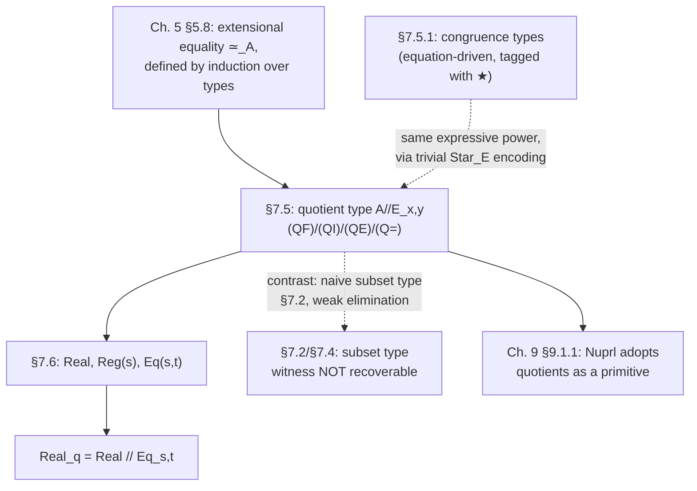

[[book-guidelines|↩ Back to guidelines]]

# Quotient and Congruence Types

## The problem: some equalities aren't the equality you already have

Type theory as built up through Chapters 4–6 gives you exactly one native
notion of equality per type: the identity type $I(A,a,b)$, and definitional
(judgemental) equality underneath it. Two natural numbers are equal when
they reduce to the same numeral; two functions are equal when they're
definitionally interconvertible. That's a syntactic, structural notion — it
respects *how a thing was built*.

But very often the equality a programmer or mathematician actually wants
has nothing to do with how the object was built. Thompson's own running
examples: two $\lambda$-expressions that differ only in the names of their
bound variables ought to count as the same expression — that's the
$\alpha$-equivalence he's been silently assuming since Chapter 2. A finite
set represented as a list ought to be equal to any other list with the same
elements, regardless of order or duplicate entries. A rational number
represented as a pair $(n,m)$ (numerator over denominator) ought to be
equal to any pair that "cancels" to the same value — $(1,2)$ and $(2,4)$
are the same rational even though they are obviously different pairs.

In each case you have:

1. a **base type** $A$ whose elements are concrete, structurally-built
   representatives ($\lambda$-terms, lists, integer pairs), and
2. a coarser **equivalence relation** $E$ that identifies representatives
   you want to treat as interchangeable.

What breaks if you don't formalize this? You're left silently overloading
"$=$" in prose — writing "the rational $1/2$" as if the pair $(1,2)$ were
canonical, while every function you define over rationals has to be
manually checked, by hand, every time, to make sure it doesn't accidentally
distinguish $(1,2)$ from $(2,4)$. There's no type-level guarantee that a
function respects the identification you have in mind; the invariant lives
only in the programmer's head. The quotient type is Thompson's answer:
build $E$ directly into the type, so that the type system — not the
programmer's diligence — enforces "respects $E$" on every function defined
over it.

## The quotient type $A/\!/E_{x,y}$

### Formation: you don't get the type for free

Given a base type $A$ and a candidate relation $E$ (a family of types
depending on two elements $x,y:A$, i.e. $E$ is itself the "proposition $x
\sim y$"), Thompson's formation rule is unusually heavy for a formation
rule — most formation rules in $TT_0$ just check that some ingredient
types are well-formed. Here you additionally have to *prove* $E$ is an
equivalence relation before you're allowed to form the quotient at all:

$$
\begin{array}{l}
A \text{ is a type} \\
x:A,\,y:A \vdash E \text{ is a type} \\
x:A \vdash r : E[x/x,\,x/y] \\
x:A,\,y:A,\,r:E \vdash s : E[y/x,\,x/y] \\
x:A,\,y:A,\,z:A,\;r:E,\,s:E[y/x,\,z/y] \vdash t : E[x/x,\,z/y] \\
\hline
A/\!/E_{x,y} \text{ is a type}
\end{array} \quad (QF)
$$

Reading the three proof-obligation premises in order: the third is a proof
term $r$ witnessing **reflexivity** ($E[x/x,x/y]$, i.e. $x \sim x$), the
fourth is a term $s$ witnessing **symmetry** (from $E$, i.e. $x\sim y$,
derive $E[y/x,x/y]$, i.e. $y \sim x$), and the fifth witnesses
**transitivity** (from $x\sim y$ and $y \sim z$, derive $x \sim z$). This
is the formal cashing-out of "$E$ is an equivalence relation" — reflexive,
symmetric, transitive — and it is a *precondition on forming the type*,
not something checked afterward. You cannot even talk about
$A/\!/E_{x,y}$ unless you've already discharged these three proof
obligations. The subscript $x,y$ marks the two variables of $E$ that get
bound by the quotient construct.

**What breaks without this precondition?** If $E$ weren't guaranteed
reflexive, the introduction rule below (every $a:A$ is automatically an
element of the quotient) would be identifying elements under a relation
that doesn't even relate things to themselves — nonsensical. If it weren't
symmetric or transitive, "respecting $E$" wouldn't compose sensibly:
you could have $a \sim b$ without $b \sim a$, so a function that's
well-defined reading left-to-right might contradict itself reading
right-to-left.

### Introduction: every element of $A$ is (trivially) in the quotient

$$
\dfrac{a:A}{a : A/\!/E_{x,y}} \quad (QI)
$$

This is the rule Thompson flags as breaking *unicity of typing* (Theorem
5.6, from Chapter 5): the very same term $a$ now has two types, $A$ and
$A/\!/E_{x,y}$. Up to this point in the book, every derivable term had
(up to convertibility) one type; the quotient type is the first construct
that deliberately gives up that property. Thompson notes the alternative
of "tagging" elements to disambiguate which type they're being considered
under, but the base system doesn't do this — you're expected to track
context.

### Elimination: functions on the quotient must not see the representative

This is where the real work happens, and it's the rule that actually
*uses* the equivalence-relation proof from formation. To define a function
$c$ out of $A/\!/E_{x,y}$, you give a function $c(x):C(x)$ on the base
type $A$ — but you additionally must supply a proof $t$ that $c$ gives
*equal* results on any two elements related by $E$:

$$
\dfrac{
  \begin{array}{c}
    a : A/\!/E_{x,y} \\
    [x:A] \vdash c(x):C(x) \\
    [x:A,\,y:A,\,p:E] \vdash t : I(C(x), c(x), c(y))
  \end{array}
}{c(a) : C(a)} \quad (QE)
$$

This is precisely the "well-definedness check" every programmer performs
informally when defining a function on a quotient (e.g. "let's check this
doesn't depend on which representative fraction we picked") — except here
it's not a side remark in a proof, it's a *mandatory extra premise of the
typing rule*. You cannot eliminate the quotient without it. Compare this
to the ordinary elimination rule for $A$ itself, which just needs $c(x)$ —
the quotient's elimination rule is that rule *plus* a respecting-$E$
obligation.

### No separate computation rule — instead, an equality rule

Unlike every base type so far (where introduction immediately gives you a
computation rule — $\beta$-reduction, $fst(a,b)\to a$, etc.), the quotient
type has no computation rule of its own. What it has instead is a rule
that makes $E$-related elements *propositionally equal* in the new type:

$$
\dfrac{a:A \quad b:A \quad p: E[a/x,b/y]}{r(a) : I(A/\!/E_{x,y},\,a,\,b)} \quad (Q\!=\!)
$$

This is the entire point of the construction: it takes the proof-level
fact "$a$ and $b$ are $E$-related" and turns it into a type-level fact
"$a$ and $b$ are equal *as elements of the quotient type*" — licensing
substitution of $b$ for $a$ wherever the context is about
$A/\!/E_{x,y}$-typed values (subject to the usual restriction that this
substitution must be safe in that context — Thompson stresses that
$I(A,a,b)$ itself need not be inhabited, only $I(A/\!/E_{x,y},a,b)$; the
equivalence is genuinely new information the base type didn't have).

There is generally **no inverse** — you can't recover a canonical
representative from an equivalence class — unless the relation happens to
have distinguished representatives, like the residues $0,1,\dots,k-1$ for
congruence mod $k$.

### Worked example from the book: the rationals

Thompson's main illustration is exactly the motivating case from the
introduction, formalized: represent rationals as pairs $(n,m)$ with $n$ an
integer and $m$ a positive integer, and quotient by

$$(n,m) \sim (n',m') \iff n * m' = n' * m$$

Addition is defined on representatives,

$$\frac{n}{m} + \frac{p}{q} = \frac{n*q + p*m}{m*q}$$

and it's "an exercise for the reader" (7.16 in the book) to check this
respects $\sim$ — i.e. to supply the witness $t$ that $(QE)$ demands. The
ordering $(n,m) \prec (n',m') \equiv_{df} n*m' < n'*m$ is similarly
well-defined. Thompson is careful to point out a function that is **not**
well-defined:

$$\mathit{denom}(n,m) \equiv_{df} m$$

fails, precisely because equivalent pairs can have different denominators
— $(1,2) \sim (2,4)$ but $2 \ne 4$ — so no proof term $t$ exists for this
$c$, and $(QE)$ correctly blocks you from forming it as a function on the
quotient. The fix is to route through the canonical representative:

$$\mathit{denom}(n,m) \equiv_{df} m \operatorname{div} (\gcd\, n\, m)$$

which *is* invariant under $\sim$. This little pair of examples is worth
sitting with, because it's the cleanest possible illustration of what
"respecting the relation" buys you: the type system, via $(QE)$'s extra
premise, forces you to notice — at definition time, not at some later bug
report — that `denom` on raw pairs isn't a well-defined operation on
rationals at all.

**Grounding (Rust).** The Rust idiom closest to this is the classic
"smart constructor + private field" pattern used to enforce a canonical
form, e.g. a `Rational` type that always stores its fields in lowest
terms:

```rust
pub struct Rational { num: i64, den: i64 } // fields private

impl Rational {
    pub fn new(num: i64, den: i64) -> Self {
        let g = gcd(num.abs(), den.abs());
        Rational { num: num / g, den: den / g }
    }
    pub fn denom(&self) -> i64 { self.den } // safe: always canonical
}
```

This is Rust's version of "define over the canonical representative" —
but notice it's a *weaker* guarantee than $(QE)$: nothing in Rust's type
system checks that every function you write on `Rational` respects
equivalence of un-normalized pairs; you get that property only by
disciplined construction (never exposing raw, non-normalized pairs). The
quotient type's elimination rule makes that discipline a proof obligation
the type checker enforces on *every* function you try to write over the
quotient, not just the constructor.

**Grounding (Lean).** Lean's kernel has quotient types as a genuine
primitive (`Quot`), and it is essentially $(QF)/(QI)/(QE)/(Q\!=\!)$ made
concrete:

```lean
-- Quot.mk : ∀ {α : Sort u} (r : α → α → Prop), α → Quot r      -- (QI)
-- Quot.lift : ∀ {α r β}, (f : α → β) →
--   (∀ a b, r a b → f a = f b) → Quot r → β                    -- (QE)
-- Quot.sound : ∀ {α r} {a b : α}, r a b → Quot.mk r a = Quot.mk r b -- (Q=)
```

`Quot.lift` takes exactly Thompson's two ingredients — a function `f` on
the base type, and a proof that `f` respects `r` — and only then hands you
a function out of the quotient. `Quot.sound` is literally the $(Q\!=\!)$
rule: relatedness becomes propositional equality. If you're building a
unifier or elaborator, this is worth internalizing precisely: `Quot.lift`
is doing, at the meta-level, exactly the well-definedness check a
programmer does by hand when reasoning "does my function care which
representative was picked" — the same question that shows up whenever
your elaborator needs to decide whether two syntactically different terms
denote the same value.

## Congruence types: a lighter-weight cousin

Section 7.5.1 introduces the construction from Backhouse, Carré, Morgan
and Smith ([BCMS89]) as an alternative that trades generality for
convenience in the common case where the identification you want is
generated by a small set of *equations* on a free algebraic type, rather
than an arbitrary relation you have to prove is an equivalence relation
from scratch.

Thompson's example: representing finite **bags** (multisets) as lists
built from constructors $[\,]$ and $::$ (infix, written $\bullet$ in this
section), where you want to identify lists that differ only in the order
of two adjacent elements. Instead of writing down the full equivalence
relation generated by reordering and proving it reflexive/symmetric/
transitive by hand, you just assert the *equation*

$$a \bullet b \bullet x = b \bullet a \bullet x \tag{7.8}$$

for all $a, b, x$ — a single line, versus the effort of spelling out (and
proving well-formed) the equivalence relation this equation generates.
"Respecting the equation" in the elimination rule is correspondingly
easier to check than "respecting an arbitrary $E$."

Thompson shows congruence types are not a separate primitive — they're
**exactly as expressive** as the quotient type, realized via a trivial
"tagging" constructor $\star$:

$$
\dfrac{A \text{ is a type}}{\mathit{Star}_E\,A \text{ is a type}} \quad(\text{StarF})
\qquad
\dfrac{a:A}{\star a : \mathit{Star}_E\,A} \quad(\text{StarI})
$$

with elimination

$$
\dfrac{
  \begin{array}{c}
    s : \mathit{Star}_E\,A \\
    [a:A] \vdash c(\star a):C(\star a) \\
    [x:A,\,y:A,\,p:E] \vdash t : I(C(\star x), c(x), c(y))
  \end{array}
}{\star\text{-}elim_x(c,s) : C(s)}
$$

and computation rule $\star\text{-}elim_x(c, \star a) \to c(a)$ — the
first computation rule we've actually seen in this section, because unlike
the quotient's bare $a$, elements here are syntactically tagged with
$\star$, so a reduction rule can pattern-match on the tag. This tagging is
the practical advantage Thompson highlights: you can always tell, just by
looking at a term, whether it's being considered as a raw element of $A$
or as a member of the identified type — a distinction the quotient type
leaves you to track by hand (recall the unicity-of-typing issue from
$(QI)$ above).

**Grounding (Rust).** The equation-driven flavor of congruence types maps
naturally onto a Rust `enum` plus a *normalization pass* that rewrites
away the redundancy the equation describes — e.g. a bag represented as a
sorted `Vec<T>`, where the "equation" $a \bullet b \bullet x = b \bullet a
\bullet x$ is enforced structurally by always inserting in sorted order,
rather than proven per-function:

```rust
enum Bag<T> { Nil, Cons(T, Box<Bag<T>>) }
// Insertion always maintains sorted order —
// the analogue of orienting equation (7.8) as a rewrite rule.
```

This is in fact exactly the historical precedent Thompson cites: early
Miranda's `laws` mechanism let you write down oriented rewrite rules like
`Ocons a (Ocons b x) => Ocons b (Ocons a x), if a>b` on constructors of an
algebraic type — congruence types are the type-theoretic generalization of
that idea, minus the requirement that the rule be orientable in only one
direction.

## Case study: the constructive real numbers

This is the section where quotient types stop being a footnote-sized
technical device and become load-bearing machinery for doing real
mathematics constructively — and it's a genuinely nice worked example of
*computational irrelevance* (§7.1.2) interacting with quotients.

### Why the classical definition doesn't transplant directly

Classically, $\mathbb{R}$ is (one way to build it) the set of equivalence
classes of Cauchy sequences of rationals under "the sequences converge to
the same limit," with arbitrary choice of representative whenever
convenient, and free use of non-constructive facts like "every bounded
increasing sequence of rationals has a least upper bound" (which Thompson
notes, back in Chapter 3, is classically equivalent to instances of the
law of excluded middle). None of that is available here — everything has
to be given by explicit, checkable data.

### First attempt: Cauchy sequences with an explicit modulus

$$
\mathit{RealC} \equiv_{df} (\exists s:N\Rightarrow Q).\,(\exists m:Q\Rightarrow N).\,
(\forall q:Q).\,(\forall n:N).\,(q \unrhd 0 \wedge n > (m\,q) \Rightarrow |s_n - s_{(m\,q)}| \prec q)
$$

An element of this type is a triple $(s,(m,p))$: a sequence $s$, a
**modulus of continuity** function $m$ (telling you, for a target
tolerance $q$, how far out in the sequence you must go), and a proof $p$
that $m$ actually works. The proof $p$ is *computationally irrelevant* —
you never need to inspect it to run the arithmetic — but it can't be
dropped: every time you build a new real (e.g. as the sum of two others),
you must construct a fresh proof that the new modulus works. Chapter 7's
running theme from §7.1–7.4 is exactly this tension: irrelevant to
computation, but mandatory for the type to be inhabited at all.

### The streamlined version: regular sequences

Thompson (following Bishop and Bridges, [BB85]) switches to sequences with
a **fixed, uniform** modulus of continuity — *regular* sequences — which
removes the extra existential over $m$:

$$
\mathit{Real} \equiv_{df} (\exists s : \mathit{Seq}).\,\mathit{Reg}(s)
\qquad
\mathit{Seq} \equiv_{df} (N \Rightarrow Q)
\qquad
\mathit{Reg}(s) \equiv_{df} (\forall m,n:N).\,\left(|s_n - s_m| \prec \frac{1}{m+1} + \frac{1}{n+1}\right)
$$

An element is a pair $(s,p)$ — sequence plus regularity proof, with $p$
again computationally irrelevant. Addition is defined by first adding
sequences pointwise (at odd indices, to interleave cleanly — the detail
Thompson works through is $x_n \equiv_{df} s_{2n+1} + t_{2n+1}$), then
*separately* constructing the proof that the sum is regular — an explicit
triangle-inequality-style calculation the book carries out in full,
landing on exactly the bound $\mathit{Reg}$ requires. This split — compute
the sequence, then prove regularity as a second, independent step — is
packaged formally as

$$
\mathit{add} : (\exists f:(\mathit{Seq}\Rightarrow\mathit{Seq}\Rightarrow\mathit{Seq})).\,
(\forall s,t:\mathit{Seq}).\,(\mathit{Reg}(s)\wedge\mathit{Reg}(t) \Rightarrow \mathit{Reg}(f\,s\,t))
$$

Thompson deliberately does **not** use a subset type $\{s:\mathit{Seq}
\mid \mathit{Reg}(s)\}$ here (contrast with §11.5 of the Nuprl book,
which does) — this is the same "name the function, keep the specification
separate from the computation" strategy argued for at length in §7.4:
existentially packaging the regularity proof, rather than subset-hiding
it, keeps the witnessing information explicit and recoverable, exactly
the property §7.2/§7.4 showed [[The-Subset-Type-and-Its-Difficulties#The naive subset type|the naive subset type]] sacrifices.

### Equality on `Real`, and the actual quotient

Multiple distinct sequences represent the same real number — Thompson's
example is zero, representable both by the constant-zero sequence and by
$z_n \equiv_{df} 1/(k+2n+3)$ for any $k$. So we need an equality on
`Real` finer than syntactic identity of the pair:

$$
\mathit{Eq}(s,t) \equiv_{df} (\forall n:N).\,\left(|s_n - t_n| \prec \frac{1}{2n+1}\right)
$$

Crucially, $\mathit{Eq}$ depends only on the sequences $s,t$ — **not** on
their regularity proofs $p,q$ — which is exactly what "computationally
irrelevant" should mean: the proof obligations don't participate in what
counts as equal. $\mathit{Eq}$ is an equivalence relation over `Real`
(reflexive/symmetric/transitive — left as an exercise, 7.19), and addition
respects it:

$$\mathit{Eq}(s,s') \wedge \mathit{Eq}(t,t') \Rightarrow \mathit{Eq}(\mathit{add}_S\,s\,t,\,\mathit{add}_S\,s'\,t')$$

— precisely the "well-definedness" premise $(QE)$ demands. With that in
hand, Thompson forms the actual quotient:

$$
\mathit{Real}_q \equiv_{df} \mathit{Real}/\!/\mathit{Eq}_{s,t}
$$

and lifts addition to $\mathit{add}_q : \mathit{Real}_q \Rightarrow
\mathit{Real}_q \Rightarrow \mathit{Real}_q$ via exactly the elimination
rule $(QE)$ worked through above — the respecting-proof you just built
*is* the $t$-premise the rule demands.

### Why keep `Real` around at all, once you have `Real_q`?

This is the subtlest point in the case study, and it's a direct
illustration of $(QI)$'s unicity-of-typing cost. Some operations — e.g.
"given a real $r$ and tolerance $x$, produce a rational within $x$ of
$r$" — are trivial on a specific representative sequence but genuinely
depend on *which* sequence you picked (different representative sequences
of the same real give different, though equally valid, approximating
rationals). Such an operation cannot be defined as a function *on*
$\mathit{Real}_q$ at all — $(QE)$ would demand a proof that the choice is
independent of the representative, which is false by construction. So the
general theory of the reals has to be developed over `Real` (the base
type, where you can still see individual sequences), with `Real_q`
available as "a useful framework for substitution" (quoting the book)
whenever you specifically want propositional equality of reals to license
substitution, and nothing more.

**Grounding (Rust).** The Cauchy-sequence-plus-modulus pattern is a close
cousin of a "verified numeric type" carrying a proof obligation as a
phantom/erased field — in real Rust you'd approximate the
computationally-irrelevant proof with something like a zero-sized marker
type or simply omit it at runtime (Rust has no proof-irrelevance concept,
so the closest honest analogy is: the proof exists only at the type level
during construction, then is erased, the way `PhantomData` witnesses
carry no runtime cost). The real lesson for a Rust verifier project is
architectural: separate the *computational* representation (the sequence
function) from the *specification* data (the regularity proof) as the
book does with `Seq` vs. `Reg(s)` — mirroring Hoare-triple style
separation of a program from its correctness proof.

**Grounding (Lean).** This case study is close to how Lean's own
`Real` was historically built (Cauchy sequences of rationals quotiented
by an equivalence relation via `Quotient`/`Quot`), and it's a genuinely
useful worked instance of `Quot.lift`/`Quot.sound` in the wild:
`add` on sequences plus a `Reg`-respecting proof is exactly a
`Quot.lift`-shaped construction, and `Real_q`'s equality is exactly
`Quot.sound` applied to a proof of `Eq s t`. If you're modeling
definitional-vs-propositional equality for your elaborator, this
case study is a clean, fully worked instance of the general pattern:
`Eq` here plays the role of a *propositional* equality (provably true,
not silently unfolded during type-checking) layered over a base type
whose terms are not judgementally/definitionally equal to each other even
when they denote the same mathematical value — the same gap your
elaborator's `isDefEq` has to be careful never to paper over silently.

## Synthesis: where this sits in the book



The quotient type is Thompson's direct answer to a gap left open since
Chapter 5: §5.8 showed how to define an *extensional* equality $\simeq_A$
inside the intensional theory by recursion over the structure of types,
but that machinery is bespoke to each type former. The quotient
generalizes the pattern — "identify things related by some proof-backed
relation, and force every function to respect that identification" — into
a single, reusable type constructor, at the cost of unicity of typing
$(QI)$ and of losing recoverability of witnesses in the same way the
subset type does (§7.2/§7.4): once you're inside $A/\!/E_{x,y}$, you
generally cannot get back a canonical representative, mirroring the
subset type's inability to recover a witness from $\{x:A\mid B\}$. The
real-number case study in §7.6 is the book's proof that this isn't just
formal decoration — it's precisely the mechanism needed to state, and
compute with, one of the most basic objects in mathematics
constructively. The chapter later reports (§9.1.1) that Nuprl adopted
quotient types as a genuine primitive of its type theory, which is
Thompson's implicit verdict on the cost/benefit tradeoff he's been running
throughout Chapter 7: quotients pay for themselves.

**Where this leads.** The next sections of Chapter 7 (§7.7 onward) move to
strengthened elimination rules and polymorphism — a different axis of
augmentation — but the *respects-the-relation* discipline introduced here
resurfaces implicitly any time a later construction needs to hide
computationally-irrelevant proof information behind a semantic
equivalence, which is precisely the recurring shape of the
definitional-vs-propositional equality distinction central to building an
elaborator: `Quot.lift`'s respecting-proof obligation is the same
obligation your own unification algorithm must discharge whenever it
decides two metavariable solutions "count as equal" for the purposes of
resolving an implicit argument.
