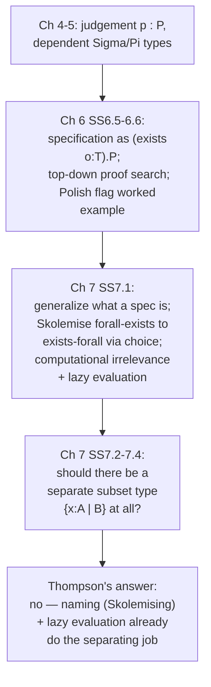

[[book-guidelines|↩ Back to guidelines]]

# Specification in Type Theory

## The problem: `p : P` is not the whole story

Every earlier chapter of the book leans on the judgement $p : P$ meaning two things at once: "$p$ is a proof of proposition $P$" and "$p$ is a program of type $P$." It's tempting to collapse this into a single slogan — "$a$ is a program which meets the specification $A$" — and indeed [ML85] and [PS85] propose exactly that reading. Thompson spends §7.1.1 showing why this slogan is subtly wrong, and the wrongness is the whole reason this topic exists.

Take a sorting function $f$. Its type is

$$f : [A] \Rightarrow [A]$$

Does having this type mean $f$ "meets the specification" of sorting? No — the identity function and the list-reversal function have exactly the same type, and neither sorts anything. A type signature constrains the *shape* of the input/output relationship; it says nothing about the relationship itself. That's the failure mode this whole topic exists to fix: **a bare type is not a specification**, because a specification has to talk about the *relation* between what goes in and what comes out, and simple function types are too coarse to express that.

This is the load-bearing idea for a Rust verifier project: `fn sort(v: Vec<i32>) -> Vec<i32>` is a type signature, not a contract. A Hoare-triple-style contract needs to say something like "the result is sorted and a permutation of the input" — a *predicate over the pair* (input, output), not just a type for each side separately. Type theory's answer to "how do you attach that predicate so it's still just a judgement `p : P`" is the subject of this article.

## What a specification actually is: $(\exists o : T).P$

Thompson's fix is to stop pretending the type alone is the specification, and instead build the specification as an existential type whose witness carries *both* the object and the proof that it has the required property.

For the sorting example, first state the real property as a predicate over the candidate function, call it $S(f)$:

> The result $(f\ l)$ is ordered and a permutation of the list $l$.

Then the specification "some function meets $S$" is written

$$(\exists x : [A] \Rightarrow [A]) . S(x)$$

Objects of this type are pairs $(f, p)$ where $f : [A] \Rightarrow [A]$ and $p$ proves $S(f)$. This resolves the earlier confusion precisely: when someone says "$a$ is a program meeting specification $A$," what they actually mean, made honest, is that $a$ is really a *pair* — a program component and a proof-of-correctness component, glued together by $\exists$.

Generalizing: a specification is a statement of the form $(\exists o : T).P$, and the judgement

$$(o, p) : (\exists o : T) . P$$

is read as: *the object $o$, of type $T$, is shown to meet the specification $P$ by the proof object $p$.* This single reading fuses the logical interpretation (existential proof) and the programming interpretation (a pair of a value and a certificate) into one coherent statement — Thompson calls it "elegant," and it is: you don't need any new machinery beyond the $\exists$-type you already have from Chapter 4. Extracting the actual runnable program from a proof of a specification is now just `fst` — projecting the first component of the pair.

```rust
// The specification, made literal as a Rust-ish sketch (ignoring termination/
// totality concerns Rust's type system can't express on its own):
struct Verified<F, Proof> {
    program: F,       // the "o" component
    correctness: Proof, // the "p" component — witnesses S(f)
}
// A real dependently-typed language (Lean, or a hypothetical verifier DSL)
// would let `Proof`'s *type* itself mention `program`, so the proof is
// checked to be a proof of exactly this program's correctness.
```

```lean
-- This is the literal translation: an existential (Sigma) type pairing a
-- function with a proof of a property about it.
def SortSpec (α : Type) [LinearOrder α] (f : List α → List α) : Prop :=
  ∀ l, (f l).Sorted (· ≤ ·) ∧ (f l).Perm l

def sortMeetsSpec : Σ' f : List α → List α, SortSpec α f :=
  ⟨mySort, mySortCorrect⟩
```

The Lean `Σ'` (or `Subtype`/`PSigma`) is exactly Thompson's $(\exists o:T).P$: a dependent pair whose second component's *type* depends on the first component's *value* — the proof's type literally says "this proof is about that specific `f`."

## Skolemising a $\forall\exists$ specification into $\exists f.\forall x$

There's a second, equally natural way to phrase a specification, mentioned in [NPS90] and worked out concretely for the Polish flag problem (below): instead of asserting the *existence* of a correct function up front, assert that *for every input* there exists a correct output:

$$(\forall x : A) . (\exists y : B) . P(x, y) \tag{7.1}$$

Elements of this type are functions $F$ such that for every $x : A$, $F\,x : (\exists y:B).P(x,y)$ — i.e. $F\,x$ is itself a pair $(y_x, p_x)$ with $y_x : B$ and $p_x : P(x, y_x)$. Notice what's happened: value and proof are now *inextricably mixed together inside every single application* of $F$. There is no clean way to say "give me just the computational part of $F$" without unpacking every single result.

This mixing is exactly the motivation that later drives people (wrongly, Thompson argues in §7.4) toward wanting a separate *subset type* that discards proof information at the type level. But there's already a way out inside plain $TT$, and it's not a new type former — it's a theorem. The **axiom of choice**, as a type-theoretic proposition, is:

$$(\forall x:A).(\exists y:B).P(x,y) \;\Rightarrow\; (\exists f:A\Rightarrow B).(\forall x:A).P(x,f\,x)$$

Given a proof of the $\forall\exists$ form (7.1), modus ponens against this axiom yields the $\exists\forall$ form: a single function $f$, pulled *out front*, together with a single proof that $f$ works for every $x$. This is "Skolemising" the specification, in exactly the sense familiar from first-order logic — replacing an inner existential that depends on an outer universally-quantified variable with a single function symbol (the Skolem function) applied to that variable. The converse implication (from $\exists\forall$ back to $\forall\exists$) is easy to derive directly, so the two forms are logically equivalent — they're just two different *shapes* to develop a program in.

That equivalence is the mechanism, not just a curiosity: it's the type-theoretic content of "naming the function you're about to build." Once you've Skolemised, you have a bona fide $(\exists f : A\Rightarrow B).P'$ — exactly the specification-shape from the previous section — and now proof extraction is again just `fst`, cleanly separated from the per-input proof obligations that plagued the $\forall\exists$ form.

The two forms also suggest two different *development methods*:

- **$\exists\forall$ first:** develop the function and its correctness proof as (possibly) separate artifacts — write `f`, then separately prove `P(x, f x)` for all `x`. This is ordinary "write code, then verify it" — the method Thompson used for quicksort in §6.2.
- **$\forall\exists$ first, then Skolemise:** prove the $\forall\exists$ statement directly (build, for each $x$, an existence proof), and only afterward extract a function via the axiom of choice. This is "prove first, extract the program second" — a genuinely different development discipline, worked out end to end for the Polish flag problem below.

For the Rust-verifier project, this is precisely the difference between writing a function and proving a separate lemma about it (Rust + an external prover checking a Hoare triple after the fact) versus a *proof-search-driven synthesis* pipeline where the program falls out of a constructive existence proof. Miller-pattern unification and proof search in a tactic-style prover are doing the "prove the $\forall\exists$ form" side of this; your custom theorem prover is the thing that would perform the Skolemisation step automatically once a $\forall\exists$-shaped goal is closed.

## Computational irrelevance and why lazy evaluation already solves it

Once specifications look like $(\exists o:T).P$, every value the type theory hands you is, formally, a pair of a "real" computational object and a "certificate" object that never contributes to the answer. Concretely: consider a `head` function restricted to non-empty lists, using the by-now-familiar existential encoding of a subtype:

$$
\mathit{nelist}\ A \equiv_{df} (\exists l : [A]).(\mathit{nonempty}\ l)
$$

with `nonempty` defined by recursion into the universe of small types ($\bot$ for the empty list, $\top$ otherwise):

$$
\mathit{nonempty}\ [\,] \equiv_{df} \bot \qquad \mathit{nonempty}\ (a :: x) \equiv_{df} \top
$$

and `hd` defined by case analysis on the underlying list, with the empty case discharged by `abort` (`abort` is the eliminator for $\bot$ — see the Curry–Howard chapter):

$$
hd : (\mathit{nelist}\ A) \Rightarrow A \qquad
hd\,([\,], p) \equiv_{df} \mathit{abort}_A\,p \qquad
hd\,((a::x), p) \equiv_{df} a
$$

Given an application $hd\,((2 :: \ldots), \ldots)$, computing the answer `2` requires *zero information* about the proof component — it is never inspected. Yet the proof is not decorative: without it, the application `hd list_that_might_be_empty` wouldn't even *type-check*, since only lists paired with a non-emptiness certificate belong to `nelist A`. So there's a genuine tension: proof information is essential *statically* (for type-checking to accept the program) but useless *dynamically* (for computing the answer). The natural worry — echoed in the literature Thompson cites (§3.4 of [BCMS89], §10.3 of [C+86a]) — is that carrying this dead weight through every reduction step will hurt performance, and that this justifies adding new machinery (a subset type, say) purely to strip it out.

Thompson's counter-argument is that this worry is an artifact of *assuming strict evaluation*. Efficiency claims are always relative to an evaluation strategy, and under the right strategy the "dead weight" problem simply doesn't arise:

> **Strict evaluation** — the norm in Standard ML and most imperative languages — evaluates all of $a_1, \dots, a_n$ fully before evaluating $f\,a_1\dots a_n$. If some $a_k$ is computationally irrelevant, evaluating it fully is wasted work.
>
> **Normal order evaluation** — begin reducing the outer expression first; an argument is evaluated only if and to the extent its value is actually needed.

**Definition 7.1.** Evaluation that always reduces the leftmost outermost redex is *normal order evaluation*. Add the requirement that no redex be reduced more than once, and it is *lazy* evaluation.

Because $TT$ is both strongly normalising (Ch. 5, Theorem 5.14 and its corollaries) and Church–Rosser, every reduction strategy that terminates reaches the *same* normal form — so you're free to pick whichever strategy is most efficient, with no risk of getting a different answer. Under lazy evaluation, the proof component of a pair like $((a::x), p)$ is reduced only to weak head normal form (i.e. down to the outer pair constructor) and never forced further unless something downstream actually inspects it — which, for a proof term used only for type-checking, it never will. So under a lazy discipline, computationally irrelevant subterms are *automatically* skipped, with no extra type-theoretic machinery required to identify or excise them.

Thompson pushes one step further: since $\bot$ has no closed normal form at all and $\top$'s only inhabitant is the trivial object $\mathit{Triv}$, computation of an object of either type is *never* interesting — what matters about these types is solely whether they're inhabited, not what their inhabitant reduces to. That's precisely the role `nonempty l` plays inside `nelist A`: it's there purely to gate well-typedness, and this pattern is claimed (exercise 7.6 in the book) to be preserved under $\wedge, \Rightarrow, \forall$ — i.e., computational irrelevance composes.

```python
# A quick illustration of the strict-vs-lazy distinction at the level a
# functional programmer already knows, standing in for TT's own reduction:
def hd_strict(pair):
    lst, proof = pair          # if 'proof' were an expensive computation,
    force(proof)                # strict evaluation pays for it here...
    return lst[0]

def hd_lazy(pair):
    lst, proof = pair          # ...lazy evaluation never touches `proof`
    return lst[0]               # at all — it's simply never demanded.
```

For a Rust verifier, this is a genuinely useful design fact, not just historical color: it says that *proof-irrelevance* need not be bolted on as a separate erasure pass or a special "Prop" universe (à la Coq) if your evaluator is normal-order/lazy by construction — the irrelevance falls out of ordinary demand-driven evaluation. Coq and Lean instead solve it with an explicit `Prop`/proof-irrelevance discipline at the type-checker level, because their kernels are not lazy by default; Thompson's point is a genuine alternative design, worth knowing exists even though it's not the path Lean itself took.

## Proof extraction and top-down derivation

Sections §6.5–§6.6 supply the *mechanism* by which you actually build a specification-shaped proof term, rather than just stating what one looks like. The key observation: many of $TT$'s rules relate proof term and proposition in a completely mechanical, structural way — the proof-object side is bookkeeping that tracks a shape you can equally well reason about *without writing down the terms at all*.

Take disjunction elimination:

$$
\dfrac{\begin{matrix}[A]&&[B]\\ \vdots && \vdots \\ (A\lor B) & C & C\end{matrix}}{C}\ (\lor E')
$$

Strip the proof annotations and you're left with a purely propositional reading — Thompson calls this the **backwards** or **top-down** interpretation:

> In order to derive $C$ (from hypotheses $\Gamma$), it suffices to derive $A \lor B$ (from $\Gamma$) and to derive $C$ in each of the two cases where $A$ or $B$ is additionally assumed.

Similarly $(\Rightarrow I)$ reads backwards as "to derive $A \Rightarrow B$, it suffices to derive $B$ from the extra assumption $A$." This is precisely goal-directed proof search: start from the goal, apply an elimination/introduction rule *in reverse* to reduce it to subgoals, recurse. Thompson works a full example — deriving $(P \lor \lnot P) \Rightarrow (\lnot P \Rightarrow \lnot Q) \Rightarrow (Q \Rightarrow P)$ — entirely top-down (three uses of $(\Rightarrow I)$, then a case split on $P \lor \lnot P$, closing one branch trivially and the other via *modus ponens* and $\mathit{ex\ falso}$), and only *after* the top-down search bottoms out does he reintroduce proof terms — naming each hypothesis ($x, y, z, u, v$) and reconstructing the actual $\lambda$-term bottom-up from the completed skeleton:

$$
\lambda x.\lambda y.\lambda z.\big(\mathit{cases}'_{u,v}\ x\ u\ (\mathit{abort}_P((y\,v)\,z))\big)
$$

This is Nuprl's whole methodology in miniature ([C+86a]): the user searches for a derivation working with bare propositions (goals), and the system only assembles the underlying proof term once the search succeeds. The same idea extends to [[Natural-Deduction-and-Predicate-Logic#Predicate logic|predicate logic]] ($\forall$/weak $\exists$) and to natural-number induction, where the $(NE)$ rule can be stated with proof terms erased:

$$
\dfrac{n:N \quad C[0/x] \quad (\forall n:N).(C[n/x]\Rightarrow C[\mathit{succ}\ n/x])}{C[n/x]}\ (NE)
$$

Thompson flags one important boundary: this "erase and search, then reconstruct" trick only works cleanly for the *weak* elimination rules. The *strong* forms of $\exists$- and $\lor$-elimination — needed, in particular, to prove the axiom of choice itself — let a conclusion's proposition depend on the proof object of the premise above the line, so you genuinely cannot erase proof terms and reason only about propositions; the erasure would throw away information the rule needs.

```rust
// A tiny sketch of what "top-down/goal-directed" looks like as a proof-
// search skeleton — this is the shape a bidirectional prover's `check`
// mode over a goal type would take, mirroring the rules read backwards.
enum Goal {
    Or(Box<Goal>, Box<Goal>),
    Implies(Box<Goal>, Box<Goal>),
    Atom(String),
}

fn prove(goal: &Goal, ctx: &mut Vec<Goal>) -> Option<ProofTerm> {
    match goal {
        // (=>I) read backwards: push A, try to prove B.
        Goal::Implies(a, b) => {
            ctx.push((**a).clone());
            let body = prove(b, ctx)?;
            ctx.pop();
            Some(ProofTerm::Lambda(Box::new(body)))
        }
        // (\/E') read backwards: find a disjunctive hypothesis, split.
        _ => search_hypotheses_and_split(goal, ctx),
    }
}
```

This is exactly the "check" direction of bidirectional typing/proof search that the standing learning goals call out: goals with known shape (an implication, a disjunction) drive rule selection deterministically top-down, while atomic goals fall back to a search over hypotheses/lemmas (closer to "infer" mode, or unification against known facts).

## The worked example: the Polish National Flag problem

Everything above comes together in §6.6's central case study — Thompson's simplification of Dijkstra's Dutch National Flag problem: given a list of items each red or white, return a permuted list with all reds before all whites.

**Setting up the vocabulary.** Colours are booleans (`True` = red); `allRed`/`allWhite` are defined by recursion into the universe:

$$
\mathit{allRed}\ [\,] \equiv_{df} \top \qquad \mathit{allRed}\ (a::x) \equiv_{df} \mathit{isRed}\ a \land \mathit{allRed}\ x
$$

**The $\forall\exists$ specification** (the natural first phrasing — for every list, there exist two sublists with the right properties):

$$
(\forall l : [C]).(\exists (l',l'') : [C]\land[C]).\big(\mathit{allRed}\ l' \land \mathit{allWhite}\ l'' \land \mathit{perm}\ l\ (l'\mathbin{+\!+} l'')\big) \tag{6.5}
$$

**Skolemising via the axiom of choice** turns this into the $\exists\forall$ form actually wanted — a single splitting function together with a universal correctness proof:

$$
(\exists f : [C]\Rightarrow[C]\land[C]).(\forall l:[C]).\Big(\mathit{allRed}(\mathit{fst}(f\,l)) \land \mathit{allWhite}(\mathit{snd}(f\,l)) \land \mathit{perm}\ l\ (\mathit{fst}(f\,l)\mathbin{+\!+}\mathit{snd}(f\,l))\Big) \tag{6.6}
$$

exactly the general pattern from earlier in this article: a proof of (6.6) is a pair $(f, p)$, and this *is* what "a specification in type theory" should look like in general, per Thompson.

Two roads to a proof of (6.6): (a) write `f` directly, then separately verify property (6.7) by induction — ordinary program-then-verify, as with quicksort; or (b) prove the $\forall\exists$ form (6.5) directly by induction on the list, and *extract* `f` afterward via choice — proof-then-extract. Thompson takes route (b) as the illustration of proof extraction:

**Theorem 6.10** (list induction on $l$):
- *Base case* $l \equiv [\,]$: $\mathit{allRed}\ [\,]$ and $\mathit{allWhite}\ [\,]$ are trivially inhabited, and $[\,]\mathbin{+\!+}[\,] \equiv [\,]$ with `perm` reflexive, giving witness $p_0$.
- *Step case* $l \equiv (a :: m)$: given $p_m : P(m)$ unpacking as $((l', l''), (q_1,q_2,q_3))$, case-split on whether $a$ is red or white (there are only two booleans, so this is decidable). If white, extend $l''$ to $a::l''$ and repair the permutation proof using existing lemmas about `perm`, yielding $p_w$; symmetric construction $p_r$ for the red case. Then
$$
p_0 \equiv_{df} \text{if } a \text{ then } p_r \text{ else } p_w : P(a::m)
$$

Formalized, the whole induction is the single term $\lambda l.(\mathit{lrec}\ l\ p_0\ \lambda a.\lambda m.\lambda q. p_0) : (\forall l:[C]).P(l)$ — an application of the primitive list recursor. Thompson's punchline: applying the axiom of choice to *this* proof extracts, as its first component, exactly the same `split` function you'd have written by hand:

```
split []       ≡df ([], [])
split (a :: m) ≡df (a :: l', l'')   if a
               ≡df (l', a :: l'')   if not a
               where (l', l'') ≡ split m
```

Both development methods — write-then-verify, and prove-then-extract — converge on the identical program. That convergence is the payoff of the whole specification framework: it isn't just philosophically tidy that a specification is $(\exists o:T).P$, it's operationally confirmed by getting the same `split` out of two structurally different derivations.

## Synthesis: where this sits in the book, and why it matters for the projects



Structurally, this topic is the hinge between "applying $TT$" (Chapter 6) and "should $TT$ be extended" (Chapter 7). Chapter 6 shows the specification-as-$\exists$ idiom actually working end to end on a real problem; Chapter 7 §7.1 steps back and asks what's *general* about that idiom, and uses it to pre-empt the argument (developed at length in §§7.2–7.4) that type theory needs a brand-new subset type $\{x:A \mid B\}$ to separate computation from proof. Thompson's considered answer — reached only after building this machinery — is no: naming the function you want (Skolemising a $\forall\exists$ spec into $\exists\forall$) plus evaluating lazily already achieves the separation, without paying the metatheoretic costs (loss of unique typing, weaker elimination rules) that the subset type turns out to carry, as later sections in Chapter 7 detail.

For the two standing projects: the specification pattern $(\exists o:T).P$ *is* the target shape for a Hoare-triple-style contract in the Rust verifier — a program paired with a proof obligation whose type mentions the program. The Skolemisation step is the formal justification for treating "prove a per-input existence property" and "synthesize a single witnessing function" as two views of the same theorem, which is exactly the shape a custom theorem prover's extraction pass would need to implement. And the top-down/backwards reading of the introduction and elimination rules in §6.5 is a clean, book-native instance of bidirectional proof search — goal-directed in the "check" direction, falling back to hypothesis search at atoms — worth keeping as a template when the elaborator project gets to proof-obligation discharge rather than just term elaboration.
