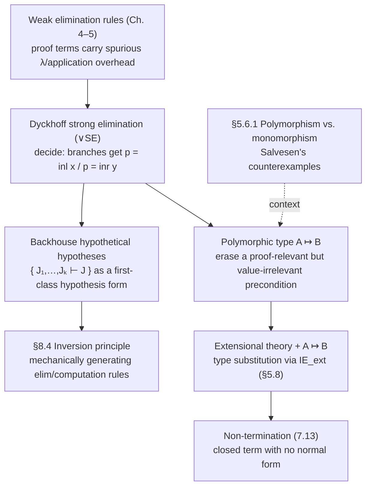

# Strengthened and Polymorphic Rules

[[book-guidelines|↩ Back to guidelines]]

## Why this section exists: proof objects with junk in them

Every elimination rule you've seen so far in $TT$ — for $\wedge$, $\Rightarrow$, $\vee$, $\exists$ — follows the same shape: take the thing being eliminated, take a proof (function) that works generically for *every* way that thing could have been built, and apply. That genericity is exactly what makes the rule sound. But Thompson opens §7.7 with an observation from practitioners (Dyckhoff, the Cornell Nuprl group, Backhouse): the *proof terms* that come out of applying these rules correctly are often bloated with abstractions and applications that don't correspond to anything you actually did mathematically. You wrote a two-line case split on paper; the formal proof term has an extra $\lambda$ and an extra application wrapped around it for bureaucratic reasons.

This matters more than it sounds. In a system where propositions are types and proofs are programs, the proof term *is* the program you're going to run. Bureaucratic junk in a proof term is not cosmetic — it's junk in your extracted program, and (as the section's final act shows) if you're not careful about what these strengthenings buy you, they can cost you *termination itself*.

## The motivating example: where the junk comes from

Take the (true, ordinary) fact
$$
(\exists z : A \vee B).\,P(z) \;\Rightarrow\; \big((\exists x:A).\,P(\mathrm{inl}\,x) \vee (\exists y:B).\,P(\mathrm{inr}\,y)\big) \tag{7.9}
$$
Assume $p : (\exists z : A\vee B).\,P(z)$. Using $(\exists E)$ pushes you down to two assumptions:
$$
z : A \vee B,\quad r : P(z)
$$
Now you want to case-split on $z : A \vee B$. But $z$ is free in the *second* assumption $r : P(z)$ — the ordinary disjunction-elimination rule $(\vee E)$ can't touch an assumption it doesn't discharge, so you can't case-split on $z$ while $r$ still depends on it. Thompson's fix, using only rules you already have, is to first *abstract $r$ away*: prove the implication $Q(z) \equiv P(z) \Rightarrow (\ldots)$ from the bare assumption $z : A\vee B$ alone, case-splitting on $z$ inside that implication, and only afterwards apply the resulting function `vc` to $r$. The proof term that comes out —
$$
\mathrm{vc} \equiv \mathrm{vcases}''_{x,y}\, z\; (\lambda q.\,\mathrm{inl}(x,q))\;(\lambda s.\,\mathrm{inr}(y,s))
$$
— has exactly the shape of the workaround baked in: a $\lambda q$ and $\lambda s$ that exist purely to let $r$ be reintroduced afterward via `vc r`. Nothing about the *mathematical content* of the proof asked for those abstractions; they're an artifact of the elimination rule being too weak to let the case split "see" the other assumptions.

## Dyckhoff's strong elimination rule: let the case split reach the context

The fix Dyckhoff proposes is to strengthen the elimination rule itself so that when you case-split on $p : A\vee B$, the two branches get told *which* side $p$ came from, as an actual hypothesis available for substitution — rather than being forced to package that information as an extra premise:

$$
\begin{array}{c}
p:(A \vee B) \quad
\begin{array}{c}[x:A,\; r:(p = \mathrm{inl}\,x)]\\ \vdots \\ u : C[\mathrm{inl}\,x/z]\end{array}
\quad
\begin{array}{c}[y:B,\; r:(p = \mathrm{inr}\,y)]\\ \vdots \\ v : C[\mathrm{inr}\,y/z]\end{array}
\\[1.5em]
\hline
\mathrm{decide}_{x,y}\,p\,u\,v : C[p/z]
\end{array} \quad (\vee SE)
$$

with computation rules
$$
\mathrm{decide}_{x,y}(\mathrm{inl}\,a)\,u\,v \to u[a/x], \qquad \mathrm{decide}_{x,y}(\mathrm{inr}\,b)\,u\,v \to v[b/y]
$$

`decide` is Nuprl's name for this operator (Thompson notes $(\vee SE)$ is exactly the Nuprl union-elimination rule). The crucial difference from the ordinary $(\vee E'')$ you saw in Chapter 5 is the *extra* discharged hypothesis $r : (p = \mathrm{inl}\,x)$ (resp. $\mathrm{inr}$) sitting alongside $x:A$ in each branch. This is a genuine strengthening — a proof of "$p$ equals $\mathrm{inl}\,x$ for this particular $x$" — not just "$p$ has type $A \vee B$." With that extra hypothesis available, any other assumption mentioning $p$ (like $r : P(z)$ above, with $z$ instantiated to $p$) can simply be *substituted* using the equation, with no abstraction/application detour needed. Redoing (7.9) with $(\vee SE)$, both branches of the case split can directly substitute $p$ for $\mathrm{inl}\,x$ or $\mathrm{inr}\,y$ in the assumption $P(z)$, producing the two witnesses directly — no spurious $\lambda q$, no `vc r`.

**Grounding — Rust.** This is a distinction Rust's `match` makes visible without you noticing, because Rust's return types normally *don't* depend on the discriminee. An ordinary sum-elimination is exactly the weak rule — the match arms only get the payload, never "proof that this branch was taken":

```rust
enum Either<A, B> { Left(A), Right(B) }

fn elim<A, B, C>(
    p: Either<A, B>,
    on_left: impl FnOnce(A) -> C,
    on_right: impl FnOnce(B) -> C,
) -> C {
    match p {
        Either::Left(x) => on_left(x),
        Either::Right(y) => on_right(y),
    }
}
```

This is fine as long as `C` doesn't mention `p` itself — which is the ordinary case in Rust, because Rust's type system has no way for a return type to depend on a *value*. The moment you want a return type that genuinely depends on which branch was taken (a refinement type, or a proof obligation indexed by the original value), Rust's `match` alone doesn't give you that "this arm was reached because `p = Left(x)`" fact as a usable term — you'd have to reconstruct it by hand (e.g. carry a `PhantomData`-tagged witness or an explicit `p == Either::Left(x)` proof object, which Rust can't check without external machinery). This is precisely the gap $(\vee SE)$ closes formally.

**Grounding — Lean.** Lean 4 has this exact mechanism as a first-class piece of surface syntax: `match h : p with | .inl x => ... | .inr y => ...` binds `h : p = .inl x` inside the first branch — literally Backhouse/Dyckhoff's discharged hypothesis $r : (p = \mathrm{inl}\,x)$, spelled with Lean's own equality type. Underneath, this desugars into `Or.casesOn` (or the auto-generated `casesOn` for whatever inductive type you're matching) applied with a *dependent motive* `motive : Or A B → Sort u` — the elaborator constructs exactly the strengthened rule you'd otherwise have to write by hand. If you've ever wondered why Lean's tactic `cases h with | inl x => ... | inr y => ...` sometimes needs `subst` afterward to actually use the fact that you're in a particular branch — that `subst` step *is* $(\vee SE)$'s extra hypothesis doing its job.

## Backhouse's hypothetical hypotheses: naming "derivable under assumptions" as a hypothesis in its own right

The strong rule above can be restated in a notation that turns out to generalize cleanly to every connective. Up to now, a rule's hypotheses have always been ordinary judgements (like $p : A\vee B$) — some of which get *discharged* when the rule is applied. Backhouse's insight is to let a hypothesis itself say "judgement $J$ is derivable, given assumptions $J_1,\ldots,J_k$" — written
$$
\{\,J_1,\ldots,J_k \,\vdash\, J\,\}
$$
This is not the same as writing $J_1,\ldots,J_k \vdash J$ as a whole derivation; it's a single *hypothesis slot* in a larger rule that says "supply me a derivation of this shape." With this notation, the strengthened disjunction-elimination rule becomes:
$$
\begin{array}{l}
p : (A\vee B) \\
\{\,v:(A\vee B),\,w:C \,\vdash\, E \text{ is a type}\,\} \\
\{\,x:A,\,w:C[\mathrm{inl}\,x/w] \,\vdash\, b : E[\mathrm{inl}\,x/w]\,\} \\
\{\,y:B,\,w:C[\mathrm{inr}\,y/w] \,\vdash\, c : E[\mathrm{inr}\,y/w]\,\} \\
\hline
\{\,w:C[a/w] \,\vdash\, \mathrm{when}_{x,y}\,a\,b\,c : E[a/w]\,\}
\end{array} \quad (\vee EH)
$$
with `when`'s computation rules identical to `vcases`/`decide`'s. Thompson is explicit that this reformulation is *equivalent* in strength to $(\vee SE)$ — it's a different way of writing the same content, one that scales uniformly to every elimination rule in the system (an exercise asks you to derive $(\vee SE)$ from $(\vee EH)$), and one the book returns to in §8.4 when discussing the *inversion principle* (how elimination rules can be mechanically generated from introduction rules).

**Grounding — Lean / bidirectional typing.** This is worth naming precisely because it's exactly the shape of a *local context extension* in a bidirectional elaborator. When Lean's elaborator checks a `match` arm, or when it elaborates under a `fun x => ...` binder, it is doing nothing but discharging a hypothetical hypothesis: "under the extended context $\Gamma, x : A$, elaborate the body against expected type $B$" is precisely $\{x:A \vdash b : B\}$. Backhouse's notation is the metatheorist's way of naming what your elaborator's `withLocalDecl`-style context-extension calls are already doing at runtime — the rule you'd write down if you wanted to *specify* the elaborator's behavior on a case split, rather than just implement it.

## The polymorphic type $A \mapsto B$: erasing a dependency you don't actually use

A second, structurally different source of the same "spurious abstraction" problem shows up with the subset-typed `head` function. Even inside the subset theory of §7.3, the best type you can derive for `head` is
$$
(\forall l : [A]).\,(l \neq [\,]) \Rightarrow A
$$
— an ordinary dependent function into an *implication*. To actually call `head`, you must supply the non-emptiness proof as a genuine function argument, even though the *value* returned by `head` never inspects that proof — the proof exists purely to license the call, not to compute anything.

Thompson (citing [BCMS89]) introduces a new, non-dependent polymorphic type constructor $A \mapsto B$ to name this pattern directly:
$$
\begin{array}{c}
\begin{array}{c}[x:A]\\ \vdots \\ b:B\end{array}
\\ \hline
b : A \mapsto B
\end{array}\;(\mapsto I)
\qquad\qquad
\dfrac{b : A \mapsto B \quad a : A}{b : B}\;(\mapsto E)
$$
with the crucial **side condition on introduction**: neither $b$ nor $B$ may mention the discharged variable $x$. That side condition is the entire point — $b$ is called *polymorphic* precisely because, although its derivation used the assumption $x:A$, its value provably does not depend on which particular witness of $A$ you supply. $A \mapsto B$ says "$B$, but only usable once $A$ is known to be inhabited" — a proof-relevant precondition with a proof-irrelevant payload. In an extensional theory this lets you derive
$$
\mathrm{head}\;l : (l \neq [\,]) \mapsto A \qquad\text{hence, by }(\mapsto E),\qquad \mathrm{head}\;l : A
$$
without `head`'s definition ever having had to case on, or thread through, the actual non-emptiness proof object.

**Grounding — Lean (primary here).** $A \mapsto B$ is precisely what Lean's `Prop` universe and its **definitional proof irrelevance** give you for free. If `h1 h2 : p` for `p : Prop`, Lean's kernel treats `h1` and `h2` as *definitionally equal*, and any term whose *type* depends on a `Prop`-valued hypothesis but whose *value* doesn't inspect it computationally gets erased at compile time. A Lean signature like
```lean
def head {A : Type} (l : List A) (h : l ≠ []) : A
```
where `h : l ≠ []` (a `Prop`) never appears in `head`'s output value, is exactly $A \mapsto B$'s introduction rule discharging $x:A$ under the side condition that $b$ doesn't mention $x$ — except Lean bakes the side condition into the *universe* (`Prop`) rather than checking it rule-by-rule. This is the direct ancestor of the "quantity" annotations in quantitative type theory (Idris 2's `0`-multiplicity arguments): a formal way of saying "this argument is needed for typechecking, erased at runtime."

**Grounding — Rust (secondary).** Rust has no dependent types, so it can't state $A \mapsto B$'s dependency-into-a-proposition directly, but the *erasure* half of the idea is familiar: a zero-sized `PhantomData<Proof>` marker, or an `unsafe fn head(l: &[A]) -> &A` whose safety precondition ("`l` is non-empty") is documented but not represented as runtime data, is the same "proof-relevant precondition, proof-irrelevant payload" pattern with the type-checker's guarantee replaced by a programmer's promise.

## Non-termination: the price of combining polymorphism with extensionality

This is where §7.7 turns into a warning rather than a convenience. Thompson shows that adding $A\mapsto B$ to an **extensional** system (one with Martin-Löf's extensional identity elimination rule $(IE_{ext})$, discussed back in §5.8) reintroduces genuine non-termination — closed, well-typed terms with no normal form at all.

The derivation, compressed: assume (absurdly) $p : \bot$. From $\bot$'s elimination rule you can derive *anything*, including a proof
$$
r : I(U_0,\,A,\,A \Rightarrow A)
$$
— a propositional-equality witness that the type $A$ equals the type $A\Rightarrow A$. In an extensional theory, $(IE_{ext})$ lets you treat propositionally-equal types as *literally interchangeable for typing purposes*: given $r$, any term of type $A$ can be re-typed as a term of type $A \Rightarrow A$. So from an assumption $x:A$ you get, via $r$, that $x : (A\Rightarrow A)$ — and now $x\,x$ typechecks, at type $A$:
$$
(\lambda p:\bot).\,\big((\lambda x.\,x\,x)(\lambda x.\,x\,x)\big) : \bot \Rightarrow A \tag{7.13}
$$
As an ordinary function of type $\bot \Rightarrow A$ this is harmless — you can never actually apply it, because you can never produce $p:\bot$. But that's exactly where the polymorphic type constructor changes the picture. Because $(\lambda x.xx)(\lambda x.xx)$ *does not mention the assumption $p:\bot$* in its value (only in the derivation that licensed its type), the introduction rule $(\mapsto I)$'s side condition is satisfied, and you can discharge $p$ **without needing an actual proof of $\bot$**:
$$
(\lambda x.\,x\,x)(\lambda x.\,x\,x) : \bot \mapsto A
$$
This is now a *closed* term, at a *closed* type — no assumption pending, nothing left to supply. And $(\lambda x.xx)(\lambda x.xx)$ is exactly the untyped self-application combinator: it reduces only to itself,
$$
(\lambda x.\,x\,x)(\lambda x.\,x\,x) \to (\lambda x.\,x\,x)(\lambda x.\,x\,x) \to \cdots
$$
forever, with no weak head normal form. You have a well-typed, closed, non-terminating term. Strong normalisation — the property Chapter 5 worked so hard to establish for $TT_0^c$ — is gone.

The mechanism is worth being precise about, because it isolates *exactly* which ingredient is load-bearing:
- $\bot$-elimination alone is harmless — it only lets you build terms *depending on* an assumption you can never discharge for real.
- Extensional type equality $(IE_{ext})$ is what lets a proof derived "under $\bot$" license silently swapping $A$ for $A\Rightarrow A$ — an identification that's mathematically vacuous (since $\bot$ is uninhabited, nothing here is ever *wrong*) but computationally toxic, because the type system doesn't track *how* $A=A\Rightarrow A$ was obtained.
- $A\mapsto B$'s side condition — "$b$ doesn't mention $x$" — is what lets the vacuous, absurd-hypothesis-dependent term escape its hypothesis and become closed. Without polymorphism, the term stays trapped inside $\lambda p:\bot.(\ldots) : \bot\Rightarrow A$, unusable in practice (you'd need $p:\bot$ to apply it — impossible) even though it's still well-typed.

Thompson's closing remark is the one to hold onto: in an **intensional** theory like $TT$ itself, none of this bites. Adding $A\mapsto B$ to $TT$ is safe — it's conservative, it just contains *fewer* objects than you might naively expect (per [SS89], no rule of $TT$ ever "loses mention" of objects appearing in its hypotheses the way $(IE_{ext})$ does). The danger is specifically the *combination* of polymorphism's erasure with extensionality's type-substitution power — either ingredient alone is fine.

## Where this leads



Within Chapter 7's arc, §7.7 sits between the subset/quotient-type machinery of §§7.2–7.6 (which also chase "avoid carrying irrelevant proof information") and the well-founded/inductive/co-inductive extensions of §§7.8–7.11 — it's one more entry in the running ledger the chapter keeps: every strengthening purchases convenience or expressiveness at a metatheoretic cost, and the book wants you able to name that cost precisely rather than take it on faith. The hypothetical-hypotheses notation is explicitly recycled in §8.4's inversion principle, where it becomes essential for inverting rules (like $\Rightarrow$-introduction) that discharge an assumption.

For the standing project: the strong elimination rule / hypothetical-hypotheses material is a precise formal specification for something a bidirectional elaborator does constantly — extending the local context with a discriminee-equality fact on each match arm, exactly Lean 4's `match h : e with` sugar. The polymorphism-plus-extensionality non-termination result is the sharper, more consequential lesson: it's a concrete, minimal counterexample showing why a verifier that supports *both* erasable/proof-irrelevant arguments *and* full extensional type-conversion (rewriting a type via an arbitrary propositional equality, the way `▸`/`eq_rect`-style casts do) needs to be designed with real care about which equalities are allowed to license type substitution. If your Rust verifier ever adds a $\mapsto$-like erased-argument mechanism, this section is the reason to keep its notion of type equality strictly intensional — or to prove, the way Chapter 5 does for $TT_0^c$, exactly which extension you can add without losing normalisation.
