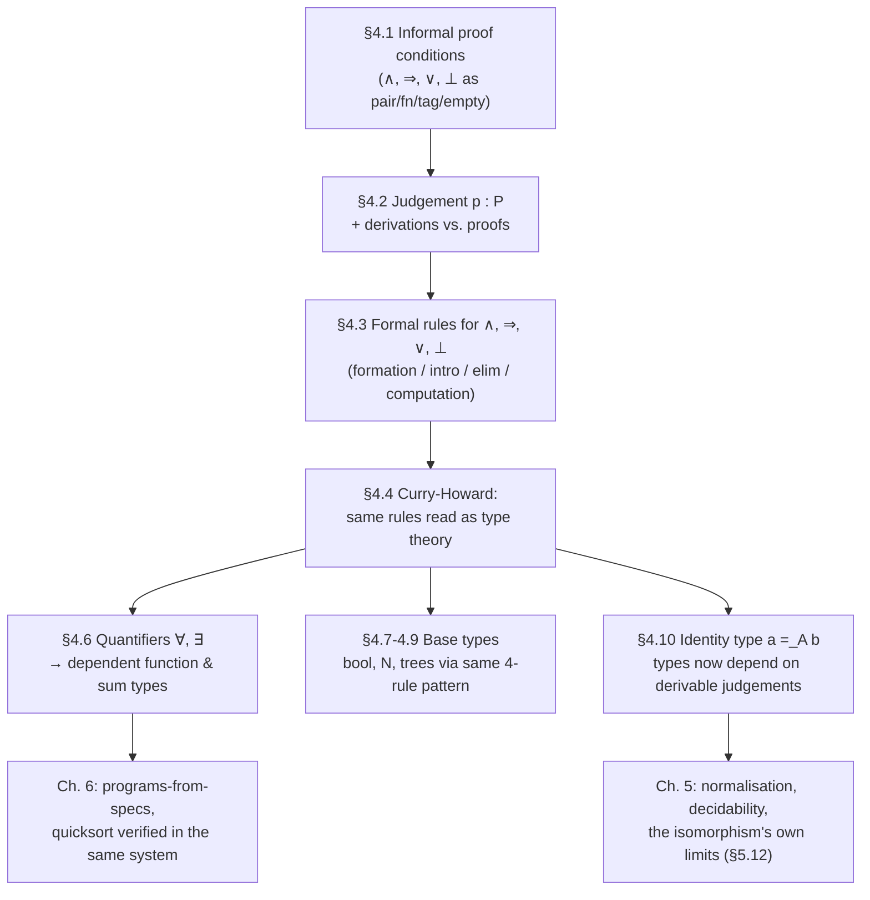

# The Curry–Howard Isomorphism (Propositions as Types)

[[book-guidelines|↩ Back to guidelines]]

## Why you'd want this at all

Start from an ordinary engineering complaint. You write a function, give it a type signature, and ship it. The type signature is a contract, but it's a shockingly weak one. Consider:

$$plus : N \Rightarrow N \Rightarrow N$$

This type is *true* of `plus`, but it is also true of `minus`, `times`, `max`, and the constant-zero function. A type signature like this tells a type-checker almost nothing about whether the function is *correct* — only that it doesn't, say, try to add a string to an integer. Thompson opens the book with exactly this observation: post-hoc verification (write the program, then separately prove it correct) always leaves open the possibility that the thing you built and the thing you proved don't quite match, because they're artifacts of two different activities. What you actually want is a setting where the type system is expressive enough to *state* a full specification — "this function returns the positive square root of its argument" — and where merely inhabiting that type, i.e. constructing a value of it, constitutes a correctness proof by construction, the same way a well-typed program in Rust is memory-safe by construction rather than by a separate audit.

That's a tall order for a type system. It requires types that can talk about *values*, not just shapes — dependent types, which are a separate topic. But underneath that machinery sits a more primitive and more surprising idea, and it's the one this article is about: if you look closely at what a *constructive* proof actually consists of, and you look closely at what a *typed program* actually consists of, you find they are, rule for rule, the same object described twice. That identification is the Curry–Howard isomorphism, and it is the mechanism that makes "types as specifications" more than a slogan.

## What breaks without a constructive reading of logic

Classical logic doesn't give you this for free. Classical validity is truth-functional: $A \vee \neg A$ is a theorem regardless of whether you know which disjunct holds, and $\neg\neg A \Rightarrow A$ licenses you to assert $A$ purely from having refuted its negation. Both are non-constructive: they certify that something is true without telling you *what it is* or *how to produce it*. Thompson's example is $\neg\forall x.\neg P(x) \Rightarrow \exists x.P(x)$ — "if it's contradictory for no object to have property $P$, then some object has $P$" — a classical theorem that asserts existence while handing you no witness whatsoever.

If your goal is "programs from proofs," this is fatal: a proof that gives no witness gives no program. So type theory rejects a truth-functional semantics and replaces it with a **proof-functional** one. Instead of asking "is $P$ true?" we ask "what does it mean for a specific object $p$ to *be a proof* of $P$?" This single reorientation is the hinge the whole subject turns on, and it's worth sitting with the proof conditions the book gives, because every one of them is doing double duty as a data-structure definition:

- A proof of $A \wedge B$ is a **pair** $(p, q)$ where $p$ proves $A$ and $q$ proves $B$.
- A proof of $A \Rightarrow B$ is a **function** transforming any proof of $A$ into a proof of $B$.
- A proof of $A \vee B$ is *either* a proof of $A$ *or* a proof of $B$, **tagged** with which one it is.
- A proof of $\bot$ (absurdity) does not exist — there is no proof of a contradiction.
- $\neg A$ is defined as $A \Rightarrow \bot$: a proof of $\neg A$ is a function turning any proof of $A$ into a proof of absurdity.
- A proof of $\exists z.P(z)$ is a **pair** $(a, p)$ of a witness $a$ and a proof $p$ that $a$ actually has property $P$.
- A proof of $\forall z.Q(z)$ is a **function** taking any $a$ to a proof of $Q(a)$.

Look at that list again with a compiler's eyes: pair, function, tagged union, empty type, function, dependent pair, dependent function. Every connective's proof-object is already a familiar data structure from functional programming. That's not a coincidence Thompson is pointing out for color — it *is* the isomorphism, stated before any formal machinery shows up. Excluded middle and double-negation elimination fail here for a mundane reason: nothing in these clauses tells you how to manufacture a proof of $A$ or a proof of $\neg A$ for arbitrary $A$, so $A \vee \neg A$ isn't automatically inhabited.

**Rust grounding.** These proof conditions are, almost literally, the definitions of Rust's product and sum types:

```rust
// A ∧ B  — the proof is a pair
struct And<A, B>(A, B);

// A ⇒ B  — the proof is a function
type Implies<A, B> = fn(A) -> B;

// A ∨ B  — the proof is a tagged union
enum Or<A, B> {
    Inl(A),
    Inr(B),
}

// ⊥ — the proof is a value of the type with no constructors
enum Bot {}

// ¬A ≡ A ⇒ ⊥ — a function that can never actually be called to completion
type Not<A> = fn(A) -> Bot;
```

If you have a value of type `Bot` in hand, something has gone very wrong upstream — nobody can construct one — which is exactly Thompson's "there is no proof of the contradictory proposition."

## The judgement $p : P$ — the single notation everything rides on

Here is where the book stops treating this as an analogy and starts treating it as a definition. Thompson introduces one piece of notation, used identically on both sides of the correspondence:

$$p : P$$

read *interchangeably* as "$p$ is a proof of proposition $P$" and "$p$ is a member of type $P$." This is the load-bearing sentence of the whole chapter. It is not "$p$ corresponds to a proof" or "$p$ is analogous to a proof" — under Curry–Howard there is no gap between the two readings to bridge. The same syntactic object, the same derivation rules, support both interpretations simultaneously.

**What this notation is *not* saying**, and Thompson is emphatic about this because it's the single most common misreading in the literature: $p : P$ does **not** mean "$p$ meets specification $P$" for an arbitrary proposition $P$. Go back to $plus : N \Rightarrow N \Rightarrow N$ — this is a perfectly good instance of $p : P$, and it is a woefully inadequate specification of addition. The reading "$p$ meets specification $P$" is only legitimate when $P$ is itself an *existential* proposition of the shape $(\exists x{:}A).B(x)$, whose proofs are witness/evidence pairs $(a, b)$ readable as "$a$ meets $B$, witnessed by $b$." A bare implication type carries no such witness structure. This distinction — "is well-typed" versus "is provably correct" — is exactly the gap the whole book exists to close, and it's worth internalizing now so that later, richer types (dependent sums encoding real specifications) land as the payoff rather than more syntax.

**Judgements versus derivations, a terminological trap.** Thompson flags a deliberate shift from Chapter 1's vocabulary. In classical natural deduction, *rules* were used to give *proofs* of *judgements* like "$A$ is valid." Here, the vocabulary rotates one notch: $p : P$ *is itself* the judgement (it already contains a proof object, $p$, as data), and what we build from the rules are **derivations** of judgements — trees showing how a particular $p : P$ was arrived at. Proofs (the objects $p$) and propositions form the *object language*; derivations are the *metalanguage* apparatus used to establish judgements about that object language. This is precisely the type-checker/program distinction: $p$ is the term, $P$ its type, and a derivation tree is the type-checker's work of showing `p : P` type-checks.

**Lean grounding.** This is the sharpest possible match to Lean's own foundations, and it's worth naming explicitly since your elaborator project will live in exactly this territory. Lean's kernel judgement `Γ ⊢ e : T` — "in context $\Gamma$, expression $e$ has type $T$" — *is* Thompson's $p : P$ with the context made explicit. When you write

```lean
theorem and_comm {A B : Prop} (h : A ∧ B) : B ∧ A :=
  ⟨h.2, h.1⟩
```

the anonymous constructor `⟨h.2, h.1⟩` is not a proof *of* a program, and it is not a program *encoding* a proof — under propositions-as-types it is simultaneously the term and the proof, and Lean's kernel checks it exactly as it would check any other term against its expected type. There is no separate "proof-checking mode": `Prop`-valued goals are typechecked by the identical machinery that typechecks `Nat`-valued ones. That uniformity is the isomorphism, implemented.

## Formation, introduction, elimination, computation — the four-rule discipline

Before the rules land, ask what a rule system for this setting actually has to accomplish, because it's more than classical natural deduction needed. In Chapter 1's classical logic, a formula like $A \wedge B$ was assumed well-formed by an informal BNF grammar sitting *outside* the proof system, and the rules only had to explain validity. Here, because propositions and types coincide, and because later (in the identity type, §4.10) *whether something is even syntactically a type* can depend on a *derivable judgement* (you can only form $a =_A b$ once you've derived $a : A$ and $b : A$), syntax and derivation become inseparable. So every connective needs an explicit rule just to license writing it down at all. That's the first of the four rule-kinds:

1. **Formation** — when is $A \wedge B$ a legitimate type/formula in the first place?
2. **Introduction** — how do you construct a proof/value of $A \wedge B$?
3. **Elimination** — given a proof/value of $A \wedge B$, what can you extract from it, and is *every* value of this type actually obtainable by introduction (a "closure" guarantee)?
4. **Computation** — when you eliminate something you just introduced, what does it *reduce to*? This is new relative to the logic of Chapter 1, and it's where "proof" and "running program" actually merge: a computation rule says how a proof simplifies, and *equally* says how a program executes.

Read together, formation + (introduction, elimination) + computation are, respectively, the syntax of a language, its typing rules, and its operational semantics. Thompson states this correspondence explicitly: formation rules explain what the types are; introduction/elimination rules explain which expressions have which types (i.e. how type-checking works); computation rules explain the dynamics — how expressions evaluate. The "logic" reading and the "programming language" reading are printed as *literally the same four rules*, twice, with only the header vocabulary ("formula"/"valid" versus "type"/"member") swapped. Below is the book's full treatment for conjunction, worked in detail, followed by the pattern for the other connectives, given more tersely since the shape repeats.

### Conjunction ($\wedge$) — worked in full

**Formation.** $A \wedge B$ is a type exactly when $A$ and $B$ are:

$$\dfrac{A \text{ is a type} \quad B \text{ is a type}}{(A \wedge B) \text{ is a type}}\ (\wedge F)$$

**Introduction.** Any pair of a proof of $A$ and a proof of $B$ proves $A \wedge B$:

$$\dfrac{p : A \quad q : B}{(p, q) : (A \wedge B)}\ (\wedge I)$$

**Elimination.** Given a proof of the conjunction, you can extract each half:

$$\dfrac{r : (A \wedge B)}{\mathit{fst}\ r : A}\ (\wedge E_1) \qquad \dfrac{r : (A \wedge B)}{\mathit{snd}\ r : B}\ (\wedge E_2)$$

**Computation.** Extracting from a pair you just built gives back exactly what you put in:

$$\mathit{fst}\ (p, q) \to p \qquad \mathit{snd}\ (p, q) \to q$$

Thompson makes the introduction/elimination duality explicit and it's worth internalizing as a template for every connective to come: introduction says "*at least* these things are proofs" (all pairs are proofs of $\wedge$); elimination says "*at most* these things are proofs" — it's a **closure rule**, guaranteeing that anything typed $A \wedge B$ *can* be split into an $A$-part and a $B$-part, i.e. nothing else sneaks into the type. Computation then confirms the two rules are actually inverse to each other on canonical proofs. (This inversion-principle idea — that elimination and computation rules can in fact be *derived mechanically* from the introduction rule alone — becomes an explicit theme in §8.4; §4.4 is where you first see it in action informally.)

Under the "type" reading, $A \wedge B$ is the **product type** (Thompson notes this is usually called a record type, and that nearly every modern language has one) — `fst`/`snd` are its projections, and the computation rules are literally what "calling a getter on a struct you just built" does.

### Implication ($\Rightarrow$) — the discharge mechanism

**Formation:**

$$\dfrac{A \text{ is a type} \quad B \text{ is a type}}{(A \Rightarrow B) \text{ is a type}}\ (\Rightarrow F)$$

**Introduction.** This rule needs an *assumption* — a hypothetical proof of $A$, named by a fresh variable $x$ — which gets **discharged** (bound) by the rule:

$$\dfrac{[x:A]\ \vdots\ e : B}{(\lambda x{:}A).\,e : (A \Rightarrow B)}\ (\Rightarrow I)$$

The notation $[x:A]$ records that any occurrence of the hypothesis $x : A$ inside the derivation of $e : B$ is discharged — it no longer needs to hold outside this rule application, because it's now bound by the $\lambda$. This is precisely lambda-abstraction: build a proof of $B$ *assuming* an arbitrary proof of $A$, then abstract over that assumption to get a function.

**Elimination** is function application:

$$\dfrac{q : (A \Rightarrow B) \quad a : A}{(q\ a) : B}\ (\Rightarrow E)$$

**Computation** is precisely $\beta$-reduction:

$$((\lambda x{:}A).\,e)\ a \to e[a/x]$$

where $e[a/x]$ is capture-avoiding substitution. Thompson is explicit that this is not merely *analogous* to $\beta$-reduction from [[The-Lambda-Calculus|the lambda calculus]] of Chapter 2 — it *is* that rule, now carrying a logical meaning: "if $e$ proves $B$ given a proof $x$ of $A$, and $a$ actually proves $A$, then substituting $a$ for $x$ throughout $e$ gives a direct proof of $B$."

**Rust/Lean grounding.** The introduction rule is exactly how you'd read a closure's construction rule off a type system: to build a value of type `fn(A) -> B`, you write code that, *given a hypothetical* `x: A`, produces a `B`. Rust doesn't let you discharge a *logical* hypothesis this way (its functions can't be proof objects for arbitrary propositions), but Lean's `fun x => e` and its typing rule are the literal analogue — `(⇒I)` *is* Lean's lambda-introduction rule for `Prop`-or-`Type`-valued arrows alike, and `(⇒E)` is Lean's application rule.

### Disjunction ($\vee$) — the tagged-union pattern

**Formation:**

$$\dfrac{A \text{ is a type}\quad B \text{ is a type}}{(A \vee B)\text{ is a type}}\ (\vee F)$$

**Introduction** — two rules, each tagging which side the proof came from:

$$\dfrac{q:A}{\mathit{inl}\ q : (A \vee B)}\ (\vee I_1) \qquad \dfrac{r:B}{\mathit{inr}\ r : (A \vee B)}\ (\vee I_2)$$

The tags `inl`/`inr` are necessary because, in general, you cannot tell from the *value itself* whether it came from $A$ or from $B$ (imagine $A = B = N$).

**Elimination** — a case split, with a proof of the disjunction as its "major premiss" and two functions ("minor premisses") covering each case:

$$\dfrac{p:(A \vee B)\quad f:(A \Rightarrow C)\quad g:(B \Rightarrow C)}{\mathit{cases}\ p\ f\ g : C}\ (\vee E)$$

**Computation:**

$$\mathit{cases}\ (\mathit{inl}\ q)\ f\ g \to f\ q \qquad \mathit{cases}\ (\mathit{inr}\ r)\ f\ g \to g\ r$$

Thompson calls out that this is exactly the disjoint-union / variant-record idea from Pascal, but done safely: Pascal lets you read a variant record's payload under the *wrong* tag, which is a run-time type error waiting to happen, while `cases` forces you to supply a handler for both tags and only ever runs the one that matches.

**Rust/Python grounding.** `cases p f g` is `match`:

```rust
enum Or<A, B> { Inl(A), Inr(B) }

fn cases<A, B, C>(p: Or<A, B>, f: impl Fn(A) -> C, g: impl Fn(B) -> C) -> C {
    match p {
        Or::Inl(q) => f(q),
        Or::Inr(r) => g(r),
    }
}
```
The Rust `match` arms are, verbatim, the two computation rules — `match Or::Inl(q) { Inl(q) => f(q), ... }` reducing to `f(q)` *is* `cases (inl q) f g → f q`. A five-line Python sketch makes the same point with less ceremony: `def cases(p, f, g): return f(p[1]) if p[0]=='inl' else g(p[1])`.

### Absurdity ($\bot$) — the empty type

**Formation** (no premises — $\bot$ is always a legitimate type):

$$\dfrac{\ }{\bot \text{ is a type}}\ (\bot F)$$

There is **no introduction rule** — by design. $\bot$ has no proofs, so nothing licenses constructing one.

**Elimination** — "ex falso quodlibet," from absurdity anything follows:

$$\dfrac{p:\bot}{\mathit{abort}_A\ p : A}\ (\bot E)$$

There is no computation rule either: $\mathit{abort}_A\ p$ doesn't reduce to anything simpler, it just registers "if you ever actually hand me a proof of $\bot$, the system should crash and you may conclude anything." In Rust, `Bot` (`enum Bot {}`) has no variants, so `match`ing on a `Bot` value is exhaustive with *zero* arms — the compiler accepts `fn abort<A>(p: Bot) -> A { match p {} }` precisely because it's statically unreachable code, which is the computational shadow of "no proof of $\bot$ can ever exist."

### Rule of Assumption

$$\dfrac{A \text{ is a type}}{x:A}\ (AS)$$

This one is easy to gloss over but Thompson flags it as structurally unusual: assumptions don't sit at the leaves of a derivation for free — you first need a derivation that $A$ *is a type* before you're allowed to assume some $x$ has that type. It's the formal seed of "assumptions must be well-formed before you can add them to a typing context," which is exactly what a type-checker's context-validity check does before accepting a new binder.

## Worked examples: proofs *are* familiar programs

Thompson closes §4.4–4.5 by cashing out the isomorphism on concrete propositions, and the examples are worth walking through because they show the correspondence surviving contact with real derivations, not just toy connectives.

**The identity function proves $A \Rightarrow A$.** Assume $x : A$; trivially $x : A$; discharge via $(\Rightarrow I)$:

$$\dfrac{[x:A]}{\lambda x^A.\,x : (A \Rightarrow A)}\ (\Rightarrow I)$$

The identity function and the trivial self-implication proof are, letter for letter, the same object.

**Function composition proves transitivity of implication**, $(A\Rightarrow B) \Rightarrow (B\Rightarrow C) \Rightarrow (A\Rightarrow C)$. Assume $a:(A\Rightarrow B)$, $b:(B\Rightarrow C)$, and a discharged $x:A$; apply $a$ to $x$ to get $(a\,x):B$; apply $b$ to that to get $(b\,(a\,x)):C$; abstract over $x$, then over $b$, then over $a$:

$$\lambda a^{(A\Rightarrow B)}.\,\lambda b^{(B\Rightarrow C)}.\,\lambda x^{A}.\,(b\ (a\ x))\ :\ (A\Rightarrow B)\Rightarrow(B\Rightarrow C)\Rightarrow(A\Rightarrow C)$$

This is just `compose`. The book even notes that specializing it (unfolding $\neg A \equiv A \Rightarrow \bot$) yields the standard logical result $(A\Rightarrow B)\Rightarrow(\neg B\Rightarrow\neg A)$ (contraposition) *for free*, as an instance of the same function.

```python
def compose(a, b):
    return lambda x: b(a(x))
```

**Different proofs of the same proposition are different programs.** For $(A\wedge A)\Rightarrow(A\wedge A)$, both the identity $\lambda x^{(A\wedge A)}.\,x$ and the "swap" function $\lambda x^{(A\wedge A)}.\,(\mathit{snd}\ x, \mathit{fst}\ x)$ typecheck. They're different proofs, and correspondingly different programs — a proposition having multiple proofs is, under the isomorphism, just a type having multiple distinct inhabitants. This is the point where "propositions as types" stops being a curiosity about notation and starts being a genuine change in what a proof *is*: not a certificate of truth (truth doesn't have multiplicities) but a piece of data (data does).

This is also the mechanism behind **extracting programs from constructive proofs**, which the Introduction sets up as one of the book's central payoffs. A constructive proof of $\forall x.\exists y.R(x,y)$ is, by the proof-functional reading given earlier, a function taking any $a$ to a witness $f\,a$ together with evidence that $R(a, f\,a)$ holds. The function-with-evidence *is* an algorithm for computing $y$ from $x$; the type theorist's job of "proving the specification" and the programmer's job of "writing the function" collapse into one derivation. Thompson notes this suppressed-proof-object style — deriving the *type* of a specification and only afterward filling in or erasing the evidence — is exactly the technique used by systems like Nuprl to extract programs from proof scripts, and it recurs later in the book (§6.5, "Proof Extraction; Top-Down Proof") once the full system is in place.

## Propositions as tasks, not truth values

It's worth stating the philosophical pivot explicitly, since it's easy to let it slide past as a rhetorical flourish. Classical semantics assigns each proposition a truth value in $\{\text{true}, \text{false}\}$ and calls a proof *valid* if it's a sound derivation of a true statement — proofs are certificates about a pre-existing fact. The constructive, proof-functional reading Thompson adopts instead treats a proposition as **a specification of a task**: "$A \wedge B$" doesn't describe a fact to certify, it describes the job "produce a pair of things, one of each kind." A proof isn't evidence that the job is doable — it *is* a completed instance of doing it. That's why $\bot$ having no proof isn't a fact about truth values; it's the observation that "produce a witness of absurdity" is a task with no valid completion, full stop. This reframing is precisely why the isomorphism with programs falls out so naturally: "specification of a task" and "type signature to satisfy" were always describing the same activity from two historical traditions that hadn't compared notes until Curry, Howard, and (independently) Martin-Löf did.

## Where this leads



This section is the hinge of the entire book. Everything from here forward is either (a) extending the same four-rule pattern to richer connectives — quantifiers become dependent function/sum types in §4.6, giving you the real specification-strength types the Introduction promised, and booleans/naturals/trees in §4.7–4.9 are the same pattern applied to data — or (b) stress-testing the isomorphism itself: §4.10's identity type breaks the clean "formation needs only unproved-formula premises" pattern by requiring *typed, derivable* premises, and §5.12 later asks directly where the correspondence "shows strain" (named vs. anonymous discharge of assumptions, and Prawitz's proof normal forms needing reductions beyond the ordinary computation rules). Chapter 6 is where the promise cashes out concretely: a verified quicksort, built by writing down the *type* of "a sorting function together with a proof it's a permutation and is sorted," and then constructing a proof-term that inhabits it.

**For the standing project:** this is the mechanism underneath both target systems. The judgement $p : P$ and its four-rule discipline (formation/introduction/elimination/computation) *is* the shared ancestor of "a type checker" and "a proof checker" that the learning goals ask to keep surfacing — a Rust verifier checking a Hoare-triple-style contract is, structurally, checking that some constructed proof term inhabits an existential specification type exactly as sketched in the Introduction's $(\exists x{:}A).B(x)$ discussion. And the discharge-of-assumptions bookkeeping in $(\Rightarrow I)$ — tracking which hypothetical binders are still open in a derivation — is the same plumbing an elaborator needs for context management under binders, before you even get to metavariables and unification. Later material (§4.10's identity type, and Chapter 5's treatment of definitional vs. extensional equality) is where that connection sharpens into `isDefEq`-shaped territory specifically; this section is the ground floor it stands on.
