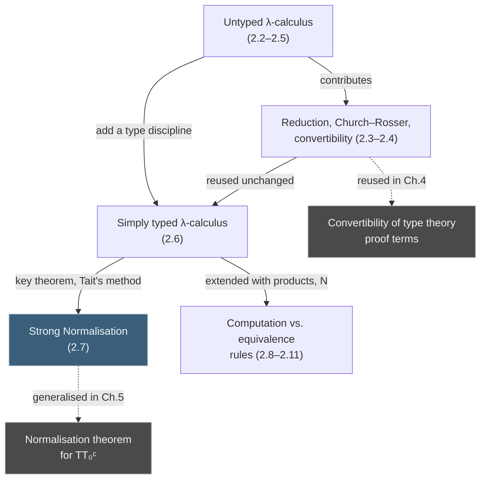
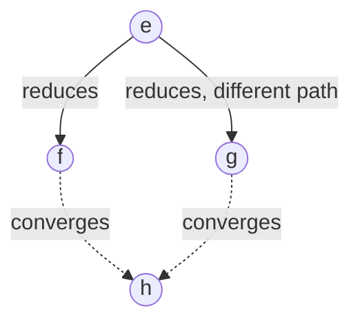
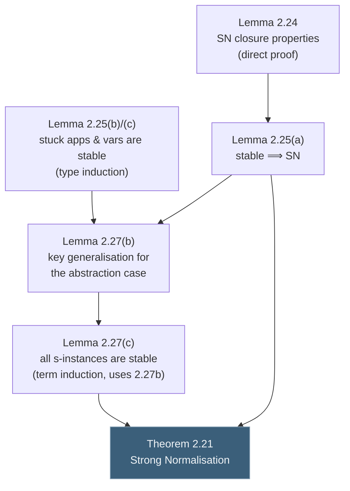

# The Lambda Calculus

[[book-guidelines|↩ Back to guidelines]]

## Why the book stops to build a calculus before it builds a logic

Chapter 1 gave you natural deduction: rules for building and taking apart proofs of $\wedge$, $\Rightarrow$, $\vee$, $\forall$, $\exists$. Chapter 4 is going to reinterpret those very same rules as a *typed programming language*, via the Curry–Howard correspondence — a proof of $A \Rightarrow B$ literally **is** a function from $A$ to $B$. But before that reinterpretation can mean anything, you need a formal theory of what a function *is*, what it means to *apply* one, and — crucially — what it means for two functions, or two proofs, to compute to "the same thing." That theory is the $\lambda$-calculus, and this chapter builds it twice: once untyped (Church's original 1930s system, a minimal universal model of computation with no type discipline at all), and once typed (a disciplined subset that will become the computational core of type theory itself).

The reason to do the untyped version first, even though the rest of the book only needs the typed one, is pedagogical and technical at once. Untyped, you can see the calculus's full expressive power — Turing completeness, self-application, non-termination — undiluted by typing restrictions. Then, when you add types and that power visibly disappears (no more $\Omega$, no more fixed-point combinators), you understand *exactly* what typing costs you and exactly what it buys you: strong normalisation, the guarantee that **every** well-typed program terminates. That guarantee, proved here by a technique invented for this exact purpose (Tait's reducibility method), is the load-bearing result of the whole chapter — type theory's entire proof-theoretic story rests on generalisations of this one proof.



---

## Part 1: The Untyped λ-Calculus

### What breaks without a formal notion of "function"

Ordinary mathematical notation writes $f(x) = x + 1$ and calls $f$ "the successor function" — but it names the function via an *equation*, tangled up with a name ($f$) that plays no essential role. If you want to talk about "the function that adds one" without inventing a name for it every time (the way you'd write an anonymous closure in a modern language), ordinary notation has no clean way to do it. Church's fix is the **abstraction** — a genuinely anonymous, first-class notation for "the function that, given $x$, returns $e$."

### Definition 2.1 — the syntax

The book gives exactly three term forms (Thompson's Definition 2.1, p. 32):

$$
e ::= x \;\mid\; (e_1\, e_2) \;\mid\; (\lambda x . e)
$$

- **Variables** $v_0, v_1, v_2, \ldots$ (written $x, y, z, \ldots$).
- **Applications** $(e_1\, e_2)$ — apply $e_1$ to $e_2$.
- **Abstractions** $(\lambda x . e)$ — the function that returns $e$ given formal parameter $x$.

Three bracket-saving conventions (Definition 2.2) make this readable: application binds tighter than abstraction and associates left ($xyz$ means $(xy)z$), and nested abstractions collapse: $\lambda x_1.\lambda x_2.\cdots \lambda x_n.e$.

**Grounding — this is an untyped, dynamically-checked AST.** In Rust, the closest honest analogue is an enum with no type parameter at all, deliberately un-typed at the value level:

```rust
enum Term {
    Var(String),
    App(Box<Term>, Box<Term>),
    Abs(String, Box<Term>),
}
```

Every `Term` is legal to construct — there's no static discipline stopping you from applying a variable to itself, `Var("x")` applied to `Var("x")`, which is exactly the freedom the untyped calculus has and the typed calculus (2.6) will take away.

### Binding, substitution, and why the book is so careful about them

The parameter $x$ in $\lambda x . e$ is a **formal** parameter — Thompson makes the point explicit that $\lambda x.\lambda y. xy$ and $\lambda u.\lambda v.uv$ must be indistinguishable. This is the same "arbitrary variable" idea from the quantifier rules in Chapter 1; $\lambda$ is a binder exactly as $\forall$ and $\exists$ are.

**Definition 2.3 (bound/free).** An occurrence of $x$ inside $\lambda x.e$ is *bound*; every other occurrence is *free*. $x$ occurs free in $f$ if some occurrence of $x$ in $f$ is free. A variable is bound by the syntactically innermost enclosing $\lambda$ — "just as in any block-structured programming language," the book notes, drawing the lexical-scoping analogy explicitly. A term with no free variables is *closed*; otherwise *open*.

**Applying a function means substituting.** We form applications $(\lambda x.e_1)e_2$, and evaluating one means replacing the formal parameter with the actual one, written $e_1[e_2/x]$. **Definition 2.4** gives this by structural recursion, and the one case that requires care is abstraction:

$$
(\lambda y.g)[f/x] \;\equiv_{df}\;
\begin{cases}
\lambda y.g[f/x] & \text{if } y \text{ not free in } f\\[4pt]
\lambda z.(g[z/y][f/x]) & \text{if } y \text{ free in } f,\ z \text{ fresh}
\end{cases}
$$

**What breaks without the fresh-variable case:** if you substituted naively, $((\lambda x.\lambda y. x) y)$ — a term whose behavior should be "return whatever $x$ was bound to," here $y$ — would substitute $y$ for $x$ inside $\lambda y. x$ and produce $\lambda y. y$, the *identity function*, silently capturing the free $y$ under the inner binder. That's the classic variable-capture bug, the same failure mode you get in a naive macro-expansion system or a compiler pass that renames without checking scope. The book's fix — rename the bound $y$ to a fresh $z$ before substituting — is exactly $\alpha$-renaming, and the book's blanket "Convention on Expression Equivalence" (identify terms up to renaming of bound variables) is what lets everything after this point pretend capture-avoidance is free, even though — as Thompson dryly notes — "this convention...is surprisingly difficult to implement."

**Grounding — this is a real compiler-engineering problem.** A capture-avoiding substitution in Rust, made honest about the freshness requirement:

```rust
fn subst(e: &Term, x: &str, f: &Term) -> Term {
    match e {
        Term::Var(y) if y == x => f.clone(),
        Term::Var(y) => Term::Var(y.clone()),
        Term::App(e1, e2) => Term::App(
            Box::new(subst(e1, x, f)),
            Box::new(subst(e2, x, f)),
        ),
        Term::Abs(y, body) if y == x => e.clone(), // x rebound: no-op
        Term::Abs(y, body) if !free_in(y, f) => Term::Abs(
            y.clone(), Box::new(subst(body, x, f)),
        ),
        Term::Abs(y, body) => {
            let z = fresh_var(y, body, f);           // avoid capture
            let renamed = subst(body, y, &Term::Var(z.clone()));
            Term::Abs(z, Box::new(subst(&renamed, x, f)))
        }
        _ => unreachable!(),
    }
}
```

If you've ever built a language elaborator or written a hygiene pass for a macro system, this is the exact shape of the problem. **This is precisely the plumbing your Rust verifier's substitution routine, and Lean's `instantiate`/kernel substitution, both have to get right** — get the freshness case wrong and unsound proofs (or ill-scoped terms) slip through silently. In Lean's actual kernel this problem is sidestepped entirely by using de Bruijn indices instead of named variables (mentioned later in the book, §9.1.4, for AUTOMATH) — a good exercise is to notice that de Bruijn indices make the "fresh variable" branch above simply vanish, at the cost of harder-to-read terms.

### β-reduction: the one computation rule

**Definition 2.5.**
$$(\lambda x.e)f \to_\beta e[f/x]$$

**Definition 2.6** calls a subterm of the shape $(\lambda x.e)f$ a **redex** (reducible expression), and extends $\to_\beta$ to reduction *within* a term — if $e \to_\beta e'$ then $(f e) \to_\beta (f e')$, $(ef) \to_\beta (e'f)$, and $\lambda y.e \to_\beta \lambda y.e'$. **Definition 2.7** takes the reflexive-transitive closure, $e \twoheadrightarrow f$, meaning $f$ is reachable from $e$ by zero or more $\beta$-steps — a *reduct* of $e$.

Multi-argument functions are handled by **currying**: $\lambda x.\lambda y.(x+y)$ takes its arguments one at a time, so $(\lambda x.\lambda y.(x+y))\,4$ is a perfectly good, partially-applied term — the function "add four."

```python
# A five-line evaluator sketch — leftmost-outermost beta reduction,
# just to make the rewriting concrete before the formalism piles up.
def beta_reduce(term):
    if isinstance(term, App) and isinstance(term.fn, Abs):
        return subst(term.fn.body, term.fn.param, term.arg)  # the redex fires
    return term
```

### Evaluation: what a term "computes to" (§2.3)

The book is candid that asking "what does an untyped term evaluate to?" is a bit artificial, since everything is a function — there's no ground type to print a result of. Still, three notions of "done" are distinguished (**Definition 2.8**), in strictly decreasing order of "fully computed":

| Form | Shape | Meaning |
|---|---|---|
| **Normal form** | no redexes anywhere | fully reduced, nothing left to do |
| **Head normal form** | $\lambda x_1\cdots\lambda x_n. y e_1 \cdots e_m$ ($y$ a variable) | reduced down to a "stuck" head variable, arguments possibly unreduced |
| **Weak head normal form** | a $\lambda$-abstraction, or $y e_1 \cdots e_m$ | reduced only until the outermost form is visible |

These are nested — every normal form is a head normal form is a weak head normal form — and neither converse holds. The book's own counterexamples are worth keeping: $\lambda x.(x((\lambda x.xx)(\lambda x.xx)))$ is in head normal form but has *no* normal form (the redex is buried, unreachable without descending under the outer application); $\lambda y.((\lambda x.xx)(\lambda x.xx))$ is in weak head normal form but has no head normal form at all.

Both examples reuse
$$\Omega \equiv_{df} (\lambda x.xx)(\lambda x.xx),$$
which reduces only to itself forever — the calculus's canonical non-terminating term, its "$\bot$."

**A subtler example** the book gives is genuinely important: $F \equiv_{df} \lambda f.((\lambda x. f(xx))(\lambda x. f(xx)))$ has no normal form (it never stops rewriting), yet $(Ff) \twoheadrightarrow f(Ff)$ — applied to any $f$, it behaves as a **fixed-point combinator**. Wadsworth's theorem, cited by Thompson, says it's exactly the terms with a *head* normal form that can be "meaningful in some context" even without a normal form — which is why weak-head-normal-form evaluation (roughly: stop as soon as you reach a $\lambda$ or a stuck application) corresponds to lazy evaluation in real languages, while insisting on full normal form is closer to what you'd want if you actually wanted to *print* a value.

**Grounding.** In Rust terms: weak head normal form is what a lazy `Thunk<T>` gives you when you `.force()` it once — enough to pattern-match the outer constructor, not necessarily enough to fully evaluate its children. In Lean's elaborator, `whnf` (weak-head-normal-form reduction) is a named, load-bearing primitive for exactly this reason — unification and typeclass search repeatedly need "reduce just enough to see the head symbol," not "fully normalize," because full normalization can diverge or explode even when the comparison you actually care about doesn't need it.

### The Church–Rosser theorem — determinacy of computation

This is the chapter's first genuinely deep result, and it answers a question that matters practically: if two different reduction *strategies* both terminate, do they have to agree?

> **Theorem 2.10 (Church–Rosser).** For all $e, f, g$: if $e \twoheadrightarrow f$ and $e \twoheadrightarrow g$, then there exists $h$ with $f \twoheadrightarrow h$ and $g \twoheadrightarrow h$.



The book states the theorem and points the proof (structural induction over terms, "usually called structural induction," **Definition 2.11**) at Barendregt's monograph rather than reproducing it — this is one of the places where the guidelines flag that the book leans on [Bar84] for the heavy syntactic combinatorics, since the diamond property doesn't hold step-by-step (one $\beta$-step from a common ancestor doesn't directly diamond) and needs an auxiliary "parallel reduction" relation to get the induction to close. What *is* worth internalizing precisely is the **corollary**, which is what actually gets used everywhere downstream:

> **Theorem 2.12.** If a term has a normal form, it is unique.

This is the property that makes "the value of an expression" a coherent notion at all — without it, *which* normal form you get would depend on evaluation order, and equational reasoning about programs (rewrite this subexpression, get an equal program) would be unsound. Note explicitly what Church–Rosser does *not* give you: uniqueness of head normal form or weak head normal form — only full normal forms are unique.

**Leftmost-outermost reduction (Definition 2.13, Theorem 2.14).** Given that a normal form might exist along some reduction paths and not others (the book's example: $(\lambda x.\lambda y.y)\,\Omega$ has normal form $\lambda y.y$, but reducing $\Omega$ first inside the argument loops forever), which strategy is guaranteed to find it if it exists? Answer: always reduce the **leftmost-outermost** redex — the first one found by a top-down, left-to-right (preorder) traversal of the parse tree. The **Normalisation theorem** says this strategy reaches a normal form (or head/weak-head normal form) whenever one exists at all. This is, precisely, *why* lazy evaluation is the "safe" default evaluation order for a language that wants maximal chance of termination — leftmost-outermost is lazy evaluation's mathematical name, modulo the sharing optimizations real implementations add to avoid recomputing duplicated redexes.

### η-reduction and why it's a different kind of rule

**Definition 2.15.** For $x$ not free in $e$:
$$\lambda x.(ex) \to_\eta e$$

The book is careful to flag that this is *not* obviously a computation rule the way $\beta$ is: both sides behave identically on every argument ($(\lambda x.(ex))\,y \to_\beta ey$ for any $y$), so $\eta$ isn't simplifying a computation — it's **identifying two different representations of extensionally-equal functions**. This distinction — rules that compute versus rules that merely equate — resurfaces relentlessly through the rest of the book (§2.8, §2.11, and again for the identity type in Chapter 4), so it's worth fixing now: a computation rule tells you how to *run* a term; an equivalence rule tells you when two already-different-looking terms should be treated as the same value.

### Convertibility (§2.4)

Reduction ($\to$) is directional — the right side is "simpler." **Convertibility** is the symmetric closure, an actual equivalence relation, and the book defines two versions:

- $\leftrightarrow$: smallest equivalence relation extending $\twoheadrightarrow$ (**Definition 2.16**).
- $\leftrightarrow_{\beta\eta}$: the same, generated jointly from $\beta$- and $\eta$-reduction.

By Church–Rosser, $e \leftrightarrow f$ iff $e$ and $f$ have a common reduct — this is what makes convertibility decidable-in-principle (in the untyped case it's actually undecidable in general because normalisation itself isn't guaranteed to terminate, but *if* both terms normalise, comparing normal forms suffices).

**Why $\beta$-convertibility alone under-identifies functions.** The book's example: $\lambda y.(\lambda x.(yx))$ and $\lambda y.y$ are *not* $\beta$-convertible (they're not the same term up to reduction), yet applied to any argument $z$ they both reduce to $z$ — they're behaviourally indistinguishable. $\beta\eta$-convertibility is defined precisely to close this gap: it's the smallest substitutive equivalence relation extending $\leftrightarrow$ that is **extensional** — if $(fy) \mathrel{R} (gy)$ for a variable $y$, then $f \mathrel{R} g$. This is function extensionality, stated as a *derived* closure property rather than assumed as an axiom.

**Grounding — this is `isDefEq` versus propositional equality.** In Lean, $\beta$-convertibility (plus $\iota$, $\delta$, and a few other rules) *is* definitional equality — the kernel's `isDefEq` check, the thing `rfl` discharges. $\eta$-convertibility for functions is also baked into Lean's definitional equality (Lean's kernel does support $\eta$ for structures and functions), which is exactly the book's $\leftrightarrow_{\beta\eta}$. The distinction matters enormously for your elaborator project: **definitional equality is decidable convertibility-checking** (reduce both sides, compare — feasible because the calculus you actually implement is typed and normalising, unlike the untyped case here), while *propositional* equality (Chapter 4's identity type $I(A,a,b)$) is a much stronger, undecidable-in-general relation that convertibility is only a decidable *approximation* of. This chapter is where that distinction is born, well before the book has any notion of "type" to attach it to.

### Expressiveness, briefly (§2.5)

The untyped calculus is Turing-complete. Two facts matter for later contrast with the typed system:

- **Church numerals**: $n$ is represented as the iterator $\lambda f.\lambda x. f(f(\cdots f(fx)\cdots))$ ($n$ copies of $f$) — itself in normal form.
- **Fixed-point combinators**: to solve $f \equiv_{df} R\,f$ for arbitrary $\lambda$-term $R$, you need an operator $F$ with $FR \twoheadrightarrow R(FR)$. The book gives two: $\theta\theta$ where $\theta \equiv_{df}\lambda a.\lambda b.(b(aab))$, and the earlier $F \equiv_{df}\lambda f.((\lambda x.f(xx))(\lambda x.f(xx)))$ (this is Curry's $Y$-combinator in a different guise). Both have head normal form but *no* normal form — a general fact about fixed-point combinators, since $\lambda x.(Fx) \to_\beta \lambda x.(x(Fx)) \to_\beta \cdots$ never stabilizes.

```python
# Church numeral 3 and successor, made concrete
succ = lambda n: lambda f: lambda x: f(n(f)(x))
three = lambda f: lambda x: f(f(f(x)))
```

The point to carry forward: **self-application ($xx$) is exactly what makes both $\Omega$ and every fixed-point combinator constructible.** Watch it disappear in the next section.

---

## Part 2: The Simply Typed λ-Calculus (§2.6)

### What a type discipline buys you, and what it costs

The untyped calculus's power is also its problem: nothing stops you from writing something that "adds" two booleans, and nothing stops you from writing $\Omega$. **Definition 2.17** builds types from a base set $B$, closed under function-type formation: if $\sigma,\tau$ are types, so is $\sigma \Rightarrow \tau$ (right-associative, so brackets can be dropped: $\sigma\Rightarrow\tau\Rightarrow\rho$ means $\sigma\Rightarrow(\tau\Rightarrow\rho)$).

**Definition 2.18** re-does the term syntax with types attached at the syntax level — one countably-infinite family of variables *per type* $\tau$:

- $v_{\tau,i} : \tau$ — a variable of type $\tau$.
- If $e_1 : (\sigma\Rightarrow\tau)$ and $e_2:\sigma$, then $(e_1e_2):\tau$ — **you can only apply a function to an argument of the matching domain type.**
- If $x:\sigma$ and $e:\tau$, then $(\lambda x_\sigma.e):(\sigma\Rightarrow\tau)$.

The immediate consequence: **given a variable $x_\sigma$, you cannot form $x_\sigma x_\sigma$** — self-application is simply not well-typed, because it would require $\sigma$ to itself be a function type $\sigma\Rightarrow\tau$ with $\sigma$ appearing as its own domain, which the grammar of Definition 2.17 never produces for a fixed finite type. And with self-application gone, $\Omega$ and every fixed-point combinator from §2.5 become **unwritable**. This is not an accident the book proves as an afterthought — Exercise 2.7 asks you to show exactly this — it's the mechanical reason the typed calculus is strongly normalising while the untyped one isn't.

### Contexts and the judgement form $\Gamma \vdash e:\tau$

Rather than an infinite family of variables per type, the book moves (Definition 2.20) to a single pool of variables plus explicit **contexts** $\Gamma$ — finite, consistent lists of type assumptions $x:\tau$ (at most one assumption per variable) — and writes the four-place judgement

$$\Gamma \vdash e : \tau$$

read "$e$ has type $\tau$ in context $\Gamma$." The rules:

$$
\dfrac{}{\Gamma, x:\tau \vdash x:\tau} \qquad
\dfrac{\Gamma \vdash e_1:(\sigma\Rightarrow\tau) \quad \Gamma\vdash e_2:\sigma}{\Gamma \vdash (e_1e_2):\tau} \qquad
\dfrac{\Gamma, x:\sigma \vdash e:\tau}{\Gamma \vdash (\lambda x_\sigma.e):(\sigma\Rightarrow\tau)}
$$

Thompson flags one genuinely subtle point about the abstraction rule worth sitting with: the premise $\Gamma, x:\sigma \vdash e:\tau$ uses the assumption $x:\sigma$ to type the *body*, but that assumption is **discharged** — it does not appear in the conclusion's context $\Gamma$. This is the exact same discharge mechanic as $\Rightarrow$-introduction in natural deduction (Chapter 1) — because $x$ is bound inside $(\lambda x_\sigma.e)$, the assumption about it is local to that scope, exactly like a variable declaration in a block-structured language going out of scope at the closing brace.

**Grounding — this judgement form is the shared ancestor of a type checker and a proof checker**, which is exactly the connection the learning-goals thread in this workbench asks to be made explicit whenever a book supports it, and this is about as direct a supporting instance as exists in the book. A Rust type-checker for this fragment is a near-literal transcription of the three rules:

```rust
use std::collections::HashMap;

#[derive(Clone, PartialEq, Debug)]
enum Ty { Base(String), Arrow(Box<Ty>, Box<Ty>) }

type Ctx = HashMap<String, Ty>;

fn type_of(ctx: &Ctx, e: &Term) -> Result<Ty, String> {
    match e {
        Term::Var(x) => ctx.get(x).cloned()
            .ok_or_else(|| format!("unbound variable {x}")),
        Term::App(e1, e2) => match type_of(ctx, e1)? {
            Ty::Arrow(sigma, tau) => {
                let arg_ty = type_of(ctx, e2)?;
                if arg_ty == *sigma { Ok(*tau) }
                else { Err(format!("expected {sigma:?}, got {arg_ty:?}")) }
            }
            other => Err(format!("{other:?} is not a function type")),
        },
        Term::Abs(x, sigma, body) => {
            let mut ctx2 = ctx.clone();
            ctx2.insert(x.clone(), sigma.clone());  // discharge on return
            let tau = type_of(&ctx2, body)?;
            Ok(Ty::Arrow(Box::new(sigma.clone()), Box::new(tau)))
        }
    }
}
```

In Lean, the same three rules are (almost) literally the kernel's `infer_type`/`check` judgement for `Expr.app` and `Expr.lam` — the book's $\Gamma \vdash e:\tau$ is the informal ancestor of Lean's `LocalContext` plus `InferType`. The one thing this fragment doesn't yet need, and Lean's real elaborator does, is *bidirectional* typing (switching between inference mode and checking mode) — that distinction only becomes forced once you add types the syntax can't determine bottom-up, which starts in earnest with the dependent types of Chapter 4.

---

## Part 3: Strong Normalisation and Tait's Method (§2.7)

### Why this is the chapter's hardest result, and why structural induction can't prove it

> **Theorem 2.19 / 2.21 (Strong Normalisation).** Every reduction sequence starting from a simply-typed term is finite.

This is a *much* stronger claim than "has a normal form" — it says **every** reduction path terminates, not just the leftmost-outermost one. It's also the mechanism that will eventually guarantee, in type theory proper, that type-checking and proof-checking are decidable and that programs extracted from proofs actually run to completion.

The book is explicit about a trap here: the natural first idea is a plain structural induction on the term (prove the property for variables, inductively for applications and abstractions). **That can't work**, because such a proof would carry over verbatim to the *untyped* calculus — but we already know from §2.3–2.5 that some untyped terms (like $\Omega$) fail to normalise at all, even though they're built from exactly the same variable/application/abstraction cases a structural induction would use. Whatever proof works here has to use the type structure essentially — not just be *decorated* with types as an afterthought.

### Induction over types, and the strengthened hypothesis

Thompson introduces the technique (originally Tait's, 1967) as **induction over the structure of types** rather than terms (**Definition 2.22**):

- Base case: prove $P(\sigma)$ for every base type $\sigma \in B$.
- Step: prove $P(\sigma\Rightarrow\tau)$ assuming $P(\sigma)$ and $P(\tau)$.

But induction over types alone doesn't yet touch terms. The real insight — and the reason a *direct* proof of "$e$ is strongly normalising" fails at the induction step — is that knowing $e$ and $e'$ are both SN (strongly normalising) tells you nothing directly about whether $(ee')$ is SN; you need a property that's *preserved by application*, strong enough to carry through. That property is:

> **Definition 2.23 (stability).** $e$ of type $\tau$ is **stable**, $e \in \|\tau\|$, if:
> - $\tau$ is a base type and $e$ is SN, or
> - $\tau = \sigma\Rightarrow\tau'$ and for every $e' \in \|\sigma\|$, $(ee') \in \|\tau'\|$.

This is a Kripke-style / logical-relations definition — stability at a function type is defined in terms of stability at its domain and range, recursively over the type structure, which is exactly why the induction has to run over types rather than terms. **What breaks without this indirection:** a proof that just tracks "is SN" as a property of terms has no way to conclude anything about $(ee')$ from "$e$ is SN" and "$e'$ is SN" alone, because SN-ness says nothing about how $e$'s *internal structure* interacts with an argument once substituted in. Stability is engineered specifically so that application of a stable function to a stable argument produces something stable *by definition* — the work is front-loaded into designing the right invariant, a very characteristic move in termination/logical-relations proofs generally (it's the same shape of move behind logical relations for parametricity and behind Lean's own `WellFounded` machinery).

### The proof skeleton, kept intact

The book's proof has four load-bearing pieces. Preserving the actual dependency structure (rather than flattening it) matters here, since this exact skeleton — stability/reducibility candidates defined by induction on types, with a strengthened induction hypothesis — reappears (generalised) for the normalisation theorem of $TT_0^c$ in Chapter 5.

**Lemma 2.24** (elementary closure properties of $SN$, proved directly, not by type induction):
(a) every variable is $SN$;
(b) if $e_1,\ldots,e_k \in SN$ then $xe_1\cdots e_k \in SN$ (an infinite reduction sequence from the whole application would force one from some $e_i$);
(c) if $ex \in SN$ then $e \in SN$;
(d) if $e \in SN$ then $\lambda x.e \in SN$.

**Lemma 2.25** — proved by *simultaneous induction over the type* $\tau$, three clauses at once (the mutual dependency is the point — none of the three goes through alone):
(a) stable $\Rightarrow$ $SN$;
(b) if $xe_1\cdots e_n : \tau$ and all $e_i \in SN$, then $xe_1\cdots e_n \in \|\tau\|$ (stuck applications headed by a variable are automatically stable);
(c) every variable $x:\tau$ is stable.

The induction step for (a) is a nice small piece of reasoning worth walking through because it shows *why* stability was defined the way it was: assume $e \in \|\sigma\Rightarrow\rho\|$; take a fresh $x:\sigma$; by (c) for $\sigma$, $x$ is stable; by the *definition* of stability at $e$'s type, $ex \in \|\rho\|$; by (a) for $\rho$ (induction hypothesis), $ex$ is $SN$; by Lemma 2.24(c), $e$ is $SN$. Every step is forced — this is what "the definition is engineered to be preserved by application" cashes out to concretely.

**Lemma 2.27** is where the abstraction case — the genuinely hard case — gets discharged, via a generalisation the book motivates by pointing out a direct proof doesn't go through:
(a) stability closed under application;
(b) *(the key generalisation)* for all $k\ge0$: if $f[g/x]h_1\cdots h_k \in \|\tau\|$ and $g \in SN$, then $(\lambda x.f)\,g\,h_1\cdots h_k \in \|\tau\|$;
(c) every **s-instance** (simultaneous substitution instance by stable terms, **Definition 2.26**) of any term is stable.

Part (b)'s proof (base case: $\tau$ a base type) is the technical heart: it case-splits every reduction sequence out of $(\lambda x.f)gh_1\cdots h_k$ into those that eventually fire the head redex $(\lambda x.f)g$ — which factor through the already-known-SN sequence from $f[g/x]h_1\cdots h_k$ — and those that never do, which factor into a sequence of $g$-reductions (finite, since $g\in SN$) interleaved with reductions that mirror a sequence for $f[g/x]h_1\cdots h_k$ (also finite). Either way, every reduction sequence terminates.

Part (c) finally closes the loop by structural induction *over terms* — but now legitimately, because at the abstraction case it can invoke part (b) (which does the type-level heavy lifting) rather than needing a bare induction hypothesis strong enough on its own.

**The proof of Theorem 2.21 itself is then two lines**: every term is a trivial s-instance of itself, so by 2.27(c) every term is stable; by 2.25(a), every stable term is $SN$. $\blacksquare$



**Grounding — why your Rust verifier cares about exactly this proof shape.** If your compiler/verifier needs to guarantee that type-checking, or some embedded proof-search/normalisation step, terminates on well-typed input, "termination by structural recursion on the term" is usually *not* strong enough once your term language has anything function-shaped in it — you will hit precisely the wall Thompson flags (an application doesn't obviously terminate just because its parts do). The fix, generalized far beyond this simply-typed fragment, is the **logical-relations / reducibility-candidates** method: define, by induction on *types* (or kinds, or whatever indexes your termination measure), a semantic predicate stronger than "terminates" but implied by it, engineered so each term-former preserves the predicate. This is the exact technique behind normalisation proofs for System F (where types alone aren't enough and you need *sets* of terms closed under reduction, "reducibility candidates," because of impredicative quantification) and behind strong normalisation results for the Calculus of Constructions, both name-checked later in the book (§9.1.5). If you ever need to prove your elaborator's unifier or your verifier's normaliser terminates on well-typed terms, this is the technique to reach for, not induction on term size.

---

## Part 4: Rounding Out — Products, Natural Numbers, and the Computation/Equivalence Distinction (§2.8–2.11)

### Product types, and the rule that isn't quite a computation rule

Adding pairs is routine (a third type-formation clause $\sigma\times\tau$; term formers $(x,y)$, `fst`, `snd`), but the book uses it to sharpen the computation-vs-equivalence distinction first raised for $\eta$:

$$
\mathtt{fst}\,(p,q) \to p \qquad \mathtt{snd}\,(p,q)\to q \qquad \text{(computation rules)}
$$
$$
(\mathtt{fst}\,p,\, \mathtt{snd}\,p) \to p \qquad \text{(an equivalence / extensionality rule)}
$$

The diagnostic the book gives for telling them apart is about the *type* of the objects each rule relates: computation rules relate objects of **arbitrary** type ($(\lambda x.e)f \twoheadrightarrow e[f/x]$ for any $e$; $\mathtt{fst}\,(p,q)\to p$ for any $p$), while equivalence rules relate objects of a **restricted, structurally determined** type — for $\eta$, $e$ must already be of function type for $\lambda x.(ex)$ to be a well-formed term at all; for the product rule, $p$ must already be of product type. This becomes exactly the same distinction Chapter 5 will draw between $TT_0^*$ (a version of type theory keeping only computation rules, strongly normalising but *not* Church–Rosser) and the full theory with equivalence rules restored via combinators — so it's worth carrying forward as more than a footnote.

### Natural numbers and the primitive recursor (§2.9)

Adding $N$: $0:N$, and $\mathtt{succ}\,n:N$ for $n:N$. The **primitive recursor**
$$\mathtt{Prec}\,e_0\,f : N\Rightarrow\tau \quad (e_0:\tau,\ f:N\Rightarrow\tau\Rightarrow\tau)$$
represents the function $F$ defined equationally by $F\,0 \equiv_{df} e_0$ and $F(n+1)\equiv_{df} f\,n\,(Fn)$, via computation rules $\mathtt{Prec}\,e_0\,f\,0 \to e_0$ and $\mathtt{Prec}\,e_0\,f\,(n{+}1)\to f\,n\,(\mathtt{Prec}\,e_0\,f\,n)$. This is the direct ancestor of the primitive recursor for $N$ in $TT_0$ (Chapter 4, §4.8), where it does double duty as *both* a program-defining device and, under Curry–Howard, mathematical induction. The strong-normalisation proof extends to this system by the same stability machinery, with a nested induction over natural numbers layered on top of the type induction to handle unwinding $\mathtt{Prec}$.

### General recursion, and why type theory refuses it (§2.10)

Adding an unrestricted fixed-point operator $R$ with $Rf \to f(Rf)$ recovers full Turing-completeness — and with it, non-termination: $R(\lambda x.x)$ loops forever computationally even though the identity function has plenty of (non-computed) fixed points mathematically. This is the fork in the road type theory takes deliberately: Martin-Löf's system, which the rest of the book builds, **refuses** unrestricted general recursion precisely to keep the strong-normalisation guarantee just proved — Chapter 7's discussion of well-founded recursion (§7.8–7.9) is the disciplined, terminating substitute the book eventually offers instead.

### Printable values (§2.11)

The closing section defines the **order** of a type ($\partial(\tau)=0$ for base types; $\partial(\tau\Rightarrow\sigma)=\max(\partial(\tau)+1,\partial(\sigma))$) and argues that the values a program should actually *produce* are the **closed, zeroth-order normal forms** — "printable values." For $N$ these are exactly $0,\ \mathtt{succ}\,0,\ \mathtt{succ}(\mathtt{succ}\,0),\ldots$, proved by an induction over closed terms that (worth noting) never has to invoke the equivalence rules at all — closure plus printable (ground) type is enough to rule out both the $\eta$-style redexes and ill-formed terms like $(\mathtt{fst}\,p,\mathtt{snd}\,p)$ for a *variable* $p$. This closes the loop back to the computation/equivalence distinction: equivalence rules matter for reasoning about program equality, but the computation rules alone suffice to actually run a closed, ground-type program to its printable answer.

---

## Where This Leads

This chapter is the computational substrate the entire rest of the book stands on, reused almost without modification:

- **Substitution, binding, and $\alpha$-equivalence** (§2.2) are the plumbing under every later definition involving bound variables — the quantifier rules of Chapter 4, the context-management theorems of Chapter 5 (§5.1, "discharge must remove every occurrence"), and ultimately the soundness of anything resembling a Hoare-triple substitution rule in a verifier.
- **The judgement $\Gamma \vdash e:\tau$** (§2.6) is *literally* the notational template Chapter 4 reuses for $\Gamma \vdash p:P$ — "$e$ has type $\tau$" and "$p$ is a proof of $P$" are the same rule, read twice. This is the Curry–Howard correspondence arriving one chapter early, in disguise, before the book names it.
- **$\beta\eta$-convertibility** (§2.4) reappears unchanged as the notion of *definitional equality* in $TT_0$ (§4.11) — the relation Lean's kernel calls `isDefEq`, decidable, and deliberately weaker than the propositional identity type $I(A,a,b)$ introduced later.
- **Strong normalisation via Tait's method** (§2.7) is not just reused but *directly generalised*: Chapter 5's normalisation theorem for $TT_0^c$ (Theorem 5.14) is the same reducibility-candidates technique run over the full type-theoretic term language, and its corollaries — a model, uniqueness of normal forms, Church–Rosser, decidability of convertibility and of derivability — are exactly the properties that make type-checking (and therefore proof-checking) in type theory a terminating, implementable algorithm. Every time later chapters casually say "convertibility is decidable," this proof is why.
- **The computation/equivalence rule distinction** (§2.4, §2.8, §2.11) becomes the organizing question behind $TT_0^*$ versus the combinator-based $TT_0^c$ in Chapter 5 — whether restricting to computation rules alone (no reduction under a binder) costs you Church–Rosser, and what it takes to get it back.

For the standing project threads this workbench tracks: the stability/reducibility-candidates proof here is the minimal, fully worked example of the termination-proof technique your verifier's normaliser will eventually need in a much larger term language, and the $\Gamma \vdash e:\tau$ judgement form is the single ancestor from which both "type checker" and "proof checker" readings will split apart and then be explicitly reunified in Chapter 4's Curry–Howard presentation.
