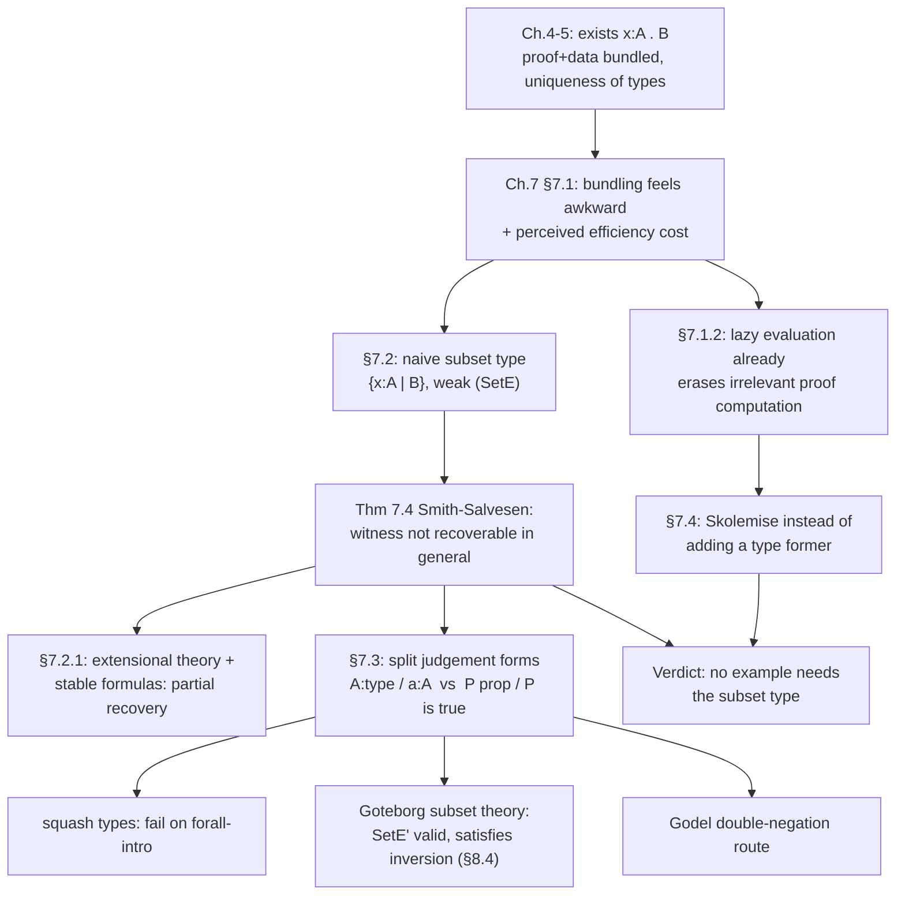

# The Subset Type and Its Difficulties

[[book-guidelines|↩ Back to guidelines]]

## The itch: existentials carry too much

Go back to `nelist`, the type of non-empty lists from Chapter 6:

$$
(\mathit{nelist}\ A) \equiv_{df} (\exists l : [A]).\ (\mathit{nonempty}\ l)
$$

A value of this type is a pair $(l, p)$ — a list, plus a proof object $p$ that it's non-empty. That pairing is exactly what the dependent sum type $\exists$ (or, in programming terms, a dependent pair / sigma type) is built to do, and it's what let Chapter 6 define `hd` and `tl` with static guarantees against empty-list errors — no runtime check, the type itself is the guarantee.

But look at what actually happens when you *compute* with `hd ((2 :: rest), p)`. The answer is `2`. The proof `p` was never inspected. It rode along, structurally required for the term to type-check, computationally inert. In Rust terms: think of a `NonEmptyVec<T>` implemented as `struct NonEmptyVec<T> { list: Vec<T>, proof: NonEmptyProof }`, where `NonEmptyProof` is a zero-sized marker type carrying no runtime data — except in $TT$, the "proof" isn't a marker, it's a genuine proof *term*, with real structure, that in a naive implementation would sit there in memory and get threaded through every operation on the list even though nothing about the actual computation depends on its shape.

This is bothersome for two overlapping reasons the book flags in §7.1:

1. **Notational clutter.** A specification like $(\forall x:A).(\exists y:B).P(x,y)$ says "for every $a$, find *some* $b$ satisfying $P$" — but its inhabitants are functions returning **pairs** $(b, p_b)$, proof included. If what you actually want to talk about is "the function that produces $b$'s," the existential type doesn't give you that directly; you always get the bundle.
2. **Computational overhead** (a real concern the book takes seriously, then substantially deflates — more on that below).

The natural-looking fix: define a type whose members are *just* the $b$'s — the underlying data — dropping the proof entirely. That's the subset type.

## The naive subset type

$$
\{x : A \mid B\}
$$

read as "the elements of $A$ satisfying $B$." Contrast with $(\exists x:A).B$: the existential's members are *pairs* $(a,p)$ of data and proof; the subset type's members are meant to be just $a$ itself — the type $\{x:A\mid B\}$ collapses the proof out of the representation, keeping only the promise that a proof exists.

This is genuinely a different kind of type than anything seen before in $TT_0$. In particular the book notes it breaks **uniqueness of types** (Theorem 5.6 from Chapter 5): a single object $a$ can now inhabit $\{x:A\mid B_1\}$ and $\{x:A\mid B_2\}$ simultaneously, for any two properties $B_1, B_2$ that happen to both hold of $a$. Once you erase the proof, you can no longer read off from the object itself which property justified its membership.

### Formation, introduction — routine

$$
\dfrac{A \text{ is a type} \quad [x:A] \vdash B \text{ is a type}}{\{x:A\mid B\} \text{ is a type}} \ (SetF)
$$

$$
\dfrac{a:A \quad p : B[a/x]}{a : \{x:A\mid B\}} \ (SetI)
$$

Formation is standard. Introduction is exactly what you'd expect: to put $a$ into the subset, you need *some* proof $p$ that $B[a/x]$ holds — but note carefully, $p$ appears in the premise and then **vanishes**. The conclusion is just $a : \{x:A \mid B\}$, with no trace of $p$. This is the erasure the whole type is designed to achieve.

### Elimination — where it gets weak

This is the crux of the topic. If you know $a : \{x:A\mid B\}$, you know two things: $a:A$, and $B[a/x]$ is *true* — but you don't have the witnessing proof term in hand, by design. So how do you eliminate (use) a value of subset type to build something else?

$$
\dfrac{a : \{x:A\mid B\} \quad [x:A;\ y:B] \vdash c(x) : C(x)}{c(a) : C(a)} \ (SetE)
$$

Read the side condition carefully: you're allowed to derive $c(x):C(x)$ *assuming* $y:B$ is available — but $y$ must not occur free in $c$ or in $C$. You get to use the fact that $B$ holds while constructing $c$ and $C$, but the resulting term and type may not actually depend on *how* $B$ holds. Contrast this with the elimination rule for $\exists$ (from Chapter 4), where the witness variable is fully available to the body being constructed — that's a strong, unrestricted use of the paired proof. $(SetE)$ deliberately cripples this: it's called a **weak** elimination rule because of exactly this restriction.

One more asymmetry worth naming explicitly: unlike every other type former in $TT_0$, the subset type has **no computation rule**. Introduction doesn't add a new syntactic constructor (it reuses $a$ itself), so elimination has nothing new to reduce against. This is more than a curiosity — Chapter 8's inversion principle (§8.4), which mechanically derives elimination and computation rules from a type's introduction rule, works for every connective in $TT_0$ *except* this one. The subset type's elimination rule isn't generated by the usual discipline; it's bolted on.

**What breaks without the restriction.** If $y$ (the proof of $B$) were allowed to occur free in $c$ or $C$, the subset type would be indistinguishable from the existential — you'd have smuggled the proof back in through the elimination rule, defeating the entire point of erasing it at introduction. The restriction is not bureaucratic caution; it's the only thing that makes $\{x:A\mid B\}$ a genuinely different, weaker type than $(\exists x:A).B$.

## Theorems 7.2–7.4: exactly how weak is "weak"?

Thompson (citing Chi88a) relates $TT_0^S$ (the system with subsets added) back to plain $TT_0$:

**Theorem 7.2.** From a derivation of $p : (\exists x:A).B$ in $TT_0^S$, you can derive $\mathrm{fst}\ p : \{x:A\mid B\}$ — trivial, just apply $(SetI)$ to the first projection.

**Theorem 7.3.** Conversely, if $p : \{x:A\mid B\}$ is derivable from assumptions $\Gamma$, then *for some* $q:B$, you can reconstruct $(p,q) : (\exists x:A).B$ from a modified context $\Gamma'$ (subset-typed assumptions in $\Gamma$ get split into their base-type and proof parts). This says: whenever a subset-typed judgement is derivable at all, a proof of the corresponding existential *is implicit in the derivation itself* — you can dig it back out by inspecting how the derivation was built, even though it's absent from the term.

Neither of these should surprise you yet — they're about what's *derivable in principle by inspecting a proof*, not about what a single fixed term can compute. The real bite is Smith and Salvesen's result, an elaboration of Martin-Löf's normalisation proof:

> **Theorem 7.4 (Smith–Salvesen).** If the judgement
> $$t : (\forall x:\{z:A\mid P(z)\}).\ P(x) \tag{7.2}$$
> is derivable in $TT_0^S$, and $A$, $P$ do not themselves contain the subset type, then for *some* term $t'$,
> $$t' : (\forall x:A).\ P(x) \tag{7.3}$$
> is derivable.

Unpack what this says. (7.2) asks: can we write a single function $t$ that, given *any* element of the subset $\{z:A\mid P(z)\}$, hands back a witness that $P$ holds of it? Intuitively this looks like it should obviously be derivable — after all, membership in the subset is *supposed to mean* $P$ holds. But the theorem says: the only way $t$ can exist is if $P$ already holds of **every** element of $A$, not just the ones satisfying $P$ (that's what (7.3) says — $P$ holds unconditionally over all of $A$). In other words, subset membership can only be turned back into a proof witness in the degenerate case where the "subset" isn't cutting anything out at all.

This is the formal content of "$(SetE)$ is weak": you genuinely cannot, in general, recover the witness for $B(x)$ from a value known only to inhabit $\{x:A\mid B\}$.

**Concrete failure mode.** Suppose you tried to build, over the naive subset discipline,

$$
\mathit{head}' : \{l:[A] \mid \mathit{nonempty}\ l\} \Rightarrow A, \qquad
\mathit{tail}' : \{l:[A]\mid \mathit{nonempty}\ l\} \Rightarrow [A]
$$

satisfying $l = (\mathit{head}'\ l :: \mathit{tail}'\ l)$ for every non-empty $l$. From the *existence* of such functions you could construct a proof of $\mathit{nonempty}\ l$ for an arbitrary $l : \{l':[A]\mid \mathit{nonempty}\ l'\}$ — which is precisely an instance of (7.2). Theorem 7.4 then forces (7.3): $(\forall l:[A]).\mathit{nonempty}\ l$, i.e. *every* list, including $[\ ]$, is non-empty. Contradiction. So `head'`/`tail'` over the naive subset type are simply **not definable** — the very functions you introduced the subset type to make cleaner turn out to be exactly what it can't express.

If you're picturing this in Rust: it's as if you erased all information from `NonEmptyVec` down to `Vec<T>` at the type level (a type alias, nothing more), and then discovered you could no longer write `first()` without a runtime panic branch — because the type checker genuinely has no way to route the erased non-emptiness fact to the place that needs it. Erasing the proof at the type level doesn't just make the *representation* leaner; it removes information the *elimination* step structurally needs.

### The extensional loophole (§7.2.1)

In the book's **extensional** theory (recall from Chapter 5's $(IE_{ext})$ rule, which lets you derive $r(a):I(A,a,b)$ from any $e:I(A,a,b)$, collapsing propositional into definitional equality), the story changes. Because $(IE_{ext})$ can manufacture a *closed, variable-free* proof term $r(a)$ for any provable equality, you can sometimes build derivations satisfying the free-variable restriction of $(SetE)$ that would be impossible intensionally. Salvesen (`[Sal89a]`) derives $(\forall x:[N]).(\forall n:\{z:N\mid n\ \mathit{in}\ x\}).(n\ \mathit{in}\ x)$ this way — non-trivially, via universes and the type substitution rule.

Thompson then gives the general characterization:

**Definition 7.5.** A formula $P$ over $A$ is **stable** if $(\forall x:A).(\lnot\lnot P \Rightarrow P)$.

**Result (Salvesen–Smith).** For all stable $P$, $(\forall x:\{z:A\mid P(z)\}).P(x)$ *is* derivable in the extensional theory. And this is essentially the best you can do: Smith–Salvesen also show the statement fails for some formulas even extensionally (via a Troelstra-style refutation of Church's Thesis) — stability is not a mere sufficient condition dressed up, it characterizes the boundary. This is the same shape of result you'll meet again if you think about **proof irrelevance** or **squashing** in dependently-typed proof assistants (Coq's `Prop`, Lean's `Prop` universe, Agda's `.` erasure annotations) — those systems make a global design choice about exactly this trade-off between erasing proof content and being able to recover facts about it, and the stability/Harrop-formula criterion here is an early, precise ancestor of the conditions those systems use to decide what's safely erasable.

## Propositions not types (§7.3)

Theorem 7.4 diagnoses a structural problem, not just a technical inconvenience: **the naive subset type is trying to do two jobs the identification of propositions with types cannot cleanly support simultaneously** — being a genuine type (with objects you compute with) *and* being a proof-erased predicate (with witnesses you don't need to carry). The proposed fix in every variant surveyed is to stop conflating "$A$ is a type" with "$A$ is a true proposition," and introduce a **separate judgement form**, `is true`, alongside `a : A`.

### Squash types — the first, failed attempt (§7.3.1)

The simplest idea: define

$$
\|A\| \equiv_{df} \{t : \top \mid A\}
$$

the *squash type*. It's inhabited by the single trivial value $\mathit{Triv}$ exactly when some proof $a:A$ exists — all the proof's internal structure is "squashed out," leaving only a yes/no witness. Read $\mathit{Triv} : \|A\|$ as standing in for "$A$ is true."

Does this actually behave like a genuine "is true" judgement should — i.e., do all of constructive logic's rules survive the translation? Most do. For example,

$$
\dfrac{A \text{ is true} \quad B\text{ is true}}{A \wedge B \text{ is true}} \tag{7.4}
$$

is provable: assume $x:\top, p:A$ and $y:\top,q:B$ via $(SetE)$, form $(p,q):A\wedge B$ with neither $p$ nor $q$ free in the result, then apply $(SetI)$ twice.

But it breaks on universal generalization:

$$
\dfrac{[x:A] \vdash B(x)\text{ is true}}{(\forall x:A).B(x)\text{ is true}} \tag{7.5}
$$

Thompson notes this rule is *not* derivable — trying to prove it contradicts (7.4) itself. Intuitively: knowing $B$ is true pointwise, at each individual $x$, doesn't hand you a *uniform* proof strategy across all of $A$ at once — and a uniform strategy is exactly what $\forall$-introduction, at bottom, is supposed to certify. Squashing throws away too much: it can't distinguish "true for each $x$ separately, no discernible pattern" from "true for all $x$ via one uniform argument."

### The Göteborg subset theory — separating the judgements properly (§7.3.2)

The fix that actually works (Nordström–Petersson–Smith, `[NPS90]`, "following ideas of Martin-Löf") is to commit fully to two disjoint sorts of judgement:

- $A\ \mathsf{set}$ (or $A$ *is a type*) and $a:A$ — for computational data, as before, using type-forming operators renamed $\times, +, \Pi,\ldots$ to keep them visually distinct;
- $P\ \mathsf{prop}$ and $P\ \mathsf{is\ true}$ — for logical assertions, using $\wedge,\vee,\forall,\ldots$ reserved exclusively for this second sort.

The quantifier rules are then stated *twice*, once per sort — formation/introduction/elimination for `prop`:

$$
\dfrac{A\ \mathsf{prop} \quad [x:A]\vdash P(x)\ \mathsf{prop}}{(\forall x:A).P(x)\ \mathsf{prop}}
\qquad
\dfrac{[x:A]\vdash P(x)\ \mathsf{is\ true}}{(\forall x:A).P(x)\ \mathsf{is\ true}}
$$

$$
\dfrac{(\forall x:A).P(x)\ \mathsf{is\ true} \quad a:A}{P(a)\ \mathsf{is\ true}}
$$

And crucially, subsets get *two* elimination rules, not one — the ordinary type-level one from before, and a second, genuinely new one for propositions:

$$
\dfrac{a:\{x:A\mid P(x)\} \quad [x:A,\ P(x)\ \mathsf{is\ true}]\vdash Q(x)\ \mathsf{is\ true}}{Q(a)\ \mathsf{is\ true}} \quad (SetE')
$$

This is exactly the rule Thompson identified earlier as *desired but invalid* in the naive theory: setting $P \equiv Q$, it directly gives $a : \{x:A\mid P\} \Rightarrow P(a)\ \mathsf{is\ true}$ — recovering, at the level of the `is true` judgement (never as an actual proof *term*), precisely what Theorem 7.4 forbade at the level of types. The trick is that $(SetE')$ concludes an `is true` judgement, not a typed term — so it never needs to hand back a witness with the right free-variable behavior; it only needs to certify truth, which is what the whole second judgement sort exists to do without carrying data.

Both new subset elimination rules — unlike the original $(SetE)$ — satisfy [[The-Inversion-Principle|the inversion principle]] of §8.4. This is a real technical payoff of properly separating the two sorts: it removes the "structurally anomalous" character the naive subset type had among $TT_0$'s connectives.

**Why this is consistent, not just convenient.** The system admits an interpretation back into an extensional "basic" type theory: a type of the new theory becomes a *pair* $(A, A')$ in the basic theory — a type $A$ together with a predicate $A'$ over it — and a proposition of the new theory is simply reinterpreted as a type (proposition) of the basic theory, which may itself quantify over the new pair-types. Every rule of the new theory translates to a derivable fact of the basic theory under this reading, so consistency of the basic (already-established) system transports to the subset theory for free. This is a genuinely elegant move: rather than adding new primitive machinery and hoping it's sound, the Göteborg group builds a **model**, and gets soundness as a corollary — the same "build an explicit interpretation instead of adding raw rules" strategy Chapter 7 returns to at its very end (§7.13) as the more disciplined alternative to ad hoc rule extension in general.

### The Gödel double-negation route (§7.3.3)

A second, independent way to carve out "propositions" as a subclass of types: apply the **Gödel double-negation interpretation** of classical logic inside intuitionistic logic (see Dummett `[Dum77]`) — informally, prefix every existential quantification, disjunction, and equality-type occurrence with $\lnot\lnot$, deliberately weakening their constructive content. This recovers rules similar to $(SetE')$, and even validates classically-flavored principles like $A\ \mathsf{prop} \vdash A \vee \lnot A\ \mathsf{is\ true}$ — by deriving $\lnot\lnot(A\vee\lnot A)$ in $TT_0$, which (unlike $A\vee\lnot A$ itself) *is* constructively derivable. This connects back to Chapter 1's classical-vs-constructive discussion: double negation is exactly the standard bridge between the two, here repurposed to build a well-behaved proposition layer rather than to embed classical arithmetic.

## Are subsets necessary at all? (§7.4)

Having built machinery to patch the naive subset type, Thompson steps back and asks whether any of it was needed in the first place. The two motivating arguments from §7.1 were: (1) existential-typed specifications bundle proof with data in a way that's notationally awkward, and (2) that bundling degrades runtime efficiency.

**On efficiency**, the book already substantially deflated this in §7.1.2: under **lazy (normal-order) evaluation**, computationally irrelevant subexpressions — like the proof component of a pair — are simply never reduced, because nothing ever demands their value. Since $TT_0$ is strongly normalising and Church–Rosser (Chapter 5), you're free to choose *any* evaluation order and still land on the same normal form — so choosing lazy evaluation costs nothing and buys you exactly the efficiency the subset type was invoked to protect. Whatever the subset type does, it isn't needed to make proof-carrying computation cheap.

**On notation**, Thompson's counter-proposal is **Skolemising**: instead of writing a specification with the existential nested *inside* a universal —

$$
(\forall x:A).(\exists y:B).\ P(x,y)
$$

— apply the axiom of choice (derivable as a theorem, not needed as a primitive, given the informal reading of $\forall/\exists$) to pull the existential to the front and *name* the function it asserts exists:

$$
(\exists f : A\Rightarrow B).\ (\forall x:A).\ P(x, f\,x)
$$

Inhabitants are now pairs $(f, p)$ — the function $f$ you actually want, packaged with a single proof $p$ that it satisfies $P$ pointwise everywhere. Nothing about the messiness of "proof glued to data" has vanished, but it has been **pushed to the outside**, to one place, rather than smeared through every application of the function. You extract the computational content once, by taking $\mathrm{fst}$ of the whole specification, instead of unbundling a proof-carrying pair at every call site.

Thompson runs this transformation on two case studies:

**The flag problem.** The original subset-flavored specification,

$$
(\forall x:A).\ \{y : \{y':B\mid C(y')\} \mid P(x,y)\}
$$

converts (replace subsets by existentials, simplify, Skolemise) to

$$
(\exists f:A\Rightarrow B).\ (\forall x:A).\ (C(f\,x) \wedge P(x, f\,x))
$$

— a function together with a single combined correctness proof, expressing cleanly what the doubly-nested subset version obscured.

**Root-finding.** The tempting subset-typed specification

$$
(\forall f:\{f:N\Rightarrow N \mid (\exists n:N).f\,n = 0\}).\ (\exists n:N).\ f\,n = 0
$$

— "given a function that has a root, find one" — is, by Theorem 7.4 itself, **uninhabitable** except in the degenerate case (an object of this type would let you recover a witness from bare subset membership, exactly what the theorem forbids). But independently of that technical obstruction, Thompson argues it's the *wrong specification anyway*: it presupposes root-existence as a hypothesis rather than deriving it, begging the very question a root-finding algorithm is supposed to answer. The specifications that correspond to real algorithms have the shape

$$
(\forall f:N\Rightarrow N).\ \bigl(C(f) \Rightarrow (\exists n:N).\ f\,n=0\bigr)
$$

— "if $f$ satisfies computable condition $C$ (continuity plus a sign change, say), a root can be found" — which is a plain implication over ordinary (non-subset) types, needing no special machinery at all.

The chapter's verdict, stated plainly: *every* subset-type example surveyed in the literature (flag problem, Chisholm's parser, root-finding) turns out to be expressible — often more honestly — by choosing existentials plus Skolemising, without adding the subset type to the system. Where the naive subset type *would* actually buy you something (recovering a witness from mere subset membership), Theorem 7.4 says you can't have it anyway. So the conclusion isn't "subsets are subtly fine" — it's "the naive subset type asks for something that is both unrecoverable in general and unnecessary in every example examined."

## Synthesis: where this sits in the book's structure

Structurally, this section is a case study in the book's recurring method (made explicit at the very close of the chapter, §7.13): when a construct seems to want new primitive rules, first ask whether an **explicit model** or a **re-specification within the existing system** achieves the same end without the metatheoretic cost. Here that cost is concrete and already paid for you: the naive subset type breaks uniqueness of types, has no computation rule, and — per Chapter 8's inversion principle — is structurally anomalous among $TT_0$'s connectives, since $(SetE)$ can't be mechanically derived from $(SetI)$ the way every other elimination rule can. The Göteborg fix repairs the anomaly but at the price of a second judgement sort threaded through the whole theory. Thompson's own preference, argued in §7.4, is to pay neither cost: Skolemise, and let laziness handle efficiency.

This section is also a direct rehearsal, on a smaller and more tractable connective, of the tension the book keeps returning to: **how much of "provable" should be visible in the term you compute with, versus erased as a side judgement.** That's precisely the design question underneath proof irrelevance in Coq/Lean/Agda, and underneath any verifier that has to decide, for a Hoare-triple-style specification $(\forall x:A).\exists y{:}B.\,P(x,y)$, whether the checked *proof* of the postcondition needs to survive into the compiled program or can be erased once type-checking succeeds. Concretely: if you are building a Rust verifier that checks a function against a logical postcondition, Theorem 7.4 is the formal reason you cannot, in general, get away with checking "this value belongs to a refinement type" and then recovering an explicit certificate for *why* later, unless the predicate is something like a `stable` formula (Definition 7.5) — decidable equalities and their closures under $\wedge, \Rightarrow, \forall$ are exactly the class the book shows survives this treatment. And if your elaborator ever distinguishes "this metavariable's value" from "the proof obligation it must additionally satisfy," you are re-deriving, in miniature, the `prop`/`set` split of the Göteborg theory — the book's own two-judgement fix for exactly the erasure problem you'll be encoding.

## Where this leads

Chapter 7 continues with quotient/congruence types (§7.5) and a case study on the reals (§7.6), both of which reuse the same proof-erasure vocabulary developed here (the reals are Cauchy sequences paired with *computationally irrelevant* regularity proofs — a direct application of §7.1.2's irrelevance argument). The chapter's final section, §7.13 ("Modelling"), generalizes the lesson of §7.3.2 explicitly: comparing "add new primitive rules" against "build an explicit model," which is exactly the choice this section worked through concretely for subsets.
