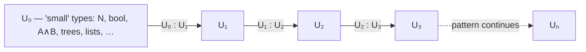
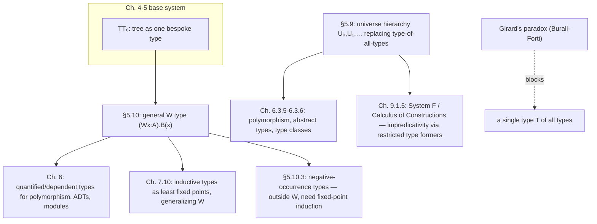

# Universes and Well-Founded Types

[[book-guidelines|↩ Back to guidelines]]

Both halves of this article are about the same underlying question: *how far can you push the expressive power of $TT_0$ before something breaks?* Universes ask how far you can push **type-level self-reference** — can a type contain itself? Well-founded types ask how far you can push **recursive data definitions** — can a constructor's arguments contain the very type being defined? In both cases the honest answer from Thompson is "further than you might first assume, but not without limit, and the limit is not arbitrary — it's exactly where consistency and normalisation would otherwise fail."

If you've used Lean, both halves will feel immediately familiar: this section *is* `Type 0 : Type 1 : Type 2 : …` and it *is* the machinery underneath Lean's `inductive` keyword and its positivity checker. That's not a coincidence worth glossing over — it's the most direct throughline in the whole book from 1991-era Martin-Löf type theory to the kernel of a proof assistant you can open today.

---

## Part I — Universes

### 1. Why blur the line between types and objects at all?

Up to this point $TT_0$ has kept a rigid caste system: there are *types* ($N$, $A \wedge B$, $I(A,a,b)$, …) and there are the *objects* that inhabit them ($0$, $(a,b)$, $r(a)$, …). A type is never itself the kind of thing you can pass around as a value.

Thompson gives three concrete reasons this distinction becomes a straitjacket (p. 174):

- **Type polymorphism.** You want to write one identity function that works for every type, not one identity function per type.
- **Abstract types.** You want to *assert the existence of* a type with certain properties, without saying which type it is — the type becomes an existentially-quantified variable.
- **Functions over "everything."** Some operations are most naturally stated as ranging over the collection of all objects of all types.

All three demands have the same shape: they need a type to itself be an object of some type, so that you can quantify over it, pass it as an argument, or existentially assert its existence. The obvious fix is to add a type $T$ of all types.

**What breaks:** Martin-Löf tried exactly this in an early version of the theory ([ML71]). Girard showed it makes the logic **inconsistent** — every proposition becomes provable ([Gir72]). The proof is the type-theoretic image of the set-theoretic **Burali-Forti paradox**: the set of all well-founded sets is a member of itself, and therefore isn't well-founded — contradiction. The type $T$ of all types has the same self-membership structure: describing what the members of $T$ are requires mentioning $T$ itself. Thompson names this the common thread with Russell's paradox too: **impredicativity** — defining a collection by quantifying over a totality that includes the thing being defined.

There's a subtlety worth sitting with: on the *programming* reading, "every proposition is provable" cashes out as "every type has an inhabitant" — which sounds unremarkable, since Miranda-style languages already give every type a bottom element. The self-reference in $T$'s definition is just general recursion in disguise, and inconsistency-as-logic becomes partiality-as-programs. The two interpretations of type theory (logic vs. programming) genuinely diverge here — one of the few places in the book where they do.

### 2. The fix: a hierarchy, not a single universe

Instead of one self-referential $T$, introduce infinitely many, indexed by rank:
$$U_0, U_1, U_2, \ldots$$
Every type is a member of *exactly one* $U_n$ — critically, **the hierarchy is not cumulative**: a type in $U_0$ is not also a member of $U_1, U_2, \ldots$ (contrast this with Lean below, where the situation is subtler). The types formed by $TT_0$'s ordinary formation rules all live in $U_0$ — hence the "$0$" in $TT_0$. Formally, Thompson reworks the rules of $TT_0$ into a new system $TT$:

- Every judgement "$A$ is a type" becomes $A : U_n$ for some specific $n$.
- A formation rule that used to read
$$\frac{A_1 \text{ is a type} \;\cdots\; A_k \text{ is a type}}{T(A_1,\ldots,A_k)\text{ is a type}} \;(TF)$$
becomes rank-tracking:
$$\frac{A_1:U_{n_1} \;\cdots\; A_k:U_{n_k}}{T(A_1,\ldots,A_k):U_{\max(n_1,\ldots,n_k)}} \;(TF)$$
- A new formation rule seeds the whole hierarchy:
$$\frac{}{U_n : U_{n+1}} \;(UF)$$

So $U_n$ is itself a well-typed object — of $U_{n+1}$, never of itself. That's the whole trick: self-reference is replaced by an infinite *ladder* of reference, each rung looking up but never sideways or down at itself. Girard's paradox needs the offending type to contain itself; the ladder structurally forbids that by construction.

Reassuringly, none of the hard-won metatheory from §5.6 is lost: **Theorem 5.36** states $TT$ is still strongly normalising, still Church–Rosser, and both convertibility and derivability of $a:A$ remain decidable — "exactly as in §5.6." Adding universes costs nothing metatheoretically, as long as you accept the hierarchy instead of the single collapsing $T$.



**Rust grounding:** Rust simply has no analogue of this problem, and it's instructive to see *why not*. Rust types don't inhabit other types the way $TT$ objects inhabit $U_n$ — there's no `type` that is itself a first-class value you compute with, so there's no possibility of a type containing itself as a value and no Burali-Forti-shaped trap to fall into. Rust generics (`fn identity<T>(x: T) -> T`) give you polymorphism without ever needing a universe of types to quantify over — the compiler erases `T` at monomorphization time rather than treating it as run-time data. This is the real cost/benefit trade Thompson is implicitly setting up: $TT$ pays for treating types as first-class objects (which buys dependent types, abstract-type existentials, and provable properties of type-indexed families) by needing to manage a universe hierarchy; Rust never pays that price because it never buys that power.

**Lean grounding (primary here — this is exactly Lean's own machinery):** Lean's `Sort u` hierarchy — with `Type u := Sort (u+1)` — *is* Thompson's $U_n$, renamed and with one refinement: Lean also has `Prop = Sort 0`, an impredicative universe of propositions sitting below `Type 0 = Sort 1`. `Type 0 : Type 1 : Type 2 : …` is a direct transliteration of $(UF)$. Where Lean genuinely departs from Thompson's system is **cumulativity**: Lean 4's structures and certain universe-polymorphic definitions support definitional cumulativity (a `Type 0` value can be used where a `Type 1` value is expected without explicit lifting in many contexts, and universe *variables* `u` let one definition work uniformly at every level via `.{u}` annotations — e.g. `def id.{u} {α : Sort u} (a : α) : α := a`). Thompson's $TT$ is deliberately **not** cumulative — that's a design choice, not an oversight, and it's worth noticing that Lean made the opposite choice for ergonomic reasons (so you don't need infinitely many copies of `List`, one per universe level). Both choices are metatheoretically safe; they're different answers to the same design fork this section opens.

### 3. Type families defined by case analysis into a universe (§5.9.1)

Once $U_0$ is a type like any other, you can write ordinary case-analysis terms that *return* a type in $U_0$. Thompson's example:
$$x:\text{bool}\quad \bot:U_0 \quad \top:U_0 \;\;\Rightarrow\;\; (\text{if } x \text{ then } \bot \text{ else } \top) : U_0$$
Call this term $B$. It's a genuine *type family* indexed by a boolean, with
$$B(\text{True}) \twoheadrightarrow \bot \qquad B(\text{False}) \twoheadrightarrow \top$$
This is a more direct way of getting a type family than the mechanism given earlier in §4.10.3 — you're just writing an ordinary program whose codomain happens to be $U_0$.

This machinery immediately buys something $TT_0$ couldn't prove: **Theorem 5.37**, $\neg(\text{True} =_{\text{bool}} \text{False})$. The proof applies $\lambda x.(\text{if }x\text{ then }\bot\text{ else }\top)$ to both sides of a hypothesized proof $p : \text{True}=_{\text{bool}}\text{False}$, producing $p' : \bot =_{U_0} \top$; substituting $\bot$ for $\top$ in $\text{Triv}:\top$ then yields $\text{Triv}:\bot$ — an inhabitant of the empty type, which after discharging the assumption gives $\neg(\text{True}=_{\text{bool}}\text{False})$. Smith showed this specific fact is *not* derivable in (an extension of) $TT_0$ — it genuinely needs the universe.

**Rust/Lean grounding:** This is precisely how you'd write a type-level boolean-indexed match in Lean — `match x with | true => Empty | false => Unit` used as a *type*, not a value, exploiting that Lean's `match` can return `Sort u`. It's also exactly the technique behind "type-level programming" tricks in Rust via associated types (`type Output;` in a trait, selected by an implementation), except Rust's version is checked structurally by trait resolution rather than by reduction to a value in a universe — a shallower, non-dependent shadow of the same idea.

### 4. Quantifying over universes: parametric polymorphism and abstract types (§5.9.2)

Now that $U_0$ is an object, you can $\forall$-quantify over it. Compare the old, informal derivation of the polymorphic identity function against the new, formal one:
$$\lambda A^{U_0}.\lambda x^A.x \;:\; (\forall A:U_0).(A\Rightarrow A)$$
The premise "$A$ is a type," previously an informal assumption, is now the *formal, dischargeable* assumption $A:U_0$. Applying this term to a concrete type computes exactly what you'd expect:
$$(\lambda A^{U_0}.\lambda x^A.x)\,N \twoheadrightarrow \lambda x^N.x \;:\; (N\Rightarrow N)$$
This gives genuine parametric polymorphism — one definition, uniform over every "small" type (Thompson's name for members of $U_0$).

The same quantification gives **abstract types**. Consider $(\exists A:U_0).P(A)$: its inhabitants are pairs $(A,p)$ where $A:U_0$ and $p:P(A)$ — a type together with a proof it has property $P$. If $P(A) \equiv (A\Rightarrow A)\wedge(A\Rightarrow A)$, an inhabitant is a type paired with two self-maps — exactly a Miranda `abstype A with f1 :: A -> A; f2 :: A -> A`. The existential *hides* which concrete type was chosen; you only get to use it through the operations packaged alongside it.

**Rust grounding (primary — this is a `trait` object almost verbatim):** $(\exists A:U_0).P(A)$ is a **trait with existential** packaging — closest to `dyn Trait` or an opaque `impl Trait` return type:
```rust
trait HasSelfMaps {
    fn f1(self) -> Self;
    fn f2(self) -> Self;
}
// (∃A:U₀).((A⇒A) ∧ (A⇒A)), packaged as a trait object:
struct AbstractPair {
    f1: Box<dyn Fn(i64) -> i64>,
    f2: Box<dyn Fn(i64) -> i64>,
}
```
And the universal $(\forall A:U_0).(A\Rightarrow A)$ is exactly a generic function:
```rust
fn identity<A>(x: A) -> A { x }
```
The parallel is close enough to be genuinely useful, but notice the asymmetry the rest of §5.9 is about to exploit: Rust's `identity<A>` *cannot* inspect `A` at all (no specialization in stable Rust) — it is *forced* to be parametric. $TT$'s $(\forall A:U_0).(A\Rightarrow A)$ has the same type but, as §5.9.3 shows, does *not* force parametricity. That gap is the whole content of the next subsection.

**Lean grounding:** `def id {α : Type u} (a : α) : α := a` is the literal translation of $\lambda A^{U_0}.\lambda x^A.x : (\forall A:U_0).(A\Rightarrow A)$ — right down to the type argument becoming an explicit universe-quantified premise. Lean's `Σ`-types / structures with a `Type`-valued field (`structure Abstract where A : Type; f1 : A → A; f2 : A → A`) give you the existential-as-abstract-type reading directly, and this is in fact how you'd model a module signature in Lean.

### 5. Closure axioms and parametricity (§5.9.3)

Every type former in $TT_0$ comes with two kinds of rule playing different roles: the **introduction rule** says what counts as a way of building an element; the **elimination and computation rules** — which Thompson calls the **closure axioms** — say these introduced elements are the *only* elements, licensing proof by induction and definition by recursion over the type.

The rules given for $U_n$ so far are introduction-only: $(UF)$ tells you $U_n:U_{n+1}$, but nothing tells you $U_n$'s elements are *only* the things built by the formation rules — there's no closure axiom for "recursion over the universe itself." Martin-Löf omitted this **deliberately**: he wants the universes to stay *open-ended*, so future extensions to the theory (new type formers) don't retroactively violate a closure axiom that assumed a fixed, closed set of ways to build a type.

**What breaks without closure axioms — or rather, what becomes *possible* — is a loss of parametricity.** With closure axioms you *could* define a function that case-analyzes on which type it was handed — e.g. the identity function everywhere except at $N$, where it applies `succ` instead. Such a function still has type $(\forall A:U_0).(A\Rightarrow A)$, exactly like the genuinely-parametric identity function — but unlike the identity function, its definition inspects the type argument, rather than treating $A$ as an opaque parameter it simply threads through. The type alone no longer tells you the function is parametric.

**Rust grounding:** This is precisely what `std::any::Any` and downcasting let you do — break parametricity by inspecting a type at runtime via `TypeId`:
```rust
fn weird<A: 'static>(x: A) -> A {
    use std::any::Any;
    let boxed: Box<dyn Any> = Box::new(x);
    if let Some(n) = boxed.downcast_ref::<i64>() {
        // inspect the type and behave differently for i64
        *Box::<dyn Any>::downcast::<i64>(boxed).unwrap()
    } else {
        *boxed.downcast::<A>().unwrap()
    }
}
```
Ordinary generic Rust functions *can't* do this (no `Any` bound, no specialization) — which is exactly why Rust's plain generics enjoy the free theorems Reynolds proved for System F's parametric polymorphism, while `TT`'s universe-quantified functions don't automatically enjoy them once closure axioms are present. **This connects directly to the unification work in the elaborator project**: a metavariable solver that assumes parametricity (e.g. to justify unifying `∀A. A → A` against a rigid shape without inspecting `A`) is implicitly relying on the *absence* of closure-axiom-style case analysis — Thompson's closure axioms are the formal knob that turns that assumption on or off.

### 6. Transfinite extensions, briefly (§5.9.4)

Even the countable ladder $U_0, U_1, \ldots$ has a function that escapes it: $(\lambda n:N).U_n$ inhabits none of the $U_n$, since its "type" would have to be bigger than every rung it names. Fixing this needs a first *transfinite* universe $U_\omega$ (itself in $U_{\omega+1}$), iterating through the constructive ordinals — whether this is useful is, in Thompson's words, "open to question." He also flags two related dead ends: distinguishing propositions from sets and adding a type of propositions was shown inconsistent by Jacobs; but *restricting the type-forming operations* while keeping a type of types can be done consistently — this is exactly Girard's System F and Coquand–Huet's Calculus of Constructions, discussed later in §9.1.5. Worth remembering the shape of that trade: you can have impredicativity back, but only by giving up some type formers, not by keeping everything and adding a universe on top.

---

## Part II — Well-Founded Types

### 7. From `tree` to a general pattern

Chapter 4 introduced algebraic types by giving direct formation/introduction/elimination/computation rules for one specific type, `tree`. Thompson now asks: what's common to *any* such definition, so that we get lists, trees, and everything similar "for free" from one general schema instead of writing four rules per type?

### 8. Lists as the worked example (§5.10.1)

A list is empty, $[\,]$, or a head-tail pair $(a::x)$ ("cons"). Thompson gives the full rule set — note the mirrored four-rule shape from every earlier type former:

**Formation:** $\dfrac{A\text{ is a type}}{[A]\text{ is a type}}$

**Introduction:** $\dfrac{}{[\,]:[A]} \qquad \dfrac{a:A \quad l:[A]}{(a::l):[A]}$

**Elimination:**
$$\frac{l:[A]\quad s:C[[\,]/x]\quad f:(\forall a:A).(\forall l:[A]).(C[l/x]\Rightarrow C[(a::l)/x])}{lrec\; l\; s\; f : C[l/x]}$$

**Computation:** $lrec\;[\,]\;s\;f \to s \qquad lrec\;(a::l)\;s\;f \to f\;a\;l\;(lrec\;l\;s\;f)$

Functions defined via the elimination rule are called **primitive recursive** — the recursive call is only ever made on immediate structural sub-parts.

### 9. The general case: the $W$ type (§5.10.2)

The generalising insight: think of *every* element of an algebraic type as a tree. A node is built from a **sort** (which constructor was used) together with a collection of **predecessors** (the immediate recursive arguments) of the *same type*. Two pieces of data determine the whole family:

- $A$ — the type of node sorts. For `tree`, $A \equiv_{df} (\top \vee N)$: the `Null` sort (no data) or a `Bnode` sort carrying a number.
- $B(a)$ — for each sort $a:A$, the type of *names* of that sort's predecessor slots. For `tree`: $B(\text{null}) \equiv_{df} \bot$ (no predecessors) and $B(\text{bnode}\;n) \equiv_{df} N_2$ (exactly two predecessors, indexed by the two-element type). Defining $B$ this way by case analysis is itself an instance of §5.9.1's type-family trick — it needs $U_0$.

Given $A$ and $B$, the type they determine is written $(Wx:A).B(x)$ — "$W$" for well-founded.

**Formation:** $\dfrac{A\text{ is a type} \quad [x:A]\;\vdots\; B(x)\text{ is a type}}{(Wx:A).B(x)\text{ is a type}}$

**Introduction:** a node is a chosen sort together with a function naming its predecessors:
$$\frac{a:A\quad f:(B(a)\Rightarrow (Wx:A).B(x))}{\text{node}\;a\;f : (Wx:A).B(x)}$$
For `tree`'s `Null`: choose $a\equiv\text{null}$, and since $B(\text{null})=\bot$, the unique predecessor function is $\text{efun}\equiv_{df}\lambda x.\text{abort}_T\,x$ (there's nothing to map, vacuously). This gives $\text{node}\;\text{null}\;\text{efun}$ as the `Null` node. For a `Bnode n u v`, take $a\equiv(\text{bnode}\;n)$ and $f_{u,v}\equiv_{df}\lambda x.(\text{cases}_2\,x\,u\,v):(N_2\Rightarrow\text{tree})$, giving $\text{node}\;(\text{bnode}\;n)\;f_{u,v}$.

**Elimination** is induction: to prove $C(\text{node}\;a\;f)$ from proofs of $C(p)$ for every predecessor $p$ of the node, package the inductive hypothesis as $(\forall y:B(a)).C(f\,y)$, then parametrize over $a$ and $f$ to get the general proof-transformer type, abbreviated $\text{Ind}(A,B,C)$:
$$(\forall a:A)(\forall f:(B(a)\Rightarrow(Wx:A).B(x)))\;((\forall y:B(a))\,C(f\,y)\Rightarrow C(\text{node}\;a\;f))$$
$$\frac{w:(Wx:A).B(x)\quad R:\text{Ind}(A,B,C)}{(\text{Rec}\;w\;R):C(w)}$$

**Computation:** $\text{Rec}\;(\text{node}\;a\;f)\;R \to R\;a\;f\;(\lambda x.\text{Rec}\;(f\,x)\,R)$ — the recursive call is applied to *every* predecessor, uniformly, via $f$.

Instantiating this general schema at `tree`'s $A$ and $B$ reproduces `tree`'s own elimination and computation rules exactly (Thompson works through both the `Null` and `Bnode` cases explicitly) — confirming the $W$ type really is the right generalisation, not just an analogous-looking one. He also introduces **extensional isomorphism** (Definition 5.38: types $A,B$ related by $f:A\Rightarrow B$, $g:B\Rightarrow A$ with $g(fx)\simeq x$ and $f(gy)\simeq y$) as the precise sense in which `tree`'s bespoke rules and the $W$-type-derived rules "are the same" — and notes the argument leans on *extensional* equality of functions (needed to show there's a unique map out of $\bot$), a nice callback to §5.8's whole apparatus. **Theorem 5.40**: the system $TT^+$ (full $W$-types) is still strongly normalising, Church–Rosser, and decidable — same metatheoretic "no cost" story as universes.

```
       A  = type of node sorts (Null | Bnode n)
       B(a) = type naming a's predecessor slots

   node (bnode 3) f          <- a = bnode 3, B(a) = N₂ = {Left,Right}
        /        \
   f(Left)      f(Right)
       |            |
  node null      node (bnode 0) f'
    efun            /        \
              f'(Left)     f'(Right)
                 |             |
            node null      node null
              efun            efun

   ( represents Bnode 3 Null (Bnode 0 Null Null), Fig. 5.2 )
```

**Lean grounding (primary — this *is* the theoretical foundation of Lean's `inductive`):** The $W$ type is the textbook device for reducing "arbitrary strictly-positive inductive type" to a single primitive, and it is the standard model used to justify that Lean's/Coq's kernel-level positivity checker is *sound*. When you write
```lean
inductive Tree where
  | null : Tree
  | bnode : Nat → Tree → Tree → Tree
```
the elaborator is (conceptually) picking $A \equiv \text{Unit} \oplus \text{Nat}$ and $B(\text{null}) \equiv \text{Empty}$, $B(\text{bnode}\;n) \equiv \text{Bool}$ (a two-element predecessor-name type, exactly Thompson's $N_2$), and the generated `Tree.rec` recursor is $\text{Rec}$ specialized to that $A,B$ — with the same "apply the motive to every predecessor uniformly" computation rule. This is worth internalizing precisely because it means you already understand, at the semantic level, *why* Lean's positivity checker exists and what it's protecting: it's checking that your `inductive` declaration is expressible as *some* $(Wx:A).B(x)$ at all.

**Rust grounding:** the direct transliteration is a recursive `enum` with boxed recursive fields:
```rust
enum Tree {
    Null,
    Bnode(i64, Box<Tree>, Box<Tree>),
}
// Rec / lrec, as a fold:
fn rec<C>(t: &Tree, on_null: &C, on_bnode: &dyn Fn(i64, C, C) -> C) -> C
where C: Clone {
    match t {
        Tree::Null => on_null.clone(),
        Tree::Bnode(n, u, v) => on_bnode(*n, rec(u, on_null, on_bnode), rec(v, on_null, on_bnode)),
    }
}
```
Rust's `Box` is doing something superficially similar to $W$'s predecessor function $f$ — both exist to make an otherwise self-referential, unbounded-size definition well-formed — but the reasons are different and worth keeping straight: Rust needs `Box` because a value's *stack size* must be statically known and a naive recursive `enum` would be infinite; $TT$ needs the $(Wx:A).B(x))$ construction because it needs the recursion to bottom out *provably*, for normalisation and consistency, not for memory layout. Same syntactic symptom (indirection required), different underlying reason.

### 10. Algebraic types compared to Miranda's, and where $W$ stops (§5.10.3)

Two genuine strengths of the $W$-type presentation, per Thompson: it needs no named constructors (everything is `node a f`, uniformly), and — because nothing forces $B(a)$ to be *finite* — it generalizes finite algebraic types to **infinitely branching trees**. This gets you the countable ordinals as a genuine well-founded type, matching Miranda's own
```
ordinal ::= Zero | Succ ordinal | Limit (nat -> ordinal)
```
where the `Limit` constructor's predecessor family is indexed by the *infinite* type `nat` — exactly a $W$-type with $B(\text{limit}) \equiv N$.

But Miranda's algebraic type mechanism goes further than $W$ can follow. Two escapes:

- **Mutually recursive types** — fine; these reduce to a $W$-type over a sum, projecting out the component of interest.
- **Negative-occurrence types** — genuinely fine in Miranda, genuinely *not* representable as a $W$-type:
```
model ::= Atom nat | Function (model -> model)
```
Here `model` appears in the *domain* position of a function space that is itself an argument to a constructor — a model of the untyped $\lambda$-calculus, essentially (every "function" is itself a `model`, so you can apply a `model` to a `model`). Thompson names the precise criterion: an occurrence's **polarity** flips every time you cross into the domain position of a function-space constructor; recursively-negative occurrences are the ones $W$-types can't express, and are exactly the ones that break well-foundedness (there's no bound on how deep you can descend through `Function`/`Atom` alternations before hitting bottom — reasoning about such types needs **fixed-point induction** instead of structural induction).

**This is precisely the positivity restriction implemented by real proof assistants**, and worth naming explicitly. Lean rejects
```lean
inductive Model where
  | atom : Nat → Model
  | func : (Model → Model) → Model  -- error: non-positive occurrence
```
with exactly the diagnosis Thompson gives 30-odd years earlier: `Model` occurs negatively (in `Model → Model`'s domain) inside a constructor argument. **This is the single cleanest bridge in this section to the compiler/verifier project**: any inductive-type checker you build needs this same polarity-tracking positivity pass, and Thompson's informal description ("the polarity of an occurrence is reversed, recursively, for an occurrence in the domain position of a function space constructor") is close to pseudocode for it.

**Rust grounding, as a contrast, not an analogy:** Rust happily accepts the direct transliteration of `model` —
```rust
enum Model {
    Atom(i64),
    Function(Box<dyn Fn(Model) -> Model>),
}
```
— because Rust's type checker enforces no positivity discipline at all; it only needs the recursion boxed for size purposes, and has no consistency property to protect (there is no "every `Model` is provably well-founded" theorem Rust is relying on). This is the clearest illustration in the whole topic of the difference in what the two systems are *for*: Rust's checker guards memory safety and layout; $TT$'s positivity restriction guards logical consistency and normalisation. The same-looking definition is legal in one and rejected in the other for reasons that don't even overlap.

---

## Synthesis



Both halves of this topic are the book's clearest demonstration of its recurring moral (stated explicitly in Ch. 7's closing remarks): every extension of the base system is purchased at a price, and the price is worth knowing precisely rather than gesturing at. Universes buy type polymorphism and abstract types at the cost of an infinite, non-cumulative hierarchy instead of one convenient $T$; $W$-types buy a uniform account of recursive data at the cost of excluding negative-occurrence types, which need separate (fixed-point-induction) machinery entirely, picked up again properly in §7.10–7.11's treatment of inductive and co-inductive types as fixed points.

For the standing project: **§5.9 is a direct model of Lean's `Sort u`/`Type u` hierarchy** — the identity-function derivation in §5.9.2 is, almost token-for-token, `id.{u} {α : Sort u} (a : α) : α := a`, and §5.9.3's closure-axiom discussion is the formal reason a parametricity-exploiting unifier can trust a universe-quantified metavariable's type without inspecting it — right up until a closure axiom (or a Rust-style `Any` downcast) is available, at which point that trust is no longer sound. **§5.10 is the theoretical backbone for any inductive-type checker you build**: the $W$-type formation rule is the abstract template every concrete `inductive` declaration must be checkable against, and §5.10.3's polarity/positivity criterion is precisely the pass a Rust-hosted verifier would need to implement before accepting user-defined recursive types as logically sound rather than merely memory-safe.
