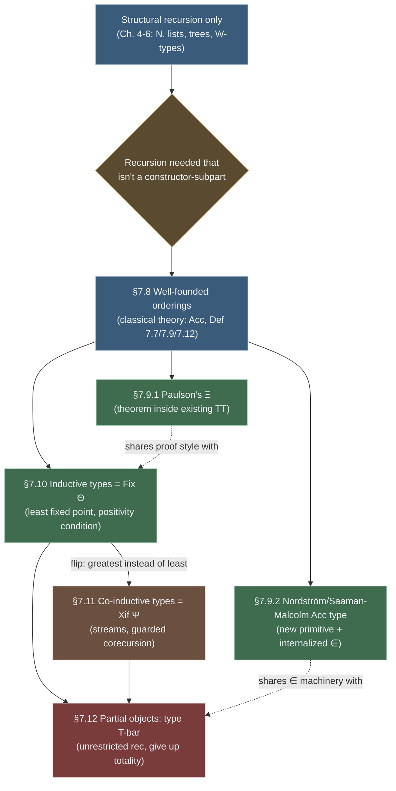

# Well-Founded and General Recursion

[[book-guidelines|↩ Back to guidelines]]

## Why structural recursion isn't enough

Every recursion you've written in $TT$ up to this point in the book — `Prec` on $N$, primitive recursion on lists, structural recursion on trees via the $W$-type — has the same shape: you're allowed to call the function on a syntactic *subpart* of the argument you were given. A `Bnode n u v` may recurse into `u` and `v` because they are literally smaller pieces of the tree sitting above the line in its own introduction rule. This is safe by construction: the elimination rule for an inductively-generated type only ever hands you recursive calls on immediate constituents, so termination is baked into the shape of the rule itself, not argued for separately.

But plenty of natural recursive definitions don't decompose this way. Consider

$$pow\; n \equiv_{df} \begin{cases} 1 & n = 0 \\ (pow\;(n\;div\;2))^2 * 2^{(n\;mod\;2)} & n > 0 \end{cases}$$

`n div 2` is not a constructor-subpart of `n` — $N$'s introduction rule only lets you peel off one `succ` at a time, not jump straight to half the value. Yet the recursion is obviously terminating: `n div 2 < n`. What's missing from the type theory as built so far is a general theory of *when* a recursive definition is legitimate, one that doesn't reduce to "is it structural in the $W$-type sense." That's what §§7.8–7.9 supply: a purely order-theoretic account of legitimate recursion, plus two competing proposals for internalizing it inside $TT$.

Sections 7.10–7.12 then generalize in three more directions. §7.10 asks: instead of adding a bespoke recursion principle for *this* type, can we characterize *any* inductively-defined type — the type itself, not just functions over it — as the smallest solution of a defining equation, and derive its introduction/elimination rules mechanically? §7.11 flips that construction upside down to get infinite structures (streams) without sacrificing totality. §7.12 asks what happens if you give up on totality altogether and add genuinely non-terminating computations as first-class citizens — can you do that without collapsing the logic into inconsistency?

The throughline across all four sections is the tension the whole chapter is built around: type theory's usefulness as a *logic* depends on every proof term denoting a total, terminating object (otherwise every proposition has a proof — take the proof to be $\uparrow$, the undefined term, and everything is "provable"). Each of these four extensions is a different strategy for pushing the boundary of what counts as "legitimately total" outward, and each one is evaluated in the book by what it costs against that constraint.

---

## §7.8 — Well-founded orderings, in the language of naive set theory

Thompson deliberately introduces this section's ideas classically, in set-theoretic language, before touching type theory at all — the point is to nail down *what property of an ordering* makes recursion over it valid, independently of any particular formal system.

**Partial order (Definition 7.6).** A relation $\prec$ is a partial order if it's irreflexive ($x \not\prec x$) and transitive ($x \prec y \wedge y \prec z \Rightarrow x \prec z$). Read $x \prec y$ as "$x$ is simpler than $y$."

Irreflexivity plus transitivity rules out cycles, but *not* infinite descent. The book's canonical counterexample: define $n \prec m \equiv_{df} m < n$ on $N$ — i.e. $\prec$ is just $>$. This is a perfectly good partial order (no cycles), yet

$$\ldots n+1 \prec n \prec \ldots \prec 1 \prec 0$$

descends forever. Try to define $f$ by "recursion" over it:

$$f\;n \equiv_{df} f\;(n+1) - 1$$

Every function $f_k\;n \equiv_{df} n + k$ satisfies this equation — the recursion never bottoms out at a base case, so it pins down no unique function at all. This is the concrete failure mode the rest of §7.8 exists to rule out: a partial order alone doesn't make recursion well-defined; what's missing is a guarantee that every descending chain terminates.

**Well-foundedness (Definition 7.7).** $\prec$ is well-founded iff there is no infinite descending chain $\ldots x_{n+1} \prec x_n \prec \ldots \prec x_1 \prec x_0$.

This is exactly the property $>$ on $N$ lacks and $<$ on $N$ has. But "no infinite chain exists" is a statement about *all* sequences, which is awkward to work with directly, especially constructively. Thompson gives a classically-equivalent but constructively-friendlier characterization:

**Theorem 7.8.** $\prec$ is well-founded iff for every set $z$,

$$\forall x\,(\forall y\,(y \prec x \Rightarrow y \in z) \Rightarrow x \in z) \Rightarrow \forall x\,(x \in z) \tag{7.15}$$

Read operationally: if membership in $z$ can be established for $x$ purely from membership-in-$z$ of everything strictly below $x$, then everything is in $z$. Setting $z \equiv_{df} \{y \in A \mid P(y)\}$ turns (7.15) directly into a proof rule — this *is* induction over $\prec$:

$$\dfrac{\forall x\,(\forall y\,(y \prec x \Rightarrow P(y)) \Rightarrow P(x))}{\forall x\,P(x)}$$

**The accessible part (Definition 7.9).** Every partial order, well-founded or not, has a well-founded core: $Acc(A,\prec)$, the set of elements from which no infinite descending chain starts. Theorem 7.10 characterizes it order-theoretically (not just via chains): $Acc(A,\prec)$ is the *smallest* $z \subseteq A$ closed under "$(\forall y \prec x.\,y \in z) \Rightarrow x \in z$." This matters because it decouples two separate jobs: you can define recursion over the well-founded part of an ordering that *isn't* globally well-founded, provided the arguments you actually care about happen to lie in $Acc$.

**Well-founded recursion (Definition 7.12).** $f$ is defined by well-founded recursion over $\prec$ if it has the shape

$$f\;a \equiv_{df} \ldots f\;a_1 \ldots f\;a_n \ldots \quad \text{where each } a_i \prec a \tag{7.16}$$

`pow` above is exactly this pattern with $\prec\; = \;<$ on $N$. The book then gives the *general* formal version — course-of-values recursion over an arbitrary well-founded order, not just $N$: writing $f{\downarrow}a$ for $f$ restricted to $\{y \mid y \prec a\}$, a recursion is really a function $F$ satisfying

$$F(f{\downarrow}a)\;a = f\;a \tag{7.17}$$

**Theorem 7.13** — every such $F$ has a unique solution, proved by induction over $\prec$. This is the formal payoff of the whole section: well-foundedness, not mere structural descent, is *precisely* the condition under which recursive equations pin down a unique function.

**How rich is the supply of well-founded orderings?** Surprisingly rich — the book lists closure properties that let you build new ones from old:
- Every type with a $W$-type-style recursion operator ($N$, lists, trees, general $W$-types) carries a canonical well-founded order, read directly off its introduction rules: the immediate-predecessor relation $\prec_1$ (e.g. $u \prec_1 (Bnode\;n\;u\;v)$, $v \prec_1 (Bnode\;n\;u\;v)$), whose transitive closure is $\prec$.
- **Inverse image**: if $\prec'$ is well-founded on $B$ and $f : A \Rightarrow B$, then $a \prec a' \equiv_{df} f\,a \prec' f\,a'$ is well-founded on $A$. (E.g. ordering lists by length via $\#$.)
- **Sub-orderings** of well-founded orderings are well-founded.
- **Products**: componentwise, lexicographic (dictionary order), and disjoint-sum orderings on $A \times B$ / $A \vee B$ are all well-founded when their components are.

The inverse-image construction is the workhorse — it's how you show almost any "obviously terminating" custom measure (list length, tree height, a hand-rolled potential function) is well-founded, by reducing it to $<$ on $N$.

### Grounding: well-founded recursion as a termination checker

If you've worked on a proof assistant or dependently-typed language, this is *exactly* the machinery behind `decreasing_by` / termination metrics. Lean's equation compiler, when it can't see structural recursion, asks you to supply a well-founded relation and a proof that each recursive call decreases under it — this is Definition 7.12 made executable:

```
def pow : Nat → Nat → Nat
  | _, 0 => 1
  | b, n+1 => pow b n * b   -- structural, fine
```
versus the div-by-2 case, which needs an explicit measure:
```
def powFast (b n : Nat) : Nat :=
  if n = 0 then 1
  else
    let r := powFast b (n / 2)
    if n % 2 == 0 then r * r else r * r * b
termination_by n
decreasing_by simp_wf; omega   -- discharges n / 2 < n
```
`termination_by n` names the measure; Lean needs to prove `n / 2 < n` — precisely the inverse-image construction: `WellFoundedRelation` on `Nat` via `<`, pulled back along the measure function. Rust has no built-in analogue (it doesn't check totality at all — `fn pow(n: u64)` recursing on `n / 2` just compiles, and the compiler trusts you), which is exactly the point of contrast the book is making in §7.9: type theory as a *logic* cannot afford Rust's laissez-faire attitude, because a non-terminating "proof" would make the system inconsistent. Building a verifier means Definition 7.12 plus Theorem 7.13 is *the* termination-checking algorithm you'll eventually implement — decreasing-measure discharge is not incidental machinery, it's the mechanism itself.

---

## §7.9 — Internalizing well-founded recursion inside $TT$

Section 7.8 was scaffolding in naive set theory. Now: how do you actually add well-founded recursion *as a rule of $TT$*? Two incompatible proposals.

### 7.9.1 — Paulson's operator $\Xi$: no new primitives, just a derived theorem

The idea: translate (7.15) into type theory directly and show the *existing* rules of $TT$ already prove it for every well-founded ordering of interest — no new formation/introduction/elimination rules needed at all.

"For all sets $z$" becomes "for all predicates $P : A \Rightarrow U_0$" (restricting to small predicates), and $\prec$ becomes a relation $A \Rightarrow A \Rightarrow U_0$. Definition 7.14: $\prec$ is well-founded in $TT$ iff the type

$$(\forall P : A \Rightarrow U_0).\big((\forall x:A).((\forall y:A).(y \prec x \Rightarrow P\,y) \Rightarrow P\,x) \Rightarrow (\forall x:A).(P\,x)\big) \tag{7.19}$$

is *inhabited* — by an object $\Xi$ satisfying the recursion equation

$$\Xi\,P\,F\,x = F\,(\lambda y.\lambda r.(\Xi\,P\,F\,y)) \tag{7.20}$$

Unpack this carefully, because it's doing two jobs at once. The bare inhabitedness of (7.19) already gives you *induction* over $\prec$ — an object of the premise type is a step-function $F$ turning "$P$ holds on all predecessors of $x$" into "$P$ holds at $x$"; applying $\Xi$ to it yields a proof of $\forall x.P\,x$. Equation (7.20) is the extra clause that upgrades this from mere induction to genuine *recursion*: the value $\Xi\,P\,F\,x$ unfolds by applying $F$ to the function $\lambda y.\lambda r.(\Xi\,P\,F\,y)$ — i.e., to the recursively-computed values at every predecessor $y$, with $r$ standing for the proof witness $y \prec x$. This is course-of-values recursion again, but generalized: instead of a list of prior values (as in §6.1.1's `power`), the "prior values" are packaged as a *function* from predecessors to results.

The book proves $\Xi$ exists concretely for one non-trivial case: **Theorem 7.15**, the inverse-image construction from §7.8 is well-founded in $TT$'s sense too. The proof is a genuine exercise in higher-order proof construction — given $\Xi'$ witnessing well-foundedness of $\prec'$ on $B$ and $f : A \Rightarrow B$, you build $\Xi$ for the pullback order $y \prec x \equiv_{df} f\,y \prec' f\,x$ by defining $P'\,x' \equiv_{df} (\forall x:A).(f\,x = x' \Rightarrow P\,x)$ — i.e., "$P$ holds on the whole fiber over $x'$" — and discharging $\Xi\,P\,F \equiv_{df} \Xi'\,P'\,F'$. Every construction from §7.8's closure list (products, lexicographic order, sub-orderings) can in principle be discharged the same way, purely as *theorems of $TT_0$*, with no change to the rule system. **Theorem 7.16** caps this off: an ordering is well-founded exactly when it's the inverse image, under some function into a $W$-type, of that $W$-type's canonical ordering — so $W$-types plus inverse images already exhaust the well-founded orderings, in principle.

The cost of Paulson's approach: nothing structural, but you *re-derive* $\Xi$ for every new ordering by hand, unless you package the closure lemmas as reusable library theorems (which the book notes is exactly the "useful modularity" this approach buys you over chapter 6's ad hoc constructions).

### 7.9.2 — Nordström / Saaman–Malcolm: a new primitive type `Acc`

The competing proposal (Nordström 1988, developed by Saaman & Malcolm) doesn't try to prove well-foundedness inside existing $TT$ — it adds `Acc(A,\prec)` as a genuinely new type former, with its own four rules:

**Formation:**
$$\dfrac{A\text{ is a type}\quad [x:A,y:A] \vdash (x \prec y)\text{ is a type}}{Acc(A,\prec)\text{ is a type}} \quad (AccF)$$

**Introduction:**
$$\dfrac{a:A \quad [y:A,\,y\prec a] \vdash y : Acc(A,\prec)}{a : Acc(A,\prec)} \quad (AccI)$$

**Elimination:**
$$\dfrac{p:Acc(A,\prec) \quad [x:Acc(A,\prec),\,[z:A,z\prec x] \vdash (f\,z):C(z)] \vdash (e\,x\,f):C(x)}{rec\;e\;p : C(p)} \quad (AccE)$$

**Computation:** $rec\;e\;p \to e\;p\;(rec\;e)$.

The elimination rule reads much like $(AccF)$'s style — the second premise is itself hypothetical, exactly like the well-founded-recursion pattern of §7.9.1: $f$ gives you the values at all predecessors $z$ of $x$, and $e$ combines them into the value at $x$.

But $(AccI)$ deserves the scrutiny the book gives it: as written, it asks you to *derive a proof term* $y : Acc(A,\prec)$ from the bare assumptions $y:A,\;y\prec a$ — which is a strange thing to demand, since accessibility of $y$ isn't generally derivable from typing facts alone. What's actually meant is the *proposition* "$y \in Acc(A,\prec)$," not the judgement "$y$ has type $Acc(A,\prec)$." To make this precise, Saaman & Malcolm had to internalize the membership relation $\in$ itself as a new judgement form, parallel to how the identity type $=$ internalizes propositional equality:

$$\dfrac{b:B}{el:(b \in B)}\;(\in I) \qquad\qquad \dfrac{c:(b\in B)}{b:B}\;(\in E)$$

This is a genuinely different move from Paulson's: instead of well-foundedness being a *theorem* provable of specific orderings, `Acc` makes it a *type*, and any relation is well-founded on exactly its accessible elements — you can even work with orderings that *aren't* globally well-founded, as long as your arguments of interest live in `Acc`. Saaman & Malcolm use exactly this to construct unbounded linear search — $(\forall f:\{f\mid \exists x:N.\,f\,x=0\}).(\exists x:N).(f\,x=0)$ — over the ordering $m \prec n \equiv_{df} m > n$, well-founded not on all of $N$ but on $\{n:N \mid \forall m<n.\,f\,m \ne 0\}$, the set of "search hasn't yet found a zero below here" indices.

**§7.9.3 Conclusions — Thompson's own verdict.** Paulson's approach adds *no new rules*, gains modularity over one-off derivations, but leaves you re-deriving well-foundedness (via $\Xi$) per ordering, with unwieldy proof terms. Saaman–Malcolm's `Acc`-with-`∈` is more expressive — it directly licenses the root-finding example that stumps the naive approach — but the new `∈` judgement has "uncertain effect" on the system's metatheoretic properties (does it preserve strong normalisation? decidability?), which is unresolved in the source Thompson is drawing from. This is the recurring cost/benefit pattern of the whole chapter: expressiveness bought against unproven (or lost) metatheory.

### Grounding: $\Xi$/`Acc` versus a checker's well-founded-recursion pass

For the Rust-verifier project, `Acc` is the more directly implementable shape: it's essentially the accessibility predicate that termination checkers (Agda's, Lean's `WellFounded.fix`) build internally. `Acc` corresponds almost literally to:

```rust
enum Acc<A, R> {
    Intro(A, Box<dyn Fn(A) -> Acc<A, R>>),  // proof that every predecessor is itself accessible
}
```
and `WellFounded.fix` in Lean is precisely `(AccE)` specialized: given `h : Acc r x` and a step function that computes `C x` from `C`-values at all `r`-predecessors, produce a `C x`. If you're implementing a termination-checker pass in your verifier, this is the datatype to reach for — you don't need Paulson's re-derive-per-ordering style; you build one `Acc` well-foundedness proof per base relation (e.g. `<` on `usize`), then get every derived measure via a pullback/inverse-image lemma, exactly Theorem 7.15's construction.

---

## §7.10 — Inductive types as least fixed points

Zoom out. Everything so far has been about legitimizing recursive *functions*. §7.10 asks a related but distinct question: can we characterize an entire recursively-generated *type* — lists, trees, anything built by constructors — uniformly, as the solution of a fixed-point equation, rather than bespoke-defining each one via $W$-types by hand?

**The motivating example.** An informal definition of lists of naturals: "$[\,]$ is a list; if $n$ is a number and $x$ a list, then $(n :: x)$ is a list, and lists arise only this way." Formalize the first half — the *closure* condition — as an equation. Representing $(n::x)$ as the pair $(n,x)$:

$$L \equiv_{df} \{[\,]\} \vee (N \wedge L)$$

The second half — "only this way," i.e. minimality — is the crux. Not every equation $T \equiv \Theta\,T$ has a least solution; a *sufficient* condition is that $\Theta$ is **monotonic**: $S \subseteq T \Rightarrow \Theta\,S \subseteq \Theta\,T$. Given monotonicity, the least fixed point $Fix\,\Theta$ exists by the usual Knaster–Tarski-style argument the book sketches: build the increasing chain $\Theta^0 \equiv_{df} \emptyset \subseteq \Theta^1 \equiv_{df} \Theta\,\Theta^0 \subseteq \ldots$, which stabilizes at some (possibly transfinite) ordinal stage $\Theta^{\beta+1} = \Theta^\beta$; equivalently, the intersection of *all* fixed points of $\Theta$ is itself a fixed point, and it's the least one (Exercise 7.39 asks you to check this directly).

Writing $L\,T \equiv_{df} \{[\,]\} \vee (N \wedge T)$ for the underlying operator, $L$ (the list type) is $Fix\,L$.

**How does the elimination rule fall out of this?** To define a function $fix\;g : Fix\,L \Rightarrow R$, it suffices to give a step function

$$g : (T \Rightarrow R) \Rightarrow (L\,T \Rightarrow R)$$

— i.e., given the ability to compute an $R$ from a smaller $T$, produce an $R$ from an $L\,T$ (a value that's either $[\,]$ or $(n :: x)$ with $x : T$). The classic `sum` on numeric lists is exactly this pattern:

$$g\,f\,[\,] \equiv_{df} 0 \qquad g\,f\,(n,x) \equiv_{df} n + (f\,x)$$

with the guarantee $fix\;g\;[\,] \equiv 0$, $fix\;g\;(n,x) \equiv n + (fix\;g\;x)$, packaged as a single general computation rule $(fix\,g) \to g\,(fix\,g)$.

**Link back to §7.9:** every inductively-defined set carries a canonical well-founded ordering for free — rank elements by the stage $\alpha$ at which they first enter the chain ($\|x\| \equiv_{df}$ the $\alpha$ such that $x \in \Theta^{\alpha+1}-\Theta^\alpha$), then order by $\|x\| < \|y\|$. This is well-founded because it's the inverse image of the ordinal ordering — tying §7.10 straight back to the inverse-image closure property from §7.8.

### The formal $TT$ rules for `Fix`

Formation requires an explicit monotonicity side-condition:

$$\dfrac{\Theta\text{ monotonic}}{Fix\,\Theta\text{ is a type}} \quad (IndF)$$

Thompson notes two ways to discharge "$\Theta$ monotonic": a **syntactic sufficient condition** (Dybjer) — if the recursive type variable $T$ never appears embedded in the *domain* position of a function type or universal quantifier inside $\Theta$, the occurrence is called **positive**, and positivity guarantees monotonicity mechanically (this generalizes to allow *negative* domain-position occurrences too, with a dual definition) — or an **explicit proof obligation** (Mendler) adding a judgement $T_1 \subseteq T_2 \vdash T[T_1/T] \subseteq T[T_2/T]$ that must be discharged case by case.

Strikingly, there is **no introduction rule** — instead, a *type equality* rule does the job:

$$Fix\,\Theta \to \Theta\,(Fix\,\Theta) \tag{7.26}$$

This single equation is enough to recover the familiar-looking introduction rules as *derived* facts: since $[\,] : L\,(Fix\,L)$ trivially (it's the left injection of the sum), (7.26) lets you convert this to $[\,] : Fix\,L$; similarly $(n::x) : L\,(Fix\,L)$ converts to $(n::x) : Fix\,L$. The constructors aren't primitive — they fall out of unfolding the fixed-point equation.

**Elimination**, in its fully parametric form:

$$\dfrac{[T \subseteq Fix\,\Theta] \vdash g : (\forall x:T).C \Rightarrow (\forall y:\Theta\,T).C[y/x]}{fix\;g : (\forall z:Fix\,\Theta).C[z/x]} \quad (IndE)$$

with computation rule $fix\;g \to g\,(fix\,g)$.

The section closes by noting: for operators that are literal sums-of-products (exactly the shape of Miranda/Haskell-style `data` declarations — one summand per constructor, one product-component per constructor argument), Dybjer showed the traditional introduction/elimination rules can be read off from $\Theta$ mechanically, and the whole construction can be represented via $W$-types, provably isomorphic when the theory has extensional equality. The one genuine cost: equality between `Fix`-types becomes undecidable in general (you can fall back to name equality, at the price of losing structural type equality elsewhere in the system).

### Grounding: `Fix` as an explicit type-level fixed-point combinator

This is the closest the book gets to how a Haskell/OCaml compiler actually *desugars* an algebraic datatype internally, and to Rust's recursive-enum encoding via indirection. Compare:

```rust
// The "operator" L, made explicit: what a list looks like ONE layer unrolled,
// parametric in what "the rest of the list" (T) is.
enum ListF<T> {
    Nil,
    Cons(u64, T),
}

// Fix L is the type obtained by tying the recursive knot — Rust needs Box
// because the operator's positive occurrence of T would otherwise make the
// type infinite-sized; Box is exactly what makes L monotonic-and-constructible
// at the level of memory representation.
struct List(ListF<Box<List>>);
```
This is *literally* the positivity condition made concrete: `T` (i.e. `Box<List>`) never appears in a domain/negative position inside `ListF`, so `ListF` is a legitimate, terminating recursive type — the same criterion Dybjer's syntactic check is verifying at the level of $TT$'s type formers. A type where `T` appeared in negative position — say `enum Bad<T> { Fn(Box<dyn Fn(T) -> T>) }` embedded recursively as its own fixed point — is exactly the shape ruled out by the positivity requirement, because it can encode non-termination (this is the same family of concern as the `Y`-combinator-style diagonal argument used throughout the book to show unrestricted self-reference breaks strong normalisation). In Lean, `inductive List (A : Type) where | nil | cons : A → List A → List A` is elaborated by the kernel via exactly this least-fixed-point/positivity-checking machinery, and understanding `(IndF)`'s monotonicity side-condition is understanding what Lean's `inductive` positivity checker is actually verifying before it accepts your declaration.

---

## §7.11 — Co-induction: greatest fixed points and streams

§7.10 took the *least* solution of $T \equiv \Theta\,T$. What if you take the *greatest* solution instead?

**Motivation, stated as a deficiency of `Fix`.** A lazy-evaluation programmer (Miranda/Haskell) is used to writing `2 :: 3 :: 5 :: 7 :: 11 :: ...` — genuinely infinite lists. But `Fix L`, being the *least* fixed point, can't contain them: the least solution of $L \equiv_{df} \{[\,]\} \vee (N \wedge L)$ is finite lists only — infinite objects never appear at any finite stage $\Theta^\alpha$ of the chain, so they're never forced into the least fixed point.

Consider instead the *infinite*-list equation directly:

$$I \equiv_{df} N \wedge I \tag{7.27}$$

This equation has *many* solutions — the smallest is $\emptyset$ (vacuously: nothing is required to actually witness the pairing). But intuitively, anything that *can* be decomposed as a head-tail pair "deserves" to count as an infinite list — which is a *closure*, not minimality, condition, i.e. you want the *largest* fixed point of $I\,T \equiv_{df} N \wedge T$, written $Xif\;I$ (the largest solution, dual to $Fix$).

**The crucial discipline: guardedness.** Simply demanding a large solution isn't enough — you must be careful that every definition actually *has* a well-defined head at every unfolding, or you re-import the partiality you were trying to avoid (Miranda's `lis1 = 3 :: undef` with `undef = undef` — a list with a defined head but an undefined, non-terminating tail — is exactly the kind of "partial list" hereditarily-total $TT$ cannot admit). The book's positive examples all share a signature shape:

$$ones \equiv_{df} 1 :: ones \qquad from_n \equiv_{df} n :: from_{n+1} \qquad makel_f \equiv_{df} (f\,0) :: makel_{f'} \text{ where } f'\,n \equiv_{df} f(n+1)$$

In each, the right-hand side is *manifestly* of the form $(\text{something} :: \text{recursive call})$ — the head is given outright, never itself the result of unbounded computation, and the recursive call supplies only the tail. This is precisely the discipline modern languages call **productivity** or **guarded corecursion**: recursive calls must occur underneath a constructor, never in head/eliminated position.

### The formal rules

Generalizing to an arbitrary monotonic operator $\Psi$:

**Formation:**
$$\dfrac{\Psi\text{ monotonic}}{(Xif\,\Psi)\text{ is a type}} \quad (CoinF)$$

**Introduction** (this is where guardedness gets enforced structurally):
$$\dfrac{d:D \qquad [y:D,\,z:D\Rightarrow T] \vdash b : \Psi\,T}{xif_{y,z}\;b\;d : Xif\,\Psi} \quad (CoinI)$$

Note the shape: you supply a *parameter domain* $D$ (e.g. $N$ for the `from` family), a value $d:D$, and a body $b$ typed at $\Psi\,T$ — i.e., the body *must already look like one unrolling of the operator* ($N \wedge T$ for streams: a head plus a "rest," where "rest" is abstractly typed $T$, standing in for "the co-recursive calls"), with $z$ standing for the family of co-recursive calls, indexed by $y:D$.

**Computation:**
$$xif_{y,z}\;b\;d \to b[d/y,\;\lambda w.(xif_{y,z}\;b\;w)/z]$$

Unfolding one step replaces the placeholder recursive-call variable $z$ with the *entire* family of co-recursively-defined objects, each specialized to a new parameter $w$. This is the formal counterpart of "you can unfold `ones` any finite number of times and always get a well-defined prefix" — you never unfold infinitely, so there's no infinitary object to construct; you unfold lazily, on demand.

**Elimination is different in kind from the inductive case, and this is the conceptual crux of the whole section.** For $Fix$, recursion over the type explains *how to define a function on the whole type*, grounded by descent into simpler subparts. For $Xif$, there's no "simpler" to descend into — a co-inductive object is defined once and for all, not by cases on its history. Instead, "elimination" for a co-inductive type just *unfolds one layer*: if $l : Xif\,I$, then $l : I\,(Xif\,I)$ (equation 7.28), giving you the selectors `head` and `tail` directly. You then define functions over $Xif\,\Psi$ *using* these selectors together with $(CoinI)$ to build new co-recursive values — e.g.

$$mapi\;f\;(a :: x) \equiv_{df} (f\,a) :: mapi\;f\;x$$

which simultaneously defines $mapi\,f\,l$ for *every* infinite list $l$ at once (not by structural descent on $l$, but by the guarded-corecursion discipline applied to the family indexed by $l$).

**Deadlock-freedom, as a payoff, not a side-effect.** Thompson gives a striking application: model a network of communicating processes (Figure 7.1: three processes exchanging streams $l_0, l_1, l_2$) as a *mutual co-recursive definition* of the three streams. Because $(CoinI)$'s guardedness condition forces every stream in the mutual definition to always have a well-defined next element, deadlock — where two processes each wait forever for the other's next message — becomes *unrepresentable*: "the process of definition itself prevents that." Lazy Miranda can express deadlocking networks (define each process to blindly copy its input to output — nothing forces progress); the co-inductive formulation in $TT$ cannot, because guardedness is a syntactic precondition for the definition to typecheck at all. This is totality doing real, useful work, not just closing a metatheoretic loophole.

**Equality on co-inductive types** gets a brief but important remark: intensional equality only identifies two infinite lists defined *identically*, which is far too fine a relation to be useful. The extensional alternative — $l \simeq l' \Leftrightarrow \forall n.\,index\,n\,l = index\,n\,l'$ (bisimulation-by-observation, in modern terms) — is what Thompson's own Miranda logic adopts, provably sound via Miranda's denotational semantics.

### Grounding: co-induction as Rust/Lean streams

Rust's `Iterator` trait is the closest everyday analogue — but it's the *unguarded*, non-total cousin: `next(&mut self) -> Option<Self::Item>` can legally never terminate or panic, because Rust has no productivity checker. A genuinely `Xif`-style stream would need an explicit codata encoding:

```rust
struct Stream<A> {
    head: A,
    tail: Box<dyn Fn() -> Stream<A>>,  // thunked — never forced eagerly by construction
}

fn from(n: u64) -> Stream<u64> {
    Stream { head: n, tail: Box::new(move || from(n + 1)) }
}
```
The `tail` closure only runs when you call it — this thunking is the closest Rust gets to guardedness, but note nothing in Rust's type system *checks* that `tail` will actually produce a well-formed `Stream` in finite time; that's exactly the discipline $(CoinI)$'s side condition ($b : \Psi\,T$ with the recursive-call variable $z$ occurring only in $T$-position) enforces at the type level. Lean's `codata`/`CoInductive` support (via `Stream'` in Mathlib, or more directly the `PFunctor`/`QPF` machinery for building final coalgebras) is the more faithful match — Lean's productivity checker for corecursive definitions is checking precisely the guardedness condition Thompson states informally with `ones`/`from`. If you're building an elaborator, the useful transfer here is conceptual rather than syntactic: recognizing when a "recursive" definition your users write is actually corecursive (infinite-object-producing) rather than recursive (finite-descent) is a distinction your termination/productivity checker needs to make *before* choosing which of `Fix`'s or `Xif`'s discharge obligations to demand.

---

## §7.12 — Partial objects without collapsing the logic

The last extension takes the opposite tack from everything above: instead of carefully carving out a *larger class of total* definitions (well-founded recursion, `Fix`, `Xif`, all guaranteed terminating/productive), what if we just admit **genuinely partial, possibly-non-terminating** computations as first-class citizens?

**The naive version, and why it fails outright.** Just allow unrestricted recursion in $TT_0$ directly — turning the system into something much closer to Miranda or Haskell as a *programming* language. But now the undefined term $\uparrow$ (a.k.a. $\bot$ — Thompson flags the unfortunate clash with the logical $\bot$ symbol from earlier chapters) inhabits *every* type. Since $TT$'s logic reads "$p:P$" as "$p$ is a proof of $P$," and $\uparrow : P$ for every $P$, *every proposition becomes provable* — the logic collapses to inconsistency outright. Additionally, principles like induction on $N$ need modification to account for the new, non-canonical inhabitants.

**The fix: partial *types*, not a partial universe.** Following Constable & Smith [CS87] (superseding an earlier 1986 proposal), instead of polluting every existing type with $\uparrow$, add a *new* type $\bar T$ for each $T$ — the type of *computations of $T$*, which may or may not terminate with a value in $T$. This is strictly more descriptive than the naive approach: for functions $N \Rightarrow N$, you can now distinguish

$$N \Rightarrow N \qquad N \Rightarrow \bar N \qquad \bar N \Rightarrow N \qquad \bar N \Rightarrow \bar N \qquad \overline{N \Rightarrow N} \qquad \overline{N \Rightarrow \bar N}$$

— six genuinely distinct notions of "numerical function," each committing to totality or partiality independently on the domain, codomain, or the function-as-a-whole. (The book flags working out the embeddings/non-embeddings between these as "a revealing exercise" — the six types form a partial order under "is a sub-notion of," and *not* every pair is comparable.)

**Recovering the totality distinction, formally.** The key relationship: members of $T$ are automatically members of $\bar T$ (a total computation is trivially a partial one that happens to terminate); conversely, a member of $\bar T$ that's shown to reduce to canonical form is (recoverable as) a member of $T$. To reason explicitly about which is which, you need the *same* internalized membership predicate $a \in A$ from §7.9.2 — the `∈` machinery isn't a one-off for `Acc`, it's the general tool for "this term, of the ambient computation type, happens to be total."

**How partial objects are introduced: general recursion, unrestricted.**

$$\dfrac{[q:A\Rightarrow B] \vdash f : A \Rightarrow B}{rec_q\,f : A \Rightarrow B} \quad (recI) \qquad\qquad rec_q\,f \to f[(rec_q\,f)/q]$$

Compare this carefully against $(IndE)$/`Fix` and $(CoinI)$/`Xif`: both of those had a *side condition* forcing the recursive occurrence to sit in a "smaller"/"guarded" position. $(recI)$ has none — $f$ can call $q$ anywhere, unrestrictedly, which is exactly why it can fail to terminate. This is the formal marker of what's been given up.

**Reasoning about partial definitions.** Two families of induction principle survive: (1) reasoning over the *structure of the computation* leading to a result — genealogically related to the `Acc`/§7.9 machinery — and (2) **fixed-point induction**, applicable only to *admissible* predicates [Paulson 1987] (a technical restriction ensuring the induction principle is sound in the presence of possibly-undefined values), complicated in $TT$'s setting specifically because universes admit non-canonical type forms.

**The overall verdict, in the book's own framing:** this buys real descriptive power — genuinely useful for modeling interactive/non-terminating processes, or programs whose termination you *haven't yet* proved but want to reason about incrementally — at a real cost: you lose the "every type has only total inhabitants" invariant that made the rest of the chapter's constructions (well-founded recursion, `Fix`, `Xif`) worth having in the first place. It's the most radical of the four extensions precisely because it doesn't try to *extend the boundary* of provably-total recursion (as §§7.8–7.11 all do) — it steps outside that boundary altogether and asks what can still be salvaged.

### Grounding: partial types as an effect/graduality boundary

This maps unusually cleanly onto ideas a Rust-verifier project will want anyway. $\bar T$ is structurally similar to a "may-diverge" effect annotation — think of it as the type-theoretic ancestor of `IO`/`Div` effect markers in effect-tracked languages, or of Idris's `Total`/`Partial`/`Covering` function annotations, which is the closest living system to Thompson's six-way $N\Rightarrow N$ taxonomy: Idris tracks, per-function, whether it's been checked total, and lets you call partial functions but flags anything that crosses the boundary. For your verifier, the useful design pattern is exactly this: don't force every function to be checked total up front (that's brittle and blocks incremental development); instead track a `Partial<T>`/`Total<T>` distinction in the type, with an explicit coercion `Total<T> ↪ Partial<T>` and a *proof obligation* — discharged by exactly the kind of well-founded-recursion or `Acc`-witness machinery from §§7.8–7.9 — required to go the other way. Lean models this too: `partial def` sidesteps the termination checker entirely (and is, not coincidentally, restricted from appearing in the trusted kernel/logic — it's compiled but not reasoned about, mirroring Thompson's warning that unrestricted `rec` collapses the logic if it isn't fenced off).

---

## Synthesis: how the four extensions fit together



Every one of these is a response to the same underlying fact: $TT$'s value as a *logic* rests entirely on every well-typed term denoting a total, normalizing object. §§7.8–7.9 extend *which functions* are legitimately recursive without touching that invariant, by generalizing "structural descent" to "descent along any well-founded order" — either as a derived theorem (Paulson) or a new primitive (`Acc`). §7.10 extends the same idea to *types themselves*, showing that inductive type formation is just well-founded recursion one level up (a type is the least fixed point of its own "one layer of constructors" operator), with positivity conditions doing the job monotonicity did in §7.8's set-theoretic version. §7.11 shows that flipping least-to-greatest costs nothing in totality, provided you police the recursive occurrences with guardedness instead of measure-descent — which is why streams are safe but Miranda's partial lists aren't. §7.12 is the deliberate exception: it's what happens when you stop insisting on totality altogether, and the book's own framing — "can a logical interpretation still be given?" — signals this is presented as an open research direction, not a settled extension like the other three.

**Where this leads.** This is the last technical extension chapter before Chapter 8 steps back to relate $TT$ to its proof-theoretic and model-theoretic foundations (realizability, conservativity over Heyting Arithmetic, [[The-Inversion-Principle|the inversion principle]]). None of §§7.8–7.12's constructs get further formal development in the book — they're presented, evaluated, and left as a survey of "here is the state of the art and its costs," which is the chapter's own explicit framing (§9.2's closing remark that every augmentation "buys expressiveness at the price of complexity or lost metatheoretic properties" is written with exactly this section in mind).

For the standing compiler/elaborator project: §§7.8–7.9 (well-founded recursion, `Acc`) is the most directly load-bearing material here — it is, essentially, the termination-checking algorithm your verifier's kernel needs whenever it encounters recursion that isn't obviously structural, and the Paulson-vs-`Acc` split is a real design decision (derive termination proofs on demand vs. bake accessibility into the type system) you'll face when building it. §7.10's positivity-checked `Fix` is the mechanism underneath every `inductive` declaration your elaborator will need to accept or reject. §7.11's guardedness condition is the dual check you'll want if you ever support corecursive/streaming definitions. §7.12's partial types are the most speculative for your purposes — useful mainly as the cautionary tale for *why* your kernel must never let unchecked general recursion leak into the trusted core, exactly as Lean fences `partial def` outside of `#print axioms`-clean proofs.
