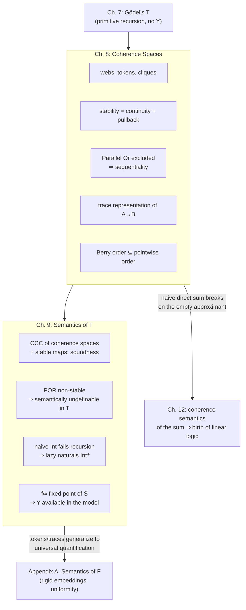

[[book-guidelines|↩ Back to guidelines]]

# Coherence Space Semantics

## What "function" is supposed to mean

Chapter 3 gave the typed $\lambda$-calculus a syntax: terms, redexes, reduction. Chapters 4 and 6 proved that syntax behaves — reduction terminates, confluently. But none of that says what a term of type $U \to V$ *is*, independent of how you happen to write it down. Two terms that reduce to different normal forms are obviously different programs, but are they different *functions*? Denotational semantics exists to answer that question: interpret reduction (a dynamic, syntactic notion) by equality between static, language-independent objects. Girard is explicit about the goal: take the naive reading — "an object of type $U \to V$ is a function from $U$ to $V$" — completely literally, and find out what "function" has to mean for that reading to actually explain something, rather than just restate the syntax in fancier clothes.

He tries three candidates and rejects the first two before landing on the one this chapter builds:

- **Type = set, $U \to V$ = all set-theoretic functions.** Technically correct, semantically useless. The function space is enormous, and the "computationally interesting" functions — the ones a term could actually denote — drown in a sea of arbitrary, uncomputable ones. This model explains nothing about what makes a term-denoted function special.
- **Kreisel's hereditarily effective operations.** Type = partial equivalence relation on $\mathbb{N}$; $U \to V$ = codes of partial recursive functions respecting the relations. This sticks *too* close to the syntax — it barely does more than re-encode terms via Gödel numbering. A semantics that just re-describes the syntax isn't a semantics; it's a translation.
- **Scott's topological domains.** Type = topological space (in practice, a poset with directed joins); $U \to V$ = continuous functions. This is the real ancestor of what Girard builds, and it fails for a structural reason, not a superficial one: topology doesn't tell you how a *sequence of functions* should converge — pointwise? uniformly? The compact-open topology patches this only for locally compact spaces, and even then the resulting function space isn't guaranteed to stay locally compact. Scott's actual fix was to strip away the topology's traditional geometric content and keep only "poset with directed joins" — at which point, Girard notes dryly, the topology was never doing real work; it was scaffolding.

**What breaks without an extra condition.** Continuity (preservation of directed joins) alone doesn't rule out *parallel* functions — functions that behave as if they could inspect two arguments simultaneously and race whichever one resolves first. Real programs can't do that: a physical machine executes one instruction at a time, and even models of concurrency don't grant a function the power to output an answer that specifically requires *knowing* two independent things happened, without having committed to check at least one of them first. Continuity is silent on this. The extra condition Girard adds — introduced by Berry as an attempt to *semantically characterize sequential algorithms* — is **stability**: alongside directed joins, a stable function must also preserve certain finite meets (pullbacks). This is the chapter's whole payload, and it rules out exactly the pathological case continuity permits: the worked counterexample is Parallel Or, below.

## Coherence spaces: webs, tokens, cliques

A **coherence space** $A$ is a set of sets satisfying two closure conditions:

$$
\text{(i) Down-closure: } a \in A \wedge a' \subseteq a \implies a' \in A
$$
$$
\text{(ii) Binary completeness: } M \subseteq A \wedge (\forall a_1, a_2 \in M,\ a_1 \cup a_2 \in A) \implies \bigcup M \in A
$$

Condition (ii) in particular forces $\emptyset \in A$ — the **undefined object**, present in every coherence space. Read as a poset ordered by $\subseteq$, a coherence space is *algebraic* (every element is the directed union of its finite subsets) and satisfies pairwise-bounded joins.

Not every such poset is a coherence space, though — and the book's own counterexample is worth sitting with because it pins down exactly what binary completeness buys you. Take $\{0\},\{1\},\{2\},\{0,1\},\{0,2\},\{1,2\}$, but **not** $\{0,1,2\}$. Each pair $\{0,1\},\{0,2\}$ has a union $\{0,1,2\}$ that's *missing* — so binary completeness fails, and this poset is not a coherence space, even though it looks locally identical to one at every level below the top.

<svg viewBox="0 0 460 210" xmlns="http://www.w3.org/2000/svg" role="img" aria-label="A non-coherence-space: three pairwise unions present but their common union missing, versus the flat webs of Bool and Int">
  <text x="90" y="20" text-anchor="middle" font-family="sans-serif" font-size="13" fill="#888888">not a coherence space</text>
  <text x="90" y="45" text-anchor="middle" font-family="sans-serif" font-size="12" fill="#aa5555">{0,1,2} missing</text>
  <text x="30" y="70" text-anchor="middle" font-family="sans-serif" font-size="12" fill="#888888">{0,1}</text>
  <text x="90" y="70" text-anchor="middle" font-family="sans-serif" font-size="12" fill="#888888">{0,2}</text>
  <text x="150" y="70" text-anchor="middle" font-family="sans-serif" font-size="12" fill="#888888">{1,2}</text>
  <text x="30" y="130" text-anchor="middle" font-family="sans-serif" font-size="12" fill="#888888">{0}</text>
  <text x="90" y="130" text-anchor="middle" font-family="sans-serif" font-size="12" fill="#888888">{1}</text>
  <text x="150" y="130" text-anchor="middle" font-family="sans-serif" font-size="12" fill="#888888">{2}</text>
  <text x="90" y="175" text-anchor="middle" font-family="sans-serif" font-size="12" fill="#888888">∅</text>
  <line x1="35" y1="78" x2="30" y2="122" stroke="#888888" stroke-width="1.2"/>
  <line x1="30" y1="78" x2="88" y2="122" stroke="#888888" stroke-width="1.2"/>
  <line x1="95" y1="78" x2="35" y2="122" stroke="#888888" stroke-width="1.2"/>
  <line x1="95" y1="78" x2="148" y2="122" stroke="#888888" stroke-width="1.2"/>
  <line x1="150" y1="78" x2="92" y2="122" stroke="#888888" stroke-width="1.2"/>
  <line x1="150" y1="78" x2="150" y2="122" stroke="#888888" stroke-width="1.2"/>
  <line x1="30" y1="138" x2="85" y2="168" stroke="#888888" stroke-width="1.2"/>
  <line x1="90" y1="138" x2="90" y2="168" stroke="#888888" stroke-width="1.2"/>
  <line x1="150" y1="138" x2="95" y2="168" stroke="#888888" stroke-width="1.2"/>

  <text x="320" y="20" text-anchor="middle" font-family="sans-serif" font-size="13" fill="#888888">webs of Bool and Int (flat)</text>
  <text x="270" y="60" text-anchor="middle" font-family="sans-serif" font-size="14" fill="#888888">t</text>
  <text x="330" y="60" text-anchor="middle" font-family="sans-serif" font-size="14" fill="#888888">f</text>
  <circle cx="270" cy="70" r="4" fill="#888888"/>
  <circle cx="330" cy="70" r="4" fill="#888888"/>
  <text x="300" y="95" text-anchor="middle" font-family="sans-serif" font-size="11" fill="#aa5555">no edge = incoherent</text>
  <circle cx="400" cy="70" r="4" fill="#888888"/>
  <circle cx="425" cy="70" r="4" fill="#888888"/>
  <circle cx="450" cy="70" r="4" fill="#888888"/>
  <text x="400" y="55" text-anchor="middle" font-family="sans-serif" font-size="11" fill="#888888">0</text>
  <text x="425" y="55" text-anchor="middle" font-family="sans-serif" font-size="11" fill="#888888">1</text>
  <text x="450" y="55" text-anchor="middle" font-family="sans-serif" font-size="11" fill="#888888">2 …</text>
  <text x="425" y="95" text-anchor="middle" font-family="sans-serif" font-size="11" fill="#888888">discrete graph</text>
</svg>

Every coherence space $A$ is equivalent to a graph. Define its **web** $|A| = \bigcup A = \{\alpha : \{\alpha\} \in A\}$ — the elements of the web are called **tokens** — and the **coherence relation** modulo $A$ between tokens:

$$\alpha \smile \alpha' \pmod{A} \iff \{\alpha, \alpha'\} \in A$$

This relation is reflexive and symmetric, so $(|A|, \smile)$ is a graph — the coherence space's web. The construction is a bijection: coherence spaces correspond exactly to reflexive-symmetric graphs, and you recover $A$ from the web by

$$a \in A \iff a \subseteq |A| \wedge \forall \alpha_1, \alpha_2 \in a\ (\alpha_1 \smile \alpha_2 \pmod{A})$$

In graph-theoretic language: **a point of $A$ is exactly a clique**. $\mathrm{Bool}$'s web has two tokens, $t$ and $f$, with no edge between them (incoherent). $\mathrm{Int}$'s web is a discrete graph on $\mathbb{N}$. Both are **flat**: no two distinct tokens cohere, so the only points are $\emptyset$ and the singletons.

```rust
/// A coherence space, presented as its web: tokens plus a coherence
/// relation. A "point" is any clique in this graph — the definition
/// is checked, not stored, so points don't need to be enumerated up front.
trait CoherenceSpace {
    type Token: Eq + Clone;
    /// The reflexive-symmetric relation "α ⌣ α′ (mod A)".
    fn coherent(&self, a: &Self::Token, b: &Self::Token) -> bool;

    /// A candidate set of tokens is a point iff every pair is coherent —
    /// this is condition (i)+(ii) restated as "clique in the web."
    fn is_point(&self, tokens: &[Self::Token]) -> bool {
        tokens.iter().enumerate().all(|(i, a)| {
            tokens[i + 1..].iter().all(|b| self.coherent(a, b))
        })
    }
}

struct Bool_; // token = bool
impl CoherenceSpace for Bool_ {
    type Token = bool;
    fn coherent(&self, a: &bool, b: &bool) -> bool { a == b } // flat: only reflexive
}

struct Int_; // token = i64, also flat
impl CoherenceSpace for Int_ {
    type Token = i64;
    fn coherent(&self, a: &i64, b: &i64) -> bool { a == b }
}
```

## Points as approximated information, and why totality isn't maximality

A type is interpreted by a coherence space; a term of that type is interpreted by a **point** — possibly infinite, in general. To work with points effectively, every point $a$ needs finite handles: an **approximant** of $a$ is any $a^\circ \subseteq a$ (down-closure guarantees $a^\circ \in A$ too), and the set $I$ of finite approximants is **directed** — nonempty, and closed under pairwise union within $I$ (take $a^\circ \cup a^{\circ\prime}$). Every point is the directed union of its finite approximants.

This gives coherence spaces a genuine "information order": $\emptyset$ is *no information*, a bigger point is *more information*, matching recursion theory's shift from total to partial functions (the integers are the singletons; $\emptyset$ is "undefined," exactly as in partial recursive function theory).

Here's the subtlety the book flags explicitly, and it matters later: it's tempting to identify "total" points with **maximal** points — those $a$ such that no coherent token can be added. That coincidence *does* hold for the simple flat cases ($\mathrm{Bool}$, $\mathrm{Int}$). But it stops holding once types get complex, and the reason is a complexity mismatch, not a technicality: maximality is a $\Pi^0_2$ statement (bounded quantifier complexity, checkable by "no token can be coherently added"), while a genuinely useful notion of totality for a complex type — one that tracks "this point behaves like a real, fully-defined value under application, projection, etc." — needs formulas as logically complex as the reducibility predicates from Chapter 6, which grow in quantifier complexity with the type structure. Complexity that grows without bound cannot coincide with a fixed-complexity notion like maximality. Just as there are many reducibility *candidates* for one type (Chapter 14), there will turn out to be many notions of totality for one coherence space — the semantics deliberately partializes everything, and "the" total objects don't sit at a single canonical place inside it. This is the same shape of problem the book resolves later, semantically, via *totality candidates* (Appendix A.6) — worth flagging now because the parallel is exact.

## Stable functions: continuity plus the pullback condition

A function $F: A \to B$ between coherence spaces is **stable** if it satisfies three conditions, traditionally labelled (St):

$$
\text{(i) Monotone: } a' \subseteq a \in A \implies F(a') \subseteq F(a)
$$
$$
\text{(ii) Continuous: } F\Big(\bigcup{}^{\uparrow}_{i \in I} a_i\Big) = \bigcup{}^{\uparrow}_{i \in I} F(a_i) \quad \text{(directed union)}
$$
$$
\text{(iii) Stability: } a_1 \cup a_2 \in A \implies F(a_1 \cap a_2) = F(a_1) \cap F(a_2)
$$

Read operationally: monotonicity says $F$ only ever uses *positive* information — feed it a superset of the input and you get back a superset of the output, never less. Continuity is the standard Scott condition: $F$'s behavior on an infinite point is entirely determined by its behavior on finite approximants, glued together. Condition (iii) is the new one, and it has no topological ancestor. Thinking of a coherence space as a category (objects = points, morphisms = inclusions $a' \subseteq a$), (i) says $F$ is a functor, (ii) says $F$ preserves filtered colimits — both familiar from Scott's theory. Condition (iii) says $F$ preserves a specific kind of **pullback**: whenever $a_1$ and $a_2$ are *compatible* (their union is itself a point — they don't conflict), $F$'s value on their overlap is exactly the overlap of $F$'s values.

<svg viewBox="0 0 380 230" xmlns="http://www.w3.org/2000/svg" role="img" aria-label="The stability pullback: a1 union a2 preserved as F of a1 intersect a2 equals F(a1) intersect F(a2)">
  <text x="190" y="18" text-anchor="middle" font-family="sans-serif" font-size="13" fill="#888888">stability = F preserves this pullback</text>
  <text x="190" y="42" text-anchor="middle" font-family="sans-serif" font-size="15" fill="#888888">a₁ ∪ a₂</text>
  <text x="55" y="120" text-anchor="middle" font-family="sans-serif" font-size="15" fill="#888888">a₁</text>
  <text x="325" y="120" text-anchor="middle" font-family="sans-serif" font-size="15" fill="#888888">a₂</text>
  <text x="190" y="200" text-anchor="middle" font-family="sans-serif" font-size="15" fill="#888888">a₁ ∩ a₂</text>
  <line x1="178" y1="50" x2="68" y2="105" stroke="#888888" stroke-width="1.4"/>
  <line x1="202" y1="50" x2="315" y2="105" stroke="#888888" stroke-width="1.4"/>
  <line x1="62" y1="132" x2="180" y2="188" stroke="#888888" stroke-width="1.4"/>
  <line x1="322" y1="132" x2="205" y2="188" stroke="#888888" stroke-width="1.4"/>
  <text x="255" y="145" text-anchor="middle" font-family="sans-serif" font-size="12" fill="#6a8f6a">F</text>
  <path d="M 250 60 Q 300 100 250 190" fill="none" stroke="#6a8f6a" stroke-width="1.2" stroke-dasharray="4 3"/>
  <text x="315" y="15" text-anchor="middle" font-family="sans-serif" font-size="11" fill="#888888">F(a₁∩a₂) = F(a₁)∩F(a₂)</text>
</svg>

**Why this can't be dropped, in the book's own counterexample.** Suppose we want $F : \mathrm{Int} \to \mathrm{Int}$ with $f(0) = f(1) = 0$ and $f(n+2) = 1$ — an ordinary total function, nothing exotic. This forces $F(\{0\}) = F(\{1\}) = \{0\}$, and by monotonicity $F(\emptyset) = \emptyset$. Now check condition (iii) with $a_1 = \{0\}, a_2 = \{1\}$: naively you'd want $F(\{0\} \cap \{1\}) = F(\{0\}) \cap F(\{1\})$, i.e. $F(\emptyset) = \{0\}$ — contradicting $F(\emptyset) = \emptyset$. The semantics is *saved* here only because $\{0\}$ and $\{1\}$ are **incoherent** in $\mathrm{Int}$ ($0 \neq 1$), so $\{0\} \cup \{1\} \notin \mathrm{Int}$, and condition (iii)'s hypothesis simply never fires for this pair. The pullback condition is only demanded of *compatible* pairs — that restriction is precisely what keeps ordinary total functions stable while still ruling out the pathological ones. This is also the seed of a fact used repeatedly later: stability forces the existence of a **least approximant** wherever the hypothesis does apply, just by intersecting a bounded-above set.

## Stable functions on a flat space

Classifying stable $F: \mathrm{Int} \to \mathrm{Int}$ is short, and the classification matters because it's the vocabulary the rest of the chapter reuses:

- If $F(\emptyset) = \{n\}$, monotonicity forces $F(a) = \{n\}$ for *every* $a$ — these are the **constants "by vocation"**, written $\dot n$: they ignore their argument entirely.
- Otherwise $F(\emptyset) = \emptyset$, and $F$ is determined by an honest partial function $f$ on $\mathbb{N}$ (defined exactly where $F(\{n\}) \neq \emptyset$), written $\widetilde f$.

Note that $\widetilde f$ where $f$ is the everywhere-undefined partial function ($\widetilde f(\emptyset) = \emptyset$, never anything else) looks *pointwise* just like a constant that outputs $\emptyset$ always — but $\dot n$ and any $\widetilde f$ are genuinely different objects in the semantics; they only coincide on inputs where both happen to be $\emptyset$. This distinction — "ignores the input" versus "hasn't been given enough input yet" — turns out to matter a great deal once you compare orders below.

## The Parallel Or example: stability forces sequentiality

This is the chapter's central worked example, and it's worth reconstructing exactly as Girard does, because the *shape* of the argument (not just the conclusion) is what generalizes.

The goal: find every stable $F : \mathrm{Bool}, \mathrm{Bool} \to \mathrm{Bool}$ (of two arguments) representing disjunction, i.e. $F(\{\alpha\}, \{\beta\}) = \{\alpha \vee \beta\}$ on all *total* substitutions of $t, f$ for $\alpha, \beta$. Monotonicity plus the binary pullback condition (extended to two arguments, §8.4) pins down the partial behavior almost completely:

- $F(\emptyset, \emptyset)$ can't be $\{t\}$ or $\{f\}$ (that would force $F$ constant, contradicting the total cases).
- $F(\{f\}, \emptyset) = F(\emptyset, \{f\}) = \emptyset$ is *forced*: e.g. $F(\{f\}, \emptyset) \subseteq F(\{f\},\{t\}) = \{t\}$ and $F(\{f\}, \emptyset) \subseteq F(\{f\},\{f\}) = \{f\}$ simultaneously, so it must be $\emptyset$.
- $F(\{t\}, \emptyset)$ has a real choice: it can be $\{t\}$ (the first argument alone settles it) or $\emptyset$ (wait for more).

Working through all the stability-consistent choices yields exactly three solutions:

| | $F_1$ (check-left) | $F_2 = F_1$ swapped | $F_3$ (wait for both) |
|---|---|---|---|
| $(\{t\}, \cdot)$, any $\cdot$ | $\{t\}$ | depends | $\{t\}$ only if $\cdot \neq \emptyset$ |
| $(\{f\}, \{t\})$ | $\{t\}$ | $\{t\}$ | $\{t\}$ |
| $(\{f\}, \{f\})$ | $\{f\}$ | $\{f\}$ | $\{f\}$ |
| anything with an $\emptyset$ argument, else | $\emptyset$ | $\emptyset$ | $\emptyset$ |

$F_1$ inspects the first argument: if it's $\{t\}$, answer $\{t\}$ immediately, never touching the second; otherwise the answer *is* the second argument. $F_2(a,b) = F_1(b,a)$ checks the second argument first. $F_3$ is more cautious still — it needs *both* arguments resolved (except the double-false case, which it can shortcut).

What's conspicuously **absent** is the genuinely parallel candidate $F_0$, with $F_0(\{t\}, \emptyset) = F_0(\emptyset, \{t\}) = \{t\}$ — the function that says "true if *either* argument is true, whichever one I happen to see first." The book shows exactly why stability kills this: apply condition (iii) with $a_1 = \{t\}, a_2 = \emptyset, b_1 = \emptyset, b_2 = \{t\}$ (so $a_1 \cup a_2 \in \mathrm{Bool}$, $b_1 \cup b_2 \in \mathrm{Bool}$): stability would force $F_0(\emptyset, \emptyset) = F_0(\{t\},\emptyset) \cap F_0(\emptyset,\{t\}) = \{t\} \cap \{t\} = \{t\}$ — but we already established $F(\emptyset,\emptyset) \neq \{t\}$. Contradiction.

The diagnosis Girard gives is sharper than "it's excluded by the axioms" — it's a **principle of least data**: for the total input $(\{t\},\{t\})$, the answer is $\{t\}$, and by the trace lemma (below) that answer must have a *unique least* finite justification. But $F_0$ offers **two incomparable minimal justifications** — $(\{t\}, \emptyset)$ and $(\emptyset, \{t\})$ — neither contained in the other, both already sufficient. A function with two incomparable minimal witnesses for the same output is exactly what "genuinely parallel" means, and it's exactly what stability's uniqueness-of-least-witness structure cannot represent. **This is a feature, not a limitation being apologized for**: it means stable-function semantics is intrinsically a semantics of *sequential* algorithms — every stable function comes with a canonical, well-defined "what do I need to check first" strategy, which is precisely the kind of fact a real implementation needs and Scott continuity alone never gives you.

```rust
#[derive(Clone, Copy, PartialEq, Debug)]
enum B3 { Unknown, True, False } // Unknown ~ ∅

/// F1 from the book: check the first argument. This is a total, ordinary
/// Rust function — and it is *forced* to commit to an evaluation order,
/// exactly because there is no way to write "answer true the instant
/// either argument is known true" without that non-stable branching.
fn or_check_left(a: B3, b: B3) -> B3 {
    match a {
        B3::True => B3::True,   // least data: a alone decides
        B3::False => b,         // a=false ⇒ answer is exactly b
        B3::Unknown => B3::Unknown, // can't proceed without a
    }
}
// No total, pattern-matching Rust function computes real "parallel or" —
// every `match` commits to an order of inspection. That's not a Rust
// limitation; it's the operational content of stability itself.
```

```python
# A quick brute-force check that F1's trace matches the book's claim
# (section 8.5.1): the trace consists of the *minimal* finite witnesses.
Unknown, T, F = None, True, False
def F1(a, b):
    if a is True: return True
    if a is False: return b
    return None  # a unknown

def is_point_pair(a, b):  # {∅,{t},{f}} x {∅,{t},{f}}
    return True

witnesses = []
for a in (Unknown, T, F):
    for b in (Unknown, T, F):
        out = F1(a, b)
        if out is not None:
            # is (a,b) minimal, i.e. no strict sub-approximant gives `out`?
            subs = [(a2, b2) for a2 in (Unknown, a) for b2 in (Unknown, b)
                    if (a2, b2) != (a, b)]
            if not any(F1(a2, b2) == out for a2, b2 in subs):
                witnesses.append(((a, b), out))
print(witnesses)
# -> [((True, None), True), ((False, True), True), ((False, False), False)]
# matches Tr(F1) exactly: ({(1,t)},t), ({(1,f),(2,t)},t), ({(1,f),(2,f)},f)
```

## The direct product ("with"), reducing binary to unary

Binary stability is *not* just "stable in each argument separately" — it also needs the two-argument pullback preserved, a genuinely joint condition (unlike ordinary continuity, where separate continuity already implies joint continuity). To avoid re-deriving everything for every arity, Girard introduces the **direct product** $A \mathbin{\&} B$ of two coherence spaces (the notation borrowed from [[Linear-Logic|linear logic]], where this connective is later called "with"): the web is the disjoint union $|A| + |B|$, tokens from the same side cohere as they did in $A$ or $B$, and tokens from *different* sides always cohere. Points of $A \mathbin{\&} B$ correspond exactly to pairs $(a, b)$ with $a \in A, b \in B$ — this is the categorical product — and every stable binary function $F$ from $A, B$ to $C$ corresponds bijectively to a stable *unary* function $G$ from $A \mathbin{\&} B$ to $C$ via $G(\{1\}\times a \cup \{2\}\times b) = F(a,b)$. Everything from here on can therefore be stated for unary stable functions without loss of generality.

## Representing the function space: the trace

$A \to B$ (all stable functions from $A$ to $B$) isn't presented as a coherence space by construction — Girard has to *build* one whose points correspond exactly to stable functions. The key fact making this possible is a lemma about **least witnesses**:

> **Lemma (8.5.1).** For $F$ stable, $a \in A$, $\beta \in F(a)$: there is a finite $a^\circ \subseteq a$ with $\beta \in F(a^\circ)$ (existence, from continuity — $a$ is a directed union of finite approximants, and $F$ commutes with that union). Moreover, if $a^\circ$ is chosen *minimal* among such witnesses, it is in fact **least**, hence unique (this uses stability: two minimal witnesses $a^\circ, a'$ both give $\beta \in F(a^\circ) \cap F(a') = F(a^\circ \cap a')$, forcing $a^\circ \subseteq a^\circ \cap a'$ by minimality, hence $a^\circ \subseteq a'$).

This uniqueness is exactly what killed Parallel Or above, made general. The **trace** $\mathrm{Tr}(F)$ collects these least witnesses: pairs $(a^\circ, \beta)$ with $a^\circ$ a finite point of $A$, $\beta \in F(a^\circ)$, and $a^\circ$ minimal (equivalently least) among finite points justifying $\beta$. The trace determines $F$ completely via the **application formula**:

$$
(\mathrm{App}) \qquad F(a) = \{\beta : \exists a^\circ \subseteq a,\ (a^\circ, \beta) \in \mathrm{Tr}(F)\}
$$

The representation theorem (8.5.2) shows the converse: traces of stable functions are *exactly* the points of a coherence space, called $A \to B$, whose web is $A_{\mathrm{fin}} \times |B|$ with $(a_1,\beta_1) \smile (a_2,\beta_2)$ iff ($a_1 \cup a_2 \in A \Rightarrow \beta_1 \smile \beta_2$) and ($a_1 \cup a_2 \in A \wedge a_1 \ne a_2 \Rightarrow \beta_1 \ne \beta_2$). $\mathrm{Tr}$ and the construction "read off $F$ from a point of $A\to B$ via (App)" are mutually inverse — a stable function *is*, up to this bijection, a coherence-space point, and $A \to V$ is a genuine type constructor at the same level as $\times$.

```rust
/// A stable function represented concretely by its trace: the *finite*
/// set of (least witness, output token) pairs. `apply` is literally the
/// (App) formula — this is what Tr/App mutual-inverseness buys an
/// implementation: the function *is* its (finite, inspectable) trace.
struct StableFn<TA: Eq + Clone, TB: Eq + Clone> {
    trace: Vec<(Vec<TA>, TB)>,
}
impl<TA: Eq + Clone, TB: Eq + Clone> StableFn<TA, TB> {
    fn apply(&self, a: &[TA]) -> Vec<TB> {
        self.trace.iter()
            .filter(|(a_witness, _)| a_witness.iter().all(|t| a.contains(t)))
            .map(|(_, b)| b.clone())
            .collect()
    }
}
```

## The Berry order versus the pointwise order

Being a coherence space, $A \to B$ is ordered by inclusion of points; transported across the trace bijection, this gives the **Berry order** on stable functions:

$$F \le_B G \iff \mathrm{Tr}(F) \subseteq \mathrm{Tr}(G) \iff \forall a' \subseteq a \in A\ \big(F(a') = F(a) \cap G(a')\big)$$

The Berry order is *strictly finer* than the ordinary pointwise order $F \le G \iff \forall a\, F(a) \subseteq G(a)$. The book's own example: $F_3 \not\le_B F_1$ (from the Parallel Or classification above), even though $F_3(a,b) \subseteq F_1(a,b)$ for every $a, b$ — pointwise, $F_3$ genuinely is "less defined everywhere" than $F_1$, but Berry-order-wise they're incomparable, because $F_3$'s witness structure isn't a *sub-trace* of $F_1$'s (it demands different, not merely less, information).

The sharpest instance of this gap is deliberately the simplest possible type: $\mathrm{Sgl} \to \mathrm{Sgl}$, where $\mathrm{Sgl}$ has a single token $\bullet$. Pointwise (the Scott order), the identity function sits *below* the constant-by-vocation $\dot\bullet$ — the identity is $\emptyset \mapsto \emptyset,\ \{\bullet\}\mapsto\{\bullet\}$, and $\dot\bullet$ is $\emptyset \mapsto \{\bullet\}$, so identity's graph is pointwise contained in the constant's. But in the Berry order they're **incomparable**. This isn't pedantry — it's an operationally real distinction: it's the semantic difference between a test program that *reads its input* (identity — genuinely needs $\{\bullet\}$ present to produce $\{\bullet\}$) and one that *ignores* it (the constant — produces $\{\bullet\}$ from nothing). Pointwise semantics can't see this difference; stable semantics is built to preserve it, because it's exactly the information a real evaluator needs (strictness/laziness distinctions in a compiler are downstream of precisely this gap).

## Partial functions at $\mathrm{Int} \to \mathrm{Int}$

Computing $\mathrm{Int} \to \mathrm{Int}$ explicitly makes the abstract machinery concrete. $|\mathrm{Int} \to \mathrm{Int}| \simeq (\mathbb{N} \cup \{\emptyset\}) \times \mathbb{N}$, splitting (via a direct sum, §12.1) into the constants-by-vocation part and a space $\mathrm{PF}$ on web $\mathbb{N}\times\mathbb{N}$ with $(n,m)\smile(n',m')$ iff $n=n' \Rightarrow m=m'$. A point of $\mathrm{PF}$ is then exactly the graph of a genuine partial function $\mathbb{N}\rightharpoonup\mathbb{N}$, ordered by graph inclusion — the Berry order on $\mathrm{PF}$ *is* the usual extension order. The partial functions $\widetilde f$ and the constants $\dot n$ live in different, Berry-incomparable parts of the space, even though pointwise you'd have $\widetilde f < \dot 0$ for any partial function whose only value (where defined) is $0$ — of which there are infinitely many. One advantage the book flags explicitly: this avoids Scott's phenomenon of a single "compact" object sitting below infinitely many others in the pointwise order, which stable semantics structurally can't produce.

## Interpreting the simply typed calculus (§9.1–9.2)

With types-as-coherence-spaces and terms-as-points in hand, $\lambda$-abstraction and application become the two mutually inverse operations you'd hope for: abstraction turns the stable function $b \mapsto \llbracket v \rrbracket(a,b)$ into a point of $A \to B$ via $\mathrm{Tr}$; application turns a point of $A \to B$ back into a function via (App). Types compose accordingly: $\llbracket U \times V \rrbracket = \llbracket U \rrbracket \mathbin{\&} \llbracket V \rrbracket$, $\llbracket U \to V \rrbracket = \llbracket U \rrbracket \to \llbracket V \rrbracket$. Terms get a compositional, five-clause interpretation (variables project out an argument; pairing composes with a stable $\mathrm{Pair}$; projections compose with stable $\Pi_1, \Pi_2$; abstraction takes a trace; application uses $\mathrm{App}$) — each clause is a direct instantiation of machinery already built, and stability of the composite is inherited automatically, not reproven from scratch each time.

The payoff is **soundness**: if $t \rhd u$ (one conversion step) then $\llbracket t \rrbracket = \llbracket u \rrbracket$. This rests on three identities that make the constructions genuinely mutually inverse —

$$\Pi_1(\mathrm{Pair}(a,b)) = a \qquad \Pi_2(\mathrm{Pair}(a,b)) = b \qquad \mathrm{App}(\mathrm{Tr}(F), a) = F(a)$$

— combined with a **substitution lemma**: interpreting $v[u/x]$ directly agrees with first interpreting $v$ and $u$ separately and then composing, i.e. $\llbracket v[u/x]\rrbracket = \llbracket v \rrbracket(\llbracket u \rrbracket)$ (proved by induction on $v$; Girard's own aside, "but what a bore!", is honest about the proof being routine rather than illuminating). Chaining these gives $\beta$-reduction's semantic justification directly:

$$\llbracket(\lambda x.v)\,u\rrbracket = \mathrm{App}(\mathrm{Tr}(a \mapsto \llbracket v\rrbracket(a)),\ \llbracket u \rrbracket) = \llbracket v\rrbracket(\llbracket u\rrbracket) = \llbracket v[u/x]\rrbracket$$

Notably, the **secondary equations** — $\eta$ and surjective pairing, which Chapter 3 flagged as never having "received adequate status" syntactically — hold *outright* semantically: $\mathrm{Pair}(\Pi_1(c),\Pi_2(c)) = c$ and $\mathrm{Tr}(a \mapsto \mathrm{App}(f,a)) = f$ are just the mutual-inverseness of the constructions, no extra argument required. Categorically, the upshot is clean: **coherence spaces and stable maps form a Cartesian closed category**, with $\mathbin{\&}$ as product and $\to$ as exponential (composition itself has an explicit trace formula, given via composing witnesses through an intermediate clique).

This soundness result is the semantic mirror of exactly what Chapter 4's Church-Rosser and weak-normalisation theorems bought you syntactically (see [[Normalisation-Theorems]]): there, "compute normal forms and compare" was licensed as a decision procedure for term equality *because* reduction was confluent. Here, denotational equality is a coarser, model-level notion of "same meaning" that reduction is proven to respect — the semantic analogue of an elaborator's `isDefEq`, except now backed by an actual mathematical object (a coherence-space point) rather than only a syntactic normal form.

## Gödel's T inside coherence spaces: booleans, and a semantic proof against Parallel Or

Interpreting $\mathrm{Bool}$ is immediate: $\llbracket\mathrm{T}\rrbracket = \{t\}$, $\llbracket\mathrm{F}\rrbracket = \{f\}$, and $D\,u\,v\,t$ (case analysis) becomes a ternary stable function $\mathcal{D}(a,b,\emptyset)=\emptyset$, $\mathcal{D}(a,b,\{t\})=a$, $\mathcal{D}(a,b,\{f\})=b$.

Here the chapters connect directly. Because **every term of Gödel's T denotes a stable function** (by the compositional interpretation above), and Parallel Or is precisely the non-stable function $F_0$ excluded in §8.3.2, **Parallel Or cannot be defined in T** — and this is a *semantic* proof, not a syntactic one. Concretely: if some $t$ satisfied $t\,\langle\mathrm{T},x\rangle \rhd^* \mathrm{T}$, $t\,\langle x,\mathrm{T}\rangle \rhd^* \mathrm{T}$, and $t\,\langle\mathrm{F},\mathrm{F}\rangle \rhd^* \mathrm{F}$ (the defining equations of parallel-or) for *every* $x$, soundness would force its denotation to satisfy $\llbracket t\rrbracket(T,\emptyset) = T$, $\llbracket t\rrbracket(\emptyset,T) = T$, $\llbracket t\rrbracket(F,F) = F$ — exactly $F_0$'s signature, which no stable function can have. No amount of syntactic search inside T could ever have found such a term, because the *model* already rules the behavior out — a strictly stronger and more economical kind of impossibility proof than a syntactic non-definability argument would be, and a genuine example of denotational semantics earning its keep as a tool, not just a description.

## The lazy naturals: what's wrong with the naive $\mathrm{Int}$, and the fix

The obvious interpretation of $\mathrm{Int}$ — the flat coherence space from Chapter 8, with $\llbracket \mathrm{O}\rrbracket = \{0\}$, $\llbracket S\,t\rrbracket = S(\llbracket t\rrbracket)$ where $S(\emptyset)=\emptyset,\ S(\{n\})=\{n+1\}$ — **fails to correctly interpret recursion**. The book's demonstration is concrete: it's easy to find $u, v$ with

$$R\,u\,v\,\mathrm{O} \rhd^* \mathrm{T} \qquad\qquad R\,u\,v\,(S\,x) \rhd^* \mathrm{F}$$

(the recursor case-splits differently on zero versus successor). If $F$ is the stable function interpreting $x \mapsto R\,u\,v\,x$, soundness forces $F(O) = \{t\}$ and $F(S(\emptyset)) = \{f\}$ — but $S(\emptyset) = \emptyset \subseteq O$, so monotonicity requires $F(\emptyset) \subseteq F(O) = \{t\}$ *and* $F(\emptyset) = F(S(\emptyset)) = \{f\}$. Contradiction.

**Diagnosis.** Applying $S$ to $\emptyset$ (no information) returns $\emptyset$ again — but that's a lie, informationally: we *do* know something once we've applied $S$, namely "this is a successor," a fact the recursor's very first case-split needs and the flat $\mathrm{Int}$ throws away. The fix has to encode "I am $\ge$ some bound, even if I don't yet know exactly what" as its own piece of information.

**The fix.** Enrich $\mathrm{Int}$ to $\mathrm{Int}^+$: web $\{0, 0^+, 1, 1^+, \dots\}$, with coherence

$$p \smile q \iff p = q \qquad p^+ \smile q \iff p < q \qquad p^+ \smile q^+ \text{ always}$$

The token $p^+$ means, informally, "greater than $p$" — strictly weaker than "equal to $p+1$," which is exactly the point: it's information you can have *before* you know the exact successor value. The maximal points of $\mathrm{Int}^+$ are of two shapes: $\widehat p = \{0^+,\dots,(p-1)^+,p\}$ (a genuine total numeral $p$, with all the "greater than" facts implied by it) or the fully-open $f^\infty = \{0^+,1^+,2^+,\dots\}$ (knowing only "it's a successor, forever" — an honestly infinite object, no finite bound). The reinterpretation:

$$O = \{0\} \qquad S(a) = \{0^+\} \cup \{i+1 : i \in a\} \cup \{(i+1)^+ : i^+ \in a\}$$

so $S(\emptyset) = \{0^+\}$ — *not* $\emptyset$ anymore. Applying successor to no information now correctly yields the one honest fact you do gain: "this is a successor." The recursor is reconstructed as a stable $G: \mathrm{Int}^+ \to A$ satisfying $G(O)=o$, $G(S(a)) = F(G(a), a)$, well-defined first on finite points, then extended by monotone continuity to the infinite ones — in particular $G(f^\infty) = \bigcup^\uparrow\{G(S^n(\emptyset)) : n \in \mathbb{N}\}$, a genuine limit construction.

```lean
-- The "lazy naturals" fix, read as a comment on kernel-vs-model recursion:
-- Lean's kernel only accepts *structural* recursion on an inductive Nat
-- (or well-founded recursion it can certify terminates). `S(∅) = ∅` in the
-- naive coherence semantics is the exact denotational shadow of feeding
-- a recursor "zero real information" — which is why case-splitting on it
-- (`Nat.rec`) can't be made sound without the extra "is a successor" fact
-- Int⁺'s p⁺ tokens restore. `partial def` in Lean is the syntactic
-- acknowledgment that some definitions need exactly this kind of "trust
-- the model, not the structural recursion checker" escape hatch.
partial def approxSucc : Option Nat → Option Nat
  | none   => some 0  -- ~ S(∅) = {0⁺}: "is a successor" is real info now
  | some n => some (n + 1)
```

## Infinity and the fixed point: general recursion available in the model, absent from T's syntax

$f^\infty$ is exactly a **fixed point of the successor**: $S(f^\infty) = f^\infty$. Girard notes you could add it to T's syntax directly, with a non-terminating rewrite rule $\infty \rhd S\,\infty$ — and using the (weaker) iterator, $\mathrm{It}\,u\,v\,\infty \rhd v\,(\mathrm{It}\,u\,v\,\infty)$, meaning $\infty$ combined with recursion already gives you access to the fixed-point combinator $Y$, purely as a consequence of the semantics, without needing to add $Y$ as a primitive.

In the denotational model, the trace of $Yf$ (the fixed point of $f$) is described recursively: a token $\alpha$ occurs in $Yf$'s interpretation exactly when $\langle a, \alpha\rangle$ occurs in $f$'s trace *and* the clique $a$ itself already occurs in $Yf$'s interpretation — a genuinely self-referential definition, computed operationally by repeatedly applying $f$ to $\emptyset$ (unwinding $f(f(f(\cdots(\emptyset)\cdots)))$). Because this unwinding is exactly how the recursion bottoms out, the tokens of $Y$'s own interpretation can be described in terms of finite trees.

This is worth being precise about, because it directly answers why the model can host something the syntax structurally forbids: **T's typed syntax has no general recursion operator** — the recursor $R$ only ever does *primitive* recursion, by design (Chapter 7's whole point was that this restriction is what keeps T's functions provably total in PA). But the **coherence-space model has no such restriction built in** — it's just a category of stable functions, and $Y$ is a perfectly well-defined stable function once you're willing to let its trace be infinite (built from ever-larger finite trees, never terminating at a fixed finite stage). The syntax refuses general recursion on purpose, to preserve a termination guarantee; the semantics, having no termination obligation of its own to protect, accommodates it without friction. Girard is explicit that discussing the *programming* consequences of this (general recursion, an idea "currently rather alien to type systems") is out of scope here — the point of this section is narrower and sharper: the gap between what a type theory's object language permits and what its own denotational model is capable of expressing is not a defect to be closed, it's a structural fact about the relationship between a checked system and the (necessarily stronger) metatheory that models it — the same shape of gap Chapter 14's reducibility-candidates argument had to navigate around Gödel's second incompleteness theorem.

## Where this leads



The trace/App machinery built here is not a one-off trick — it's the exact template Appendix A reuses (one level up, with rigid embeddings replacing plain inclusions) to interpret system F's universal quantifier, and the totality-versus-maximality gap flagged in §8.2.2 is resolved there via *totality candidates*, mirroring Chapter 14's reducibility candidates almost verbatim. In the other direction, trying to extend *this* chapter's construction to the sum type is what actually produces linear logic (Chapter 12): the direct sum breaks exactly at the undefined approximant, for reasons structurally close to why $F_0$ broke stability here, and Girard's fix — splitting ordinary implication into a genuinely linear core plus an exponential — is discovered by pressure from this same pullback condition, applied one connective further.

For the standing project this vault is built around: the **trace's least-witness lemma** (8.5.1) is worth carrying forward explicitly — "the minimal justification for an output, guaranteed unique when it exists" is structurally the same shape of guarantee a *unification* algorithm wants from a most-general unifier, and the Parallel-Or exclusion is a clean illustration of what goes wrong (multiple, incomparable minimal witnesses) when that uniqueness fails. And the closing point about T's syntax refusing $Y$ while its model accommodates it is the semantic-domain version of a fact worth internalizing for a verifier's kernel design: a checker can be built to accept only structurally-justified (terminating) recursion while its *model* — the thing that gives the checker's rules their meaning — is free to be a strictly richer, non-terminating universe. The restriction lives in the syntax you check, not in the mathematics you're using to justify checking it.
