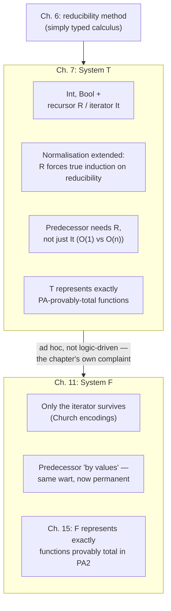

[[book-guidelines|↩ Back to guidelines]]

# Gödel's System T

## Why the simply typed calculus needs help

Everything built through chapter 6 — products, arrows, the reducibility method, strong normalisation — has been expressively thin on purpose. Girard opens chapter 7 by naming the gap directly: with only $\times$ and $\to$ over abstract atomic types, you cannot represent the integers or the booleans in any way that lets you compute usefully over them. There is nothing to recurse on. You can postulate atomic types and abstract constants, but nothing in the calculus so far tells you how to *define a function on integers by recursion* — the single most basic thing you'd want to do with them.

Gödel's system T is the calculus's first real attempt to fix that: bolt on two constant types, $\mathrm{Int}$ and $\mathrm{Bool}$, together with elimination principles powerful enough to define recursive functions. It buys enormous expressive power — enough, as the chapter's final theorem shows, to represent every function whose totality is provable in Peano Arithmetic. But Girard is explicit that this is a *stopgap*, not a destination: T is deliberately introduced as a system to outgrow, and chapter 11 (system F) exists specifically to replace T's ad hoc extension with something logically principled. Understanding *why* T is unsatisfying, not just what it can do, is as much the point of this chapter as the recursor itself.

## What breaks without primitive types: the two-fold complaint

Before writing down a single rule, Girard flags exactly what's uncomfortable about the move he's about to make:

1. **It's a step backwards logically.** Every construct introduced so far — pairing, projection, abstraction, application — was the Curry-Howard shadow of a natural-deduction rule for $\land$ or $\to$. Adding $\mathrm{Int}$ and $\mathrm{Bool}$ with their own bespoke introduction/elimination schemes does *not* correspond to any proof rule in an extended logic. You're patching the type system with special cases, not extending the underlying logic — which is precisely why Girard says it "makes it difficult to study them": there's no proof-theoretic symmetry to lean on, no cut-elimination-style argument that falls out for free the way it did for $\land,\to$.
2. **It doesn't stop at integers and booleans.** Once you accept "just add a primitive type for the data you need," there's no principled reason to stop: PASCAL famously shipped without a built-in list type, and the historical lesson is that ad hoc primitive-type additions are an open-ended, never-finished project — "to the detriment of conceptual simplicity and modularity," as Girard puts it.

This is the frame to hold throughout the chapter: T is powerful, but its power is bought with exactly the kind of special-casing that system F's *general scheme for inductive types* (chapter 11) will later dissolve. Keep this tension in view; it's the throughline the chapter itself uses to justify why it exists at all.

## The calculus: two new types, four new term-forming schemes

### Types and terms

T adds two constant types on top of everything from chapter 3: $\mathrm{Int}$ and $\mathrm{Bool}$. Each comes with an introduction scheme (how to build a canonical value) and an elimination scheme (how to consume one) — Girard deliberately keeps the introduction/elimination vocabulary because these same shapes reappear, generalized, in system F.

- **Int-introduction.** $O$ is a constant of type $\mathrm{Int}$ (zero); if $t : \mathrm{Int}$, then $S\,t : \mathrm{Int}$ (successor).
- **Int-elimination (the recursor).** If $u : U$, $v : U \to (\mathrm{Int} \to U)$, $t : \mathrm{Int}$, then $R\,u\,v\,t : U$.
- **Bool-introduction.** $T$ and $F$ are constants of type $\mathrm{Bool}$.
- **Bool-elimination.** If $u, v : U$ and $t : \mathrm{Bool}$, then $D\,u\,v\,t : U$.

The intended meanings pin these down: $O$ is zero, $S$ is successor; $T, F$ are the truth values; $D\,u\,v\,t$ is "if $t$ then $u$ else $v$" (definition by cases); and $R$ is primitive recursion in exactly the school-arithmetic sense —

$$R\,u\,v\,0 = u, \qquad R\,u\,v\,(n+1) = v\,(R\,u\,v\,n)\,n.$$

The new conversion rules make this operational:

$$R\,u\,v\,O \;\rhd\; u, \qquad R\,u\,v\,(S\,t) \;\rhd\; v\,(R\,u\,v\,t)\,t, \qquad D\,u\,v\,T \;\rhd\; u, \qquad D\,u\,v\,F \;\rhd\; v.$$

### The recursor is a fold — and it's literally `Nat.rec`

The type of $R$ — $U \to (U \to \mathrm{Int} \to U) \to \mathrm{Int} \to U$ — is exactly the signature of a right fold over a unary-encoded number: a base case $u$, a step function $v$ that takes the *accumulated result so far* and the *predecessor it was built from*, and a number to fold over. In Rust, the type $\mathrm{Int}$ is the enum you'd expect, and $R$ is a structurally recursive function on it:

```rust
enum IntT {
    O,
    S(Box<IntT>),
}

/// R u v t — the recursor. Note v takes BOTH the recursive result
/// and the untouched predecessor t, matching v : U -> Int -> U.
fn rec<U>(u: U, v: &impl Fn(U, &IntT) -> U, t: &IntT) -> U
where
    U: Clone,
{
    match t {
        IntT::O => u,
        IntT::S(t_prev) => {
            let inner = rec(u, v, t_prev);
            v(inner, t_prev)
        }
    }
}
```

This is not merely analogous to a principle you already know from a proof assistant — it *is* that principle, minus dependent types. Lean's `Nat.rec` (the eliminator generated automatically for `Nat`, since `Nat` is an inductive type with constructors `zero` and `succ`) has the signature

```lean
Nat.rec : {motive : Nat → Sort u} →
  motive Nat.zero →
  ((n : Nat) → motive n → motive n.succ) →
  (t : Nat) → motive t
```

Specialize `motive` to the constant function `fun _ => U` (ignore the value, always return the same type — exactly what System T's non-dependent $U$ does, since T has no dependent types at all) and you get precisely $R$'s signature: a base case of type `U`, a step `(n : Nat) → U → U` — reorder the arguments and this is Girard's $v : U \to \mathrm{Int} \to U$ — and a number to eliminate. When you write `Nat.rec` or use `induction n` in Lean on a non-dependent goal, you are running Girard's $R$ under a different name, forty years later.

### The weaker iterator

Girard notes, almost in passing, that $v$'s second argument — the untouched predecessor $t$ — often goes unused. Drop it, and you get a strictly weaker operator, the **iterator** $\mathrm{It}$, of type $T \to (T\to T) \to \mathrm{Int} \to T$:

$$\mathrm{It}\,u\,v\,O \;\rhd\; u, \qquad \mathrm{It}\,u\,v\,(S\,t) \;\rhd\; v\,(\mathrm{It}\,u\,v\,t).$$

This is the shape of `Iterator::fold` in Rust when you throw away the index, or `(0..n).fold(u, |acc, _| v(acc))` — apply $v$ to the accumulator, $n$ times, full stop. Why this weakening matters is the crux of the chapter's hardest question, below.

## Expressive power: what T can actually compute

### Booleans: the connectives, and a gap that stays open until chapter 9

$D$ alone gives you the propositional connectives:

$$\mathrm{neg}(u) = D\,F\,T\,u, \qquad \mathrm{disj}(u,v) = D\,T\,v\,u, \qquad \mathrm{conj}(u,v) = D\,v\,F\,u.$$

Check $\mathrm{disj}$: $\mathrm{disj}(T,x) \rhd T$ and $\mathrm{disj}(F,x) \rhd x$, matching classical disjunction on the *left* argument — but $\mathrm{disj}(x, T)$, with $x$ an open (unevaluated) variable, doesn't reduce at all, because $D$ can only make progress once its scrutinee is a canonical $T$ or $F$. This is a real asymmetry, not a notational accident, and Girard poses it as an open question right here: is there a *symmetric* disjunction — some $G : \mathrm{Bool}, \mathrm{Bool} \to \mathrm{Bool}$ with $G\langle T,x\rangle = T$, $G\langle x,T\rangle = T$, and $G\langle F,F\rangle=F$ for every $x$, not just canonical ones? The chapter doesn't answer it — it flags the question and defers the answer to §9.3.1, where a *semantic* argument (coherence-space stability rules out anything computing "parallel or") proves the answer is no. Holding this question open across chapters is itself the book's style: syntax poses it here, denotational semantics settles it later.

### Integers: numerals, arithmetic, and Ackermann-scale growth

Numerals are unary: $n$ abbreviates $S^n O$. Addition falls straight out of its defining equations $x + O = x$, $x + S y = S(x+y)$ by taking $t[x,y] = R\,x\,(\lambda z^{\mathrm{Int}}.\lambda z'^{\mathrm{Int}}.\,S\,z)\,y$ — check: $t[x,O] \rhd x$, and $t[x, S y] \rhd (\lambda z.\lambda z'.\,S\,z)\,t[x,y]\,y \rhd S\,t[x,y]$, matching the recursive equation exactly. Multiplication, exponentiation, and predicates like $\mathrm{null}(x) = R\,T\,(\lambda z^{\mathrm{Bool}}.\lambda z'^{\mathrm{Int}}.\,F)\,x$ (turning an $\mathrm{Int}$-valued test into a $\mathrm{Bool}$) all follow the same pattern.

None of that uses higher types yet. The real payoff shows up when you recurse *at a function type*. Given $f : \mathrm{Int}\to\mathrm{Int}$, define $\mathrm{it}(f) : \mathrm{Int}\to\mathrm{Int}$ by $\mathrm{it}(f)\,x = R\,1\,(\lambda z^{\mathrm{Int}}.\lambda z'^{\mathrm{Int}}.\,f\,z)\,x$, so $\mathrm{it}(f)\,n = f^n(1)$ — $f$ applied to itself $n$ times. Now go one level higher: recurse on the *iterator itself* as the accumulated object, with $R\,f_0\,(\lambda x^{\mathrm{Int}\to\mathrm{Int}}.\lambda z^{\mathrm{Int}}.\,\mathrm{it}(x))\,y$. At $y=O$ this normalises to $f_0$; at $y=n$ it normalises to $\mathrm{it}^n(f_0)$ — the operation "iterate $f_0$ on itself" applied $n$ times. This is exactly Ackermann-style growth: each level of recursion at a strictly higher type produces a function that outgrows every function definable at the level below, so the whole hierarchy exceeds every primitive recursive function. A quick illustration of the shape (not literally the T term, just the growth pattern it produces):

```python
def iterate(f, n):
    # f applied to itself n times: f^n
    for _ in range(n):
        f = lambda x, f=f: f(f(x))
    return f

# level 0: successor.  level k+1: "iterate level-k function n times."
# By the time you're a few levels up, values explode Ackermann-fast —
# this is what "recursion on higher types" buys you over ordinary
# primitive recursion on Int alone.
```

The moral: T's expressive ceiling is set not by $\mathrm{Int}$ and $\mathrm{Bool}$ themselves but by how high a type you're willing to recurse over — and that ceiling, as the closing theorem of the chapter shows, turns out to be exactly Peano Arithmetic's own proof-theoretic strength.

## The predecessor problem

This is the chapter's sharpest technical point, and it's worth walking through slowly, because the answer is not "the iterator is too weak in some vague sense" — it's a precise statement about what information the iterator throws away.

The one-step predecessor should satisfy $\mathrm{pred}(O) = O$, $\mathrm{pred}(S\,x) = x$. With the **full recursor**, this is nearly free:

$$\mathrm{pred} = R\;O\;(\lambda z^{\mathrm{Int}}.\lambda z'^{\mathrm{Int}}.\,z')$$

Unwind $\mathrm{pred}(S\,t)$: it converts to $v\,(R\,O\,v\,t)\,t$ where $v = \lambda z.\lambda z'.\,z'$ — and $v$ *ignores its first argument entirely*, discarding the whole recursive call $R\,O\,v\,t$ and returning $t$ directly. The reduction bottoms out in a small, fixed number of steps regardless of how large $t$ is, because the recursor hands you the untouched predecessor $t$ as a free side-payload at every unfolding, whether or not you use it.

```rust
fn pred(t: &IntT) -> IntT {
    // R O (λz.λz'. z') t — v discards the recursive result, keeps t.
    rec(IntT::O, &|_recursive_result, t_prev: &IntT| t_prev.clone(), t)
}
```

The **iterator** has no such side-payload — its step function $v : T \to T$ only ever sees the accumulated value, never the term it was built from. So you cannot write the same trick; the natural workaround is the classic "pair" construction: iterate the function $(a,b) \mapsto (S\,a,\,a)$, starting from $(O,O)$, and after $n$ steps the second component of the pair is $\mathrm{pred}(n)$:

```rust
fn pred_via_iterator(n: u32) -> u32 {
    // (a, b) -> (a+1, a), starting from (0, 0); iterated n times.
    // The predecessor "falls out" of the pair only after fully
    // re-walking the whole structure — one iteration step per unit.
    let (mut a, mut b) = (0u32, 0u32);
    for _ in 0..n {
        let a_next = a + 1;
        b = a;
        a = a_next;
    }
    b
}
```

This *works*, but Girard is explicit about the cost: the defining equation $\mathrm{pred}(S\,t) \equiv t$ only holds "by values" — i.e., only once $t$ has actually been unwound into a concrete numeral $n$, not as a general reduction rule for arbitrary open $t$ — and computing it takes $n$ full iteration steps to recover a quantity that the recursor handed you for free. As Girard puts it, this is "manifestly excessive," and he flags that it recurs — in a strictly worse form — when system F later has *only* the iterator available for its Church-encoded integers (§11.5.1): the predecessor there is a permanent, unfixable wart, not a temporary inconvenience. **This is the direct, mechanical reason the recursor exists as a primitive rather than being derived from the iterator**: the iterator forgets structure the recursor remembers, and that forgotten structure is exactly what predecessor-style functions need back.

## Extending normalisation to T

Chapter 6 built the reducibility machinery ($\mathrm{RED}_T$, the CR1–CR4 conditions, neutral terms) for the $(\times,\to)$ fragment — see [[Normalisation-Theorems]] for the full argument. Chapter 7 extends it to T with one genuinely new wrinkle worth isolating.

Neutrality is widened first: a term is now neutral if it is *not* of the form $\langle u,v\rangle$, $\lambda x.v$, $O$, $S\,t$, $T$, or $F$ — i.e., $R\,u\,v\,t$ and $D\,u\,v\,t$ count as neutral (eliminator-headed), exactly the same synthesizing/checking split flagged in the Normalisation-Theorems article. Reducibility of $O$, $T$, $F$ is immediate (they're normal atomic terms), and $S\,t$ inherits reducibility from $t$ directly (reduction length is unchanged: $\nu(S\,t) = \nu(t)$).

The $D$ case is handled by induction on $\nu(u)+\nu(v)+\nu(t)$ — an induction on the sum of *bound reduction lengths*, the same style of argument chapter 6 already used. But the $R$ case needs more: the induction is on $\nu(u)+\nu(v)+\nu(t)+\ell(t)$, where $\ell(t)$ counts the symbols in $t$'s normal form. When $t$ reduces to $S\,w$, the recursor step $R\,u\,v\,(S\,w) \rhd v\,(R\,u\,v\,w)\,w$ requires knowing that $R\,u\,v\,w$ — itself another instance of a recursor application — is *already reducible*, invoked as an induction hypothesis nested inside the very definition of reducibility being established. Girard is explicit that this is new: it is "the only occasion, in all the uses so far made of reducibility, where we truly use an induction on reducibility" itself, rather than an induction merely bounded by reduction length. Every other case so far (chapter 6's whole apparatus, plus $D$ here) could, with enough care, sidestep this by reformulating CR3; the recursor genuinely can't. It's a small remark in the text, but it's the chapter's real technical payload: $R$ is not just "more powerful" than what came before, it forces a structurally new kind of termination argument.

## Canonical forms: does $\mathrm{Int}$ really represent the integers?

Adding a type called $\mathrm{Int}$ doesn't automatically mean it *behaves* like the integers — you need a theorem, not a name. The canonical forms lemma supplies it: every **closed normal term** of type $\mathrm{Int}$ is literally a numeral $\underline{n} = S^nO$; of type $\mathrm{Bool}$, literally $T$ or $F$; of a product type, literally a pair $\langle u,v\rangle$; of an arrow type, literally an abstraction $\lambda x.v$. The proof is a clean induction on symbol count: any other shape (e.g. $R\,u\,v\,w$ where $w$ is forced by induction to already be a numeral, or $D\,u\,v\,w$ where $w$ is forced to be $T$/$F$) is shown to still contain a redex, contradicting normality. This is what licenses calling $\mathrm{Int}$ and $\mathrm{Bool}$ genuine representations rather than mere labels — every well-typed closed program that produces a value of that type produces a value that *looks like* the mathematical object it names.

## Representable functions: exactly what's provably total in PA

A closed term $t : \mathrm{Int}\to\mathrm{Int}$ induces a genuine function $|t| : \mathbb{N}\to\mathbb{N}$ via $|t|(n) = m \iff t\,\underline{n} \rightsquigarrow \underline{m}$ (and similarly a predicate for $\mathrm{Int}\to\mathrm{Bool}$). Because normalisation always terminates, $|t|$ is computable — feed the algorithm $\underline{n}$, normalise, read off the answer — so every T-representable function is at least *total recursive*. The chapter's closing theorem sharpens this into an exact characterisation, and it's worth being precise about which statement is being made, because it's easy to conflate with chapter 6's result and get confused:

- **Chapter 6** showed that strong normalisation *for the whole system T, as a uniform statement about every term*, cannot be proved inside PA — that's the Gödel-II argument, because reducibility itself is not an arithmetic predicate.
- **Chapter 7** asks a different, narrower question: fix *one particular closed term* $t$. How much mathematics does it take to prove *that specific* $t$ terminates? Girard's answer: only finitely much. Reducibility of $t$ unfolds into reducibility statements about finitely many of its subterms — a fixed, finite list, not a universally quantified claim over all of T — and induction over that finite list of predicates is something PA *can* express and carry out (modulo Gödel-numbering the syntax, "awful coding without significant interest," in Girard's words). So: for any fixed representable $t$, $|t|$ is **provably total in PA**.

The converse — every recursive function provably total in PA is represented by some term of T — is stated but not proved here (Girard defers the harder analogue, for system F against second-order PA, to §15.2). Put together, the two directions pin down T's expressive power *exactly*: **the functions representable in system T are precisely the functions provably total in Peano Arithmetic** — no more, no less.

That's a genuinely enormous class, and Girard flags the mismatch explicitly: PA can prove a great many functions total that are nowhere near feasible to actually run — his own example is cut elimination, whose worst-case cost is hyperexponential. "Provably total" is a proof-theoretic ceiling, not a performance guarantee; system T can *express* algorithms whose termination is certified but whose running time is absurd. The later refinements the book gestures toward (system F, and beyond) are not chasing a bigger class of representable functions — T's class is already "too big" in this sense — they're chasing *better-behaved* representations of the functions you actually want (starting with a predecessor that doesn't cost $O(n)$).

## Where this leads



Two threads run forward from this chapter. First, the *iterator-versus-recursor* distinction is not a curiosity — it resurfaces in chapter 11 as a genuine, permanent limitation: system F's Church-encoded integers give you only the iterator's expressive power, so the predecessor-by-values wart this chapter treats as a workaround becomes system F's actual, unfixed defect (§11.5.1). Second, the "representable = provably total in [arithmetic]" pattern established here for T against first-order PA is exactly replayed, one logical universe higher, for system F against second-order PA in the Representation Theorem (chapter 15) — T is the rehearsal for that theorem's proof strategy, not a discarded first draft.

For the standing project this vault tracks: the recursor $R$ is, almost without translation, `Nat.rec` specialized to a non-dependent motive — if you're building anything that mirrors how Lean's kernel elaborates structural recursion, this chapter *is* that mechanism, stripped down to its smallest honest form, before dependent types complicate the motive. And the provable-totality theorem is the sharpest early example in the book of a theme worth carrying into an automated-prover project: what a type system lets you *express* and what it's *feasible* to run are entirely different axes, and a system can be simultaneously "enormously expressive" and largely useless in practice — a distinction any theorem-prover-embedded verifier will eventually have to reckon with directly, not just as a footnote.
