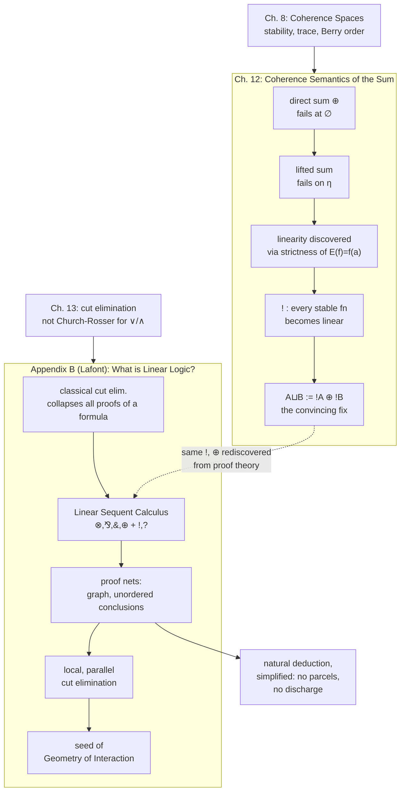

[[book-guidelines|↩ Back to guidelines]]

# Linear Logic

Linear logic is unusual among the book's topics in having two independent origin stories, arrived at by two different authors chasing two different bugs. Girard finds it in Chapter 12 while trying to give a *denotational* semantics to the sum type, and hits a wall that only a new logical primitive can patch. Lafont, in Appendix B, finds the same connectives from a completely different direction — a *proof-theoretic* pathology in classical logic's cut elimination — with no reference to coherence spaces at all. That two unrelated investigations converge on the same four connectives and the same "!"/"?" pair is the strongest evidence in the book that linear logic isn't an arbitrary variant logic somebody invented for fun; it's something that was already there, underneath both ordinary implication and classical proof theory, waiting to be noticed. This article follows both roads, in the order the book presents them: the semantic discovery first, then the formal system it turns out to be.

## The problem: coherence spaces can't see disjoint union

[[Coherence-Space-Semantics|Chapter 8]] built products for free: $A \mathbin{\&} B$ (there called the direct product) just glues two webs together with cross-coherence, and stable functions out of it correspond exactly to pairs of stable functions out of $A$ and $B$ — no surprises. Chapter 12 tries the dual move for the sum type $A + B$ (the semantic reading of the disjunction $\lor$), and it does *not* go smoothly.

The obvious candidate is the **direct sum**: take the disjoint union of the webs, $|A \oplus B| = \{1\} \times |A| \cup \{2\}\times|B|$, cohere tokens exactly as they cohered on their own side, and make tokens from different sides always incoherent. Domain-theoretically this is the disjoint union with the two "undefined" elements identified — the coherence-space axioms force $\varnothing \in A$ and $\varnothing \in B$ both to exist, and there's only one empty set, so $\varnothing$ has to serve as the undefined object of *both* summands at once. Every point of $A\oplus B$ is uniquely $\mathrm{Inj}_1(a)$ or $\mathrm{Inj}_2(b)$ — except at $\varnothing$, where $\mathrm{Inj}_1(\varnothing) = \mathrm{Inj}_2(\varnothing) = \varnothing$.

That single collision is fatal. Case elimination (the $\delta$ scheme — pattern-matching on a sum, the semantic image of `match x { Left(a) => f(a), Right(b) => g(b) }`) wants a function $H$ defined by

$$H(\mathrm{Inj}_1(a)) = F(a) \qquad H(\mathrm{Inj}_2(b)) = G(b)$$

for arbitrary stable $F: A\to C$ and $G: B \to C$. At $\varnothing$ this demands $H(\varnothing) = F(\varnothing) = G(\varnothing)$ — but $F$ and $G$ are two independent functions with no reason whatsoever to agree on their least value. **What breaks without a fix**: the moment your $\delta$-eliminator needs to inspect *no* information yet, coherence spaces can't tell which branch's "no information" you're in, because both branches share the one undefined point. It's the exact semantic shadow of implementing a tagged union without ever actually storing the tag — a Rust `enum { Left(A), Right(B) }` compiled down to a bare union with the discriminant erased. Two different functions could disagree on what an all-zero bit pattern means, and there'd be no way to ask which one you meant.

## Patch #1 — tagging fixes casewise definition, but not identity

The direct fix is to put the tag back: form $A \sqcup B$ by adding two extra tokens, $1$ and $2$, where $1$ coheres with every $(1,\alpha)$ but nothing on the $B$ side, and symmetrically for $2$. Now $q_1(a) = \{1\}\cup \mathrm{Inj}_1(a)$ and $q_2(b) = \{2\}\cup\mathrm{Inj}_2(b)$ are genuinely distinct at every input, including $\varnothing$'s image $q_1(\varnothing)=\{1\}$ vs. $q_2(\varnothing)=\{2\}$, and casewise definition works cleanly:

$$H(q_1(a)) = F(a) \qquad H(q_2(b)) = G(b) \qquad H(c) = \varnothing \text{ if } c\cap\{1,2\}=\varnothing$$

This correctly interprets both of the standard $\beta$-like conversions, $\delta x.u\, y.v\,(\iota_1 r) \rhd u[r/x]$ and its mirror. But down-closure in a coherence space is unforgiving: if $q_1(a)$ is a legal point, so is every subset of it, including subsets that contain fragments of $a$ but *not* the tag $1$ itself — partial information "from the left side" that hasn't yet committed to announcing it's from the left side. On exactly those tag-less, side-committed partial points, the book's own test equation

$$\delta x.\,(\iota_1 x)\; y.\,(\iota_2 y)\; t = t$$

(match-and-immediately-re-inject is the identity — an eta-like law for sums) fails, holding only on points of the shape $q_1(a)$, $q_2(b)$, or $\varnothing$. Girard is explicit that this is a matter of principle, not convenience: "we are not looking for a model at any price, but for a convincing one" — a minor equation left un-modeled is still evidence of a real gap between syntax and semantics, worth chasing rather than shrugging off.

## Patch #2 — abandon coherence spaces (rejected on cost)

There *is* a semantics that gets everything right: keep only $q_1(a)$, $q_2(b)$, and $\varnothing$ as points of $A\sqcup B$, nothing else. But that set is no longer down-closed as a subset relation ($q_1(\alpha) = \{1,(1,\alpha)\}$ is a point while its subset $\{(1,\alpha)\}$ alone is not), so it isn't a coherence space at all — it needs an extra partial order on tokens (Berry and Winskel's **event structures**, the **dI-domains**), where $1 < (1,\alpha)$ records "if this token is present, that one must be too." It works, and it even gives a clean alternative account of the lazy naturals from Chapter 9 ($\mathrm{Int}^{<} \simeq \mathrm{Emp}\sqcup\mathrm{Int}^{<}$). But it costs the conceptual simplicity of coherence spaces, and worse, it's **not associative**: $(A\sqcup B)\sqcup C$ and $A \sqcup (B \sqcup C)$ are genuinely different event structures. A connective that can't be re-parenthesized without changing meaning is a bad sign for something meant to be a basic logical operation, and Girard sets this fix aside to keep looking.

## The actual discovery: linearity as strictness, generalized

The move that works starts from an observation about a completely ordinary function: application. Fix $a \in A$ and consider $E(f) = f(a)$, a function from $A\to B$ to $B$. Computing its trace ([[Coherence-Space-Semantics|the least-witness structure from Chapter 8]]) turns up something distinctive: every witness in $\mathrm{Tr}(E)$ is a **singleton** $\{(a^\circ,\beta)\}$ for some finite $a^\circ \subseteq a$. Compare this to a general stable function, whose trace elements can be *any* finite set of witnesses — $E$'s witnesses are always exactly one piece of information, never a bundle of several that jointly justify an output.

Girard names this property **linear**: a stable $F: A \to B$ is linear when every element of $\mathrm{Tr}(F)$ is a singleton $\{\alpha\}$. Unpacking what that buys you gives two clean preservation laws:

$$
\text{(i)}\ F(\varnothing) = \varnothing \qquad\qquad
\text{(ii)}\ a_1 \cup a_2 \in A \implies F(a_1\cup a_2) = F(a_1)\cup F(a_2)
$$

(i) says a linear function is genuinely **strict** — it can't produce output from zero input, unlike an ordinary stable function which might commit to output the instant it sees *any* finite fragment. (ii) says it **preserves unions of compatible points**, not merely directed unions the way plain continuity does — this is the same shape of law as a module homomorphism preserving addition, which is exactly why the word "linear" was reached for. Both together characterize linearity outright: if $F$'s least witness for some $\beta$ were not a singleton, you could split it into two smaller compatible pieces by (ii) and get a strictly smaller witness, contradicting minimality — so every least witness *must* be a singleton.

This is worth pausing on, because it is the article's central idea and everything downstream is built from it: **ordinary application is already linear**. Linearity isn't a strange restriction bolted onto functions from the outside; it's a phenomenon that was already present in the simplest possible construction (evaluating a function at a fixed argument), and Chapter 12's entire task becomes finding the general framework this phenomenon lives in.

> **What breaks without linearity as a separate notion.** Without isolating it, you're stuck with only two options for any function space: fully general stable functions (which is what caused the sum-type collision above) or nothing. Linear functions turn out to be exactly the right *intermediate* notion — strict enough to fix the casewise-definition problem, but general enough that (as the next section shows) every stable function reduces to one.

## Linear implication and linear negation

Discarding the now-redundant singleton braces gives a leaner trace, $\mathrm{Tr}_{\mathrm{lin}}(F) = \{(\alpha,\beta) : \beta \in F(\alpha)\}$, and the space of these traces forms a coherence space $A \multimap B$ (**linear implication**, printed in the book as the multimap arrow $\multimap$), with web $|A|\times|B|$ and a coherence relation built from two clauses: a coherent pair of inputs must map to a coherent pair of outputs, *and*, sharpened, an incoherent pair of outputs must trace back to an incoherent pair of inputs. That second clause is the interesting one — it says $A \multimap B$ carries a built-in **antisymmetry**.

Make that antisymmetry a connective in its own right: define $A^{\perp}$ (**linear negation**) as the same web with the coherence relation flipped, $\alpha \smile \alpha' \pmod{A^\perp} \iff \alpha \not\smile \alpha' \pmod{A}$ (or $\alpha=\alpha'$). Then swapping the pair, $(\alpha,\beta)\mapsto(\beta,\alpha)$, is literally an isomorphism $A \multimap B \cong B^\perp \multimap A^\perp$. Girard's own gloss: a linear function consuming an $A$ and producing a $B$ is, dually, the same data as something consuming a "$B$ un-produced" ($B^\perp$) and producing an "$A$ un-consumed" ($A^\perp$) — **exactly transposition in linear algebra**, not inversion. This is the first hard evidence that the word "linear" earns its keep beyond a naming pun: linear implication really does behave like a linear map between vector spaces, right down to having a well-behaved transpose.

**Grounding.** Ordinary Rust ownership gives a genuinely useful, if imperfect, feel for this. A value `T` you own and must eventually consume exactly once is close to a linear resource; a linear function `fn(T) -> U` is one that is *forced* to look at its argument's actual content (it can't ignore `T` — there's no way to discard an owned value silently and still typecheck the way `!A`-style reuse will allow below) and can't inspect it twice either. The honest caveat: Rust's discipline is **affine**, not linear — it's completely legal to drop a `T` without using it (implicit weakening is free), only *duplicating* it without `Clone` is forbidden (contraction is what's actually policed). True linear logic bans both directions equally; Rust only bans one. Keep this distinction in mind — it resurfaces below with the exponential.

## Linearisation: turning any function into a linear one

The payoff arrives with a second connective, "$!A$" — read **"of course $A$"**. Its web is the set of *finite* points of $A$, $|{!A}| = A_{\mathrm{fin}}$, coherent whenever their union stays a point of $A$: $a_1 \smile a_2 \pmod{!A} \iff a_1 \cup a_2 \in A$. There's a canonical (but decidedly non-linear) function $A \to {!A}$, $a \mapsto {!a} = \{a^\circ \subseteq a : a^\circ \text{ finite}\}$ — collect *all* the finite approximants of $a$ into one bundle.

The theorem that makes this worth building is:

$$A \to B \;\cong\; {!A} \multimap B$$

Every stable function is linear — **once you change the source to $!A$**. Concretely: given stable $F: A\to B$, define $\mathrm{Lin}(F): {!A}\multimap B$ by $\mathrm{Trlin}(\mathrm{Lin}(F)) = \mathrm{Tr}(F)$, satisfying $\mathrm{Lin}(F)(!a) = F(a)$; going the other way, any linear $G: {!A} \multimap B$ gives back a stable $\mathrm{Delin}(G): A \to B$ by $\mathrm{Delin}(G)(a) = G(!a)$, and the two operations are mutually inverse. (Categorically: $!$ is left adjoint to the forgetful functor from linear maps back to stable maps.)

Read operationally, $!A$ is "as much of $A$ as you like, packaged as a single reusable bundle you're allowed to inspect a finite piece of, discard entirely, or dip into more than once" — precisely the two structural rules linear logic just threw away (weakening: use zero times; contraction: use more than once), now living openly inside a type rather than silently available on every hypothesis. Ordinary function application $A\to B$ was never *not* linear; it was linear-in-a-reusable-argument all along, and $!$ is the connective that names the reusability explicitly. This is also the moment the Rust affine/linear caveat above resolves cleanly: `T` (owned, move-only) is the linear resource $A$; `!A`-style reuse is what you get by converting to something `Copy`, or wrapping in `Rc<T>`/`&T` — a single act of "I am now willing to be inspected finitely and shared or dropped arbitrarily" that mirrors exactly the move from $A$ to $!A$.

```rust
// A linear function must consume its argument exactly once — the
// type system enforces this only when T is *not* Copy/Clone-able
// on demand, i.e. when T behaves like a bare linear resource `A`.
fn consume_once(t: OwnedBuffer) -> Report {
    // must use `t` — can't silently drop it (well: Rust *does*
    // allow silent drop, so this is affine, not linear — see caveat).
    Report::from(t)
}

// "!A": promote a linear resource into a reusable one. This one
// conversion is the whole content of the of-course modality —
// after this point the value can be inspected zero, one, or many
// times, exactly like the coherence-space `a ↦ !a` bundling every
// finite approximant of `a` into one revisitable object.
fn linearize<T: Clone>(t: &T) -> impl Fn() -> T + '_ {
    move || t.clone()
}
```

## Closing the loop: the linearised sum, and tensor with its units

Chapter 12 now has exactly the tool it needs. Redefine the sum using *both* new connectives together:

$$A \sqcup B := {!A} \oplus {!B}$$

with $q_1(a) = \{1\}\times{!a}$, $q_2(b)=\{2\}\times{!b}$. Casewise definition is now conflict-free by construction: given stable $F: A\to C$ and $G: B\to C$, set $H(\{1\}\times\mathcal{A}) = \mathrm{Lin}(F)(\mathcal{A})$ and $H(\{2\}\times\mathcal{B}) = \mathrm{Lin}(G)(\mathcal{B})$. Because $\mathrm{Lin}(F)$ and $\mathrm{Lin}(G)$ are both linear, both satisfy $\mathrm{Lin}(-)(\varnothing) = \varnothing$ automatically — the collision that started this whole chapter is gone, not patched around. And this time the previously-failing identity law genuinely holds everywhere: $\mathrm{Lin}(q_1)$ is the unique linear solution of $F(!a) = \{1\}\times !a$, so $\delta x.(\iota_1 x)\,y.(\iota_2 y)\,t = t$ checks out on *every* point, not just the tagged ones. The fix isn't just adequate — it's the first one that's actually **convincing**, in Girard's sense.

$\oplus$ and $!$ turn out to be logical operations in their own right — "$\oplus$" is the truly disjunctive part of the sum, and "$!$" is the reusability the arrow always secretly needed. One more connective rounds out the picture: the **tensor product** $A\otimes B$, tokens $\langle\alpha,\beta\rangle$ coherent exactly when both components cohere separately — the "graph product," dual to $\&$ the way $\oplus$ is dual to the direct product. Its dual under linear negation is called **par**, written $A\mathbin{⅋}B$, and linear implication now factors cleanly through it:

$$A\multimap B \;=\; A^\perp \mathbin{⅋} B \;=\; (A\otimes B^\perp)^\perp$$

Four binary connectives, four units — $0,\top$ for $\oplus,\&$ and $1,\bot$ for $\otimes, ⅋$ — though for coherence spaces specifically they collapse pairwise into just $\mathrm{Emp}$ ($0=\top$) and $\mathrm{Sgl}$ ($1=\bot$), the empty and one-token spaces already seen in Chapter 8. With that, the semantic story is finished — and Girard's own closing line of the chapter, "all this is side-tracking us, towards linear logic," is the hinge into Appendix B: everything above was discovered as a fix to one specific denotational bug, but it turns out to be a whole logic.

## A second, independent road: classical cut elimination is not Church-Rosser

Lafont's Appendix B arrives at the same connectives with zero reference to coherence spaces, starting instead from a purely proof-theoretic complaint about **classical logic**. [[The-Curry-Howard-Isomorphism|Curry-Howard]] reads intuitionistic proofs as algorithms — a proof of $\exists n.\,P(n)$ hands you an actual witness $n$. Classical logic has no such reading: "classical logic has no denotational semantics, except the trivial one which identifies all the proofs of the same type," and the reason is [[Sequent-Calculus-and-Cut-Elimination|cut elimination]] itself failing to be confluent.

Here's the concrete pathology. Suppose a cut's cut-formula $C$ was introduced by weakening on *both* sides:

$$\dfrac{\vdots\atop A\vdash B}{\dfrac{A\vdash C, B}{}}\;RW \qquad\qquad \dfrac{\vdots\atop D\vdash E}{\dfrac{D,C\vdash E}{}}\;LW \qquad\qquad \dfrac{A\vdash C,B \qquad D,C\vdash E}{A,D\vdash B,E}\;Cut$$

Standard cut elimination reduces this by peeling weakening from *whichever side you look at first* — reduce the left first and you land on the left subproof padded with weakenings; reduce the right first and you land on the right subproof instead. **Two genuinely different reduction paths from one proof.** Push this to its sharpest form: cut two *arbitrary* proofs $\pi,\pi'$ of the same conclusion $B$ together through a weakening-then-contraction detour (right-weaken $\pi$, left-weaken $\pi'$, cut on $B$, then contract). Depending on which side you eliminate first, this reduces back down to *either* $\pi$ *or* $\pi'$ — but the detour itself, $\vdash B$ over a double bar, "is essentially nothing," so $\pi$ and $\pi'$ are shown to be reductions of one and the same proof, forcing them **denotationally equal**. This holds for *any* two proofs of *any* formula: classical logic identifies all proofs of the same sequent. Not logically inconsistent ($\bot$ still isn't provable) but **algorithmically** inconsistent — there's nothing left to distinguish one proof-as-program from another. (Joyal's version of the same fact, cited by Girard: any cartesian closed category with an initial object $0$ satisfying $0^{0^A}\cong A$ collapses to a poset.)

Two ways out present themselves: make the calculus **asymmetric** (that's intuitionistic logic, already the book's home base since Chapter 1), or **forbid the structural rules except exchange** — weakening and contraction, the very rules that created the two divergent reduction paths above. That second option is linear logic, arrived at for a reason with no mention of coherence spaces, sum types, or Chapter 12 at all.

## Building Linear Sequent Calculus from scratch

Drop weakening and contraction; keep identity, cut, and exchange (harmless — it only reorders, never duplicates or discards). The ordinary rule for $\land$ turns out to secretly *need* weakening (Chapter 13's cut-elimination proof for $\land$ uses it), so a single conjunction can no longer do the job. Linear logic needs **two**:

$$\dfrac{A,C,D\vdash B}{A,C\otimes D\vdash B}\;L\otimes \qquad \dfrac{A\vdash C,B \qquad A'\vdash D,B'}{A,A'\vdash C\otimes D,B,B'}\;R\otimes$$

$$\dfrac{A,C\vdash B}{A,C\mathbin{\&}D\vdash B}\;L_1\mathbin{\&} \qquad \dfrac{A,D\vdash B}{A,C\mathbin{\&}D\vdash B}\;L_2\mathbin{\&} \qquad \dfrac{A\vdash C,B \qquad A\vdash D,B}{A\vdash C\mathbin{\&}D,B}\;R\mathbin{\&}$$

The difference is exactly where the *context* goes. $R\otimes$ **splits** the context between its two premises ($A$ and $A'$ don't overlap) — building a $\otimes$ genuinely spends two separate, disjoint bundles of resources. $R\mathbin{\&}$ makes both premises share the **same** context $A$ — proving $C\mathbin{\&}D$ only ever costs as much as proving one of them, because the opponent (not the prover) gets to pick which. In Rust terms: $\otimes$ is a struct built by moving two independently-owned values into two fields, total cost additive; $\mathbin{\&}$ is closer to a value that offers two accessor methods over one shared piece of owned state, where calling either consumes it, but you only ever call one.

$⅋$ (par, dual of $\otimes$) and $\oplus$ (plus, dual of $\mathbin{\&}$) get symmetric left/right rules — Lafont avoids writing them out twice by switching to **one-sided sequents**, via **linear negation**: every atom gets a positive form $A$ and a negative dual $A^\perp$, negation extends by de Morgan laws

$$(A\otimes B)^\perp = A^\perp \mathbin{⅋} B^\perp \qquad (A\mathbin{\&}B)^\perp = A^\perp\oplus B^\perp \qquad (A\oplus B)^\perp = A^\perp\mathbin{\&}B^\perp \qquad (A⅋B)^\perp = A^\perp\otimes B^\perp$$

and is involutive ($A^{\perp\perp}=A$) but is **not itself a connective** — $(A\otimes B^\perp)^\perp$ is just meta-notation for $A^\perp ⅋ B$, conventionally abbreviated $A\multimap B$. A two-sided sequent $A_1,\dots,A_n \vdash B_1,\dots,B_m$ becomes the one-sided $\vdash A_1^\perp,\dots,A_n^\perp,B_1,\dots,B_m$, collapsing every left/right rule pair into one right rule:

$$\dfrac{\vdash C,A \quad \vdash D,B}{\vdash C\otimes D,A,B}\;\otimes \qquad \dfrac{\vdash C,D,A}{\vdash C⅋D,A}\;⅋ \qquad \dfrac{\vdash C,A \quad \vdash D,A}{\vdash C\mathbin{\&}D,A}\;\mathbin{\&} \qquad \dfrac{\vdash C,A}{\vdash C\oplus D,A}\;1\oplus \quad \dfrac{\vdash D,A}{\vdash C\oplus D,A}\;2\oplus$$

Units follow the same pairing: $1^\perp=\bot$, $\bot^\perp=1$, $\top^\perp=0$, $0^\perp=\top$, with $\vdash 1$ an axiom, $\vdash A \Rightarrow \vdash \bot,A$, $\vdash \top,A$ always provable — and pointedly, **no rule for $0$ at all**, the proof-theoretic mirror of $\mathrm{Emp}$ never being an initial object back in Chapter 12's opening footnote.

### The exponentials: weakening and contraction, back under a type

Structural rules return, but only for formulas explicitly marked reusable — $!A$ ("of course $A$") and $?A$ ("why not $A$"), duals of each other via $(!A)^\perp = {?A^\perp}$:

$$\dfrac{\vdash B, {?A}}{\vdash {!B}, {?A}}\; ! \qquad \dfrac{\vdash A}{\vdash {?B},A}\;W? \qquad \dfrac{\vdash {?B},{?B},A}{\vdash {?B},A}\;C? \qquad \dfrac{\vdash B,A}{\vdash {?B},A}\;D?$$

Promotion ($!$) is the load-bearing restriction: you may only box a conclusion as reusable if **every other formula still in the sequent is already boxed reusable too** — you can't smuggle a linear, use-once resource inside a "reuse me freely" wrapper. $W?$ and $C?$ are exactly weakening and contraction, now legal *only* on ?-marked formulas. $D?$, **dereliction**, is the embedding of a plain resource into a reusable one — equivalent to the axiom $B\multimap {?B}$ (dually $!B\multimap B$) — the exact proof-theoretic image of `.clone()`-ing a `T` into something `Rc`-shareable, or the coherence-space map $a\mapsto{!a}$ from earlier. **Lean has no built-in analogue of this pair at all**: its context judgment $\Gamma \vdash e : A$ is fully structural — every hypothesis is silently weakenable and contractable, meaning Lean's entire type theory sits on the "everything is $?$-boxed" side of this picture, with no native way to force single use. A genuinely linear fragment inside Lean needs a bolted-on discipline layered over the kernel, which is precisely the job Rust's borrow checker does *outside* the term language for its own (affine) fragment.

Everything assembles into a clean decoding of intuitionistic logic straight into linear logic:

$$A\land B = A\mathbin{\&}B \qquad A\lor B = {!A}\oplus{!B} \qquad A\Rightarrow B = {!A}\multimap B \qquad \neg A = {!A}\multimap 0$$

The middle two are not new: $A\lor B = {!A}\oplus{!B}$ is *literally* the linearised sum from Chapter 12.5, and $A\Rightarrow B = {!A}\multimap B$ is *literally* the identity $A\to B \cong {!A}\multimap B$ from Chapter 12.4 — this is the moment the two origin stories are shown to be the same story. (Dereliction also gets a reading here: it's exactly what proves $B\Rightarrow B$.)

## Proof nets: throwing away the bookkeeping

Restricting to the **multiplicative fragment** ($\otimes,1,⅋,\bot$ — the only fragment where every rule's context passes through conservatively, i.e. the conclusion's context is just the disjoint union of the premises' contexts, unlike $\mathbin{\&}$ and $\top$), sequent proofs turn out to carry a lot of dead weight: rules like

$$\dfrac{\vdash C,D,\underline{A}}{\vdash C⅋D,\underline{A}}$$

rewrite the passive context $A$ unchanged at every single step, purely because sequent calculus insists on a strict left-to-right derivation order. Two derivations that differ only in *which* independent rule got applied first are, semantically, the same proof wearing two different outfits — Lafont works exactly this example: $\vdash A,A^\perp$ and $\vdash B,B^\perp$ combined by $\otimes$ then combined with $\vdash C,C^\perp$ by another $\otimes$, then $⅋$'d at the end, gives conclusion $\vdash A^\perp ⅋ B^\perp,\,(A\otimes B)\otimes C,\,C^\perp$ — and a completely different-looking derivation, applying $⅋$ *before* the second $\otimes$, produces the identical conclusion. **Strip out the redundant, order-imposing bookkeeping and what's left is the proof net**: a graph built from three kinds of node — an axiom **link** (produces a dual pair $A,A^\perp$ directly), a **cut** (joins $A$ to $A^\perp$, symmetric, slated for removal), and one node per logical rule ($\otimes$, $⅋$, $1$, $\bot$). Every formula is the conclusion of exactly one node and the premise of at most one; the un-consumed formulas are the net's **conclusions**, and — this is the entire point — **they carry no order**.

![[linear_logic_proofnets.svg]]

The construction is inductive and mirrors the one-sided rules exactly: links are nets; if $A$ concludes net $\nu$ and $A^\perp$ concludes net $\nu'$, joining them by a cut is a net; if $A$ concludes $\nu$ and $B$ concludes $\nu'$, joining by a $\otimes$-node is a net; if $A$ *and* $B$ **both** conclude the *same* net $\nu$, joining by a $⅋$-node is a net; $1$ alone is a net; capping any net's conclusion with $\bot$ is a net.

Not every graph you can scribble this way is legitimate, though — Lafont's counterexample is a structure with conclusions $A^\perp$, $A⅋B$ (fed by two *separate* axiom links for $A$ and $B$, wired as if they'd come from the same subproof) and $B^\perp$: it typechecks locally at every node but is not, in fact, buildable by the inductive rules above, and fails the (Girard's own) **long trip condition**, a correctness criterion that walks the graph and checks it traces out a single, consistent global path — needed because $\otimes$ and $⅋$ nodes look locally identical to a naive graph-matcher but encode genuinely different global constraints (split context vs. shared conclusion-net). The criterion is only known to work cleanly for the $(\otimes,⅋,1)$ sub-fragment.

## Local, parallel cut elimination

This is where proof nets stop being merely a tidier notation and start doing real work. Rewriting a cut is **purely local** graph surgery, in exactly two shapes plus a degenerate case:

![[linear_logic_cut_elimination.svg]]

An axiom link with one leg immediately cut just wires the other side of the cut straight through and disappears — cutting against an identity is a no-op. A cut between $A\otimes B$ (fed by two separate sub-nets, one producing $A$, one producing $B$) and $A^\perp ⅋ B^\perp$ (fed by a single sub-net concluding both duals) splits into **two independent smaller cuts**, $A/A^\perp$ and $B/B^\perp$, each reconnecting straight into whichever sub-nets used to feed the original nodes. $1$ cut against $\bot$ just vanishes — neither has any premises to reconnect.

Two propositions carry the whole payoff. First, these rewrites **preserve proof-net-ness** (provable either by tracking that they mirror genuine sequent-calculus reductions, or directly via the long trip condition). Second — and this is the part classical logic in Appendix B.1 conspicuously could *not* deliver — **every proof net reduces to a unique cut-free net**: termination is immediate (size strictly decreases every step), and confluence follows because the only possible overlapping redexes are two disjoint axiom-cut collisions or two ends of the same shrinking cut, both trivially checkable by hand. Girard's worked example (a net built from $(A\otimes B)\otimes C$ cut against $A^\perp⅋B^\perp$, alongside separate atomic links for $C,C^\perp$ and $B^\perp,A^\perp$) takes exactly three applications of the ⊗/⅋ rule to bottom out at a net with **no logical nodes left at all** — just atomic axiom links directly wiring each positive atom occurrence to its dual. A cut-free net over atomic conclusions *is* nothing more than an **involutive permutation**, matching every atom occurrence to the occurrence of its negation.

The clause that matters most for how this differs from ordinary sequent-calculus cut elimination: **cuts can be eliminated in any order — cut elimination on proof nets is a parallel process**, not a sequential one. Sequent-calculus reduction has to respect the tree shape of the derivation (you reduce a cut only once its neighbors are in the right form); a proof net has no such tree to respect, because the whole point of building it was to throw the derivation-order bookkeeping away. This composability is what lets the permutation reading do something extra: instead of eliminating a cut by rewriting, you can *compose the two permutations directly* and iterate — Lafont flags this "turbo" mechanism explicitly as the seed of the later **geometry of interaction** program, generalizing proof nets past the multiplicative fragment by working entirely with these composed permutations. That's flagged as future direction beyond this book's own scope, not developed further here.

```python
# A small, literal illustration of "any order gives the same normal
# form": local graph rewrites applied in different orders to the
# same starting multiset of redexes still converge, because each
# rewrite only ever touches its own two neighbors.
edges = {("A","A_perp"): "cut", ("B","B_perp"): "cut"}  # toy: two
# independent axiom/cut pairs, standing in for the two smaller cuts
# a real ⊗/⅋ split produces above.

def step(edges, pick):
    (u, v) = pick
    del edges[(u, v)]          # axiom·cut -> nothing, wired away
    return edges

import random
order_a = list(edges.items()); order_b = list(reversed(order_a))
for order in (order_a, order_b):
    e = dict(edges)
    for (k, _) in order:
        e = step(e, k)
    assert e == {}   # both orders reach the same (empty) normal form
```

## Proof nets are natural deduction, done right

Lafont's closing observation ties the whole appendix back to [[Natural-Deduction|the book's very first formal system]]: proof nets *are* the natural deduction of linear logic, with two simplifications that ordinary natural deduction never gets to make. **Linearity removes the need for parcels of hypotheses** — ordinary natural deduction has to track *which occurrences* of a discharged hypothesis a subproof depends on, because a hypothesis might be used many times or not at all; in a proof net, every hypothesis is used exactly once by construction, so there's nothing to track. **Linear negation removes the need for discharge or a separate elimination rule** — because $A\multimap B$ is just $A^\perp ⅋ B$, introduction and elimination are the same node read in two directions:

$$\dfrac{\dfrac{[A]}{\vdots}}{B}\;{\Rightarrow}I \;\rightsquigarrow\; \dfrac{A^\perp \quad B}{A^\perp ⅋ B} \qquad\qquad \dfrac{A\Rightarrow B \quad A}{B}\;{\Rightarrow}E \;\rightsquigarrow\; \dfrac{A\quad B^\perp}{A\otimes B^\perp}\ \ B$$

which shows, in Lafont's own words, that **modus ponens is written upside down**. It's a genuinely satisfying closing image for a book organized entirely around Curry-Howard: the introduction/elimination asymmetry that natural deduction has carried since [[Natural-Deduction|Chapter 2]] turns out to be an artifact of ordinary implication specifically, not a structural necessity of proof theory — strip implication down to its linear core and the asymmetry dissolves.

## Where this leads



Structurally, this topic is the book's one clean example of a construction discovered twice, from opposite directions, and shown to coincide exactly — the linearised sum of §12.5 and the intuitionistic-into-linear translation of §B.2 are not analogous, they are *the same formula*. For the standing project this vault is built around: the affine-vs-linear distinction flagged early (Rust permits weakening for free, blocks contraction without `Clone`) is worth carrying forward explicitly as the precise vocabulary for *why* move semantics behaves the way it does, and dereliction/promotion (`?`/`!`) is the cleanest available proof-theoretic account of the `Clone`/`Rc`/`&` boundary a Rust verifier would need to reason about formally. Separately, proof nets' local, order-independent, provably-confluent rewriting is a genuinely useful mental model for a checker or elaborator that wants to discharge many independent proof obligations without committing to an arbitrary sequential order — the same shape of guarantee Chapter 13's [[Sequent-Calculus-and-Cut-Elimination|sequential]] Hauptsatz had to work much harder for, and never fully got (cut elimination there stays sequential and hyperexponential in the worst case). Linear logic itself isn't a direct prerequisite for the unification/elaboration thread this vault otherwise tracks — Lean's own type theory, as noted above, doesn't have a linear fragment — so treat it as a structural, not mechanistic, dependency: the clearest available lens on *why* resource-sensitive reasoning needs its own connectives, one level below the ordinary $\to$ this whole book has used everywhere else.
