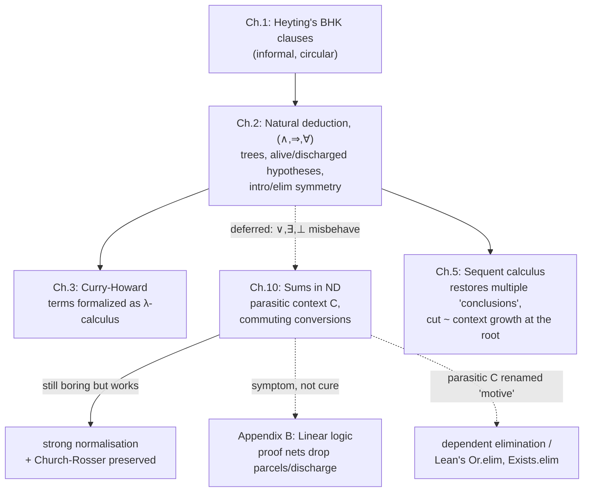

[[book-guidelines|↩ Back to guidelines]]

# Natural Deduction

## From Heyting's clauses to an actual formal system

Chapter 1 ended with Heyting's BHK clauses — "a proof of $A\land B$ is a pair," "a proof of $A\Rightarrow B$ is a function" — and a confession that they can't quite stand as a foundation, because clauses like "a proof of $A\Rightarrow B$ is a function from every proof of $A$ to a proof of $B$" quietly quantify over an ill-defined totality ("every proof of $A$"). Natural deduction is Girard's fix: instead of *describing* what a proof of $A\Rightarrow B$ is, write down the actual finite syntactic rule that *builds* one, so that "proof" stops being a philosophical gesture and becomes a piece of data you can inspect, a tree with a definite shape.

Girard picks Prawitz's natural deduction over Gentzen's sequent calculus (which does not appear until Chapter 5) precisely because natural deduction's *computational* meaning is more transparent, even though its symmetries are visually messier. That trade-off is explicit in the chapter's opening lines: natural deduction is "limited to the intuitionistic case" and "only satisfactory" for the $(\land,\Rightarrow,\forall)$ fragment — disjunction and existence, despite being "the two most typically intuitionistic connectors," are deferred all the way to Chapter 10, because the fragment they live in genuinely misbehaves. This article follows the book's own two-pass structure: the clean core system first (Chapter 2), then the return trip to patch in $\bot$, $\lor$, $\exists$ once you can see exactly what breaks (Chapter 10).

## Deductions as trees: hypotheses alive and discharged

A deduction of $A$ is written as a finite tree ending in $A$ at the root, with formulas labeling the leaves. Each leaf is in one of two states:

- **alive** — an active hypothesis, still doing work in the proof;
- **dead / discharged** — a hypothesis that has been *used up* and no longer counts as an assumption of the finished deduction.

The base case is a one-node tree: the rule "Hypothesis" lets you write down a bare deduction consisting of a single leaf $A$, which is simultaneously the leaf and the root. It proves nothing hard — $A$ was just assumed — but it's the seed every larger tree grows from.

The rule that makes "dead" hypotheses concrete is $\Rightarrow I$:

$$
\dfrac{\begin{matrix}[A]\\ \vdots \\ B\end{matrix}}{A \Rightarrow B}\ {\Rightarrow}I
$$

Read this as: take a deduction of $B$, pick out *some* (possibly zero, possibly many — "0, 1, 250, …") of the occurrences of $A$ among its hypotheses, and discharge exactly those. The result is a deduction of $A\Rightarrow B$ in which the chosen $A$'s are crossed out, no longer counted as live hypotheses of the new deduction — though other, un-chosen occurrences of $A$ may survive, still alive.

**What breaks without discharge tracking.** Girard flags this himself: to make sense of the picture you have to remember, for every crossed-out hypothesis, *which* application of $\Rightarrow I$ killed it — you have to draw a link from the dead leaf back up to the $\Rightarrow I$ line that discharged it. But a genuine tree has no such cross-edges; each node has exactly one parent. So natural deduction's "tree" is, in Girard's words, only "a graphical illusion" — a pleasant one, but the discharge bookkeeping is really extra structure riding on top of the tree shape, not something the tree shape gives you for free.

This is the earliest, most literal ancestor of the typing judgment $\Gamma \vdash A$ that every later type-theoretic system in this book (and in Lean, and in a Hindley–Milner or bidirectional checker) will use. $\Gamma$ is exactly "the currently-alive hypotheses"; extending $\Gamma$ is exactly what happens under a still-live $[A]$; and discharge — crossing out a whole parcel of hypotheses at once — is exactly what a checker does when it pops a scope. A minimal sketch of that bookkeeping:

```python
# A hypothesis "parcel": one logical assumption, possibly used more than once,
# tracked by identity so that discharging it removes every live occurrence at once.
class Parcel:
    def __init__(self, formula):
        self.formula = formula
        self.alive = True

def discharge(ctx, parcel):
    # ⇒I: kill every live occurrence of this parcel in one shot
    parcel.alive = False
    return [p for p in ctx if p is not parcel or not p.alive]
```

```rust
// The same idea, but shaped like the context a real typechecker threads through
// recursive calls: a stack of (name, formula) pairs, pushed on entering the
// scope of a hypothesis and popped — discharged — on leaving it.
struct Context(Vec<(VarId, Formula)>);

impl Context {
    fn with_hypothesis<T>(&mut self, x: VarId, a: Formula, f: impl FnOnce(&mut Self) -> T) -> T {
        self.0.push((x, a));       // hypothesis A becomes alive
        let result = f(self);
        self.0.pop();               // ⇒I: discharge it on the way back out
        result
    }
}
```

## Introduction and elimination rules for $(\land, \Rightarrow, \forall)$

Section 2.1.1 lays out the core fragment's rules in one table. All of them except $\Rightarrow I$ simply pool the hypotheses of their sub-deductions:

**Introductions** — build a compound formula from its parts:

$$
\dfrac{A \quad B}{A\land B}\ {\land}I
\qquad\qquad
\dfrac{\begin{matrix}[A]\\ \vdots \\ B\end{matrix}}{A\Rightarrow B}\ {\Rightarrow}I
\qquad\qquad
\dfrac{A}{\forall\xi.\,A}\ {\forall}I
$$

**Eliminations** — take a compound formula apart:

$$
\dfrac{A\land B}{A}\ {\land_1}E
\qquad
\dfrac{A\land B}{B}\ {\land_2}E
\qquad
\dfrac{A\Rightarrow B \quad A}{B}\ {\Rightarrow}E \ \text{(modus ponens)}
\qquad
\dfrac{\forall\xi.\,A}{A[a/\xi]}\ {\forall}E
$$

$\forall I$ carries a side condition — the *eigenvariable condition* — restricting it to the case where $\xi$ is not free in any **live** hypothesis (it's allowed to be free in a dead leaf; once a hypothesis is discharged it can no longer constrain what $\xi$ was allowed to range over). This is the direct ancestor of every scoping restriction on universal/generic quantifiers you'll meet later, including the "the variable must not escape its scope" checks a real typechecker runs for `forall`/generic type parameters.

The rule Girard calls "the fundamental symmetry of the system" is this exact introduction/elimination pairing: every connective gets one shape of rule that builds it and one shape that consumes it, matched precisely. He notes explicitly that this *replaces* a symmetry natural deduction cannot express directly — hypothesis/conclusion symmetry — because a tree, by construction, has many possible leaves but only one root; you can always read off "what was the last rule used" uniquely, which you couldn't if a deduction were allowed several conclusions. (Multiple conclusions is exactly the shape sequent calculus in Chapter 5 restores — and exactly the shape that comes back to bite this fragment in Chapter 10.)

**Reading intro/elim as check/infer.** This symmetry is worth naming for what it structurally *is*: introduction rules are canonical-constructor rules — given the pieces, build the compound, which is precisely the shape of a bidirectional type **checker's** check-mode judgment (you already know the target type $A\land B$, you verify the pieces fit). Elimination rules are destructor rules — given the compound, extract a piece, which is precisely a bidirectional **inference**-mode judgment (the type of $\pi_1 t$ is *synthesized* from the type of $t$, not handed down). A minimal Rust sketch of exactly this split, tracking the fragment's four connectives:

```rust
enum Formula { And(Box<Formula>, Box<Formula>), Implies(Box<Formula>, Box<Formula>), Forall(/* ... */) }

enum Term {
    Var(VarId),
    Pair(Box<Term>, Box<Term>),          // ∧I
    Fst(Box<Term>), Snd(Box<Term>),      // ∧1E, ∧2E
    Lam(VarId, Box<Term>),               // ⇒I
    App(Box<Term>, Box<Term>),           // ⇒E
}

// Elimination forms: type is *inferred* from the subject.
fn infer(ctx: &Context, t: &Term) -> Formula { /* Var, Fst, Snd, App */ todo!() }

// Introduction forms: type is *checked* against an expected formula.
fn check(ctx: &mut Context, t: &Term, expected: &Formula) -> bool { /* Pair, Lam */ todo!() }
```

This isn't a stretch dressed up in modern language — it's literally the shape Section 3.5 of the book will formalize a chapter later as the Curry-Howard bijection, and it's why every bidirectional typechecker you'll ever write (including the one behind a Lean-style elaborator) ends up splitting its cases exactly along Girard's introduction/elimination line.

## Identifying deductions: proof reduction before there's a $\lambda$-calculus

Section 2.2 reads the rules through Heyting semantics: a formula $A$ is the *set of its deductions* ($\delta \in A$ instead of "$\delta$ proves $A$"), and a deduction of $A$ from hypotheses $B_1,\dots,B_n$ behaves like a function $t[x_1,\dots,x_n]$ from proofs of the $B_i$ to a proof of $A$. Getting this correspondence exactly right requires tracking **parcels** of hypotheses: every occurrence of the same formula among the hypotheses that should be treated as *the same* assumption gets the same variable name.

Each rule gets a term-building reading (2.2.1): a bare hypothesis becomes a variable $x$; $\land I$ becomes pairing $\langle u,v\rangle$; $\land_1E/\land_2E$ become projections $\pi_1 t,\pi_2 t$; $\Rightarrow I$ becomes abstraction $\lambda x.\,v$ (discharge *is* binding — the parcel being crossed out is exactly the variable becoming bound); $\Rightarrow E$ becomes application $tu$. Crucially, Girard does **not** yet call this "the $\lambda$-calculus" — that's Chapter 3's job. Here the terms are just notation for reading off what a deduction computes; what matters for this topic is that the equations governing those terms directly identify deductions that look different on paper as *the same proof*:

$$
\pi_1\langle u,v\rangle = u \qquad \pi_2\langle u,v\rangle = v \qquad \langle \pi_1 t,\pi_2 t\rangle = t
$$
$$
(\lambda x.\,v)\,u = v[u/x] \qquad \lambda x.\,tx = t \ \ (x \notin \mathrm{FV}(t))
$$

Section 2.2.2 spells out what this means *at the level of trees, not terms*: a deduction ending $\land I$ then immediately $\land_1E$ is declared equal to the shorter deduction of $A$ you started with — you built a pair only to immediately project it back out, so the pairing was wasted motion. Symmetrically for $\land_2E$. And the $\Rightarrow I$/$\Rightarrow E$ case — the proof-theoretic reading of $\beta$-reduction — says: a deduction that discharges a parcel of $A$-hypotheses via $\Rightarrow I$ and is then immediately fed an argument deduction of $A$ via $\Rightarrow E$ is equal to the deduction obtained by literally **substituting copies of the argument deduction for every occurrence in the discharged parcel**. This is the first appearance, at the tree level, of substitution as *the* mechanism identifying proofs — the exact mechanism the reader's own substitution lemmas (for Hoare-triple soundness, or for `isDefEq` in an elaborator) will be built to preserve.

**Lean makes this literal rather than analogical**, because Lean's kernel reduction *is* this identification, performed on terms instead of trees:

```lean
example (u v : A) (h : (fun x => x) = @id A) : True := by
  -- λx.tx = t is η for functions; Lean accepts it definitionally when x ∉ FV(t)
  trivial

-- (λx. v) u ≡ v[u/x] is exactly what `rfl` certifies here — no proof obligation,
-- just kernel-level reduction:
example (v : Nat → Nat) (u : Nat) : (fun x => v x) u = v u := rfl
```

## Extending the fragment: $\bot$, $\lor$, $\exists$

Chapter 2 stops at $(\land,\Rightarrow,\forall)$ on purpose. Chapter 10 opens by admitting why: "this chapter gives a brief description of those parts of natural deduction whose behaviour is not so pretty... For this fragment, our syntactic methods are frankly inadequate." Three connectors go back in: negation is handled by adding $\bot$ (absurdity) and defining $\neg A := A\Rightarrow\bot$; then $\lor$ and $\exists$ get their own rules.

$$
\dfrac{A}{A\lor B}\ {\lor_1}I
\qquad
\dfrac{B}{A\lor B}\ {\lor_2}I
\qquad
\dfrac{\bot}{C}\ {\bot}E
\qquad
\dfrac{A[a/\xi]}{\exists\xi.\,A}\ {\exists}I
$$

$$
\dfrac{A\lor B \quad \begin{matrix}[A]\\ \vdots \\ C\end{matrix} \quad \begin{matrix}[B]\\ \vdots \\ C\end{matrix}}{C}\ {\lor}E
\qquad\qquad
\dfrac{\exists\xi.\,A \quad \begin{matrix}[A]\\ \vdots \\ C\end{matrix}}{C}\ {\exists}E
$$

(There is, deliberately, no $\bot I$ — absurdity has nothing to introduce it; and $\exists E$ carries the same eigenvariable condition as $\forall I$: $\xi$ must not be free in the hypotheses or the conclusion after the rule is used.)

### The parasitic context problem

Girard's own verdict, in bold relief: "the elimination rules are very bad. What is catastrophic about them is the parasitic presence of a formula $C$ which has no structural link with the formula which is eliminated. $C$ plays the rôle of a context, and the writing of these rules is a concession to sequent calculus."

Look at the contrast with the good fragment. In $\land_1E$, $\land_2E$, $\Rightarrow E$, and $\forall E$, the **conclusion is determined by the eliminated formula alone** — $A\land B$ eliminates to $A$ or $B$, full stop, no free parameter. But $\bot E$, $\lor E$, and $\exists E$ each conclude an *arbitrary* $C$ that has to be supplied from outside and threaded through every branch: $\bot E$ can conclude literally anything; $\lor E$ needs a full sub-deduction of $C$ from *each* disjunct; $\exists E$ needs a sub-deduction of $C$ from the witness hypothesis. $C$ is not a subformula of anything being eliminated — it rides along parasitically.

Why does the rule have to look like this at all? Because $A\lor B$ conceptually has *two* possible conclusions ($A$ or $B$), and natural deduction's tree shape only tolerates a single conclusion per node. Girard puts it plainly: what you'd *like* to write is a deduction with two dangling conclusions, $A$ and $B$, to be reunited later —

$$
\dfrac{A\lor B}{A \quad\quad B}
$$

— but there is no notation for "reunite these two branches downstream," so $\lor E$ is forced to make you commit, on the spot, to the moment and the target $C$ of reunification. That premature commitment is exactly what the parasitic $C$ *is*, and it's exactly what will cause trouble below.

**Grounding this is unusually direct**, because Lean's core eliminators are written with precisely this parasitic parameter, usually renamed *motive*:

```lean
-- Or.elim, Exists.elim, False.elim — Lean's actual signatures, not analogies:
#check @Or.elim     -- {a b c : Prop} → a ∨ b → (a → c) → (b → c) → c
#check @Exists.elim -- {p : α → Prop} {b : Prop} → (∃ x, p x) → (∀ x, p x → b) → b
#check @False.elim  -- {C : Sort u} → False → C
```

The `c`/`b`/`C` in these signatures is Girard's parasitic $C$, under its modern name: the *motive* of the elimination. And that renaming is not cosmetic — inferring the motive when it isn't given explicitly (what happens under the hood every time you write `match` on an inductive with a dependent result type in Lean) is a genuinely hard elaboration problem, because there is, in general, no unique smallest $C$ a unifier can read off the eliminated term alone. That is the 2026-vintage engineering echo of the exact defect Girard is complaining about on page 73 of a 1989 book.

Rust has the same shape without the dependency: a `match` expression's arms are required to unify to one common type, and that common type is nothing but $C$ made concrete:

```rust
enum Either<A, B> { Left(A), Right(B) }

fn or_elim<A, B, C>(e: Either<A, B>, f: impl Fn(A) -> C, g: impl Fn(B) -> C) -> C {
    match e {
        Either::Left(a) => f(a),   // sub-deduction of C from [A]
        Either::Right(b) => g(b),  // sub-deduction of C from [B]
    }
}
```

Rust's borrow checker and type checker never even notice this is unusual, because unifying every arm of a `match` to a single result type is table stakes for the language — which is exactly the point: what Girard is diagnosing as a *defect specific to $\lor,\exists,\bot$* is, from a compiler-engineer's vantage point, just "the normal thing every `match`/`case` construct in every mainstream language has to do." The chapter is really watching the parasitic-context problem get born.

## Chasing the subformula property

Section 10.3 motivates the fix (commuting conversions) by showing exactly where the clean story from the core fragment collapses.

**In $(\land,\Rightarrow,\forall)$, it's clean.** The *Subformula Property* for a normal deduction $\delta$: (i) every formula occurring in $\delta$ is a subformula of a conclusion or a hypothesis of $\delta$; (ii) if $\delta$ ends in an elimination, it has a **principal branch** — a chain $A_0, A_1,\dots,A_n$ where $A_0$ is an undischarged hypothesis, $A_n$ is the conclusion, and each $A_i$ is the *principal premise* of an elimination whose conclusion is $A_{i+1}$ — so in particular $A_n$ is a subformula of $A_0$. The proof is a clean three-case induction: hypothesis (nothing to do), introduction (recurse on the immediate sub-deductions), elimination (the deduction above the principal premise can't end in an introduction in a *normal* deduction, so it ends in an elimination too, extending the principal branch upward).

**In the full fragment, it breaks**, for exactly the reason just diagnosed: an elimination's conclusion $C$ need not be a subformula of its principal premise at all. Girard splits eliminations into **good** ($\land_1E,\land_2E,\Rightarrow E,\forall E$ — conclusion determined by the premise) and **bad** ($\bot E,\lor E,\exists E$ — conclusion is the free parameter $C$), and gives the counterexample directly:

$$
\dfrac{A\lor A \quad\quad \dfrac{[A]\quad[A]}{A\land A}\ {\land}I \quad\quad \dfrac{[A]\quad[A]}{A\land A}\ {\land}I}{A\land A}\ {\lor}E
$$

$$
\dfrac{(\text{the deduction of } A\land A \text{ above})}{A}\ {\land_1}E
$$

This concludes $A$ from a deduction whose only (undischarged) hypothesis is $A\lor A$. The deduction is entirely normal — no introduction immediately followed by its matching elimination anywhere in it — yet the formula $A\land A$ occurring partway through is *not* a subformula of the hypothesis $A\lor A$ at all. The Subformula Property is simply false for the full fragment as it stands. A bad elimination followed immediately by another elimination (good or bad) is precisely the configuration that has to be eliminated to recover it — and there are $3\times7=21$ such configurations to worry about case by case.

## Commuting conversions: forcing the reunification to wait

The fix is a second family of identifications, distinct from the standard introduction/elimination redexes of Section 10.2 (which just say a $\lor_1I$/$\lor_2I$/$\exists I$ meeting its matching elimination reduces the same way $\land I$ meeting $\land_1E$ does). A **commuting conversion** lets you push an *outer* elimination past a *bad* inner elimination, into each of its branches, instead of applying it to the bad elimination's conclusion directly. The book writes $r$ generically for "some elimination rule with principal premise $C$, conclusion $D$, and possibly some further secondary premises," to cover all seven elimination rules at once; with that shorthand, the three commutations are:

- **$\bot E$ commutation:** a deduction of $\bot$, eliminated to $C$, further eliminated by $r$ to $D$ — converts to eliminating the *same* $\bot$ directly to $D$ via $\bot E$, skipping $C$ entirely.
- **$\lor E$ commutation:** $r$ applied to the conclusion $C$ of a $\lor E$ converts to pushing $r$ *inside* both branches of the $\lor E$ — apply $r$ to the $[A]$-branch's proof of $C$ and to the $[B]$-branch's proof of $C$ separately, then re-form $\lor E$ around the two resulting proofs of $D$.
- **$\exists E$ commutation:** symmetric to the $\lor E$ case, with the single $[A]$-branch.

The general pattern — pull an outer eliminator *inward*, distributing it over the branches of an inner case-split — is exactly the **case-of-case transformation** used by optimizing compilers for functional languages (this is the textbook simplification `match (match s { P1 => e1, P2 => e2 }) { ... }` → `match s { P1 => match e1 {...}, P2 => match e2 {...} }`, familiar from GHC's Core simplifier). Girard's commuting conversions are the 1989 proof-theoretic discovery of the same normal form GHC's simplifier computes for entirely different (performance) reasons.

The book's worked example makes this concrete: a deduction concluding $C\lor D$ from $A\lor B$ via one $\lor E$, then eliminated *again* by an outer $\lor E$ (using $[C],[D]$ hypotheses to reach $E$), converts by duplicating the outer $\lor E$'s two branches into each branch of the inner one — the outer elimination gets pushed all the way down to where $A\lor B$ was actually split, rather than staying parked at the top waiting for a single $C\lor D$ value that was, itself, only ever produced case-by-case.

**Properties recovered.** Church-Rosser still holds for the extended system (the potential ambiguity of applying a commuting conversion versus a standard conversion resolves because one side always further-reduces to the other), and strong normalisation still holds (Girard cites Prawitz and his own [Gir72] for the details, calling the extension "boring" precisely because it introduces no new *ideas*, only "technical variations on reducibility"). But Girard's own editorial judgment is worth preserving verbatim: he does *not* think this fragment is "etched on tablets of stone" — the fact that a whole extra family of conversions is needed just to patch a foundational property is, for him, a symptom, not a solved problem. That symptom is exactly what motivates Appendix B's [[Linear-Logic|linear logic]], where proof nets dissolve the parasitic-context issue by removing parcels and discharge altogether rather than patching around them.

## The associated functional calculus: $\bot$ and $\lor$ become real types

Section 10.6 gives the Curry-Howard reading of this fragment, extending the term calculus from Chapter 2's core connectives.

**The empty type.** $\mathrm{Emp}$ interprets $\bot$; its canonical eliminator $\varepsilon_U : \mathrm{Emp} \to U$ (for *any* $U$) interprets $\bot E$ exactly — note $U$ is completely free, the term-level shadow of the parasitic $C$. Five commuting-conversion equations govern how $\varepsilon_U$ interacts with the other type formers (pushed through pairing, projection, application, and the sum eliminator below). This is, almost equation for equation, Rust's uninhabited type: `enum Emp {}` (or `std::convert::Infallible`) has no constructors, and matching on a value of it — `match e {}` — is accepted by the compiler at *any* expected return type, because there is provably no arm to type-check:

```rust
enum Emp {}  // no variants — no way to construct a value of this type

fn absurd<U>(e: Emp) -> U {
    match e {}   // ε_U: exhaustive over zero cases, so it type-checks at any U
}
```

**The sum type.** $U+V$ interprets $A\lor B$: injections $\iota_1 : U \to U+V$, $\iota_2 : V \to U+V$ interpret $\lor_1I,\lor_2I$; and the eliminator $\delta\,x.u\;y.v\;t$, of type $U$ given $t : R+S$ with $u,v$ of type $U$ under hypotheses $x:R$, $y:S$, interprets $\lor E$. Girard notes explicitly that this is exactly the pattern-matching construct `match t with inl x → u | inr y → v` of a language like CAML — i.e. Rust's or OCaml's `match` on an `enum` with two variants is, term for term, this eliminator:

```rust
enum Sum<U, V> { Inl(U), Inr(V) }

fn delta<R, S, U>(t: Sum<R, S>, u: impl Fn(R) -> U, v: impl Fn(S) -> U) -> U {
    match t {
        Sum::Inl(x) => u(x),
        Sum::Inr(y) => v(y),
    }
}
```

The standard conversions are the obvious $\beta$-like laws, $\delta\,x.u\;y.v\,(\iota_1 r) = u[r/x]$ and symmetrically for $\iota_2$; the commuting conversions push any surrounding eliminator ($\pi_1,\pi_2$, application, $\varepsilon_W$, or another $\delta$) inside both branches of a $\delta$ — the term-level image of exactly the tree-level commutations above.

**A subtlety worth flagging.** Section 10.6.3 notes two further, $\eta$-like equations — $\varepsilon_{\mathrm{Emp}}\,t \doteq t$ and $\delta\,x.(\iota_1 x)\;y.(\iota_2 y)\;t \doteq t$ — and then a genuinely odd remark: although both sides are *denotationally* equal, the natural *reduction* direction is actually the reverse of what's written (contracting $t$ toward the trivial form is more natural than expanding it outward). This is a small, honest crack Girard leaves visible on purpose — it foreshadows Chapter 12's much larger discovery that the naive coherence-space semantics of the sum type doesn't work at all, which is what eventually forces linear logic into existence.

## Where this leads



This topic is the load-bearing prerequisite for the rest of the book in two distinct ways. Structurally, Chapter 3 takes the term-reading sketched informally in Section 2.2 and makes it the actual definition of the simply typed $\lambda$-calculus — nothing new is added, the deduction/term correspondence just becomes official. And every later system in the book that has *elimination-shaped* rules (system T's recursor and case operator in Chapter 6, system F's representation of sums and existentials in Chapter 11, Lean's own eliminators) inherits this chapter's introduction/elimination discipline directly, including its problem cases.

For the standing project: the alive/discharged bookkeeping here is the literal ancestor of context management and the substitution lemma your verifier's Hoare-triple soundness proof will lean on — "discharge = binding = substituting the whole parcel" is not an analogy, it's the same operation showing up under three names. More pointedly, the parasitic-context problem *is* the motive-inference problem your elaborator will eventually have to solve: Girard is watching, in 1989, the exact same design tension that makes `match` on dependent inductives hard to elaborate today — an elimination rule whose result type is a free parameter with no canonical value to read off the eliminated term. Recognizing that Girard already named this defect, and already showed the minimal fix (commuting conversions) and the more radical fix (linear logic's proof nets, which need no motive-threading because there's no discharge left to do), is worth carrying forward as you design how your own elaborator infers or demands that parameter.
