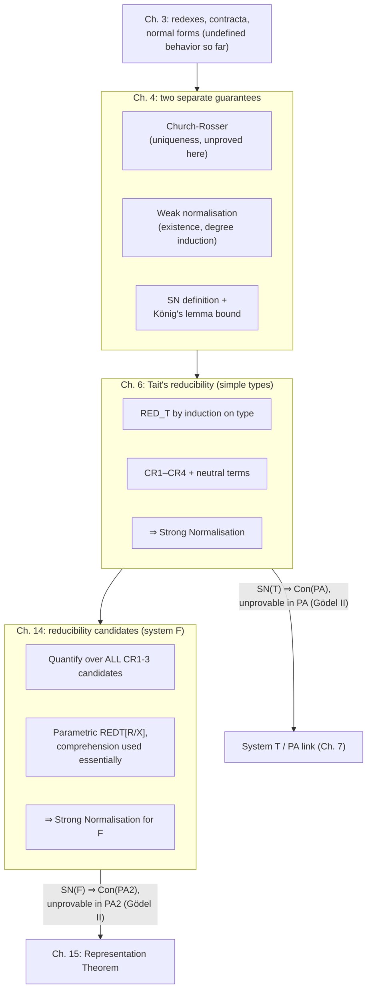

[[book-guidelines|↩ Back to guidelines]]

# Normalisation Theorems

## Why a type checker needs a theory of termination

Chapter 3 gave you *redexes*, *contracta*, and *normal forms* — the raw vocabulary of computation inside the typed $\lambda$-calculus — and quietly leaned on an unproven assumption: that reduction actually gets somewhere, and gets there in a way that doesn't depend on which redex you happen to fire first. Nothing in the definitions so far guarantees either fact. Reduction could loop forever on some terms. Two different reduction orders could, in principle, lead to two genuinely different "final" answers. If either of those were true, the entire Curry-Howard correspondence would still typecheck as *syntax*, but the semantic promise underneath it — that a term of type $A$ denotes a definite computational object, and that two terms are "the same proof" exactly when they compute to the same thing — would collapse.

This is the gap the next three chapters close, in three widening passes:

- **Chapter 4** proves the two facts separately: *uniqueness* of the end result (Church-Rosser) and *existence* of some terminating strategy (weak normalisation), then states — without yet proving — the stronger fact that *every* strategy terminates (strong normalisation), bounding reduction-sequence length via König's lemma.
- **Chapter 6** actually proves strong normalisation for the simply typed calculus, using a technique — Tait's *reducibility method* — that looks needlessly indirect for this modest a system, and Girard tells you exactly why he's using it anyway: it is the only method that survives contact with system F.
- **Chapter 14** cashes that promise in, extending reducibility to system F, and along the way runs headfirst into Gödel's second incompleteness theorem: the proof is forced to leave second-order arithmetic behind, because staying inside it is provably impossible.

Read together, these three chapters are really one long argument shaped like a staircase — each step solves the previous step's problem by finding a strictly more powerful notion of "this terminates," and each step's power is dictated, not chosen, by the logical strength of the system being tamed. That escalation is the throughline this article follows.

A notational note before we start: the PDF's typeset arrows for reduction don't survive plain-text extraction cleanly. Throughout, $t \rhd u$ means "$t$ converts to $u$ in one step" (one redex contracted), and $t \rightsquigarrow u$ means "$t$ reduces to $u$" — the reflexive-transitive closure of $\rhd$, i.e. zero or more steps. This matches the book's own distinction between a single *conversion* and the *reduction* relation built from it.

## Part 1 — Two separate guarantees (Chapter 4)

### Church-Rosser: uniqueness without existence

Girard states Church-Rosser first and *proves nothing* — he explicitly defers the proof to the literature (Barendregt), because, as he puts it, "it is not really a matter of type theory." That's a deliberate signal: confluence is a property of the *reduction relation itself*, not of typing. It holds just as well for the untyped $\lambda$-calculus, where normalisation famously fails (untyped terms can loop forever). Confluence and termination are orthogonal questions, and the book is careful never to conflate them.

> **Theorem (Church-Rosser).** If $t \rightsquigarrow u$ and $t \rightsquigarrow v$, there exists $w$ such that $u \rightsquigarrow w$ and $v \rightsquigarrow w$.

<svg viewBox="0 0 340 240" xmlns="http://www.w3.org/2000/svg" role="img" aria-label="Church-Rosser diamond diagram: t reduces to u and to v, both of which reduce to a common w">
  <defs>
    <marker id="arrow-nt" markerWidth="8" markerHeight="8" refX="6" refY="3" orient="auto">
      <path d="M0,0 L6,3 L0,6 Z" fill="#888888"/>
    </marker>
  </defs>
  <text x="170" y="24" text-anchor="middle" font-family="sans-serif" font-size="18" fill="#888888">t</text>
  <text x="40" y="130" text-anchor="middle" font-family="sans-serif" font-size="18" fill="#888888">u</text>
  <text x="300" y="130" text-anchor="middle" font-family="sans-serif" font-size="18" fill="#888888">v</text>
  <text x="170" y="228" text-anchor="middle" font-family="sans-serif" font-size="18" fill="#888888">w</text>
  <line x1="162" y1="32" x2="60" y2="112" stroke="#888888" stroke-width="1.5" marker-end="url(#arrow-nt)"/>
  <line x1="178" y1="32" x2="284" y2="112" stroke="#888888" stroke-width="1.5" marker-end="url(#arrow-nt)"/>
  <line x1="52" y1="140" x2="158" y2="212" stroke="#888888" stroke-width="1.5" stroke-dasharray="4 3" marker-end="url(#arrow-nt)"/>
  <line x1="292" y1="140" x2="184" y2="212" stroke="#888888" stroke-width="1.5" stroke-dasharray="4 3" marker-end="url(#arrow-nt)"/>
  <text x="95" y="80" font-family="sans-serif" font-size="12" fill="#888888">⇝</text>
  <text x="245" y="80" font-family="sans-serif" font-size="12" fill="#888888">⇝</text>
  <text x="85" y="185" font-family="sans-serif" font-size="12" fill="#888888">⇝ (found)</text>
  <text x="200" y="185" font-family="sans-serif" font-size="12" fill="#888888">⇝ (found)</text>
</svg>

Two corollaries do all the work later:

1. **Uniqueness of normal form.** If $t \rightsquigarrow u$ and $t \rightsquigarrow v$ with $u, v$ both normal, confluence gives $w$ with $u \rightsquigarrow w$, $v \rightsquigarrow w$ — but normal terms can only reduce to themselves, so $u = w = v$. A term has *at most* one normal form.
2. **Consistency of the calculus.** Girard runs this the other way: if $u = v$ were derivable from the equational theory of §3.2 (essentially $\beta$ plus the projection laws, closed under the equality axioms), then by chasing the equality derivation as a zig-zag of one-step conversions $u = t_0, t_1, \dots, t_{2n}=v$ and repeatedly applying confluence, you get a single $w$ with $u \rightsquigarrow w \leftsquiggarrow v$. But if $u$ and $v$ are two *different* normal terms of the same type (say, two distinct free variables), no such common $w$ can exist — so $u=v$ is *not* derivable. Confluence is therefore what stops the equational theory from being able to prove *everything equal to everything*.

**What breaks without this.** Imagine two implementations of a type checker's `is_defeq` routine that both reduce their inputs, but with different reduction strategies (one leftmost-outermost, one lazy/call-by-need). Without Church-Rosser, nothing stops those two checkers from disagreeing about whether `x` and `y` are the same term — one might reach a normal form where they coincide, the other a different one where they don't. Confluence is precisely the license that lets an elaborator pick *whatever* evaluation order is operationally convenient (WHNF-first, memoized, lazy) without that choice ever being able to affect soundness. This is the theorem Lean's own `isDefEq` leans on implicitly every time it reduces two terms using whatever strategy is fastest and still calls the result correct:

```lean
-- Confluence is *why* this is well-defined regardless of reduction strategy:
-- no matter which redex Lean's kernel happens to reduce first, if `a` and `b`
-- share a common reduct, isDefEq will find *some* path to it.
example (a b : Nat) (h : a = b) : True := by
  -- Lean's `isDefEq`/`whnf` machinery doesn't need to agree on an order,
  -- only on the *existence* of a rejoining point.
  trivial
```

### Weak normalisation: existence, and why it makes equality decidable

Confluence alone says nothing about whether a normal form *exists*. That's the content of the **weak normalisation theorem**: every term has a normal form (which, by Church-Rosser, must be unique). Girard's own headline application is immediate and important — it is exactly the *algorithm* an elaborator's definitional-equality check runs:

> To decide whether $u$ and $v$ (of the same type) are denotationally equal: compute the normal form of $u$, compute the normal form of $v$, and compare them syntactically.

This is only a decision procedure if normalisation is guaranteed to terminate *and* you know a strategy that achieves it — which is exactly what "weak" (as opposed to "strong") is flagging: some reduction sequences from $t$ might loop forever, but at least one is guaranteed to reach the normal form. The proof has to actually exhibit a measure that decreases along a *chosen* good sequence.

**The degree measure.** Define the **degree** $\partial(T)$ of a type by induction on its structure:

$$\partial(T_i) = 1 \text{ (atomic)}, \qquad \partial(U\times V) = \partial(U\to V) = \max(\partial(U), \partial(V)) + 1$$

Every redex has a degree too, inherited from the type of the thing being eliminated:

$$\partial(\pi_1\langle u,v\rangle) = \partial(\pi_2\langle u,v\rangle) = \partial(U\times V), \qquad \partial((\lambda x.\,v)\,u) = \partial(U\to V)$$

The **degree $d(t)$ of a term** is the largest degree among the redexes it contains (a normal term has degree $0$ by convention). The proof then tracks the pair

$$\mu(t) = (n, m), \qquad n = d(t),\ m = \text{number of degree-}n\text{ redexes in } t$$

and shows, via three lemmas (degree under substitution, degree non-increasing under conversion, and — crucially — that contracting a *maximal-degree* redex strictly decreases the count $m$ of redexes at that top degree), that repeatedly contracting a redex of maximal degree drives $\mu(t)$ strictly downward in the lexicographic order on $\mathbb{N}\times\mathbb{N}$. That order is well-founded, so the process must terminate — at a term with $\mu = (0,0)$, i.e. a normal form.

**What breaks without this.** A naive "just keep reducing until nothing changes" normalizer has no *a priori* reason to halt — for an untyped or badly-behaved calculus, it might not. The degree argument is what lets a Rust implementation of a normalizer for the simply typed core skip the usual escape hatch (a `fuel: usize` counter that gives up and reports "reduction limit exceeded"). Because $\mu(t)$ is a genuine well-founded measure, a loop that always contracts a maximal-degree redex is *provably* total — you can write it as an unconditional `while` loop and mean it:

```rust
/// Repeatedly contract a redex of maximal degree until none remain.
/// Terminates because mu(t) = (max_degree, count_at_max_degree) strictly
/// decreases (lexicographically) on every iteration — this is exactly
/// Girard's 4.3.4 argument, not an engineering guess.
fn normalize(mut t: Term) -> Term {
    while let Some(redex) = find_maximal_degree_redex(&t) {
        t = contract(&t, redex);
    }
    t
}
```

For a quick, non-ceremonious illustration of the *cruder* algorithm Girard mentions as a fallback justification (enumerate all one-step reductions, then all two-step reductions, and so on — finitely many at each length, since a term has finitely many subterms):

```python
def find_normal_form(t, max_len=1000):
    frontier = {t}
    for _ in range(max_len):
        if any(is_normal(u) for u in frontier):
            return next(u for u in frontier if is_normal(u))
        frontier = {v for u in frontier for v in one_step_reducts(u)}
    raise RuntimeError("no normal form found within max_len steps")
```

This version is "inelegant" (Girard's word) precisely because it doesn't know *which* strategy is good — it brute-forces all of them in parallel. The degree-based proof is better: it hands you an actual good strategy, "always reduce a maximal-degree redex," which is exactly the kind of constructive content a real normalizer implementation wants.

### Strong normalisation and König's lemma

Weak normalisation only promises *some* terminating strategy exists. **Strong normalisation** is the much stronger claim that *every* reduction sequence terminates — there is no infinite chain $t = t_0 \rhd t_1 \rhd t_2 \rhd \cdots$. Chapter 4 doesn't prove this yet (that's chapters 6 and 14); it proves something more modest but structurally important: strong normalisability is *equivalent* to the existence of a **uniform bound** on reduction length.

> **Lemma.** $t$ is strongly normalisable iff there is a number $\nu(t)$ bounding the length of *every* reduction sequence starting from $t$.

The forward direction ("bound exists $\Rightarrow$ no infinite sequence") is immediate. The converse is where **König's lemma** does the work: arrange every possible reduction sequence from $t$ as a branch of a tree, where a node's children are the terms reachable by one more conversion step. This tree is **finitely branching** — a term has only finitely many subterms, hence only finitely many redexes, hence only finitely many one-step converts. Strong normalisability says the tree has **no infinite branch**. König's lemma then says: *a finitely-branching tree with no infinite branch is finite.* A finite tree has a finite height, and that height is $\nu(t)$.

This is a genuinely useful shape of argument to keep — "no infinite branch" and "bounded height" are not the same statement without a finite-branching hypothesis, and König's lemma is exactly the bridge. (Girard footnotes, precisely, that without labelled branches this step needs the Axiom of Choice — a small but real foundational cost that resurfaces, in spirit, when chapter 14 has to reach outside second-order arithmetic.)

Chapter 4 closes by naming, but not yet using, the two known proof strategies for strong normalisation of the typed calculus:

- **Internalisation (Gandy)** — a "tortuous" self-translation of the calculus into itself, deriving strong normalisation from weak normalisation.
- **Reducibility (Tait)** — introduce a strengthened, hereditary property ("hereditary calculability") strong enough to survive an induction that direct structural induction on terms cannot. This is the method the book actually uses, "since it is the only one which generalises to very complicated situations" — a promise chapter 14 is written to redeem.

## Part 2 — Tait's reducibility method (Chapter 6)

### Why plain induction on term structure isn't enough

Try to prove "every term is strongly normalisable" by direct induction on the term's structure. The case for application $t\,u$ fails immediately: even if $t$ and $u$ are both strongly normalisable, $t\,u$ might not be — the induction hypothesis says nothing about what happens *after* $t$ and $u$ are substituted into each other. You need a property strong enough to survive substitution, not just strong enough to hold pointwise. That property is **reducibility**.

### $\mathrm{RED}_T$: a predicate defined by induction on the type, not the term

$$
\begin{aligned}
t \in \mathrm{RED}_T \text{ (atomic } T\text{)} &\iff t \text{ is strongly normalisable} \\
t \in \mathrm{RED}_{U\times V} &\iff \pi_1 t \in \mathrm{RED}_U \text{ and } \pi_2 t \in \mathrm{RED}_V \\
t \in \mathrm{RED}_{U\to V} &\iff \text{for all } u \in \mathrm{RED}_U,\ t\,u \in \mathrm{RED}_V
\end{aligned}
$$

Girard flags exactly why this works where naive induction fails, and it's worth sitting with the remark, because it explains the whole design of the next eight pages:

$$t \in \mathrm{RED}_{U\to V} \iff \forall u\,(u \in \mathrm{RED}_U \Rightarrow t\,u \in \mathrm{RED}_V)$$

Passing from $U$ to $U \to V$ has *negated* $\mathrm{RED}_U$ (it now appears as a hypothesis) and added a *universal quantifier*. The logical complexity of the predicate grows with the type. This is precisely why "$t$ is reducible of type $T$" is **not an arithmetic formula** in $t$ and $T$ — you cannot pin it down with one first-order sentence uniform in $T$, because each arrow type adds another quantifier alternation. That non-arithmetic character is not a curiosity; it's *why* the argument has metamathematical teeth. Girard states the payoff up front, before doing a shred of the proof: because [[Gödel's-System-T|Gödel's system T]] (chapter 7) has a type of integers and its recursor codes primitive recursion, strong normalisation for T entails the consistency of Peano Arithmetic — and by Gödel's **second** incompleteness theorem, *that* consistency statement cannot be proved inside PA itself. The reducibility method, precisely because it isn't an arithmetic formula, is strong enough to escape that trap; a purely arithmetic argument couldn't have been, on pain of contradicting Gödel II. Chapter 14 replays this exact move one universe higher, for system F against second-order arithmetic PA$_2$ — see Part 3.

### Neutral terms, and the CR conditions

A term is **neutral** if it is *not* syntactically an introduction form — not literally shaped like $\langle u,v\rangle$ or $\lambda x.v$. Concretely, neutral terms are exactly those headed by an eliminator: $x$, $\pi_1 t$, $\pi_2 t$, or $t\,u$. (Note this is a purely *syntactic* classification — $\pi_1\langle u,v\rangle$ counts as neutral even though it happens to already be a redex, because its outermost shape is a projection, not a pair. That distinction — is the *head* an eliminator or a constructor — is what makes the induction below close.)

Four conditions on a predicate $R$ (indexed by type $T$) are isolated as exactly what's needed:

- **(CR1)** $t \in R \Rightarrow t$ strongly normalisable.
- **(CR2)** $t \in R$ and $t \rhd t'$ $\Rightarrow t' \in R$ (closed forward under reduction).
- **(CR3)** $t$ neutral, and every one-step convert of $t$ is in $R$ $\Rightarrow t \in R$ (closed *backward*, but only for neutral terms).
- **(CR4)** $t$ neutral and normal $\Rightarrow t \in R$ (the vacuous special case of CR3 — a normal term has no converts to check).

Girard verifies CR1–CR3 hold for $\mathrm{RED}_T$ by induction on $T$: trivially for atomic $T$ (reducibility *is* strong normalisability there); for products, by pushing the property through both projections; for arrows, by combining application to a fresh variable (to get CR1, using CR4 at $U$ to know $x \in \mathrm{RED}_U$) with an inner induction on $\nu(u)$ (the reduction-length bound from Part 1) to get CR3 to close.

**Why "neutral" matters, and where you've seen this split before.** The neutral/introduction-form split is not a bookkeeping convenience — it is *exactly* the split that bidirectional type checking makes between **synthesizing** (inferable) and **checking** terms. A variable, a projection, an application — you can look at the term's own shape and read off its type by recursing on its immediate subterms; these are neutral, "eliminator-headed" terms. A pair or a $\lambda$-abstraction, by contrast, needs a type handed to it from context before you can check it — you cannot, in general, infer the domain type of a bare $\lambda x.\,v$ without more information. That is the same asymmetry chapter 6 needs CR3 to only apply to neutral terms: introduction forms don't need — and syntactically can't use — "backward closure under conversion," because they're not eliminators being poked from outside; they're canonical values. If you've ever wondered why bidirectional typing rules split so cleanly into an inference judgment for eliminators and a checking judgment for constructors, this is the same fold line, one level of abstraction over.

### The two lemmas that make the type theorem go through

**Pairing (6.3.1).** If $u, v \in \mathrm{RED}$, then $\langle u,v\rangle \in \mathrm{RED}$. Proved by strong induction on $\nu(u)+\nu(v)$: $\pi_1\langle u,v\rangle$ is neutral, and every one-step convert of it (either to $u$ itself, or to $\pi_1\langle u',v\rangle$/$\pi_1\langle u,v'\rangle$ with $u'$ or $v'$ one step closer to normal) is reducible by hypothesis or induction — so CR3 finishes it.

**Abstraction (6.3.2).** If $v[u/x] \in \mathrm{RED}$ for every reducible $u$, then $\lambda x.v \in \mathrm{RED}$. Same shape: $(\lambda x.v)\,u$ is neutral, its one-step converts are all reducible (by hypothesis, or by the induction on $\nu(v)+\nu(u)$), so CR3 applies again.

**The theorem.** All terms are reducible — proved by induction on term structure, but generalized first to open terms via a substitution proposition: if $t$ has free variables $x_1,\dots,x_n$ of types $U_1,\dots,U_n$ and $u_1,\dots,u_n$ are reducible terms of those types, then $t[u_1/x_1,\dots,u_n/x_n]$ is reducible. The pairing and abstraction lemmas are exactly what's needed to push this through the $\langle\cdot,\cdot\rangle$ and $\lambda$ cases. Setting $u_i = x_i$ (each variable reducible by CR4) gives the theorem for arbitrary closed context, and **CR1** immediately hands you the corollary: **every term is strongly normalisable.**

**A crucial implementation nuance.** Unlike weak normalisation's "reduce to normal form and compare" (Part 1), $\mathrm{RED}_T$ is not something you *run*. There is no function `is_reducible(term, ty) -> bool` you'd call inside a real type checker's hot loop — the predicate quantifies over all types and, in a moment, over all *predicates*, which makes it a proof device, not an algorithm. You use it exactly once, at the level of the metatheory, to establish that the checker's `normalize` function is safe to call unconditionally. That distinction — "this is a proof technique for the implementer, not code the implementer ships" — matters for anyone building their own verifier: the reducibility argument is the kind of thing you'd carry out on paper, or formalize once in Lean about your calculus, not something whose structure you'd try to mirror in the checker's runtime.

```lean
-- A reducibility candidate as a first-class Lean object: a predicate on
-- terms of a given type, bundled with proofs of CR1–CR3. This is a proof
-- artifact you construct once about your calculus, not runtime code.
structure ReducibilityCandidate (ty : Ty) where
  pred  : Term → Prop
  cr1   : ∀ t, pred t → StronglyNormalizing t
  cr2   : ∀ t t', pred t → t ⟶ t' → pred t'
  cr3   : ∀ t, Neutral t → (∀ t', t ⟶ t' → pred t') → pred t
```

Rust is the better fit for the *other* half of chapter 6 — the actual `RED_T`-by-induction-on-type-structure recursion is naturally a structurally recursive function over a `Ty` enum, useful for building intuition even though (per the caveat above) you'd never call it at runtime on an arbitrary open term:

```rust
enum Ty { Atomic(TyId), Prod(Box<Ty>, Box<Ty>), Arrow(Box<Ty>, Box<Ty>) }

// A *specification*, not a callable checker: this is what the metatheory
// proof pins down, mirroring RED_T's three clauses one-for-one.
fn is_reducible_spec(ty: &Ty, t: &Term) -> Prop {
    match ty {
        Ty::Atomic(_)      => strongly_normalizing(t),
        Ty::Prod(u, v)     => is_reducible_spec(u, &proj1(t)) & is_reducible_spec(v, &proj2(t)),
        Ty::Arrow(u, v)    => forall_reducible(u, |arg| is_reducible_spec(v, &app(t, arg))),
    }
}
```

## Part 3 — Strong normalisation for System F (Chapter 14)

### Where the naive extension breaks

System F adds universal quantification over types: $\Pi X. T$, with type application $t\,U$. The obvious extension of $\mathrm{RED}_T$ would say: $t : \Pi X.T$ is reducible iff, for every type $U$, $t\,U$ is reducible of type $T[U/X]$. Try to unwind this for the polymorphic identity, of type $\Pi X.\,X\to X$: reducibility of $t$ needs reducibility of $t\,U$ for *every* $U$ — including $U = \Pi X.X$ itself. But to know what "reducible of type $\Pi X.X$" even means, you already need the very definition you're in the middle of stating. The naive reading is circular, and Girard is blunt that "we shall never get anywhere like this."

### The fix: quantify over candidates, not over "the" predicate

The resolution is to stop insisting there is one canonical, "true" reducibility predicate per type and instead define a **reducibility candidate** as *any* set of terms of type $U$ satisfying CR1–CR3 — the same three conditions from chapter 6, now detached from any specific inductive construction. A term $t : \Pi X.T$ is reducible when, for **every** type $U$ *and every* reducibility candidate $R$ of type $U$ (not just the eventual "real" one), the instantiation $t\,U$ is reducible of type $T[U/X]$, computed using $R$ as the stand-in definition of reducibility at $X$.

This is subtle enough to be worth walking through the book's own worked example: the universal identity $\Lambda X.\,\lambda x^X.\,x : \Pi X.\,X\to X$. Fix an arbitrary type $U$ and an arbitrary candidate $R$ for $U$ — not the "correct" one, just some CR1–CR3-satisfying set. We need $t\,U$ reducible of type $U\to U$ under $R$, i.e. for every $u \in R$, $(t\,U)\,u \in R$. Since $(t\,U)\,u$ is neutral and converts (in one or two steps) to $u \in R$, **CR3** closes the case immediately — no information about *which* candidate $R$ was chosen is ever needed, which is exactly the "uniformity" intuition Girard flags: a polymorphic term behaves coherently no matter what you instantiate it with, because the proof never inspects $R$'s internals.

Definitions carry over from chapter 6 almost verbatim, with one addition — a neutral term for F is now $x$, $t\,u$, *or* $t\,U$ (type application also counts as an elimination form; only $\Lambda X.w$ and $\lambda x.w$ are introduction forms) — and CR4 again falls out of CR3 for free, guaranteeing every candidate contains at least the variables of its type.

### Reducibility with parameters, and where comprehension gets used

To actually push an induction through open types (types with free variables $X_1,\dots,X_m$), chapter 14 defines **parametric reducibility** $\mathrm{RED}_T[\vec R/\vec X]$ by induction on $T$, threading a sequence of candidates $\vec R$ through the type variables, with the new clause for the quantifier case:

$$\mathrm{RED}_{\Pi Y.W}[\vec R/\vec X] = \{\, t : \forall V,\ \forall S \text{ (a candidate of type } V),\ t\,V \in \mathrm{RED}_W[\vec R/\vec X, S/Y] \,\}$$

A lemma (proved, like chapter 6, by induction on $T$ — the arrow case reusing 6.2.3 outright, the only new work in the $\Pi Y.W$ case) shows $\mathrm{RED}_T[\vec R/\vec X]$ is *itself* a reducibility candidate, satisfying CR1–CR3 again. This self-application — the construction you use to *build* candidates is required to *produce* a candidate — is where the argument's logical strength shows up concretely. The substitution lemma that makes types compose correctly,

$$\mathrm{RED}_{T[V/Y]}[\vec R/\vec X] = \mathrm{RED}_T[\vec R/\vec X,\ \mathrm{RED}_V[\vec R/\vec X]/Y],$$

requires treating $\mathrm{RED}_V[\vec R/\vec X]$ — itself defined by second-order induction — *as a single object*, a legitimate parameter to plug in. Girard flags this explicitly as "hidden use of the comprehension scheme": to substitute a predicate in as if it names a set, you need the axiom (of second-order Peano arithmetic, PA$_2$) asserting that *any* formula defines a set: $\exists X.\forall\xi.(\xi \in X \Leftrightarrow A[\xi])$. Universal abstraction and universal application lemmas (14.2.2, 14.2.3) mirror the pairing/abstraction lemmas of chapter 6 exactly, closing via CR3 on the neutral terms $\Lambda Y.w$'s applications and $t\,V$ respectively. The final **reducibility theorem** — every $F$-term is reducible, hence (by CR1) strongly normalisable — is proved via a doubly-parametric substitution proposition, substituting both types (for the free type variables) and reducible terms (for the free term variables) simultaneously, mirroring 6.3.3 with the new cases handled by 14.2.2–14.2.3.

### The Gödel's-second-incompleteness payoff

Chapter 14 opens by telling you where this is going, before a single lemma is proved, and it's worth stating exactly as sharply as the book does:

- Chapter 15 will show that strong normalisation for F entails the **consistency of second-order Peano arithmetic**, PA$_2$.
- **Gödel's second incompleteness theorem** says (assuming PA$_2$ is in fact consistent) that PA$_2$'s own consistency cannot be proved *inside* PA$_2$.
- Therefore, strong normalisation for F **cannot be proved inside PA$_2$ either** — and the proof strategy has to be built to leave PA$_2$ from the start, not as an accident of how hard the argument turned out to be.

The reducibility-candidates construction is precisely what does that: quantifying over *every* CR1–CR3-satisfying set (a third-order move — quantifying over sets of terms, themselves already second-order objects relative to PA$_2$'s own comprehension scheme) is not something a single formula of PA$_2$ can express uniformly. Girard makes the same point chapter 6 made about $\mathrm{RED}_{U\to V}$, now one level up: "there is no second order formula $\mathrm{RED}(T,t)$ which says 't is reducible of type $T$.'" The escalation from Part 2 to Part 3 is the same move, repeated one universe higher — simple types needed *a* logically-complex predicate (escaping first-order PA, tied to system T); system F needs a predicate complex enough to escape *second-order* PA$_2$ itself, tied to the strictly more expressive quantification $\Pi X.T$ actually provides.

If you are building your own polymorphic core — a verifier or elaborator with something F-shaped in it, generic functions ranging over arbitrary types — this is the sharp version of a fact worth internalizing early: you cannot expect to prove that core's own termination *using only the logical resources the core itself encodes*. The metatheoretic argument for "my checker's normalizer always halts" has to live in a strictly stronger system than the one being checked, exactly the way Lean's own kernel is not expected to verify its own termination from inside Lean's object language — that guarantee is established once, externally, about the metatheory, not re-derived by the checked system reflecting on itself.

## Where this leads



Everything downstream depends on these results holding. The **decidability of type checking** promised informally back in chapter 3 is only real because weak normalisation (Part 1) turns "are these terms equal" into a terminating compute-and-compare algorithm. Chapter 7's system T can be introduced with confidence that adding a recursor doesn't break termination only because chapter 6's *method*, not just its particular result, generalizes. And chapter 15's Representation Theorem — pinning down exactly which functions system F can encode — is only reachable because chapter 14 already secured strong normalisation as a load-bearing fact about PA$_2$'s proof-theoretic strength, not merely a nice property of a toy calculus.

For the standing project this vault is built around: this is as load-bearing as chapters get. Weak normalisation (Part 1) is *literally* the naive algorithm behind `isDefEq` in any elaborator that decides definitional equality by normalize-and-compare — the degree measure is the concrete reason such a routine can be written as an unconditional loop rather than a fuel-bounded approximation. The neutral/introduction-form split threaded through CR3 (Part 2) is the same fold line bidirectional typing draws between synthesizing and checking judgments — recognizing that correspondence early will make chapter 6's proof read like familiar code, not like a fresh formalism. And Part 3's reducibility-candidates argument is the concrete cautionary tale for the "custom automated theorem prover" target: if that prover's core type theory ever grows a polymorphic, System-F-shaped feature, its termination proof will need the same escalation — a metatheory strictly stronger than what the checked system itself can express — and no amount of clever engineering inside the checker substitutes for that external argument.
