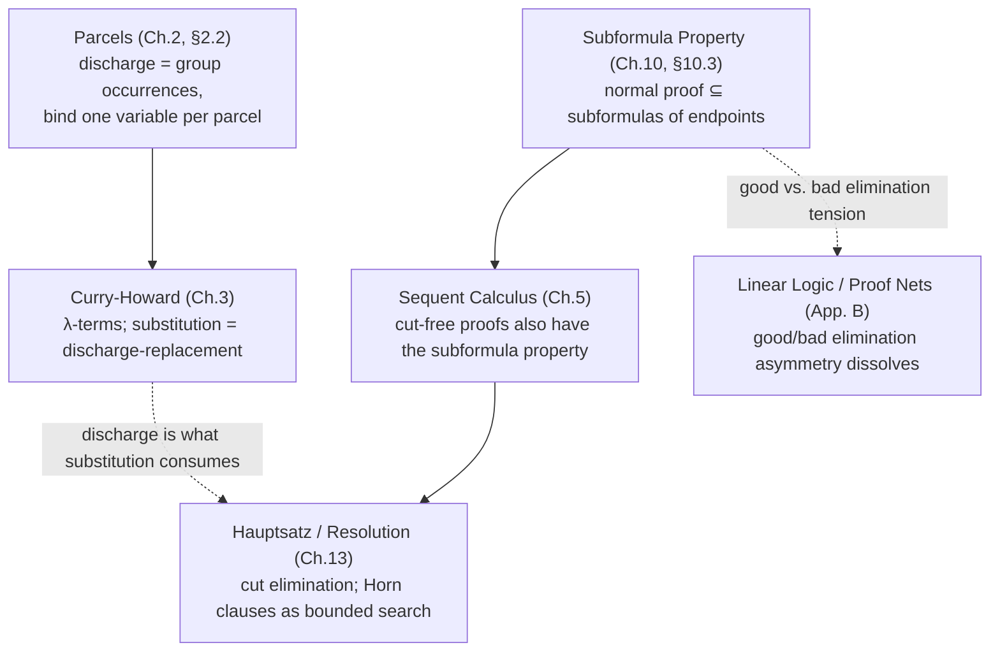

[[book-guidelines|↩ Back to guidelines]]

## Why these two ideas belong in one note

[[Natural-Deduction|Natural deduction]], as Girard sets it up in chapter 2, looks like a tree: leaves are hypotheses, the root is a conclusion, and rules connect them. But two things about that picture are lies, or at least oversimplifications, and both lies matter enormously once you want to read a proof *as a program*.

The first lie: a "tree" suggests each leaf is an independent thing. It isn't. If the same hypothesis formula shows up at three different leaves, those three occurrences might need to be treated as *the same variable* or as *three different variables*, and the calculus has no way to say which without extra bookkeeping. That bookkeeping is the notion of a **parcel**.

The second lie: a tree suggests a proof can look like anything the grammar allows. It can't — once a proof is *normal* (irreducible, redex-free), its internal formulas are tightly constrained by its endpoints. That constraint is the **subformula property**, and it's the reason proof search and decision procedures in this line of work are ever tractable at all.

Girard actually introduces parcels early (chapter 2, alongside the rules themselves) but defers a real proof of the subformula property to chapter 10 — because for the "nice" fragment of logic (∧, ⇒, ∀) the property is easy, and Girard uses that very proof to explain why disjunction and existence are comparatively "catastrophic." So this note follows the book's own order but reads both ideas as two faces of the same question: *given a normal deduction, what information can you actually recover from it, and how is that information organized?*

---

## Part 1 — Parcels of Hypotheses

### The problem: which leaves are "the same"?

Consider Girard's own illustration, the $\Rightarrow$-introduction rule:

$$
\begin{array}{c}
[A] \\
\vdots \\
B \\
\hline
A \Rightarrow B
\end{array} \Rightarrow I
$$

The bracket notation $[A]$ means: pick some number of $A$-labeled leaves in the sub-deduction of $B$ — zero, one, two hundred fifty, whatever — and discharge them (kill them) simultaneously when you apply $\Rightarrow I$. There might be other $A$-leaves elsewhere in the same sub-deduction that you *don't* discharge; they stay alive for a later, different application of $\Rightarrow I$.

This already breaks the naive "it's just a tree" reading in a subtle way: to apply the rule correctly, you need to know *which specific occurrences* of $A$ are being discharged together. That's not a property of the tree shape — it's an annotation layered on top of it. Girard's own words: "it is of critical importance to know when a hypothesis was discharged, and so it is essential to record this... but it is no longer a genuine tree we are considering."

The set of occurrences of the same hypothesis formula that get discharged together (or, for undischarged hypotheses, that are simply grouped as "the same" for bookkeeping purposes) is a **parcel**.

### Why parcels, not just "the formula"

Here's the deeper reason parcels can't be avoided. Girard wants to read a deduction of $A$ from hypotheses $B_1,\dots,B_n$ as a *function*

$$
t[x_1,\dots,x_n] : B_1 \times \cdots \times B_n \to A
$$

in the sense of Heyting semantics from chapter 1 (a proof of $A \Rightarrow B$ *is* a function from proofs of $A$ to proofs of $B$). For this correspondence to be exact, each *parcel* of hypotheses — not each individual leaf — gets exactly one variable $x_i$. Two occurrences of $B$ in the *same* parcel share a variable; two occurrences of $B$ in *different* parcels (say, because they're going to be discharged by two different applications of $\Rightarrow I$) get different variables, even though they're instances of the identical formula.

This is exactly the correspondence you'd expect if you've ever implemented a type checker: the formula $B$ is a *type*, and a parcel is a set of *use-sites* of one particular *binding occurrence*. Two use-sites of the same type that come from different binders are not interchangeable, even though the checker sees "the same type" at both — what makes them different is which binder they resolve to, which is exactly what a parcel records.

### The interpretation of the rules, term by term

Girard walks through each rule and gives its Curry-Howard reading. This is where "parcel" cashes out concretely:

| Deduction ending in… | …is represented by | Note |
|---|---|---|
| a single hypothesis $A$ | a variable $x$ | Same $x$ for the whole parcel; a different variable for a different parcel of the same formula |
| $\land I$, from $u[\vec x]$ and $v[\vec x]$ | the pair $\langle u[\vec x], v[\vec x]\rangle$ | $u$ and $v$ are forced to share variables, because some parcels get identified across the two sub-deductions |
| $\land_1E$ / $\land_2E$, from $t[\vec x]$ | $\pi_1 t[\vec x]$ / $\pi_2 t[\vec x]$ | first/second projection |
| $\Rightarrow I$, discharging the parcel bound to $x$, from $v[x,\vec x]$ | $\lambda x.\, v[x,\vec x]$ | **discharge = binding.** The entire discharged parcel becomes one bound variable. |
| $\Rightarrow E$, from $t[\vec x]$ and $u[\vec x]$ | $t[\vec x]\, u[\vec x]$ | application |

The equations that fall out of this reading are the calculus's defining identities:

$$
\pi_1\langle u,v\rangle = u \qquad \pi_2\langle u,v\rangle = v \qquad \langle \pi_1 t, \pi_2 t\rangle = t
$$

$$
(\lambda x.\, v)\, u = v[u/x] \qquad \lambda x.\, t\,x = t \ \ (x \notin \mathrm{FV}(t))
$$

Girard's punchline: "these equations… are the essence of the correspondence between logic and computer science." They're not decorations — they *are* what the deduction-as-function reading demands.

### What breaks without parcel-tracking: proof identification

Here's where parcels stop being bookkeeping trivia and start doing real work. At the end of chapter 2, Girard identifies pairs of deductions that should count as "the same proof" — a $\land$-then-$\land_1E$ detour collapses to the direct proof of $A$; and, crucially, a $\Rightarrow I$-then-$\Rightarrow E$ detour:

$$
\cfrac{\cfrac{[A]\;\vdots\;B}{A \Rightarrow B}\Rightarrow I \qquad {\vdots \atop A}}{B}\Rightarrow E
\quad\text{"equals"}\quad
\begin{array}{c}\vdots \\ A \\ \hline \vdots \\ B\end{array}
$$

reduces by substituting *the deduction ending in $A$* for **all the discharged hypotheses** in the sub-deduction of $B$. Note the phrase: *all* the discharged hypotheses — the whole parcel, simultaneously, not one leaf at a time. If parcels weren't tracked as a group, this step wouldn't be well-defined: you wouldn't know which of possibly many $A$-leaves are supposed to receive the substituted proof, and which are untouched (because they belong to a different parcel, awaiting a different discharge).

This is precisely $\beta$-reduction, $(\lambda x.v)\,u \rightsquigarrow v[u/x]$, read backward through the Curry-Howard lens: substituting $u$ for *every free occurrence of $x$* is only sound because $x$ was assigned to exactly one parcel — one coherent set of use-sites of one binder.

**Grounding.** If you've written a compiler pass that resolves names to binder identities (assigning each `Ident` an `fvar`/de&nbsp;Bruijn slot, then walking the AST to substitute), you've implemented parcels without the name. In Rust terms, a parcel is the *set of expression positions pointing at one local-variable slot* — you'd represent it as, say, a `HashMap<VarId, Vec<ExprSlot>>` built during name resolution, and substitution is exactly "for every slot in this parcel, splice in the replacement." In Lean's elaborator, this is the free-variable (`FVarId`) machinery in the local context: each hypothesis you introduce gets a fresh `FVarId`, and every place that hypothesis is *used* is, definitionally, an occurrence in that hypothesis's parcel. Substitution (`Expr.replaceFVar` or the kernel's own substitution during `whnf`/reduction) walks exactly those occurrences — this is the same plumbing that later underlies definitional equality checking and unification: knowing precisely which occurrences of a metavariable or hypothesis are "linked" is a prerequisite for correct substitution anywhere in the pipeline.

---

## Part 2 — The Subformula Property

### The problem: what can show up inside a normal proof?

Once you have redexes ($\land I$ immediately followed by $\land E$, $\Rightarrow I$ immediately followed by $\Rightarrow E$ — the "detours" from Part 1) and a notion of eliminating them, you can ask: what does a proof look like once *all* redexes are gone — a **normal deduction**? The subformula property answers this for the $(\land, \Rightarrow, \forall)$ fragment: nothing "extra" can appear. Every formula anywhere inside a normal proof is already a subformula of something you can read off the proof's hypotheses or its conclusion.

Why care? Because this is exactly the fact that makes proof search over a normal deduction *finite to describe*: you never need to guess an arbitrary intermediate lemma — every formula in play is already sitting inside the input. This is the same phenomenon, in embryo, that later justifies cut-free sequent calculus (chapter 5) and Robinson-style resolution over Horn clauses (chapter 13): restricting a calculus to normal/cut-free proofs bounds the *search space* to material already visible in the goal.

### The theorem, precisely

> **Theorem (subformula property, $(\land,\Rightarrow,\forall)$-fragment).** Let $\delta$ be a normal deduction in the $(\land,\Rightarrow,\forall)$ fragment. Then:
>
> (i) every formula occurring in $\delta$ is a subformula of a conclusion or a hypothesis of $\delta$;
>
> (ii) if $\delta$ ends in an elimination, it has a **principal branch**: a sequence of formulas $A_0, A_1, \dots, A_n$ such that $A_0$ is an undischarged hypothesis, $A_n$ is the conclusion, and each $A_i$ is the *principal premise* of an elimination whose conclusion is $A_{i+1}$. In particular, $A_n$ is a subformula of $A_0$.

("Principal premise" means: for $\Rightarrow E$ it's the $A\Rightarrow B$ side, not the bare $A$; for $\land_iE$ it's the $A\land B$ being projected — the premise the elimination rule is actually *tearing apart*, as opposed to any side premise it also consumes.)

The proof is a clean structural induction, and its three cases are worth internalizing because case 3 is exactly where things later go wrong (Part 2, next section):

1. **$\delta$ is a bare hypothesis.** Nothing to prove.
2. **$\delta$ ends in an introduction** (e.g. $\land I$ combining sub-deductions of $A$ and $B$). Apply the induction hypothesis to each immediate sub-deduction.
3. **$\delta$ ends in an elimination** (e.g. $\Rightarrow E$ with principal premise $A \Rightarrow B$). Because $\delta$ is *normal* — no redexes — the sub-deduction ending in the principal premise $A \Rightarrow B$ cannot itself end in an introduction (an introduction immediately consumed by the matching elimination would *be* a redex). So it must end in an elimination too, which by induction already has a principal branch — and that branch extends one step further to reach $\delta$'s own conclusion.

That last case is the whole mechanism in miniature: *normality forbids introduction-immediately-under-matching-elimination*, and that single local fact, applied recursively, is strong enough to pin down the global shape of the entire proof.

![[subformula_diagram.svg]]

### Where it breaks: parasitic conclusions

Chapter 10 extends the fragment with $\bot$ (absurdity), $\lor$ (disjunction), and $\exists$ (existence) — and immediately runs into "an enormous difficulty." Look at the elimination rules for these connectives (informally): $\lor E$ takes a proof of $A\lor B$ plus a proof of $C$ from $A$ *and* a proof of $C$ from $B$, and concludes $C$. But $C$ is arbitrary — it has *nothing to do with* $A\lor B$, the formula being eliminated. Girard calls $C$ a **parasitic** conclusion: the elimination rule's output formula is not a subformula of its principal premise, so step 3 of the induction above simply fails — the whole argument that "the conclusion of an elimination is a subformula of its principal premise" was silently using a feature specific to $\land$, $\Rightarrow$, $\forall$ that $\lor$, $\exists$, $\bot$ don't have.

Girard's fix is to split eliminations into **good** ($\land_1E, \land_2E, \Rightarrow E, \forall E$ — well-behaved, subformula-respecting) and **bad** ($\bot E, \lor E, \exists E$ — parasitic). The theorem can be *partially* rescued: it's provable again once you forbid the specific bad configuration of *a bad elimination whose conclusion feeds directly into another elimination as its principal premise* — and Girard shows this really is necessary with a small counterexample:

$$
\cfrac{A\lor A \quad \cfrac{[A]}{A\land A}\land I \quad \cfrac{[A]}{A\land A}\land I}{A\land A}\lor E
\qquad\longrightarrow\qquad
\cfrac{A\land A}{A}\land_1E
$$

The formula $A \land A$ genuinely occurs inside this deduction while not being a subformula of the hypothesis $A \lor A$ or the final conclusion $A$ — the subformula property is violated outright. Eliminating exactly the "bad-elimination-feeds-an-elimination" configuration is what **commuting conversions** exist to do (§10.4): they push an outer elimination *inward*, past a bad elimination's branches, until the parasitic conclusion is no longer sitting where the theorem needs it not to be. Girard counts $3\times 7 = 21$ raw configurations this way — "there is no question of considering them one by one" — which is itself a signal that something about this fragment's design, not just the proof technique, is inelegant. (Girard is blunt about this: "it does not seem that the $(\bot,\lor,\exists)$ fragment of the calculus is etched on tablets of stone" — a line that pays off much later, in Appendix B, when [[Linear-Logic|linear logic]]'s proof nets dissolve the good/bad distinction entirely by removing the asymmetry that created it.)

**Grounding.** The subformula property is the theoretical justification behind *any* proof/type-checking procedure that only ever needs to look at subterms of the goal and hypotheses currently in scope — it's why backward-chaining tactics, resolution-style provers, and bidirectional type checkers can restrict their search to a syntactically bounded space instead of needing to "invent" an unbounded lemma out of nowhere. Concretely: a Prolog-style resolution engine (which chapter 13 will connect explicitly to a *restricted* form of this same property) only ever unifies against subterms of existing clauses; a bidirectional type checker's *inference* mode only ever produces types that are subformulas/subterms of what's already in the context or the term being checked, while *checking* mode is where you're allowed to consult an externally-supplied expected type — the inference/checking split is itself a design response to the same tension the good/bad elimination split exposes here: some rules let you read off structure locally (good, "synthesizing"), others need outside information to make sense of an otherwise-parasitic result (bad, "requires a mode switch"). If you're building a proof-producing verifier, the subformula property (or its failure) is exactly what you're implicitly relying on — or working around — whenever you bound a proof-search procedure's term-generation step to "subterms of the current goal."

---

## Where this leads

Parcels are the mechanism that makes the deduction-as-function reading in chapter 3 *exact*: without a well-defined notion of "which occurrences share a binder," $(\lambda x.v)u = v[u/x]$ isn't a well-formed statement — you wouldn't know which $x$'s to replace. Every later substitution you'll meet in this book (β-reduction, the cut-elimination substitution of chapter 13, the term-translation of Heyting arithmetic into system F in chapter 15) is doing the same parcel-respecting substitution, just over richer term languages.

The subformula property, meanwhile, is a *recurring* theorem, not a one-off fact about natural deduction. It reappears, in cleaner form, for cut-free sequent calculus (chapter 5, §5.2.2) — cleaner precisely because the sequent calculus's left/right symmetric rules don't have natural deduction's good/bad elimination asymmetry — and it underlies the restricted Hauptsatz's connection to resolution and Horn-clause logic programming (chapter 13, §13.4). If you're building a proof-search or constraint-solving component — SLD resolution, CHC solving, or a bidirectional elaborator's inference mode — the subformula property (and precisely where it fails, and why linear logic's proof nets in Appendix B were designed to make it fail *nowhere*) is the theoretical fact licensing you to bound your search to syntactic material already on the table.
