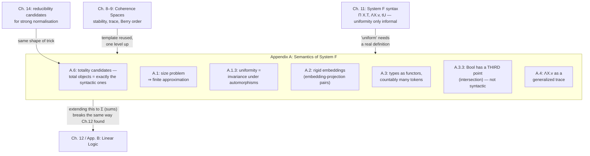

[[book-guidelines|↩ Back to guidelines]]

# Semantics of System F

## Recap: what's already built, and what's missing

[[Coherence-Space-Semantics]] built coherence spaces, stability, and the trace representation of the function space for the *first-order* calculus — types built from $\times$ and $\to$ only. [[System-F-and-Polymorphism]] then gave system F its *syntax*: types built additionally from $\Pi X.\, T$ (universal quantification), terms extended with universal abstraction $\Lambda X.\, v$ and universal application (extraction) $t\,U$, and — crucially — only an *informal* discipline called uniformity, which said a polymorphic term has to "do the same thing at every type" without ever pinning down what that means mathematically. This appendix, written by Paul Taylor, is where that informal discipline gets a real mathematical body: a coherence-space semantics for $\Pi X.\, T$, in which "uniform" becomes a provable property of a well-defined mathematical object rather than a compass heading.

This is worth taking seriously as a genuine research problem, not a routine extension. Interpreting $U \to V$ only ever required combining two *already-built* spaces. Interpreting $\Pi X.\, T$ requires making sense of "the object you get by ranging $X$ over every coherence space there is" — and, as section A.1 opens by pointing out, there's no obvious sense in which that's a legitimate mathematical object at all.

## The size problem: a universal type can't be a literal function on all types

Take the simplest possible universal term: the polymorphic identity, $\Lambda X.\, \lambda x^X.\, x$, of type $\Pi X.\, X \to X$. Under the "naive" reading system F's syntax suggests (already flagged as suspect in [[System-F-and-Polymorphism]] §11.2), this term denotes a function assigning to every coherence space $A$ the identity function's trace on $A$:

$$\mathrm{Id}_A = \{(\{\alpha\}, \alpha) : \alpha \in |A|\}$$

But *there is a proper class of coherence spaces*. A function, in any ordinary mathematical sense, is a set of input-output pairs — and you cannot form the set $\{(A, \mathrm{Id}_A) : A \text{ a coherence space}\}$, because its domain isn't a set. This is the size problem, and it's not a technicality to wave away: if $\Pi X.\, T$ can't be given a legitimate denotation, the entire denotational-semantics project for system F stops before it starts.

**The fix — finite approximation.** Chapter 8 already solved a structurally identical problem for ordinary points: an infinite point of a coherence space is recovered as the directed union of its *finite* approximants, and there are only countably many of those. Taylor applies the same move one level up. Rather than trying to define a universal term's value at an arbitrary coherence space directly, require only that:

1. its value at every *finite* domain be given (there are only countably many finite domains up to isomorphism — genuinely a set), and
2. its values at isomorphic domains agree, "along the isomorphism" — this second clause is doing more work than it looks like, and section A.1.3 exists entirely to unpack it.

Then continuity — the same directed-colimit-preservation property that made stable functions well-behaved in chapter 8 — lets you *derive* the value at any infinite domain as a limit of its behavior on finite approximants, exactly as an infinite point is recovered from its finite sub-points. A function that only needs to be specified at countably many places, with an agreement condition, genuinely is a set. The size problem dissolves, but only because "uniform across isomorphic domains" is doing the load-bearing work — which is exactly the notion section A.1.3 has to make precise.

**What breaks without this.** If you skip straight to trying to quantify over "all coherence spaces" as a literal domain of a function, you don't get a subtly-wrong model — you get no model at all, because the object you're trying to define doesn't exist as a set-theoretic function in the first place. This is a genuinely different failure mode from, say, Parallel Or breaking stability (Chapter 8): that was a semantic choice ruling out a *legitimate* candidate; this is a foundational obstruction that has to be engineered around before any candidates can even be considered.

**A contrast worth having explicit, for the elaborator side of this vault's project.** Lean's kernel faces a cousin of this same size problem — `Type u` cannot itself be a `Type u` (that's Russell's paradox reborn) — and solves it by a completely different mechanism: **stratification**. `∀ (α : Type u), P α` is simply pushed up to live in `Type (u+1)`, a syntactic discipline (predicativity) that sidesteps the question by forbidding self-reference outright.

```lean
-- Lean's answer to "a function on all types" is to go up a universe.
-- This never tries to quantify over "every Type u" as a set; the
-- quantified statement just lives one level higher, by fiat.
def polyId : (α : Type u) → α → α := fun α x => x
-- polyId : (α : Type u) → α → α  lives in Type (u+1)
```

System F's $\Pi X.\, T$ is deliberately **impredicative** — $X$ can be instantiated by $\Pi X.\, T$ itself, no stratification allowed (that's exactly what makes booleans, products, and inductive types encodable at all, per [[System-F-and-Polymorphism]] §11.3–11.4). Coherence semantics has to earn impredicativity honestly, *semantically*, via continuity and finite approximation, rather than dodging the size problem syntactically the way Lean's kernel does. That's the trade this appendix is making: keep the calculus's full impredicative power, pay for it with a genuinely more intricate model.

## The wrong fix: saturated domains, and why it fails

Before committing to finite approximation, Taylor walks through — and rejects — the "obvious" alternative, because the way it fails is diagnostic. The idea: pick one enormous "universal" domain $\Omega$, saturated under every type-forming operation you need (so $\Omega \to \Omega$ is again a subdomain of $\Omega$), and interpret every type as a subdomain of $\Omega$. Then a universal term is just an honest element of $\Omega$. Scott's $P\omega$ model is the classic instance of exactly this move for the untyped $\lambda$-calculus.

This has real pitfalls, and the sharpest one is conceptual before it's technical: it forces you to keep two different universes around — $\Omega$, the "universe of elements" (values), and some domain $V$ whose points *name* types (a "universe of types") — and connect them only by an external naming convention, not by the theory itself knowing they're related. Worse, and this is the fatal one: **isomorphic types can be named by different elements of $V$, and nothing forces a universal term's value at those two names to agree.** That's precisely the condition finite approximation demanded in the previous section (item 2 above), now visibly violated. The practical symptom: the interpretation of a simple term like $\Lambda X.\, \lambda x.\, x$ becomes "very uneconomical" — the model ends up with far more points at universal types than there are corresponding terms in the syntax, because nothing is preventing spurious, isomorphism-insensitive extra content.

**What breaks without this.** Conflating "universe of elements" with "universe of types" the way naive set theory conflates elements and sets is a recognizable design failure mode outside semantics too — it's the tension between systems that make types first-class runtime *values* (Python's `type(x)` is itself an ordinary object you can pass around and compare) versus systems that erase types entirely at compile time and never let a type "leak" into value-space (Rust generics: `T` exists only for the type-checker, never as a runtime datum you can inspect or compare for identity). Girard/Taylor's saturated-domain approach is closer to the Python end of that spectrum, and the uniformity failure is the formal cost of that choice: once types are just more elements, two elements that *should* be forced identical (because they name isomorphic types) have no mechanism forcing that identification.

The diagnosis Taylor gives in one line: "what really fails ... is the *uniformity* of terms over all types." That's the pivot into the appendix's central technical idea.

## Uniformity made precise: invariance under automorphisms

Here is the reframing that makes "uniform" a mathematical property instead of a slogan. Forget universal types for a moment and ask a more basic question: what does it mean for *any* construction to be uniform with respect to a family of symmetries?

Answer, by analogy to ordinary geometry: a construction is uniform with respect to a group of automorphisms if it is *invariant* under all of them. The center of a sphere doesn't move under any rotation of the sphere; the axis of a cone doesn't move under any rotation about that axis. In group theory, a subgroup that stays setwise fixed under every automorphism of the ambient group is called **characteristic**. Taylor's punchline generalizes this: *the more automorphisms a type has, the more constrained a uniform construction on it has to be* — and something is uniform, in the sharpest sense, exactly when it is "peculiar": pinned down by some property that it alone satisfies.

**Manufacturing automorphisms to order.** To get real mileage out of this you need types with rich automorphism groups, and Taylor builds one on demand with a single crude construction: given a subspace $A \subset B$, form $B +_A B$ — two copies of $B$ glued together along the shared subspace $A$. This space has an obvious left-right symmetry: the automorphism that swaps the two copies of $B$ while fixing $A$ pointwise.

Now the punchline. A *uniform* element of $B +_A B$ has to be invariant under that swap — but the swap moves everything in the left-only or right-only parts of the sum, and fixes only the elements of $A$ itself. So a uniform element of $B +_A B$ is forced to live entirely inside $A$. Taylor's own image for this is exact and worth keeping: **this is the conundrum of the donkey which starves to death because it cannot choose between two equally inviting piles of hay, equidistant to its left and right** — Buridan's ass. A genuinely symmetric construction has no basis on which to prefer the left copy of $B$ over the right one, so it can only ever fall back on what's common to both: $A$.

<svg viewBox="0 0 560 260" xmlns="http://www.w3.org/2000/svg" role="img" aria-label="The sum of a domain with itself, B plus-sub-A B, with the swap automorphism forcing any uniform element into the shared subspace A">
  <text x="280" y="20" text-anchor="middle" font-family="sans-serif" font-size="13" fill="#888888">B +_A B — the swap automorphism forces uniform points into A</text>
  <ellipse cx="150" cy="140" rx="120" ry="90" fill="none" stroke="#888888" stroke-width="1.4"/>
  <ellipse cx="410" cy="140" rx="120" ry="90" fill="none" stroke="#888888" stroke-width="1.4"/>
  <ellipse cx="280" cy="140" rx="70" ry="90" fill="none" stroke="#6a8f6a" stroke-width="1.6"/>
  <text x="150" y="90" text-anchor="middle" font-family="sans-serif" font-size="13" fill="#888888">left copy of B</text>
  <text x="410" y="90" text-anchor="middle" font-family="sans-serif" font-size="13" fill="#888888">right copy of B</text>
  <text x="280" y="140" text-anchor="middle" font-family="sans-serif" font-size="13" fill="#6a8f6a">A</text>
  <text x="280" y="158" text-anchor="middle" font-family="sans-serif" font-size="11" fill="#6a8f6a">(shared subspace)</text>
  <path d="M 200 220 C 230 245 330 245 360 220" fill="none" stroke="#aa5555" stroke-width="1.3" marker-end="url(#swapArrow)"/>
  <path d="M 360 220 C 330 250 230 250 200 220" fill="none" stroke="#aa5555" stroke-width="1.3" marker-end="url(#swapArrow)"/>
  <defs>
    <marker id="swapArrow" markerWidth="8" markerHeight="8" refX="6" refY="3" orient="auto">
      <path d="M0,0 L6,3 L0,6 Z" fill="#aa5555"/>
    </marker>
  </defs>
  <text x="280" y="248" text-anchor="middle" font-family="sans-serif" font-size="11" fill="#aa5555">swap automorphism</text>
  <text x="70" y="230" text-anchor="middle" font-family="sans-serif" font-size="11" fill="#888888">"pile of hay" left</text>
  <text x="490" y="230" text-anchor="middle" font-family="sans-serif" font-size="11" fill="#888888">"pile of hay" right</text>
</svg>

Taylor flags the exact same shape of fact from a completely different corner of mathematics: **separability in Galois theory**. Given a subfield $K \subset L$, there is a bigger field $L \subset M$ such that the automorphisms of $M$ fixing $K$ pointwise fix *only* $K$ — $M$ is the normal closure, a much more elaborate construction than a simple sum-with-itself, but structurally the same idea: build a space with enough symmetry that "invariant under everything that fixes the base" and "actually equal to the base" coincide.

**Where stability does the real work.** Scott's ordinary (non-stable) domain theory *also* has automorphism-invariance — that's a free feature of anything functorial. But it only gives you a weaker **subuniformity**: for $A \subset B$, the value of a universal term at $A$ is merely *bounded above by* (below, in the Scott order) its value at $B$; you don't get equality. It's specifically the **stability condition** (the pullback-preservation property that was chapter 8's whole payload) that upgrades this to genuine equality: $A$ is exactly the intersection of the two copies of $B$ inside $B +_A B$, so by stability, the value of a universal term at $A$ must equal the intersection of the projections of its values on the two copies of $B$ — and by the automorphism argument above, those two projected values must themselves be equal (they're swap-images of each other, hence coherent, hence forced identical for an incoherent/flat structure, or forced into agreement more generally). **Hence the coherence-space model is uniform, and this is a genuine theorem, not a design choice bolted on afterward.** Taylor is explicit that this is stated "vaguely" here and made precise later, in A.4.1 — worth remembering as a forward pointer, since that's where the actual lemma (due to Eugenio Moggi) lives.

**What breaks without stability here.** This is the same mechanism, one level up, as chapter 8's Parallel Or exclusion: there, stability's uniqueness-of-least-witness property ruled out a function with two incomparable minimal justifications for the same output. Here, stability's pullback property rules out a "universal" construction that could give *different, incompatible* answers on the left and right halves of a symmetric sum — it forces the answer to collapse into the shared part. Both are instances of one underlying discipline: stability doesn't just tame individual functions, it tames how a *family* of functions indexed by a symmetry group can behave.

**Grounding in Rust — this is Reynolds parametricity, restated.** [[System-F-and-Polymorphism]] already flagged that $\Pi X.\, X \to X$ has essentially one inhabitant because a function that can't inspect $X$ has nothing to do with an argument except return it. The donkey argument is the *semantic proof* of exactly that fact, generalized:

```rust
// fn pick<T>(x: T, y: T) -> T is uniform in T: it cannot look at
// whether x came from "the left" or "the right." The B +_A B argument
// says its denotation is forced to live in whatever is common to
// both arguments' contribution — it can only be x, only be y, or
// (the interesting case, revisited below for Bool) some genuine
// "intersection" of the information both arguments agree on.
fn pick<T>(x: T, y: T) -> T {
    x // one of exactly the uniform choices; `y` is the other
}
```

Hold onto this: the *third* option — "the common information between $x$ and $y$" — is not a hypothetical. It is exactly the surprising extra point the appendix finds in the denotation of `Bool`, below.

## Rigid embeddings: formalizing "one domain approximates another"

Finite approximation (section 2) needs a precise sense of "$A$ approximates $B$" before it can be used as a limiting construction. Scott's domain theory answers this with an **embedding-projection pair**: maps $e : A \hookrightarrow B$ and $p : B \twoheadrightarrow A$ satisfying $pe = 1_A$ (projecting back what you embedded recovers it exactly) and $ep \le 1_B$ (embedding-then-projecting only ever *loses* information, never adds any — the composite $ep$ is idempotent and is called a **coclosure** on $B$).

Coherence spaces reuse the same shape but adapt it to the Berry order: $e$ must be **stable** ($p$ automatically is, being a projection), and $ep \le 1_B$ has to hold in the *Berry* order, not the pointwise one — which matters, because chapter 8 already showed those orders can diverge sharply. A rigid embedding turns out to be **linear** (its trace consists only of singleton-witness pairs — no genuine "combining" of information happens) and identifies $A$ with a down-closed subset of $B$, preserving and reflecting both tokens (atoms) and the coherence relation. Concretely, this means $e$ can be represented by its action on the *web* alone — a plain graph embedding — which is why the notation $e\alpha$ for "the image of token $\alpha$" makes sense without extra bookkeeping.

**What breaks without going through pairs, not just inclusions.** A plain subspace inclusion is a degenerate rigid embedding ($e(a) = a$, $p(b) = b \cap |A|$), so why generalize at all? Because the next section needs to push approximation *through* the function-space constructor, and a one-directional inclusion doesn't carry enough structure to do that — you need both the "how do I embed" and "how do I (partially) recover" directions simultaneously, because the arrow constructor has to use the projection on one side and the embedding on the other (functions are contravariant in their argument).

**Grounding in Rust — a genuinely apt analogy, because Rust's own conversion traits split the same way.** `From`/`TryFrom` is exactly an embedding-projection pair when the source type is a genuine subtype of the target's information content:

```rust
// e : u8 ↪ i32.  pe = 1: converting up then trying to convert back
// always recovers the original value exactly.
let e = |x: u8| -> i32 { i32::from(x) };
let p = |y: i32| -> Option<u8> { u8::try_from(y).ok() };
assert_eq!(p(e(5)), Some(5)); // pe = 1_{u8}

// ep ≤ 1: embedding a u8-worth of information and reprojecting
// through i32 loses nothing here, but the *general* composite
// (project-then-embed, i32 -> Option<u8> -> i32) is only a partial
// identity on i32 — exactly the coclosure: idempotent, information-
// losing, never information-gaining.
```

### Functoriality of arrow

Approximation has to behave correctly across *function* types, and this is where the direction of the embedding matters: if $A'$ approximates $A$, you need $A' \to B$ to approximate $A \to B$ — **not** the other way around, because a function is contravariant in its argument. Given $e : A' \hookrightarrow A$ and $f : B' \hookrightarrow B$, the induced embedding $e \to f : (A' \to B') \hookrightarrow (A \to B)$ acts by

$$(e \to f)^{+}(t')(a) = f^{+}(t'(e^{-}a)) \qquad (e \to f)^{-}(t)(a') = f^{-}(t(e^{+}a'))$$

— project the argument down into the smaller domain, apply the smaller function, embed the result back up (for the embedding direction), and the mirror image for the projection. On tokens this is nothing more than consistent renaming: the token $(a, \beta)$ of $A \to B$ (recall from [[Coherence-Space-Semantics]] that a token here is a finite clique of the domain paired with a codomain token) maps to $(e^{+}a, f\beta)$. Checking this against the identity's own token, $(\{\alpha\}, \alpha)$, gives the cleanest possible confirmation that the machinery is doing what it should: $\mathrm{Id}_{A'} = \mathrm{Id}_A \cap |A' \to A'|$ — the identity's denotation at a smaller domain is *literally the restriction* of its denotation at the bigger one. That's uniformity, verified on the simplest possible example, one section before it's proven in general.

Coherence spaces and rigid embeddings, taken together, form a category (Taylor calls it $\mathbf{Gem}$), and arrow is a covariant functor $\mathbf{Gem} \times \mathbf{Gem} \to \mathbf{Gem}$.

## Types as functors, and countably many tokens

With rigid embeddings in hand, a type $T$ with free type variables $X_1, \ldots, X_n$ gets interpreted by structural induction as a functor $\llbracket T \rrbracket : \mathbf{Gem}^n \to \mathbf{Gem}$: a constant type maps to a fixed coherence space (morphisms go to identities); a type variable $X_i$ maps to the $i$-th projection functor; and $U \to V$ maps to the arrow functor applied pointwise, using exactly the functoriality machinery from the previous section. This is precisely what it means, categorically, for a Rust generic struct to be `Functor`-like — `Vec<T>` is functorial in `T` because any embedding `T ↪ U` transports along `Vec<T> ↪ Vec<U>` (via `.into_iter().map(...)`) — except here the "embedding" is a genuine embedding-projection pair, not just an ordinary conversion.

### Tokens for universal types

The interpretation is continuous *and* stable in exactly the senses chapter 8 established: every token $\beta$ of $\llbracket T \rrbracket(A)$ already lives in $\llbracket T \rrbracket(A_0)$ for some finite subspace $A_0 \subset A$, and (the new, stronger fact) there is a **least** such $A_0$ — the finite subspace a token of a universal type *intrinsically carries with it*. Concretely, this least subspace is exactly the set of tokens of $A$ actually mentioned in the expression for $\beta$: the only token occurring in $\beta = (\{\alpha\}, \alpha)$ is $\alpha$ itself, so its least defining subspace is $\mathrm{Sgl}$, the one-token space.

This "least defining finite subspace" fact is the linchpin of the whole construction, because it lets Taylor define the tokens of $\Pi X.\, T$ directly: they are (equivalence classes of) pairs $\langle A, \beta \rangle$ where $\beta \in \llbracket T \rrbracket(A)$ and $A$ is minimal for $\beta$. Since $A$ is finite, $\beta$ finite, and there are only countably many finite graphs up to isomorphism, **there are only countably many such tokens** — which is exactly the payoff promised back in section 2: the size problem is fully discharged, and every type of system F denotes a genuinely countable coherence space. This countability is worth flagging for its own sake, independent of the philosophical interest: it's the fact that makes it sensible to imagine *computing* with these semantic objects at all rather than merely reasoning about them abstractly — the objects a checker would need to represent are, in principle, finite data (finite graphs), even though the space of all of them is infinite.

## A notation borrowed from the future: linear connectives for tokens

To write these token conditions compactly, Taylor reaches for the connectives of **[[Linear-Logic|linear logic]]** — material the book itself only formally introduces in Chapter 12 and Appendix B, borrowed here ahead of schedule because it's exactly the right vocabulary. The minimal primer needed:

- $A \to B \simeq {!}A \multimap B$: ordinary implication factors into "of course $A$" ($!A$, whose tokens are finite cliques of $A$ — a token can be *reused*) linearly implying $B$. This is the origin of the trace representation from [[Coherence-Space-Semantics]]: a trace pair $(a, \beta)$ is exactly a token of $!A \multimap B$.
- $A^\perp$ (linear negation): same web as $A$, complementary coherence relation.
- $\otimes$ (tensor, *multiplicative* conjunction): a pair that genuinely requires **both** components — its tokens are pairs $\langle \gamma, \delta \rangle$, coherent componentwise.
- $\mathbin{\&}$ (with, *additive* conjunction — already met in [[Coherence-Space-Semantics]] as the categorical product): a pair where only **one** side is ever actually used.

**Grounding in Rust — this genuinely isn't a strained analogy, because Rust's own ownership discipline already tracks a linear/non-linear distinction.** A function that must consume both of two arguments to produce its result is tensor-shaped:

```rust
// f uses BOTH x and y — genuinely tensor-shaped (⊗): the result
// depends on information from both sides simultaneously.
fn f(x: String, y: String) -> String { x + &y }

// g uses exactly ONE of x or y, decided by a tag — with-shaped (&):
// it never needs both, so the "unused" branch's ownership is moot.
enum Choice<T> { Left(T), Right(T) }
fn g(c: Choice<i32>) -> i32 { match c { Choice::Left(x) => x, Choice::Right(y) => y } }
```

With this notation, a positive/negative occurrence criterion (a token occurrence is positive or negative according to whether it sits under an even or odd number of "negation" overlines — a direct generalization of the polarity that already governs sequent-calculus rule pairs) lets Taylor prove a clean necessary condition: **if $\langle A, \beta \rangle$ is a token of $\Pi X.\, T$, then every token $\alpha \in |A|$ must occur in $\beta$ both positively and negatively.** This isn't sufficient on its own to identify all genuine tokens, but it's exactly the tool that makes the next section's calculations tractable.

## The three simplest types — and the surprise in Bool

This is the section where the machinery pays off concretely, and where the guidelines' key question lives.

**$\mathrm{Sgl} = \Pi X.\, X \to X$.** A token here has the shape $\langle A, \langle a, \alpha\rangle\rangle$ where only $\alpha$ occurs positively — forcing $a = \{\alpha\}$. There is exactly one such token, so $\llbracket \Pi X.\, X \to X \rrbracket \simeq \mathrm{Sgl}$: two points total, $\emptyset$ and $\{\bullet\}$. **The only uniform functions of type $X \to X$ are the identity and the everywhere-undefined function.** This is $\Pi X.\, X\to X$'s free theorem, now a computed fact rather than an appeal to intuition.

**$\mathrm{Emp} = \Pi X.\, X$.** Even simpler, and stark: no token of any $A$ can occur negatively here (there's no arrow to flip polarity), so by the positive/negative criterion, no token can occur at all. $\llbracket \Pi X.\, X \rrbracket \simeq \mathrm{Emp}$, the *empty*-web coherence space — its only point is $\emptyset$, the totally undefined term. Taylor's gloss is worth keeping verbatim in spirit: if a term is defined uniformly for *every* type, it has to be coherent with *every* possible term at *every* type — and since incoherent terms exist, that forces triviality. No domain-theoretic model of F can do better than this and still be honest: the undefined term is semantically forced to be there, because $\emptyset$ is trivially, uniformly, definable.

**$\mathrm{Bool} = \Pi X.\, X \to X \to X$ — the surprise.** Tokens have the shape $\langle \mathrm{Sgl}, \langle a, \langle b, \bullet\rangle\rangle\rangle$ with $a \cup b = \{\bullet\}$. Naively you'd expect exactly two solutions — $a = \{\bullet\}, b = \emptyset$ (this is $T$) and $a = \emptyset, b = \{\bullet\}$ (this is $F$). **There are actually three**, incoherent with each other:

$$\langle \mathrm{Sgl}, \langle \{\bullet\}, \langle \emptyset, \bullet\rangle\rangle\rangle \qquad \langle \mathrm{Sgl}, \langle \{\bullet\}, \langle \{\bullet\}, \bullet\rangle\rangle\rangle \qquad \langle \mathrm{Sgl}, \langle \emptyset, \langle \{\bullet\}, \bullet\rangle\rangle\rangle$$

The first and third are $T$ and $F$. **The middle one is genuinely new: it is intersection.** Operationally, Taylor describes it as "the program which reads two streams of tokens and outputs those common to both" — precisely the third option flagged as a live possibility in the `pick` example above. It is *not* definable by any term of system F's syntax — [[System-F-and-Polymorphism]] §11.3's `Bool` encoding only ever produces $T$ or $F$ — yet the semantics contains it as a bona fide, uniform, stable point. This is exactly the guidelines' headline fact: **the coherence-space model of the boolean type has a third point beyond true and false**, and it's not a bug in the construction — it's forced by the same stability machinery that made the model sound and uniform in the first place. A model rich enough to be honestly compositional (closed under intersections, per stability's pullback condition) cannot help but contain this extra program, whether or not the surface syntax can express it.

**Diagnosing exactly why, in linear-logic terms.** $T$ and $F$ each use only *one* of their two arguments — they're linear functions of type $X \mathbin{\&} X \multimap X$ ("with": pick a side). Intersection genuinely *reads both* arguments and outputs their overlap — it's linear of type $X \otimes X \multimap X$ (tensor: both required). These are different types, and that difference is the handle for a fix: **the "linear booleans"**

$$\Pi X.\, X \mathbin{\&} X \multimap X$$

replace the original type's classical implications with the strictly-choice-shaped "with." At *this* type, intersection is no longer even well-typed — a function of type $X \mathbin{\&} X \multimap X$ is definitionally committed to using only one branch, so the extra point is eliminated not by patching the model but by asking a *sharper question* of it. Taylor is candid that this doesn't fully close the door forever — richer classes of domains (Jung's L-domains) let a generalized intersection creep back in, "like the Hydra," and the size problem can even resurface if you push this too far — but for ordinary coherence spaces, moving to the linear boolean type is a clean, complete fix.

```rust
// The "intersection" program, made concrete: given two streams that
// each partially reveal a shared underlying value, output only the
// parts both streams agree on. This genuinely needs BOTH arguments —
// there is no way to express it as a match on a single tag the way
// `if`/`else` does. That's exactly why it's excluded once the type
// forces "with" (pick one) instead of "tensor" (use both).
fn intersect_bool_like(a: Option<Token>, b: Option<Token>) -> Option<Token> {
    match (a, b) {
        (Some(x), Some(y)) if x == y => Some(x),
        _ => None,
    }
}
```

## Interpreting terms: universal abstraction as a generalized trace

With types interpreted, terms follow the same compositional recipe [[Coherence-Space-Semantics]] used for the simply typed calculus — but the machinery underneath the two new term forms has to actually *prove* uniformity, not just assume it. This is where section A.1.3's "vague argument" gets made rigorous, via a lemma due to Eugenio Moggi: for a rigid embedding $e : A' \hookrightarrow A$ and any stable-functor-indexed family of points $\tau(A)$, stability applied to the sum-with-itself construction (exactly the donkey argument from earlier, now formalized against $A +_{A'} A$) forces

$$\tau(A') = \tau(A) \cap |T(A')|$$

— not merely $\le$, but genuine equality. This is the theorem that A.1.3 promised and postponed. A companion lemma (using the same $A +_{A'} A$ construction, now applied to its *swap* automorphism directly) shows that if $\beta$ is a token appearing under two different embeddings $e_1, e_2 : A \hookrightarrow B$, then $e_1\beta$ and $e_2\beta$ must be *coherent* — the raw material for pinning down exactly which pairs $\langle A, \beta\rangle$ deserve to be tokens of $\Pi X.\, T$ at all, and when two of them are coherent with each other.

**The five-clause compositional semantics (A.4.3)**, stated in full because it's the direct generalization of [[Coherence-Space-Semantics]]'s interpretation of the first-order calculus:

1. **Variable** $x_j$: the $j$-th projection out of the environment.
2. **$\lambda$-abstraction** $\lambda x.\, u$: the trace, exactly as before — $\{\langle c, \delta\rangle : \delta \in \llbracket u \rrbracket(A)(b, c), c \text{ minimal}\}$.
3. **Application** $u\,v$: the (App) formula from chapter 8, unchanged.
4. **Universal abstraction** $\Lambda X.\, v$: **also a trace**, but now over *type*-approximants instead of value-approximants — $\{[\langle C, \delta\rangle] : \delta \in \llbracket v \rrbracket(A, C)(b), C \text{ minimal}\}$, an equivalence class under the "same up to a renaming isomorphism of $C$" relation from A.3.1.
5. **Universal application (extraction)** $t\,U$: the matching application formula — $\{\delta : \exists e : C \hookrightarrow \llbracket U \rrbracket(A).\, [\langle C, \delta\rangle] \in \llbracket t \rrbracket(A)(b)\}$.

Clauses 4 and 5 are exactly clauses 2 and 3, one level up: the guidelines' framing of universal abstraction as **"tokens and universal abstraction as a generalized trace"** is not a loose metaphor, it's the literal shape of the definition. Where an ordinary trace records "the least clique of *values* that justifies this output," a universal-type trace records "the least *domain* that justifies this instance" — the same discipline of minimal witnesses, generalized from the value axis to the type axis.

```rust
// The value-level trace from Coherence-Space-Semantics, extended: a
// polymorphic function's trace is keyed on (minimal finite TYPE
// approximant, output token) pairs, not (clique, token) pairs. This
// is the literal Rust shadow of clause 4/5 above — "the finite piece
// of type information this instance actually needed."
struct PolyFn<Dom, Out> {
    // Each entry says: "given only this much of the domain's structure
    // (approximated as a small finite graph `Dom`), the output is `Out`."
    trace: Vec<(Dom, Out)>,
}
```

## Examples: the surprise generalizes

### Products, sums, and existentials: an extra "test" point

Product, sum, and existential types (recall [[System-F-and-Polymorphism]] §11.3's encodings, all built from a single pattern $\Pi X.\, (U \to X) \to X$) get computed the same way, and the same phenomenon from `Bool` recurs. Working out the token shape for $\Pi X.\,(U\to X)\to X$ gives $\neg\neg U := {?}({!}U)^{\perp}$ (the linear-logic double-negation of $U$) — and its tokens are tagged by *finite, possibly-repeating* cliques of $!U$, whose operational reading is: "examine the trace of a function $f : U \to A$ and output exactly the tokens confirmed by every one of finitely many probes into $f$." This again generalizes intersection — it's the same "test" operation, one level up, and it shows up identically in the computed forms of product ($\neg\neg(U \mathbin{\&} V)$), sum ($\neg\neg(U + V)$, matching Chapter 12's eventual fix for the sum type almost exactly, "?" aside), and the existential (via the Grothendieck-style total category construction). The moral repeats: **wherever the syntax builds a type from $\to$ and $\Pi$, the semantics is honest enough to contain the "read multiple probes and intersect" program, whether or not F's surface syntax can write it down.**

### Natural numbers: even the numeral one is a complex beast

$\mathrm{Int} = \Pi X.\, X \to (X \to X) \to X$. Its tokens have the shape $\langle a, \{\langle b_i, \gamma_i\rangle : i = 1,\ldots,k\}, \delta\rangle$, subject to $|A| = \{\delta\} \cup \bigcup b_i = a \cup \{\gamma_1,\ldots,\gamma_k\}$. The base case $k=0$ (so $a = \{\delta\}$) gives numeral $0$: the program that copies the starting value to the output, ignoring the transition function entirely — token $\langle \mathrm{Sgl}, \langle \{\bullet\}, \langle \emptyset, \bullet\rangle\rangle\rangle$. The intersection phenomenon reappears at $k=1$: $\langle \mathrm{Sgl}, \langle\{\alpha\}, \{\langle\{\alpha\},\alpha\rangle\}, \alpha\rangle\rangle$ is a genuine token, but the similar-looking $\langle \alpha \smile \beta, \langle\{\alpha\}, \{\langle\{\beta\},\beta\rangle\}, \alpha\rangle\rangle$ — passing the positive/negative criterion but violating the sharper coherence condition of A.4.2 — is *not* actually a token. The criterion from earlier sections is necessary, not sufficient, and this is the book's own worked counterexample showing exactly where the gap lies.

Computing the numeral $1$ (i.e. $\Lambda X.\, \lambda x.\, \lambda y.\, y\,x$) directly via the term-interpretation clauses is even more revealing. A token has the shape $\langle A, \langle a, \langle \{\langle a, \gamma\rangle\}, \gamma\rangle\rangle\rangle$, and the book walks through what each case *means operationally*:

- if $a = \emptyset$: the program ignores the starting value entirely and copies through only the "constant" part of the transition function's value;
- if $a$ has $m$ elements: it reads the part of the transition function that consumes exactly $m$ probes of its input, applying it to the starting value read $m$ times;
- whether $\gamma \in a$ or $\gamma \notin a$ decides whether the output is drawn from inside or outside the input clique;
- and if $\gamma$ merely *coheres with* some subset of $a$'s tokens rather than sitting cleanly in or out, the output is conditioned on that coherence relationship.

Taylor's own summary: numeral $1$ "amounts to a resolution of the transition function into a polynomial, the $m$th term of which reads its input exactly $m$ times" — and the complications compound for every larger numeral. This is a genuinely useful thing to internalize: **Church encoding buys you uniformity of syntax, but the semantic price is that even the simplest nontrivial data value has an enormously richer denotation than the term that builds it, once the model is forced to be closed under all the partial, intersecting, non-syntactic behavior stability demands.**

### Linear numerals: literal chains

Taylor's own cleanup, offered as a genuinely simpler alternative: replace one of $\mathrm{Int}$'s two classical implications with a linear one,

$$\mathrm{LInt} = \Pi X.\, X \multimap ((X \multimap X) \to X)$$

Under this type, the token conditions collapse dramatically: a token consists of tokens $\alpha = \gamma_1, \beta_1 = \gamma_2, \ldots, \beta_{k-1} = \gamma_k, \beta_k = \delta$ forming a **literal finite chain** through the space (subject to a coherence-preservation condition along the chain), rather than the tangled polynomial-of-probes structure of ordinary $\mathrm{Int}$. This is the appendix's own answer to "can this be tamed?" — yes, by choosing a type shape where the linear connectives do the disentangling for you, at the cost of one fewer reusable ("of course") position in the original encoding.

## Total domains: recovering exactly what the syntax builds

Every extra point encountered above — `Bool`'s intersection, `Int`'s tangled numeral-1 substructure, the products'/sums' "test" operations — is a genuine, uniform, stable denotation, but none of it is *syntactically definable* in system F. Section A.6 closes the gap the same way chapter 6's reducibility candidates and chapter 15's realizability construction closed analogous gaps: by defining **totality candidates**.

A totality candidate for a coherence space $A$ is simply any subset $R \subseteq A$ singled out as "the total objects." These compose exactly the way reducibility candidates did: if $R$ is a candidate for $A$ and $S$ for $B$, then $R \to S$ is the set of stable functions carrying every $R$-total argument to an $S$-total result; and — the universal case, mirroring [[Normalisation-Theorems]]'s treatment of $\Pi X.\, T$'s reducibility one level down — $f$ is total for $\Pi X.\, T$ exactly when, for *every* coherence space $A$ and *every* totality candidate $R$ on it, the instance $f(A)$ is total with respect to $R$ (and whatever candidate was fixed for the other free variables). As with reducibility and realizability, no single canonical choice of candidate survives for a closed type — this is deliberately the same "many notions of totality, not one" phenomenon [[Coherence-Space-Semantics]] flagged when it first distinguished totality from maximality.

Two propositions (quoted from Girard's own [Gir85] rather than reproved here) close the appendix:

> **If $t$ is a closed term of closed type $T$, then $\llbracket t \rrbracket$ is total.**

> **The total objects in the denotation of $\mathrm{Bool}$ and $\mathrm{Int}$ are exactly the truth values and the numerals.**

This is the resolution the whole appendix has been building toward. The model is *forced*, by honest closure under stability, to contain more than syntax can write — the intersection point, the tangled numeral-1 structure. But those extra points are never *total*: they're exactly the ones the totality-candidate sieve filters back out. **Syntax and semantics agree completely on the objects that matter — the closed, terminating terms — while the semantics, being the richer of the two, also has to contain the partial and non-syntactic scaffolding that made proving uniformity and soundness possible in the first place.** The surprise isn't a flaw in the model; it's the visible cost of building a model expressive enough to be provably sound and uniform at all.

## Where this leads



The chain closes cleanly: chapter 11 promised that uniformity was the informal discipline behind polymorphism; chapter 14 showed strong normalisation needs a proof strategy stronger than $\mathrm{PA}_2$ can supply on its own; and this appendix supplies the third leg — an actual denotational model, in which uniformity is a *proven* invariance-under-automorphism fact (via the $B +_A B$ construction) rather than an appeal to intuition, and in which the model's full honesty about closure under stability produces real surprises (the third boolean point, the tangled numeral structure) that the totality-candidate machinery then shows don't infect the syntactically meaningful objects. The linear-logic notation borrowed throughout — $!$, $\otimes$, $\mathbin{\&}$, $\multimap$ — is not decoration; it's the appendix quietly demonstrating, ahead of Chapter 12's official discovery, that these connectives are the natural vocabulary for talking about coherence-space tokens at all.

For the standing project this vault serves: the **automorphism-invariance formalization of uniformity** is the sharpest available statement of what a *free theorem*/parametricity guarantee actually amounts to as a proven fact rather than a folk theorem — directly relevant to an elaborator that needs to reason about what a metavariable's type does and doesn't constrain its solutions to. And the **rigid-embedding formalization of "one domain approximates another"** is worth carrying forward as a template for thinking about universe/subtyping approximation in a Rust-hosted verifier kernel: an embedding-projection pair with $pe=1$ and a controlled, idempotent information loss on $ep$ is precisely the right shape of guarantee for a coercion between a refined type and its underlying representation.
