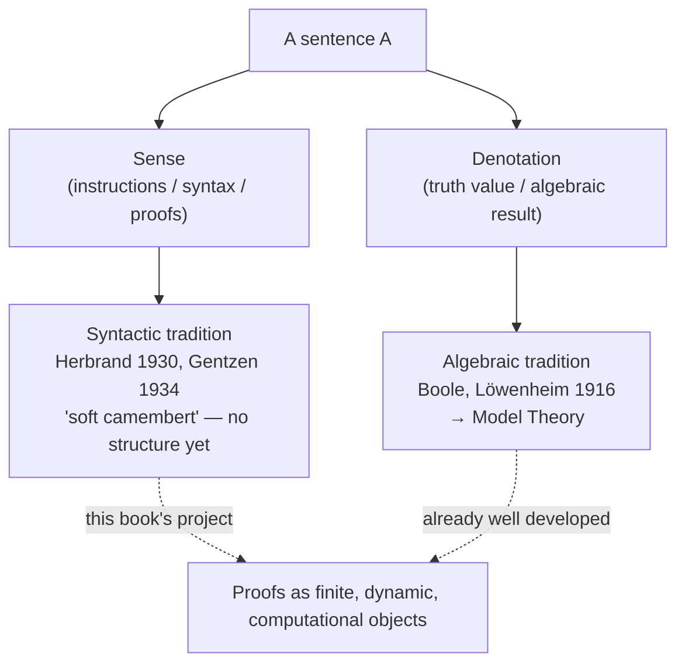
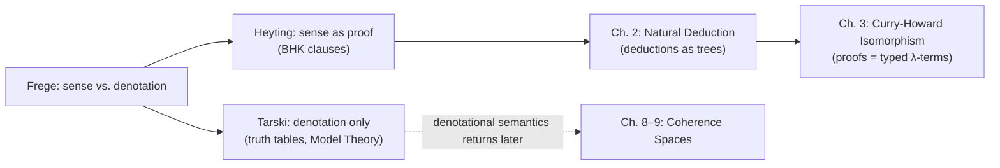

[[book-guidelines|↩ Back to guidelines]]

# Sense and Denotation

## Why start a book about typed programs with a piece of philosophy of language?

Girard opens *Proofs and Types* — a book that is ultimately about typed $\lambda$-calculus and cut-elimination — with something that looks, at first glance, like it belongs in a philosophy-of-language seminar: Frege's distinction between the *sense* of a sentence and its *denotation*. This is not throat-clearing. It's the methodological thesis the entire book is going to argue for, stated up front so you can watch every later chapter cash it out.

Here's the example Girard uses. Consider the equation

$$27 \times 37 = 999$$

You could read this purely denotationally: both sides name the same integer, and $\times$ is a function in the Cantorian sense — a set of ordered pairs, a graph. That reading is correct, but it misses something. There is a finite computation that *establishes* the equality. If the two sides of the equation were simply "the same thing" from the start, in the way that $27 \times 37$ and $27 \times 37$ are trivially the same thing, nobody would ever bother writing the equation down — you write it down precisely because $27 \times 37$ and $999$ arrive at you differently, through different routes, and something has to *do work* to show they end up in the same place. That work — the calculation, the multiplication algorithm, whatever process closes the gap — is what Girard calls the **sense** of the expression, and the shared value both sides settle on is its **denotation**.

**What breaks without this distinction:** if you only ever track denotation, you can say $\times$ "is" an infinite graph of input-output pairs — but no computer has room for an infinite graph. The multiplication *program* loaded into a machine is not the graph of multiplication; it's a finite procedure that produces (an approximation to) the graph, one instance at a time. Denotation-only thinking is silently incapable of talking about *that* object at all. This is Girard's real target for the whole book: proofs and programs are, structurally, exactly this kind of finite, dynamic "sense"-object, and a purely denotational logic (one that only tracks whether things are true) has no vocabulary for them.

## Frege's dichotomy

So, formally: given a sentence $A$, you can look at it two ways.

- As a set of **instructions determining its meaning** — e.g., $A \lor B$ means "$A$ or $B$." This is its **sense**.
- As the **ideal result** those instructions compute — e.g., the sentence's truth value. This is its **denotation**.

"Denotation," as opposed to "notation," is what is *denoted*, not what *denotes*. The denotation of a sentence is $t$ or $f$; the denotation of $A \lor B$ is computed from the denotations of $A$ and $B$ via the truth table for disjunction, discarding everything about *how* $A$ and $B$ came to be true or false.

Two sentences with the same sense obviously have the same denotation. The converse fails badly: take some nontrivial mathematical equivalence $A \Leftrightarrow B$. Both sides are true at exactly the same times (same denotation), but they plainly don't have the same sense — otherwise proving the equivalence would be pointless, and yet people write papers proving such things. This licenses two chains of association that recur through the whole book:

- **sense — syntax — proofs**
- **denotation — truth — semantics — algebraic operations**

Girard is explicit that these two sides do *not* play symmetric roles historically. Denotation was mathematically tamed early; sense was left to drift into subjectivism until it was more or less reduced to "syntactic manipulation" — bureaucratic symbol-pushing with no recognized mathematical structure of its own. *Proofs and Types* exists to push back on that imbalance.

## Two traditions, two amputations

Girard frames the history of logic as two schools, each of which responded to the sense/denotation split by amputating one side.

### The algebraic tradition (Tarski's ancestors)

Founded by Boole, well before Frege, this tradition applies Ockham's razor aggressively: discard sense, keep only denotation. The justification is purely operational — it works. The decisive event was **Löwenheim's theorem** (1916), the seed from which **Model Theory** grew. Read logic purely as "what result does this operation denote," and you get a slightly unusual kind of algebra — one expressive enough to reach beyond ordinary equational algebra into general definable structures. Model theory is the payoff of this choice.

### The syntactic tradition ("soft camembert")

You can't symmetrically discard denotation and keep only sense, because sense *implicitly contains* the denotation (if you know how to compute a sentence's truth, you can extract its truth value; the reverse doesn't hold). So this tradition has a harder job: it never quite found a unified operational handle on "sense," because nobody has given the notion of sense a mathematical structure comparable to what Tarski gave denotation. All that's tangibly available is *the way sense is written* — the formalism — and Girard's verdict on formalism, taken on its own, is unsparing: "an unaccommodating object of study, without true structure, a piece of soft camembert."

And yet: **Gentzen's theorem** (1934) — cut-elimination, which this book builds toward in Chapter 13 — shows that logic *does* have profound symmetries visible at the syntactic level. Those symmetries, Girard argues, aren't really symmetries of *syntax*; they're symmetries of *sense*, merely forced to express themselves through the imperfect medium of syntax, which is why the resulting statements "are not very pretty." Add **Herbrand's theorem** (1930), and computer science's arrival as "that great manipulator of syntax" posing serious theoretical problems, and you get the rescue of a tradition that Girard says would otherwise have quietly died out for lack of a method.



## Tarski: denotation without sense

Tarski's semantics is, deliberately, flat. $\lor$ means "or." $\forall$ means "for all." Nothing more. Formally:

1. Atomic sentences have a known denotation ($3+2=5$ denotes $t$; $3+3=5$ denotes $f$).
2. Compound sentences are read off a truth table:

| $A$ | $B$ | $A \land B$ | $A \lor B$ | $A \Rightarrow B$ | $\neg A$ |
|---|---|---|---|---|---|
| $t$ | $t$ | $t$ | $t$ | $t$ | $f$ |
| $f$ | $t$ | $f$ | $t$ | $t$ | $t$ |
| $t$ | $f$ | $f$ | $t$ | $f$ | |
| $f$ | $f$ | $f$ | $f$ | $t$ | |

3. $\forall \xi.A$ denotes $t$ iff $A[a/\xi]$ denotes $t$ for *every* $a$ in the domain of interpretation; $\exists \xi. A$ denotes $t$ iff $A[a/\xi]$ denotes $t$ for *some* $a$.

Girard calls this "ludicrous from the point of view of logic, but entirely adequate for its purpose" — and the purpose, Model Theory, has vindicated it.

**What breaks without this:** notice that the truth table for $\Rightarrow$ is just a lookup — $A \Rightarrow B$ is true whenever $\lnot A$ or $B$ is true, full stop, with zero reference to any *mechanism* connecting a proof of $A$ to a proof of $B$. If you write a checker that only ever evaluates propositions to booleans (a SAT solver, an evaluator over `bool`), you get a yes/no answer and nothing you can *run*. That's fine if all you want is truth. It's useless if what you actually want — as a compiler or a verifier does — is a **witness**: an actual object certifying the fact, that you can inspect, compose, or execute. Tarski's semantics has no slot for that object, by design.

## Heyting: proofs as the sense of a sentence

This is the chapter's center of gravity, and it's the direct ancestor of everything the rest of the book formalizes. Heyting's move is to stop asking "when is $A$ true?" and ask instead **"what is a proof of $A$?"** — where "proof" doesn't mean the written formal transcript, but the underlying constructive object the transcript merely describes. This is now usually called the **BHK interpretation** (Brouwer–Heyting–Kolmogorov), though Girard presents it simply as Heyting's clauses:

1. Atomic sentences: a proof is whatever you intrinsically accept as evidence (pencil-and-paper calculation proves "$27 \times 37 = 999$").
2. A proof of $A \land B$ is a **pair** $(p, q)$: a proof $p$ of $A$ together with a proof $q$ of $B$.
3. A proof of $A \lor B$ is a **tagged** pair $(i, p)$: either $i=0$ and $p$ proves $A$, or $i=1$ and $p$ proves $B$.
4. A proof of $A \Rightarrow B$ is a **function** $f$ mapping any proof $p$ of $A$ to a proof $f(p)$ of $B$.
5. $\neg A$ is *defined* as $A \Rightarrow \bot$, where $\bot$ is a sentence admitting no proof at all.
6. A proof of $\forall \xi. A$ is a function $f$ mapping each point $a$ of the domain to a proof $f(a)$ of $A[a/\xi]$.
7. A proof of $\exists \xi. A$ is a **witness pair** $(a, p)$: a point $a$ together with a proof $p$ of $A[a/\xi]$.

Read that list again and notice what just happened: conjunction became a *product type*, disjunction became a *tagged sum type*, implication became a *function type*, and existential quantification became a *dependent pair*. Nobody has introduced $\lambda$-calculus yet — that's Chapter 3 — but the data layout of proofs-as-programs is already completely determined by these seven clauses. This is why Girard can say, later in the chapter, that Heyting's constructions "are nothing but typed (i.e. modular) programs."

**Grounding it.** Since this material is proof-theoretic through and through, Lean is the most literal translation — it *is* an implementation of exactly this reading, where proving a proposition means constructing a term of its type:

```lean
-- Heyting's clauses, read as Lean's own propositions-as-types:
example (p : A) (q : B) : A ∧ B := ⟨p, q⟩        -- clause 2: proof of A∧B is a pair
example (p : A) : A ∨ B := Or.inl p               -- clause 3: proof of A∨B is a tagged proof
example (f : A → B) : A → B := f                  -- clause 4: proof of A⇒B *is* a function
example (a : α) (p : P a) : ∃ x, P x := ⟨a, p⟩    -- clause 7: proof of ∃ξ.A is a witness pair
```

There's nothing metaphorical here: `A → B` in Lean is *literally* Heyting's clause 4, and `⟨p, q⟩ : A ∧ B` is *literally* clause 2. This identification, made precise, is the Curry-Howard isomorphism the book formalizes starting in Chapter 3.

Rust can't express dependent quantification (clauses 6–7 need a type depending on a value), but the propositional core — clauses 2 through 5 — maps cleanly onto ordinary sum and product types:

```rust
// A proof of A is a value of type ProofOf<A> (informally: A itself, if we
// treat propositions as types the way Curry-Howard eventually licenses).
struct And<A, B>(A, B);           // clause 2: a proof of A∧B is a pair
enum Or<A, B> { Left(A), Right(B) }; // clause 3: a proof of A∨B is a tagged proof
// clause 4: a proof of A⇒B is a function from proofs of A to proofs of B
type Implies<A, B> = Box<dyn Fn(A) -> B>;
```

**What breaks without this:** the Tarskian truth table for $A \Rightarrow B$ told you *whether* $B$ follows from $A$. Heyting's clause 4 hands you *how*: an actual procedure. This is the whole reason the book can later talk about *normalizing* proofs, *reducing* proofs, *running* proofs — none of that makes sense for a bare boolean. It only makes sense once a proof is a structured, inspectable object like a pair, a tagged value, or a closure.

## Why excluded middle fails

Under Heyting's reading, $A \Rightarrow A$ is proved by the identity function — trivial. But try $A \lor \lnot A$: to prove it you must actually *produce* either a proof of $A$ or a proof of $\lnot A$ (clause 3 demands a tag and a witness), and for an arbitrary $A$ you generally cannot do that — you might not know, and have no procedure to decide, which disjunct holds. So $A \lor \lnot A$ is **not** provable in general under Heyting semantics. This is precisely the constraint that defines **intuitionistic logic**, in the tradition of Brouwer — a logic that Girard notes we'll meet formally later in the book (indeed, it's what [[Natural-Deduction|natural deduction]] in Chapter 2 and the $\lambda$-calculus in Chapter 3 are built for). Classical logic recovers $A \lor \lnot A$ by fiat (or via double-negation elimination); intuitionistic logic refuses to, precisely because refusing it is what keeps every proof a constructive, extractable object rather than a mere assertion of truth.

## The crack in Heyting's own account

Girard doesn't present BHK semantics as a finished foundation — he flags a real problem with it, and this is what motivates the rest of the book's approach. The definitions of $\Rightarrow$ and $\forall$ each quantify over *all* proofs (clause 4: "for every proof $p$ of $A$..."; clause 6: "for every point $a$..."). That's a real, if informal, universal quantifier sitting inside the very definition that's supposed to explain what a proof *is*. Worse, in the $\Rightarrow$ case, nobody has a clean grip on what the domain of $f$ actually consists of — "the collection of all proofs of $A$" is not obviously a well-defined object.

The historically proposed patch was to append, to clauses 4 and 6, "...together with a proof that $f$ has this property." Girard is blunt that this settles nothing — it just relocates the same problem one level up, into "Byzantine discussions" about what that added proof-obligation itself means, discussions he says are "without the least mathematical content." He adds, almost as an aside, that Gödel's incompleteness theorem guarantees this circularity *couldn't* have been avoided by cleverness: any sufficiently expressive foundational account of "what is a proof" is going to run into exactly this kind of self-reference.

This is the real reason the book doesn't stop at chapter 1. If naive BHK semantics can't be made fully rigorous as a *foundation*, the fix is to stop trying to found mathematics on it and instead treat it as what it actually is: a beautifully accurate *specification* of how proof-construction behaves, which can then be captured precisely by an actual formal system — natural deduction (Chapter 2), reinterpreted as term construction in the typed $\lambda$-calculus (Chapter 3). Girard's closing remark in the chapter — that Heyting's idea "works" once its "foundational pretensions have been removed," surviving intact inside Curry-Howard and inside Realisability — is the thesis statement for the entire book compressed into one sentence.

## Where this leads



Everything downstream in this book is Girard making good on the promise of this chapter: that the "sense" side of logic — proofs, treated as finite, dynamic, constructive objects rather than as mere certificates of truth — can be given the same mathematical precision Tarski gave to denotation. Chapter 2's natural deduction is the first formal system in which Heyting's clauses stop being philosophy and become literal syntax; Chapter 3's Curry-Howard isomorphism is where the pairs, tagged values, and functions of this chapter's BHK clauses become actual typed terms with actual reduction rules.

For the standing project this vault is built around: this chapter is the historical and conceptual root of *why* a proof can be treated as a data structure a checker manipulates rather than a black-box boolean a solver merely evaluates. Heyting's clause for $\Rightarrow$ — a proof is a function from proofs to proofs — is exactly the shape that Lean's kernel takes literally (a `→` type *is* this clause, no metaphor involved), which is why Lean is the natural place to see this correspondence made completely precise. And the tension Girard flags at the end of the chapter — the unclear domain of quantification lurking inside "for every proof $p$" — is the same tension that shows up later, in disguised form, wherever a checker or elaborator needs to reason about "the set of all valid proofs/terms of a type" without that set being pinned down by an explicit judgment. That's the load-bearing reason a *formal* system (with an explicit syntax for terms and explicit typing judgments, as built starting in Chapter 2) is not optional machinery layered on top of BHK semantics — it's the thing that rescues BHK semantics from its own circularity.
