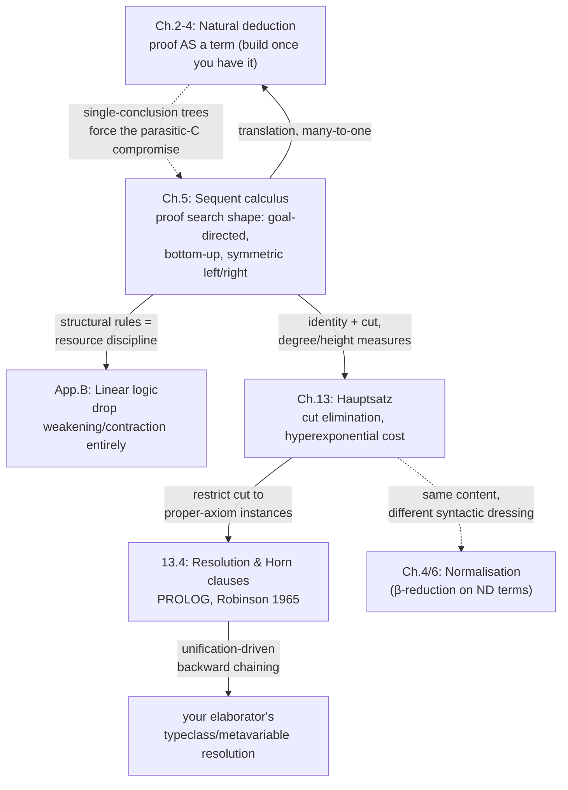

[[book-guidelines|↩ Back to guidelines]]

# Sequent Calculus and Cut Elimination

## Why a second calculus, if natural deduction already works

Chapters 2–4 gave you a system where a *proof is a program*: a natural-deduction tree translates directly into a $\lambda$-term, normalisation is evaluation, and a normal form is a value. That's the right object to *have* once you've found a proof. But it says almost nothing about how you'd *find* one. Reading a finished natural-deduction tree top to bottom looks like a program; building one from scratch, goal first, is a search problem — and search wants to run backward, from the thing you're trying to prove toward the axioms that could support it.

That's exactly the gap the sequent calculus fills. Girard opens Chapter 5 by calling it "the prettiest illustration of the symmetries of Logic," and the symmetry he means is very concrete: unlike natural deduction, which singles out one formula as *the* conclusion and buries its hypotheses as tree leaves, a sequent
$$
A \vdash B
$$
puts a whole list of formulas on *both* sides of the turnstile, on completely equal footing. $A$ and $B$ are finite sequences of formulas $A_1,\dots,A_n$ and $B_1,\dots,B_m$; read naively (denotationally) the sequent asserts that the conjunction of the $A_i$ implies the disjunction of the $B_j$. Four degenerate readings fall out immediately: if $A$ is empty, the sequent just asserts $\bigvee B_j$; if $A$ is empty and $B$ is a single formula, it asserts that formula outright; if $B$ is empty, it asserts $\neg\bigwedge A_i$; and if both are empty, it asserts a contradiction.

**What breaks without this symmetry.** You already met the cost of natural deduction's single-conclusion tree shape in the [[Natural-Deduction|Natural Deduction]] article: the elimination rules for $\lor$, $\exists$, and $\bot$ need a "parasitic" extra formula $C$, because natural deduction has no notation for "two dangling conclusions to be reunited later." Girard names the sequent calculus explicitly as the origin of that compromise — "$C$ plays the rôle of a context, and the writing of these rules is a concession to sequent calculus." Sequent calculus is the system where that reunification doesn't need forcing, because a sequent already has room for many formulas on the right. The price, as you'll see, is that the same natural-deduction proof now has *many* different sequent-calculus derivations — you gain search-friendliness and symmetry, and give up the tight bijection with terms.

This article follows the book's own split: Chapter 5 sets up the calculus itself and its translation into natural deduction, then defers the hardest theorem — cut elimination, Gentzen's *Hauptsatz* — to Chapter 13, once you have degree and height measures to run the induction on. Both halves belong to one story, so this article reads them together.

## Structural rules: the calculus before there's a single connective

Section 5.1.2 introduces three families of rules that mention no logical symbol at all — they only govern how formulas may be duplicated, discarded, or reordered within a sequent. Girard's own framing is worth keeping: they "seem not to say anything at all," yet "contrary to popular belief, these rules are the most important of the whole calculus, for, without having written a single logical symbol, we have practically determined the future behaviour of the logical operations."

**Exchange** — formulas may be permuted freely on either side:
$$
\dfrac{A, C, D, A' \vdash B}{A, D, C, A' \vdash B}\ L\text{X}
\qquad\qquad
\dfrac{A \vdash B, C, D, B'}{A \vdash B, D, C, B'}\ R\text{X}
$$
This expresses, in Girard's words, "the commutativity of logic" — a sequence of hypotheses behaves like a *set*, not an ordered list, as far as provability goes.

**Weakening** — a sequent may always be replaced by a weaker one, i.e. an unused formula may be added for free:
$$
\dfrac{A \vdash B}{A, C \vdash B}\ LW
\qquad\qquad
\dfrac{A \vdash B}{A \vdash C, B}\ RW
$$

**Contraction** — two identical occurrences may be collapsed into one, expressing "the idempotence of conjunction and disjunction":
$$
\dfrac{A, C, C \vdash B}{A, C \vdash B}\ LC
\qquad\qquad
\dfrac{A \vdash C, C, B}{A \vdash C, B}\ RC
$$

**Why these are load-bearing rather than bureaucratic.** Read operationally, each structural rule answers a question about *how many times* a hypothesis gets used: exchange says order doesn't matter, weakening says zero uses is fine, contraction says more than one use is fine. Together they say a hypothesis is a resource you may use freely — any number of times, in any order. That is a strong assumption, and Girard flags immediately that dropping it is possible: "It is possible to envisage variants on the sequent calculus, in which these rules are abolished or extremely restricted. That seems to have some very beneficial effects, leading to [[Linear-Logic|linear logic]]." This is the exact fork in the road that Appendix B eventually takes — restrict weakening and contraction to exactly-once usage, and you get a calculus where formulas behave like resources that must be consumed, not truths that may be cited arbitrarily often.

**Rust makes the resource reading of contraction and weakening completely literal**, because Rust's ownership discipline *is* linear logic's restriction lived out at the value level, and un-restricted structural rules are exactly what `Clone`/`Copy` and implicit drop give back:

```rust
// "A, C, C ⊢ B" using a hypothesis twice is exactly using a value twice —
// which Rust only allows if the value is Clone (or Copy). Contraction (LC)
// is "I don't need two copies, one will do" — collapsing duplicate access
// back down to a single owned value.
fn contract<C: Clone>(c: C, use_twice: impl Fn(C, C) -> bool) -> bool {
    use_twice(c.clone(), c) // two occurrences of C, freely duplicated
}

// Weakening (LW) is exactly an unused function argument — a hypothesis
// nobody consults. Ordinary Rust functions permit this trivially; only a
// linear-typed language would reject an unused binding as an error.
fn weaken<B>(_unused: impl std::fmt::Debug, conclusion: B) -> B {
    conclusion
}
```
A language that forbade the implicit `.clone()` above and *forced* every binding to be consumed exactly once would be exactly the "linear" sequent calculus Girard is pointing toward — which is, not coincidentally, close to how a linear type system like Rust's borrow checker actually behaves for non-`Copy` types (move-once, no implicit duplication). Keep this analogy in your pocket; it becomes exact machinery once you reach linear logic.

## The intuitionistic restriction: giving up symmetry to get it back differently

Section 5.1.3 restricts sequents to *intuitionistic* form: $A \vdash B$ where $B$ contains **at most one formula**. Under this restriction, $RX$ and $RC$ (which both presuppose several formulas on the right) simply vanish — the only surviving right-structural rule is $RW$.

This is a real trade-off, and Girard is explicit about it: restricting to at-most-one-formula-on-the-right *is* a modification to how formulas are managed — "the particular place distinguished by the symbol $\vdash$ is a place where contraction is forbidden" — and it costs you the left/right symmetry that made the calculus pretty in the first place. He immediately previews the better fix, the one linear logic eventually takes: "A better result is without doubt obtained by forbidding contraction (and weakening) altogether, which allows the symmetry to reappear." For now, though, the book keeps the classical rules and just restricts which sequents you're allowed to form.

One rule needs its own version under this restriction. The classical $L\lor$ has two conclusions on the right (a $B,B$ that must then be contracted down); the intuitionistic version is written directly with at most one formula on the right from the start:
$$
\dfrac{A, C \vdash B \qquad A', D \vdash B}{A, A', C\lor D \vdash B}\ L{\lor}
$$
where $B$ has zero or one formula. Girard notes this is genuinely a *different* rule, not a restricted instance of the classical one — the classical $L\lor$ would leave you needing to contract $B,B$ down to $B$ using $RC$, a rule the intuitionistic calculus no longer has.

**Why this restriction is familiar even before you've seen it named.** A sequent with several formulas on the right is a proof of "one of these," a disjunction of possible answers — the shape of a computation with several possible outcomes, resolved later. An intuitionistic sequent, with at most one, matches something you already rely on constantly: a function has exactly one return type. $A \vdash B$ with a single $B$ is the sequent-calculus mirror of a total function signature; a classical sequent with many succedents is closer to a nondeterministic or multi-shot computation that hasn't yet committed to which answer it returns. This restriction is precisely what keeps the calculus lined up with the single-conclusion natural-deduction trees of Chapters 2–4 — it's the sequent-calculus precondition for the translation in the next section to even make sense.

## Identity and cut: two faces of "$A$ is $A$"

Section 5.1.4 isolates what Girard calls the "identity" group — two rules that, unlike everything discussed so far, involve no context management at all, only the raw fact of a formula being identical to itself.

**The identity axiom.** For every formula $C$, there is an axiom
$$
\dfrac{}{C \vdash C}\ \mathrm{Id}
$$
(One could restrict this to atomic $C$ — every compound instance is derivable from the atomic ones using the logical rules — "but this is rarely done.") This axiom is the base case of *every* proof; nothing gets started without it.

**The cut rule**, the calculus's single most important non-structural rule:
$$
\dfrac{A \vdash C, B \qquad A', C \vdash B'}{A, A' \vdash B, B'}\ \mathrm{Cut}
$$
Girard reads the two rules as duals of the same claim, "$C$ is $C$," seen from opposite directions: the identity axiom says $C$ *on the left* is at least as strong as $C$ *on the right* — using $C$ as a hypothesis gets you at least as far as asserting $C$. The cut rule states the converse: if you can derive $C$ (the left premise proves $C$ on the right, i.e. as a conclusion) and you can also get from $C$ (as a hypothesis, on the left of the second premise) to something further, then you can chain them — $C$ on the right is at least as strong as $C$ on the left, in the sense that a proof *of* $C$ can stand in for a hypothesis *of* $C$.

Cut is exactly "prove a lemma, then use it": the left premise proves $C$; the right premise assumes $C$ and proves the actual goal; cut glues them into one proof of the goal that never mentions $C$ as a separate step, folding the intermediate fact away. This is the single cleanest place in the whole calculus to reach for **Lean**, because Lean's tactic-mode proofs perform literal cuts constantly:

```lean
-- The cut rule, verbatim: prove C, then use C to finish the goal.
example (A A' B B' C : Prop) (h1 : A → C) (h2 : C → A' → B) (a : A) (a' : A') : B :=
  have c : C := h1 a        -- left premise: A ⊢ C  (produce C)
  h2 c a'                   -- right premise: C, A' ⊢ B  (consume C)
```
`have c : C := h1 a` *is* the left premise of a cut, materialized as a term; the rest of the proof, which uses `c`, is the right premise. And `exact` closing a goal that matches a hypothesis exactly, with no further manipulation, is the identity axiom made into a tactic: `exact h` where `h : C` and the goal is `C` is nothing but $C \vdash C$.

Girard's remark that closes the section is the entire reason this article's second half exists: "The identity axiom is absolutely necessary to any proof, to start things off. That is undoubtedly why the cut rule, which represents the dual, symmetric aspect, can be eliminated, by means of a difficult theorem (proved in chapter 13) which is related to the normalisation theorem. The deep content of the two results is the same; they only differ in their syntactic dressing." Cut elimination is the sequent-calculus twin of $\beta$-reduction eliminating redexes in natural deduction — the same idea, un-simplifying and using intermediate lemmas versus proving something in one direct, unmediated pass.

## Logical rules and the "logical atrocity" test

Section 5.1.5 gives left/right rule pairs for each connective; the pattern to internalize is the implication case, since it's the one that later forces the Hauptsatz's only two-cut reduction:
$$
\dfrac{A, C \vdash D, B}{A \vdash C\Rightarrow D, B}\ R{\Rightarrow}
\qquad\qquad
\dfrac{A \vdash C, B \qquad A', D \vdash B'}{A, A', C\Rightarrow D \vdash B, B'}\ L{\Rightarrow}
$$
Notice the asymmetry Girard flags explicitly: $R\Rightarrow$ has one premise, $L\Rightarrow$ has two, and $L\Rightarrow$ uses *two* occurrences of the implication's parts (one to discharge $C$, one to consume $D$) where $R\Rightarrow$ only introduces one occurrence of each. This lopsidedness is not a defect — it's exactly what makes cut on an implication need to split into two separate cuts later.

Girard's real point in this section is methodological, and it's stated with real force: "one can amuse oneself by inventing one's own logical operations, but they have to respect the left/right symmetry, otherwise one creates a logical atrocity without interest. Concretely, the symmetry is the fact that we can eliminate the cut rule." Read that as a design principle that outlives this specific calculus: a connective (or, generalized, a language feature) earns its keep not by having plausible-looking introduction and elimination rules, but by those rules composing cleanly enough that intermediate steps can always be eliminated in favor of a direct construction. It's the sequent-calculus version of the same demand the [[The-Curry-Howard-Isomorphism|Curry-Howard]] article made of a genuine isomorphism: the structure has to hold up under its own reduction, not just look right on paper.

## The subformula property, and what cut-free proofs can and can't tell you

Section 5.2.2 states the property that makes cut special among all the rules: every rule except cut has the feature that its premises are built from **subformulae** of its conclusion — $A$ and $B$ for a conclusion $A\land B$ or $A\lor B$ or $A\Rightarrow B$; $A$ alone for $\neg A$; instances $A[a/\xi]$ for $\forall\xi.A$ or $\exists\xi.A$. Cut alone is unpredictable: an arbitrary formula $C$ disappears from the conclusion entirely and "cannot be recovered from the conclusions."

The consequence: **a cut-free proof of a sequent uses only subformulae of that sequent.** This is what Girard calls "very interesting for automated deduction" — a proof search procedure that only ever needs to consider cut-free derivations can restrict its search space to subformulae of the goal, instead of the entire (infinite) space of formulas. It does *not*, on its own, make predicate logic decidable, because a sentence with quantifiers has infinitely many instantiated subformulae $A[a/\xi]$ — the subformula property bounds *what shape* the proof can use, not how many instances of that shape you might need to try.

Two "particularly famous" consequences fall out of the intuitionistic restriction combined with cut-freeness (Section 5.2.1, on the **last rule** of a cut-free proof): since the only structural rule surviving on the right is $RW$ (which can't prove an empty sequent), the last rule of a cut-free intuitionistic proof of $\vdash A$ must be a right logical rule matching $A$'s main connective. Two cases matter:
- **The Disjunction Property**: if $A = A' \lor A''$, the last rule is $R_1\lor$ or $R_2\lor$, so *one of $\vdash A'$ or $\vdash A''$ is separately provable* — intuitionistic provability of a disjunction always comes down to provability of one disjunct, with no "third way."
- **The Existence Property**: if $A = \exists\xi.A'$, the last rule is $R\exists$, so some concrete term $t$ exists with $\vdash A'[t/\xi]$ provable — an existence proof always yields an actual witness.

Both properties are exactly the kind of fact that separates intuitionistic logic from classical logic operationally: they'd be false in general for classical proofs (which can prove $\vdash A \lor \neg A$ without deciding which disjunct holds), and they're the formal reason intuitionistic proofs can be read as programs that *compute* an answer rather than merely asserting one exists.

## Translating sequent proofs into natural-deduction terms

Section 5.3 restricts to the "noble part" of natural deduction — the $(\land,\Rightarrow,\forall)$ fragment without $\lor,\exists,\neg$ — and builds an explicit map from cut-and-all sequent proofs of $A \vdash B$ to natural-deduction trees of $B$ under parcels of hypotheses $A$. The map is a case analysis on the last rule of the sequent proof; the correspondence is close to mechanical once you see the pattern:

- **The axiom** $A \vdash A$ becomes the one-node deduction: the bare hypothesis $A$.
- **$LX$** (exchange) is interpreted as the identity — the same deduction before and after. *Exchange corresponds to nothing at all* on the natural-deduction side, because parcels have no order in the first place.
- **$LW$** (weakening) becomes the creation of a *mock parcel* — an empty parcel with zero occurrences of $C$. Weakening is exactly "you're allowed to discharge a hypothesis you never actually used."
- **$LC$** (contraction) becomes the *unification of two $C$-parcels into one* — the ability to form one big parcel out of several occurrences.
- **$R\land$** becomes $\land I$: build the deductions of $B$ and $C$ from the two premises, then pair them.
- **$R\Rightarrow$** becomes $\Rightarrow I$: from a deduction of $C$ under a $B$-parcel, discharge the whole parcel at once to get $B\Rightarrow C$.
- **$R\forall$** becomes $\forall I$, directly.
- **The left rules are where something genuinely interesting happens**: $L_1\land$ becomes $\land_1E$, $L\Rightarrow$ becomes $\Rightarrow E$, $L\forall$ becomes $\forall E$ — but Girard flags that these are "written backwards": a left rule reads top-to-bottom as *replacing* a parcel (e.g. a $(B\land C)$-parcel becomes a $B$-parcel), while the corresponding elimination rule in natural deduction has to be read as the tree growing *upward from its leaves*, since natural-deduction elimination is where the tree's leaves — its hypotheses — actually get consumed.
- **Cut corresponds to nothing in natural deduction** except *growth at the root*. This is worth sitting with, because it's the precise formal shape of "using a lemma": translating $L\Rightarrow$ literally produces a deduction that grows toward the leaves (the wrong direction for building up a term bottom-to-top), and the *only* way to get the calculus's full power back is the top-down version, which is exactly what a cut supplies — the block
$$
\dfrac{A' \vdash A \qquad B \vdash B}{A', A\Rightarrow B \vdash B}\ L{\Rightarrow}
\qquad\qquad
\dfrac{\dfrac{A' \vdash A \qquad B \vdash B}{A', A\Rightarrow B \vdash B}\ L{\Rightarrow} \qquad B' \vdash A\Rightarrow B}{A', B' \vdash B}\ \mathrm{Cut}
$$
translates to the ordinary, top-down $\Rightarrow E$ redex you already know: a deduction of $A\Rightarrow B$ applied to a deduction of $A$.

**This translation is many-to-one, not invertible**, and the book's own counterexample is decisive: reordering two applications of $L_1\land$ around an $R\land$ produces two syntactically distinct sequent-calculus derivations of $A\land A', B\land B' \vdash A\land B$ that translate to the *identical* natural-deduction tree (both project $A$ out of $A\land A'$ and $B$ out of $B\land B'$, then pair). Girard's conclusion: "it would be vain to look for an inverse transformation… we should think of the natural deductions as the true 'proof' objects. The sequent calculus is only a system which enables us to work on these objects." A rule like cut, in this light, isn't a primitive logical operation at all — it's a *combinator*, a way of gluing two already-built natural deductions into a bigger one, made explicit by the translation.

**"Normal = cut-free," with an asterisk.** Because cut is the only rule that grows the wrong way, translating a cut-*free* proof reliably yields a *normal* deduction — there's no mechanism left to produce an introduction immediately followed by its matching elimination (a redex needs an introduction growing top-down meeting an elimination growing bottom-up, and cut was the only rule doing the latter). But the reverse containment is only a "moral equivalence," not a theorem: the book's own example, cutting $A\vdash A$ against $A\vdash A$, translates to the *one-node* deduction "$A$" — a normal deduction produced by a proof that still has a cut in it, because that particular cut happened to be entirely redundant (cutting an axiom against another instance of itself does no real work). Some proofs with cut also give normal deductions; the theorem that will pin down the precise relationship, in full, is the Hauptsatz.

## The Hauptsatz: eliminating cut for real

Chapter 13 delivers the theorem Chapter 5 kept deferring. Girard's framing sets the tone: "Gentzen's theorem, one of the most important in logic, is not very far removed from normalisation in natural deduction… However the proof is very delicate and fiddly." The strategy mirrors the [[Normalisation-Theorems|weak normalisation proof]] from Chapter 4 closely — reduce cuts of highest complexity first, using a two-stage induction (an outer induction that lowers the *degree* of the worst cut, an inner induction, the "principal lemma," that does the actual rewriting) — but the bookkeeping is heavier, because a sequent proof has structural rules cluttering every step in a way natural deduction's tree doesn't.

### The key cases: right meets left on the same connective

Section 13.1 works out, connective by connective, what happens when a cut's left premise ends in a *right* logical rule and its right premise ends in the matching *left* logical rule, both introducing the same principal connective $C$. In every such case the cut on the compound formula can be replaced by cut(s) on its strictly simpler immediate parts.

**Conjunction** (the case Girard uses to set the pattern): a cut on $C\land D$ where the left premise used $R\land$ and the right used $L_1\land$
$$
\dfrac{\dfrac{A \vdash C, B \qquad A' \vdash D, B'}{A, A' \vdash C\land D, B, B'}\ R{\land} \qquad\quad \dfrac{A'', C \vdash B''}{A'', C\land D \vdash B''}\ L_1{\land}}{A, A', A'' \vdash B, B', B''}\ \mathrm{Cut}
$$
is replaced by a strictly smaller cut, on $C$ alone, discarding the now-irrelevant $D$-side entirely and patching the context back up with structural rules:
$$
\dfrac{\dfrac{A \vdash C, B \qquad A'', C \vdash B''}{A, A'' \vdash B, B''}\ \mathrm{Cut}}{A, A', A'' \vdash B, B', B''}\ \text{(structural rules)}
$$
The $L_2\land$ case is symmetric (keep the $D$-side, discard $C$); negation, disjunction, and the quantifier cases each reduce similarly, one cut of the compound formula becoming one cut of an immediate subformula.

**Implication — the one case needing two cuts**, which is the answer to why the asymmetric rule pair from Section 5.1.5 matters: a cut on $C\Rightarrow D$ where the left premise used $R\Rightarrow$ and the right used $L\Rightarrow$
$$
\dfrac{\dfrac{A, C \vdash D, B}{A \vdash C\Rightarrow D, B}\ R{\Rightarrow} \qquad\quad \dfrac{A' \vdash C, B' \qquad A'', D \vdash B''}{A', A'', C\Rightarrow D \vdash B', B''}\ L{\Rightarrow}}{A, A', A'' \vdash B, B', B''}\ \mathrm{Cut}
$$
is replaced not by one smaller cut but by **two**, chained:
$$
\dfrac{\dfrac{A' \vdash C, B' \qquad A, C \vdash D, B}{A, A' \vdash D, B', B}\ \mathrm{Cut} \qquad\quad A'', D \vdash B''}{A, A', A'' \vdash B, B', B''}\ \mathrm{Cut}
$$
The reason is exactly the asymmetry you already saw: $L\Rightarrow$ has two premises and consumes two separate pieces ($C$ to satisfy the antecedent, $D$ to consume the consequent), where $R\Rightarrow$'s single premise only produced one occurrence of each. One cut on the compound formula genuinely has to unpack into work on *both* immediate parts, and there's no way to do that with a single cut — hence two, run in sequence. This is the single clearest place in the whole chapter where the shape of a logical rule directly dictates the shape of its own elimination procedure.

### Degree, height, and the principal lemma

Section 13.2 sets up the measures the induction runs on. The **degree** $\partial(A)$ of a formula counts (roughly) its connective depth: atomic formulas have degree $1$; $\partial(A\land B)=\partial(A\lor B)=\partial(A\Rightarrow B)=\max(\partial(A),\partial(B))+1$; $\partial(\neg A)=\partial(\forall\xi.A)=\partial(\exists\xi.A)=\partial(A)+1$ — and crucially $\partial(A[a/\xi])=\partial(A)$, substitution doesn't change degree, which is exactly what lets the quantifier key-cases (7 and 8 above) work by pure substitution without changing the cut's complexity class. The **degree of a cut** is the degree of the formula it eliminates; the **degree $d(\pi)$ of a proof** is the largest degree among its cuts (so $d(\pi)=0$ iff $\pi$ is cut-free). The **height $h(\pi)$** is the height of the proof tree, defined the obvious recursive way.

The **principal lemma**: given a formula $C$ of degree $d$ and two proofs $\pi,\pi'$ of $A\vdash B$ and $A'\vdash B'$, each of degree *less than* $d$, there is a proof of $A,A'-C \vdash B-C,B'$ (writing $X-C$ for $X$ with some occurrences of $C$ deleted) that *also* has degree less than $d$. The proof is by induction on $h(\pi)+h(\pi')$, and Girard flags an important asymmetry in the argument itself: "unfortunately not symmetrically in $\pi$ and $\pi'$: at some stages preference is given to $\pi$, or to $\pi'$." The interesting case (case 7 of the book's seven-way split) is exactly the situation of the previous section — both $\pi$ and $\pi'$ end in a logical rule on the principal formula $C$ — and it's resolved by recursing on the immediate subproofs to strip $C$ out of each side separately, then re-cutting the results, which lands you back in one of the *key cases*, now legitimately at lower degree.

### The theorem, and what it costs

**The Hauptsatz proposition**: if $\pi$ proves a sequent at degree $d>0$, there's a proof $\varpi$ of the *same sequent* at strictly lower degree — proved by induction on $h(\pi)$, applying the principal lemma exactly at the point where the last rule is a cut of degree $d$. Iterating this proposition down to degree $0$ gives:

> **Theorem (Gentzen, 1934).** The cut rule is redundant in sequent calculus.

That single sentence is doing an enormous amount of work, and Girard immediately turns to what it costs to actually run this procedure. The **principal lemma is linear**: eliminating one cut multiplies the proof's height by a constant $k=4$ in the worst case. The **proposition is exponential**: reducing the degree by one turns a proof of height $h$ into one of height up to $4^h$, because eliminating all the degree-$d$ cuts (there can be as many as $h$ of them, roughly) each multiplies by $4$. Iterating across all $d$ degrees compounds exponentials on top of exponentials — **hyperexponentially**:
$$
H(0,h) = h \qquad\qquad H(d+1,h) = 4^{H(d,h)}
$$
A proof of height $h$ and degree $d$ becomes, at worst, one of height $H(d,h)$ after full cut elimination. Concretely, for a modest starting height $h=5$:

| Degree reductions | Worst-case height |
|---|---|
| $H(0,5)$ | $5$ |
| $H(1,5) = 4^5$ | $1{,}024$ |
| $H(2,5) = 4^{1024}$ | (roughly $10^{617}$ — already past the estimated number of atoms in the observable universe) |
| $H(3,5) = 4^{H(2,5)}$ | not writable in any standard notation |

Girard's verdict: "we have the all too common situation of an algorithm which is effective but not feasible, in general, since we do not need to iterate the exponential very often before we exceed all conceivable measures of the size of the universe." Cut elimination *terminates* — it's a genuine decision procedure, not a heuristic — but running it to completion on a real proof of any depth is not something you would ever actually do. This is the sharpest illustration in the whole book of a distinction that matters far beyond logic: *decidable* and *tractable* are different properties, and a correctness proof for an algorithm tells you nothing about whether you should run it.

**A Rust sketch of the rewriting procedure itself** makes the blow-up mechanism concrete — not a full formalization (the real system needs the structural-rule bookkeeping this omits), but enough to see why each step is a multiplicative, not additive, cost:

```rust
// One step of cut elimination: given a cut on formula `c`, dispatch to the
// matching key case and recurse. Each key case either produces one smaller
// cut (most connectives) or two (implication) — and each recursive call can
// itself trigger further key-case rewrites deeper in the tree, which is
// exactly why height multiplies rather than adds at every level.
fn eliminate_cut(proof: SequentProof) -> SequentProof {
    match proof.last_rule() {
        Rule::Cut { left, right, cut_formula } if cut_formula.degree() > 0 => {
            match (left.last_rule(), right.last_rule()) {
                // conjunction, disjunction, negation, quantifiers: one smaller cut
                (Rule::RightIntro(_), Rule::LeftIntro(_)) if /* matching connective */ true =>
                    eliminate_cut(single_smaller_cut(left, right)),
                // implication: the one case needing *two* chained cuts
                (Rule::RImplies, Rule::LImplies) =>
                    eliminate_cut(chain_two_cuts(left, right)),
                // axiom on either side: cut is trivially redundant
                (Rule::Axiom, _) | (_, Rule::Axiom) =>
                    structural_rewrite(left, right),
                _ => proof, // cut isn't on the principal formula: push it inward first
            }
        }
        _ => proof, // no cut, or already degree 0: nothing to do
    }
}
```

## Resolution and Horn clauses: cut elimination becomes an algorithm you'd actually run

Section 13.4 is where the theoretical result turns into the machinery behind real automated theorem proving. Gentzen's Hauptsatz, as proved above, only covers *pure* logic — proofs with no nontrivial axioms besides identity. Real proof search needs axioms: facts and rules specific to a domain. Girard's extension: examine the Hauptsatz's proof again, and notice the *only* place it can get stuck is when one of a cut's two premises is itself an axiom — so extend the theorem by allowing cut on sequents obtained from **proper axioms by substitution**, alongside everything else. The Hauptsatz survives in this relativized form: cut can always be restricted to instances of the axioms you actually care about.

**Restricting to atomic sequents removes the logical rules from the picture entirely.** If both the proper axioms and the target conclusion are built from atomic formulas, there's no need for any $\land,\lor,\Rightarrow,\forall,\exists$ rule — the whole proof is built from identity axioms, proper-axiom instances, cut, and structural rules alone.

This is exactly PROLOG's setting. The proper axioms take the restricted form of **atomic intuitionistic sequents** $A \vdash B$, called **Horn clauses**: a single atomic conclusion $B$ from a list of atomic hypotheses $A$ (read backward, as a rule: "$B$ holds if $A_1,\dots,A_n$ all hold"). A **goal** is an atomic sequent with an empty left side, $\vdash B$ — "prove $B$." Available tools: substitution instances of the proper axioms, identity axioms $A \vdash A$ for atomic $A$, cut, and the structural rules.

**Contraction and weakening turn out to be redundant here** — Section 13.4's lemma shows that any atomic sequent provable with the full toolkit is also provable *without* weakening or contraction, using only some subset of the original hypotheses and reaching some sequent's conclusion. Applied to a goal $\vdash B$ (empty left side), the corollary is sharp: **you only ever need cut with instances of proper axioms** to prove a goal — no structural juggling, no exchange even (cuts can be reordered directly), and cutting an identity axiom against itself is provably useless. What's left, stripped down, is: repeatedly select a Horn clause whose conclusion matches (via substitution) the current goal, and recurse on its hypotheses as new subgoals.

That stripped-down procedure is precisely **Robinson's resolution method (1965)**: "try all possible combinations of cuts and substitutions, the latter being limited by unification." Cut is the resolution step; matching a goal against a clause's head *up to substitution* is unification; backtracking across different clause choices is the search. This is not an analogy Girard is drawing after the fact — the chapter is stating outright that PROLOG's execution model *is* a controlled, goal-directed instance of cut, running the Hauptsatz's machinery live, one resolution step at a time, on Horn-clause axioms instead of pure logic.

**This is the most directly load-bearing piece of source material in either chapter for a Rust-based automated theorem prover**, because it hands you the algorithm's shape almost for free: identity axiom is the search's base case, Horn clauses are the rule database, cut is resolution, and substitution is unification. A minimal skeleton, restricted to ground (variable-free) atoms to keep unification trivial equality-checking rather than a full algorithm:

```rust
#[derive(Clone, PartialEq, Debug)]
struct Atom(String);

/// A Horn clause `A ⊢ B`: prove `head` if every formula in `body` is provable.
/// An empty body is a proper (fact) axiom — the base case, playing the role
/// of the identity axiom once its own body subgoals are all closed.
struct HornClause { head: Atom, body: Vec<Atom> }

/// Backward-chaining proof search: exactly the restricted Hauptsatz of 13.4.
/// Each recursive call is one cut against an instance of a proper axiom.
fn prove(goal: &Atom, clauses: &[HornClause]) -> bool {
    clauses.iter().any(|clause| {
        // "unification limited to matching" — real Prolog substitutes free
        // variables here; this ground version only checks head == goal.
        clause.head == *goal
            && clause.body.iter().all(|subgoal| prove(subgoal, clauses))
    })
}

fn main() {
    let clauses = vec![
        HornClause { head: Atom("mortal(socrates)".into()), body: vec![Atom("human(socrates)".into())] },
        HornClause { head: Atom("human(socrates)".into()), body: vec![] }, // proper axiom (fact)
    ];
    assert!(prove(&Atom("mortal(socrates)".into()), &clauses)); // ⊢ mortal(socrates)
}
```

**Lean's own proof automation runs on the same principle**, which is worth naming explicitly rather than leaving implicit: Lean's typeclass resolution — the mechanism that finds an `Add Nat` instance, or infers a `Monad` instance for `Option` — is a Horn-clause resolution engine. An `instance` declaration with hypotheses (`instance [Add α] : Add (List α)` — roughly, "if `α` has `Add`, so does `List α`") is a Horn clause with a nonempty body; instance search backward-chains from the goal instance through the instance database exactly like `prove` above, with real (not just ground) unification handling metavariables. This is precisely the "meta-programming elaborator resolving implicit arguments via metavariable unification" target from the standing project: Section 13.4 is not adjacent background to that problem, it is a description of its proof-theoretic ancestor, one chapter before Girard even gets to system F.

## Where this leads



Structurally, this chapter pair is the calculus Girard reaches for whenever a later chapter needs proof *search* rather than proof *terms*: Appendix B's linear logic is obtained by taking this chapter's structural rules seriously as a resource discipline and restricting them; the whole PROLOG/resolution connection made explicit in 13.4 is the reason Girard opens Chapter 5 by insisting the sequent calculus "is used unwittingly by many people" mixed into ordinary tools.

For the standing project, this is one of the most directly applicable topics in the book so far, on both fronts. For the **Rust verifier/prover**: Section 13.4's restricted Hauptsatz — cut relativized to proper-axiom instances, Horn clauses, goals — is close to literally the specification of a backward-chaining proof search engine; the subformula property (Section 5.2.2) is the reason such a search can be bounded at all, by restricting the space of formulas it needs to consider. For the **elaborator**: cut-as-lemma-application is the proof-theoretic name for what `have`/intermediate definitions do, and Lean's typeclass resolution is, without exaggeration, an instance of Horn-clause resolution running inside a real kernel — the exact mechanism your own metavariable unification will need to reproduce in miniature. Keep the hyperexponential cost bound in mind too: it's a standing warning that "cut elimination is a decision procedure" and "cut elimination is something you should ever fully run" are very different claims, a distinction any theorem prover you build will have to respect by *not* naively eliminating every intermediate lemma before checking a proof.
