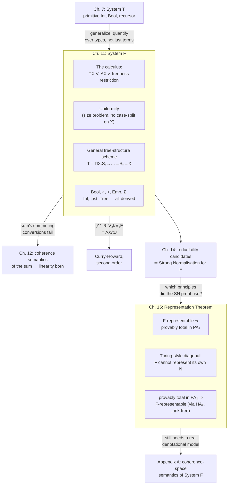

[[book-guidelines|↩ Back to guidelines]]

# System F and Polymorphism

## Why the simply typed calculus needs a second order

[[Gödel's-System-T|Gödel's system T]] (chapter 7) got you integers and booleans, but only by fiat: `Int` and `Bool` are typed calculus's own primitives, dropped in from outside as an axiom of the system, with their own hard-wired recursor. That's a strange place for a foundational calculus to stop. If you want a *list* type, or a *tree* type, or a product of two arbitrary types $U$ and $V$, system T gives you nothing — you'd need to extend the calculus itself, type by type, forever.

There's a subtler problem underneath that one. Suppose you want to write a single identity function that works at every type: not `id_Int`, `id_Bool`, `id_List_Int`, ... repeated once per type, but one term that is *generic*. The simply typed calculus can't express this. A term has one type. `λx^Int. x` and `λx^Bool. x` are different terms with nothing formally connecting them, even though they're obviously "the same program." You can simulate genericity at the level of a *metalanguage* — write a template and instantiate it by hand for each type you need — but the calculus itself has no way to say "for every type $X$" and mean it.

System F closes both gaps with one move: add a second layer of abstraction, over types themselves. Girard introduced it in proof theory in 1971; Reynolds discovered it independently in computer science, motivated by exactly the genericity problem above. Once you have quantification over types, two things fall out simultaneously: real polymorphic functions become expressible as single terms, and — Girard's chapter-length payoff — every "primitive" data type from system T, plus products, sums, existentials, and general inductive types, turns out not to need primitive status at all. They're all *definable* from nothing but implication and universal quantification.

**What breaks without this.** Picture a Rust codebase before generics existed (this is literally pre-1.0 Rust's history, and C's reality today): you write `fn identity_i32(x: i32) -> i32 { x }`, then copy-paste it for `identity_bool`, `identity_string`, one per type, forever. That's the simply-typed-calculus situation. Generics are the fix:

```rust
fn identity<X>(x: X) -> X { x }
```

One definition, every type. This `identity` is (almost) exactly system F's $\Lambda X.\, \lambda x^X.\, x$ — and the "almost" is worth sitting with, because the gap between Rust generics and true system F polymorphism is one of the more precise things this chapter lets you say. Rust generics are checked and compiled per call site (monomorphization) and are *rank-1*: a generic function can be handed any concrete type, but you can't in general instantiate `X` with another generic ("for-all") type without extra machinery like trait objects (`dyn Trait`) or higher-ranked trait bounds. System F's $\Pi X.\,V$, by contrast, is **impredicative**: nothing stops you from instantiating $X$ with $\Pi Y.\,W$ itself — a universally quantified type can be plugged in for the very variable ranging over it. That impredicativity is not a footnote; it's the source of the "size problem" the next section walks into head-on.

## 11.1 — The calculus itself

Types, built from type variables $X, Y, Z, \dots$:

1. if $U$ and $V$ are types, $U \to V$ is a type (as before);
2. if $V$ is a type and $X$ a type variable, $\Pi X.\, V$ is a type (new).

Terms, five schemes:

1. **variables** $x^T, y^T, z^T, \dots$ of type $T$,
2. **application** $t\,u$ of type $V$, where $t : U\to V$ and $u : U$,
3. **$\lambda$-abstraction** $\lambda x^U.\, v$ of type $U \to V$, where $x^U$ is a variable and $v : V$,
4. **universal abstraction**: if $v : V$, form $\Lambda X.\, v$ of type $\Pi X.\, V$ — *provided $X$ is not free in the type of any free (term) variable of $v$*,
5. **universal application** (also called *extraction*): if $t : \Pi X.\, V$ and $U$ is a type, then $tU : V[U/X]$.

And one new conversion rule, alongside the usual $\beta$-rule for application/abstraction:

$$(\Lambda X.\, v)\, U \;\rhd\; v[U/X]$$

The freeness restriction on rule 4 is the whole ballgame, and it's worth understanding *why* it's there before anything else. Try to form $\Lambda X.\, x^X$ — abstracting over the type of a free variable $x$ whose own type *is* $X$. What would the resulting term's type even mean? You'd be claiming $x$ has type $\Pi X.\, X$ — usable at every type simultaneously — but $x$ was introduced with one specific, fixed type. The restriction blocks exactly this: $X$ may not be free in the type of a free variable of $v$. You *can* form $\Lambda X.\, \lambda x^X.\, x^X$, of type $\Pi X.\, X\to X$ — the polymorphic identity — because there $x$'s type is bound *inside* the same abstraction, not free.

This restriction is not cosmetic. It is, on the nose, the eigenvariable condition on $\forall$-introduction in [[Natural-Deduction|natural deduction]] (§10, and the [[The-Curry-Howard-Isomorphism|Curry-Howard]] article's territory) — a fact Girard makes explicit in §11.6 and returns to below.

**Grounding the freeness restriction in Lean.** Lean's kernel enforces exactly this shape of restriction whenever you write a polymorphic `def`: a universe/type parameter must be introduced *before* anything whose type mentions it.

```lean
-- The Lean analogue of ΛX. λx^X. x — a genuinely generic identity.
-- X is bound first; x's type X is then *local* to this abstraction,
-- never a free variable escaping it. This is exactly the shape
-- system F's freeness restriction forces.
def polyId : (X : Type) → X → X := fun X x => x
```

## 11.2 — Uniformity, and why "a function on all types" is circular

Take the most naive reading available: an object of type $\Pi X.\, V$ is *a function which, to every type $U$, associates an object of type $V[U/X]$*. Try to cash that out and you hit a wall immediately. To understand $\Pi X.\, V$ under this reading, you'd need to already understand every instance $V[U/X]$ — but among those instances is $V[\Pi X.\, V / X]$, where $U$ is $\Pi X.\, V$ itself. Understanding the whole thing requires already understanding an instance of the whole thing. That's not a minor wrinkle; it's genuine circularity, baked in by impredicativity, and Girard is candid that "one can expect the worst to happen" — it's only through real work (chapter 14's reducibility candidates, Appendix A's coherence-space semantics) that the system turns out to be coherent at all.

What Girard offers instead of an object-level definition is a *weaker, informal* discipline: a term of universal type must be **uniform** — it must "do the same thing" at every type. $\lambda$-abstraction tolerates non-uniformity freely (an ordinary function can case-split: "if the argument looks like this, do X; otherwise do Y"). Universal abstraction cannot: whatever $\Lambda X.\, v$ computes, it has to compute *the same way*, structurally, regardless of which type $X$ is instantiated to. There's no way inside the calculus to case-split *on the type variable itself*. This intuition only gets made fully precise in Appendix A §A.1.3 (invariance under automorphisms of the type) — here it's a compass, not a theorem, but it already tells you something sharp about what polymorphic functions can and cannot do.

This is, independently, exactly what Reynolds called **parametricity**: a genuinely polymorphic function is constrained by its own type to the point where, for simple enough types, the type alone determines the function. $\Pi X.\, X \to X$ has essentially one inhabitant (up to how you handle non-termination) — the identity — because a function that can't inspect $X$ has nothing else it *could* do with an arbitrary $x^X$ except return it.

**What breaks without uniformity.** Languages that give generic code an escape hatch to inspect the runtime type lose this guarantee entirely. Rust's `Any` + `downcast_ref` is exactly that escape hatch:

```rust
use std::any::Any;

fn not_really_generic<X: Any>(x: X) -> X {
    // This function's signature *looks* like ΠX. X → X, but this body
    // is not uniform: it can branch on which concrete type X turned
    // out to be. System F has no way to write this at all — there is
    // no primitive for inspecting a type variable's identity.
    if let Some(n) = (&x as &dyn Any).downcast_ref::<i32>() {
        println!("saw an i32: {n}");
    }
    x
}
```

The moment a "generic" function can branch on the identity of $X$, the free theorem collapses — you can no longer conclude anything about the function from its type alone. Uniformity is precisely the property that keeps a $\Pi$-typed term's *type* doing real explanatory work.

## 11.3 — Representing the familiar types

The payoff starts immediately: booleans, products, the empty type, sums, and existentials all turn out to be ordinary universal types, with introduction and elimination terms defined directly.

**Booleans.** $\mathrm{Bool} := \Pi X.\, X \to X \to X$, with
$$T := \Lambda X.\, \lambda x^X.\, \lambda y^X.\, x \qquad F := \Lambda X.\, \lambda x^X.\, \lambda y^X.\, y$$
and the eliminator $D\,u\,v\,t := t\,U\,u\,v$ for $u, v : U$. A boolean, under this reading, *is* its own case-eliminator: it's a value that, given the "then" and "else" branches, picks one. Reducing $D\,u\,v\,T$ traces through cleanly to $u$, and $D\,u\,v\,F$ to $v$ — the encoding really does behave like `if`.

**Products.** $U \times V := \Pi X.\, (U\to V\to X) \to X$, with $\langle u, v\rangle := \Lambda X.\, \lambda x^{U\to V\to X}.\, x\,u\,v$, and projections $\pi_1 t := t\,U\,(\lambda x^U.\lambda y^V. x)$, $\pi_2 t := t\,V\,(\lambda x^U.\lambda y^V. y)$. A pair, similarly, *is* the function that knows how to feed its two components to whatever combiner you hand it. One honest caveat the book flags immediately: $\langle \pi_1 t, \pi_2 t\rangle \equiv t$ does **not** hold as a provable equation in this encoding, even granting the usual $\eta$-laws for arrow and $\Pi$. The encoding gets you the $\beta$-behavior (projections of a literal pair reduce correctly) but not this particular extensionality principle for free.

**Empty type.** $\mathrm{Emp} := \Pi X.\, X$, with $\varepsilon^U t := t\,U$ — literally "instantiate the impossible object at whatever type you need," the computational reading of *ex falso quodlibet*.

**Sums.** $U + V := \Pi X.\, (U\to X) \to (V \to X) \to X$, with injections $\iota_1 u := \Lambda X.\lambda x^{U\to X}.\lambda y^{V\to X}. x\,u$ and $\iota_2 v$ symmetrically, and case-elimination $\delta\,x.u\;y.v\;t := t\,U\,(\lambda x^U. u)(\lambda y^V. v)$. This one comes with a warning that matters later in the book: *the translation does not interpret the commuting or secondary conversions* associated with sums — a gap that, three chapters later, forces a complete rethink of how coherence-space semantics handles the sum type and, in the process, gives birth to [[Linear-Logic|linear logic]]'s core connectives. This article doesn't chase that thread, but it's worth knowing the seed is planted right here, in a throwaway remark.

**Existential types.** $\Sigma X.\, V := \Pi Y.\, (\Pi X.\, (V \to Y)) \to Y$, with packing $\langle U, v\rangle := \Lambda Y.\, \lambda x^{\Pi X.(V\to Y)}.\, x\,U\,v$ and elimination $\nabla X.\,x.\,w\;t := t\,W\,(\Lambda X.\lambda x^V. w)$ for $t : \Sigma X.\, V$. This is the encoding worth pausing on longest, because it's exactly **data abstraction**: a $\Sigma X.\, V$ value packages a *hidden* concrete type $U$ together with a value $v : V[U/X]$, and the elimination form guarantees the consumer can never learn which concrete $U$ was chosen — it can only use the operations $V$ promised. That's precisely what an ML-style module signature, or Rust's `dyn Trait`, gives you at the value level:

```rust
trait Counter { fn get(&self) -> i32; fn incr(self: Box<Self>) -> Box<dyn Counter>; }

// A caller holding `Box<dyn Counter>` cannot recover which concrete
// type implements Counter — exactly Σ's guarantee: the witness type
// is packed in and elimination never leaks it back out.
fn use_counter(c: Box<dyn Counter>) -> i32 { c.get() }
```

## 11.4 — The general scheme: representing a free structure

Rather than encode booleans, products, and sums one at a time by inspired guesswork, §11.4 gives the single scheme that generates all of them — and every inductive type besides.

Take a structure $\Theta$ generated freely by:
- some atoms $c_1, \dots, c_k$ (base cases with no arguments), and
- some constructors $f_1, \dots, f_n$, where $f_i$ has type $S_i = T_1^i \to T_2^i \to \cdots \to T_{k_i}^i \to \Theta$, with $\Theta$ occurring only **positively** in each $T_j^i$ (roughly: $\Theta$ never appears to the left of an odd number of arrows — it's a place where $\Theta$-shaped *data* can occur, never something a constructor is asked to consume in a way that would make the type ill-founded).

"Freely generated" means every element of $\Theta$ is built in exactly one way from the $f_i$'s — no junk, no confusion between different constructor applications.

The representation: replace $\Theta$ everywhere by a fresh type variable $X$ (writing $S_i$ now for $S_i[X/\Theta]$), and define
$$T := \Pi X.\, S_1 \to S_2 \to \cdots \to S_n \to X$$

A value of type $T$, read operationally, *is* a recipe: "give me a target type $X$ and a handler for each constructor, and I'll produce an $X$." That's the free-structure idea in one sentence — a $\Theta$-value doesn't get *stored*, it gets *replayed* against whatever consumer you provide.

Each constructor $f_i$ is then reconstructed directly: given arguments $x_1, \dots, x_{k_i}$ of the appropriate (recursively-translated) types, and using a canonical "self-application" function $h_i\,x := x\,X\,y_1^{S_1}\cdots y_n^{S_n}$ (which recursively replays sub-$\Theta$ arguments the same way), the constructor becomes
$$f_i\, x_1 \cdots x_{k_i} := \Lambda X.\, \lambda y_1^{S_1}\cdots \lambda y_n^{S_n}.\, y_i\, t_1 \cdots t_{k_i}$$
where each $t_j$ is $x_j$ with any nested $\Theta$-occurrences replayed via $h_i$. And the induction/recursion principle falls out for free: given a target type $U$ and handlers $g_1, \dots, g_n$ (of the same shape as the $S_i$ but landing in $U$), setting $h\,x := x\,U\,g_1\cdots g_n$ satisfies exactly the defining equations you'd want:
$$h\,(f_i\, x_1\cdots x_{k_i}) = g_i\, u_1 \cdots u_{k_i}$$
This is not a coincidence to be verified after the fact — it's forced by the construction. Girard credits this scheme to an unpublished 1970 manuscript of Martin-Löf. All of §11.3's encodings — booleans, products, sums, the empty type — are literal special cases: booleans have two nullary constructors ($S_1 = S_2 = X$), the empty type has *zero* constructors ($n=0$, and $\varepsilon^U$ is simply its induction operator with no cases to handle), the sum has two unary constructors. Products are the one partial exception — the pairing constructor fits the scheme exactly, but the two projections are more naturally handled directly than by mechanically unwinding the general induction principle.

<svg viewBox="0 0 620 220" xmlns="http://www.w3.org/2000/svg" role="img" aria-label="A value of the encoded type T is a recipe: given a target type X and a handler per constructor, it produces an X by replaying its own construction history">
  <defs>
    <marker id="arrowFS" markerWidth="8" markerHeight="8" refX="6" refY="3" orient="auto">
      <path d="M0,0 L6,3 L0,6 Z" fill="#888888"/>
    </marker>
  </defs>
  <rect x="20" y="80" width="150" height="60" rx="8" fill="none" stroke="#888888" stroke-width="1.5"/>
  <text x="95" y="105" text-anchor="middle" font-family="sans-serif" font-size="13" fill="#888888">value of type</text>
  <text x="95" y="123" text-anchor="middle" font-family="sans-serif" font-size="13" fill="#888888">T = ΠX.S₁→…→Sₙ→X</text>

  <line x1="170" y1="110" x2="260" y2="110" stroke="#888888" stroke-width="1.5" marker-end="url(#arrowFS)"/>
  <text x="215" y="100" text-anchor="middle" font-family="sans-serif" font-size="11" fill="#888888">applied to X, g₁…gₙ</text>

  <rect x="260" y="20" width="150" height="52" rx="6" fill="none" stroke="#888888" stroke-width="1.2"/>
  <text x="335" y="42" text-anchor="middle" font-family="sans-serif" font-size="12" fill="#888888">g₁ : S₁[U/X]</text>
  <text x="335" y="58" text-anchor="middle" font-family="sans-serif" font-size="11" fill="#888888">handler for f₁</text>

  <rect x="260" y="84" width="150" height="52" rx="6" fill="none" stroke="#888888" stroke-width="1.2"/>
  <text x="335" y="106" text-anchor="middle" font-family="sans-serif" font-size="12" fill="#888888">g₂ : S₂[U/X]</text>
  <text x="335" y="122" text-anchor="middle" font-family="sans-serif" font-size="11" fill="#888888">handler for f₂</text>

  <rect x="260" y="148" width="150" height="52" rx="6" fill="none" stroke="#888888" stroke-width="1.2"/>
  <text x="335" y="170" text-anchor="middle" font-family="sans-serif" font-size="12" fill="#888888">gₙ : Sₙ[U/X]</text>
  <text x="335" y="186" text-anchor="middle" font-family="sans-serif" font-size="11" fill="#888888">handler for fₙ</text>

  <line x1="410" y1="46" x2="480" y2="105" stroke="#888888" stroke-width="1.2" marker-end="url(#arrowFS)"/>
  <line x1="410" y1="110" x2="480" y2="110" stroke="#888888" stroke-width="1.2" marker-end="url(#arrowFS)"/>
  <line x1="410" y1="174" x2="480" y2="115" stroke="#888888" stroke-width="1.2" marker-end="url(#arrowFS)"/>

  <rect x="480" y="85" width="120" height="50" rx="8" fill="none" stroke="#888888" stroke-width="1.5"/>
  <text x="540" y="115" text-anchor="middle" font-family="sans-serif" font-size="13" fill="#888888">result : U</text>
</svg>

## 11.5 — Instantiating the scheme: integers, lists, trees

### Integers, and the predecessor problem

Two constructors: $O$ nullary, $S$ unary. So $S_1 = X$, $S_2 = X \to X$, giving
$$\mathrm{Int} := \Pi X.\, X \to (X\to X) \to X$$
and the numeral $n$ is
$$\overline{n} := \Lambda X.\, \lambda x^X.\, \lambda y^{X\to X}.\, \underbrace{y(y(\cdots(y\, x)\cdots))}_{n \text{ occurrences}}$$

A numeral, under this reading, isn't a stored count — it's a program: "apply whatever function I'm handed, $n$ times, to whatever base value I'm handed." (Girard also notes the variant $\Pi X.\, (X\to X)\to(X\to X)$, whose reading is even more immediate: $\overline{n}$ is literally the function $f \mapsto f^n$.) $O := \Lambda X.\lambda x^X.\lambda y^{X\to X}. x$ and $S\,t := \Lambda X.\lambda x^X.\lambda y^{X\to X}. y\,(t\,X\,x\,y)$ give $O \rhd \overline 0$ and $S\,\overline n \rhd \overline{n+1}$.

The **iterator** is the induction operator specialized to $\mathrm{Int}$: $\mathrm{It}\,u\,f\,t := t\,U\,u\,f$, satisfying $\mathrm{It}\,u\,f\,O \rhd u$ and $\mathrm{It}\,u\,f\,(S\,t) \rhd f\,(t\,U\,u\,f)$. Chasing through the reduction: it is *not literally true* that $\mathrm{It}\,u\,f\,\overline{n+1}$ reduces in one step to $f\,(\mathrm{It}\,u\,f\,\overline n)$ — but both sides reduce to the common normal form $f(f(\cdots(f\,u)\cdots))$ ($n+1$ occurrences of $f$), so by Church-Rosser they're equivalent. This distinction — *reduces to the same thing* versus *is definitionally, syntactically the equation itself* — is exactly the crack that widens into the chapter's real defect.

Recursion can be built from iteration by pairing a value with a running counter: with $g := \lambda x^{U\times\mathrm{Int}}.\, \langle f\,(\pi_1 x)\,(\pi_2 x),\, S\,\pi_2 x\rangle$ and $R\,u\,f\,t := \pi_1(\mathrm{It}\,\langle u, \overline 0\rangle\, g\, t)$, you get
$$R\,u\,f\,\overline 0 \sim u \qquad\qquad R\,u\,f\,\overline{n+1} \sim f\,(R\,u\,f\,\overline n)\,\overline n$$
And here is the genuine limitation the guidelines flag as a key question: **the second equation holds only "by values"** — that is, separately for each *closed numeral* $n$, never as a general reduction rule for a *free* variable $x$ standing for an arbitrary $\mathrm{Int}$. Concretely, program the predecessor:
$$\mathrm{pred}\,O = O \qquad\qquad \mathrm{pred}\,(S\,x) = x$$
The second equation is only *provable* when $x$ is actually a numeral $\overline n$ — the program works by fully decomposing the argument down to $S(S(\cdots(S\,O)\cdots))$ and rebuilding it minus the last $S$. There is no way, symbolically, to get $\mathrm{pred}$ to satisfy $\mathrm{pred}(S\,x) \rhd x$ for an arbitrary free $x$; the encoding simply doesn't carry that equation as a reduction rule, only as something true after full evaluation. Girard doesn't soften this: "we make no secret of the fact that this is a defect of system F."

**What breaks without a genuine recursor.** This is precisely why real proof assistants do *not* implement `Nat` as a Church encoding. Lean's `Nat` has a primitive recursor baked into the kernel, and its `pred` unfolds *definitionally* — provable by `rfl` alone, for a fully symbolic `n`, no evaluation of a closed numeral required:

```lean
-- Definitional, for an arbitrary symbolic n — no numeral needed:
example (n : Nat) : Nat.pred (Nat.succ n) = n := rfl
```

A Church-encoded `pred` on $\Pi X.\, X \to (X\to X)\to X$ has no such `rfl`. That equation is only ever *true after normalizing a specific closed numeral* — never a definitional unfolding available to reasoning about an open term. This is the exact reason system T (chapter 7) keeps a primitive recursor as an axiom rather than deriving `Int` the way system F derives it: the iterator is genuinely weaker than the recursor, and the gap between them is not a presentation artifact — it's expressive.

### Lists and trees: the same scheme, twice more

**Lists.** Two constructors: `nil` ($S_1 = X$) and `cons` taking a $U$ and a tail ($S_2 = U\to X\to X$):
$$\mathrm{List}\,U := \Pi X.\, X \to (U\to X\to X) \to X$$
$$\mathrm{nil} := \Lambda X.\lambda x^X.\lambda y^{U\to X\to X}. x \qquad\qquad \mathrm{cons}\,u\,t := \Lambda X.\lambda x^X.\lambda y^{U\to X\to X}. y\,u\,(t\,X\,x\,y)$$
A sequence $(u_1,\dots,u_n)$ is exactly $\mathrm{cons}\,u_1\,(\mathrm{cons}\,u_2\,(\cdots(\mathrm{cons}\,u_n\,\mathrm{nil})\cdots))$ — a list *is* the fold over itself, waiting for you to supply the two cases. Iteration $\mathrm{It}\,w\,f\,t := t\,W\,w\,f$ satisfies $\mathrm{It}\,w\,f\,\mathrm{nil} \rhd w$ and $\mathrm{It}\,w\,f\,(\mathrm{cons}\,u\,t)\rhd f\,u\,(\mathrm{It}\,w\,f\,t)$ — this is literally `fold_right`/`foldr`. Mapping a function over a list, for instance, is $\mathrm{It}\,\mathrm{nil}\,(\lambda x^U.\lambda y^{\mathrm{List}\,V}.\mathrm{cons}\,(g\,x)\,y)$. Exactly as with integers, a values-only recursion operator gets you `tail` — but only provably correct per closed list, the same predecessor-shaped defect resurfacing verbatim. Concatenation and reversal are left to the reader as iteration exercises.

Because the definition doesn't actually depend on which $U$ you pick, the whole thing is uniform in $U$ too — giving genuinely polymorphic constructors $\mathrm{Nil} := \Lambda X.\,\mathrm{nil}[X] : \Pi X.\, \mathrm{List}\, X$ and $\mathrm{Cons} := \Lambda X.\, \mathrm{cons}[X]$.

**Binary trees** and **trees of branching type $U$** repeat the same pattern one level up: $\mathrm{Bintree} := \Pi X.\, X\to(X\to X\to X)\to X$ (a leaf, or a binary join of two subtrees), and $\mathrm{Tree}\,U := \Pi X.\, X\to((U\to X)\to X)\to X$ (a leaf, or a $U$-*indexed family* of subtrees — a genuinely transfinite branching structure when $U$ is infinite). Iteration on $\mathrm{Tree}\,U$ takes a step function of type $(U\to W)\to W$ and satisfies $\mathrm{It}\,w\,h\,(\mathrm{collect}\,f) \rhd h\,(\lambda x^U.\, \mathrm{It}\,w\,h\,(f\,x))$ — a transfinite fold, expressible with exactly the same machinery as the finite `List` case. As with lists, abstracting over $U$ gives a fully polymorphic module, $\mathrm{Collect} := \Lambda X.\, \mathrm{collect}[X]$, "written once, plugged in anywhere."

**Lean grounding, showing the exact correspondence** (recall Lean's `Type` universes are *predicative* — $\Pi X.\, V$ here lives one universe above $X$'s own, so this is the practical, not the fully impredicative, reading; see the aside below):

```lean
def ChurchList (U : Type) : Type 1 := (X : Type) → X → (U → X → X) → X

def nil {U : Type} : ChurchList U := fun X x _cons => x
def cons {U : Type} (u : U) (t : ChurchList U) : ChurchList U :=
  fun X x c => c u (t X x c)

-- Iteration IS the eliminator here — this typechecks and reduces
-- exactly the way §11.5.2's It does:
def toList {U : Type} (t : ChurchList U) : List U :=
  t (List U) [] (fun u acc => u :: acc)
```

*(A universe aside worth being precise about, since it's easy to get subtly wrong: system F's impredicativity means $\Pi X.\, V$ can be instantiated at $U = \Pi X.\, V$ itself. Lean's `Type u` hierarchy is deliberately **predicative** — `(X : Type) → X → X` lives in `Type 1`, strictly above every `Type`-level `X`, so you cannot feed it back to itself. The one place Lean's kernel *is* impredicative is `Prop` — `(P : Prop) → …` can range over all propositions including itself. So the Church encodings above are the standard, practical way to write "system-F-style" data in Lean/Coq/Idris, but the *literal* impredicative $\Pi X.\, V$ of this chapter corresponds to Lean's `Prop`, not `Type`.)*

**Python, for a five-line feel of the integers before the formalism:**

```python
def church(n):
    return lambda f: lambda x: [x := f(x) for _ in range(n)][-1] if n else x

three = church(3)
assert three(lambda x: x + 1)(0) == 3
```

### 11.6 — The second-order Curry-Howard extension, briefly

Girard closes the chapter by extending Curry-Howard to the second order: $\Pi X.\, A$ corresponds exactly to $\forall X.\, A$, universal abstraction to $\forall_2 I$, universal application to $\forall_2 E$, and — no surprise by now — the eigenvariable restriction on $\forall_2 I$ *is* the freeness restriction on universal abstraction from §11.1, read through the isomorphism. The [[The-Curry-Howard-Isomorphism|Curry-Howard article]] covers this extension in depth; the point worth keeping here is narrower: everything in §§11.1–11.5 has, throughout, been simultaneously a *term calculus for programs* and a *proof calculus for second-order intuitionistic logic*. That double life is what makes chapter 15's translation from logic into F (below) not a coincidence but the same correspondence run in the other direction.

## Chapter 15 — What functions can System F actually compute?

Chapters 11–14 establish *that* F terms normalize and *how* to build data with them. Chapter 15 asks the sharper question: exactly *which* total functions $\mathbb N \to \mathbb N$ does F let you write? The answer — the **Representation Theorem** — is remarkably clean:

> **Theorem.** The functions representable in system F are *exactly* the functions provably total in second-order Peano arithmetic, $\mathrm{PA}_2$.

Getting there requires establishing both directions, and the first direction needs one preliminary fact.

### 15.1.1 — Closed normal terms of type Int are numerals

Before anything else, you need to know that "computing a numeral out" is even meaningful: every closed normal term of type $\mathrm{Int}$ really is some $\overline n$, not some other exotic normal form. The proof examines head normal form: a closed term of type $\mathrm{Int}$ must have the shape $\Lambda X.\lambda x^X.\lambda y^{X\to X}. v$, and by induction on $v$'s structure (using that any redex-headed subterm would contradict normality, since the types of $x, y$ are simpler than anything that could head a further application), $v$ must be exactly $y(y(\cdots(y\,x)\cdots))$ for some $n$. Girard flags one wrinkle: the variant encoding $\Pi X.\,(X\to X)\to(X\to X)$ picks up one *extra* normal form, $\Lambda X.\lambda y^{X\to X}. y$ (representing "$1$" via bare iteration without the base argument) — a small syntactic imperfection, not a substantive one, but a reminder that "closed normal forms of an inductive type" and "terms literally built from the constructors" are only *almost* the same set in general.

### 15.1.2 — A Turing-style diagonal argument: F cannot represent its own normalisation function

Now the sharp negative result, and it's the chapter's centerpiece. Represent F-terms themselves as integers via a fixed coding (Gödel numbering: a term is a finite string over a finite alphabet, hence an integer). Define:

- $N(n) = m$ if $n$ codes a term $t$ and $m$ codes $u$, the normal form of $t$; $N(n) = 0$ if $n$ codes nothing.
- $A(m,n) = p$ if $m, n, p$ code $t, u, v$ with $v = t\,u$ (application); $0$ otherwise.
- $\sharp(n) = m$ if $m$ codes the numeral $\overline n$.
- $\flat(m) = n$ if $m$ codes the numeral $\overline n$; $0$ otherwise.

$A$, $\sharp$, $\flat$ are all, for any reasonable coding, representable in F — they're just bookkeeping over syntax. Now diagonalize, exactly in Turing's style: define
$$D(n) := \flat\big(N(A(n, \sharp(n)))\big) + 1$$

$D$ is manifestly total recursive (it's built from total recursive pieces). The claim is that $D$ is **not** representable in F. Suppose it were, by a closed term $t : \mathrm{Int}\to\mathrm{Int}$, and let $n$ be $t$'s own code. Then $A(n, \sharp(n))$ codes the application $t\,\overline n$, and $N$ of that codes its normal form. But $t\,\overline n \rhd \overline{D(n)}$ by hypothesis (that's what "$t$ represents $D$" means), so $N(A(n,\sharp(n))) = \sharp(D(n))$, hence $\flat(N(A(n,\sharp(n)))) = D(n)$ — and plugging back into the definition of $D$:
$$D(n) = D(n) + 1$$
Contradiction. So $D$ is total recursive but not F-representable, and since $A, \sharp, \flat$ are representable, the culprit must be $N$ itself — **the normalisation function for F is not representable in F**.

This is the typed-$\lambda$-calculus echo of a genuinely famous theorem in recursion theory (Turing's): *no single total recursive function enumerates all total recursive functions.* The pattern is identical — if a "universal" function $N$ could evaluate every representable function including (via the coding trick) itself applied to its own code, then adding $1$ to the diagonal value produces a function that disagrees with $N$'s prediction about itself everywhere it's checked. The proof doesn't need anything specific to $\lambda$-calculus; it works for *any* typed or untyped calculus satisfying a normalisation theorem, which is exactly why Girard calls it "a variant" rather than a new discovery. What's specific to this setting is only the vehicle: instead of diagonalizing against an oracle for the halting problem, you diagonalize against the *normalisation function* — the thing that would let a term inspect and run arbitrary other terms of its own system, including modified copies of itself.

**Why this matters for anyone building a normalizer.** If you ever build a typed core — say, an embedded verifier's kernel calculus — with a `normalize` function total and definable *within* the language it normalizes, you have built something weaker than that language's own metatheory needs to reason about it. The evaluator for a total, terminating calculus cannot, in general, be one of the programs *that calculus itself* can express and certify — this is the mechanism, not folklore.

### 15.1.3 — F-representable functions are provably total in $\mathrm{PA}_2$

"Provably total in $A$" is given a precise meaning: a total recursive function $f$, represented by some algorithm $e$, is provably total in a system of arithmetic $A$ when $A$ proves the $\Pi^0_2$ statement "for every $n$, $e$ halts on $n$ and returns some $m$" — formally $\forall n.\, \exists m.\, T_1(e,n,m)$ in Kleene's notation, where the $\exists m$ can be unfolded into an explicit primitive-recursive "computation transcript" predicate.

> **Proposition.** Every function representable in system F is provably total in $\mathrm{PA}_2$.

The proof doesn't start from scratch — it re-reads chapter 14's strong normalisation proof (see [[Normalisation-Theorems]] for the reducibility-candidates construction in full) and asks *which mathematical resources it actually used*. Answer: only finitely many reducibility predicates (one per type occurring in $f$), each definable by second-order quantification over sets of (coded) integers, plus induction on those predicates, plus the **comprehension scheme** needed to treat a parametrised reducibility set as a first-class object. Induction, comprehension, and second-order quantification over sets of integers is *precisely* $\mathrm{PA}_2$'s axiomatic content — so the strong-normalisation proof, examined for what it actually assumes, transcribes directly into a $\mathrm{PA}_2$-proof that any F-representable function's evaluation-and-read-off procedure terminates.

One remark worth keeping: this "provably total in $A$" notion has real bite in both directions. If $A$ is 1-consistent (proves no false $\Sigma^0_1$ statement — believed true of $\mathrm{PA}$, $\mathrm{PA}_2$, and ZF), a diagonal argument in the shape of §15.1.2 shows some total recursive functions are provably total in *no* reasonable $A$. But if $A$ is consistent without being 1-consistent — e.g. $A = \mathrm{PA} + \neg\mathrm{Con}(\mathrm{PA})$ — $A$ can prove totality of functions that are actually partial, or even (for the wrong reasons, after suitably pathological reprogramming) of everything. Provable totality is a property of the *proof system*, not an intrinsic property you can read off the function alone.

### 15.2 — The converse: every provably total function is representable

The harder direction: given a $\mathrm{PA}_2$-proof that some $f$ is total, *extract* an F-term that computes it. Girard sets aside his own original 1971 proof (functional-interpretation-based, "technical and of limited interest") for a cleaner one via Martin-Löf's realizability ideas.

**Switching to $\mathrm{HA}_2$.** Work with Heyting's intuitionistic second-order arithmetic $\mathrm{HA}_2$ instead of classical $\mathrm{PA}_2$ — it's provably just as strong for totality statements (a Gödel double-negation translation turns any $\mathrm{PA}_2$-proof of $A$ into an $\mathrm{HA}_2$-proof of $A^{\neg\neg}$, and for a $\Pi^0_2$ totality statement this double-negation form is provable in $\mathrm{HA}_2$ iff the original is) — and $\mathrm{HA}_2$, being constructive, sits much closer to F's own computational reading.

**$\mathrm{HA}_2$'s formulation** has two sorts of variable (integers $\xi,\eta,\dots$; sets $X,Y,\dots$), atoms $a \in X$ and $a = b$, the usual connectives built from $\Rightarrow, \forall\xi, \exists\xi, \forall X$ (with $\land,\lor,\bot,\exists X$ definable exactly as in §11.3 — the same trick, now one level up), axioms for successor, and $\forall X$ governed by natural-deduction rules mirroring $\forall_2 I / \forall_2 E$ from §11.6, where $\forall_2 E$ substitutes a *formula* $\{\xi.\, C\}$ for the set variable $X$. Instantiated at $A \equiv \exists Y.\forall\xi.(\xi\in X \Leftrightarrow \xi \in Y)$, $\forall_2 E$ is revealed to be nothing but a variant of the **Comprehension Scheme**: "every formula defines a set." There's no primitive induction axiom — but defining
$$\mathrm{Nat}(\xi) := \forall X.\, (O\in X \Rightarrow \forall \eta.\,(\eta \in X \Rightarrow S\eta \in X) \Rightarrow \xi \in X)$$
recovers induction as a *derivable* fact (for formulas relativised to $\mathrm{Nat}$). Look closely at $\mathrm{Nat}(\xi)$: "$\xi$ is a natural number" is defined as *"$\xi$ belongs to every set closed under zero and successor"* — a second-order, impredicative definition of naturalness. That is exactly the shape of Church's numeral from §11.5.1, transplanted from terms into formulas.

**Translating $\mathrm{HA}_2$ into F.** Every formula $A$ gets a type $[\![A]\!]$: $[\![a=b]\!]$ is some fixed inhabited type (equality carries no computational content); $[\![a\in X]\!] = X$; $[\![A\Rightarrow B]\!] = [\![A]\!]\to[\![B]\!]$; the first-order quantifiers $\forall\xi, \exists\xi$ are computationally inert and simply *erase*, $[\![\forall\xi.A]\!] = [\![\exists\xi.A]\!] = [\![A]\!]$; and $[\![\forall X.A]\!] = \Pi X.\, [\![A]\!]$. Check the payoff directly: $[\![\mathrm{Nat}(\xi)]\!] = \Pi X.\, X \to (X\to X)\to X = \mathrm{Int}$ — the *logical* definition of naturalness and the *computational* Church encoding land on the exact same type. Deductions translate too: a hypothesis becomes a variable, $\Rightarrow$-introduction/elimination become $\lambda$/application, $\forall_2$-introduction/elimination become $\Lambda X$/type-application, and the erased first-order quantifiers contribute nothing to the term — all respecting the conversion rules on both sides.

**Extracting the program, and the junk problem.** The canonical deduction of $\mathrm{Nat}(S^n O)$ translates to exactly the numeral $\overline n$ (and, mirroring 15.1.1 one level up in the logic, this is provably the *only* normal deduction of that formula). From a proof $\delta$ of $\forall\xi.(\mathrm{Nat}(\xi)\Rightarrow\exists\eta.(\mathrm{Nat}(\eta)\land A[\xi,\eta]))$ — "$f$ is total" — you extract $[\![\delta]\!] : \mathrm{Int}\to(\mathrm{Int}\times[\![A]\!])$, and $t := \lambda x.\,\pi_1([\![\delta]\!]\,x)$ is the representing term: feeding it $\overline n$ and normalizing produces $\overline{f(n)}$, by chasing the canonical-deduction lemma through. But — and Girard is unusually candid about his own proof being *wrong as stated* here — this breaks on one axiom: $\lnot\, S\xi = O$ translates to a type $S \to \mathrm{Emp}$, and pure F has no closed term of that type (there's nothing of type $\mathrm{Emp}$ to hand back). The fix that "works" is inelegant: add a **junk term** $\Omega : \mathrm{Emp}$ to the calculus (the syntactic analogue of $\emptyset$), interpret the axiom via $\lambda x^S.\,\Omega$, and note that $\Omega$ vanishes during normalisation of $t\,\overline n$ since the final answer is guaranteed to be a genuine numeral. It works, but as Girard puts it, "it would be nicer to remain in pure system F."

**15.2.4 — Eliminating the junk.** The real fix threads a *witness* through every type instead of relying on an undefined placeholder. Define a type translation $\langle\!\langle \cdot \rangle\!\rangle$ that keeps every type inhabited: $\langle\!\langle X \rangle\!\rangle = X$, $\langle\!\langle U\to V\rangle\!\rangle = \langle\!\langle U\rangle\!\rangle \to \langle\!\langle V\rangle\!\rangle$, and — the key clause — $\langle\!\langle \Pi X.\, V\rangle\!\rangle = \Pi X.\, X \to \langle\!\langle V\rangle\!\rangle$: every universal type now demands an actual inhabitant of $X$ up front, alongside the type itself. This guarantees a canonical inhabitant $\iota_T : \langle\!\langle T\rangle\!\rangle$ exists for every closed $T$ by structural recursion (e.g. $\langle\!\langle \mathrm{Emp}\rangle\!\rangle = \Pi X.\, X\to X$, inhabited by the identity — the empty type, translated, literally becomes "the type that hands you back whatever witness you fed it"). A parallel term translation $\langle\!\langle t \rangle\!\rangle$ threads these witnesses through every subterm (with $\langle\!\langle \Omega \rangle\!\rangle := \iota_{\mathrm{Emp}} = \Lambda X.\lambda x^X. x$) while provably preserving every conversion. Concretely, $\langle\!\langle\mathrm{Int}\rangle\!\rangle = \Pi X.\, X\to X\to (X\to X)\to X$ and $\langle\!\langle \overline n\rangle\!\rangle = \Lambda X.\lambda x^X.\lambda y^X.\lambda z^{X\to X}.\, z^n\, y$ — and maps `weaken : Int → ⟨⟨Int⟩⟩` / `contract : ⟨⟨Int⟩⟩ → Int` convert between the ordinary and witness-threaded integers, so that $t' := \lambda z^{\mathrm{Int}}.\, \mathrm{contract}(\langle\!\langle t\rangle\!\rangle(\mathrm{weaken}\,z))$ is a genuinely junk-free term of pure system F, representing the same function. The Representation Theorem is now proved correctly, entirely inside the calculus this whole chapter has been building.

**Why this is the sharp version of a design fact, not a curiosity.** If you're designing a verification core around a System-F-shaped type theory — impredicative universal quantification, no ad hoc primitives — the Representation Theorem tells you *exactly* the ceiling on what termination proofs that core can certify: precisely the $\mathrm{PA}_2$-provably-total functions, no more (§15.1.3's direction) and no less (§15.2's converse direction, made junk-free by §15.2.4). That's a concrete, nameable strength claim about a type system's proof-theoretic power, not a vague "it's expressive." And §15.1.2's diagonal argument is the matching warning: whatever normalizer implements that core's own reduction cannot itself be one of the functions the core can certify as total — the same wall Gödel's second incompleteness theorem puts up one level down, at strong normalisation itself (see [[Normalisation-Theorems]]).

## Where this leads



The chain is tight: chapter 11 gives you the *syntax* and the promise that data types are derivable, not primitive; chapter 14 proves that syntax is well-behaved (every term normalizes) using a proof method strong enough to survive impredicativity but, by Gödel's second incompleteness theorem, necessarily too strong to live inside $\mathrm{PA}_2$ itself; and chapter 15 turns that normalisation fact into an exact characterisation of F's computational strength, pinned to $\mathrm{PA}_2$'s own proof-theoretic strength on the nose. Appendix A then owes you a real semantic model — the "size problem" flagged informally in §11.2 gets solved properly there, via finite approximation and rigid embeddings, precisely because a syntactic uniformity intuition isn't the same thing as a mathematical proof that the calculus is coherent.

For the standing project this vault serves: §11.4's general free-structure scheme is the cleanest available statement of "what an inductive type *is*, reduced to its constructors and their elimination principle" — worth internalizing directly if either target system ever needs to support user-defined inductive types rather than a fixed primitive set. The predecessor defect (§11.5.1) is the concrete, load-bearing reason a real kernel keeps a primitive recursor instead of Church-encoding `Nat`: definitional equality for open terms needs more than an iterator can give. And chapter 15's Representation Theorem is the sharpest available answer to "how much can my verifier's termination checker actually prove" for any System-F-shaped core — a hard ceiling at exactly $\mathrm{PA}_2$-provable totality, with the diagonal argument standing as a precise, non-hand-wavy reason the checker's own evaluator can never be one of the programs it certifies.
