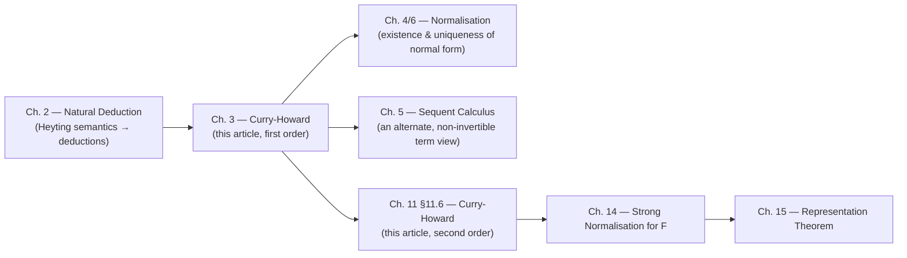

[[book-guidelines|↩ Back to guidelines]]

# The Curry-Howard Isomorphism

## Why a bijection isn't enough

By the end of chapter 2, Girard has already shown you something suggestive: read through Heyting's proof-semantics, a natural-deduction derivation of $A\Rightarrow B$ turns out to *behave* like a function from proofs-of-$A$ to proofs-of-$B$, and the deduction-identifications that come from modus-ponens-after-implication-introduction look exactly like $\beta$-reduction, $(\lambda x.v)u = v[u/x]$. Chapter 3 is where Girard stops treating that as a suggestive analogy and makes it precise: he builds an actual formal system of typed terms, term-for-term and rule-for-rule matched to [[Natural-Deduction|natural deduction]], and then asks the harder question — is this correspondence a mere *bijection* (a relabeling, true but empty), or a genuine *isomorphism* (a structural fact, where independently-defined notions on both sides turn out to coincide)?

This distinction is the spine of the chapter, and it's worth holding onto before the symbols arrive. A bijection between two sets tells you nothing about their structure — you can biject the integers with the even integers, but that doesn't mean addition looks the same on both sides. An isomorphism means the operations correspond too: reduction on terms and conversion on proofs, normal forms on both sides, decidability of equality on both sides — all derived independently in their own traditions, and all landing on the same thing. That's Girard's actual claim, and it's why he spends the whole chapter setting up two systems in parallel (§3.1–3.2 the terms, up through §3.4 the reduction theory) before finally asserting in §3.6 that they coincide.

The chapter also carries the book's other recurring theme from chapter 1: the split between **sense** (syntax, proof, dynamics) and **denotation** (semantics, truth, statics). A type, Girard says, can be read two ways — denotationally, as a set of possible values with defining equations, or operationally, as a set of *plugging instructions* for a program. Both readings are real, and the chapter walks through both before showing they're the two faces of the same coin.

## Types as formulas, terms as proofs (§3.1)

The formal system is the simply typed $\lambda$-calculus restricted to the $(\land,\Rightarrow)$ fragment — the same fragment natural deduction covered in chapter 2. Types are defined by:

1. Atomic types $T_1,\dots,T_n$ are types.
2. If $U$ and $V$ are types, then $U\times V$ (the analogue of $\land$) and $U\to V$ (the analogue of $\Rightarrow$) are types.
3. Nothing else is a type, for now.

And terms, mirroring the five proof-forming operations of natural deduction, are:

1. Variables $x_0^T,\dots,x_n^T,\dots$ are terms of type $T$.
2. If $u:U$ and $v:V$, then $\langle u,v\rangle : U\times V$ (pairing).
3. If $t:U\times V$, then $\pi_1 t : U$ and $\pi_2 t : V$ (projection).
4. If $v:V$ and $x_n^U$ is a variable, then $\lambda x_n^U.\,v : U\to V$ (abstraction).
5. If $t: U\to V$ and $u:U$, then $t\,u : V$ (application).

Notice what's *not* here yet: no primitive integers, no booleans, no recursion. This is deliberate — chapter 3 is isolating the pure logical skeleton (implication and conjunction only) before chapter 7 bolts on ad hoc primitives, and before chapter 11 shows that a much richer set of data types can be gotten "for free" from a single extra quantifier rather than from more primitives. The minimalism here is a controlled experiment, not an oversight.

**What breaks without this fragment-matching.** If you let types and formulas drift apart — say, adding a type constructor with no corresponding logical connective, or a connective with no term constructor — the whole payoff of chapter 3 disappears: you'd have a type system and a logic that happen to share notation, but conversion in one wouldn't correspond to anything in the other. Girard's closing methodological remark in §3.6 (below) is really a warning against exactly this: type-system features invented without respect for the "implicit symmetries of logic" tend not to compose well.

**Grounding.** In Rust, this fragment is almost the whole non-generic type language: $U\times V$ is a tuple `(U, V)` (or a two-field struct), $U\to V$ is `fn(U) -> V` (or, more precisely, a closure type). The five term-forming rules read as a tiny, total expression language:

```rust
enum Term {
    Var(usize, Type),                 // x_i^T
    Pair(Box<Term>, Box<Term>),       // <u, v>
    Fst(Box<Term>),                   // pi_1 t
    Snd(Box<Term>),                   // pi_2 t
    Lam(Type, Box<Term>),             // lambda x^U . v  (de Bruijn: no name needed)
    App(Box<Term>, Box<Term>),        // t u
}

#[derive(Clone, PartialEq)]
enum Type {
    Atom(String),
    Prod(Box<Type>, Box<Type>),       // U x V
    Arrow(Box<Type>, Box<Type>),      // U -> V
}
```

A type-checker for this `Term` type *is* a proof-checker for the $(\land,\Rightarrow)$ fragment of intuitionistic natural deduction — there is no daylight between the two jobs. This is the first concrete instance of a fact that recurs throughout type theory: **"check that `t` has type `A`" and "check that this derivation proves `A`" are the same algorithm**, just read with different vocabulary. In Lean, this identity is not an analogy — it is literally how the kernel works. A `Prop` is a `Type`, a proof of `P : Prop` is a term `h : P`, and `∧`/`→` are *defined* using the same `structure`/`fun` machinery as any other type:

```lean
-- A ∧ B is a structure with two fields — exactly <u, v>
example (hA : A) (hB : B) : A ∧ B := ⟨hA, hB⟩        -- pairing, ∧I
example (h : A ∧ B) : A := h.1                        -- pi_1, ∧1E
example (h : A → B) (hA : A) : B := h hA              -- application, ⇒E
example (f : A → B) : A → B := fun x => f x           -- abstraction, ⇒I
```

Lean's elaborator checking `⟨hA, hB⟩ : A ∧ B` and Rust's type-checker checking `Pair(u, v) : Prod(A, B)` are running the exact same rule.

## Denotational versus operational significance (§3.2–3.3)

Girard now reads the same five term-forming rules twice.

**Denotationally** (§3.2), types classify *values*: an object of type $U\to V$ is a function, an object of type $U\times V$ is a pair. This reading is governed by equations. The **primary equations**,
$$
\pi_1\langle u,v\rangle = u \qquad \pi_2\langle u,v\rangle = v \qquad (\lambda x^U.\,v)\,u = v[u/x],
$$
say when two terms denote the same value. The **secondary equations**,
$$
\langle \pi_1 t,\pi_2 t\rangle = t \qquad \lambda x^U.\,t\,x = t \quad (x\text{ not free in }t),
$$
are the surjective-pairing and $\eta$ laws — true denotationally, but, as Girard notes pointedly, they "have never been given adequate status": they don't correspond to a *reduction* in the same clean way the primary equations do (there's no natural left-to-right direction that shrinks the term). The chapter states, without proof yet, that the resulting equational theory is **consistent** (you cannot prove $x=y$ for distinct variables) and **decidable** — a fact deferred to chapter 4's Church-Rosser and [[Normalisation-Theorems|normalisation theorems]].

**Operationally** (§3.3), a type is instead a *specification of behavior*: "this program takes two integers and returns an integer." Girard is candid that the field is immature — "the true operational interpretation of the schemes is still in an embryonic state" — but he commits to the idea that will drive the rest of the chapter: turn the primary equations into *asymmetric rewrite rules*, and study what happens when you run them to a normal form. That single move — equations become rewrites — is what turns denotational semantics into an operational semantics, and it's why chapter 3 needs both readings side by side: the operational reading is literally the static one, oriented.

**What breaks without the operational reading.** A purely denotational reading of types tells you *what* a term computes but gives you no notion of *how*, no notion of a step, no notion of termination — you couldn't even state chapter 4's normalisation theorem, let alone use it to get a decision procedure for equality. Chapter 4's whole strategy (compute both sides' normal forms and compare) depends on §3.3's move having been made first.

## A type as a plugging instruction for modules

This is Girard's central operational metaphor, and it's worth dwelling on because it's more precise than "a type is a specification." Imagine programming with **modules**: closed units you can plug together but never open. You don't get to inspect a module's internals — you only get to *use* it, i.e., choose how to plug it in. The type of a module is exactly the totality of pluggings it survives without crashing. Crucially, this licenses substitutivity: *any* module of the same type can replace another, for repair or for optimization, with no observer able to tell the difference.

A term $t:T$ depending on free variables $x_1,\dots,x_n$ of types $U_1,\dots,U_n$ is, on this reading, not "the result you get after substituting arguments in" — it *is* a plugging instruction with $n$ sockets. Each occurrence of $x_i$ is a socket where a term $u_i:U_i$ can be plugged in (the same $u_i$ simultaneously at every occurrence — this is exactly what capture-avoiding substitution enforces). But $t$ itself, being of type $T$, is *also* a plug: it can be inserted wherever a variable $y^T$ occurs in some other term. Variables and values are dual aspects of one plugging phenomenon — every term is simultaneously a socket-bearing device and a pluggable value, which is what lets Girard describe execution as a *symmetric* input/output process rather than a one-directional "apply the function" story.

**What breaks without this reading.** If you think of a type only as "the set of values with property $P$," you lose the substitutivity guarantee as an operational fact — you have to re-derive it from semantic reasoning about the set. The plugging-instruction reading makes substitutivity *definitional*: it's what "same type" means.

**Grounding.** This is precisely what a Rust `trait` is for. A `trait` fixes the plugging surface — the methods a module must support — without exposing or caring about the implementor's internals; any two structs implementing the same trait are interchangeable at every call site that only knows the trait, and the compiler guarantees no crash from the substitution. Generic code written against `T: SomeTrait` is, in Girard's vocabulary, a plugging instruction with a socket of type `SomeTrait`:

```rust
trait Module { fn run(&self, input: i32) -> i32; }
// Two closed, interchangeable modules of the *same type* (trait):
struct Increment;
impl Module for Increment { fn run(&self, x: i32) -> i32 { x + 1 } }
struct Double;
impl Module for Double { fn run(&self, x: i32) -> i32 { x * 2 } }

fn plug(m: &dyn Module, socket: i32) -> i32 { m.run(socket) } // t has a socket
```

`plug` doesn't know or care whether it's holding `Increment` or `Double` — only that whatever's plugged in respects the `Module` type. This is also, not incidentally, the same idea a Rust verifier needs for *procedure abstraction* under a Hoare-triple contract: the type (or contract) of a module is exactly the set of pluggings — call sites, argument values — under which the module's postcondition is guaranteed, and any module satisfying the same contract is interchangeable regardless of implementation. Type-checking a plugging and checking that a Hoare triple is respected are, again, the same kind of check wearing different clothes.

## Redexes, contracta, and normal forms (§3.4)

Having committed to the operational reading, Girard now defines its basic vocabulary precisely.

A term is **normal** if none of its subterms has one of the three shapes $\pi_1\langle u,v\rangle$, $\pi_2\langle u,v\rangle$, or $(\lambda x^U.v)\,u$. A term of exactly one of those shapes is a **redex**; converting it — via the corresponding primary equation, now read left-to-right — produces the **contractum**:

$$
t = \pi_1\langle u,v\rangle \rightsquigarrow u \qquad t=\pi_2\langle u,v\rangle \rightsquigarrow v \qquad t = (\lambda x^U.v)\,u \rightsquigarrow v[u/x]
$$

$t$ **reduces** to $u$ (written $t \rightsquigarrow^* u$) when there's a finite chain of one-step conversions from $t$ to $u$; a **normal form** for $t$ is a normal $u$ with $t\rightsquigarrow^* u$. (Girard defers existence and uniqueness of normal forms to chapter 4 — here he's only fixing terminology.)

He then states a lemma that will matter a great deal later: a term is normal *iff* it's in **head normal form**, $\lambda x_1.\lambda x_2.\cdots.\lambda x_n.\, y\,u_1\,u_2\cdots u_m$, with the $u_j$ also normal — i.e., a chain of abstractions wrapped around a variable applied to normal arguments; nothing else is possible once you rule out redexes. The corollary that falls out immediately is one you'll want to remember: **any closed term of a type all of whose free-variable subterms have strictly simpler types must be an abstraction** — in particular, a closed term is *always* an abstraction (a closed application $t\,u$ would need a head variable, but there are no free variables to supply one).

**What breaks without a fixed redex vocabulary.** Chapter 4's proof strategy (bound the "degree" of a redex, induct on the multiset of maximal-degree redexes) only typechecks because "redex" and "contractum" are given here as syntactic, decidable predicates on terms — not semantic ones. Skip this section and normalisation has no formal object to induct over.

**Grounding.** This is exactly a small-step interpreter with an explicit reduction relation instead of a black-box `eval`:

```python
def step(t):
    match t:
        case ("fst", ("pair", u, v)): return u          # pi_1 <u, v> ~> u
        case ("snd", ("pair", u, v)): return v           # pi_2 <u, v> ~> v
        case ("app", ("lam", x, ty, body), u): return subst(body, x, u)  # beta
        case ("fst", t1):  return ("fst", step(t1))  if not_normal(t1) else None
        case ("app", t1, t2): return ("app", step(t1), t2) if not_normal(t1) else \
                                     ("app", t1, step(t2)) if not_normal(t2) else None
        case _: return None   # already normal
```

`step` returning `None` is exactly "no subterm is a redex" — Girard's syntactic definition of normal, made executable. In Lean, this whole apparatus is the kernel's **definitional equality** check (`isDefEq`): two terms are judged equal when they reduce (via $\beta$, and Lean additionally $\iota$/$\delta$/$\eta$) to a common form — `rfl` succeeds exactly when the reduction from both sides meets. The primary/secondary equation split even survives into Lean's design: $\beta$-reduction is built into the kernel's reduction relation, while $\eta$-equality for functions and structures is handled by a separate, explicitly flagged mechanism — a direct descendant of Girard's remark that the secondary equations "have never been given adequate status."

## Description of the isomorphism (§3.5)

With both systems now defined precisely — natural deduction with labeled parcels of hypotheses, and typed terms with a decidable notion of normal form — Girard writes down the actual bijection, rule by rule:

| Natural-deduction rule | Term constructor | Reading |
|---|---|---|
| Hypothesis in parcel $i$, formula $A$ | $x_i^A$ | a hypothesis *is* a variable |
| $\land I$ | $\langle u,v\rangle$ | pairing two sub-deductions |
| $\land_1E$ / $\land_2E$ | $\pi_1 t$ / $\pi_2 t$ | projecting a pair-deduction |
| $\Rightarrow I$, discharging parcel $i$ | $\lambda x_i^A.\,v$ | **discharge = binding** |
| $\Rightarrow E$ (modus ponens) | $t\,u$ | application |

The line worth pausing on is $\Rightarrow I$: "discharging a parcel of hypotheses" in natural deduction and "binding a variable" in the $\lambda$-calculus are declared to be *literally the same act*, not merely analogous ones. Every occurrence of the discharged hypothesis becomes an occurrence of the bound variable; the scope of the discharge is the scope of the binder. This single identification is what makes the whole correspondence rigid rather than merely suggestive.

## Relevance of the isomorphism: bijection versus isomorphism (§3.6)

Now Girard makes the distinction from the opening section precise. §3.5 gives a *bijection* — nothing more is needed to define one than a rule-by-rule relabeling. What earns the word *isomorphism* is that **normality**, **conversion**, and **reduction** were each defined *independently* on both sides — natural deduction has its own, historically prior notion of a normal proof (no introduction immediately followed by the matching elimination on the same formula) — and these independently-arrived-at structures turn out to correspond exactly under the §3.5 bijection.

The picture below reconstructs Girard's own illustration of this: an introduction rule immediately followed by its matching elimination (a "detour") converts to the direct sub-proof, and — completely independently, via the term side — the corresponding redex converts to its contractum by exactly the same substitution.

<svg viewBox="0 0 900 480" xmlns="http://www.w3.org/2000/svg" role="img" aria-label="Proof-side and term-side reduction shown side by side, for the conjunction case and the second-order universal case">
  <style>
    text { font-family: Georgia, 'Times New Roman', serif; fill: #7a7a7a; }
    .lbl { font-family: -apple-system, Helvetica, Arial, sans-serif; font-size: 13px; fill: #999999; }
    .hdr { font-family: -apple-system, Helvetica, Arial, sans-serif; font-size: 14px; font-weight: 600; fill: #8a8a8a; }
    line, path { stroke: #8a8a8a; stroke-width: 1.4; }
    .arrow { stroke: #5b8dd6; stroke-width: 2; fill: none; }
    .arrowhead { fill: #5b8dd6; }
  </style>

  <text x="20" y="26" class="hdr">First order (§3.6): the ∧ I / ∧₁E detour</text>

  <!-- Before: A B / AI / A1E -->
  <text x="60" y="60" font-size="15">A</text>
  <text x="110" y="60" font-size="15">B</text>
  <line x1="55" y1="70" x2="130" y2="70"></line>
  <text x="175" y="74" class="lbl">∧I</text>
  <text x="80" y="92" font-size="15">A∧B</text>
  <line x1="55" y1="102" x2="130" y2="102"></line>
  <text x="175" y="106" class="lbl">∧₁E</text>
  <text x="85" y="124" font-size="15">A</text>
  <text x="40" y="150" class="lbl">(before: a detour)</text>

  <!-- arrow -->
  <path class="arrow" d="M 220 90 L 300 90"></path>
  <path class="arrowhead" d="M 300 90 L 290 84 L 290 96 Z"></path>
  <text x="225" y="76" class="lbl">converts to</text>

  <!-- After: just A -->
  <text x="345" y="60" font-size="15">⋮</text>
  <text x="345" y="92" font-size="15">A</text>
  <text x="330" y="150" class="lbl">(after: the direct proof)</text>

  <!-- term side -->
  <text x="450" y="90" font-size="16">π₁⟨u, v⟩</text>
  <path class="arrow" d="M 545 85 L 610 85"></path>
  <path class="arrowhead" d="M 610 85 L 600 79 L 600 91 Z"></path>
  <text x="550" y="72" class="lbl">reduces to</text>
  <text x="625" y="90" font-size="16">u</text>
  <text x="450" y="150" class="lbl">the redex → its contractum, independently defined</text>

  <line x1="0" y1="180" x2="900" y2="180" stroke="#cccccc" stroke-width="1"></line>

  <text x="20" y="212" class="hdr">Second order (§11.6): the ∀₂I / ∀₂E detour</text>

  <text x="60" y="248" font-size="15">A</text>
  <line x1="45" y1="258" x2="120" y2="258"></line>
  <text x="130" y="262" class="lbl">∀₂I  (X fresh)</text>
  <text x="60" y="280" font-size="15">∀X. A</text>
  <line x1="45" y1="290" x2="150" y2="290"></line>
  <text x="160" y="294" class="lbl">∀₂E  (instantiate at B)</text>
  <text x="60" y="312" font-size="15">A[B/X]</text>
  <text x="40" y="340" class="lbl">(before: a detour)</text>

  <path class="arrow" d="M 320 280 L 400 280"></path>
  <path class="arrowhead" d="M 400 280 L 390 274 L 390 286 Z"></path>
  <text x="325" y="266" class="lbl">converts to</text>

  <text x="445" y="248" font-size="15">⋮</text>
  <text x="445" y="280" font-size="15">A[B/X]</text>
  <text x="430" y="340" class="lbl">(after: the direct proof, X instantiated throughout)</text>

  <text x="580" y="278" font-size="16">(ΛX. t) B</text>
  <path class="arrow" d="M 700 273 L 760 273"></path>
  <path class="arrowhead" d="M 760 273 L 750 267 L 750 279 Z"></path>
  <text x="705" y="260" class="lbl">reduces to</text>
  <text x="775" y="278" font-size="16">t[B/X]</text>
  <text x="440" y="340" class="lbl"></text>
  <text x="440" y="370" class="lbl">Same shape as the ∧-case, one quantifier up.</text>
</svg>

Two morals follow, and Girard states them as genuinely methodological, not just technical:

- **All good (constructive) logic must have an operational side.** If your logic has no computational reading, something is missing from it, not from computer science.
- **Type-system "improvements" that ignore logic's implicit symmetries tend not to work.** A type constructor bolted on without a matching, symmetric introduction/elimination pair is what Girard elsewhere calls a "logical atrocity" — it may typecheck, but it won't compose cleanly with reduction, normal forms, or decidability.

Girard's own final assessment is worth keeping: the two sides are "undoubtedly the same object, accidentally represented in two different ways," with the proof side less tied to contingent syntactic choices and the functional side more immediately useful as a heuristic. That asymmetry — proofs as the more fundamental object, terms as the more legible one — is a stance the rest of the book (especially the semantics chapters) keeps returning to.

## Extending the isomorphism to second-order quantification (§11.6)

Chapter 3's isomorphism was built for exactly the $(\land,\Rightarrow)$ fragment. By chapter 11, Girard has introduced **system F**: types now also include a universal quantifier $\forall X.\,A$, ranging over types themselves, with two new term formers — **universal abstraction** $\Lambda X.\,t$ (a term polymorphic in $X$, subject to the restriction that $X$ not occur free in any hypothesis $t$ depends on) and **universal application** $t\,U$ (instantiating a polymorphic term at a concrete type $U$), governed by the new conversion rule $(\Lambda X.\,v)\,U \rightsquigarrow v[U/X]$.

Section 11.6 is short but structurally important: it says the chapter 3 correspondence simply **extends**, rule for rule, to this new connective:

$$
\dfrac{\vdots}{\dfrac{A}{\forall X.\,A}\ \forall_2 I} \quad\longleftrightarrow\quad \Lambda X.\,t
\qquad\qquad
\dfrac{\vdots}{\dfrac{\forall X.\,A}{A[B/X]}\ \forall_2 E} \quad\longleftrightarrow\quad t\,B
$$

Two things are worth being precise about, because the book is:

1. **The eigenvariable restriction and the freshness restriction are the same restriction.** Natural deduction's side-condition on $\forall_2 I$ — "$X$ must not occur free in any live hypothesis" — is not merely analogous to, but *identical to*, the restriction on forming $\Lambda X.\,t$. This is the same phenomenon as $\Rightarrow I$/binding in chapter 3: a proof-theoretic restriction and a term-formation restriction turn out to be one restriction described twice.
2. **The new conversion rule matches exactly.** Just as $(\lambda x^U.v)u \rightsquigarrow v[u/x]$ was chapter 3's redex/contractum pair for $\Rightarrow$, $(\Lambda X.v)\,U \rightsquigarrow v[U/X]$ is the redex/contractum pair for $\forall$ — the *same* detour-elimination pattern shown in the diagram above, one binder level up: substitute a *type* into a term instead of a *term* into a term.

This extension is not cosmetic — it's the technical engine behind §11.4–11.5's headline result, previewed right before §11.6: with $\forall$ available, you don't need booleans, products, sums, or inductive types as *primitives* at all. A type like $\mathrm{Bintree} = \forall X.\, X\to(X\to X\to X)\to X$ encodes "give me a case for the leaf and a case for the branch, uniformly for any result type $X$, and I'll produce an $X$" — and the $\mathtt{Collect}=\Lambda X.\,\mathtt{collect}[X]$ combinator from §11.5.4 is a single polymorphic *module* that gets specialized (plugged) at whatever $X$ each call site needs. That's chapter 3's plugging-instruction metaphor again, now with the socket itself ranging over *types*, not just values — which is exactly what "uniformity" of a polymorphic term means operationally.

**Grounding.** Rust's generics are a direct, if unenforced, image of this: a generic function `fn collect<X>(...)` is a $\Lambda X.\,t$, and calling `collect::<i32>(...)` is the term application $t\,\mathtt{i32}$; monomorphization is literally performing the $(\Lambda X.v)\,U\rightsquigarrow v[U/X]$ reduction at compile time, once per instantiation. What Rust's generics don't give you is the discipline behind $\forall_2 I$'s freshness restriction — Rust trusts the programmer not to smuggle information about the concrete `X` into generic code (that's what a trait bound like `T: Clone` is for, restoring some of that discipline explicitly). Lean, by contrast, enforces this at the kernel level: a term of type `∀ (X : Type), X → X` — the polymorphic identity — genuinely cannot inspect `X`, because `X` is a bound variable of the surrounding `Pi`-type and the kernel's type theory gives you no operation to case-split on an arbitrary type. `id Nat 5` performing the substitution `(fun X x => x) Nat 5 ⇝ 5` is Girard's $(\Lambda X.v)\,U \rightsquigarrow v[U/X]$, verbatim, inside a real proof assistant's reduction relation — which is also precisely the mechanism a metavariable-unification elaborator leans on when it instantiates an implicit type argument: solving `?X` and substituting it through is universal-elimination, performed by the unifier instead of by the programmer.

## Where this leads



The bijection §3.5 writes down is the load-bearing wall for everything downstream: chapter 4's normalisation theorems only make sense because §3.4 already gave "redex," "contractum," and "normal form" precise syntactic meaning; chapter 6's strong normalisation for the simply typed calculus, and its much harder chapter-14 generalization to system F, are both proving termination of *exactly* the reduction relation defined here. And the extension in §11.6 is what licenses treating system F's free-structure encodings (chapter 11.4–11.5 — Church numerals, lists, trees) as genuine *proofs*, not just clever programs, which is what makes the Representation Theorem in chapter 15 a statement about provability, not merely about computability.

For the standing project of building a Rust verifier and a Lean-style elaborator, this chapter is close to ground zero. The identity it establishes — checking `t : A` *is* checking that a derivation proves `A` — is the shared ancestor of "type checker" and "proof checker" that later needs to be split, deliberately, into inference and checking modes (bidirectional typing): §3.1's rules are already implicitly bidirectional, since $\Rightarrow E$ (application) needs $t$'s type known in advance while $\Rightarrow I$ (abstraction) needs the target type given from outside — the same split that shows up later as "synthesize" versus "check" in a bidirectional type-checker or elaborator. And the substitution operation doing all the real work in both the $\beta$-rule and the plugging-instruction metaphor — capture-avoiding, simultaneous substitution of a term for every occurrence of a variable — is the identical piece of plumbing a Hoare-triple soundness proof needs for its substitution lemma, and that a unification-based elaborator needs every time it resolves a metavariable. Section 11.6's extension adds one more thread: substituting a *type* for a type variable under a binder, with a freshness side-condition, is the first-order ancestor of what implicit-argument resolution via metavariable unification does routinely.
