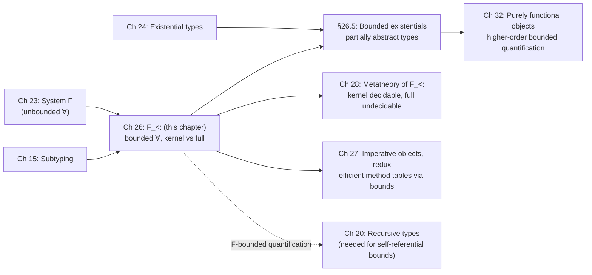

[[book-guidelines|↩ Back to guidelines]]

# Bounded Quantification

## The problem: subsumption and polymorphism don't compose for free

Chapters 15 and 23 gave you two independent extensions of the simply typed lambda-calculus: [[Subtyping|subtyping]] (via [[Subtyping#The subsumption rule|the subsumption rule]] `T-Sub`) and parametric polymorphism (System F's `∀X.T`). The naive move is to just take both — a system that is literally their union, subtyping and quantification living side by side without interacting. That system is perfectly sound. It is also not enough, and Pierce opens the chapter with a small example that shows exactly where it breaks.

Take the identity function specialized to records with a numeric field `a`:

```
f = λx:{a:Nat}. x;
```

Applying `f` to a record with *only* an `a` field is unremarkable. But applying it to a bigger record — `rab = {a=0, b=true}` — requires subsumption: `T-Sub` promotes `rab`'s type from `{a:Nat, b:Bool}` up to `{a:Nat}` so it fits `f`'s parameter type, and the application typechecks. The catch is in the *result*: the return type is `{a:Nat}`, full stop. The `b` field is not gone from the runtime value, but it is gone from what the type system will let you touch — `(f rab).b` is a type error. Subsumption bought you flexibility on the way in and charged you information on the way out.

System F's `∀X. λx:X. x` looks like the fix — instantiate `X` to the record's *actual* type and nothing is lost. And for the pure identity function, it works. But it stops working the moment the function body needs to *do* something with the structure of its argument. Consider

```
f2 = λx:{a:Nat}. {orig=x, asucc=succ(x.a)};
```

which needs to know `x` has a numeric `a` field in order to compute `succ(x.a)`. Replace `{a:Nat}` with a bare type variable `X` and that knowledge is gone — `X` could be anything, so `x.a` no longer typechecks:

```
f2poly = λX. λx:X. {orig=x, asucc=succ(x.a)};
⇒ Error: Expected record type
```

**What breaks without bounded quantification:** you're stuck choosing between two failure modes — plain subtyping erases structure on the way out of a function, and plain parametric polymorphism erases structure on the way *in*. Neither `f` nor `fpoly` alone can express "works uniformly over every record that has at least an `a` field, and preserves however much more structure the caller actually supplied." That is precisely the type polymorphism can't express and subtyping alone can't recover: a variable that ranges over an open-ended family of types, all of which are known to satisfy some structural constraint.

Bounded quantification is the fix. Attach a subtyping bound to the type variable:

```
f2poly = λX<:{a:Nat}. λx:X. {orig=x, asucc=succ(x.a)};
⇒ f2poly : ∀X<:{a:Nat}. X → {orig:X, asucc:Nat}
```

Now `X` is universally quantified — so no information is thrown away when you apply `f2poly` to a specific record type — *and* constrained to be a subtype of `{a:Nat}`, so the body is allowed to assume at least an `a` field exists. This system, combining System F's quantifiers with a subtyping bound on each one, is $F_{<:}$ ("F sub"), developed by Cardelli and Wegner in the mid-1980s and central to the type-theoretic study of object-oriented programming ever since (you'll see it put to real work in Chapters 27 and 32, redoing the object encodings of Chapter 18 with bounded quantification instead of plain subtyping).

## Formal definition: syntax, contexts, and the two S-All rules

$F_{<:}$ is System F (Ch. 23) plus the subtype relation (Ch. 15), with universal quantifiers refined to carry a bound. The grammar adds one production to types and one to terms/values:

$$
T ::= X \mid \mathtt{Top} \mid T \to T \mid \forall X{<:}T.\,T
\qquad
t ::= x \mid \lambda x{:}T.t \mid t\,t \mid \lambda X{<:}T.t \mid t\,[T]
$$

There is no separate unbounded quantifier in the syntax at all — and the book stresses this is not a loss of expressiveness, only of surface notation, because a bound of $\mathtt{Top}$ (the maximal type, everything's supertype) constrains a variable to range over *literally any type*:

$$
\forall X.T \;\stackrel{\text{def}}{=}\; \forall X{<:}\mathtt{Top}.T
$$

Every occurrence of unbounded `∀` you saw in Chapters 23–25 is, from here on, sugar for this.

**Contexts** now bind type variables together with their bound, `Γ, X<:T`, mirroring how term variables are bound with their type. This makes subtyping a *three-place* relation, `Γ ⊢ S <: T` ("S is a subtype of T under the assumptions in Γ"), because comparing two types can require looking up what a free type variable inside them is bounded by. That lookup is exactly the new rule:

$$
\frac{X{<:}T \in \Gamma}{\Gamma \vdash X <: T} \quad (\text{S-TVar})
$$

Every other subtyping rule from Chapter 15 (`S-Refl`, `S-Trans`, `S-Top`, `S-Arrow`, the record rules) gets threaded with the same context `Γ`, unchanged in spirit. The one genuinely new rule is the one for comparing two quantified types, `S-All`, and here the book gives you two versions.

### The kernel rule

$$
\frac{\Gamma \vdash U_1 :: * \qquad \Gamma, X{<:}U_1 \vdash S_2 <: T_2}{\Gamma \vdash \forall X{<:}U_1.S_2 <: \forall X{<:}U_1.T_2} \quad (\text{S-All, kernel})
$$

Notice the bound `U₁` is *shared* — you can only compare two `∀`-types if they carry the exact same bound, and then you compare their bodies (in a context extended with that shared bound). This is called **Kernel Fun**, after Cardelli and Wegner's original terminology, and the resulting system is **kernel $F_{<:}$**.

### The full rule

$$
\frac{\Gamma \vdash T_1 <: S_1 \qquad \Gamma, X{<:}T_1 \vdash S_2 <: T_2}{\Gamma \vdash \forall X{<:}S_1.S_2 <: \forall X{<:}T_1.T_2} \quad (\text{S-All, full})
$$

Here the bounds no longer have to match — instead $S$'s bound $S_1$ must be a *supertype* of $T$'s bound $T_1$ (bounds vary contravariantly), and the bodies are compared in a context that uses the *narrower* bound $T_1$. This is **full $F_{<:}$**.

**Why contravariance in the bound is the natural choice, not an arbitrary generalization:** Pierce motivates this with an analogy to [[The-Simply-Typed-Lambda-Calculus#Function types|function types]]. Think of a quantified type $\forall X{<:}T_1.T_2$ as a function from types to terms whose domain is "all subtypes of $T_1$." The kernel rule is like a function-subtyping rule that refuses to vary the domain at all —

$$
\frac{S_2 <: T_2}{U \to S_2 <: U \to T_2}
$$

— which is a needlessly restrictive, purely covariant special case of the real arrow rule `S-Arrow` (contravariant in the domain, covariant in the codomain, from Chapter 15). If $S = \forall X{<:}S_1.S_2$ has a *smaller* domain than $T = \forall X{<:}T_1.T_2$ (i.e. $T_1 <: S_1$, so fewer types satisfy $T$'s bound... wait, the other way: $S$'s domain is smaller precisely when $T_1 <: S_1$ makes $T$'s constraint the stronger one) — the full rule reads directly off of ordinary arrow-subtyping intuition. The kernel rule is what you get if you refuse to let the "argument type" of the quantifier vary at all, purely for metatheoretic convenience.

That convenience turns out to be substantial. As the chapter previews and Chapter 28 proves in full: subtyping in **kernel $F_{<:}$ is decidable**, while subtyping in **full $F_{<:}$ is undecidable** — a genuinely surprising result (Ghelli's construction uses a type-level negation operator to force an infinite regress in the naive subtyping algorithm). The two systems look almost the same on paper; algorithmically, they are not in the same complexity universe. This is why the book develops kernel $F_{<:}$ as the default and treats full $F_{<:}$ as the "more expressive but technically fraught" variant — every example in §26.3 happens to typecheck in *both* systems, so the distinction only bites once you start asking algorithmic questions in Chapter 28.

**Typing** gets the analogous, unsurprising refinements: the introduction rule for type abstraction carries the bound into the context for checking the body, and the elimination rule (type application) checks that the supplied type argument actually satisfies the bound before substituting it in:

$$
\frac{\Gamma, X{<:}T_1 \vdash t_2 : T_2}{\Gamma \vdash \lambda X{<:}T_1.t_2 : \forall X{<:}T_1.T_2} \;(\text{T-TAbs})
\qquad
\frac{\Gamma \vdash t_1 : \forall X{<:}T_{11}.T_{12} \qquad \Gamma \vdash T_2 <: T_{11}}{\Gamma \vdash t_1\,[T_2] : [X \mapsto T_2]T_{12}} \;(\text{T-TApp})
$$

### Scoping, and a brief look at F-bounded quantification

There's a subtlety buried in what counts as a well-formed context. A context like $X{<:}\mathtt{Top},\, y{:}X{\to}\mathtt{Nat}$ is unproblematic — `y`'s type refers to a type variable bound earlier in the same context, exactly as you'd expect from a term `λX<:Top. λy:X→Nat. t`. But what about a bound that refers to *itself*, like

$$
X <: \{a{:}\mathtt{Nat},\, b{:}X\}\,?
$$

Reading the scope of `X`'s binding as including its own bound (as well as everything to its right, as usual) makes this well-scoped — a term like `λX<:{a:Nat,b:X}. t` has a perfectly sensible reading where the `X` inside the bound refers to the enclosing binder. This variant, where a bound may mention the variable it bounds, is called **F-bounded quantification** (Canning, Cook, Hill, Olthoff, and Mitchell, 1989). It shows up frequently in the object-oriented-types literature and in the design of GJ, precisely because "a method that returns something of the class's own (sub)type" is naturally expressed as an F-bounded self-reference. But the book flags two costs: its metatheory is noticeably harder than ordinary $F_{<:}$'s, and — this is the sharper point — **a self-referential bound like $X{<:}\{a{:}\mathtt{Nat},b{:}X\}$ has no non-recursive solution**. No ordinary (non-recursive) type $X$ can satisfy "$X$ is a subtype of a record whose `b` field has type $X$" unless [[Recursive-Types|recursive types]] (Chapter 20) are also in play. F-bounded quantification only becomes genuinely useful once combined with recursive types — which is also why TAPL sets it aside here (deliberately choosing to treat contexts like the one above as *ill-scoped* for the rest of the book) rather than developing it as a full system. The source material for this facet is intentionally thin; if you want F-bounded quantification with teeth, you're looking at the combination of §26.2's scoping discussion with Chapter 20's recursive types, which TAPL doesn't spell out as a worked combined system.

## Worked examples: what bounded quantification buys you

Section 26.3 is a tour of small, self-contained programs, chosen to demonstrate specific expressive powers of $F_{<:}$ rather than to be practically realistic — all of them, notably, typecheck in *both* kernel and full $F_{<:}$, since none of them needs the extra flexibility of the full `S-All` rule.

**Pairs, generalized with a subtyping law for free.** The Church-style pair encoding from §23.4 lifts directly:

```
Pair T1 T2 = ∀X. (T1→T2→X) → X;
pair = λX. λY. λx:X. λy:Y. (λR. λp:X→Y→R. p x y) as Pair X Y;
fst  = λX. λY. λp:Pair X Y. p [X] (λx:X. λy:Y. x);
snd  = λX. λY. λp:Pair X Y. p [Y] (λx:X. λy:Y. y);
```

The pleasant surprise: the expected covariant subtyping rule for pairs,

$$
\frac{\Gamma \vdash S_1 <: T_1 \qquad \Gamma \vdash S_2 <: T_2}{\Gamma \vdash \mathtt{Pair}\ S_1\ S_2 <: \mathtt{Pair}\ T_1\ T_2}
$$

**falls out of the encoding itself**, for free, once `∀X.(...)→X` is unfolded and compared using `S-All` and `S-Arrow`. You didn't have to postulate this law; it's a theorem about the encoding.

**Records, encoded in pure $F_{<:}$.** Cardelli's construction (1992) is worth sitting with because it's a genuine "wait, you can build records out of *that*?" moment. Define a *flexible tuple* of length $n$ as a right-nested chain of pairs terminated by `Top` instead of a fixed unit:

$$
\{T_i^{\,i \in 1..n}\} \stackrel{\text{def}}{=} \mathtt{Pair}\ T_1\ (\mathtt{Pair}\ T_2\ (\dots(\mathtt{Pair}\ T_n\ \mathtt{Top})\dots))
$$

Terminating with `Top` rather than closing the tuple off is exactly what makes it *flexible*: a flexible tuple of length $n$ is automatically a subtype of one of length $k < n$ (via `S-Top` at the tail, plus the pair subtyping law above), which gives you width subtyping — the record-subtyping rule `S-RcdWidth` from Chapter 15 — as a derived fact rather than a primitive one. Records proper are then flexible tuples indexed by a fixed global ordering of field labels, with unused slots filled with `Top`. The catch, which the book is upfront about, is that this global label-to-index mapping is a real practical liability — it can't be assigned module-by-module under separate compilation, only all at once at link time. This is a beautiful theoretical result (subtyping needs *nothing* beyond pure $F_{<:}$ to encode records) with a clearly-flagged practical dead end.

**Church numerals refined by subtyping.** This is the example with the most teeth. Ordinary Church numerals in System F have type `CNat = ∀X. (X→X) → X → X`. Add two *bounded* quantifiers over the successor's domain and the base element's type:

```
SNat  = ∀X<:Top. ∀S<:X. ∀Z<:X. (X→S) → Z → X;
SZero = ∀X<:Top. ∀S<:X. ∀Z<:X. (X→S) → Z → Z;   -- promises the *zero-shaped* result
SPos  = ∀X<:Top. ∀S<:X. ∀Z<:X. (X→S) → Z → S;   -- promises a *successor-shaped* result
```

`SZero`'s bound is so tight (`... → Z`, forcing the result to inhabit exactly the base-element's subtype `Z`) that there's essentially only one term that can have this type — `szero = λX. λS<:X. λZ<:X. λs:X→S. λz:Z. z` — every other numeral fails to typecheck at `SZero` because its actual computed result doesn't live in `Z`. This is bounded quantification doing something no unbounded polymorphism or subtyping-alone system could: encoding, *in the type itself*, a refinement of "which numerals produce a zero-shaped versus successor-shaped result," and then having the typechecker verify that `ssucc : SNat → SPos` and `spluspp : SPos → SPos → SPos` by ordinary type inference over the encoding, with **no runtime check involved**. It's a first, small taste of the kind of index-refinement that Chapter 24's dependent-types preview and the later chapters on kinding will generalize much further.

## Bounded existential types

Chapter 24 gave you unbounded existentials, `{∃X,T}`, as the type-theoretic account of data abstraction — abstract data types and simple object encodings, where the witness type is completely hidden. §26.5 does to existentials exactly what §26.2 did to universals: attach a bound.

$$
\frac{\Gamma, X{<:}U \vdash S_2 <: T_2}{\Gamma \vdash \{\exists X{<:}U, S_2\} <: \{\exists X{<:}U, T_2\}} \quad (\text{S-Some, kernel variant})
$$

$$
\frac{\Gamma \vdash t_2 : [X\mapsto U]T_2 \qquad \Gamma \vdash U <: T_1}{\Gamma \vdash \{*U,t_2\}\ \mathtt{as}\ \{\exists X{<:}T_1,T_2\} : \{\exists X{<:}T_1,T_2\}} \quad (\text{T-Pack})
$$

The payoff, which Cardelli and Wegner dubbed **partially abstract types**: a bounded existential reveals *part* of the structure of its hidden representation type to client code, while keeping the representation's exact identity hidden. Concretely, take the Counter ADT from §24.2 and bound its representation type by `Nat` instead of hiding it completely:

```
counterADT =
  {*Nat, {new = 1, get = λi:Nat. i, inc = λi:Nat. succ(i)}}
  as {∃Counter<:Nat, {new:Counter, get:Counter→Nat, inc:Counter→Counter}};
```

Because `Counter <: Nat` is now visible to clients, they can do things that a fully opaque existential would forbid — e.g. apply `succ` directly to a `Counter` value obtained from `counter.new`, treating it as a `Nat` — while `counter.inc 3` (using a raw `Nat` where a `Counter` is expected) is still a type error, since the subtyping only goes one direction. You've dialed the abstraction boundary from "fully opaque" to "opaque identity, but publicly known upper bound," which is a strictly richer design point than what unbounded existentials could express. The same trick works on object encodings (§26.5's counter-object example): you can expose the *type* of some instance fields (e.g. a public `x:Nat`) while keeping others (`private:Bool`) invisible to the bound, even though both live inside the same hidden representation record.

## Safety, and why the Narrowing lemma is the interesting part

Preservation and progress for kernel $F_{<:}$ follow the same shape as every previous safety proof in the book — canonical-forms lemma, induction on the typing derivation, the usual case analysis — and Pierce notes the full-$F_{<:}$ argument is "very similar," leaving it as an exercise. What's structurally new, and worth dwelling on because it's exactly the kind of context-management plumbing that recurs everywhere from Hoare-logic soundness to elaborators, is the **Narrowing lemma**:

$$
\text{If } \Gamma, X{<:}Q, \Delta \vdash S <: T \text{ and } \Gamma \vdash P <: Q, \text{ then } \Gamma, X{<:}P, \Delta \vdash S <: T.
$$

(and the same statement for the typing judgment). In words: if a judgment holds under a context that bounds `X` by `Q`, it still holds if you *tighten* — narrow — that bound to any subtype `P` of `Q`. This is not obvious for free; a naive expectation might be that shrinking a variable's range could break derivations that implicitly relied on the wider range. It doesn't, and the reason it doesn't is worth internalizing: subtyping and typing derivations only ever *use* a bound to justify an `S-TVar` step (or its typing analogue), and any such step licensed by `Q` is still licensed by any `P <: Q`, by transitivity. Narrowing is what makes substitution work at the type level — when you instantiate `X` in `T-TApp` with a concrete type argument `T₂` satisfying `T₂ <: T₁₁`, you are, in effect, narrowing `X`'s bound from `T₁₁` all the way down to `T₂`, and the Narrowing + substitution lemmas (26.4.5–26.4.9) are exactly the machinery that certifies this is safe.

## Grounding

**Rust — bounded quantification is not an analogy here, it's what trait bounds *are*.** Generic functions with `where` clauses are $F_{<:}$'s `∀X<:T.T'` under a different notation:

```rust
trait HasA {
    fn a(&self) -> i64;
}

// f2poly = λX<:{a:Nat}. λx:X. {orig=x, asucc=succ(x.a)};
fn f2_poly<X: HasA>(x: X) -> (X, i64) {
    let asucc = x.a() + 1;
    (x, asucc)
}
```

`X: HasA` *is* the bound `X<:{a:Nat}` — a trait bound is a structural upper bound on what a type parameter is allowed to be, exactly the constraint TAPL's `f2poly` needed and `fpoly` (bare `∀X`) couldn't express. Rust's monomorphization sidesteps the "does subtyping lose information" question the book opens with — each instantiation gets its own compiled code with the full concrete type available — but the *type-checking discipline*, "you may only call methods the bound guarantees exist," is identical to what `T-TApp`'s premise `Γ ⊢ T₂ <: T₁₁` is checking. The kernel-vs-full distinction has a real echo too: Rust's trait-bound checking is closer in spirit to kernel $F_{<:}$ — bounds must match structurally at each call site rather than participating in a general contravariant subtyping lattice — which is part of why trait resolution stays decidable (modulo recursion-depth limits) rather than facing the undecidability full $F_{<:}$'s subtyping runs into.

**Lean — the Narrowing lemma is context-management your elaborator will need verbatim.** Lean's local context is, structurally, exactly TAPL's `Γ`: a sequence of bindings where later entries may depend on earlier ones (a term variable's type, or a type variable's bound, may mention prior binders). When Lean's elaborator or tactic framework needs to *specialize* a hypothesis — replace a general bound on a metavariable or a local hypothesis with something more specific it has since learned — it is doing exactly what Narrowing licenses: shrinking a bound is always safe to propagate through everything that depends on it. If you're building the pattern-unification-driven elaborator the standing project describes, Narrowing is the lemma that justifies why *tightening* a metavariable's constraint set as unification proceeds never invalidates typing facts already established relative to the looser constraint — the exact soundness argument your elaborator's constraint solver needs, just stated here in $F_{<:}$'s vocabulary instead of Lean's.

**Python — sketch, not load-bearing.** A duck-typed approximation of the `f2poly` example, useful only for seeing the *shape* of the constraint informally:

```python
from typing import Protocol

class HasA(Protocol):
    a: int

def f2_poly(x: HasA):
    return {"orig": x, "asucc": x.a + 1}
```

`Protocol` gives you a structural, duck-typed bound with no enforcement beyond a type checker like `mypy` — there's no analogue of `T-TApp`'s runtime-free bound check, since Python has no type application to check it at. Useful for intuition about "structural constraint," not for anything resembling the formal system.

## Where this leads



This chapter is the hinge between "subtyping and polymorphism as two separate features" and the object-oriented case studies that dominate the rest of the book's second half. Chapter 27 revisits the imperative-object encoding of Chapter 18 and shows that the very efficiency problem flagged there (rebuilding method tables per-object) is fixed by bounding a representation-type parameter — a direct payoff of what you just read. Chapter 28 is where the kernel/full distinction stops being a curiosity and becomes the chapter's entire subject: decidable subtyping for kernel $F_{<:}$, provably undecidable subtyping for full $F_{<:}$, using exactly the exposure and narrowing machinery introduced here. And Chapter 32's object model needs *higher-order* bounded quantification (bounds on type operators, not just types) — so the mental model you build of "a bound is a structural upper-bound constraint threaded through a context" is one you'll be re-using, generalized, for the rest of the book.

For the standing elaborator/verifier project: this chapter is where "subsumption" (structural coercion between types) and "instantiation" (substituting a metavariable or type parameter) start interacting, which is exactly the interaction a bidirectional elaborator has to get right — when should a metavariable's constraint be treated as a hard equality (kernel-style, only compare identical bounds) versus a genuine subtyping obligation (full-style, solve a real constraint)? $F_{<:}$'s kernel/full split is, in miniature, the same design fork your elaborator's unifier will face when it decides whether unification variables carry rigid types or upper-bound constraints.
