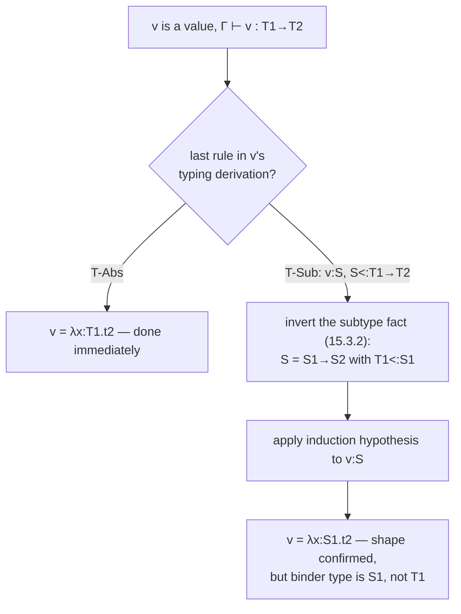
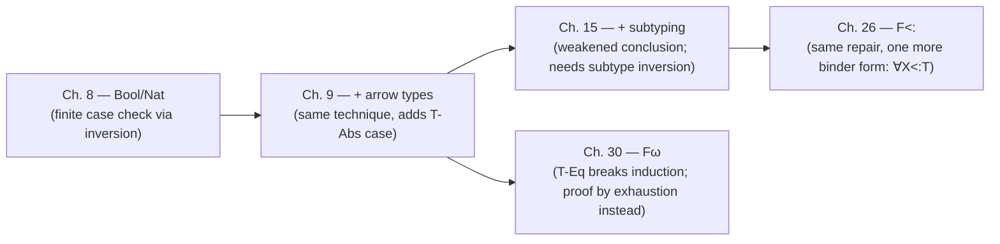

[[book-guidelines|↩ Back to guidelines]]

## The gap that progress can't close on its own

Walk through the [[Type-Safety|progress theorem]] for `t1 t2` by hand. Induction on the typing derivation gives you, for free, that $t_1$ either steps or is a value, and likewise $t_2$. Three of the four combinations are easy: if $t_1$ can step, `E-App1` fires; if $t_1$ is a value and $t_2$ can step, `E-App2` fires. But the fourth combination — both $t_1$ and $t_2$ are values — is where the proof has to *do* something, and here's the snag: all you actually know, from $t_1 : T_{11}\to T_{12}$, is that $t_1$ has an arrow *type*. You don't yet know what $t_1$ *looks like* syntactically. `E-AppAbs` only fires against a literal $\lambda$-abstraction. A type is a static classification; a reduction rule pattern-matches on concrete syntax. Nothing forces those two things to line up — unless you can prove, separately, that they do.

That's the entire job of a **canonical forms lemma**: it says, for a given type $T$, exactly which syntactic shapes a *value* of type $T$ can possibly have. "Canonical form" here just means "the form guaranteed by the type" — not a form you compute or normalize to, but the shape typing forces on you. Pierce introduces the name at exactly this pressure point in Chapter 8 (p. 95): right when the progress proof needs the fact and has no other way to get it.

**What breaks without it.** Drop the lemma and the progress proof for application has an unfillable hole exactly where evaluation needs to act: you'd know $t_1\,t_2$ *should* be able to step (both parts are done reducing, the type says this is a function applied to an argument) but you'd have no syntactic license to invoke any evaluation rule at all. The theorem wouldn't be false — it just wouldn't have a proof, because the one bridge from "the type says X" to "the syntax literally is X" would be missing.

## Two lemmas that read the typing rules in opposite directions

It helps to keep canonical forms distinct from a lemma it's often confused with: **inversion**. Both are read directly off the typing rules, but in opposite directions, and TAPL introduces them as a matched pair for exactly this reason.

**Inversion (8.2.2, 9.3.1)** reads a typing rule *backwards*: given that a term of a certain *syntactic shape* is well-typed, what can you conclude about its type and its subterms? For example:

> If $\text{succ } t_1 : R$, then $R = \text{Nat}$ and $t_1 : \text{Nat}$.

**Canonical forms (8.3.1, 9.3.4)** reads the same information *forwards and restricted to values*: given that a *value* has a certain *type*, what syntactic shapes can it have?

> If $v$ has type $\text{Bool}$, then $v$ is $\texttt{true}$ or $\texttt{false}$.

They're related — canonical forms for base types is basically inversion filtered down to the value cases — but inversion answers "syntax $\to$ type," while canonical forms answers "type $\to$ syntax (restricted to values)." Progress needs the second direction specifically, because it starts from a typing fact and needs a syntactic handle to hand to the evaluation relation. This is also why the book proves the Chapter 8 canonical forms lemma (8.3.1) directly by citing the *inversion* lemma (8.2.2, clauses 4 and 5) to rule out the impossible cases: canonical forms is often just inversion plus a values-only grammar filter, made into its own named lemma because progress needs to invoke it by name, over and over, at every application/projection/case-analysis site.

## The base case: Bool and Nat (Ch. 8)

**Lemma 8.3.1 [Canonical Forms].**
1. If $v$ is a value of type $\text{Bool}$, then $v$ is either $\texttt{true}$ or $\texttt{false}$.
2. If $v$ is a value of type $\text{Nat}$, then $v$ is a numeric value (built from $0$ and $\text{succ}$).

The proof is a finite case check: the grammar says values have exactly four shapes — $\texttt{true}$, $\texttt{false}$, $0$, $\text{succ } nv$. The first two trivially witness part (1). The last two are eliminated because inversion (8.2.2.4–5) says $0$ and $\text{succ } nv$ can *only* ever have type $\text{Nat}$ — so if $v : \text{Bool}$, it can't have been one of those shapes. There's no cleverness here; the lemma is a direct consequence of the grammar being finite and the typing rules for constructors being non-overlapping. That simplicity is worth noticing precisely because it evaporates almost immediately once you add subtyping (see below).

## Function types (Ch. 9): where the lemma starts paying rent

**Lemma 9.3.4 [Canonical Forms].**
1. If $v$ has type $\text{Bool}$, then $v \in \{\texttt{true}, \texttt{false}\}$.
2. If $v$ has type $T_1 \to T_2$, then $v = \lambda x{:}T_1.\,t_2$ for some $x, t_2$.

Part (2) is the one that matters. It's exactly the missing bridge from the opening section: given $t_1 : T_{11}\to T_{12}$ and $t_1$ a value, part (2) hands progress the fact that $t_1$ is *literally* an abstraction $\lambda x{:}T_{11}.\,t_{12}$ — at which point `E-AppAbs` is guaranteed applicable, and the fourth case of the application proof closes. Pierce's own proof note (9.3.4) is "straightforward — similar to 8.3.1," and it genuinely is: the argument is the same finite-case elimination, just against the (now four-clause) syntax of $\lambda_\to$ terms — $x$, $\lambda x{:}T.t$, $t_1\,t_2$, plus booleans — where only the abstraction case can have an arrow type.

**Rust grounding.** In an interpreter, a canonical forms lemma is the theorem that lets you write an `unwrap()` or a wildcard-eliding match without a runtime check, because the type checker has already ruled the other cases out *for you*, at compile time of the object language:

```rust
enum Term {
    Var(usize),
    Abs(Box<Type>, Box<Term>),
    App(Box<Term>, Box<Term>),
    True,
    False,
}

fn is_value(t: &Term) -> bool {
    matches!(t, Term::Abs(_, _) | Term::True | Term::False)
}

// Progress, application case: both t1 and t2 already reduced to values.
fn step_app(t1: &Term, t2: &Term) -> Term {
    match t1 {
        // Canonical Forms (9.3.4.2) is *why* this arm is exhaustive: a
        // value whose type-checker-assigned type was `T1 -> T2` cannot be
        // anything but `Abs`. There is no `_ => unreachable!()` needed
        // because there is, provably, nothing left to be unreachable *from*.
        Term::Abs(_, body) => substitute(body, t2),
        _ => panic!("canonical forms violated — type checker is unsound"),
    }
}
```

The `panic!` arm is dead code *if and only if* the type checker actually implements the typing rules that this lemma is a theorem about. That's the real content of "type safety": the compiler isn't hoping the interpreter's pattern match is exhaustive, it's relying on a proof that it is.

**Lean grounding.** Lean's kernel faces the identical problem every time it reduces a term during typechecking: `whnf` on an application needs its head to actually *be* a lambda before it can beta-reduce, and the kernel's soundness depends on that always being derivable from typing, not merely assumed:

```lean
-- Canonical Forms (9.3.4.2), stated as a theorem about a HasType judgment
theorem canonical_forms_arrow {v : Term} {T1 T2 : Ty} :
    IsValue v → HasType [] v (.arrow T1 T2) →
    ∃ x t2, v = .abs x T1 t2 := by
  intro hval hty
  cases hval <;> cases hty <;> first | rfl | contradiction
```

The `cases hval <;> cases hty` step is doing precisely what Pierce's "finite case check against the grammar" does on paper — Lean forces you to make it total, i.e. to actually rule out every other value constructor against every other typing rule, which is exactly the proof obligation the book is discharging in prose. This is the same shape of fact that lets Lean's own kernel reduction be trusted: `whnf`-reducing a term of a Pi type is licensed by an internal canonical-forms-style guarantee that a value there can only be a lambda (or something that unfolds to one via definitional equality — see below).

## What subtyping breaks, and how the lemma is repaired (Ch. 15, Ch. 26)

Everything above relies on a hidden assumption: that a term's *only* typing derivation is the one that mentions its literal syntactic form. That's [[The-Simply-Typed-Lambda-Calculus|Uniqueness of Types]] (9.3.3), and it holds only because there is no `T-Sub` rule yet. The moment [[Subtyping|subtyping]] adds subsumption,

$$
\frac{\Gamma \vdash t : S \qquad S <: T}{\Gamma \vdash t : T} \quad (\text{T-Sub})
$$

a value can be typed at $T_1 \to T_2$ *without* its "real," bottommost typing derivation ending in `T-Abs` at exactly that type — it might end in `T-Abs` at a *smaller* domain type $S_1 <: T_1$, followed by one or more uses of `T-Sub` widening the type up to $T_1\to T_2$. So the old statement "$v = \lambda x{:}T_1.t_2$" is simply false in the presence of subtyping. Pierce's Chapter 15 restatement quietly weakens it exactly enough to stay true:

**Lemma 15.3.6 [Canonical Forms].**
1. If $v$ is a closed value of type $T_1\to T_2$, then $v$ has the form $\lambda x{:}S_1.\,t_2$ (for *some* $S_1$, not necessarily $T_1$).
2. If $v$ is a closed value of type $\{l_i:T_i^{\,i\in 1..n}\}$, then $v$ has the form $\{k_j{=}v_j^{\,j\in 1..m}\}$ with $\{l_i\} \subseteq \{k_j\}$ — i.e. *at least* the required fields, possibly more (width subtyping).

Both changes are the same move: the lemma no longer promises the value's shape *matches* $T$ exactly, only that it's *compatible* with $T$ — a function that accepts a wider argument set, or a record with extra fields, is still safely usable wherever the narrower/smaller type was expected. The proof (an exercise in the book, 15.3.6) has to actually earn this: it proceeds by induction on the *typing derivation*, and the case where the last rule is `T-Sub` requires the **[[Subtyping#Inversion|inversion lemma for the subtype relation]]** (15.3.2) to peel back "$S <: T_1\to T_2$" into "$S$ is itself an arrow type $S_1' \to S_2'$ with $T_1 <: S_1'$" — the induction hypothesis is then applied to that inner typing fact. Chapter 26's version for $F_{<:}$ (26.4.14) is the identical repair one level up: a closed value of a $\forall X{<:}T_1.T_2$ type has the form $\lambda X{<:}T_1.\,t_2$, proved by exactly the same "peel off `T-Sub` via inversion of subtyping, then recurse" argument.

**What breaks without the repair:** if you tried to keep the *unweakened* Chapter 9 statement once subtyping exists, the lemma would simply be false — there would be well-typed values of arrow type whose actual $\lambda$-binder annotation doesn't match the type on the nose — and any proof invoking it (i.e. progress) would be built on a false premise. This is a good illustration of a general pattern worth internalizing: adding expressiveness to a typing relation (here, subsumption) doesn't just add a rule, it can silently invalidate an existing metatheoretic lemma, and the fix is almost always to *generalize* the lemma's conclusion just enough to survive the new rule, not to reprove it from scratch.



## The far end of the spectrum: definitional equality instead of subsumption (Ch. 30)

$F^\omega$ replaces subtyping's `T-Sub` with a structurally similar culprit, `T-Eq` (definitional equality of types), and the canonical forms proof has to route around it too — but the workaround looks different, and it's the one most directly relevant to an elaborator:

**Lemma 30.3.15 [Canonical Forms].** If $t$ is a closed value with $\vdash t : T_1\to T_2$, then $t$ is an abstraction.

Here there is no "peel back one level and recurse" move available, because definitional equality doesn't have the same inductive substructure subtyping does. Instead the proof (given in full at line ~20912 of the source) argues *by exhaustion over value forms*: $F^\omega$ has only two kinds of values (term abstractions and type abstractions), so if $t$ is a value and *not* a term abstraction, it must be a type abstraction — and then the proof derives a contradiction by showing a typing derivation ending in `T-TAbs` followed by a chain of `T-Eq` steps could never actually reach an arrow type (a type abstraction's type is a $\forall$, and no chain of definitional-equality steps turns a $\forall$ into an honest $\to$). This is a proof by *ruling out the wrong shape*, not by *tracking the right one through the rule* — a genuinely different technique for the same job.

**Why this is the load-bearing one for your elaborator project.** `T-Eq` is exactly what Lean's kernel is doing every time `isDefEq` fires during typechecking — accepting a term at a type that isn't syntactically what its constructor rule produced, but is *definitionally* the same after reduction. Every canonical-forms-style fact your own elaborator or kernel will need ("this value being checked against a Pi type really is (or reduces to) a lambda") has to survive exactly this complication: your term might be well-typed via a chain of unifications/reductions rather than a syntactically direct rule application. The $F^\omega$ proof technique — exhaustion over value shapes plus a "no equality chain bridges these two syntactic classes" argument — is the template for that, and it's a strictly different (and in practice harder) argument than the subtyping repair above, because subtyping at least preserves the arrow/record *skeleton* of a type across `T-Sub`, while definitional equality's reduction steps can, in principle, take far stranger paths before landing back on a recognizable shape.

## Where this leads

Canonical forms lemmas are the recurring, easy-to-underestimate hinge of every progress proof in the book — [[Type-Safety|Type Safety]] states the general "safety = progress + preservation" architecture, but it's this lemma, restated once per chapter, that does the actual work of connecting a typing judgment back to concrete syntax at every single point where evaluation needs to pattern-match on a value. The pattern across the book is remarkably stable once you see it:



Every later safety proof in the book — records and variants in Chapter 11, references in Chapter 13, System F in Chapter 23, existentials in Chapter 24, $F^\omega_{<:}$ in Chapter 31 — restates a canonical forms lemma for its own new value forms before it can even attempt progress; the lemma's *proof technique* is the real thing to track, because it tells you in advance how expensive a new typing feature is going to be to reconcile with progress. Subsumption-style rules (subtyping, later `T-Sub`-shaped additions) cost you a generalized conclusion plus an inversion-of-the-auxiliary-relation lemma. Equality-style rules (`T-Eq`, and — foreshadowing your elaborator work — anything built on unification or definitional equality) cost you an exhaustion argument instead, because there's no clean induction to peel back. **For your two projects specifically:** if your Rust verifier's typing relation ever grows a subsumption rule (e.g. refinement subtyping for Hoare-style contracts), expect to repeat the Chapter 15 move — weaken your canonical forms conclusions and add an inversion lemma for whatever "wider precondition/narrower postcondition" relation you're using. And if your elaborator's kernel checks values against types up to metavariable-resolved definitional equality, the Chapter 30 proof — not the Chapter 15 one — is the actual shape of argument you'll need every time you want to say "this thing being checked against a Pi type really is a lambda," because that is, structurally, the exact same problem `isDefEq` exists to solve.
