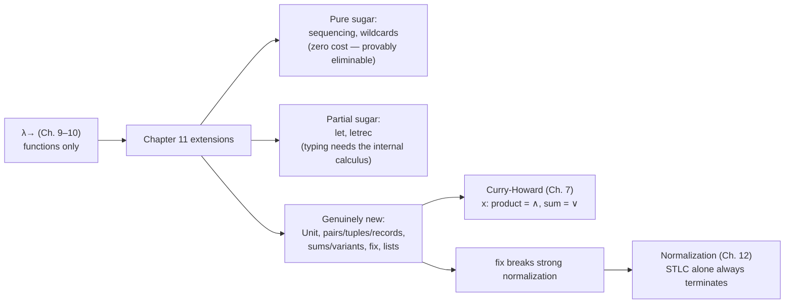

[[book-guidelines|↩ Back to guidelines]]

## Why $\lambda_\to$ isn't a programming language yet

The simply typed lambda-calculus you get at the end of Chapter 9 is theoretically clean and — thanks to the safety proof — completely trustworthy. It is also nearly useless for writing programs. You have functions and a base type or two, and that's it. There's no way to bundle two values together, no way to represent "this value is one of several kinds," no way to give a name to an intermediate result without literally re-abstracting over it, and — most severely — no way to write a function that calls itself. Pierce opens Chapter 11 by naming this gap directly: the calculus "has enough structure to make its theoretical properties interesting, but it is not yet much of a programming language" (p. 117).

Chapter 11 closes that gap feature by feature. What makes the chapter interesting beyond being a checklist is that each feature forces a choice: can this be explained as *sugar* over $\lambda_\to$'s existing machinery (a **derived form**), or does it genuinely need new syntax, new typing rules, and new evaluation rules bolted onto the core calculus? Pierce is explicit that this is the chapter's organizing theme, and the answer is different for almost every construct — sequencing is pure sugar, `let` is *almost* sugar (its typing behavior isn't), and sums/records/`fix` are not sugar at all. Tracking which is which tells you something real about the structure of a type system: some conveniences are free (no proof obligations added to the internal calculus), and some genuinely extend what the type system can express.

We'll walk through the extensions in roughly the book's order, pairing each with Rust/Lean [[Bounded-Quantification#Grounding|grounding]] as it lands, and close by tying `fix` forward into the "[[Normalization|Normalization]]" topic and sums/products back into "Curry-Howard."

## Base types and `Unit`

The starting move (§11.1) is almost too simple to need discussion: just posit a set $\mathcal{A}$ of uninterpreted base types, written $A, B, C, \dots$, added to the grammar of types with no operations attached:

$$T ::= \dots \mid A$$

These aren't meant to model any particular language's `int` or `bool` — they're a way of studying "some base type is present" abstractly, without committing to what its elements or operations are. You can still write `λx:A. x` and get a well-typed identity function on $A$, even though you can never construct an actual element of $A$ in the calculus itself.

`Unit` (§11.2) is the first *interpreted* addition: a genuine new type with exactly one term constant, `unit`, and a rule making it typeable:

$$\dfrac{}{\Gamma \vdash \texttt{unit} : \texttt{Unit}} \quad \text{(T-Unit)}$$

`unit` is also added to the set of values, and it's the *only* value of type `Unit` — this is what makes `Unit` useful later as the "nothing interesting to return" type for expressions run purely for a side effect (references, Chapter 13). It plays the role Rust's `()` or C/Java's `void` play, though Pierce is careful to distinguish it from the *empty* type `Bot` (§15.4) — `Unit` has exactly one inhabitant, `Bot` has none.

```rust
// Rust's unit type is exactly TAPL's Unit: one value, no structure.
fn print_and_discard(x: i32) -> () {
    println!("{x}");
}
```

## Sequencing and wildcards: sugar, proved sugar

Sequencing, `t1;t2` — evaluate `t1` for effect, discard its (trivially `Unit`-typed) result, then evaluate `t2` — is the chapter's cleanest example of a **derived form**. Pierce gives it two treatments and shows they coincide:

1. As a primitive, with its own rules:
$$\dfrac{t_1 \to t_1'}{t_1;t_2 \to t_1';t_2} \text{(E-Seq)} \qquad \texttt{unit};t_2 \to t_2 \ \text{(E-SeqNext)} \qquad \dfrac{\Gamma \vdash t_1 : \texttt{Unit} \quad \Gamma \vdash t_2 : T_2}{\Gamma \vdash t_1;t_2 : T_2} \text{(T-Seq)}$$
2. As an abbreviation: $t_1;t_2 \stackrel{\text{def}}{=} (\lambda x{:}\texttt{Unit}.t_2)\ t_1$, for $x$ fresh.

Theorem 11.3.1 (Sequencing is a derived form) makes the equivalence precise: writing $\lambda_E$ for the calculus with sequencing as primitive and $\lambda_I$ for the calculus without it, and $e$ for the elaboration function that desugars, both evaluation and typing "commute" with $e$:

$$t \to_E t' \iff e(t) \to_I e(t') \qquad \qquad \Gamma \vdash_E t : T \iff \Gamma \vdash_I e(t) : T$$

This is the general shape of a derived-form justification, and it matters for engineering reasons, not just aesthetics: a construct proved to be a derived form can be handled entirely in the parser/elaborator, without touching the internal calculus or re-running any part of the type-safety proof. Pierce traces this "factoring" idea back to the Algol 60 report and notes it's central to how languages like Standard ML are specified. The **wildcard** binder `λ_:S.t` (abbreviating `λx:S.t` for `x` fresh) is the same idea in miniature — a notational convenience with zero effect on the underlying calculus.

## Ascription: mostly documentation, occasionally load-bearing

`t as T` (§11.4) asserts that `t` has type `T` and lets that assertion be checked:

$$\dfrac{\Gamma \vdash t_1 : T}{\Gamma \vdash t_1 \texttt{ as } T : T} \text{(T-Ascribe)} \qquad v_1 \texttt{ as } T \to v_1 \ \text{(E-Ascribe)} \qquad \dfrac{t_1 \to t_1'}{t_1 \texttt{ as } T \to t_1' \texttt{ as } T} \text{(E-Ascribe1)}$$

Evaluation just discards the annotation once `t` is a value. Pierce treats this as a genuinely minor feature in the book (an exercise, not a worked theorem) — its main uses are documentation, controlling how the book's own OCaml-implementation typecheckers print abbreviated types, and (foreshadowing §15.5) a mechanism for deliberately *hiding* some of a term's types once [[Subtyping|subtyping]] is in the picture. It's worth flagging because ascription's syntax reappears, structurally unchanged, as the mandatory type annotation on sum injections a few sections later — worth remembering when you get there.

## `let`: sugar for evaluation, primitive for typing

`let x = t1 in t2` (§11.5) evaluates `t1` to a value, binds `x` to it, and evaluates `t2`:

$$\dfrac{t_1 \to t_1'}{\texttt{let } x{=}t_1 \texttt{ in } t_2 \to \texttt{let } x{=}t_1' \texttt{ in } t_2} \text{(E-Let)} \qquad \texttt{let } x{=}v_1 \texttt{ in } t_2 \to [x \mapsto v_1]t_2 \ \text{(E-LetV)}$$

$$\dfrac{\Gamma \vdash t_1 : T_1 \quad \Gamma, x{:}T_1 \vdash t_2 : T_2}{\Gamma \vdash \texttt{let } x{=}t_1 \texttt{ in } t_2 : T_2} \text{(T-Let)}$$

This is where the chapter makes its subtlest point about derived forms. It's tempting to desugar `let x=t1 in t2` as $(\lambda x{:}T_1.t_2)\ t_1$, exactly like sequencing. The evaluation behavior does match. But look at what's needed to write the abbreviation down: the annotation $T_1$ on the desugared lambda has to come from *somewhere*, and it isn't present in the surface `let` syntax — it can only be recovered by *running the typechecker on* `t1` first. So `let`, unlike sequencing, "is a slightly different sort of derived form... not a desugaring transformation on terms, but a transformation on typing *derivations*" (p. 125): you can eliminate `let` after typechecking, but the typing rule T-Let genuinely has to be part of the internal calculus's rule set, because you need type information mid-desugaring. Pierce flags this as the reason `let` gets treated specially again in Chapter 22 (Hindley-Milner let-polymorphism), where it's not just partially-derived but does something ordinary application provably cannot: generalize a binding's type over free type variables. This is a good early instance of a pattern worth naming for its own sake: some "sugar" only desugars *after* elaboration has run, which is exactly the shape of the substitution/annotation-insertion work an elaborator does.

```rust
// Rust's `let` is call-by-value like TAPL's — the bound expression
// is fully evaluated before the body runs.
let x = compute_expensive_thing();
use_x_twice(x, x);
```

## Products, tuples, and records: building compound data

These three (§11.6–11.8) are one idea at increasing generality, and Pierce presents them that way deliberately: pairs are 2-ary tuples, tuples are unlabeled records, and (as the book notes explicitly) you can even recover tuples as records whose labels happen to be the natural numbers $1, \dots, n$.

**Pairs.** New syntax $\{t_1, t_2\}$ and projections `t.1`, `t.2`; new type $T_1 \times T_2$:

$$\dfrac{\Gamma \vdash t_1 : T_1 \quad \Gamma \vdash t_2 : T_2}{\Gamma \vdash \{t_1,t_2\} : T_1 \times T_2} \text{(T-Pair)} \qquad \dfrac{\Gamma \vdash t_1 : T_{11}\times T_{12}}{\Gamma \vdash t_1.1 : T_{11}} \text{(T-Proj1)} \qquad \dfrac{\Gamma \vdash t_1 : T_{11}\times T_{12}}{\Gamma \vdash t_1.2 : T_{12}} \text{(T-Proj2)}$$

Evaluation rules `E-Pair1`/`E-Pair2` enforce left-to-right evaluation of the components before projecting, and `{v1,v2}` is itself a value only once *both* components are values — so a pair passed to a function is guaranteed fully evaluated before the function body runs.

**Tuples** generalize this to $\{t_i^{\,i\in 1..n}\}$ of type $\{T_i^{\,i\in 1..n}\}$, with a single indexed projection rule replacing the pair of `.1`/`.2` rules — genuinely just an arity generalization, no new ideas.

**Records** generalize tuples again by attaching a label $l_i$ from a label set $\mathcal{L}$ to each field: $\{l_i{=}t_i^{\,i\in 1..n}\}$ of type $\{l_i{:}T_i^{\,i\in 1..n}\}$, projected by label rather than position. Pierce's presentation treats field *order* as significant — $\{partno{=}5524, cost{=}30.27\}$ and $\{cost{=}30.27, partno{=}5524\}$ are formally different terms of different (if isomorphic-looking) types — a choice revisited once subtyping makes unordered records natural (§15.6).

This is exactly where Rust grounding is strongest: a labeled record with all-distinct fields *is* a Rust `struct`, field for field, and the typing rule T-Rcd is literally "every field's initializer must have the field's declared type" — the same check `rustc` performs on a struct literal.

```rust
struct PhysicalAddr { first_last: String, addr: String }
// {li=ti} : {li:Ti}  reads exactly as: build each field, check each
// against its declared type, done — same shape as T-Rcd.
let pa = PhysicalAddr { first_last: "Ada Lovelace".into(), addr: "London".into() };
let name = pa.first_last;  // field projection, same idea as t.l
```

In Lean, a record with fields corresponds directly to a structure whose constructor's argument types are exactly the field types — the same $\Gamma \vdash \{l_i{=}t_i\} : \{l_i{:}T_i\}$ judgment underlies `structure` elaboration there too.

## Sums and variants: the disjunction of the type system

**Motivation first.** Products let you say "I have an $A$ *and* a $B$." Nothing so far lets you say "I have an $A$ *or* a $B$, and I can tell which." Pierce's running example (§11.9) is an address book with two record shapes, `PhysicalAddr` and `VirtualAddr`, that you want to store and process uniformly. This is exactly the situation that motivates the sum type $T_1+T_2$: elements are either a $T_1$ tagged `inl`, or a $T_2$ tagged `inr`.

$$\dfrac{\Gamma \vdash t_1 : T_1}{\Gamma \vdash \texttt{inl } t_1 : T_1+T_2} \text{(T-Inl)} \qquad \dfrac{\Gamma \vdash t_1 : T_2}{\Gamma \vdash \texttt{inr } t_1 : T_1+T_2} \text{(T-Inr)}$$

$$\dfrac{\Gamma \vdash t_0 : T_1+T_2 \quad \Gamma,x_1{:}T_1 \vdash t_1 : T \quad \Gamma,x_2{:}T_2 \vdash t_2 : T}{\Gamma \vdash \texttt{case } t_0 \texttt{ of inl } x_1{\Rightarrow}t_1 \mid \texttt{inr } x_2{\Rightarrow}t_2 : T} \text{(T-Case)}$$

with the expected beta rules — `case (inl v0) of inl x1⇒t1 | inr x2⇒t2 → [x1↦v0]t1`, and symmetrically for `inr`.

**A genuine wrinkle: sums break Uniqueness of Types.** T-Inl lets you derive `inl 5 : Nat+Nat` *and* `inl 5 : Nat+Bool` — infinitely many types, since $T_2$ is unconstrained. This isn't a minor footnote; it kills the "read the rules bottom-up" typechecking strategy that worked for every earlier construct, because Uniqueness of Types (Theorem 9.3.3) is what made that strategy correct in the first place. Pierce lays out three fixes, each of which reappears as a full topic later in the book: infer the missing type later (→ Chapter 22, [[Type-Reconstruction|type reconstruction]]), enrich the type language so all the possible supertypes collapse (→ Chapter 15, subtyping), or just require an annotation. The book takes the third option for now — `inl t as T` / `inr t as T`, where `T` is the full sum type — which is worth noticing structurally: it's literally ascription syntax, reused as a *mandatory* annotation because inl/inr alone underdetermine the type.

**Variants** (§11.10) generalize binary sums exactly as records generalize pairs — labeled alternatives instead of just two:

$$\dfrac{\Gamma \vdash t_j : T_j}{\Gamma \vdash \langle l_j{=}t_j\rangle \texttt{ as } \langle l_i{:}T_i^{\,i\in1..n}\rangle : \langle l_i{:}T_i^{\,i\in1..n}\rangle} \text{(T-Variant)}$$

The book works through three idioms that make variants worth the ceremony:

- **Options**, `<none:Unit, some:Nat>` — isomorphic to `Nat` plus a distinguished "absent" value, and explicitly flagged as the honest type of `null` in C/C++/Java (really `Ref(Option(T))` in disguise, per the book).
- **Enumerations** — a variant where every field type is `Unit`; the tags carry no payload, only identity.
- **Single-field variants**, `<l:T>` — a *newtype*: isomorphic to `T` as a set of values, but the type system will not let a `DollarAmount` and a `EuroAmount` (both underlyingly `Float`) be mixed up, exactly the kind of unit-confusion bug newtypes are designed to prevent in real code.

Rust's `enum` is the direct, load-bearing analogue of all three at once — payload-carrying variants, unit variants, and (via a single-variant enum, or more idiomatically a tuple struct) the newtype pattern:

```rust
enum Addr { Physical(PhysicalAddr), Virtual(VirtualAddr) }

fn get_name(a: &Addr) -> &str {
    match a {                       // case t0 of <li=xi> => ti
        Addr::Physical(x) => &x.first_last,
        Addr::Virtual(y)  => &y.name,
    }
}

struct DollarAmount(f64);  // single-field variant / newtype
struct EuroAmount(f64);
fn dollars_to_euros(d: DollarAmount) -> EuroAmount { EuroAmount(d.0 * 1.1325) }
// dollars_to_euros(dollars_to_euros(x)) — a type error, same as TAPL's example
```

Note explicitly what OCaml (and Rust) buy you over Pierce's bare presentation: because a datatype's labels are scoped to that one declaration, the compiler can infer the annotation `T` that TAPL's core calculus makes you write by hand — the annotation is "hidden in the label itself" (p. 140), rather than needing subtyping or reconstruction to recover it. Pierce is explicit that sums/variants are also called **disjoint unions**, because every element is unambiguously tagged as coming from exactly one summand — as opposed to the untagged union types of §15.7.

**The Curry-Howard reading.** This is the direct dual of [[The-Simply-Typed-Lambda-Calculus]]'s function-type-as-implication story from [[The-Curry-Howard-Correspondence|Chapter 7's correspondence]]: $T_1 \times T_2$ is conjunction ($T_1 \wedge T_2$) — to prove it you must supply proofs of both conjuncts, which is exactly what T-Pair demands — and $T_1+T_2$ is disjunction ($T_1 \vee T_2$) — to prove it you supply a proof of one disjunct, tagged with *which* one, which is exactly what T-Inl/T-Inr demand, and to *use* a disjunctive proof you must handle both cases, which is exactly what `case`/T-Case demands (this is proof by cases, formalized). The Uniqueness-of-Types failure has a logical reading too: "I have a proof of $A$" doesn't by itself tell you which $B$ makes $A \vee B$ provable — you have to say.

## General recursion via `fix`: the escape hatch, and its price

**Motivation.** Everything so far is *typeable* but still can't express looping. Chapter 5 showed that the *untyped* lambda-calculus can define a fixed-point combinator (`fix`/`Y`) purely from application and abstraction. Chapter 11's key observation (§11.11) is that this trick **cannot be repeated in $\lambda_\to$**: no self-application term typechecks under simple types, and — as the next topic, "Normalization," proves — *nothing* that can fail to terminate can be well-typed in $\lambda_\to$. So instead of deriving `fix`, TAPL adds it as a bona fide new primitive with its own rules:

$$\dfrac{\Gamma \vdash t_1 : T_1{\to}T_1}{\Gamma \vdash \texttt{fix } t_1 : T_1} \text{(T-Fix)} \qquad \texttt{fix }(\lambda x{:}T_1.t_2) \to [x \mapsto (\texttt{fix }(\lambda x{:}T_1.t_2))]t_2 \ \text{(E-FixBeta)}$$

The intuition Pierce gives: if `ff` is a function that, given an approximation of `iseven` correct up to $n$, returns an approximation correct up to $n+2$, then `fix ff` is the true, everywhere-correct `iseven` — the limit of iterating `ff`. The book's canonical worked example:

```
ff = λie:Nat→Bool. λx:Nat.
       if iszero x then true
       else if iszero (pred x) then false
       else ie (pred (pred x));
iseven = fix ff;
```

**`fix` is not restricted to [[The-Simply-Typed-Lambda-Calculus#Function types|function types]]**, and the book uses this to build mutually recursive definitions as the fixed point of a function on a *record* of functions (an `{iseven, isodd}` pair defined jointly) — worth remembering, since it's the general pattern behind compiling any group of mutually recursive definitions.

**This power is exactly what breaks strong normalization**, and the book states the consequence in the starkest possible terms: for *every* type $T$, you can now write a term of type $T$ that never produces a value —

$$\texttt{diverge}_T = \lambda\_{:}\texttt{Unit}.\ \texttt{fix}\ (\lambda x{:}T.\ x) \;:\; \texttt{Unit} \to T$$

`diverge_T unit` reduces to itself forever via E-FixBeta. So *every type is inhabited by a non-terminating term* the moment `fix` is admitted — a direct, sharp contrast with the pure $\lambda_\to$ of Chapters 9–10, where the upcoming Normalization proof shows *every* well-typed term reduces to a value in finitely many steps. This is precisely the tradeoff the "Normalization" topic exists to make rigorous: simple types alone buy you a termination guarantee for free; `fix` (this section's PCF extension, literally named for this reason — Programming language for Computable Functions) buys you Turing-completeness at the cost of that guarantee, and there is no way to have both in this system. (Later chapters — References, [[Recursive-Types|Recursive Types]] — show other ways nontermination sneaks back in through *different* doors, but `fix` is the direct one.)

The `letrec` sugar just packages the fixed-point-of-a-lambda idiom in more familiar surface syntax, and — like sequencing — *is* a genuine derived form, this time over `let` and `fix` together:

$$\texttt{letrec } x{:}T_1{=}t_1 \texttt{ in } t_2 \ \stackrel{\text{def}}{=}\ \texttt{let } x = \texttt{fix }(\lambda x{:}T_1.t_1) \texttt{ in } t_2$$

```rust
// Rust has no direct `fix` — recursive fn bindings are primitive —
// but the fixed-point-combinator idea is exactly what a recursive
// closure built via Y-combinator-style boxing would have to encode.
fn is_even(n: u32) -> bool {
    if n == 0 { true } else { !is_even(n - 1) }   // recursion is builtin,
}                                                    // not derived from fix
```

In Lean, by contrast, unrestricted `fix` is exactly what the kernel refuses to admit for the same reason TAPL flags: Lean's `def`s must be *structurally* or well-founded recursive, precisely because an unguarded fixed-point operator like this one would let you build a term of any type — including `False` — destroying logical soundness, not just termination. That is the proofs-as-programs stakes of this section: a total-functions type theory (Lean's) cannot admit TAPL's `fix` as-is; a partial-functions calculus (PCF, this section) can, and pays for it in the normalization/logic-soundness currency, not the safety currency (progress and preservation both still hold for PCF — you just lose the guarantee that evaluation *finishes*).

## Lists: the built-in generalization

Closing the chapter (§11.12), `List T` is introduced as a primitive type constructor with `nil[T]`, `cons[T] t1 t2`, `isnil[T] t`, `head[T] t`, `tail[T] t` and the expected rules (e.g. `head[S] (cons[T] v1 v2) → v1`). Pierce notes this is essentially what ML/Haskell-style [[Recursive-Types#Lists|lists]] look like, modulo explicit type annotations everywhere (retained here only for uniformity with the encoding of lists given later at the polymorphic level, §23.4) — and flags, as a design aside, that a case-based ("datatype") presentation using `cons`/`nil` as a two-armed variant would let more errors be caught statically than the head/tail/isnil style used here. It's the last piece of the "sum + record + recursion" combinatorics that most real data structures are assembled from — and, notably, TAPL treats `List T`'s genuine recursive shape (the tail of a `List T` is itself a `List T`) as *primitive* rather than something you could build from this chapter's other tools, because doing that honestly requires recursive *types*, the subject of Chapter 20.

## Synthesis: what this chapter feeds, and what it costs



Two threads to keep pulling on:

- **Back**, to Curry-Howard: products and sums are not analogies for conjunction and disjunction, they *are* them under the correspondence — every typing rule in this chapter for `{,}`/`.i` and `inl`/`inr`/`case` is simultaneously a natural-deduction introduction or elimination rule for $\wedge$ or $\vee$.
- **Forward**, to Normalization: `fix` is the chapter's one construct that cannot be added "for free." Everything else in Chapter 11 is safety-neutral by construction — new rules, but no new way to get stuck, and no way to lose progress/preservation. `fix` is different in kind: it's the single feature responsible for the fact that the *next* chapter's strong-normalization theorem is stated for $\lambda_\to$ specifically, not for "the language of this chapter."

For the standing verifier/elaborator project: variants with `case`/pattern-matching are the most directly reusable building block here — they're the mechanism a verifier's own term language will use to represent its AST (exactly as TAPL's own footnote observes: real variant-type use, like an AST node, is usually also recursive, which is why Chapter 20's recursive types exist). Records map cleanly onto typed contexts or structured judgment data. `fix`/`letrec`, by contrast, is the one construct to keep at arm's length in a *checker* — admitting it unrestricted is precisely what a soundness-preserving system (Lean's kernel, or a Hoare-logic verifier) cannot do, which is exactly why well-founded recursion, not raw `fix`, is the tool such systems actually use.
