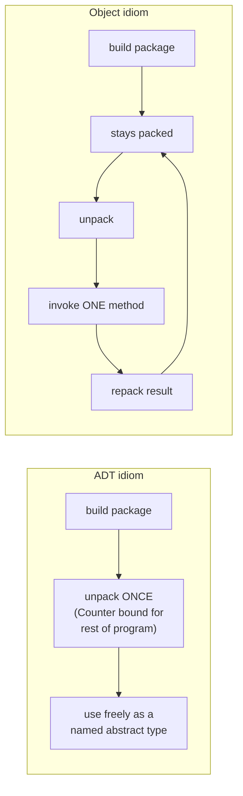

[[book-guidelines|↩ Back to guidelines]]

## What breaks without it

[[The-Curry-Howard-Correspondence|Chapter 23]] gave you universal types, $\forall X.T$ — "for any type $X$ you name, I hand you a $T$." That's the right tool when *the caller* picks the type (a polymorphic `map`, a generic `id`). But a huge and different class of programming problems needs the opposite direction of control: **the implementer** picks a concrete type once, hides it, and the caller must work with it *without ever learning what it is*.

Concretely: suppose you want a `Counter` module. It has an internal representation — say a `Nat` — plus operations `new`, `get`, `inc`. Without any abstraction mechanism, you'd write something like a record:

```
counterADT : {new: Nat, get: Nat→Nat, inc: Nat→Nat}
```

This typechecks, but it leaks everything. Client code now knows a counter's state is literally a `Nat`. Nothing stops it from writing `counter.new + 1` directly, bypassing `inc`, or comparing two counters' internal representations with `=` in ways that only happen to work because today's implementation is a bare number. The moment you improve the representation — say, to a record `{x: Nat}` for future extensibility, or to a more efficient structure — every piece of client code that quietly depended on "counter state is a `Nat`" breaks, even though none of it was *supposed* to know that.

This is exactly the problem type systems are supposed to solve according to Pierce's own framing back in §1.2: types don't just catch `2 + true`, they protect *parts of a program from each other*. Universal quantification can't do this job — $\forall X.T$ describes something usable at every type, which is the opposite of "usable at exactly one hidden type." What's missing is a way to say: **there exists some type $X$ — I'm not telling you which — such that this value has type $T$.** That's an existential type, written $\{\exists X, T\}$.

## Two readings of the same thing

Just as $\forall X.T$ supports both a logical reading ("a value of type $[X\mapsto S]T$ for *all* choices of $S$") and an operational one (a function from a type to a specialized term), $\{\exists X,T\}$ has two readings:

- **Logical:** an element of $\{\exists X,T\}$ is a value of type $[X\mapsto S]T$, for *some* type $S$ — you just don't get told which.
- **Operational:** an element of $\{\exists X,T\}$ is literally a *pair* — a witness type $S$ together with a term $t$ of type $[X\mapsto S]T$ — written $\{{*}S,t\}$.

Pierce leans on the operational view throughout the chapter because it's the one that maps directly onto modules: an existential package is a type component plus a term component, exactly like a compiled module is "some internal representation, plus the code that uses it." The curly-brace notation $\{\exists X,T\}$ (instead of the more standard $\exists X.T$) is a deliberate nudge toward reading it as a tuple.

## Packing: building an existential value

An existential value is introduced by **packing** a witness type together with a term:

$$
\{{*}S,\,t\} \text{ as } \{\exists X,T\}
$$

The `as` annotation isn't optional flavor — it's load-bearing. The same underlying pair can inhabit *multiple* existential types (just as a record with extra fields inhabits multiple subtypes), so the typechecker cannot infer which existential type you intended; you have to say. For example, the package
$$
p = \{{*}\mathrm{Nat},\ \{a{=}5,\ f{=}\lambda x{:}\mathrm{Nat}.\,\mathrm{succ}(x)\}\}
$$
can be ascribed either $\{\exists X, \{a{:}X, f{:}X{\to}X\}\}$ or $\{\exists X, \{a{:}X, f{:}X{\to}\mathrm{Nat}\}\}$ — both are true of it, and the annotation picks which promise the rest of the program gets to rely on.

The typing rule:

$$
\frac{\Gamma \vdash t_2 : [X \mapsto U]T_2}{\Gamma \vdash \{{*}U,t_2\}\text{ as }\{\exists X,T_2\} : \{\exists X,T_2\}} \quad(\text{T-Pack})
$$

Read it as: to build something of type $\{\exists X,T_2\}$, produce a term whose type is $T_2$ with $U$ substituted in for $X$ — then package $U$ alongside it. Different packages with completely unrelated witness types can inhabit the *same* existential type — `{*Nat, 0} as {∃X,X}` and `{*Bool, true} as {∃X,X}` both check against $\{\exists X, X\}$ — which is precisely the "I'm not telling you which type" guarantee doing its job.

## Unpacking: using an existential value

If packing is like sealing a module, **unpacking** is the `open`/`import` that lets you use it — while the typechecker keeps its internals abstract:

$$
\text{let } \{X,x\}=t_1 \text{ in } t_2
$$

$$
\frac{\Gamma \vdash t_1 : \{\exists X,T_{12}\} \qquad \Gamma, X, x{:}T_{12} \vdash t_2 : T_2}{\Gamma \vdash \text{let }\{X,x\}{=}t_1\text{ in }t_2 : T_2} \quad(\text{T-Unpack})
$$

This binds *two* things at once from the package: a fresh type variable $X$ standing in for "whatever the hidden witness type actually is," and a term variable $x$ of type $T_{12}$ (with $X$ now abstract). Inside $t_2$, you can use $x$'s operations, but you can't do anything that would require knowing $X$ concretely — e.g. given a counter package opened as `{X,body}`, you can call `body.methods.get(body.state)`, but `succ(body.state)` is rejected: the typechecker only knows `body.state : X`, and `X` could be anything.

**The scoping restriction, and why it's non-negotiable:** in T-Unpack's premise, $X$ is added to the context used to check $t_2$, but $X$ does *not* appear in the rule's conclusion. That forces $T_2$ — the result type — to not mention $X$ free. If it did, that free $X$ would be referring to a type variable that goes out of scope the instant the `let` ends, which is meaningless outside it. This is exactly the *representation independence* property that makes the whole mechanism worth having: nothing about the type of the result can depend on which witness type was actually inside the package.

Evaluation is a straightforward substitution once the packed value is in hand:

$$
\text{let }\{X,x\}{=}(\{{*}T_{11},v_{12}\}\text{ as }T_1)\text{ in }t_2 \;\longrightarrow\; [X\mapsto T_{11}][x\mapsto v_{12}]\,t_2 \quad(\text{E-UnpackPack})
$$

Pierce's framing: this is a **linking step** — symbolic names ($X$, $x$) referring to a separately-built module get replaced by that module's actual contents. And note the curious consequence: since $X$ gets substituted away at runtime, *the resulting term has concrete access to what was abstract a moment ago.* An expression can become "more typed" as computation proceeds — exactly the kind of thing that only makes sense once you've internalized that typing and evaluation are different relations checked at different times.

### Grounding: this is `Box<dyn Trait>` and `impl Trait`

If you've written Rust, you've built and consumed existential packages without necessarily naming them that way.

**`Box<dyn Trait>` is a pack.** A trait object erases the concrete type and exposes only the interface — exactly $\{\exists X, T\}$ where $T$ is the trait's method signatures with `Self` replaced by $X$:

```rust
trait Counter {
    fn get(&self) -> u32;
    fn inc(&self) -> Box<dyn Counter>;
}

struct NatCounter(u32);
impl Counter for NatCounter {
    fn get(&self) -> u32 { self.0 }
    fn inc(&self) -> Box<dyn Counter> { Box::new(NatCounter(self.0 + 1)) }
}

fn make_counter() -> Box<dyn Counter> {
    Box::new(NatCounter(1))   // packing: witness type = NatCounter, hidden behind the trait object
}
```
`make_counter`'s caller receives a `Box<dyn Counter>` and can call `.get()`/`.inc()`, but there is no way to recover `NatCounter` from it — the concrete type has been erased at the ABI level (a vtable pointer stands in for "some `X`, plus its operations"), matching T-Pack's promise exactly.

**`impl Trait` in return position is even more literal.** `-> impl Counter` says "I return *some* concrete type implementing `Counter`, and I'm not telling you which" — that's $\{\exists X, \text{Counter}[X]\}$ read off almost symbol-for-symbol, except the compiler tracks the hidden witness internally (monomorphized, no vtable) instead of you writing `as` by hand.

Rust's `unpack`, meanwhile, is implicit and automatic: every call site that receives a `Box<dyn Counter>` or an `impl Counter` is standing at a `let {X,x} = ... in ...` boundary the compiler inserted for you, with `X` (the concrete type) never nameable in your code — you only ever get to use `x` through the trait's methods.

### Grounding: Lean's `Sigma` types make the pairing literal

Pierce's *operational* reading — an existential is a pair of a witness type and a value — is, almost verbatim, Lean's `Sigma`/`PSigma` construction, since a type-valued sigma is precisely "a type, plus something depending on it":

```lean
-- CounterPkg ≈ {∃X, {new: X, get: X → Nat, inc: X → X}}
def CounterPkg : Type 1 :=
  PSigma (fun (X : Type) => X × (X → Nat) × (X → X))

-- pack: {*Nat, {new = 1, get = id, inc = Nat.succ}} as CounterPkg
def counterADT : CounterPkg :=
  ⟨Nat, (1, id, Nat.succ)⟩

-- unpack: let {X, body} = counterADT in body.get(body.inc(body.new))
def two : Nat :=
  match counterADT with
  | ⟨_X, (new, get, inc)⟩ => get (inc new)
```

The `match` is exactly T-Unpack's pattern-binding of $X$ and $x$ together. This is worth flagging explicitly against the standing goal of connecting judgment forms to both type-checking and proof-checking: Lean's `Exists` (the *Prop*-valued existential, $\exists x, p\ x$) is the propositional cousin of this *Type*-valued one, with `Exists.intro` as pack and `Exists.elim`/pattern-matching as unpack. Curry-Howard makes T-Pack and T-Unpack literally the introduction and elimination rules for $\exists$ in second-order logic — packing an existential value is *giving a witness*, unpacking is *case analysis on an existential proof*, and this correspondence is exactly why Mitchell and Plotkin's original 1988 paper connecting ADTs to existentials reads as a direct application of Curry-Howard to the module-abstraction problem.

**Python**, lacking a static existential construct, gets the *behavior* of packing/unpacking for free from duck typing — a factory function can return an object of any class implementing `get`/`inc`, and callers who only ever call those methods never learn (or need to learn) the concrete class. What Python can't give you is the *guarantee*: nothing stops calling code from doing `isinstance` or reaching into `__dict__`, i.e. nothing enforces the scoping restriction that keeps $X$ from escaping. That gap — dynamic convention versus static proof — is exactly what the existential type's scoping side-condition on T-Unpack is there to close.

## Data abstraction: ADTs

Section 24.2 turns this machinery into a genuine abstract data type. In pseudocode (Ada/Clu-style):

```
ADT counter =
  type Counter
  representation Nat
  signature
     new : Counter, get : Counter→Nat, inc : Counter→Counter
  operations
     new = 1, get = λi:Nat. i, inc = λi:Nat. succ(i);
```

translates almost symbol-for-symbol into a pack/unpack pair:

$$
\text{counterADT} = \{{*}\mathrm{Nat},\ \{new{=}1,\ get{=}\lambda i{:}\mathrm{Nat}.\,i,\ inc{=}\lambda i{:}\mathrm{Nat}.\,\mathrm{succ}(i)\}\}\ \text{as}\ \{\exists\text{Counter}, \{new{:}\text{Counter}, get{:}\text{Counter}{\to}\mathrm{Nat}, inc{:}\text{Counter}{\to}\text{Counter}\}\}
$$

$$
\text{let }\{\text{Counter},counter\} = \text{counterADT in } counter.get(counter.inc(counter.new)) \;\rightsquigarrow\; 2
$$

The idiom is **pack, then immediately unpack** — `let {Counter,counter} = <package> in <rest of the program>`, where `<rest of the program>` is everything downstream. Inside that scope, `Counter` behaves like any other base type; you can define ordinary functions over it (`add3 : Counter → Counter`), and even build *new* ADTs whose representation is itself a `Counter` (the chapter's `FlipFlop` example, representing a two-state flip-flop as a counter mod 2).

**Representation independence** is the payoff, and it's worth stating precisely: because T-Unpack forbids $X$ from escaping into the result type, you can swap `counterADT`'s implementation — from a bare `Nat` to a record `{x:Nat}` — and *every* piece of downstream code still typechecks and still behaves correctly, because none of it could have depended on the representation in the first place. This is not a convention programmers have to follow; it's a theorem the typing rule enforces.

## Data abstraction: objects

A second idiom emerges from the same primitive by inverting *when* the package gets opened. An ADT is opened immediately and stays open for the rest of the program. An **object** is kept closed as long as possible — packed, passed around, and only unpacked at the last moment, right before invoking one of its methods:

$$
\text{Counter} = \{\exists X, \{state{:}X,\ methods{:}\{get{:}X{\to}\mathrm{Nat},\ inc{:}X{\to}X\}\}\}
$$

```
c = {*Nat, {state=5, methods={get=λx:Nat.x, inc=λx:Nat.succ(x)}}} as Counter;

sendget = λc:Counter.
            let {X,body} = c in body.methods.get(body.state);
```

Sending `inc` is the interesting case, and it's where the object idiom earns its syntactic weight. Naively unpacking, computing the new state, and returning it fails to typecheck — `let {X,body}=c in body.methods.inc(body.state)` is a **scoping error**, because the bare new state has type `X`, and `X` isn't in scope outside the `let`. The fix is to *repackage* immediately, wrapping the fresh state back up with the same methods before it ever leaves the unpacking scope:

```
sendinc = λc:Counter.
            let {X,body} = c in
              {*X, {state = body.methods.inc(body.state), methods = body.methods}} as Counter;
```

Every method call is its own pack/unpack round-trip. This is the structural difference between the two idioms in one picture:



Correspondingly, "the abstract type of counters" *means different things* in the two styles. In the ADT style, `Counter` is a bound type variable standing for one fixed, shared representation used by every counter value at runtime. In the object style, `Counter` names the *whole existential type*, and each individual object can carry its own private representation and its own operation implementations — which is exactly why object systems support heterogeneous collections (a `Window`, `TextWindow`, `ScrollableWindow` all sharing one interface but different internals) far more gracefully than a single monolithic ADT with a variant-typed representation.

## Weak versus strong binary operations

This distinction is the chapter's sharpest practical payoff, and it explains a limitation you've probably run into if you've ever tried to implement `Eq` for a trait object in Rust.

- **Weak binary operations** can be implemented entirely through the *public* interface of two abstract values. Equality for counters, for instance: call `get` on each side, compare the two `Nat`s. This works whether `eq` lives inside or outside the abstraction boundary — it never needs privileged access to either argument's representation.
- **Strong binary operations** need concrete, simultaneous access to *both* arguments' internal representations. The book's example: `union` on a set-of-numbers abstraction implemented as balanced trees. An efficient union genuinely needs to walk both trees' internal structure — there is no way to implement it purely in terms of `member`/`empty`/`singleton` without giving up the efficiency the representation was chosen for.

Weak operations fit the object idiom fine, at the cost of making the object type self-referential:

$$
\text{EqCounter} = \{\exists X, \{state{:}X,\ methods{:}\{get{:}X{\to}\mathrm{Nat},\ inc{:}X{\to}X,\ eq{:}X{\to}\text{EqCounter}{\to}\mathrm{Bool}\}\}\}
$$

**Strong operations cannot be written as object methods at all**, and the reason is structural, not incidental: a method's second argument arrives as `EqCounter` — already sealed, its witness type gone. All you can do with it is call the public operations `NatSet` promises; there is no way to reach in and compare its internal tree against your own tree directly, because *by design* nothing in the type says the other package even uses the same representation. ADTs sidestep this entirely, since every value of the ADT genuinely does share one representation, visible everywhere inside the abstraction boundary — which is precisely why `union` is trivial to write as an ADT operation and impossible to write as an object method.

**This is the "binary method problem"**, and it's exactly why `dyn PartialEq for dyn Counter` doesn't work cleanly in Rust: given two `Box<dyn Counter>` values, there's no way to ask "are your concrete representations comparable," because that concrete type was erased at the moment each was boxed — same failure mode, same cause. (Mainstream nominal OO languages like Java and C++ dodge the problem by giving every object of class `C` a type identical to the *unique* declaration of `C`, so a method genuinely can access another `C`'s internals — a real capability existential-style purist objects don't have, purchased at the cost of ADT-style single-representation rigidity. Pierce flags this as a deliberate hybrid, formalized later by Pierce & Turner and by Fisher & Mitchell.)

## Encoding existentials in terms of universals

Section 24.3 closes the loop opened at the start of the chapter: existential types add no new expressive power beyond System F's universals — they can be **encoded**, using the same continuation-passing idea behind the Church encodings of §23.4:

$$
\{\exists X,T\} \;\stackrel{\text{def}}{=}\; \forall Y.\ (\forall X.\, T\to Y)\to Y
$$

Read it operationally: an existential package *is* a function that, given a desired result type $Y$ and a continuation expecting a witness type and a $T$-value, calls that continuation and returns its result. This is the same "introduction form as an active value that performs its own elimination" trick used for Church-encoded booleans and numerals — the data doesn't sit there inertly; it *is* the eliminator, waiting to be handed a consumer.

The encoding of pack is derived, step by step, by working out what has to fill the arrow types:

$$
\{{*}S,t\}\text{ as }\{\exists X,T\} \;\stackrel{\text{def}}{=}\; \lambda Y.\ \lambda f{:}(\forall X.T{\to}Y).\ f\,[S]\,t
$$

— abstract over the result type $Y$ and the continuation $f$, apply $f$ to the witness type $S$ (recovering an arrow $[X\mapsto S]T \to Y$), then apply that to $t$ (which T-Pack already guarantees has type $[X\mapsto S]T$).

And unpack:

$$
\text{let }\{X,x\}{=}t_1\text{ in }t_2 \;\stackrel{\text{def}}{=}\; t_1\,[T_2]\,(\lambda X.\ \lambda x{:}T_{11}.\ t_2)
$$

— instantiate the package's result type to the `let`'s own result type $T_2$, then hand it a continuation built by re-abstracting $t_2$ over exactly the variables $X$ and $x$ that T-Unpack bound in the first place.

**Why this matters beyond the mathematical curiosity:** it's a minimal-kernel argument. If you're building a typechecker or elaborator, you don't have to implement existential types as a first-class primitive with their own scoping side-conditions — you can implement System F's $\forall$ once, correctly, and get existentials "for free" by desugaring pack/unpack into this CPS form before typechecking. This is precisely the kind of "fewer primitives, more derived forms" move worth internalizing for building a small, purpose-built kernel rather than reproducing every construct as a special case (the same principle Pierce applies throughout the book to `let`, sequencing, and derived record forms).

## Where this leads

Chapter 24 sits at a hinge point in the book's structure. Backward, it depends entirely on System F's $\forall$ (Chapter 23) — both for the intuition (dual logical/operational readings) and, in §24.3, for the literal encoding. Forward, it's the seed for two major later chapters: **Chapter 26** extends existentials with [[Subtyping|subtyping]] bounds (*[[Bounded-Quantification#Bounded existential types|bounded existential types]]*, "partially abstract types" that reveal part of their representation), and **Chapter 32** builds a full purely-functional object model — with subtyping, classes, and inheritance — directly on top of the object-style idiom sketched here, resolving the "weak-only" binary-method limitation using the higher-order [[Bounded-Quantification|bounded quantification]] developed in between.

For the standing elaborator/verifier project: the ADT-vs-object distinction is exactly the "when is the package opened" design decision a module system or trait system has to make explicit, and the weak/strong binary-operation split is the formal name for a constraint you'll hit directly the moment you try to give `dyn Trait`-style values a comparison or arithmetic operation — knowing it's structural, not a Rust-specific quirk, tells you no cleverer trait design will make it go away without giving up erasure. And the CPS encoding into $\forall$ is a template worth keeping: whenever a construct's introduction form can be read as "an active value that performs its own elimination," that construct is a candidate for being a derived form rather than a kernel primitive — one fewer typing rule your checker has to get right.
