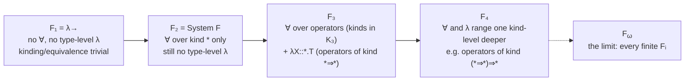

[[book-guidelines|↩ Back to guidelines]]

# Higher-Order Polymorphism (System $F^\omega$)

## Why this system has to exist

By Chapter 29 of *Types and Programming Languages* you have two independent upgrades to the simply typed lambda-calculus ($\lambda_\to$) sitting on the table, and neither one subsumes the other.

The first upgrade is **System F** (Chapter 23): you can abstract a *term* over a *type*. `pair = \X. \Y. \x:X. \y:Y. ...` lets one function work uniformly for every choice of `X` and `Y`. Polymorphism, in the "generic function" sense.

The second upgrade is $\lambda^\omega$ (Chapter 29): you can abstract a *type* over a *type*. `Pair = \Y. \Z. \/X. (Y->Z->X) -> X` is a function that computes a type from other types — a type-level function, formally called a **type operator**. `Array`, `Ref`, and `Pair` all live here.

Here's what breaks if you only have one and not the other. Suppose you want to build an abstract data type of pairs — hide the representation of pairs behind an interface, the way §24.2 hides a counter's representation behind `{∃X, ...}`. With only System F's existentials, the *hidden type* `X` has to be a plain type (kind `*`): a `Nat`, a `Bool→Bool`, whatever. But `Pair` isn't a plain type — it's a two-argument type constructor, something of kind `*⇒*⇒*` (feed it two types, get a type back). You cannot existentially hide a type constructor using only System F's existentials, because System F's quantifiers only ever range over kind `*`. And with only $\lambda^\omega$, you can build `Pair` itself, but you have no polymorphism at the term level to write a `pair`/`fst`/`snd` interface that works for *any* `X` and `Y` — you'd need to write separate `pair`, `fst`, `snd` functions for every concrete pair of types.

So the two upgrades need to be merged: term abstraction over types, and type abstraction over types, in the same system, with the quantifiers and abstractions at *both* levels able to range over *any* kind, not just `*`. That merge is **System $F^\omega$** (Girard, 1972) — "the" higher-order polymorphic lambda-calculus, and the last of the "pure" ([[Subtyping|subtyping]]-free) systems TAPL builds before turning to subtyping and [[Dependent-Types|dependent types]].

## The definition: System F, plus kinds, everywhere

$F^\omega$ is not a new design — it's System F and $\lambda^\omega$ overlaid, with one mechanical change threaded through both: every place a type variable gets bound (a type abstraction `λX.T`, or a quantifier `∀X.T`), it now carries a **kind annotation**, `X::K`, recording what *sort* of type it is (a proper type? a one-argument type operator? something higher still?). Figure 30-1 in the book gives the full syntax:

$$
\begin{aligned}
t ::=\ & x \mid \lambda x{:}T.t \mid t\,t \mid \lambda X{::}K.t \mid t\,[T] &&\text{terms}\\
T ::=\ & X \mid T{\to}T \mid \forall X{::}K.T \mid \lambda X{::}K.T \mid T\,T &&\text{types}\\
K ::=\ & * \mid K{\Rightarrow}K &&\text{kinds}
\end{aligned}
$$

Two of these four type-formers are genuinely new relative to plain System F: $\lambda X{::}K.T$ (a type-level abstraction, i.e. a type *operator*) and $T\,T$ (type-level application, applying one type to another). The other two, $\forall X{::}K.T$ and ordinary variables/arrows, are exactly System F's, except that the bound variable's kind no longer has to be $*$. As a convenient shorthand, $\forall X.T$ still means $\forall X{::}*.T$ — so every System F term is literally an $F^\omega$ term, just with the kind annotations elided to their default.

Kinds themselves have a satisfyingly small grammar: $*$ is "the kind of proper types" (types that can classify terms — `Bool`, `Nat→Nat`), and $K_1{\Rightarrow}K_2$ is "the kind of an operator that turns a $K_1$-kinded type into a $K_2$-kinded type." `Pair`, of kind $*{\Rightarrow}*{\Rightarrow}*$ (curried: $*\Rightarrow(*\Rightarrow*)$), takes a type and returns "a function from a type to a type." This is precisely the simply typed lambda-calculus recapitulated one level up — kinds are to type operators what types are to terms, and the **kinding relation** $\Gamma \vdash T :: K$ is a copy of $\lambda_\to$'s typing relation running over types instead of terms:

$$
\frac{X{::}K \in \Gamma}{\Gamma \vdash X :: K}\ \text{(K-TVar)}
\qquad
\frac{\Gamma, X{::}K_1 \vdash T_2 :: K_2}{\Gamma \vdash \lambda X{::}K_1.T_2 :: K_1{\Rightarrow}K_2}\ \text{(K-Abs)}
$$
$$
\frac{\Gamma \vdash T_1 :: K_{11}{\Rightarrow}K_{12} \qquad \Gamma \vdash T_2 :: K_{11}}{\Gamma \vdash T_1\,T_2 :: K_{12}}\ \text{(K-App)}
\qquad
\frac{\Gamma \vdash T_1 :: * \qquad \Gamma \vdash T_2 :: *}{\Gamma \vdash T_1{\to}T_2 :: *}\ \text{(K-Arrow)}
$$

with $\Gamma, X{::}K_1 \vdash T_2 :: * \implies \Gamma \vdash \forall X{::}K_1.T_2 :: *$ (K-All) closing the loop: a quantified type is itself always a *proper* type, no matter what kind its bound variable ranges over.

The typing rules (T-Var, T-Abs, T-App, T-TAbs, T-TApp, T-Eq) are textually almost identical to System F's — the only change is that T-Abs now demands $\Gamma \vdash T_1 :: *$ (the domain of a term-level function must be a proper type, not, say, a bare type operator you forgot to apply) and T-TAbs/T-TApp carry kind annotations. The one rule worth pausing on is **T-Eq**:

$$
\frac{\Gamma \vdash t : S \qquad S \equiv T \qquad \Gamma \vdash T :: *}{\Gamma \vdash t : T}\ \text{(T-Eq)}
$$

This is the rule that lets you re-type a term along a **type equivalence** $S \equiv T$ — and type equivalence is where $F^\omega$ stops being a light refactor of System F and starts requiring genuinely new machinery, because two types can now be equivalent *by computation*: $(\lambda X{::}*{\Rightarrow}*.\, X\;\mathrm{Nat})\,\mathrm{List} \equiv \mathrm{List}\;\mathrm{Nat}$, via the rule **Q-AppAbs**, $(\lambda X{::}K_{11}.T_{12})\,T_2 \equiv [X \mapsto T_2]T_{12}$ — a $\beta$-rule, but at the level of types. Typechecking $F^\omega$ therefore requires *evaluating types* to decide whether two of them denote the same thing. That single fact is the reason this chapter's metatheory is noticeably heavier than System F's.

**What breaks without kinds.** Drop the kind annotations and let quantifiers/abstractions bind untyped type variables, and you lose the ability to reject nonsense like $\forall X. X\;\mathrm{Nat}$ (applying a proper type as if it were an operator) at the type level — exactly the way dropping term-level types lets you write $5\;\mathrm{true}$. Kinding is what keeps "the types of types" from degenerating into an untyped calculus with all the same failure modes term-level typing was invented to prevent.

## Worked example: an abstract, generic pair

TAPL's own illustration (§30.2) is the smallest example that actually needs $F^\omega$'s combined power: an abstract data type of pairs, generic in both component types, with its representation hidden. The signature it should present to a client:

$$
\mathit{PairSig} = \{\exists\, \mathit{Pair}{::}*{\Rightarrow}*{\Rightarrow}*,\ \{\, \mathit{pair}: \forall X.\forall Y. X{\to}Y{\to}(\mathit{Pair}\;X\;Y),\ \ \mathit{fst}: \forall X.\forall Y. (\mathit{Pair}\;X\;Y){\to}X,\ \ \mathit{snd}: \forall X.\forall Y. (\mathit{Pair}\;X\;Y){\to}Y \,\} \}
$$

Read the existential carefully: it hides a type **operator**, not a type — `Pair::*⇒*⇒*` — using the higher-order existentials of Figure 30-2 (the same $\{\exists X, T\}$ construct from Chapter 24, generalized so `X` can carry any kind, not just $*$). The implementation instantiates `Pair` with the familiar Church-style encoding from §23.4:

```
pairADT =
  {*λX. λY. ∀R. (X→Y→R) → R,
   {pair = λX. λY. λx:X. λy:Y. λR. λp:X→Y→R. p x y,
    fst  = λX. λY. λp:∀R.(X→Y→R)→R. p [X] (λx:X. λy:Y. x),
    snd  = λX. λY. λp:∀R.(X→Y→R)→R. p [Y] (λx:X. λy:Y. y)}} as PairSig;
```

and, once unpacked, `let {Pair,pair} = pairADT in pair.fst [Nat] [Bool] (pair.pair [Nat] [Bool] 5 true)` evaluates to `5 : Nat` — a client that never sees that `Pair X Y` is secretly $\forall R.(X{\to}Y{\to}R){\to}R$. This is genuinely new relative to Chapter 24: the *abstract type* of the ADT is itself parametric.

**Rust [[Bounded-Quantification#Grounding|grounding]] — this is exactly a generic newtype behind a trait.** Rust doesn't have first-class type operators or existentials in the surface language, but the ADT-hiding idea is precisely what a `trait` with an associated, opaque behavior gives you, and the "kind" distinction ($*$ vs $*\Rightarrow*\Rightarrow*$) is precisely the distinction between a concrete type and a generic type constructor (`struct Pair<X,Y>` has "kind" `*⇒*⇒*` in Rust's own type system, informally — this is the itch that Rust's unstable/proposed generic associated types and higher-kinded polymorphism keep scratching):

```rust
trait PairSig {
    type Pair<X, Y>;
    fn pair<X, Y>(x: X, y: Y) -> Self::Pair<X, Y>;
    fn fst<X, Y>(p: Self::Pair<X, Y>) -> X;
    fn snd<X, Y>(p: Self::Pair<X, Y>) -> Y;
}

struct ChurchPair; // the hidden representation, never named by clients

// (X, Y) is the concrete representation; a real Church encoding would use a
// closure type here, but that requires unstable existential `impl Trait`
// in type position — the concrete struct is the pragmatic stand-in.
impl PairSig for ChurchPair {
    type Pair<X, Y> = (X, Y);
    fn pair<X, Y>(x: X, y: Y) -> (X, Y) { (x, y) }
    fn fst<X, Y>(p: (X, Y)) -> X { p.0 }
    fn snd<X, Y>(p: (X, Y)) -> Y { p.1 }
}
```

`type Pair<X, Y>` is a **generic associated type** — a type operator of kind $*{\Rightarrow}*{\Rightarrow}*$ living inside a trait, which is Rust's nearest approximation to $F^\omega$'s "existentially quantify over a type of kind $K$." The kind annotation `X::K1⇒K2` in Figure 30-1 is, structurally, exactly what Rust's trait-solver machinery tracks as a GAT's arity and parameter kinds when it checks that `Self::Pair<X, Y>` is well-formed wherever it's used — a well-formedness check that is, under the hood, running a version of K-App.

## Properties: why preservation now needs a confluence proof

For $\lambda_\to$ and System F, preservation and progress were comparatively short inductions. For $F^\omega$, TAPL spends most of §30.3 building up machinery *before* the two main theorems, and the reason is entirely due to T-Eq: because subterms of a well-typed term can be re-typed along type equivalence at arbitrary points in the derivation, the proofs need a firm handle on what type equivalence actually *is* — otherwise the inversion lemmas that preservation/progress depend on ("if $t$ has an arrow type, is $t$ really shaped like an abstraction?") have no traction.

**Parallel reduction, and why it's the right tool.** Ordinary type equivalence $\equiv$ (Figure 30-1: Q-Refl, Q-Symm, Q-Trans, plus congruence rules and Q-AppAbs) is symmetric and transitive — convenient to state, unpleasant to do induction over, because a proof of $S \equiv T$ can interleave symmetry and transitivity at arbitrary depths. TAPL instead defines **parallel reduction**, $S \Rrightarrow T$ (Figure 30-3): drop symmetry and transitivity, and let QR-AppAbs fire *while simultaneously* reducing inside the abstraction's body and the argument:

$$
\frac{S_{12} \Rrightarrow T_{12} \qquad S_2 \Rrightarrow T_2}{(\lambda X{::}K_{11}.S_{12})\,S_2 \ \Rrightarrow\ [X \mapsto T_2]T_{12}}\ \text{(QR-AppAbs)}
$$

This buys a **single-step diamond property** (Lemma 30.3.8: if $S \Rrightarrow T$ and $S \Rrightarrow U$, some $V$ has $T \Rrightarrow V$ and $U \Rrightarrow V$), which tiles up into **confluence** of the reflexive-transitive closure $\Rrightarrow^*$ (Lemma 30.3.9) — the Church–Rosser property for type-level reduction. Confluence in turn gives the crucial bridge back to $\equiv$: if $S \equiv T$, then $S$ and $T$ share a common reduct (Corollary 30.3.11, via Lemma 30.3.5's $\equiv\ =\ \Rrightarrow^{*\pm}$ and Proposition 30.3.10).

**What breaks without confluence.** Confluence is exactly what makes "reduce both sides to normal form and compare" a *sound* way to decide type equivalence. Without it, two types could be equivalent by some derivation, yet reduce to syntactically different, non-reconcilable normal forms — and an equivalence checker built on [[Normalization|normalization]] would then either loop forever looking for a match that provably doesn't exist as a shared term, or unsoundly declare inequivalent types equal by picking the wrong reduction path. Confluence guarantees that *however* you reduce, you can always still reach a common answer — this is what licenses building a decision procedure for $\equiv$ purely out of "normalize and compare," rather than having to search the full, ambiguous derivation space of $\equiv$ itself.

**Preservation and progress, from the shape lemmas up.** With confluence in hand, Lemma 30.3.12 ("preservation of shapes under reduction": if $S_1{\to}S_2 \Rrightarrow^* T$ then $T$ is itself an arrow type with matching reducts, and likewise for $\forall$) becomes provable, and *that* is what feeds the **inversion lemma** (30.3.13): if $\Gamma \vdash \lambda x{:}S_1.s_2 : T_1{\to}T_2$, then $T_1 \equiv S_1$ and $\Gamma, x{:}S_1 \vdash s_2 : T_2$ — i.e., an abstraction's assigned type, however many T-Eq steps were used to reach it, really is arrow-shaped in a way that matches the abstraction's own domain. **Theorem 30.3.14 (Preservation)** and **Theorem 30.3.16 (Progress)** then go through by essentially the same case analysis as $\lambda_\to$'s originals, leaning on inversion (for preservation's E-AppAbs case) and a **canonical forms lemma** (30.3.15 — a closed value of arrow type is an abstraction; of $\forall$ type, a type abstraction) for progress. The canonical forms proof itself is a small gem: it rules out a type abstraction masquerading as an arrow-typed value by chaining T-Eq steps down to $\forall X{::}K_{11}.S_{12} \equiv T_1{\to}T_2$, invoking Corollary 30.3.11 to get a common reduct $U$, and then Lemma 30.3.12 to observe that $U$ would need *both* a $\forall$ and an $\to$ as its outermost constructor — a contradiction, exactly because reduction preserves outermost shape.

**Decidability, sketched.** TAPL doesn't give a full algorithm (it defers to the pattern already built for $F_{<:}$ in Chapter 28) but the shape of it is: (1) kinding is syntax-directed, hence trivially decidable; (2) drop T-Eq from the typing rules the way T-Sub was dropped for [[Bounded-Quantification|bounded quantification]], and patch the two places its absence bites — the left-hand side of an application, where you may need to reduce a calculated type until an arrow or $\forall$ appears at the head (an "exposure" step, usually implemented as *weak head reduction* — reduce only the leftmost, outermost redex, stopping as soon as a concrete constructor is exposed — rather than reducing to full normal form), and the argument-type-matches-domain check, implemented by normalizing both sides and comparing syntactically. Termination of this reduction is guaranteed only for well-kinded types (Proposition 30.3.19 ensures every derivable type is well-kinded whenever the context is), because $F^\omega$'s type-level language is expressive enough to encode divergent terms like $\Omega$ if you don't respect kinding.

## The hierarchy: $F_1 \subset F_2 \subset F_3 \subset \cdots \subset F^\omega$

TAPL closes the "pure" development (§30.4) by making precise the sense in which $\lambda_\to$ and System F both sit *inside* $F^\omega$, via a stratification by kind depth:

$$
K_1 = \varnothing \qquad K_{i+1} = \{*\} \cup \{J{\Rightarrow}K \mid J \in K_i,\ K \in K_{i+1}\} \qquad K_\omega = \bigcup_{1 \le i} K_i
$$



$F_1$ is $\lambda_\to$ itself, just dressed in $F^\omega$'s clothes — kinding and equivalence are present but degenerate (every well-formed type has kind $*$, and is equivalent only to itself). $F_2$ is exactly System F — its place at stratum 2 is *why* System F is traditionally called "the second-order lambda-calculus." $F_3$ is the first level where kinding and equivalence become non-trivial: it has quantification over operators and abstraction over proper types (kind $*{\Rightarrow}*$). Pierce notes, with evident fondness for the observation, that essentially every example program in the entire book lives in $F_3$ (the `Object`/`Class` encodings of the book's final case-study chapter technically need $F_4$, since their argument has kind $(*{\Rightarrow}*){\Rightarrow}*$) — and that restricting a language to $F_3$ buys almost no simplicity over full $F^\omega$, since the hard parts (operator abstraction, type equivalence via reduction) are already present at that level.

## The Barendregt cube, briefly

Reading back through the four forms of abstraction this book has built up — term-over-term ($\lambda_\to$), term-over-type (System F), type-over-type ($\lambda^\omega$), and type-over-term (dependent types, taken up next in §30.5 and the dedicated *Dependent Types* article) — TAPL closes the chapter by pointing out these aren't an arbitrary list: they're the three independent axes of the **Barendregt cube**, and every combination of "on/off" along those three axes names one corner of an actual cube of type systems:

<svg viewBox="0 0 460 320" xmlns="http://www.w3.org/2000/svg" font-family="sans-serif" font-size="15">
  <!-- back face -->
  <polygon points="90,240 90,80 260,40 260,200" fill="none" stroke="#8a8a8a" stroke-width="1.5"/>
  <!-- front face -->
  <polygon points="150,280 150,120 320,80 320,240" fill="none" stroke="#8a8a8a" stroke-width="1.5"/>
  <!-- connectors -->
  <line x1="90" y1="240" x2="150" y2="280" stroke="#8a8a8a" stroke-width="1.5"/>
  <line x1="90" y1="80" x2="150" y2="120" stroke="#8a8a8a" stroke-width="1.5"/>
  <line x1="260" y1="40" x2="320" y2="80" stroke="#8a8a8a" stroke-width="1.5"/>
  <line x1="260" y1="200" x2="320" y2="240" stroke="#8a8a8a" stroke-width="1.5"/>
  <!-- vertices -->
  <circle cx="90" cy="240" r="4" fill="#4a90d9"/>
  <circle cx="90" cy="80" r="4" fill="#4a90d9"/>
  <circle cx="260" cy="40" r="4" fill="#4a90d9"/>
  <circle cx="260" cy="200" r="4" fill="#d9784a"/>
  <circle cx="150" cy="280" r="4" fill="#4a90d9"/>
  <circle cx="150" cy="120" r="4" fill="#d9784a"/>
  <circle cx="320" cy="80" r="4" fill="#d9784a"/>
  <circle cx="320" cy="240" r="4" fill="#c0392b"/>
  <!-- labels -->
  <text x="15" y="245" fill="#666666">λ→</text>
  <text x="15" y="75" fill="#666666">λω</text>
  <text x="265" y="35" fill="#666666">F</text>
  <text x="265" y="220" fill="#666666">LF (λP)</text>
  <text x="100" y="305" fill="#666666">F₃…Fᵢ (λω2 family)</text>
  <text x="60" y="125" fill="#666666">λPω</text>
  <text x="325" y="75" fill="#666666">λP2</text>
  <text x="325" y="260" fill="#c0392b" font-weight="bold">CC</text>
  <text x="150" y="235" fill="#4a90d9" font-size="13">Fω</text>
  <text x="20" y="20" fill="#8a8a8a" font-size="13">axes: term-over-type (→F), type-over-type (→λω), type-over-term (→LF)</text>
</svg>

The three edges leaving $\lambda_\to$ are the three abstractions again, now named as axes: toward $F$ is "let terms depend on types" (polymorphism), toward $\lambda^\omega$ is "let types depend on types" (type operators), toward $LF$ is "let types depend on terms" (dependent types). $F^\omega$ sits at the corner reached by turning on the first two axes and leaving the third off; the corner with all three axes on is the **Calculus of Constructions** (CC) — Coquand and Huet's system, and the ancestor of Coq's and Lean's own kernels. TAPL is explicit that it will not build CC or its neighbors in this book (§30.5's "Going Further" is a survey, not a construction) — that material, and the length-indexed-list / $\Pi$-type example that motivates it, belongs to the dedicated *Dependent Types* article; the one thing worth carrying over here is just the shape of the map: $F^\omega$ is one specific, fully-worked corner of a bigger cube, not an endpoint the way it might read in isolation.

## Grounding the metatheory: kinding as a second type system

**Lean — the most literal correspondence, because $F^\omega$'s design *is* Lean's, one level down.** Lean's own kernel has a kind-like hierarchy baked in: `Type` classifies ordinary types the way kind $*$ classifies $F^\omega$'s proper types, and a type operator like `List : Type → Type` is a term of "kind" `Type → Type` in exactly the sense $\lambda^\omega$/$F^\omega$ mean it — Lean just doesn't need a separate kind-annotation syntax because it treats kinds as themselves inhabitants of (higher) types, folding kinding into the same judgment as typing. More importantly, T-Eq's use of type equivalence $\equiv$ is *exactly* what Lean's `isDefEq` does at every elaboration step: given two type expressions that might not be syntactically identical, reduce both (Lean uses `whnf` — weak head normal form — the same "reduce until a constructor is exposed, don't force full normalization" strategy TAPL sketches for $F^\omega$'s decidability procedure) and compare. `List Nat` and `(fun X => List X) Nat` are `isDefEq` in Lean for the same reason $(\lambda X{::}*{\Rightarrow}*.\,X\;\mathrm{Nat})\,\mathrm{List}$ reduces to the same normal form as `List Nat` here — Q-AppAbs, running silently, every time Lean's elaborator needs to check that two types "are the same" without you having written a proof of it. If you're building the elaborator described in the standing learning goals, this is the single clearest place in TAPL where the book's formal machinery *is* naming the mechanism your `isDefEq`/normalizer will need to implement.

```lean
-- a genuine type operator of kind *⇒*⇒*, exactly PairPair's shape
def Pair (X Y : Type) : Type := (R : Type) → (X → Y → R) → R

def mkPair {X Y : Type} (x : X) (y : Y) : Pair X Y :=
  fun _ p => p x y

-- `Pair Nat Bool` and `(fun X Y => (R:Type)→(X→Y→R)→R) Nat Bool` are
-- `isDefEq` — Lean's kernel reduces both to whnf and compares, which is
-- Q-AppAbs plus confluence, executed as an algorithm rather than stated
-- as a theorem.
example : Pair Nat Bool = ((R : Type) → (Nat → Bool → R) → R) := rfl
```

**Rust — the decidability procedure, as a compiler pass.** The part of §30.3 worth actually implementing is the "exposure via weak head reduction, then compare normal forms" typechecking strategy — it is a small, self-contained normalizer over a type-level AST:

```rust
enum Kind { Star, Arrow(Box<Kind>, Box<Kind>) }

enum Ty {
    Var(String),
    Arrow(Box<Ty>, Box<Ty>),
    Forall(String, Kind, Box<Ty>),
    TAbs(String, Kind, Box<Ty>),   // λX::K.T  — the type operator itself
    TApp(Box<Ty>, Box<Ty>),        // T T      — type-level application
}

// weak head reduction: expose the outermost constructor, stop as soon
// as it isn't an application-of-an-abstraction. Mirrors TAPL's exposure
// relation, used to decide T-App/T-TApp's "is this really arrow/∀-shaped?"
fn whnf(t: Ty) -> Ty {
    match t {
        Ty::TApp(t1, t2) => match whnf(*t1) {
            Ty::TAbs(x, _, body) => whnf(subst(&x, &t2, *body)), // Q-AppAbs
            t1_whnf => Ty::TApp(Box::new(t1_whnf), t2),
        },
        other => other,
    }
}

// type equivalence, decided by normalizing both sides and comparing —
// sound only because parallel reduction is confluent (30.3.9): however
// you reduce, you land on the same answer, so whnf-then-compare can't
// miss an equivalence that a fuller reduction would have found.
fn type_equiv(s: Ty, t: Ty) -> bool { alpha_eq(&normalize(s), &normalize(t)) }
```

The comment on `type_equiv` is the load-bearing point: without Lemma 30.3.9, this function would be *unsound* — two provably-equivalent types could normalize along different reduction strategies to non-identical results, and "normalize and compare" would silently reject well-typed programs (or, worse, depend on reduction-order to accept them). Confluence is precisely the theorem that makes this the right implementation strategy rather than a heuristic one.

**Python — a five-line sketch of the kinding pass itself**, useful mainly because it's short enough to see that kinding really is $\lambda_\to$-typing one level up:

```python
def kind_of(ctx, ty):
    match ty:
        case ("var", x): return ctx[x]
        case ("arrow", t1, t2):
            assert kind_of(ctx, t1) == "*" and kind_of(ctx, t2) == "*"
            return "*"
        case ("abs", x, k1, t2):
            return (k1, kind_of({**ctx, x: k1}, t2))   # K1 => K2
        case ("app", t1, t2):
            k1 = kind_of(ctx, t1)
            assert k1[0] == kind_of(ctx, t2)            # K-App's domain check
            return k1[1]
```

## Where this leads

$F^\omega$ depends directly on two prior chapters — System F (Ch. 23) for the term-level quantifiers, and $\lambda^\omega$/type operators (Ch. 29) for the type-level ones — and it's the last "pure" polymorphic system TAPL builds before subtyping re-enters the picture: Chapter 31 adds bounded quantification to $F^\omega$'s kinds and types to get $F^\omega_{<:}$, which becomes the setting for the book's final case study of [[Recursive-Types#Purely functional objects|purely functional objects]] (Chapter 32). Within this chapter itself, the parallel-reduction/confluence apparatus built for preservation and progress is not a one-off proof trick — it is the *general* pattern for adding any form of computation at the type level (type operators now, but the same pattern recurs for dependent types' term-level computation inside types, and for singleton kinds in module systems) and is worth recognizing on sight elsewhere in the type-theory literature.

For the two standing engineering targets: the confluence-then-normalize-then-compare pipeline in §30.3 is close to a direct blueprint for a Rust verifier's type-equality check on any type-level computation (associated types, const-generic expressions) — get confluence (or an equivalent termination argument) first, and "normalize both sides, compare" becomes provably sound rather than merely plausible. And the identification of T-Eq/Q-AppAbs with Lean's `isDefEq`/`whnf` is exactly the elaborator-facing lesson: definitional equality checking during elaboration *is* type-level parallel reduction, decided the same way TAPL decides it here, just running silently every time you write two type expressions that a human would call "obviously the same thing."
