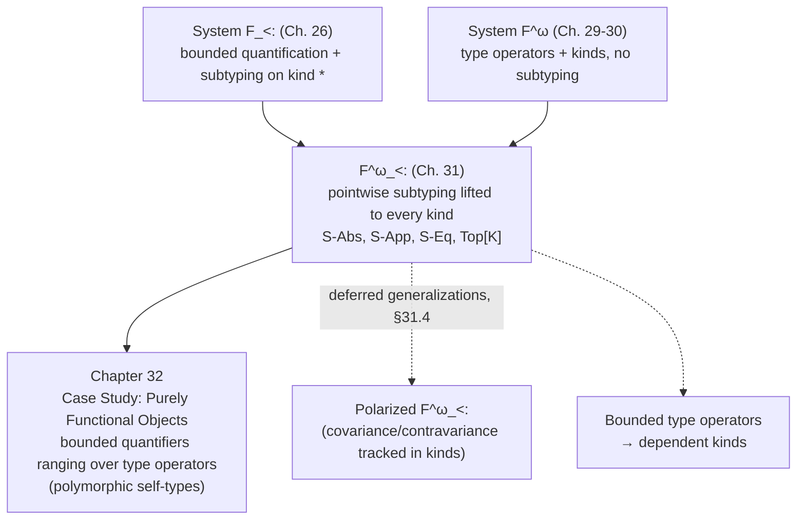

[[book-guidelines|↩ Back to guidelines]]

## Why this chapter exists

You've now got two separate extensions of the simply typed lambda-calculus sitting on the table: **[[Subtyping|subtyping]]** (Chapter 15 onward — some types are "more specific" than others, and a value of the more specific type can be used wherever the less specific one is expected) and **type operators** (Chapter 29/30 — functions *from types to types*, like `List` or `Pair`, classified by kinds instead of types). Each one on its own is well understood. This chapter asks the obvious next question: what happens when you need both at once?

You need both at once surprisingly often. If your language has generics (`List<T>`) and subtyping (`Dog <: Animal`), you immediately want to know: is `List<Dog>` a subtype of `List<Animal>`? Is a type operator `F` ever "more specific" than another operator `G`, not just at one instantiation, but as a matter of definition? Chapter 32's case study — encoding objects with polymorphic, subtypeable "self types" — needs exactly this: a bounded quantifier ranging over *type operators*, not just over ordinary types. So this chapter builds the minimal system that supports that, called $F^\omega_{<:}$ ("F-omega-sub"): System $F_{<:}$ ([[Bounded-Quantification|bounded quantification]] + subtyping, Chapter 26) extended with the type operators and kinds of $F^\omega$ (Chapter 29/30).

Pierce is explicit that this is not the deepest or most general version of the idea — it's "one of the simplest," chosen because the case study in Chapter 32 doesn't need anything fancier. Keep that in mind: the chapter is deliberately narrow, and it says so.

**What breaks without this:** without lifting subtyping to type operators, a language with both generics and subtypes has an expressiveness gap — you can subtype *proper types* (kind `*`) but a bounded quantifier like $\forall X <: F. \, T$ where `F` itself is a type operator (kind $K_1 \Rightarrow K_2$) has no meaning, because "subtype of a type operator" was never defined. Any encoding that wants a bound like "any operator that behaves like `Comparable` pointwise" is simply inexpressible.

## 31.1 — Lifting subtyping to type operators, pointwise

### The core idea before the rule

Suppose `S` and `T` are type operators of kind $* \Rightarrow *$ — say `S = λX. Top → X` and `T = λX. X → Top`. When should we say `S <: T`? There's no structural notion of "subtype" for a bare function-from-types-to-types the way there is for `→` (arrow types are already handled by variance rules on their domain/codomain). But there *is* a natural test: apply both operators to the *same* argument `U` and check whether the resulting proper types are subtypes. If `S U <: T U` for every `U`, then `S` deserves to count as a subtype of `T`. This is exactly **pointwise** subtyping — the same idea as saying two functions `f, g : A -> B` are "ordered" if `f(a) <= g(a)` for every `a`.

Concretely: `Top → U` is a subtype of `U → Top` for every `U` (contravariant domain: `Top` is the *weakest* requirement you could put on an argument, so it's fine to accept a function that's less picky about its input; covariant codomain: returning `Top` is the *weakest* promise, but here it's on the "supertype" side — check the arrow-subtyping rule `S-Arrow` from Chapter 15 to see why this direction works out). So indeed `λX. Top→X <: λX. X→Top`.

### The formal rules

Instead of quantifying over every possible `U` explicitly, TAPL uses a trick you'll see throughout the book: introduce a *fresh abstract variable* `X` into the context and check the body once, under the assumption that `X` could be anything.

$$
\dfrac{\Gamma, X \;\vdash\; S <: T}{\Gamma \vdash \lambda X.\, S <: \lambda X.\, T} \quad \text{(S-Abs)}
$$

This says: to compare two operator bodies, extend the context with an unconstrained `X` and compare the bodies as ordinary types. "Unconstrained" is what licenses generalizing over *every* possible argument at once — this is definitionally identical to how `S-All` (subtyping for $\forall$) and universal generalization in general work: prove something about an arbitrary, opaque element and get "for all" for free.

The companion rule handles the other direction — given two operators already known to be ordered, applying both to the *same* argument preserves the order:

$$
\dfrac{\Gamma \vdash F <: G}{\Gamma \vdash F\,U <: G\,U} \quad \text{(S-App)}
$$

The parenthetical caveat matters: this rule only fires when both operators are applied to the *identical* `U`. Knowing `F <: G` tells you nothing about how `F U_1` compares to `G U_2` for *different* arguments `U_1 \ne U_2` — that would require tracking whether `F`/`G` are monotone (covariant) or antitone (contravariant) in their argument, which is exactly the refinement deferred to §31.4.

**What breaks without S-App specifically:** without it, having established `F <: G` at the operator level buys you nothing at any call site — you'd be unable to derive `F Nat <: G Nat` even though intuitively that should follow immediately. The whole point of lifting subtyping to operators is so that operator-level facts transfer down to their applications.

### `Top[K]`: a maximal element at every kind

Ordinary subtyping has a top of the lattice: `Top`, the type every other type is a subtype of (`S-Top`). Once you have subtyping at higher kinds, you want a `Top` at *every* kind — a maximal operator of kind $K_1 \Rightarrow K_2$, for instance, so that "unbounded" higher-kinded quantification can still be phrased as bounded quantification with the "no real bound" bound. TAPL defines this by induction on kind structure:

$$
\mathrm{Top}[*] = \mathrm{Top}, \qquad \mathrm{Top}[K_1 \Rightarrow K_2] \;\overset{\text{def}}{=}\; \lambda X{::}K_1.\, \mathrm{Top}[K_2]
$$

A short induction (using S-Abs and S-Top) shows $\Gamma \vdash S <: \mathrm{Top}[K]$ for every well-kinded `S :: K`. This is the load-bearing trick that lets the chapter avoid inventing a *separate* syntax for "bounded vs. unbounded" operator abstraction: an unbounded higher-kinded quantifier $\forall X{::}K_1.\, T_2$ is just notation for the bounded quantifier $\forall X <: \mathrm{Top}[K_1].\, T_2$ — same mechanism as ordinary $F_{<:}$, just instantiated at a fancier kind.

**Rust/Lean [[Bounded-Quantification#Grounding|grounding]].** There's no first-class analogue of "kind-indexed Top" in Rust's trait system — Rust doesn't have subtyping between generic type constructors as a general mechanism (variance for lifetimes and a few built-in cases, yes; user-definable pointwise subtyping between arbitrary `F<_>` and `G<_>`, no). The closest mental model is a hypothetical "universal trait bound" `dyn Any`-at-every-arity: imagine wanting "any type constructor `F: Type -> Type`" as a bound on a generic-over-generics parameter — that's precisely what `Top[* ⇒ *]` gives you formally. In Lean, this maps cleanly onto **universe/`Sort` polymorphism plus subsingleton coercion patterns**, but the closer correspondence is to *bounded implicit metavariables*: when Lean's elaborator needs "the weakest possible constraint" on a metavariable of some higher type, it's doing the job `Top[K]` does here — supplying a maximal (least-informative) bound so unification always has something to fall back on.

## 31.2 — The full system: kinding, equivalence, and subtyping over operators

Figure 31-1 (reproduced from the book) assembles everything: it is $F^\omega$'s syntax and kinding (terms, types, kinds, `K-Top`/`K-TVar`/`K-Abs`/`K-App`/`K-Arrow`/`K-All`) plus the type-equivalence relation `≡` (reflexive/symmetric/transitive congruence closure including the crucial computation rule `(λX::K₁₁.T₁₂) T₂ ≡ [X ↦ T₂]T₁₂`, `Q-AppAbs` — beta-reduction on types) plus subtyping (`S-Abs`, `S-App`, `S-Eq`, `S-Trans`, `S-Top`, `S-Arrow`, `S-TVar`, `S-All`) plus typing (`T-Var` through `T-Sub`).

Two "fine points" the book flags explicitly, worth internalizing rather than skimming:

1. **Contexts only ever bind `X<:T`, never `X::K`.** Even though the *term* syntax has two binder forms — `λX::K.T` (operator abstraction, an unbounded kind annotation) and `∀X<:T.T` / the subtype-bound style — once a variable crosses the turnstile into the context, it's always recorded as `X<:T`. Concretely, `K-Abs` and `S-Abs` both convert an incoming `X::K₁` into `X<:Top[K₁]` when extending `Γ`. This is exactly the "unbounded is bounded-by-Top" unification from §31.1 showing up mechanically in the rules themselves, not just as a notational abbreviation. It also means the context data structure the typechecker maintains never needs a second binder variant — one uniform representation.

2. **`S-Refl` and `T-Eq` are dropped as primitive rules**, because they're now *derivable*: `S-Refl` (every type is a subtype of itself) follows from `Q-Refl` (every type is equivalent to itself) plus `S-Eq`; `T-Eq` (retyping a term along a type-equivalence) is derivable from `T-Sub` plus `S-Eq`. This is a nice bit of formal hygiene — fewer primitive rules to prove metatheorems about, same expressive power.

**Key new rule — `S-Eq`**, connecting equivalence and subtyping:

$$
\dfrac{\Gamma \vdash S :: K \quad \Gamma \vdash T :: K \quad S \equiv T}{\Gamma \vdash S <: T} \quad \text{(S-Eq)}
$$

The motivating idea is simple and important: if `S` and `T` are *definitionally equivalent* (same normal form under type-level beta-reduction — `S ≡ T`), they have exactly the same members, so of course they're subtypes of each other in both directions. Without `S-Eq`, subtyping and equivalence would be two disconnected relations, and you'd be unable to use, say, `(λX.X) Nat` anywhere the subtyping rules expect `Nat` outright.

**Rust/Lean [[ML-Implementation-Techniques#Grounding|grounding]].** `S-Eq` is precisely the same move as Lean's `isDefEq` falling back to unfolding definitions when a literal syntactic match fails — two terms that beta/delta-reduce to the same normal form are treated as interchangeable by the kernel without the user ever invoking an explicit cast. In Rust there's no operator-level type-equivalence relation to speak of (Rust's type aliases are pure syntactic sugar resolved before any "subtyping" question is even asked), so this piece of the system doesn't have a faithful Rust analogue — it's a place where the elaborator-project connection (Lean) is the load-bearing one, not the compiler/verifier project (Rust).

### Worked exercise (31.2.1) as a sanity check

The book poses, in context $\Gamma = B<:\mathrm{Top},\, A<:B,\, F<:\mathrm{Id}$ (where $\mathrm{Id} = \lambda X.X$), a list of candidate subtyping judgments to test your grip on the rules — e.g. is $\Gamma \vdash \lambda X.X <: \lambda X.\mathrm{Top}$ derivable? Yes: by `S-Abs`, reduce to $\Gamma, X \vdash X <: \mathrm{Top}$, which holds by `S-Top`. Is $\Gamma \vdash F\,B <: B$ derivable? Yes, and this is exactly the subtle case the next section is built around — you need `S-TVar` to promote `F` to its bound `Id`, `S-App` to get $F\,B <: \mathrm{Id}\,B$, then `S-Eq` (since $\mathrm{Id}\,B \equiv B$ by `Q-AppAbs`), then `S-Trans` to chain them. That derivation is worth doing by hand once — it's a compressed preview of §31.3's main point.

## 31.3 — The metatheoretic wrinkle: `S-Eq` interacting with transitivity

This is the section with actual teeth, and it's short precisely because Pierce isn't proving anything here — he's flagging *why* the proofs (done elsewhere, in Pierce & Steffen 1994 and Compagnoni 1994) are hard.

Recall from Chapter 28 (bounded quantification metatheory) that a **syntax-directed** presentation of subtyping — one where you can always tell which rule to apply just by looking at the shape of the judgment, without guessing — is what you actually want for an *algorithm*. The obstacle there was that `S-TVar` (promote a variable to its declared bound) combined with `S-Trans` (transitivity) in derivations that aren't syntax-directed on their face; TAPL had to show these interactions could always be eliminated down to a well-founded, terminating checking procedure.

In $F^\omega_{<:}$, a *second* rule joins `S-TVar` in causing this trouble: `S-Eq`. The book's example makes this concrete. In $\Gamma = X<:\mathrm{Top},\, F<:\lambda Y.Y$, the judgment $\Gamma \vdash F\,X <: X$ is provable:

$$
\dfrac{\dfrac{\Gamma \vdash F <: \lambda Y.Y}{\Gamma \vdash F\,X <: (\lambda Y.Y)\,X}\;\text{(S-App)} \qquad \dfrac{}{\Gamma \vdash (\lambda Y.Y)\,X <: X}\;\text{(S-Eq)}}{\Gamma \vdash F\,X <: X} \; \text{(S-Trans)}
$$

Why is this a problem, not just a curiosity? Because the natural first idea for building a decision procedure — "normalize every type to beta-normal form up front, then all the equivalence business disappears" — **doesn't work here**. The expression `F X` is *not* a redex as written (`F` is a variable, not a lambda) — it only *becomes* one during the subtyping check itself, at the moment `S-TVar` promotes `F` to its bound `λY.Y`. Normalizing once at the start can't see that promotion coming, because it hasn't happened yet.

**What breaks without addressing this:** a typechecker that normalizes eagerly at the start and then never re-normalizes will fail to see that `F X` and `X` are related, and will reject a program that should typecheck. TAPL's fix, stated but not developed in full: normalize once at the start of a subtype check, *and* re-normalize whenever a promotion (à la `S-TVar`) exposes a new redex.

**This is exactly the shape of a problem your Rust verifier will hit.** If your checker's subtype/equality routine ever promotes an abstract variable to a concrete bound mid-derivation (which any bounded-polymorphism or trait-object-with-supertrait-bound checker will need to do), you cannot get away with normalize-once-at-parse-time. You need re-[[Normalization|normalization]] triggered by promotion events — structurally, this is the same "definitional equality can hide behind a bound that hasn't been looked up yet" problem Lean's `whnf` (weak-head-normal-form reduction) plus `isDefEq` solve by interleaving unfolding with comparison rather than doing a single normalization pass. If you're building normalization-based subtype checking for the Hoare-triple verifier, budget for this: naive single-pass normalization is provably insufficient the moment bounded polymorphism is in the mix.

## 31.4 — Covariance, contravariance, and further generalizations (notes)

The chapter closes with pointers to how the system can be made richer, each flagged as a genuine complexity/expressiveness tradeoff rather than a free upgrade:

- **Cross-argument subtyping via polarity.** `S-App` as given only compares `F U` to `G U` — same argument on both sides. To get `F S <: G T` when `S <: T` and `S \neq T`, you need to know whether `F`/`G` are **covariant** (order-preserving: `S <: T` implies `F S <: F T` — think `List<Dog> <: List<Animal>` if `List` is treated as covariant, matching Kotlin's `out`-variance or Rust's covariant lifetime parameters) or **contravariant** (order-reversing: `S <: T` implies `F T <: F S` — think function parameter positions, matching Rust's contravariance in `fn(T) -> _` argument position, or Kotlin's `in`-variance). Formally:
$$
\dfrac{\Gamma \vdash S <: T \quad F \text{ is covariant}}{\Gamma \vdash F\,S <: F\,T} \qquad\qquad \dfrac{\Gamma \vdash S <: T \quad F \text{ is contravariant}}{\Gamma \vdash F\,T <: F\,S}
$$
  Then $F\,S <: G\,T$ follows from $F <: G$, $S <: T$, and $G$ covariant, by chaining through transitivity. The cost: you now need to *track polarity annotations on type variables* through the kind system, and *restrict* which operators a higher-order quantifier is even allowed to range over based on those polarities. This is precisely the variance-annotation machinery Rust's borrow checker and `PhantomData<fn(T) -> T>` markers encode by hand for exactly the same reason — Rust doesn't infer variance for user types the way this extension would infer/check polarity for type operators, it requires you to declare it structurally.
- **Bounded type operators**, i.e., generalizing $\lambda X{::}K_1.T_2$ to $\lambda X <: T_1. T_2$ (a bound that's an actual type, not just a kind). This is the "obvious" symmetric completion — quantifiers went from unbounded to bounded when $F_{<:}$ was built from System F, so why not operators too? The catch: it forces the *kind* system itself to include dependent-ish kinds like $\forall X<:T_1.K_2$, creating a mutual dependency between kinding and subtyping that "requires significant work to untangle" (citing Compagnoni & Goguen). This is a preview of the dependent-types tension flagged back in §30.5 — bounds that mention terms/types inside kind-level structure start blurring the type/kind/term stratification the whole book has otherwise kept clean.
- Extensions with **[[Dependent-Types|dependent types]]** (Chen & Longo 1996, Zwanenburg 1999) push further in the same direction §30.5 gestured at.

None of these are developed in TAPL itself — they're explicitly "the reader is pointed elsewhere" notes, which is honest: this chapter's job was only ever to supply exactly enough machinery for Chapter 32's case study.

## Where this leads

Structurally, this chapter is a *composition* chapter, not a new-idea chapter — it takes two pieces the book already built in isolation ($F_{<:}$'s subtyping, $F^\omega$'s operators/kinds) and shows the pointwise construction that glues them, immediately setting up the one thing Chapter 32 actually needs: a bounded quantifier whose bound is a type operator.

For the two standing projects: the **`S-Eq`/transitivity/promotion interaction in §31.3** is the most load-bearing thing here for the Rust verifier — it's a direct warning that a normalize-then-compare architecture for subtype/definitional-equality checking is unsound once bounded polymorphism lets a variable's bound expose new reducible structure, and the fix (re-normalize on promotion) is a concrete design constraint to build in from the start rather than patch in later. For the elaborator project, `S-Eq`'s "definitional equivalence collapses to a subtyping base case" is the same move Lean's kernel makes when `isDefEq` unifies two terms up to unfolding — worth remembering as one more place the book's formalism is quietly doing the elaborator's `isDefEq` job without naming it that.
